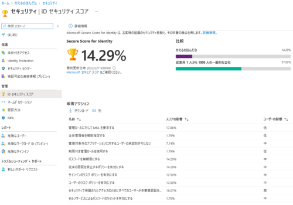
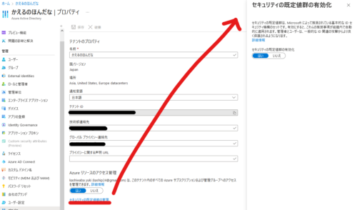
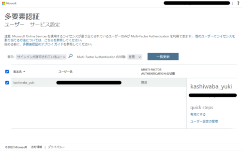
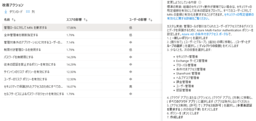
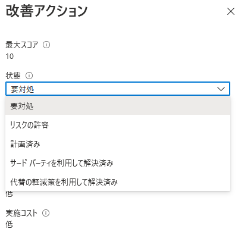
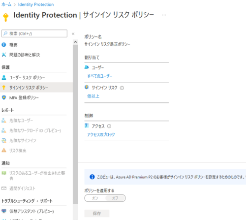
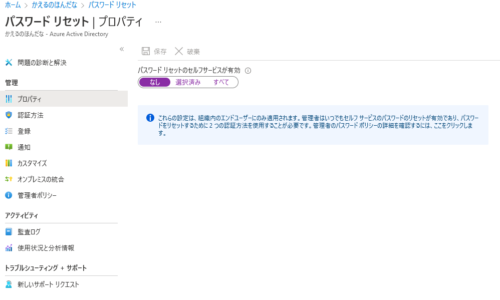

ちょっと最近突然Azureで遊びたくなったのですが、マシンを建てたりする前にセキュリティ関連の推奨事項を確認しておくことにしました。

そこで参照したのがIDセキュリティスコアというサービスですが、なんとログイン直後ではまさかの14%の達成率と、かなりセキュリティレベルが低い状況でした。



参考：[ID セキュリティ スコアとは - Azure Active Directory | Microsoft Docs](https://docs.microsoft.com/ja-jp/azure/active-directory/fundamentals/identity-secure-score)

というわけで今回はIDセキュリティスコアで推奨されているベストプラクティスを確認して、アカウント関連のセキュリティレベルを上げていきたいと思います。

<!-- omit in toc -->

## もくじ
- [もくじ](#もくじ)
- [管理ロールに対して MFA を要求する](#管理ロールに対して-mfa-を要求する)
  - [セキュリティの既定値群の設定](#セキュリティの既定値群の設定)
- [セキュリティで保護されたアクセスのためにすべてのユーザーが多要素認証を完了できることを確認する](#セキュリティで保護されたアクセスのためにすべてのユーザーが多要素認証を完了できることを確認する)
- [パスワードを無期限にする](#パスワードを無期限にする)
  - [Windows PowerShell 用 Microsoft Azure AD モジュールでパスワードの有効期限を設定する](#windows-powershell-用-microsoft-azure-ad-モジュールでパスワードの有効期限を設定する)
- [従来の認証を禁止するポリシーを有効にする](#従来の認証を禁止するポリシーを有効にする)
- [サインインのリスク ポリシーを有効にする](#サインインのリスク-ポリシーを有効にする)
- [ユーザーのリスク ポリシーを有効にする](#ユーザーのリスク-ポリシーを有効にする)
- [管理対象外のアプリケーションに対するユーザーの承認を許可しない](#管理対象外のアプリケーションに対するユーザーの承認を許可しない)
- [全体管理者を複数指定する](#全体管理者を複数指定する)
- [制限付き管理ロールを使用する](#制限付き管理ロールを使用する)
- [セルフサービスによるパスワードのリセットを有効にする](#セルフサービスによるパスワードのリセットを有効にする)
- [まとめ](#まとめ)

## 管理ロールに対して MFA を要求する

まずは一番インパクトの大きいところから実践していきます。

管理ロールにMFAを設定することが推奨されています。

> すべての管理ロールに対して多要素認証 (MFA)  を要求すると、攻撃者がアカウントにアクセスすることが困難になります。
>
> 管理ロールには通常のユーザーよりも高度なアクセス許可が適用されています。これらのアカウントのいずれかがセキュリティ侵害を受けた場合、重要なデバイスとデータが攻撃を受けやすくなります。

以下のドキュメントを見ると、MFAを導入することでアカウントが侵害されるリスクは 99.9% 以上低下するらしいです。

MFAの設定方法として推奨されているのは、「条件付きアクセス ポリシー」によるサインイン保護のようですが、残念ながら僕のアカウントでは設定ができませんでした。

参考：[Azure AD の Multi-Factor Authentication を有効にする | Microsoft Docs](https://docs.microsoft.com/ja-jp/azure/active-directory/authentication/tutorial-enable-azure-mfa)

参考：[組織での Azure AD Multi-Factor Authentication - Azure Active Directory | Microsoft Docs](https://docs.microsoft.com/ja-jp/azure/active-directory/fundamentals/concept-fundamentals-mfa-get-started)

どうやらAzureのMFAは、利用しているライセンスごとに設定可能な方法に差異が発生しているようです。

前述の「条件付きアクセス ポリシー」は`Enterprise Mobility + Security E5`または`Azure AD Premium P2`のライセンスを購入しているアカウントでのみ使用可能な設定のようですので、今回は`Azure AD Free`のユーザでも利用可能な[セキュリティの既定値群](https://docs.microsoft.com/ja-jp/azure/active-directory/fundamentals/concept-fundamentals-security-defaults)による設定を行います。

参考：[Azure AD Multi-Factor Authentication のバージョンと従量課金プラン | Microsoft Docs](https://docs.microsoft.com/ja-jp/azure/active-directory/authentication/concept-mfa-licensing)

### セキュリティの既定値群の設定

「セキュリティの既定値群」によるMFAの有効化は以下の手順で設定できました。

まず、Azureポータルから[Azure Active Directory](https://portal.azure.com/#blade/Microsoft_AAD_IAM/ActiveDirectoryMenuBlade)を開き、[プロパティ]を選択します。

ここで、「セキュリティの既定値群の有効化」を行います。



続いて、Azureポータルから[Azure Active Directory](https://portal.azure.com/#blade/Microsoft_AAD_IAM/ActiveDirectoryMenuBlade)を開き、[すべてのユーザー]を選択します。

ここから[ユーザーごとのMFA]をクリックして以下の画面を開き、[quick steps]の[有効にする]をクリックしてMFAを有効化できました。



これで管理アカウントにMFAの設定ができたっぽいです。

残念ながら「改善アクション」で推奨されている方法は「条件付きポリシー」による設定であり、今回はライセンス的に実践できませんでした。



とはいえ管理アカウントにはMFAをちゃんと設定できているため、「改善アクション」から「代替の軽減策を利用して解決済み」を選択しておきました。




## セキュリティで保護されたアクセスのためにすべてのユーザーが多要素認証を完了できることを確認する

続いてもMFAです。

今度は管理者ロールだけではなくすべてのユーザにMFAを設定せよ、という推奨事項ですね。

> 多要素認証 (MFA) は、これらのユーザーがアクセスできるデバイスとデータを保護するのに役立ちます。
>
> Microsoft  Authenticator アプリや電話番号などの認証方法を追加すると、1  つの認証方法がセキュリティ侵害を受けた場合の保護を強化させることができます。

残念ながらこちらについてもライセンス的に「条件付きポリシー」の設定ができませんので、前述の手順と同様にすべてのユーザにMFAを設定し、「改善アクション」から「代替の軽減策を利用して解決済み」を選択しておきました。

## パスワードを無期限にする

次は「パスワードを無期限にする」設定です。

日本企業などでは一般的に数か月に1回パスワード変更が強制されるところが多いように感じていますが、最近の研究ではこれはバッドプラクティスだそうです。

> 定期的なパスワードのリセットが適用されると、パスワードのセキュリティが低下することが研究で判明しています。
>
> ユーザーは弱めのパスワードを選んで、リセットのたびに少しだけパスワードを変える傾向があります。
>
> ユーザーが強力なパスワード (長くて複雑で、実用的な言葉が存在しない)  を作成すれば、将来も今と同じくらいパスワードが強力なはずです。
>
> 特別な理由がない限り定期的なパスワード更新を行うことが Microsoft  のセキュリティに対する正式な姿勢で、クラウドのみのテナントにはパスワード ポリシーが期限切れにならないように設定することをお勧めします。

一部UI上の和訳がおかしいですが、「1つの強力なパスワードを設定し、特別な理由がない限りパスワードを変更しない」ことがMicrosoftの推奨事項になっているようです。

ちなみに、UI上で「定期的なパスワード更新を行うことが Microsoft  のセキュリティに対する正式な姿勢で~」とな手ちる箇所は、英語版のUIでは以下の表記でした。

> It is Microsoft's official security position to not expire passwords periodically without a specific reason, and recommends that cloud-only tenants set the password policy to never expire.

「パスワードは定期的に変更しない」ことが推奨という理解であっているようです。

というわけで、パスワードの期限設定を変更していきましょう。

### Windows PowerShell 用 Microsoft Azure AD モジュールでパスワードの有効期限を設定する

「Windows PowerShell 用 Microsoft Azure AD モジュール」を使うとパスワードの有効期限のぽ利子設定を変更できるようです。

参考：[セルフサービス パスワード リセット ポリシー - Azure Active Directory | Microsoft Docs](https://docs.microsoft.com/ja-jp/azure/active-directory/authentication/concept-sspr-policy)

とりあえず「Windows PowerShell 用 Microsoft Azure AD モジュール」を使うために、`Connect-AzureAD`をインストールする必要があります。

管理者権限でPowerShellを起動したら以下のコマンドを実行します。

``` powershell
Install-Module AzureAD
```

インストールが完了すると`Connect-AzureAD`コマンドレットが使えるようになっています。

`Connect-AzureAD`コマンドレットを使った接続方法については以下が参考になります。

今回はAADに接続したいため、`-TenantId`でAADのテナントIDを指定しておくと良いと思います。

参考：[Connect-AzureAD (AzureAD) | Microsoft Docs](https://docs.microsoft.com/ja-jp/powershell/module/azuread/connect-azuread?view=azureadps-2.0#examples)

接続が完了すると以下のような表示が出てきます。

``` powershell
> Connect-AzureAD -TenantId XXXXXXXX-XXXX-XXXX-XXXX-XXXXXXXXXXXX
Account            Environment TenantId                             TenantDomain 					 AccountType
-------            ----------- --------                             ------------ 					 -----------
XXXXXXXXXXX		   AzureCloud  XXXXXXXX-XXXX-XXXX-XXXX-XXXXXXXXXXXX xxxxxxxxxx.onmicrosoft.com   User
```

これでテナントにPowerShellからログインできたので、以下のコマンドですべてのユーザでパスワードを無期限に設定します。

``` powershell
Get-AzureADUser -All $true | Set-AzureADUser -PasswordPolicies DisablePasswordExpiration
```

これで設定完了です。

参考：[セルフサービス パスワード リセット ポリシー - Azure Active Directory | Microsoft Docs](https://docs.microsoft.com/ja-jp/azure/active-directory/authentication/concept-sspr-policy)

## 従来の認証を禁止するポリシーを有効にする

続いての設定は「従来の認証を禁止するポリシー」の設定です。

> 今日、セキュリティを侵害しているサインインの試みのほとんどは、従来の認証によるものです。
>
> Office 2010 などの以前の Office  クライアントは先進認証をサポートしておらず、IMAP、SMTP、POP3 などの従来のプロトコルを使用します。
>
> 従来の認証では多要素認証  (MFA) がサポートされません。環境で MFA  ポリシーが構成されている場合でも、不正ユーザーが従来のプロトコルを利用して、これらのポリシーの適用をバイパスできます。

残念ながらこの設定も「条件付きポリシー」の設定が必要なので、「セキュリティの既定値群」の設定を有効化しているということで、「改善アクション」から「代替の軽減策を利用して解決済み」を選択しておきました。

## サインインのリスク ポリシーを有効にする

次は`Azure AD Identity Protection`からサインインのリスク ポリシーを有効にする方法を見ていきます。

> サインインのリスク ポリシーを有効にすると、疑わしいサインインに対して多要素認証 (MFA) が要求されるようになります。

参考：[Azure Active Directory Identity Protection とは | Microsoft Docs](https://docs.microsoft.com/ja-jp/azure/active-directory/identity-protection/overview-identity-protection)

とはいえ、僕の使っているライセンスの場合はサインインリスク是正ポリシーが無効化されており、有効にできないようになっていたため、こちらは「リスクの許容」としておきました。



## ユーザーのリスク ポリシーを有効にする

前項同様`Azure AD Identity Protection`から設定する項目です。

> ユーザー リスク ポリシーを有効にすると、ユーザー アカウントのセキュリティ侵害の可能性が Azure Active Directory  によって検出されます。
>
> 管理者は、ユーザーの特定のリスク レベルに自動的に対応するために、ユーザーのリスクに関する条件付きアクセス  ポリシーを構成できます。
>
> たとえば、リソースへのアクセスをブロックしたり、ユーザー  アカウントをクリーンな状態に戻すためにパスワードの変更を要求したりできます。

こちらも同じく有効にできないようになっていたため、「リスクの許容」としておきました。

## 管理対象外のアプリケーションに対するユーザーの承認を許可しない

AADとサードパーティのアプリケーションを統合する場合のアクセス許可の制御が推奨事項になっているようです。

> 統合されたサードパーティ製アプリのアクセス許可を規制して、サービスのセキュリティを強化します。
>
> 堅牢なセキュリティ管理策をサポートする、必要なアプリのみにアクセスを許可します。
>
> サードパーティ製アプリケーションは Microsoft  によって作成されていないため、テナントからのデータの流出など、悪意のある目的に使用される可能性があります。
>
> 攻撃者は、セキュリティ侵害を受けたアカウントを利用せずに、これらの統合されたアプリを通じてサービスへのアクセスを維持し続けることができます。

参考：[Azure AD で使用する SaaS アプリの統合に関するチュートリアル | Microsoft Docs](https://docs.microsoft.com/ja-jp/azure/active-directory/saas-apps/tutorial-list)

今のところはサードパーティサービスとAADの統合は想定していないのでスキップします。

## 全体管理者を複数指定する

管理者を複数用意しましょうという推奨事項です。

> 全体管理者を複数指定しておくと、組織の要求を満たすことや義務を果たすことができない場合に役立ちます。
>
> チームのだれかが必要に応じてアクセスできる代理人または緊急対応用アカウントを用意しておくことが重要です。
>
> また、管理者がお互いの侵害の兆候を監視できるようにもなります。

不在時やアカウント認証情報紛失時の対応だけでなく、不正防止にも有用です。

この辺の話はCISSPのコンテンツにも含まれてましたね。

今回は個人で使用するためこちらもスキップします。

## 制限付き管理ロールを使用する

普段使用するユーザアカウントとしてグローバルアドミニストレータロールのアカウントを使用するのは非推奨です。

> 制限付き管理者のユーザーは、標準ユーザーよりも多くの特権を持っていますが、全体管理者よりは少ないです。
>
> 必要な管理作業を実行するために制限付き管理者のロールを活用すると、高価値で影響力の大きい全体管理者のロールが割り当てられたユーザーの数を減らすことができます。
>
> 全体管理者の代わりに、パスワード管理者や Exchange Online 管理者などのロールをユーザーに割り当てると、全体管理特権アカウントが侵害される可能性を削減できます

AADのコンソールから新規のユーザーを追加して、適当な管理者用のロールを割り当てしておきました。

MFAの付与も忘れずに。

## セルフサービスによるパスワードのリセットを有効にする

管理者以外のユーザがパスワードリセットを行えるようにするかどうかを設定します。

> Azure Active Directory  でのセルフサービスによるパスワードのリセットを利用すると、ユーザーはパスワードのリセットのためにヘルプデスクを利用する必要がなくなります。
>
> この機能は、簡単に推測できるパスワードの使用を防止する、Azure AD の動的な禁止パスワードと併用できます。

以下の画面から設定できますが、今回は個人使用のため、「なし」のままにしておきます。



## まとめ

ちょっとAzureを触りたくなったのでまず手始めに`Secure Score for Identity`に表示されている推奨事項を一通り確認してみました。

これで最低限アカウント関連のベストプラクティスは実施できたかと思うので、これから色々遊んでみようと思います。
