先日[こちらの記事](/honeypot-setup-on-azure)で、Azureにハニーポットを構築するする手順についてまとめましたが、実際に運用するにあたって気になるのはコストの問題ですよね。

今回はAzureのコストのアラート設定を行って、予算オーバーな運用にならないように通知を実装していきたいと思います。

<!-- omit in toc -->
## もくじ
- [コストに関する3つのアラートについて](#コストに関する3つのアラートについて)
- [予算アラートの作成](#予算アラートの作成)
  - [通知のアクショングループを作成する](#通知のアクショングループを作成する)
  - [予算アラートを作成する](#予算アラートを作成する)
- [おまけ：Azure Function で Discord に通知を転送する](#おまけazure-function-で-discord-に通知を転送する)
  - [開発環境を構築する](#開発環境を構築する)
  - [デプロイする](#デプロイする)
  - [アクショングループからFunctionを実行する](#アクショングループからfunctionを実行する)
- [まとめ](#まとめ)

## コストに関する3つのアラートについて

Azureのコストアラートについて調べてみたところ、以下の3つのアラートが存在するようでした。

1. [予算アラート](https://docs.microsoft.com/ja-jp/azure/cost-management-billing/costs/cost-mgt-alerts-monitor-usage-spending?WT.mc_id=Portal-Microsoft_Azure_CostManagement#budget-alerts)
2. [クレジットアラート](https://docs.microsoft.com/ja-jp/azure/cost-management-billing/costs/cost-mgt-alerts-monitor-usage-spending?WT.mc_id=Portal-Microsoft_Azure_CostManagement#credit-alerts)
3. [部署課金クォータアラート](https://docs.microsoft.com/ja-jp/azure/cost-management-billing/costs/cost-mgt-alerts-monitor-usage-spending?WT.mc_id=Portal-Microsoft_Azure_CostManagement#department-spending-quota-alerts)

参考：[Azure Cost Management のコストのアラートで使用量と支出を監視する | Microsoft Docs](https://docs.microsoft.com/ja-jp/azure/cost-management-billing/costs/cost-mgt-alerts-monitor-usage-spending?WT.mc_id=Portal-Microsoft_Azure_CostManagement)

「予算アラート」は、事前に設定した予算アラートの値に到達、もしくは超過した場合に発生するアラートです。

この「予算アラート」では、以下の2つの条件がサポートされています。

- コストベース
- 使用量ベース

「クレジットアラート」と「部署課金クォータアラート」はどちらも法人組織向けのアラートなので、今回は「予算アラート」を使用していきます。

## 予算アラートの作成

以下のドキュメントを参考にしつつ、Azureポータルから「予算アラート」を設定していきます。

参考：[チュートリアル - Azure の予算を作成して管理する | Microsoft Docs](https://docs.microsoft.com/ja-jp/azure/cost-management-billing/costs/tutorial-acm-create-budgets)

実際にアラートを作成する前に、通知先を制御できるアクショングループを作成することにします。

### 通知のアクショングループを作成する

Azureのアクショングループは通知設定を管理できます。

参考：[Azure Portal でのアクション グループの作成および管理 - Azure Monitor | Microsoft Docs](https://docs.microsoft.com/ja-jp/azure/azure-monitor/alerts/action-groups)

今回はSMS、メール通知、Azuerアプリへの通知を行うアクショングループを作成しました。

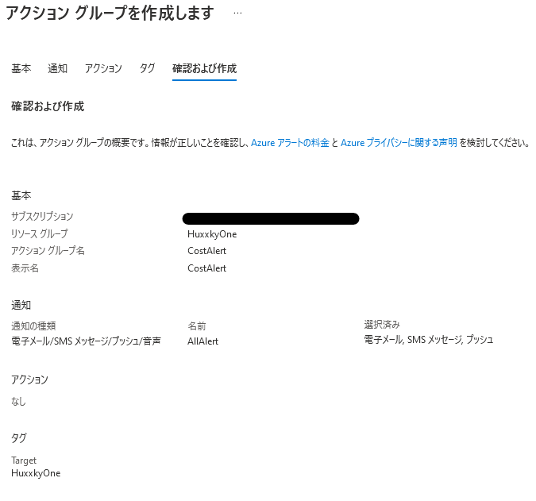

予算アラートを作成する際、このアクショングループをトリガーするように設定することで予算アラートの通知が実施されます。

なお、アクショングループは予算アラート以外の通知にも使用することが可能です。

また、オプションの設定ですが、アクショングループがトリガーされた際のアクションを追加で定義することもできます。

これでFunctionなどを使用して任意の処理を行うことも可能です。

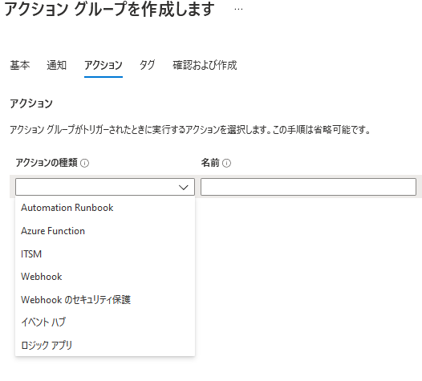

### 予算アラートを作成する

続いて、サブスクリプションページの「コストのアラート」から新しい予算アラートを作成します。

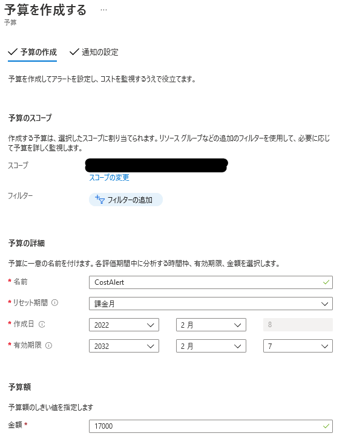

警告条件は、予算に対する割合として、予測値と実際値を設定可能です。

今回は以下のように使用料の予測値が90%を超えたタイミングでのアラートを含む警告設定を行いました。

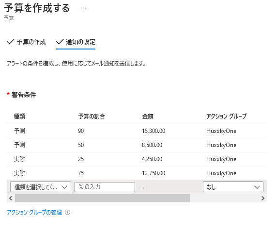

これでコストのアラート通知設定は完了です。

Azure APIとかを使いこなせば、アクショングループからアラートが出た際にすべてのリソースを停止するような処理を自動化することも可能かもしれませんね。

## おまけ：Azure Function で Discord に通知を転送する

「Azure Function(日本語UIだと関数アプリ)」はサーバレスにアプリケーションを実行できるサービスです。

参考：[Azure Functions documentation | Microsoft Docs](https://docs.microsoft.com/en-us/azure/azure-functions/)

「関数アプリ」から新規のFunctionを作成します。

ランタイムはPythonに設定しました。

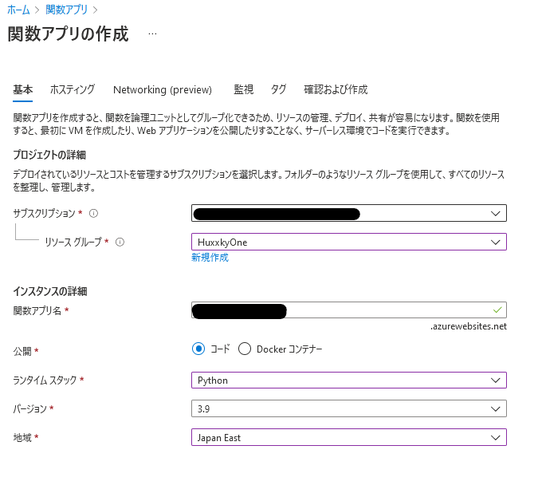


### 開発環境を構築する

Azure FunctionはローカルホストからVSCodeもしくは任意のエディタを使用して開発を行います。

AWS LambdaのようにWEBエディタからの編集は出来なさそうです。

続いて、ローカルホスト(Windows)で以下のコマンドを実行してコアツールをインストールします。

``` powershell
npm install -g azure-functions-core-tools@3 --unsafe-perm true
```

※ Nodeをインストールしていない環境でも、以下のドキュメントの手順でインストールが可能です。

参考：[Azure Functions Core Tools の操作 | Microsoft Docs](https://docs.microsoft.com/ja-jp/azure/azure-functions/functions-run-local?tabs=v4%2Cwindows%2Ccsharp%2Cportal%2Cbash#install-the-azure-functions-core-tools)

続いて、今回はVSCodeで開発を行うので、以下のVSCode拡張をインストールしました。

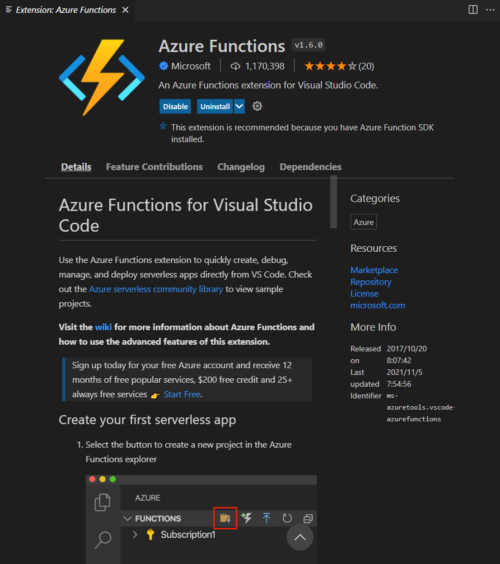

拡張機能がインストールできたら、`Signin to Azure`を選択してVSCodeからAzureにログインします。

すると、VSCodeにサブスクリプションが表示され、先ほど作成したFunctionが表示されました。

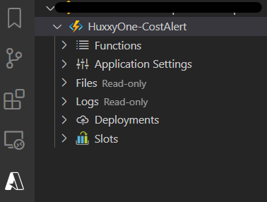

次にVSCodeの[Create Function]ボタンから、ローカルにFunctionを作成します。

トリガーは「HTTP Trigger」にしました。

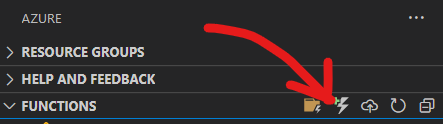

ローカルに作成された関数アプリを見ると、`__init__.py`というファイルにシンプルなテンプレートが作成されています。

そこで、このテンプレートの`main`関数を少々いじることにしました。

やっていることはシンプルで、Functionが呼び出されると、`urllib.request`を使ってDiscordのWEBhookにメッセージを送信するだけのFunctionです。

``` python
import json
import logging
from urllib import request, parse

import azure.functions as func

DISCORDWEBHOOK = "https://discord.com/api/webhooks/942244089682870272/LFwOIqSnh3CfnF3hDOESAMqqUZcrrsvEoEXVbgdrab-nB-VhSdGCJmAu_16_ejFJ4jw5"
data = {
    "content": "Azure Cost Alert"
}
headers = {
    "User-Agent": "curl/7.64.1",
    "Content-Type": "application/json",
}

def main(req: func.HttpRequest) -> func.HttpResponse:
    logging.info('Python HTTP trigger function processed a request.')

    # Discordに投稿
    parse.urlencode(data).encode()
    req = request.Request(
        url = DISCORDWEBHOOK,
        data=json.dumps(data).encode("utf-8"),
        headers=headers,
        method="POST"
    )

    with request.urlopen(req) as response:
        response_body = response.read().decode("utf-8")
        return func.HttpResponse(response_body)
```

少々ややこしい点として、DiscordのWEBhookがUAとしてurlibをブラックリストに入れているようでしたので、UAをcurlに変更しています。

### デプロイする

コードが完成したら、VSCodeの`Deploy to Function App`ボタンから任意の関数アプリに作成したFunctionをデプロイできます。

デプロイが完了すると、ローカルで作成したFunctionが、Azureの関数アプリに追加されていることが確認できます。

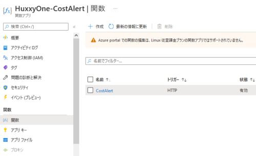

このFunctionはトリガーとなるURLにHTTPリクエストを送信するだけで実行されます。

Functionを開いて「関数のURLを取得」から取得したURLを叩くと、Discordにメッセージが転送されました。

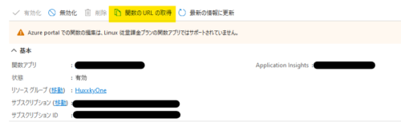

これでシンプルなFunctionの作成が完了しました。

### アクショングループからFunctionを実行する

最後に、先ほど作成したアクショングループからFunctionを実行できるように「アクション」を編集しました。

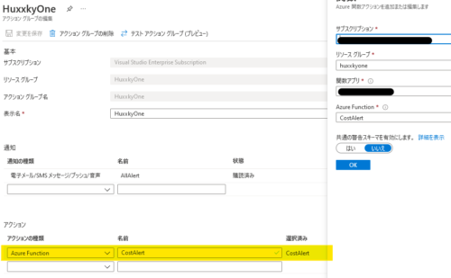

これでコストのアラートが発生してアクショングループの通知が行われる際、SMSやメールだけでなくDiscordにも通知が行われるようになりました。

## まとめ

Azureでコストのアラート設定と、Function経由でDiscordに通知する設定を行いました。

特にアクショングループは使いこなせば色々な自動化ができそうなのでワクワクしますね。
