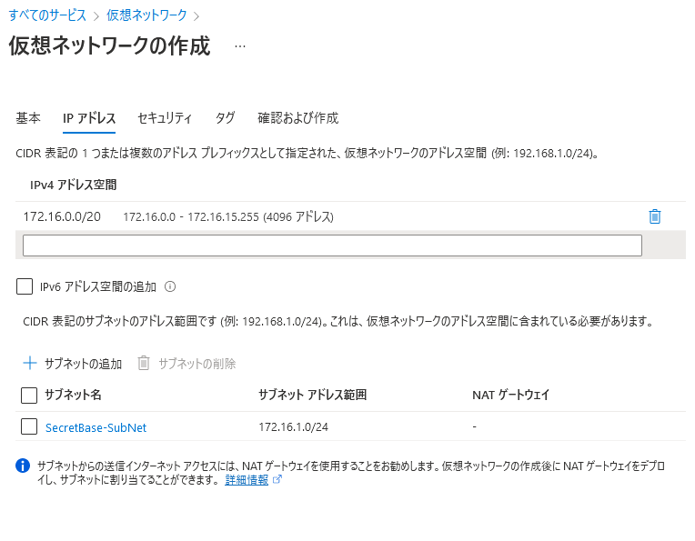
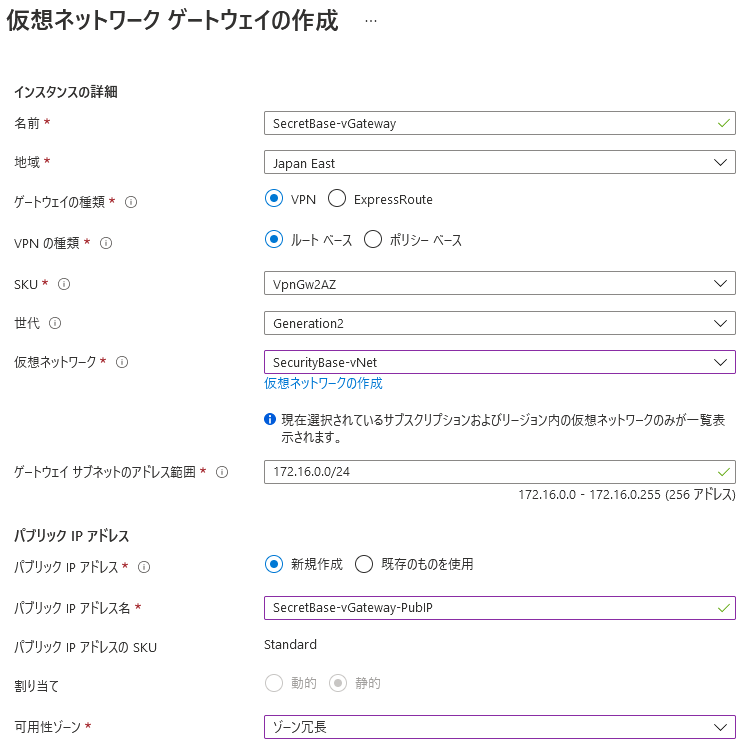
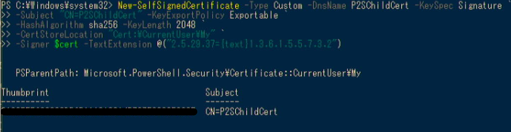
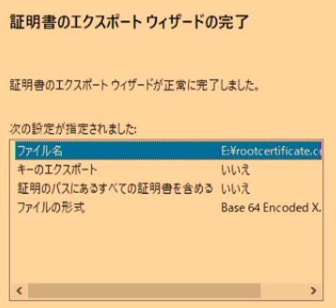
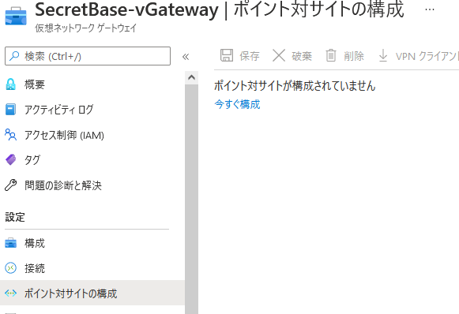
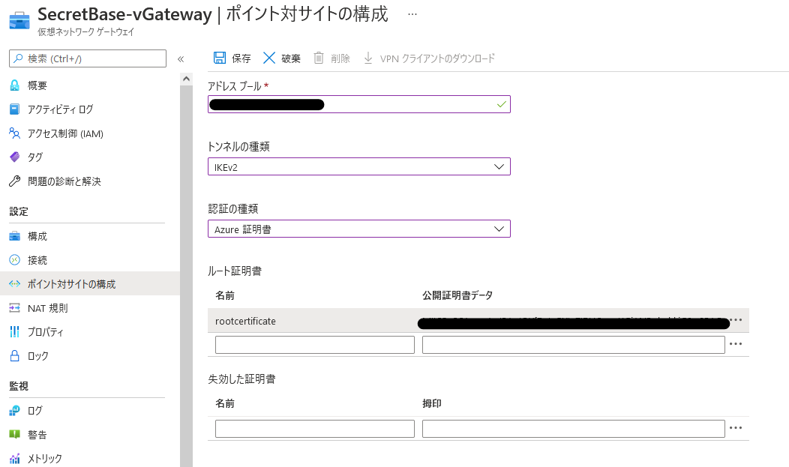
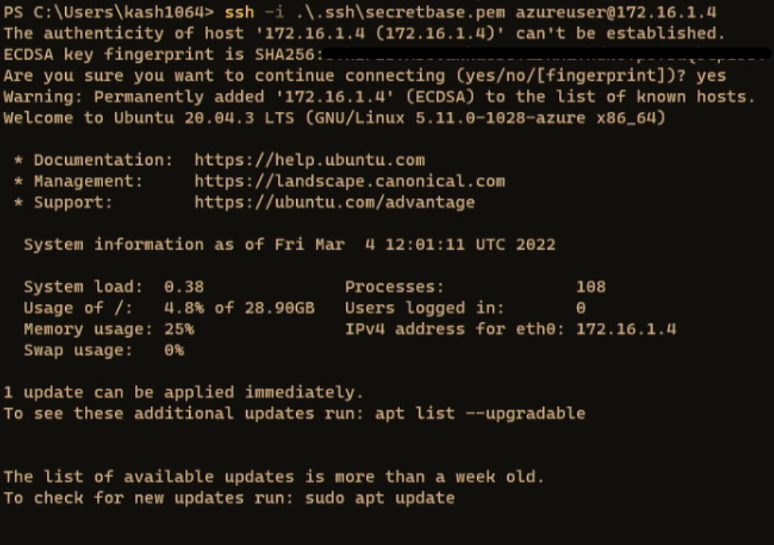
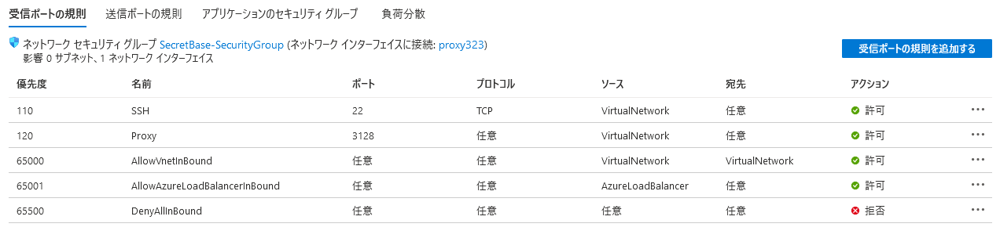
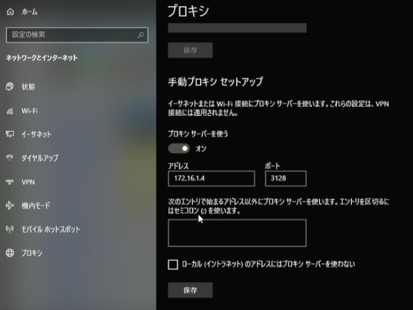
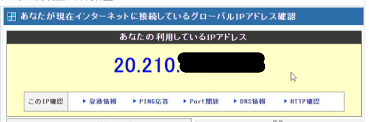

先日[こちらの記事](/honeypot-setup-on-azure)でAzure上にハニーポットを構築した話を書きましたが、アクセスコントロール的にもセキュリティ的にも、ハニーポットへの接続はVPNを使った方がよさそうでしたので、Azureの仮想ネットワークゲートウェイを使って仮想ネットワークに対してP2S VPN接続を構成しました。

ついでにAzureVM上のサーバをクラウドプロキシとして使えば色々セキュアなのでは？(浅い)と思ったので、VPN接続するAzureの仮想ネットワーク上にプロキシサーバも構築してみました。

<!-- omit in toc -->
## もくじ
- [仮想ネットワークと仮想ネットワークゲートウェイを作成する](#仮想ネットワークと仮想ネットワークゲートウェイを作成する)
- [オレオレルート証明書とクライアント証明書を生成する](#オレオレルート証明書とクライアント証明書を生成する)
- [P2S VPN接続を構成する](#p2s-vpn接続を構成する)
- [WindowsでVPNを設定する](#windowsでvpnを設定する)
- [AzureVM上にプロキシを構成する](#azurevm上にプロキシを構成する)
- [接続テスト](#接続テスト)

## 仮想ネットワークと仮想ネットワークゲートウェイを作成する

まずは仮想ネットワークを作成します。

今回は`172.16.0.0/20`の仮想ネットワークを作成し、その中に仮想マシンを割り当てるサブネットを作成しました。



次に仮想ネットワークゲートウェイを作成しました。

この時ネットワークゲートウェイサブネットのアドレス範囲に設定するアドレスは「仮想ネットワークのアドレス範囲」かつ「仮想ネットワーク内の既存のサブネットと重複しない」アドレス範囲に設定する必要があります。



これで作成が完了したので、次は仮想ネットワークゲートウェイに適用するルート証明書を作成します。

参考：[P2S VPN と証明書認証を使用して VNet に接続する: ポータル - Azure VPN Gateway | Microsoft Docs](https://docs.microsoft.com/ja-jp/azure/vpn-gateway/vpn-gateway-howto-point-to-site-resource-manager-portal)

## オレオレルート証明書とクライアント証明書を生成する

仮想ネットワークゲートウェイを使用してVPN接続を行うために、クライアント側のWindowsでオレオレ証明書を作成します。

以下の公式ドキュメントの手順の通りに実施すればOKです。

参考：[P2S 用の証明書を生成してエクスポートする: PowerShell - Azure VPN Gateway | Microsoft Docs](https://docs.microsoft.com/ja-jp/azure/vpn-gateway/vpn-gateway-certificates-point-to-site)

まずは管理者権限で起動したPowershellで以下のコマンドを実行します。

``` powershell
$cert = New-SelfSignedCertificate -Type Custom -KeySpec Signature `
-Subject "CN=P2SRootCert" -KeyExportPolicy Exportable `
-HashAlgorithm sha256 -KeyLength 2048 `
-CertStoreLocation "Cert:\CurrentUser\My" -KeyUsageProperty Sign -KeyUsage CertSign
```

これでオレオレルート証明書が作成できたので、このままクライアント証明書も作成します。

同じPowershellセッションで以下のコマンドを実行します。

``` powershell
New-SelfSignedCertificate -Type Custom -DnsName P2SChildCert -KeySpec Signature `
-Subject "CN=P2SChildCert" -KeyExportPolicy Exportable `
-HashAlgorithm sha256 -KeyLength 2048 `
-CertStoreLocation "Cert:\CurrentUser\My" `
-Signer $cert -TextExtension @("2.5.29.37={text}1.3.6.1.5.5.7.3.2")
```

成功すると以下のような画面になります。



Windows上で証明書ストアを参照してみると、以下の2つの証明書が登録されていました。


このうち、「P2SRootCert」という名前のルート証明書からcerファイルをエクスポートします。

ルート証明書を右クリックしてエクスポートを選択し、「Base64 Encode~」を選択して進みます。

最終的に以下のような設定でエクスポートします。



エクスポートされたcerファイルの`BEGIN CERTIFICATE`の次の行から書かれている鍵の中身をコピーしておきます。

``` bash
-----BEGIN CERTIFICATE-----
<この中身をコピー>
-----END CERTIFICATE-----

```

## P2S VPN接続を構成する

仮想ネットワークゲートウェイの画面から「ポイント対サイトの構成」を開きます。



ここから「今すぐ構成」をクリックし、設定画面に進みます。

アドレスプールには仮想ネットワークのレンジに含まれるアドレスプールを指定します。

また、トンネルの種類は特に問題がなければ`IKEv2`にするのが良いと思います。



その後、「認証の種類」を「Azure証明書」に設定し、先ほどコピーしたルート証明書を貼り付けて保存します。

設定が完了すると「VPNクライアントのダウンロード」が可能になるので、ここからダウンロードしたクライアントをVPN接続に使用するWindowsマシンにインストールします。

## WindowsでVPNを設定する

クライアントがインストールできたら、WindowsのVPNの設定を開き、Azureに接続します。

無事に接続できれば、以下のように仮想ネットワークに設定したAzure側のローカルIPアドレスでSSH接続などを行うことができます。

※ VM側のセキュリティグループの許可設定を忘れずに。



ちなみに僕の環境のネットワークセキュリティグループはこんな感じにしてみました。



この後セットアップするプロキシのポートも開放してあります。

「ソース」を「VirtualNetwork」に設定しているので、グローバルIPでは接続できず、P2S VPN接続でAzureの仮想ネットワークに接続した端末からの接続のみを受け入れる構成になっているはずです。

接続には登録したルート証明書に対応するクライアント証明書が必要になるので、かなりセキュアになった感じありますね。

## AzureVM上にプロキシを構成する

最後に、AzureVM上にSquidを構築してプロキシ化したいと思います。

マシンはUbuntu20.04を使用しています。

まずはアップデートを行います。

``` bash
sudo apt update && sudo apt upgrade -y
sudo apt install git make vim -y
```

続いてSquidをインストールして設定ファイルを編集します。

``` bash
sudo apt install squid -y
sudo cp /etc/squid/squid.conf /etc/squid/squid.conf.origin
sudo vim /etc/squid/squid.conf
```

今回はとりあえず最低限の設定をしたいので、`http_port`と`http_access`の2箇所を変更します。

``` bash
# Squid normally listens to port 3128
http_port <VMのプライベートIP>:3128

acl vGateways src <仮想ネットワークゲートウェイのIPレンジ>
http_access allow vGateways
```

`http_port`は`<VMのプライベートIP>:3128`のように指定することで、特定のインターフェースのポートのみ通信を受け入れるように構成できます。

また、`http_access`に仮想ネットワークゲートウェイのIPレンジを設定することで、VPN経由の通信のみがプロキシを利用できるようにします。

これで最低限の設定はOKなので、Squidを起動します。

``` bash
sudo systemctl enable squid
sudo systemctl restart squid
```

## 接続テスト

VPNを構成したWindowsマシンでAzureVM上のサーバに対してプロキシ設定を実施します。



これで適当なサイトにアクセスしたとき、アクセス元のアドレスがAzureVMに割り当てているグローバルIPアドレスに変更されていればOKです。



参考：[アクセス情報【使用中のIPアドレス確認】](https://www.cman.jp/network/support/go_access.cgi)

今回は東日本リージョンで構成しましたが、同じ手順で海外リージョンのマシンをプロキシにすれば国外のIPを使用して接続できるようになるのかな？

手順も簡単なので有用ですね。