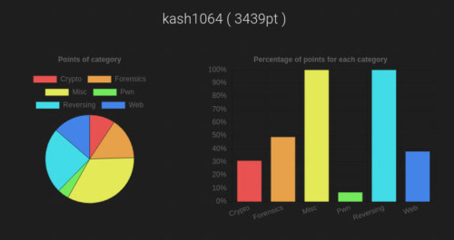
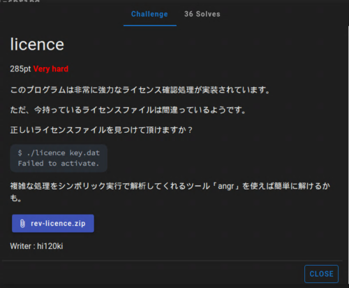
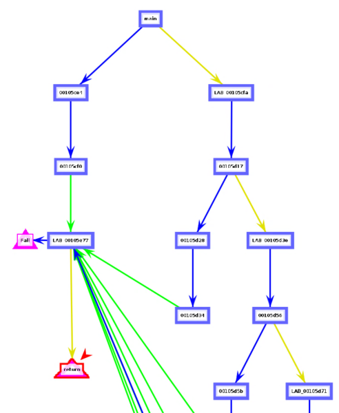
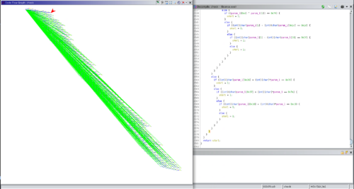
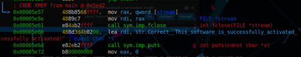
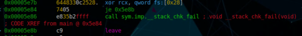

## はじめに

先日開催されました[WaniCTF'21-spring](https://wanictf.org/)に参加してました。

今回はソロ参加だったこともあり、久しぶりにReversing以外の問題も解きました。

全完できたのはRevとMiscのみで、結果は56位でした。
脱初心者への道のりはまだまだ長そうです。



Pwnが想像以上に解けなかったことなど、新たに浮き彫りになった課題も多く、大変有意義な機会でした。

今回は、ReversingのVeriyHard問題「licence」を通して、複雑な処理をシンボリック実行で解析してくれるツール「angr」の使い方について学ぶことができたので、**振り返りもかねて「angr」の使い方についてまとめていきます。**

## 今回学んだこと

1. 「angr」の使い方
2. 「angr」のロジック

## licenseの解法

今回解いた「licence」ですが、こんな感じの問題でした。

正解者は36人と比較的少ない問題なので、結構難しかった方なのかもしれません。



大まかな解法は以下のとおりです。

1. **デコンパイルしてkeyファイルの形式とFlagの検証をしているcheck関数の挙動を見る**
2. **最終的に正しいkeyを与えた場合に着地するアドレスを確認する**
3. **「angr」を使って、check関数の検証を突破したときのデータを確認する**

問題を解いていく前に、今回のメインテーマである「angr」について紹介していきます。

## 「angr」とは

[「angr」](https://angr.io/)とは、バイナリを分析するためのPythonフレームワークです。

シンボリック実行（プログラムが実行しうるパスを網羅的に抽出する技術）を用いた解析ツールで、カリフォルニア大学のラボ、SEFCOM、CTFチームShellphishによって開発されたOSSツールです。

ソースコードは[GitHub](https://github.com/angr/angr)で公開されています。

「angr」は様々な機能を持っているようですが、今回は「angr」によるシンボリック実行を利用してFlagを取得していきます。

## 「angr」を使ってみる

「angr」を初めて使うにあたってとにかく苦労したことは、導入のハードルの高さです。

僕がこの分野に対してほとんど知見がないことも一因であったとは思いますが、「angr」のどの機能を使えばFlagが取得できるのかを理解するまでとにかく時間がかかりました。

ともかくまずは「angr」が動く環境を用意していきます。

「angr」は、仮想環境以外での利用をサポートしていません。
実際、僕の利用しているParrotOSの環境でも、他のPythonパッケージと競合が発生するため、仮想環境を利用するのがいいと思います。

ちなみに、Dockerコンテナも提供されています。

公式に推奨されているのは`mkvirtualenv `を利用する方法ですが、今回は`pipenv`を利用しました。
以下のコマンドを実行すれば、「angr」が利用可能になります。

```bash
pipenv install
pipenv shell
pip install angr
```

とりあえず動作確認をかねて、「angr」を利用してバイナリファイルの基本的な情報を出力してみます。
基本的に対話形式で実行していきます。

```python
>>> import angr
>>> import monkeyhex

>>> proj = angr.Project("licence.exe", auto_load_libs=False)
WARNING | 2021-05-05 02:02:01,328 | cle.loader | The main binary is a position-independent executable. It is being loaded with a base address of 0x400000.

>>> print("ARCH", proj.arch)
ARCH <Arch AMD64 (LE)>
>>> print("EntryPoint", proj.entry)
EntryPoint 4198656
>>> print("FileName", proj.filename)
FileName licence.exe
```

## 「angr」でシンボリック解析をする

「angr」の使い方について学ぶには、まず一通り[angr Documentation](https://docs.angr.io/)の内容を読み通しておくのがおすすめです。

僕はここをサボってしまったために余計な時間を使ってしまいました。
特に今回参考にしたのは、以下の項目です。

- [Top Level Interfaces - angr Documentation](https://docs.angr.io/core-concepts/toplevel)
- [Loading a Binary - angr Documentation](https://docs.angr.io/core-concepts/loading)
- [Solver Engine - angr Documentation](https://docs.angr.io/core-concepts/solver)
- [Simulation Managers - angr Documentation](https://docs.angr.io/core-concepts/pathgroups)
- [Examples - angr Documentation](https://docs.angr.io/examples)

「angr」は、バイナリのエミュレータではなく、シンボリック実行により解析を行うツールです。

そもそもこのシンボリック実行が何者なのかが全くつかめなかったことが、「angr」でFlagを取得するための大きな壁でした。

以下、不正確な点はありそうですが、シンボリック実行について僕が理解したことをまとめます。

- **シンボリック変数を使って実行する**
- **シンボリック変数とは、1,2,3などの具体的な数値ではなく、プログラム内で使用する変数や引数につけられた「シンボル（名前？）」を指す**
- **シンボリック変数で算術演算を行うと、抽象構文木（AST）ができる**
- **プログラム内でシンボルに対して条件分岐を判定する際には、真偽それぞれのケースを場合分けして記録し、実行する**
- **記録された場合分けがあり得るか、SMTソルバ（制約充足問題を高速に解決する）によって判定する**
- **つまり、ASTを利用することで、「この一連の操作の出力を考えると、入力は何でなければならないか」といった問いを立てることができる**
- **「angr」は、この問いに答えるためのツールである**
- **シンボルに利用できるデータ型は、数値と文字列のみで、配列などの可変長のデータ構造は扱えない**

つまりどういうことだってばよ、って感じなんですが、「angr」を使うことで、「正しいkeyを入力した場合の出力に到達するためには、keyとしてどんな値を入れればよいか」を特定することができるイメージです。

では、「angr」の基本的な使い方を見ていきます。

### CLE loader

まず、「angr」はバイナリファイルをProjectとしてロードします。
これで`<class 'angr.project.Project'>`が作成され、すべての処理の起点になります。

```python
import angr
proj = angr.Project('licence.exe')
```

次に重要になるポイントは「loader」です。

「loader」は、バイナリファイルを仮想アドレス空間上に展開（？）するためのCLEモジュールを指し、`.loader`プロパティで使用することができます。

実際に問題バイナリに対して使用すると、下記の出力が得られます。

```python
>>> proj.loader
<Loaded licence.exe, maps [0x400000:0x807fff]>
>>> proj.loader.min_addr
0x400000
>>> proj.loader.max_addr
0x807fff
>>> proj.loader.main_object 
<ELF Object licence.exe, maps [0x400000:0x408017]>
```

ここで、「loader（CLEモジュール）」は、以降の「angr」による処理に適した形でバイナリファイルを読み込む役目を持ちます。

具体的には、Projectとして読み込んだ実行可能プログラムとライブラリを取得し、そのプログラムがロードされて実行できるアドレス空間を生成するためのモジュールです。

「loader」によって読み込まれたバイナリは、その形式（ELFなど）に合わせた`cle.Backend`クラスモジュールによって読み込まれ、単一のメモリ空間に展開されます。

CLEモジュールの利用可能なオプションについては以下のドキュメントが参考になりますが、非常に多機能なようで、全部は読めてません。

- [cle — Binary Loader — angr 9.0.6885 documentation](http://angr.io/api-doc/cle.html)

# Simulation Managers

さて、今回はFlag取得のために、「正しいkeyを入力した場合の出力に到達するためには、keyとしてどんな値を入れればよいか」という情報を特定したいと考えています。

そのために利用するのが「Simulation Managers」です。

「Simulation Managers」とは、という話についてちゃんと書きたいのですが、残念ながら「シンボリック実行をして入力値を特定できるなんかすごいやつ」以上の理解ができていないので割愛します。

とりあえず、先ほど作成した問題バイナリのProjectにて「Simulation Managers」を使っていきます。

```python
>>> init_state = proj.factory.entry_state(args = ['licence.exe', 'key.dat'])
>>> simgr = proj.factory.simgr(init_state)
>>> simgr.active
[<SimState @ 0x401100>]
```

`.factory.entry_state`は、シンボリック実行のための初期化を行うステートコンストラクタです。

いくつか種類がありますが、`entry_state`は、バイナリのエントリポイント実行可能な状態を構築するようです。

実行時引数を与えたうえでシンボリック実行を行いたい場合は、ここで引数を定義します。

この際、一つ目の引数にはバイナリの呼び出しが含まれることに注意が必要です。
コンソールからコマンドライン引数を与えてプログラムを呼び出したときの引数を与えるイメージのようです。

これで、Flag取得のためのシンボリック実行の準備ができました。

いよいよFlagを取得していきます。

## 問題バイナリについて

Flag取得のため、問題バイナリを解析してみます。

main関数内にはたくさんの分岐があり、大半がfail関数につながっています。



具体的には、以下のどれか一つにでも引っかかるとアウトのようです。

- 実行時引数にファイルが含まれているか
- ファイルの中身が空ではないか
- ファイルの先頭行が`-----BEGIN LICENCE KEY-----\n`になっているか
- `check`関数の戻り値が`1`ではないか
- ファイルの末尾が`-----END LICENCE KEY-----\n`になっているか

このうち、check関数の戻り値以外については、簡単に突破することができます。

ここから、最終的なkeyファイルはこのような形式になることがわかります。

```
-----BEGIN LICENCE KEY-----
FLAG{xxxxxxxxxx}
-----END LICENCE KEY-----
```

つまり、check関数を突破できるような`FLAG{xxxxxxxxx}`の値こそが、正解のFlagになるわけです。

というわけで、check関数の中身をのぞいてみます。



なんと！デコンパイル結果で2581行分の条件分岐があり、どれか一つに**マッチしてしまう**とFailする関数でした！

すべての条件に「マッチする」Flagなら、気合いと根性で見つけられるかもしれませんが、「マッチしない」文字列となると、手動で見つけ出すのはちょっと無理そうです。

というわけで、「angr」を用いてこのcheck関数を突破することを目標に進めていきます。

## Flag取得

先に見た通り、「angr」を使うと「正しいkeyを入力した場合の出力に到達するためには、keyとしてどんな値を入れればよいか」という情報を特定することができます。

そのため、Flag取得のためには「angr」に以下の情報を与える必要があります。

1. 正しいKeyを入力したときに到達する「仮想アドレス」
2. 誤ったKeyを入力したときに到達する「仮想アドレス」

それぞれ、ディスアセンブルした結果から確認できます。

まず、正しいkeyを入力した場合は、`0x5e57`の出力に到達することがわかります。



しかし、すでに見たとおり、「angr」のloaderは、今回の問題バイナリを`[0x400000:0x807fff]`の仮想アドレス空間にマッピングしているため、`0x5e57`も`0x405e57`に変換して渡してあげる必要があります。

次に、誤ったkeyを入力した場合は、すべて`0x5e86`の関数をコールします。

そのため、このアドレスに「到達しない」よう「angr」に指示を出します。



というわけで、「Simulation Managers」のfindに正解アドレス、avoidに失敗アドレスを与えてexplore関数を呼び出すことで、`0x5e57`に到達するためのシンボル情報を取得することができました。

```python
>>> simgr.explore(find=(0x405e57), avoid=(0x405e86))
・・・
<SimulationManager with 3 active, 390 deadended, 1 found>

>>> simgr.found[0].posix.dumps(3)
b'-----BEGIN LICENCE KEY-----\nFLAG{4n6r_15_4_5up3r_p0w3rfu1_5ymb0l1c_xxxxxxx_xxxxxxxx}\n-----END LICENCE KEY-----\n'
```

## まとめ

WaniCTFのReversing問題「licence」を通して、複雑な処理をシンボリック実行で解析してくれるツール「angr」の使い方について学んだことをまとめてみました。

今後Rev問をやっていく上で非常に有用なツールについて学ぶことができてよかったです。

一方で理解が及んでいない点も多いので、今後も勉強していこうと思います。
もし本記事の記載に誤りがある場合は、ご指摘いただけると助かります。

改めて非常に有意義なCTFを運営してくださった方々と、対戦しれくれたプレイヤーに感謝です。

次は上位に入りたい…。

## 今回使用したSolver

```python
import angr
import monkeyhex

proj = angr.Project("licence.exe", auto_load_libs=False)

"""
pipenv shell
pip install angr
"""

# create project
proj = angr.Project('licence.exe')

# initial_state at the entry point of the binary
init_state = proj.factory.entry_state(args = ['licence.exe', 'key.dat'])

# create simulation
simgr = proj.factory.simgr(init_state)

simgr.explore(find=(0x405e57), avoid=(0x405e86))
if len(simgr.found) > 0:
    print(simgr.found[0].posix.dumps(3))
```

### 参考

- [angr Document](https://angr.io/)
- [シンボリック実行を活用した網羅的テストケース生成](https://www.fujitsu.com/downloads/JP/archive/imgjp/jmag/vol66-5/paper05.pdf)
- [angrでシンボリック実行をやってみる - ももいろテクノロジー](http://inaz2.hatenablog.com/entry/2016/03/16/190756)
- [GitHub - angr/angr: A powerful and user-friendly binary analysis platform!](https://github.com/angr/angr)
- [cle — Binary Loader — angr 9.0.6885 documentation](http://angr.io/api-doc/cle.html)
- [シンボリック実行お勉強めも · GitHub](https://gist.github.com/tanishiking/1c2a9aa824cd715948cde37b1ea2c2ec)
- [Prepack · Partial evaluator for JavaScript](https://prepack.io/)