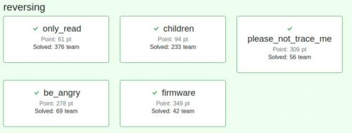
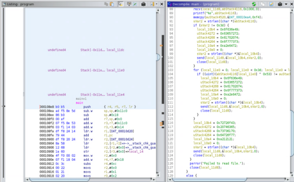
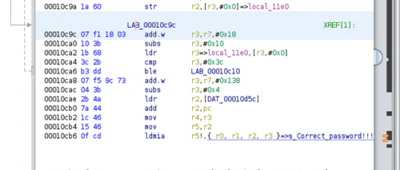
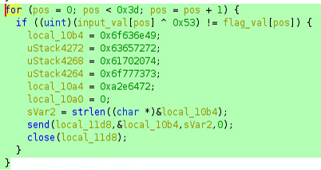

5/22-5/23 に開催された[SECCON Beginners CTF 2021](https://www.seccon.jp/2021/seccon_beginners/_seccon_beginners_ctf_2021.html)に参加しました。

実は僕がCTFを初めて最初にチャレンジしたコンテストが、昨年のSECCON Beginners CTFであり、当時は1~2問程度しか解けずに惨敗しました。

今回はその雪辱戦として、1年の成長を確認するために気合い入れて参加をしておりました。

そして結果はなんと、Reversing問題を5問全完することができました！



今回は、Reversing問題の中から、「firmware」という問題について簡単なWriteUpを書こうと思います。

## 本記事の注意点

本記事の内容は社会秩序に反する行為を推奨することを目的としたものではございません。

自身の所有する環境、もしくは許可された環境以外への攻撃の試行は、「不正アクセス行為の禁止等に関する法律（不正アクセス禁止法）」に違反する可能性があること、予めご留意ください。


## WriteUp

まず、渡されたアーカイブファイルを解凍すると、次の2つのファイルが現れました。

- firmware.bin 
- README.txt

README.txtの内容は次のようなものでした。

```
ctf4b networks SUPER SECURE device's firmware

*NOTE*

It is allowed to reverse engineer this firmware.
I hope you enjoy reversing this file!
```

どうやらfirmware.binは、何らかのネットワーク機器のファームウェアプログラムのようです。

fileコマンドにかけてみると、dataファイルであると表示されました。

```
$file firmware.bin 
firmware.bin: data
```

次に、stringsにかけてみると、以下のようなファイル名が確認できました。

```
ascii.txt 
square.svg
bootstrap-grid.css
fa-regular-400.woff2
file.svg
logo.png
firm
logo.jpg
folder.svg
certificate.pem
index.html
plus-square.svg
star.svg
```

また、次のようなテキストも確認されました。

```
This is a IoT device made by ctf4b networks. Password authentication is required to operate.
Input password (password is FLAG) > 
Incorrect password.
Correct password!!!
GCC: (Ubuntu 9.3.0-17ubuntu1~20.04) 9.3.0
```

どうやらこのfirmware.binというファイルは、複数のファイルから構成されており、この中の実行ファイルがFLAGとなるパスワード文字列を要求しそうであることがわかりました。

しかし、firmware.binはdataファイルとなっていて、Ghidraやradare2、objdumpなどに食わせてもうまく解析ができませんでした。

## firmware.binについて

そこで方針を変えて、ファームウェアプログラムの解析について調べてみたところ、[binwalk](https://github.com/ReFirmLabs/binwalk)がファームウェア解析のためのツールであることを見つけました。

binwalkは過去に何度かZLIBファイルの解凍などで使用したことがあるのですが、当時使用したのはステガノグラフィーの問題で、本来ファームウェア解析のためのツールであるということを知りませんでした。

そこで、firmware.binに対してbinwalkで解析をかけたところ、次のような出力結果が得られました。

```bash
$binwalk firmware.bin 

DECIMAL       HEXADECIMAL     DESCRIPTION
--------------------------------------------------------------------------------
127           0x7F            Base64 standard index table
2343          0x927           Copyright string: "Copyright 2011-2021 The Bootstrap Authors"
2388          0x954           Copyright string: "Copyright 2011-2021 Twitter, Inc."
83503         0x1462F         PNG image, 594 x 100, 8-bit grayscale, non-interlaced
83544         0x14658         Zlib compressed data, best compression
90593         0x161E1         ELF, 32-bit LSB shared object, ARM, version 1 (SYSV)
100906        0x18A2A         Unix path: /usr/lib/gcc/arm-linux-gnueabihf/9/../../../arm-linux-gnueabihf/Scrt1.o
103485        0x1943D         JPEG image data, JFIF standard 1.01
117167        0x1C9AF         PEM certificate
117786        0x1CC1A         HTML document header
118641        0x1CF71         HTML document footer
```

どうやらここから、FLAGとなるパスワード文字列を扱っているELFファイルを抽出すればよさそうです。

## ファイルから任意のアドレス間のバイナリデータを抜き出す

ここは、以前にも何度か試したことがありあまり苦労しませんでした。

具体的にはddコマンドを使用します。

ddコマンドは、LinuxでISOイメージをUSBメモリに書き出すときに使ったことのある方は多いと思いますが、ファイル変換とコピーを行う機能を持ったコマンドです。

参考：[dd(1) - Linux manual page](https://man7.org/linux/man-pages/man1/dd.1.html)

ddコマンドでバイナリデータを抜き出すために、特別難しいことは必要ありません。

以下のコマンドのように、インプットするファイルにfirmware.binを指定し、1バイト単位で書き出すためにbsを1に設定します。

そして、binwalkで取得した開始アドレスと、次のセクションまでの差分をそれぞれ設定すればOKです。

```bash
$ dd if=./firmware.bin of=./program bs=1 skip=90593 count=12892
12892+0 records in
12892+0 records out
12892 bytes (13 kB, 13 KiB) copied, 0.0391655 s, 329 kB/s
```

これで抜きだしたファイルを見てみると、ちゃんとELFファイルとして取得されたことがわかります。

```bash
$ file program 
program: ELF 32-bit LSB pie executable, ARM, EABI5 version 1 (SYSV), dynamically linked, interpreter /lib/ld-linux-armhf.so.3, missing section headers
```

## バイナリファイルを解析する

FLAGを抜き出すために、ELF32を実行する環境を用意して動的解析をしようかとも思ったのですが、動的リンクのライブラリを準備するのがめんどくさくてやめました。

あまり癖のないバイナリだったので静的解析だけで十分FLAGが取得できます。

とりあえずGhidraに食わせます。



main関数はつらつらと長ったらしい感じですが、重要な部分はそこまで多くありません。

事前にstringsでパスワードの入力を受け付け、正誤判定を行っていそうな部分があることがわかっているので、そこを探します。

”Correct Password”のアドレスにたどり着く直前の分岐が怪しそうです。



探してみると、明らかにパスワードチェックを行っていそうな分岐を発見しました。
※変数名は解析の過程で編集しています。

デコンパイル結果読むと、入力値とFLAG文字列の0から60文字目までを順に比較しているようです。

そして、入力値は1文字ごとに0x53(83)とのXORで比較されていることがわかります。



ここまでわかれば後は楽勝ですね。

デコンパイル結果からこのflag_valの配列のアドレスを割り出します。

0xea4から0xf94までがこの配列のアドレスであることがわかりました。

この配列はuint型で定義されているので、差分は0xF0であり、ちょうど60文字分の領域が確保されていることがわかります。

というわけで、ここまで読めればあとは指定したアドレス範囲のバイナリデータを抜き出して0x53とXORをとった値を順に出力するSolverを書けばFLAGを取得できます。

SolverはPythonで書きました。

```python
with open("program", "rb") as prog:
    data = prog.read()
    data = data[3748:3988]
    for i in range(0, 240, 4):
        print(chr(data[i]^83), end="")

print("")
```

実行したらFLAGが取得できます。

```bash
$ python3 solver.py 
ctf4b{i0t_dev1ce_xxxxxxxx_xxxxxxxx_xxxxxxxx_a_l0t_of_5ecre7s}
```

## まとめ

解けてみればEasyな問題ではありましたが、あほなことをしてずいぶん時間を使ってしまいました。

特に、展開直後のファイルをエディタで適当にいじったせいで破損させて、binwalkの解析が正常にできなくさせてしまったのは痛恨のミスでした。

今後はしばらく迷ったらとりあえず問題ファイルを再ダウンロードするのを試してみてもいいかもしれません。

とはいえ、昨年の雪辱を果たし、得意ジャンルならSECCON Beginners CTFの問題を全完できるようになったというのは大きな成長を感じられてよかったです。

今後はもっと上位も目指しながら引き続き勉強していこうと思います。

改めて、作問運営の方には感謝です！
インフラでトラブルがあったと聞いていますが、特にストレスはなく、個人的には非常に快適に楽しめました。

次はSECCON CTFでも納得いく結果が出せるよう頑張ります。

## 参考

- [dd(1) - Linux manual page](https://man7.org/linux/man-pages/man1/dd.1.html)
- [ReFirmLabs/binwalk: Firmware Analysis Tool](https://github.com/ReFirmLabs/binwalk)