2021年10月23日に開催された[AVTOKYO2021](https://www.avtokyo.org/)にてxINT CTF 2021に参加してきました！

最終順位は残念ながら2550点で7位と、上位には届きませんでしたが、友人2人と久々にチーム参加でわいわい問題を解けたのでかなり楽しかったです。

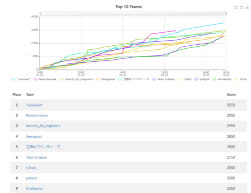

今回解いた問題の中から解けた問題で面白かったものと、解けなくて悔しかった問題についてWriteUp書きました。

<!-- omit in toc -->
## もくじ
- [解けたやつ](#解けたやつ)
  - [TOKYO2020(150)](#tokyo2020150)
  - [BUS(300)](#bus300)
  - [soar to new heights(300)](#soar-to-new-heights300)
- [解けなかったやつ](#解けなかったやつ)
  - [DISK](#disk)
    - [解き方](#解き方)
  - [past certificate](#past-certificate)
    - [解き方](#解き方-1)
  - [pilgrimage](#pilgrimage)
    - [解き方](#解き方-2)
- [まとめ](#まとめ)

## 解けたやつ

### TOKYO2020(150)

BUS問の1問目でした。

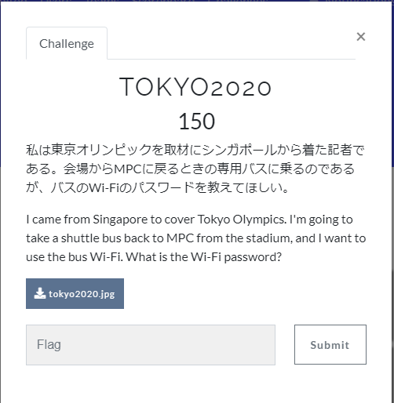

画像をダウンロードする画像はこんな感じでした。

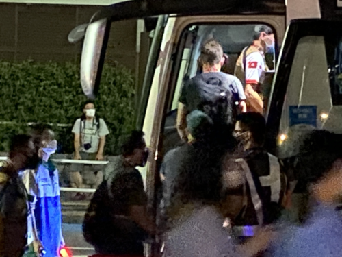

「MPC バス」とかで検索するとどうやらメディア関係者用のバスが出ていたことがわかります。

[東京2020大会時におけるメディア関係者バスの乗降場所の設置について](https://www.city.chuo.lg.jp/bunka/olympic/kuminkyougikai/kuminnkyougikai8.files/03.bus.pdf)

このメディア関係者向けバスのwifiパスワード流出についてGoogleやTwitterで検索したところ、「GO!東京」という韓国のメディアがパスワード付きで画像を流出させていたことがわかったので、その記事を探してFlagを見つけました。

### BUS(300)

BUS問の2問目。

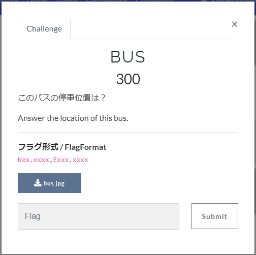

ダウンロードするとこんな感じの画像が取得できました。

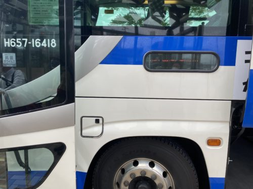

`H657-16418`という車番から、**佐久・小諸号（高峰高原・小諸・佐久 - 新宿線）**であることが特定できます。

参考：[ジェイアールバス関東小諸支店 - Wikipedia](https://ja.wikipedia.org/wiki/%E3%82%B8%E3%82%A7%E3%82%A4%E3%82%A2%E3%83%BC%E3%83%AB%E3%83%90%E3%82%B9%E9%96%A2%E6%9D%B1%E5%B0%8F%E8%AB%B8%E6%94%AF%E5%BA%97)

次に、ダウンロードした画像のEXIF情報から撮影時間が特定できるので、上記のバスの時刻表と比較して停車駅を佐久平駅と特定しました。

画像の中にレンタカーショップが反射して映り込んでいるので、Googleマップからレンタカーショップの向かいにあるバス停を探してFlagをGET。

### soar to new heights(300)

BUS問の3問目でした。

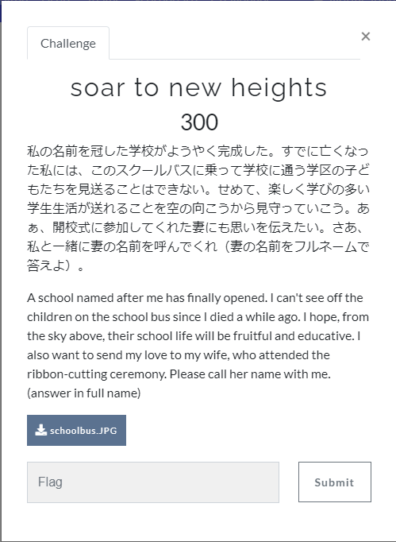

ダウンロードできる画像はこれ。

バスの進行方向にある看板を頑張って読むと`Cold Spring Valley`になることがわかります。

`Cold Spring Valley`の学校を探してみると、`Officially named Michael Inskeep Elementary School`とある学校が、2021年の夏に`Cold Springs`にできることがわかりました。

参考：[Building / School Naming](https://www.washoeschools.net/Page/14237)

この方の名前で検索したところ、以下のページにアクセスでき、中に貼られている画像のalt情報から奥さんの名前を特定できました。

参考：[Inskeep Elementary / Namesake: Michael Inskeep](https://www.washoeschools.net/Page/16215)

## 解けなかったやつ

### DISK

問題がこれ。

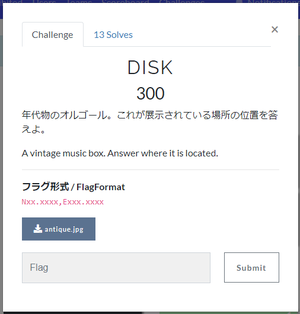

こちらがダウンロードした画像。

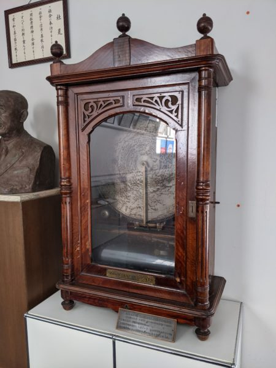

この画像の後ろに映っている社是でググると、Pioneer社のものであるとわかります。

この画像には銅像とオルゴールが映っているので、「パイオニア 銅像」とか「パイオニア オルゴール」などでググっていきます。

「パイオニア 銅像」でググったときの上位に、[このブログ](https://dynamicaudio4f.wordpress.com/2018/07/04/tad%E3%80%80%EF%BC%88%E3%83%91%E3%82%A4%E3%82%AA%E3%83%8B%E3%82%A2%EF%BC%89%E5%B7%A5%E5%A0%B4%E8%A6%8B%E5%AD%A6/)がヒットしました。

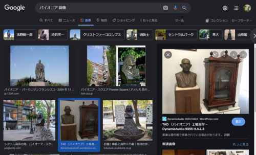

どうやら問題の画像は、パイオニアの川越工場のメインエントランスにあるそうです。

しかし、Googleマップで調べた川越工場の座標を入力しても、正解には至りませんでした。

#### 解き方

[Open xINT CTF 2021 write-up](https://zenn.dev/for/articles/9ffe00690568b5#soar-to-new-heights)を参考にしたところ、どうやら上記のブログの画像のEXIFに位置情報が含まれており、それをちょっとずらしたポイントが正解だったようです（こんなん解けるか？）

とはいえ普通に実力不足だと思ったのが、リサイズされた画像はEXIF情報が書き換えられてることをすぐに思いつけなかった点です。

記事内の画像は、`[h]ttps://xxxxx/xxx/img_7433.jpg?w=460&h=345`みたいにリサイズされていたので、`[h]ttps://xxxxx/xxx/img_7433.jpg`のようにリサイズ前の画像をダウンロードしないとEXIFから位置情報が抜き出せない状態でした。

考えてみれば当たり前なのですが、今後EXIF情報を探すときはリサイズ前の元の画像を取得する必要がある点に要注意ですね。

### past certificate

こちらが問題。
すでに閉鎖したドメイン（`ccc.go.jp`）の 最後の証明書のシリアル番号を特定せよとのこと。

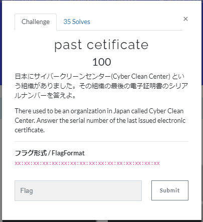

期限が切れてそうなのでOCSP周りで何か情報取れないか探していたものの、有効な情報が見つからずリタイア。。

#### 解き方

どうやら、`Certificate Transparency(CT)`という、証明書の発行/監視の仕組みを理解してますか問題だった模様です。

参考：[Certificate Transparencyを知ろう](https://www.jnsa.org/seminar/pki-day/2016/data/1-2_oosumi.pdf)

`Certificate Transparency`とは、RFC6962に定義されているもので、認証局によって発行されたすべての証明書をオープンソースのログとして記録していくことで、誤った証明書や、悪意のある証明書をみんなで監視しましょう、という仕組みのようです。

証明書のログは、`CTログサーバ`と呼ばれる公開サーバに記録されます。

証明書がCTに対応している場合は、CTログサーバから有効なSCT（Signed Certificate Timestamp）が返却されます、

このCTログサーバは世界中にいくつかあって、Googleのサーバや、DigiCert、Symantecのサーバなどが有名どころのようです。

CTサーバのログについては、[crt.sh](https://crt.sh/)のようなサイトから検索が可能で、今回の問題でもこのサイトからCTを利用して証明書を検索できる、という流れでFlagを取得できたようです。なるほどな～。

### pilgrimage

こんな問題。

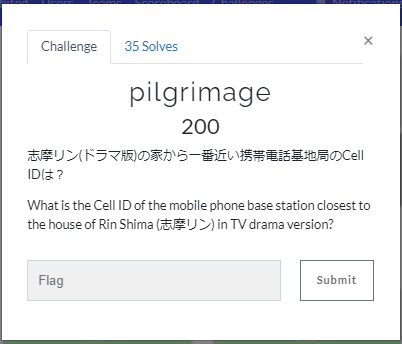

ググったらドラマの家の住所は簡単に特定できたのですが、近くの基地局のCellIDの特定方法がわからずリタイア…。

あまりにもわからなくてまじで山梨まで行こうかと考えてました笑。

#### 解き方

WriteUp参考にしたところ、[OpenCelliD](https://www.opencellid.org/#zoom=16&lat=37.77889&lon=-122.41942)というオープンソースの基地局データベースで見つかるとのことでした。

参考：[Open xINT CTF 2021 write-up](https://zenn.dev/for/articles/9ffe00690568b5#pilgrimage)

このサイト散々探したはずなのになんで見つからなかったんだろう…。

## まとめ

OSINTのCTFは普段はめったに解かないのですが、新鮮でとても楽しかったです。

やっぱりチームで参加すると面白いなぁと思うので、今後はもっと頻繁に誰かとチーム組んでCTF参加していきたいと思いました。

ともあれ、AVTOKYOの運営の皆さんと、一緒に参加してくれたメンバーに感謝です！
