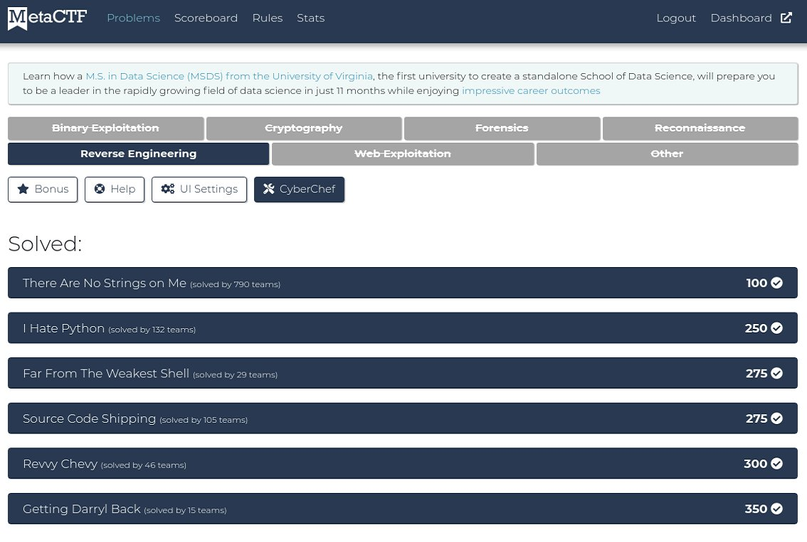
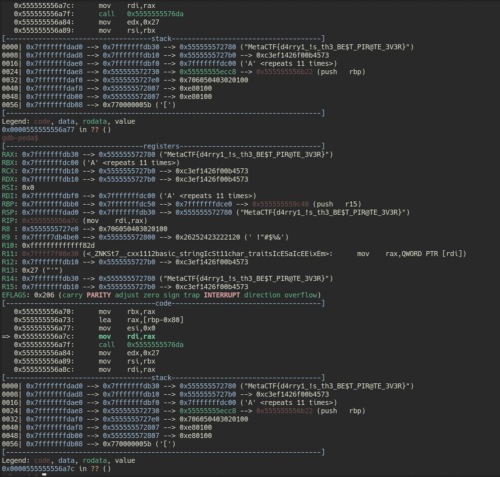

12/4~12/5に開催されていた[MetaCTF 2021](https://metactf.com/)に参加してきました。

難易度は全体的に易し目でいい感じに楽しめる難易度でした。

今回はRev問を全完したので、いくつか面白かった問題についてWriteUpを書いていきます。



<!-- omit in toc -->
## もくじ
- [I Haet Python](#i-haet-python)
- [Source Code Shipping](#source-code-shipping)
- [Far From The Weakest Shell](#far-from-the-weakest-shell)
- [RevvyChevy](#revvychevy)
- [Getting Darry Back](#getting-darry-back)
- [まとめ](#まとめ)

## I Haet Python

僕は好きですよ、Python。

問題として与えられたのは以下のスクリプトです。

``` python
import random

def do_thing(a, b):
    return ((a << 1) & b) ^ ((a << 1) | b)

x = input("What's the password? ")
if len(x) != 25:
    print("WRONG!!!!!")
else:
    random.seed(997)
    k = [random.randint(0, 256) for _ in range(len(x))]
    a = { b: do_thing(ord(c), d) for (b, c), d in zip(enumerate(x), k) }
    b = list(range(len(x)))
    random.shuffle(b)
    c = [a[i] for i in b[::-1]]
    print(k)
    print(c)
    kn = [47, 123, 113, 232, 118, 98, 183, 183, 77, 64, 218, 223, 232, 82, 16, 72, 68, 191, 54, 116, 38, 151, 174, 234, 127]
    valid = len(list(filter(lambda s: kn[s[0]] == s[1], enumerate(c))))
    if valid == len(x):
        print("Password is correct! Flag:", x)
    else:
        print("WRONG!!!!!!")
```

どうやらPasswordとして入力された値を暗号化したりシャッフルしたりした後に、最終的に正しいPasswordを入力したときの期待値と比較しているようです。

暗号化とシャッフルを行っているのはこのあたりですね。

``` python
a = { b: do_thing(ord(c), d) for (b, c), d in zip(enumerate(x), k) }
b = list(range(len(x)))
random.shuffle(b)
```

普通にこの暗号化スクリプトを解読してもいいのですが、正直読む気がしませんでした。

そこで、Passwordを評価している部分に着目します。

``` python
valid = len(list(filter(lambda s: kn[s[0]] == s[1], enumerate(c))))
if valid == len(x):
	print("Password is correct! Flag:", x)
else:
    print("WRONG!!!!!!")
```

どうやら完全一致ではなく、一文字ずつ比較していって最終的に一致したバイト列の個数で正しいPasswordが入力されたかどうかを判断しているようです。

ということは先頭から一文字ずつ総当たりで試していけば正しいPasswordが何かわかりそうです。

というわけでこれがSolverです。

``` python
import random
import string

def do_thing(a, b):
    return ((a << 1) & b) ^ ((a << 1) | b)

collect = ""
T = string.ascii_letters + "_}{!#$%&)(=-_0123456789"
for n in range(25):
    for C in T:
        x = collect + C + "A"*(24-n)
        if len(x) != 25:
            break
        else:
            random.seed(997)
            k = [random.randint(0, 256) for _ in range(len(x))]
            a = { b: do_thing(ord(c), d) for (b, c), d in zip(enumerate(x), k) }
            b = list(range(len(x)))
            random.shuffle(b)
            c = [a[i] for i in b[::-1]]
            kn = [47, 123, 113, 232, 118, 98, 183, 183, 77, 64, 218, 223, 232, 82, 16, 72, 68, 191, 54, 116, 38, 151, 174, 234, 127]
            valid = len(list(filter(lambda s: kn[s[0]] == s[1], enumerate(c))))

            if valid == n+1:
                collect += C
                print(C)
                break
print(x)
```

見方を変えると簡単に解ける系の問題は結構好きです。

## Source Code Shipping

Electron製のアプリケーションのインストーラが与えられます。

インストールしてみると、ちょっとしたパフォーマンスモニタのようなアプリケーションが起動しました。

ご存知のとおりElectron製のアプリケーションは簡単にソースコードを取得することができます。

今回は`asar`形式にパッキングされていたので、以下のコマンドでアンパックしました。

``` powershell
npm install -g npx npx asar extract app.asar ./
```

これでアンパックされたソースコードがこちらです。

``` javascript
const {app, BrowserWindow} = require('electron')
const path = require('path')
const url = require('url')

// THE FL@G is right below this message!!
let f = "TWV0YUNURnt5b3VfY29tcGxldGVkX0FfU2VhcmNoX0FuZF9SZXNjdWVfdGhlX2ZsYWdfbWlzc2lvbn0="

let window = null

// Wait until the app is ready
app.once('ready', () => {
  // Create a new window
  window = new BrowserWindow({
    // Set the initial width to 500px
    width: 500,
    // Set the initial height to 400px
    height: 400,
    // set the title bar style
    titleBarStyle: 'hiddenInset',
    // set the background color to black
    backgroundColor: "#111",
    // Don't show the window until it's ready, this prevents any white flickering
    show: false
  })

  window.loadURL(url.format({
    pathname: path.join(__dirname, 'index.html'),
    protocol: 'file:',
    slashes: true
  }))

  window.once('ready-to-show', () => {
    window.show()
  })
})
```

埋め込まれているBase64文字列をデコードするとFlagが取れました。

## Far From The Weakest Shell

めっちゃ長いPowerShellスクリプトが渡されます。（※ちなみにPCに保存するとDefenderなどに検知されるので注意してください。悪い動作はしませんので検知されても安心してください。）

``` powershell
( [ruNtimE.iNTErOpServiCes.mARSHaL]::pTRtOSTRINgUnI( [RUnTiME.INteroPSERVIceS.mArsHAL]::sEcUrEsTrINgTOgLObalaLLoCUNICodE($('76492d1116743f0423413b16050a5345MgB8ADIAUgBNAFEAbQBlADEATQB6AEQAZABhAEQAaQBKAEIAMwBuAEoAMQBMAEEAPQA9AHwAZAAwAGMANgBjAGEAMgAxADIANwAxAGQAMgA4AGEANgAzAGIAMQBhAGYANgA3ADIAZQAxADMAMwAxADcAMQA5AGEAMwBlAGMAMAA5ADQAOAAzADAAZgBjADIANQA2AGQAMgA0ADAAZAA4AGIAMwAzAGIAMABhAGUAYgA3ADgAOABmADQAYgAyADQANgBhAGIANABmAGMAYgAyAGMAOQAyAGMAMAA1ADQAZgBlADkAOAAyADgAZgBmADAAZQA5ADEAOAAzADIAYgA1AGYAOQBkADkANQBlADYAMQAwAGIANwAxADkAMwA3ADMAZgBlADcAYwA5ADEAOQA4ADAANAAzADEAOABkADcAMgBmAGIANABjADcAZgAyAGQAOAA2AGYAYQBlADgANgBiADgAMgAxAGQAMQBkADQAMwAxADAAYgBlAGUANQAxADMAZABkADYANABhAGIAMwAzADYAZQA1ADAAYQAzADQAMAAyADQANAA1ADUAMwA3ADMAMgAzADAANwBkAGUAOQA0ADMANAA3AGYAMABlAGEAZAAzADUAMQBkADgAZgBhADYANgBkADIAYQA3ADcAMQBhADgAMAAxADkAYgBlADEAMQA4ADkAZQBmAGQAZAA3AGUAYwA0ADkAYgAwAGIAMQAyADUAZgA1ADUANQAxAGEAYgAwAGIAMAAxAGUAOAAxADcAOAAyADAAZABhAGYAZABhADAANQAwAGUAMgBhADUAMQAwADAANQA1AGYAMABjADgANAAyAGMAMAA0ADQAMwBjAGYANQAwADUAOAAwAGUAZQA3AGQAOAAyAGEAYwBiADUAYQA1ADIAMwBkADQAYwA0ADcAZgBkAGYANwA1ADQANgA5ADkANwBmADIAZgAwADkANwA5ADIAMwBkAGEAYQA5AGUAMgBmADYANQBiADUAYQBjADEAMAAyADYANwBhADYANAAxAGMAOQA2ADcAZgA2ADgAZgAwADcAYgA1ADkAOAAzAGQANAA0AGIANwBkAGIAOQA0ADMAZQBlADYAZQAwADUAMwBkAGYAMAA4AGUAMgBmADQAMABkADQANQAwAGEAOABjADgANgA3AGIAZgA0AGIAMQAxADEAZQA2AGUAYwAwAGEANQAzAGEAMgA4ADkANAA4ADcANAA0AGUAMgBlADMANgBlADcAMwA4ADcAZgAxAGYAMwAwAGUAYQA1ADgANAA1ADMAYwAwAGYAOAAzAGUAOABiAGMANQBjADEAOAAxADMANgA4AGMAOQAzAGUANwBhADcANQAyADMAMAA5ADYAOAA0ADYANABhAGUAZQBjAGYAYgA0ADgAOAA3AGYANgA4ADkAZgBmADcAZAA4AGUAYQBmAGIAZAA2AGEAYgBhADUAOQA2ADAANgBhADcAZgBkADgANgBlAGQAZQA1AGYANwBjADcANwA0AGQAZgBjAGYAYgBlAGYAZQAzAGUANABmADIANQA1ADgAZAAzAGUAZgA1ADEAOQBlADQAYgAzAGUAMgBlAGEANQAwADAAMgAyAGYAYQA0ADAAMQA2AGEANAAxADIAOABiADAAMgA5ADYAMQA0ADgAMgA1ADMANABiADEANwBjADAANwA3AGQAOAA0AGEANQAyADQAMgA5ADIAMQBjADkANQAxADkANAA5ADQAMgBjAGMANQAxADMANwAwAGEANQBiADAAZQA1ADYAYwBhADUAMgBkAGUANAA0ADUAZQA2ADUANQA1ADkANwA1ADUAOQAxADgAZAA2AGQAMAAwAGEAYgBkADMAMgAwAGYAZQBkADMAMwAwAGEAMgBmAGYAZABlAGEAZAA5ADEAYQBjADgAZQA0ADQAMAA3AGMANgBjAGIAMgA0ADkANwBiAGUAZAA0ADEAMwAyADEAYgBmAGIAYgA4ADEAZAA2ADAANQA1ADYAMwA1ADcAMgBlAGQANAA3AGYAMgA5ADkAYQBmADAAYQBjADAAYwA5ADYANwAyADkANgBhADkAMQAxADUAZgBiADAAYgA1ADEAYwBhADAAYwBlADEAOAA5ADIAMwBlADEAMQA5ADEAOABmADkAYwBmADMAYwA0ADgAYwAwADAAMwBhAGIAYgA0ADgAZABlAGQAYwA1ADUANAAyAGYANwA4ADEAOQA5ADIAMABmADgAMAAzADIAMgA2AGUAYgBhAGUAOABhADAAZQBiAGUAYwBjAGIAZQAxADgANwBlADMAZQA0AGYAMAA0AGMAZAA1ADQANgA4AGEAZABlAGMAMABkADIANwAwADIAYQAxADMAMAAwADUANAA1AGIANAAxADEAMABhADkAZQBiAGMAYgBkAGUAYwBiAGYAYQA5AGYANgAwADEAMgBjAGMAZQA5AGQANwAzADkAZAAzAGYAMgAzAGQAZAAyAGEAOAA3ADgAMQAzADgAYQAzADcAOABjAGYAZgAxADgANAA2ADIAMQBhAGQAOABhADQAOQA0AGMAMQA5ADcAZgAzADMAZQA0ADMAMgAwADEAOQAxADMAOQAzAGQAZQA0ADIAOQAxADcAMwA1ADYAMQA4ADAANAA5ADMANgA4ADUAYQAwADQANwA5AGEAOAA3AGEAYQBiAGIAZQAwAGMAYgBiADIAMAA5ADMAOAA5ADgAMQAzADUAYgA4ADQANgA5AGEAZgBjADAANwA0AGQAOAAzADMAZQBmAGUANABiADUANAAzADYAMgA5AGIAOAA5AGYAMwAzAGYAOAA4ADAAMgBmAGYAOQBkAGIAYwBkADEAZAAyADgAZgA5ADgAZAA4AGEAZABkADIAOAAxAGEANAAxADUAYQBhADEANgBiADIAMAAzAGEAZgA3ADkAZgBkAGUAMgA0AGUAZQA1AGMANQA2ADIAYwA2ADEAMgBkADMANgAwAGEAZQAzADIANwAzADAANQBkAGYAOQA2ADUAYQA5AGUAZAA2ADEAZAA5ADYAYQA2ADkAOAA5ADIAMQBiADkAZgA3AGIAYwAxADkAMAA5ADAANwBkADIAZAAyAGEAMABkADgAMABhADYAZQAyADQAZgA3ADUAOQBiADUAZgA5AGIAYQAwAGYAMwAxADIANwAxADYANQA2ADIAMQA5ADAANwBiADEAZAA0ADUAMgBiAGYAOQA5ADkAZgBlAGYAMAAyAGYAYwBiADkANgBlAGEAOABlADMAZgAwADcAMABmADUANwA2ADAANgA2ADkAOAA5ADIANgA2ADEAMABmAGQAMQAyAGQAMgBiAGUANgAyAGYAMQAxAGYAMgAyAGYANQA4AGUAZAA1AGEAZABhAGYANQAzAGMAZAA4AGUAYQAxADgAOQA1AGQAZgA0AGIAMQBlADcANQBmADcAYQBhADcANQBiADcAMgA4ADIANAA3ADYAOAA2AGIAYQBkADYAOQBjADkAMgA5ADQAYgA5ADcANgA4ADUAZABjADkANQAyADYAZABjADMAYwBhAGMAZgA2ADcANQBmADIAMgBiAGYANgBlAGMAYgAzADcAYwBhADkAMgAwADcANABjAGQAZQA2ADIAMwAyAGQANgBhAGYAOQAwAGYAOQAxADEAZgBkADYAMABhADEAYgA0AGUAYQBkAGIAOQA0AGYANgA4ADAANgAwADIANAA4ADgAMABjADAAMQAyADMANAAwAGUAOABlADUAMQA4ADMANgA2AGQAYQA1ADMAMgAwAGEAZgBjADAANABmADcAYgAxADMAZgBjADYAMAA1ADMAZgAxADEAMQA1ADQAZQAyAGEAOQAxADAAYgBhADEAZQAyADEAMwBiAGIANQBjADMAOQA3ADEANwA0ADAAMwA0AGEAMABhAGQAMgAxAGEAZQBmADEAYwAyADAAYQA0AGYAYgBhAGIANgBhAGQANwA0ADQAOQA1AGYANgBiAGYAYgBlADcAYQA2AGYAMQA4ADQAMQBiADkAMwBmADkAMAA1ADcAOQA0AGIANwBiADEAOQAwAGEAMgAwADQAMQBhAGUANQBhAGQAYwA3ADEANgBmADIAYgAwADIAZgA5ADYANgA2AGYANwBhAGUAYgAwAGUAYwA0AGIANAAyAGUAMAAzAGMAOAA2ADQAZgA3AGYAMQAyAGEAZQA3ADgAMgAwADEAMAAzADUANQBmADYAZABmADgAYwAxAGIANgA0AGUANgBkAGYAYwAyADcAOAA4ADMAYQA0AGQAZABhAGQANwA0ADkANwAyADYANwAzADcAYgA4ADIANAA1ADgANQAwADYAZQA0ADAAOQA2AGIANQA2ADAAMQBiAGIAOAA3AGQAYgA4ADQAZgA4ADEAOABhAGEAMgA3ADUANQA4ADgANwAyAGUAMQBkADIAZgAwADAAMQA3AGIAZQA2ADMAMABmADQAZAAyAGUANAA2AGYAOQBlAGQAYwBlAGUANwAwADcANgBhADgAMwA2AGMANgA2AGEAMABlADkAYQAxADQANQAxADAAZgA2ADYAZQA1ADEAMAA3ADkAYwA0ADIAYQA0AGEAZQBjAGUANgA0ADkAOABjADEAZAA4AGIANgA0ADMAZQAxADAAMgAyADMANwA4ADEANABmADkAYwAyAGEAMQBlAGQAZAA1AGEAYgA3ADIANAAyAGMAYwAxADYAMwAzADkAMABhADkAOABjADQAYQBmADkAYQBiADAANABhAGMAOQBjADYAMwA2AGYAYQA2ADAAMQBhADEANAAzAGYAMgBkADQAYwBiADgAOQA0ADYANwBiADUAZABmADkAZABlADMANgA3ADgAOQA1ADIAYwA3ADkAMwBmADUAMAAxADAAMQA4AGMAMwAzAGQANABmAGIAZgAxAGIAOAA1AGYAYwBiADMAMQA5AGMAOQA3ADIAMQA2AGIAYwA0ADMAMQA3ADUANAA1ADAAMAAwAGMANwBjAGMANwA1AGYAYQAyADgAYQBlADYAZgAyAGUAYwBhADEAYQA0ADgAMgBlADUAMgA3AGYANwAxAGUAZgAwAGQANgAzADEAMwBlADIAMABjADUAYwA2ADAAMQA5ADUAMQA2AGMAZgA5ADUAZAA2ADIANAA3ADkANwAzADUAYQBmADMANQA4ADMAYQAwADQAMQA4ADUAZgBmADgAMgBiADkAYQBlAGQANABlADkAZQA4AGQAZQAyADIAOAA3ADMANgA0ADQAYgBiAGMANQAyADUAZQA2AGUAZgA1AGMAMABkAGYANQBjAGIAZgAxAGMAZQA1AGYANAA5ADkAOAA1ADUAMgA3AGYAOQAxAGMAYwBlAGQAMQA0ADYANQAzADcAOAAzADQANAA1ADIAMwAzADkAMwBhAGQAZQBlAGMAZgA0AGYANQAyADgAYgA0ADYAMABhAGIAMABlAGMAOABlAGUAMQBiADEAZAA3ADEAMwA5ADEANgAzAGIAZAA4ADQAYwBlAGMAMwAzADgANAA5ADYAOQA0ADQAYgAyADcANwA4ADQAZAA2ADUAYgBmAGQAYwAyADgANQAwADAANQA3ADIAMgBjADcAMwAwADQAMABhADEAYwBlAGIAZABjAGQAMwAxADUAYwA2AGEANgBlAGYANQBiADUAYgBkADUANwAyAGMAMQBiAGMANgA4ADkAZgAyAGQAMQA5ADcAZQAzADEAYwAxADQAMgBhADQAZgA3ADcAZQAyADYAOAA4AGUAMAA5ADEAMgAzADYAZABlAGQAZABjAGYANwAyADUANAA2ADcANgA5AGUANgA0ADQAOAA0ADgAOAA0ADUAYQAzADEANgA3ADYAYgBhAGMAMwA3ADQAOAA4ADMAMABhADYAYgA3ADYAMABiADIAMgA1AGYAZgBlAGMANABiAGUAMgA0ADgAYQBjADYAZgA0ADYAZQBlAGMANABlADAAZABjAGYAYQBjAGQANgBlADcAMwA0ADMAMgA1ADgAZQBlADgAMwAzAGEAMwA5ADcAMgA3ADgAMwA4ADYANQAzADMAYQBjADgAMABhADgAYgAzADYAMgA5ADYANgA1ADEAZAAyADAANQBlADkAZgA2ADUANwAyADcAMQBhAGEANwAwADUAMAA4AGYAOQA3ADgAZABiADUAOABkAGIAOQBmAGQANQBhAGIAOABmAGUAZAA4AGQANABlAGMAMgA3ADgAMQA4ADIAMQAwADMANwBmADgAMgAwAGQANwBiADgAZABkAGUAYQAxADYAZgAyAGYAZgBmADUANwA5ADMAYQA4ADEANQBmADYAZAA0ADIANAAzADAANwBiADUAOQA4AGQANQBjAGEANwBiADgAZQBlADYAMgA3ADAAZAAyAGUAMQAxADYANgBiADcANQA0ADkAZQA3AGEAZQBlAGUAYwBiADUANQA5AGEAZABjADMANgAwAGEAMgBlADEANwA3AGEAOQA1AGQAZABjADQAOAA5ADAAZQBkAGQAMQBjADAAYQA5AGUAMQAxADQAMQBlADUANQBlADAAYQAzADUANQAyAGQAMAAzADIAYwAxADIANgA5ADQANwA1AGIANAA3AGMAZABmADEAYgA2ADAANgA0AGMAZAAwADIAOQA1AGMAZgBkADYAYgA3AGUAOAA2ADQANABlADMAMAA2ADYAYgAyADIANgBjADkAMgBkADcANQAzADcAZgBhADIANABhADMAMwAzADkANAA2ADgAMQA4ADYAMABkADgAOAAzAGUAZgBiAGIAMQA5ADUAZABkADEAYQA5ADgANAAwADUAYQA1ADEAZAAxADAANgA4AGIAMgA5ADMANwAyAGQANgA2AGQANAA4ADgAZgA2ADQANwA4AGMAMgBmADAAYgA3ADAAMQBmADYAYwBiADUAMwAwAGEAZQA5ADgANABlAGQAYgA3AGQAYgA0AGUAZgBlADQAOQA3AGYAZQBlADMAMgA2ADYAZgBlADMAOAAwADAAYQA5AGYANQAzADUAOQBiAGIAYgA3ADcANAA5ADgAMwBlADQAMwBmADkAMQBmAGYAMgA5AGUAYwAwAGEAMQA4ADkAZgBjADgAYwA1ADUANABjAGQAYQAwADMAOABiADYANABlAGIAOAAyAGQANwA1AGUANABmADIAMwBjAGEAYgAxADgAYwBlAGUAMQBmADQAZAAxAGIAMQA2ADIAMAAwAGIAMwA3AGQAZQBlAGUAOAA5AGQAYgA5ADMAMQBhADEAOQA3ADMAZQBhADEAYgA5ADIAOAAyADYAZgBlADkANwA4ADQAYwA2AGMAMQBmAGYAMgBkAGQAOQA1ADYAMwAxADgANwBmAGMAMgA0ADgAMQA1ADQAYwAwAGIAZABlAGMANwA2ADcAYwA4ADUAMAAwAGMAMQAyAGYAYQBmAGEAZgA0ADYAOAA1ADQAOAAwADAANgBlADEAMgBiADYAMwBhAGMAYgAzAGIAMgBjADIAZQAxAGMANAA2ADcAOAA5AGMANQA2ADAAZQBiAGEAYgBjAGEAOAA2ADYAZgAxADcAZQA4ADkAOQBhAGQAMABmADgANQAwADAAZQAxADkAYgA4ADcAMQAyADcAZAAzAGEANQAxADcANABiADcANABiADkAMgA2ADIAMwBiAGEAOABjADEANQAwADIAYQA3AGQAYwA5ADMAYQA1ADYAMwA5AGUAZQA5AGIAMAA2ADAAOABlADUANwAyAGYAZAA1ADcAMgBiAGIAMQBjAGEAMQBjADAANAAwAGEAOAAzADcAMwAxADMAMwA0ADIAOQAwADkAMgA2AGQAZAA2ADAAOQBhADkANABiAGYANgBlADgAMwBiADIANwA1ADcAYQAwADIAOABjADcANQBhADYAZgA3ADAANwAyADkAYQA5ADkANwA1ADcAMAAwADkAMwAwAGMAMgAxADcAMQBhADYAOAA1ADYAZgBjAGYANwBjADEAZAA0ADgAMQAwAGIAMgBjAGYAMgA3AGIAMwBiAGEANgA2ADMAZABjADcANQBhAGYAYgBiADIANwAxADEAMwA3AGQANAA2ADcAMwAwADAANQAzADkAMwAwADEAMQAzADEAYQBjADMAOAA0AGMAOAAwAGUANwA5AGYAMgA5ADgAOQBiADIAYwA5AGIAZgA0ADYAMAA5AGMAYwBlADkAZAA1AGEAZgBmAGIAOQAxADUAZgA3ADgAYwA0ADEAZAA4AGQANwA1ADgAYQA3ADIAYQA3ADIAZAAwAGMAZABjADkANQBkADcAMgBlADgAYQA3AGEAMwA1AGIAZgBiAGEAYwA3ADcAMAA4AGIANgBmAGQAMQBkADQAMwAyADAAZABiADMAYgA0ADIAYwA1ADkAZAAyADcAMgBmAGMAZAAxADEAZgA1AGIAYgA0ADIANAA2ADYAZQBmADQAYwA4AGEAYwBlADYAOQBmAGQAOQA0ADkAOQBhADIAYQBmADUAZQA0ADgAMgBhADMANwA5ADkAOQA5ADAAYgA2ADYAZQBlAGEAOABhADkANQA2ADEAOQA4ADgANwA5ADYAOAAxADEAMAAzADgAOAA2ADYAYwBhADkANAA4ADIANgBhADQAMwA5AGMANAAzADgAYQAzADUAZQBhADUAOABhADAAMwBmADAAZQAzAGQAZAAyAGEANQA1ADgAZQA0ADYAZgA5ADMAMgAyADIAOQAwADEAYgA0AGMANAA1AGQAOQA4ADYAYwBjADQAZAA3AGYAZAA0ADAANAAwAGUAZgA4AGYAMQBjAGYAZgA2ADUANwA2ADAAMwBmADAAOABhADYAYQAxAGUAOQA0AGYAZgAwAGQANwBkADAANwBmADgAMAAyAGQAOQAxAGMAMQBmADUAMgA2ADAAMAA0AGEAOAA1AGQAMwAyADcAZgAwAGUANAAyADkAZgA1ADIANQAzADYAZgBkADYANgBmADcAYwBhAGYAYgAxAGQANABiADYAOAA5AGQANgBlADkAMwA2AGMAMgAzADIAYQBkAGEAMQBiADAAYgA3ADQAZgA0ADMAOABiADAANwA1ADUAZAAyAGIAMgAwADYAOQBjADYANABjADYANAA1AGEAOAA1ADUANQA1AGIANQA1AGQAYQAxAGUAMQAxADAAYQA0ADYAMQA2ADkAOAA1AGYAMwBmADQANgA5ADEANAA0AGUAOQBlAGYANQA0ADEAZgAyADkAOAA0ADYAMgA4AGIAMAAzADkAMgA0ADQAZgA2AGIANgBlAGMANQA5ADYAZAA1ADAAYQAzADkAOQA1ADkAOQAzADYAMwAxADAAOABhADYAMwBmADcANwAzADYAYQBjAGUAMQBjADAAOQA5AGMAZQBhADkAOQBhADIAYwA0AGEAMgA4AGIAYwBhAGEAMwA0ADUAZAA3ADkAZQAxADUANgA3ADkAZQA5ADEAZgA3ADgANgBjADcANgBiADAANgAwAGIAZAAwAGYAMgA4AGEAMwBmADMAZABjADAAYwA3ADQAMQAzADUANQA3AGIAMwA2ADcANQAyAGYAMgBmAGMANgA3ADcAYwBhADgANAA1AGIANgBmADEAOAA0ADQAZABiAGQAYQAxADMAZAAwAGIAOQAxADgAYQBjADYANQAxAGMANAA4ADgAZgA1ADcANwA4AGIAZQA3ADEAYQA5AGMAYQAzADkANAA5ADYAMQBlAGYANAA3AGEAMgA1ADUANwAwADEAMABmADQANwBmADYAZAA1ADMAZAA4ADAAOQAzAGUAZgA4ADYAYwAyADAAYQA2ADAANQBjADIAYgBiAGMAOABhAGMANABjAGMAMwBjADYAMgAxADgANQA2ADAAMQBjADcANQA3ADQAZQAzAGQANgA2AGYAMwA5ADAAYwAzAGIAZQBhADAAZAA0AGEAMABlADgAMwAyADcAOAA2AGMAMABkAGUAMQA4AGYAOQBjADkAZgBhADQAZgBkADkAMwA1AGMAMABlADAAMQA4AGMANQA1AGIAZQAxAGEAZABmADkANwA1ADAAZQAyADkANgBlADUAYQBhADgANAA5ADUAMwBlADIANwA2AGEAMgBhADYAYgA0ADkAMwAyAGYAYgBjAGQAYQA2AGQAYgBjAGIANAA1ADgAZgAyADUAZABkADQAZQBiADIAZQAyADYAOQAzADcANAAwADIAMABhADcAOQAxADEANABmADMAZQA4ADYANABlADcANABmADIANQBlAGYAYwAyAGYANQAxAGMANgA4ADIAMAA4ADUAOQA1ADcAYgBjADkAYwBkADEAYwA3ADgAOQBkAGQANAA5ADUAMgA2ADkAYwA5ADQANgA2ADIAZABiAGEANgA4ADEANABmADYANgBhADcANwBmADIANgA3ADAAZQAzADYANwA2ADgANgBmADIAMQA0AGEAYQAzADIAMwBiAGYAZAAwAGYAYwA3ADMANQBjAGEANAAxADQANgAxADcAMAA4ADgAMgBjAGEAZQA4AGIANAAyADcAOQBkAGUAMwAwADUAMAA3ADcAYgAwAGIAMQBhADgAZgBmADMAZgBiADQAMgA0ADUANQA4ADUAMQBjAGQAMQBjADcANABiAGIAZABmAGIAZQA3AGYANQBjAGUANwBmADcAZQBmADMAZgA2AGEANgA3ADkAMgA0ADgAZQBmADMAOAAwADIAZQA0AGQAMQA0ADkAYQA2ADQAMAAzAGQANgAxAGEAOQA3ADgAZABhADAANwA2AGQAZQBhAGQAMABlAGYAMAA4AGEAMQA2ADAAYgAwAGUAYwA0ADUANAA2ADcAMgA0AGUAZQBmAGEAMgA3ADAAOAA5AGMAYwA0ADkANgBmADkAMgBkADIAOQA1AGYAMgA1AGEANABhAGIAMAA1AGYAOABkAGEAOAA1ADEAOABiADQAZgAyAGMAMwA4AGEAMwAwADcAZAA5ADkAMAA1AGMAZQBiADEAYgA1AGQAYQBmADkAOQAyADkAMAA1ADkAMABiADcAMQA4ADMAYgAzAGEAMgA0ADIAYQA1ADYAYQBmADMANABmADMAOQAwADAAMgA4AGQANQAxAGUANAAzAGMAZQBiAGYAOAA2ADMANgAwADYANwAyAGIANQBiAGMAMABjADgAYgBmADcAZgBkAGYAMAAxADEAMgBiADkAYQBjADMANwA2AGYAZQBhADgAZQA2ADgANgA4ADkAYwBhADgANQA5AGUAOQA5AGMANwBmAGUANwBjAGEAYgBmAGUAOQA3ADMAMgA4ADgAMABjADgAOQBjADIAOAA1AGIAMQA0AGIANQA3ADIAMQA1AGEANwBjADkAMQAwADkAMABiADAAYwBlADIAYgAzADEAZAAyADcAMgA5ADQAOAAzAGQAMgBhADkAMwA1ADkAOAA0AGYAOQBmADcANAA5ADgAYwA3ADEAYwA2ADEAYwAyAGYAMABhADIAYgBmADYANgA2AGIAZgBlAGQAMwBhAGYANgA0AGQANgBjADYAYwAyADcANwBlADUANQBkADYANAA5ADQAYQA3AGQAMwA2AGYAOQBjADgAYQA5ADAAZQBmADgAOABlAGQAMAAwADkANAA5ADUAMwA3AGUAZQA2ADAAMwA3AGQAOQAxAGYAMAA2AGEAMAAwADMAYQA4AGQAZgAyAGQAZQBjADMAOQAxADMANQBjAGQAZQBiADUAZgAwAGYAYgAxADQAYwA5AGYANwAzADMAMQAyAGUANAAyADUAZgA2ADAANgAyADMAZQAyAGYAYQAxADIAOAAxAGIAMwAzAGUANgBlAGIAYgBlADAANQBhADQANwBiAGEANQBiAGEAMgBmAGQAZQBlADcAMAA0ADYAYwA4ADAAOABlADEAOQA5AGYAMABlAGUAMgBiAGUANQAxAGYAYQA2ADYAYwA4AGQAOABkADYAYgAyADgAOAA1ADcANAA2ADkAMAAzADcANwA4ADUAZQBhAGYAZQBkADAANgBlADAANQA5ADAAMAAwAGMANgA0AGEANwA0AGEANABlADkAYQBmADIAZgA0AGMANwBkADAAZAA4ADYAMgBkADcAZQBkADEAMQA0ADQAZAAwADEAYwBmADcAMgBhADQAMwA3ADMANAA4ADAANQAwADAAZQA5ADAAZQA5AGUAMgAyADYAZgBjADkAMwBmAGMAOQAwAGIANwA3AGUANQAwAGMAMQBiAGEAYwA4AGYAZgBjADgAMAA4ADUAOQA2ADMAMAAwAGYAZgA4AGEAOQA4AGEAZAA2ADcAMQA3ADIANgBlADUANAA3ADgAYgBiADIAMgA2ADAANQAyADMAMAAzADkANgAxADcAYQAwADMAMwA1AGMAOQA1ADgAZQAxADYAZAA0ADkAMgA0AGIAMwAwADgAMgA1ADYAZQBmAGQANQAzADUAZgAxADcAMgAyADAANwAwADYANABlAGYANwBjADMANABmAGYANgA1ADIAMwAxADQAOQA5ADYAZgA1ADAAZgAzADEAZAA3ADUANwA3ADAANQA0ADQAMAAxADcAMABhADYAYgA2ADgAYgBlAGIAZQA0ADUAMQAyADMAZgBkADQANwA4AGEAMAA1AGIAOAA5ADIANABkAGUAZgAwADkANAA2AGEAYgBiADIAYQBmAGMAYgAwADgAMwA2ADUAYwA3AGEAZABjADAAMQA3AGEAMQAzADcANwAzADcAMwAyADUANgAxADMAOABjADEAYgAwADgAMgA5ADIANQA1ADUAMQAxADQANAA5ADcAYgBkADYAMgA1AGIAZQA1ADMAZQBkADgAYQA1ADUANQBlADMAZgA2ADEANQA3ADcANwA0ADQAOQA3ADUAMgA3ADgANABhADIAMABhAGYAYgAwADgAMgBhADQAYgAzADQAMwBkAGQAMwA4ADEAMgAwADMAMAAyAGIAMwAyADcANQBkADkAMwBiAGQAYgBiAGIANAAxADkAYQA5ADYANQA5ADUAZgAwADgANQAyADIAZAA3AGUAYQBhADkAYQAzADMANwA0AGQAZAA4ADYAZgBlADQAYgA0ADYANQA1ADQAOQBhAGQAYgBjADIAMAA0ADcANwAyADEAYQA5ADkAZAA5AGEANQA0ADAAOQBiADQANgBiADYANQBiADQAYQAxADEAZgBjADAANgAyADcANABkAGQANQBkAGUAOAA3ADkANwBkAGYAYwBiADMAYQA2AGYAMQAxADQAZABjADcAMgA1AGYAMQBkAGUAZgAxADUAOQAxAGUANAA3AGIAZQA4ADYANgBmADgAYwAyADcAZABlADMAMQA4ADIAMgBiAGMAMQAzADEAZgBmADUANgAyADEAMQAyAGMAMAAyAGEAYQBhADQAZAAxADgANwBiADMAOAA4ADMAOQA0ADAAOAA1ADkAZgBmAGQAYgA4ADUANgBkADEAOAA3AGQAYQBiADQAOABjADgAZAAwADUAMQA4AGQANQBlAGIAYwA3ADEAMwBkADkAZgBkADYANwAxAGMAZgBjADUAYQAwADQAZQBjADMAOAA3ADgANQBiAGMANQBjADUAMwA3ADQAMwA1ADAAYgA3ADUAYwA1AGEAMwBhADAAZQBhAGQAZQA5ADgAYgBiAGUANwBjAGMAZQBkADYAOAA2AGIAOQBkAGEANQBhAGEAMgA2ADEAMgA3ADYAYgA0ADUANQA5ADIAYwBmAGQAMgA1ADUAZgA1ADIAOAA2AGMAOAA5ADAANwAzAGEANABjAGQAOQA3ADIAZAA2ADkAMwA3ADkANgAyADUAZgA5ADQAOQA0ADQANgA0AGMAOQA1ADUAZABmAGYAZABmADAANgA3AGEAYQAxADAAYQBiADYAZQAxAGIAZAAwADMAMQBhADEAOAA3ADAANgAyADQANgBjAGIANABhAGMANwA5ADUANwA3ADYAOQBjAGIAMQBmADIAMgAyAGYAOAA2AGEAMQA3AGMAOABlAGMAMQA0AGYAZgAzAGUAMwA5ADUAZQA0AGQAZQBhADUAMwBjADEAYQBkAGQANgAxADgAZQA1AGUANQBlAGMAMQA1AGIAZgA4ADgAZgA2AGIAOQA0ADAANQAzADIANQAyADgAZAA1ADgANgAzADcAZQAyADYAMQBjADEAMQBmADYAYwA4AGIAOQA1AGUAOAAwADcAZAA1ADUAOAAwAGYANAAwAGQAYQBmADkAZAA5ADIAZAA4AGYAZQBiADcAMQA3ADcAOABlADAAZAAwADkANgAyADEAOQAwADkAYQA2ADUAMwAzADAAMwAxAGUAYgBiAGYAZABhADUAMABlAGMAMgBlADEAOQBlADAANgA4ADUAOAA2ADAANAAzADgAOQAyADgAOAA2ADgANgA4AGQAMwAwAGMANgA3AGYAOABkAGEAMgBiADAAOAA3ADQAMgA0AGIANwAwAGQANQBhAGIAMABmADYANAA1ADkAMgA1AGEAZAAzAGQAZABmADUAOQBlADUAYwA0ADMAMgA5AGQAYQBiAGMANgAzADUAOQBlAGUAZgBlADEANwA3ADAAYwAwAGYAYwBhADMAMQA4ADAAYQBlAGYAZQBhAGUAOABiAGYAYQA1AGIANgA0ADgANwA0AGUAYQBhAGMANAA5ADkAOQBmADgAMQBjADkAZAA5ADIAZQA4ADMAZgA5AGEAMQAxAGUAYQA0ADUAZAAzAGEAMwA5ADIAYwAyADEAMgBlAGYAYwBiADQAZgA4AGEAYQA0ADQAZgBkADQAOQA5AGMANQAzADMAYwBkADgAZQA1ADcANAA2ADcAMgA4ADcAMgA0ADEANAAxAGMAYQBkADMAYwA0ADQANAAzAGYAMAA3ADAAZABkADYAYwA3AGIAMAA2ADkAZQA4AGQAMwA4ADkAOQAxADMAYwBkADcAYQA0ADAAOAA2AGMAMQBlADAAOAAwADUAMABjAGIAYwBlADkAMgA0ADAAOQBjADEAZAA4AGEANQA3AGMAMwA0AGQAOAAyADAAYgAxADQAYgBmAGUAYgA0ADEAZgAwAGYAYwBlADgAYQBiADYAOQA1ADcAZgAzADIAZAA4AGIAZAA0ADcANABiADIANABjAGYANgAzADcAOAA3AGQANQA0ADYAOQAyADUAZgAyADEAZgBhADkAOQAzADgAYgAxAGUAMABhADIAOQBmADUAMgA4AGMAYgBhADIAOQAxADgAZQBhADIANgAwAGYAYQAwAGEAOABhADUAMwA5AGQAYwBhADcANgBlAGQAMQBlAGMAYgA5ADMAMgBiAGYAYwBjADEAZAA2ADcAMgAxAGIAOQA0AGUANQA3AGIAMABiADEAZQBhADcAZgA4ADcAYQA4ADUAZABkAGMAYwBiADMAMABlADgANgAwADMAMgBmADkAMgBiADkAMQBmAGIANgA1ADgANgA3ADQAOAA3ADMAYQBhADYAZQAyADEAMQA0ADMANAA5ADkAOQBkADgAYgBjADEAOQAwADgANABjAGEAOQAzADgAYQBjADkANwA3ADEAZgA2ADEAMwBhADIAZgA4ADgAMQA1ADAAZQAyADUAYQBlAGYANwA3AGEAZQA5ADIAMAA2AGQAZQAzADgAMgA5ADkAZgBmAGUANwAyAGQAMABiADAANAAwADUAYwA4AGUANAA5ADMAOQAzADcAMAAxAGUAYQBjADQAYwAwADIAZAAzADYAYgA5AGUANwA3AGEAZgAyAGQAZQBhAGQAZQAzADcAZgBjADMAYwAzAGYAOAAwADYAZABkADkAOQBlAGMAZgBiAGQAYwA0AGUANABhADMAOAAzAGQANwBhAGQAMQA0ADAANQAwADIANQBkADcAZABhAGUANgBkAGIAYQBhAGYANAA0ADYAZgA0ADkAYgBhADAAMwAwAGQANgBjADkAMwBiADMAOQA0ADcAYQAzAGYAOAA5ADMAYwAyADgANQBjADIAMwBlADUANABlAGQAMwA3ADUAZgA4AGQAYgBmADcAZAA4ADUAYwA3AGIAMABlADAANgBkADcANgA5AGYAZQAxADgAZQBkADIAZQA5ADIAMABhADcAOQA1AGUANAAzADEAMAA5AGQANwA3ADYAYwA0ADcAZgAxAGEAYgAxADkAMwA4ADUAZAA4AGYAMABhADkANwA3ADQAYQA1AGMAZQA4ADMANwA3ADgAMwBlADEAYgAwAGMAOQBjAGEANgA3ADkANAA0ADgAYgBiADgAZQA3AGEAZQA5ADgANAA2AGEAMwBiADYAYgA4AGQAMgA2AGQAZgBlAGMAMAAyADAAYgBhADEAYwBkAGYAMQBjAGUANgBjADEAMgA1ADYAMgA0AGIAOABlADMAZABiADQAMwBhAGEAOQA0AGMAYgA4ADAAYwBjAGEAZgBlAGQAMgAyAGUAOABmADUANAA1ADIAZQAxADMAZgBhADEAOAA2ADMAYgA4ADUANAA4AGUAMAA1AGQAMABjAGMAMgA4ADcAZgBhADcAMwAwADcAYQA5ADkANQA4ADAAYgA3AGEAMQA1AGQAOQBhAGEANgBjADAAOQA5ADUAZgA0ADEANABiAGEAMAA2ADAAZQBhADIANgBkADMAMAA5AGMAZgBmAGUAZQBjAGYAOAA3ADUAOQAxADEAZgBlAGYANgA0ADEANwA5AGEAOQA4AGUAYgBkADEAYQBlAGEANgAyADYANgAwADMAYwAwADEAMAA3ADMANwA1AGQANQA0ADkAYQA4AGUAYwBjADIAMQA4AGMAOQA0ADcAOQA3ADEAOAA4ADcANwAxADMAOAAwAGMANABkAGEAYgAwADkANQA5AGEAYgBlADYAMgBkADMANgA0ADQAYQAyAGMAZQBlAGEAMABmAGIAMgA4AGQAYwAyADgAZQBjAGMAMAA1ADYAMQAzADUANQBkADAAMAAxAGQAYQAxAGMANwBiAGUAMgA3AGMAMAAxADkAZQA4ADAAYQA1ADMAMgBjAGUAYQAyAGIAYgA0AGYAYwA0AGYAMgA1ADUAMwAwADUAMgAyADUANABkADMAOABmADcAYwAyADYANABkAGUANQAxAGQAMQBkADIAMAAzAGYANwBlAGIANABjAGQANQBhADcANgA4ADcAOAA5ADEAMABkADUAOQA0AGUAMwAyADMANQA1AGQANABmAGUANgAwAGQAOABiADAAYgAzAGUAMQBmADcAYQAzADUANAAzADcAZgAyADAAZABjAGMANgA1ADMAZABjAGUAMQBkADQANgAyADAANABjAGQAZgA4AGEAZAA3ADQAZAAzADYAZgA2AGMANQBiADYANQBlADQANQAxADcAYgBkADgAYgBmADkAYgA1ADAAZQAxAGYANgA0ADUAOAAzAGEAYgA5AGMAYwAwAGQAMgBhADAAMQBkAGMAOAAwADQANgBkAGYANgBlADYAMAA5ADAAYgBhADgAZQBlADAAZgAwAGMANABkADgAMwAwADkAZQAyADgANgA3AGQANgBiAGMAMgA2ADAANQBiAGUAZQBhADAANwA5AGUAZgA0AGYAZQAyAGEANABiADAAZAAyAGEANgA5AGYAZgAwAGQAMQA5ADYANAA4AGUAZgA3AGIAMwBiADIANwA2AGYAZAAzADAANAA4ADAANAA4ADcAZABmAGQAMQBhADcAZAAzADIAMgBkADAAOQBhAGIAMQA5ADgAYwBlADIANAA0AGIAYwA2AGIAZQBlAGQAZQBhADAANgAxADQAMwBlADUAZQBkADIAOQBhADcAOQBlADgANwAxADYAMgBmADQAZgA5ADAANwAyADUAMQA2ADEAMgBiADMAYQA3ADgAMAA4AGIAZAAxADQANgAyAGMAYgAwADcAYgA2AGMAOQBjAGMAOAA5ADQAOQAwADAAZAAxADMAZQA4ADEANQA0ADkANQAyAGQAZQBmADIAMQBiAGMAMABhADgANwAwADYAYgBjADcANgA3ADYAMAAzADgANwBhAGMAOQBkAGQAZQA5ADUAZgA2ADIAYwA4ADcAOAAwAGUAMQBiADMAZgBjADkAZAAxAGUANABiAGQAMAA5ADEANQBmADcAZgBjAGMANAAxADEAMQAxAGUANgBmADkAYQAzAGQAOABlADkANQAwADgANABmADUAMwBjAGUANgA2ADkAYQBiADMAMQBiADIANQA3ADEAOABmADMAZgA0ADEANgA3AGYANABmADgANgBkADYAZgA0ADIAZgA4ADQAMgBhAGYAYQA1AGQANgBiAGEANQA3ADIANgBiAGIAMQA1AGEAZAA5ADUAOQBjAGIAMgBhADgANQAwADcAZgBiAGQANgBjADgANAA4AGYAZgBkADIANQBmAGIAZABhADgANgAyAGQAYwA4ADEAMwBhAGYAMwAxADkAMABhAGUAZgAxADMAMQBkADMAMAAzAGUAMAA0ADcAMwA1ADgAYQA1ADYAZQBkADUAYgAyADgAYgBiADEAOABjAGEANgBhADMAOAA4ADIANwA5AGUAZgAzAGYAMAAxADYAZQBiADAAMgAwADYAYQA2ADcAZAAzADgAMgA2AGIAZQA2AGEAYwA5ADEAYQAxADMAMwA4ADUANgA2ADcANQBhAGUAOQBkADMAMgBhADYAMQA5ADEAOABkADUANQBjADIAZABkAGYAZABkAGIAMgA5ADAAZQA1ADkAMQBlADQANgAzADMAZABkADMAOABiAGIAYgAzADgANAA3ADIAZgBhADkAMABhAGIAZgAzAGQANwA3ADgANAAwAGUAZQBmADYANQBmADkAOQBjADgAMgA2AGUANwAwADIAMAA0ADIAZQA3AGEAMgAxADEAZQA0AGYAYwBkADMAOABjAGYAMAA2ADAAYgAxAGQAMAA3ADQAMQAwAGQANQAzAGMAOAAwADcANwA5ADYAYQA4ADEAYQBlADQAYQA0ADgAZAAxADMANQAyADYANgBhADMAOQA1ADkANwA5ADQAMABhAGYAMQAwAGUAYgBkADUAZQBkAGUANAA1AGUAYQBkADEAMwA4ADUAYQBhAGEAYQAzADUAMQA2AGYAZgA4ADEANABlAGQAYwBjAGMAZgBjAGQAZQAyADEAMgA4AGEANAA4AGQAZAA3ADUAOAAyADUAMAA5AGUAZABjAGUAMABhADIAYgAzAGMAMAA2ADEAZQAxADIAMAA5ADkAMgBlAGMANABiAGYANAA2ADUAZAA1ADkAOQBkAGIAOQBlAGUANQA1ADMAYQBhAGQAMgAyAGMANAA5ADkAYQBmAGQAYQBmAGUAYQAwAGQAZQA0ADkAZgA1AGYAZQBlAGMAMQAxAGEANgBmADQAYwBkADQAMgBhADAAZgAxAGIAMgAwADMAMwBiADkAZQAzAGEAYwBjAGQANAA0AGIANQBjAGMAYgBjADQAYgAyAGUAMgBkAGEANgBkADUAMQBlADQAYgBiADUAYwA3ADYANgBkAGEAYQA0ADEAZAA3ADQAZQAwADMAMwAxAGYAYQBiAGMAMQBhADQAZQAwADUAMwA4AGIAYQA1ADMAZgBiAGMAZABlADMAOAA1AGUAMABlAGUAMwA0ADYANgAxAGEAOQA0ADMANwA1AGMAOQAzADgAOQBmADgAYQAxADAAZAAzAGQANAA1ADEAMwA0ADgAYQBlADEAYQBhAGQAYQBiAGEAZgBjAGIAZQA0ADMAOAA0ADMAZgA2ADcAMQAyADQAZgAwADcANAAwAGEANwA3ADYAZAA2ADUANgAyADAAZAA5ADgAMwAwAGYAMwBhADgAYQAwAGMAZgA1AGMAMgBiAGMAMQBmADAAMwA2AGYAYQA2AGQANgBiADUAZQBjADQAMgA2ADYANwBlADcANQA1ADUANgBmADMAOQA2ADUANQBmADMAZgBkADIAZQA4AGQAMABkADkAOAA0ADUAOQA3AGEAMAA2AGIAMgA5ADQAMwBiAGUANgBkADkAMwBlAGMAYQBiAGUAYgBiADUANgA3AGQAZgA3ADEAMQAyAGQAMgAyADIAZQA2AGMAZQA2ADYANwBlADUAZgA4AGMAZgAwADUAMgAxADAAMAAxADIAMQBmADcAMwBjAGQAYQBjAGIAYQBkADQAYgA4ADEANwAyAGIAYQAzADEANgA1AGEAYwBjADcAMgA3ADMANQA4ADQAOAA4ADkAMQBhADMAOAAwAGEAYQA0ADMAMwAzAGMAMgBiAGMAMgBlAGMANgA1AGUAMAA3AGEAMwAyADIANABhADUAMwAxAGQANQAzADkANQBmADgANQAxADkAOQAzADIAMwAxADIAOQAyADUAMQAwADgAMQA2AGQANAA3AGMAMwBhADEAMQBjADQAYQA3AGQANQAzADUAYgA2ADUAMABkADUAYQA2AGYANgAyADMAMwBkAGUAYQBjAGMAZQAxAGUANQAzADEANQA4AGIAZgA1ADQAYQA2AGYAOQA1ADkAMgAzADEAYwBlAGUAOQAzAGMAYQA3ADMAOQBjADkAYQAyAGMAMwBlADkAZQBlADIANwA3ADYAMgBlAGEAZABmAGEAMwBmADQANQAxADkANAAxADkAMQBkAGEAOABhAGMANgA0AGQAMQBmAGYAMABiADAANwA5AGMAMQBlADQANAA4ADcANQBiADAAZgA5ADAANQAyADMAYQAwADIAMQBlADMAMgA5ADcAMgBmADEANwAyADQAZgA5ADQANQBkADQAZgA1ADkANgBmAGYANgBhADkAMwA0AGMAMAAzADEANQBiAGEAZABhADgANwA4ADUAMAAxAGYAMgBjADUANgAxADcAYwAyADMAZgA4AGIAMwBkADcAMAA0AGUAYgAzADYAYQA0AGYANgBhADIAOQAzADAAMABhADIAZgA5ADUANABmADYAYgBjADMAMQAxAGEAZgBkAGMAYQBiAGEAYQBmADQAZQA3AGQANgBlADEAMgAwADgANQBiADcAYwBjAGEAMwA5ADcANgA4ADgAOQBmAGEAZgA2ADkAOQA2AGMAOQBjADQAYQA1AGYAZQA5ADgANgA2ADYANQBkADEAYgA0ADgAMQBhADkAZQBlAGUAMwA5ADkANABmADYAYQA1ADYAZQBiADgAZgA0ADEANABjAGUAMABkADMAOABlADgAZAAzADEANQA1ADEAYwBkADUANgA4AGQANQA1ADcAYQAyADEANwA2ADkANgBmADIAZQBlADAAOAAxADAAZQA5AGUAYgA1ADMAZgBjADQAMwBlADAAZAA3ADAAOQA1ADcAMQAzADQANQBiADEANQA5ADEAYQBhADEAZQBkADUAYQAzADIAZgA0AGUANQAxADIANAAwADIAMgA5AGYANgA1AGMAMgBhADAANABjAGEAMwAwAGIAYgBmADIAMABlADkAMAA0ADEAYwAxAGQANABlAGIAMQA4AGEAMABiAGMANwA5ADkAZQBhADQAMABiADAANQBiADIANAAwADYAZAA2AGMAMQAyAGUAMwA4AGYAYQA2ADUAOQBjADgAYgBhAGQAMQBmADkANQBmADkAZQBkAGYANwBkAGIANQAxADIAYwBlADkAZgAxAGYAMAA3ADUAZQA4AGQANwBkAGIANwA1AGUAZABhADgAMAA1ADEAYwA4AGUAZQAwADkAMQAzADAAMAAwAGUANwAxADYAYgAwADkAMQAzAGEAOABjADkAYgA0AGYAMQAyAGQAZgBkAGQANgAxAGQANwA5AGUAOQAyADIANgBkAGMANQAwAGUANwA2ADAANgBlADMAZgBmADEANgAxADIAZQBlADAAYgBkAGMAYwA0ADgAZQA1ADgAMwAzADQANgA5ADEAMABjAGYANgA0ADIAOQBhAGEAYwBlAGQANgAzADcAYwBlAGUAOAA5ADYANABiAGQAZAAzADYAYgBjAGEAMwBlADMAYwBhAGUAYQA4ADcANQBhAGUAYQA0ADkAZQAzADUAMAA3ADIAMAA0ADYAOAAyADAAMAAzADYAYQBlAGIAYgBjAGEANAAzADMAZABjADIAMgAyADUANQAzADgAZgA3ADcAOABhADYAOQBlAGEAMABjADYAMwA5ADEAZAAzAGUANwBlADgAYQA2ADgAYgBhAGIANgBlADAANwBjADkAMwBkADYANAAyADUAMwBkAGIAZgA1AGUANABiADgAOAA0AGEAYgA5ADEAMQA1ADUAMgA0ADEAZAA4ADkAYwBlAGEAMQAxAGIANgBkAGIAOABkAGMAYwA3AGMAYwAzAGUANAAwADgAOQBmAGQAZAA1AGUAOABjAGUANAAyADMAMAAzADMAYwBmADYAYgAxADkAYwA3ADMANQBhADEANgA4ADcAYgBkADgANQAxADkAYQBhAGEAYgA0AGEAMwA1ADIAZQBkAGEAYwA1ADYAYQBlAGIAYQAwADgAYgBlAGEAOABjADcAMABlADgAOAAxADMAOQBjAGEANgBiADYANQA2AGMAMwAwAGMAZQA1ADkAZQBiAGMAZAA5AGMAOAA4ADgAZAA3ADIAYwBlADEANwBiADUAOQA1AGMAOQA2ADIAZgA3ADcAYgBhAGUAYQA2ADIAYwA5ADkAMwAwADQAOAA2ADcAMQBjADcANAA3ADcAZQA0ADMAZAA4AGIANQA3AGIANAAzADUAMQA3ADQAZgBiADkAMABlAGQANABiADEANwA3ADgAYgA3AGEANQA5ADcAYQAwAGIAZgAyADIANwAyAGUAYQAyAGYANAAxADMANQA1ADIAMgAwAGYAZQA1ADYANAA1ADcAYgA2AGQANQAxADAAYgBlAGUAZgAzADIAZQBhADkAZQAyAGUAOAA2ADMAOABmAGUANABjAGUANgA4AGEAMwA4ADkANAA3AGQANgBkAGIANABiADcAOAAwAGMAOAA2ADkANwA4ADAAZgBjADMAZgBlADUAYQBiADMAMQBlADgANAAwADUAZQBiADgANwBlADQAMAA0ADIAYwBhADkAYQA3AGQAYgAyAGUAMgBmADcAMgBiADMAOQBjADYANwBlAGEAZAAxADUAZgA5ADkANwAyAGMANQA2AGMANwA2ADAAYwBmADEAYwBiADkANABjADMAZABmAGUAYwBmAGEANQBhAGQAOAA1ADUANwBiADUANgA0ADUAMgBkADkAYgA2ADgAOAA3AGQAZgBhAGQANwAwAGQAOQBkADMANgA0ADUAOQBiADEANgAzAGEAMgAwADcAMABkAGIAYQAzAGIANgBiADgAZAAwADIAZABjADUANgAwAGYAOABlADMAMwAwAGUANwBkADcAYwA5AGIAZAA5ADYAZQAwAGYANwBmADUAMwBjAGIAYwA3ADMAMQBhADUANAA5AGEAOAAzAGQANwBkADgAYgAyADEAMQBhADYAYgA4ADMAZQA0AGQANwAzADYAYQAwAGQAMwA1ADIAZQA0ADQANQBmADcAMQA1AGMAMgA1AGYAZABhAGYAOABjADMAMABlADQANQA1AGQAYgA2ADIAZgA5ADMAOQBlAGIAMABiADQANwBiADEANwAzAGEAMgAyADEAMwA0AGEAMQBiAGYAZAA5ADAAMgBiAGQAMAA5ADYAOAAzAGEANQAzADUAOAAwADUAZgA2ADIANQBhAGQANgA0ADMAYwAzADcAMwA1ADQAMgBjAGIAZgAzAGEAOQA1AGUAYwBiADQAYgAwAGUANQBiAGUAMQA5ADkAZQA0ADMANwBkADcAZgAzADMAZQAwADIAYQBlADcAYgA2ADMAYQA0ADcAYgA0ADgAOAAzADMAOQA1AGYAMgAwADMAYwA5ADMAMABjADgAYQBkADQAOAAwAGIANQAyADgAOAA1ADQAYwA1ADkAYQBjADMAYgAxAGEAYgAwAGYAYQAxADkAZABhAGEAMAA4ADAAYgA1ADgAYQA2AGIAMABhADIAMgA0AGYAYgBiADMAMQBmAGIAMABmADYAYwA4ADMANgBkADQANwA3AGEANgBkAGYAOQAxADgAMwA5ADkAMQA2AGUAZgAwAGEAOAAxAGEAYQAzAGYAOAAzADIANwAxADIAMgA1ADIAYgAwADEANQAzAGYAMQBmAGMANAAxAGQAYwA2AGUANgA3ADUAMgBhAGYAYQAzADcAOQAzAGUAYgAwADgAOQAyADMAZgA4AGYAZgAwAGYAZgA0AGQAYQBiAGQANAAyAGQAZAA1ADEAYwBmAGIAZAA3AGIAYgA5ADgAOAAwAGMAZgAyAGMAZgBjAGMAMwA5ADkAMwBhAGIAZgA0ADUAYgBkADEAYgAxAGQAMwA0AGYAOQA4ADgANwAxADYANAAzADcAYQAwADEAZABjADYAMgA4ADAANQBiADgAZAA5ADMAYQAwAGIANABkADcAYwBjAGQAMgAxADUAMwA2AGYAMgA5ADUANAA0AGEAMgBlAGMAMwA2ADUAYwBkADkAMQBkAGUAYwA2ADkAYwAwADgAOQAxADUAMwA1ADYAZABiAGQAZQA3ADEAZQBhADIAMwA1ADYANgA1ADkANgBhAGIAYgA1ADEAZQAyAGUAYwAwAGEAMwBlAGQAZgAyADIAMQBlADIANgAzAGYAMwA0AGMAZgA0ADIAMgAxADUAYwAzAGIAYwA4ADAAZgAxAGMANAA0AGQAOQBmADYAZQBhADkAZQA1ADUAYQA1ADcAZQBlAGEAZgBiADAAZgBhADMANQBkAGIANAAxADYANgBkADgAYQBjAGYAOQA5ADIAOQA5AGYANQA1AGIAOAAyADcANwA2ADcAOQBkAGUAMQAwADMAYwAzADUAYwAxAGUAMwA1ADYAOAA0ADAANgBiAGQAMQA3ADYANAAxADMAYwA3ADMAMQAwADcANgA1ADkAOQA1ADQAOAA4ADMAYQA2ADYANgA1ADQAYwBlADcAMQBkADMAYQBmADgAOQA5ADgAOQAyADIANAA0AGYAMgAzADkAYQBkADcAYgAwAGEANQBhADkAZQA4AGIANwBiADIANQA0ADgAYQA4ADYAOAA4AGEAYwBiADkANwBkADcANAA4ADMAZQBiAGYAZgAzAGMAZQBmADIAYQAyAGUAOAA4ADQAOQBiADgAZABmADUAMgA4ADcANgBhADMANABkADQAYwBiADMAYQA5ADEAZQA0ADkAMwBkADMAOQA2ADIAZgBkADMAZQA0ADcAOQAxAGQAMwA4ADAANQAzAGYAYQA2AGUAMQAyADgAYwA3ADgAYwBmADcAOAAxADgAZgA4ADgAZABjAGIAOAAyADUAZQA1AGMAZQBkAGYAMwA3ADgAMgA0ADQANQBmAGIAYQBkAGYAOQAyAGEAMwBhAGQAYQA0ADAAZgA0AGEANwBjADUAMgBjAGIANAAwADYAYwA4ADQAMgA1ADYAMQA3ADAAZAA1ADIAMgAxAGIANAAyAGEAMQA1AGMAMQAxAGYAOABhADIAZAAwAGMANgBlADUAZABiAGQAMwBlADgAMQA0AGMAYgA4AGIAOAAwADkAMwBiADUANABhADkAMQBkADQAMgAwADkANQBkAGIAYQAyAGUAZQBmADUAMQBhAGQAYwA5ADIAYQAzADQANwBiAGIAMwA3ADQAYwBkADkAYgBlAGYAYgA4AGUAMAA2ADAANQA4ADIAZgAzAGUANAAxADkAMwA1AGIANABkADUAYgAwADIANQBmADAAOQAyADgAYwA2ADEAYwA3ADEAOQAzAGYAOQBlAGQAMwBhADgAYwBmADMANwBkAGMAOABjADYANgA1AGIANQA4ADcANwBmAGYAOQA4AGIAZQA0ADAANQA4ADIANABlAGQANwBmADEAMwA3ADYANwBhAGUAMwAxAGYAMQA0ADEAZQAyAGIANQA1ADIANwAwAGQAZAAyAGMANAA5AGEAZQBiAGMAYgAyADMAZgBmADMANwA1ADcANQBjADMAMQBiAGIAYgAyAGYAZQA4AGQAMwAwADAAOQA0AGUAYQBiAGMANgAzAGIAYQAxADIAOABjAGQAYwAwADcANwAwADgANABhAGQANgAyAGIANgA5ADYAOAAzADcANQBiADMANAAwADkAYQA0AGUAZQA0ADgANQBhADkAMQAyAGUANABjADMAYgA4AGEAYgAwADgAMQBhAGYANwA3AGQAYgA4AGEAYgAyAGUAZQBhAGQAMwA4ADMAYQA4ADkAZQBkADQAYwAzADQAYgA0ADMAOQA1AGEAYQBkAGQAZgBjADUAYgBlADIAZQBjADgAOABmADEAMQBiADQAMgA4ADAAZQBlAGIAOABhADMANABkADUAOQBhADMAOABjAGQAMQA1AGIAYwA5ADIAZABlAGYAZQBhADEAZgAzAGEAMwA5AGEAZAA2ADkAZgA2ADQANQA3ADUAYwA2ADkAMgA1AGQAOQA2ADMAOQAyADYANwA5ADEAMwA3ADEAMAAyAGEAYwA5AGUAZAA4AGMAMwBiADYANgBkADEAMABhADYAYQBjADgAYwA5ADYAMwBiADUAMAA2ADAANQBjADkANwAxADQAMwAwADAAMwAxADcAZgA0AGUAYQBkAGYAMwA4AGUAYgBiADYAOAAzAGYAYgBmAGEAOAAwADAAMwBiADEAZgA0ADQANABkAGUAMwBiADcAMQBiAGIAOQA0ADAAMQBhADAANgBiAGIAZgBmADEAZQBlADcAYwBmADcAYgA5ADQAMgA0ADUAZgAxAGUANwBiADgAZgAxADcANQBlAGIAMgAzADIAZQBhAGMAOQAzAGQAOAA2ADAAOQA1AGIANABjADAAZgBkAGMAZgBmADcAZABmADUANABkAGQANABmAGUAMgA5ADYAZABmADcANQBjADQAMgA2ADAANwA1ADMANAA5AGQAZAA0ADAAYQAxAGMAMgBmAGQAMABiADkAYgBmADgAZQBkADYANQBjAGMAYgAwADEAOQBlADQAOAA1ADAANAA5ADAANQAyADAAMABmADQAMQAxADIAOAAxADcAOQA0AGUAZAAyAGUAYQA1ADYANAAwADgAMwBiAGMAOAA0ADQAOQA1AGMANAA3ADkAOABmADMAZgAzADQAMwAxADYAOAA5ADUAYQA5ADQAYgBjADcAYQA1ADUANgA4AGQAMQA0AGMAYgA5ADEAMAA4AGMANwBmADkANQA2ADIANgBlADEAMQA5AGQAMgBkADkAZAAwADYANgA4ADEAOQA2AGMAOQA4AGEANAAwADEANABlAGEANQA2ADQAYQAzADgANgBjADMAOABjAGYAMAA3ADYAYwA4ADMAZQA2ADUANQBlADEANgBkADAAZABhADEAMwBjAGYAZQBkADcANQBhADAAYQBhAGUAMQBkAGEAYgA1ADMAYQA2ADUANAAyADkAOABjADYANwAxADEAMAA4AGYAOABhAGMAOQAxADAAYQBiADAAYgA2ADcANwBlADAAZABmAGQANAAyAGUAZQA3ADQANABlADIAYgBkAGUANABhADkANwBkAGIANwA2ADgAMABkAGUAMQBiAGEAZABkADcAMQBhAGUANABkADYAMgA0AGIANwBjAGIANgA1ADMAMQBiADAAMAA3ADEAYwAwADIAYQBmADkAOAAyADYANgAxAGIANwA1AGUAMAA1ADUAMgAwADMAZQBhADQAYwAxAGMANwA1AGYAOAA4AGYAMgA1ADYANwBlAGUAZQAzADQAYgA5ADIAYgBmADYAOABjAGQAYgAyAGIAMgAyADkANQAyADQAOAA3AGUAYQAyAGUAZAA5ADMANQA2ADAAMQBiADUANgAzADYAYgA5ADIAZABkAGQAOABkADYAYQBkAGIAMgBlAGMAYQAxADgANQA1ADEAOQAwADMANwA4ADkAYgBiADUAYwAzAGEAZQAyADMAZAA4AGMAMgBmAGYAZgBkADYANQA3ADUANwBjADgAYwBjAGIAYQAxADcAZgAxAGMAOQBhADQAOQA0ADIAZAAwADYAMQA5ADgAMABjADQAMwAxADEAYwBmADAAMQBjAGQAMAAwADEAZgBiADYAZABjAGQAOQA2ADEAOABiAGMAOQBlADYAZAAzAGYANgBjAGMAMgBmADcAOQAzADkAZABlADEAOQBmADAAYQBkADIAMABhAGEAYwAyADgAMAAwADIAYQAzADEAZgA0AGMAYgA0AGIAOAA4AGUANQA2ADQAZgA0ADgAMwA2AGMAMQAyADQAMAA2ADAAZQBlADQAYQA5ADcAMgAxAGUANABkAGQAOABiAGYAZgBjADQAZgBkADgANQBhAGIANwBlADUAZgAzAGQAYgAzADQAZQBmAGQAZAAxADkANwAyAGYAYgA3AGUAMAA5AGUAZgA3ADcAYwAwADEAYwBlADUANABmADYAZAA0ADgAZAA5ADQAZABlADIAYgA2AGYAYgA1ADcANABmADQAZQA1AGQAMQA1AGIAYQBjADQAMgBlAGMAOABlADUANAA3AGQAZABkADUAZQBhADMAZgA3AGEAZABkADUAMQBlAGIAZQBkADAAMwA1ADcAZAA1AGEAYgBhADEANQA0ADgAOABlADUAZQAzADcAMgBiADgAMgA0AGUAYwBiADAANAA3ADEAOQBmADkAMAA3ADUAMQA3AGMANgAwADAANAA4AGEANgAyADkAZABmADIAYwBiADgAMgA1ADQAZQBiADYANwA1ADYANwBlADgAMAAyADcAZQBmADMAMQBmADgAMwAzAGUAYwA3AGEAMwBhADkANAAwADIAYgAyAGUAYgBjAGUAYwA0AGEAMgA1AGIANAAzADgANABiAGUAYgA1ADEAZABiADIAMwBhAGMANAA2ADMAOAAwAGQANQA0ADQAZgAyADkAZQBhADQAMQA2ADcAMgA0AGYAYgBhADcANQA1ADMANwAwADIANQA5AGEAMwA2AGYAYQAyAGQAMQA2ADgANgBlAGIAOQBiADQAZQA0ADgAOQAxAGIAMgBkADUAZQAzAGIANQBhADMAZQAzADkAOAA2ADkAYQAzADQANABmAGMANwA3ADQAYwA2AGEAZQA5AGEAZAAzADEAOAA5AGQANwAyADEAZAA2AGIANQAyADQAMwAwAGIAOQA0AGQAYQBkADAAMgAwADEANgAyAGMAMwA5AGQAOQBiADkAYQA4ADQAOAA5ADEANAA2ADAAMAA1AGIAMgBjAGMAMQA3AGUAZgAxAGMAYgBhADAANgBjADAAOQAyADQAZgAzADEANwA4ADgAZgBlADEAYQA1AGQAMgBiADAAMQA0AGIANgA5AGMAZQA5ADkAZAA2ADYAMAAxAGYAOAAwADAAMwA0AGUAZAA4ADYANgA0AGEAYgA2AGUANQAxAGMAZgAwADgAZQA0AGYANAA5AGIAZgAxAGQAZgBiADkANABiADIAYQAxADYAYwBkADgAYQA1ADQAMwAzADUAYwA1ADcAZABhADIAYQBkADMAMgBmADYAOAA3ADcAZABmADIAMAAwADAAOABiADkAMQA0AGMANgA2ADUANgBkADEANwAwADEANQBjADEAMwA2ADIAMgBkAGMAZgA5ADkAOQA4ADQANgBmADkAMgA5AGEANwA0ADEAZQA3ADYANQAwADQAZgA2ADUAOQBhADMAOABhADQAMQBlADIAMAAzADEAMwBkAGUANQAzAGYAOABhADYAZgBhAGIAMwA5AGIAZAA2ADgANgA4ADgAMwBmAGEAZQA1ADIAOQAyADkAMwBmAGUANAA5ADUAZAA4ADYAYgBiADkAZQAzADIANwBjADAAOABkADMAMgA4ADkAOQBmADAAOQBkAGMAZQBlADgANwA5AGIANAA1AGUAZgAxAGEANwAwADYANgAyAGMANwA3ADEAOQBlAGMANAA4AGIAYwBmADIAMQBiADUAZgAwADcAZQA3AGUAOAA4AGYAMgA3ADcAZQBkADkAMAA0ADQAMQA5AGMAYgBkADAANQBkAGYAMgAxADYAYwA4ADQAMQA4AGYAZQBiAGEAMQA5ADYANAAwAGQAZQBkAGEANgA3ADEAZgBmADYANgBiAGUAZQBjAGIAZAA0ADgANwA1ADgAMgAzADMANABlAGYAYwBkADMAZAA4ADMAMQBlAGIAMgBiAGEAOABmAGYANwA4AGEANwBiADMAYwBhAGIAYgA5AGQANwBmAGIANQBiAGMAOQBmAGIAZgBmAGUAYgAwADIAZABlAGYAMAAyADAANgBiAGQAMQA5AGEANwAxADgAYQA4AGMAZQAwADQANAAxADUAYwBjAGUAZAAzAGYANgA4ADIAZAA5ADUAYgA1ADkAYwA1AGEANQBhADkAMQBiAGIAYQBhADgANgAyAGUANgBhADUANgAxADAAOAAwADgANAA2AGQAOQA5ADgAYQBiAGEAMABmAGMAZgAxAGYAMAAzADYAMABlADEANQBhAGQAMAAwAGMAMABmADQAZAA2ADIANAA0ADcAMwA1ADUAMgBkADcAMAA0ADAANgA4ADMAMAAzADcAMAA5ADgAZgAyADEAZQA0ADUAOAAxADQAZQAxAGQAYwAyADMANgA0AGUANgA4ADEAOAAwADQAYwBiAGYAMwA2AGMAOAA4ADcAMAAxADMAZgA1ADMAMgAzADMAZQAyADcAYwBhADQAYQBhAGEAMAA3AGIAZAAyADcAMQA5ADQAZgA1ADgAZgBiADYAMgA1AGMAZQBhADcANAA0AGYANgA2AGIAMwBhADEANwAyAGMANABkADgAMgBiADYANQAwADkAYwAzADQAZAA0AGMANwA4AGQANwAxAGMAOQBlADYAYQAxADQAOQA0ADMANABlADIAZAA1ADgAMAAwADEAYwA5ADkAYQAwADMAYwBkADUANAAyADEAYgA2ADMANgAxAGYAMQA0AGIANQBkAGMAZQAyADcAYQBjADQANAAxAGEANAAwADEAZgA1ADEANgAwADAAMQA1ADkAYwBiADMAMQBkAGYAZgBhAGUAOABmADkAMgA5ADgAZQA2ADkAMABmAGYAYwA5ADIAZgA2ADUAZgAxAGUAZgAyAGUAYQBhADgAYwBjAGQANAA3ADEANwAyADIAZQBlADQANAA1ADMANABmADQAMABiADkAMQAzAGQAMQA3AGMANwA1ADIAOABiAGIAZgAxADMAYQA3ADIAOAAzADgAYgBjADMAZgBlAGIANgAzADcAMQAwADMAOAAyADQAZQBlADEANQA3ADgANABlADcAYgAzAGQAZQAwAGYAYgBlADkAMAAzADIAMABlAGMAMgAzADgAZABiAGMAMABiADMANgAyADYANwBhADgAZAA5AGUAZQBkADMAZgA3ADUAZQBlAGIAOABhADMAZgBkADQAMAA4AGUAMgBkADEAYQAxADgAMgAxAGUANAA3ADEAMQBmADkANgAxADEAZABmADkAZAA3AGMAZgBjAGEAOQAxAGMAZQBmAGEAMwA0ADEAMQAwADUANAA2AGUAOQAxADIAMgA0ADQAOQBlAGYAZABhAGQANABlADQAMQA3AGIAYwBhADUAOABlAGYAYQA1ADIAMgBkADkAMgAwADUANwA1ADMAYQAwAGIAYQAwAGMANgBjAGEAYQA4ADcAZABlAGEANAA1ADAANQBiAGQAYQBkADgANAA3ADgAMwBiAGMANgBkAGIAOQBiADkAMwA0AGYANwAzADYAZgA4AGEAMAA4ADUAZAA5ADIAMwAyADkAZQBhADgAZAA1ADIAMgBhAGMAMwA4ADgAYQA4AGEAMgBjADkANgA5ADMAOAAxADYAYwBhAGEAMAA2ADAAOAAxADIANAA0AGEAMwAxAGYANAAxADQANwAzAGQANgAyAGIAYgA4AGIANgA3AGUAMwBhAGQAOAA3AGQANgBlAGYANwA4ADAAZgAxADgANQA2ADYAYQBmAGMAMwA5ADgANgA3AGYANAAwAGYAZABhADEAYwAxADgAZgBkAGEAZQA1ADAAYgAyAGUAZQA1AGMAZQAwAGEANQAwAGQAZABmADIAYwA3AGQAZAA4ADUAZAAxAGIAMAA0AGUAYwA4AGYAMgAwADQAYQAyADUAMgAwAGMAZgA1ADcANwA0AGIAYQBmADYAYgAyADUANQBiADMAMAA4ADAANQBjAGUAZAA2AGUAZgBiADIAMgA5ADcANgBlAGMAMwBhADMAMAAxADQANAA4AGMAYwBiADMANwA5ADUAMABlADQANgAzADkANQBhADAAMwAyAGIANABiADAAZAAxADMAYgA5ADAANQA3ADAAZgAyADkAYQA3ADMAMQBkADUAYQA1AGQAMQA2AGUAMABhADkAMwAwADQAMgAzADUAYQA2ADAANwA2AGEAMAAzADgAZQA0ADUAMAAyAGUAMAA1ADUAMQBlAGMAYgBhADkANAA2ADYAYwBiADMAMwBhADEAMQA3ADUANABkAGEANABjAGMAOQBhADMANgBlAGQANwBkAGEAYgBiADYAMwA0ADEAZgA4ADIAMwA5AGEAMQBjAGQAZQA5AGIANAAzADkAMwA4AGEAZgAxADkAZgA5ADQANwBiAGQANgBlADYANgBiADUAZAA4AGUAMwA3ADAAOAA3ADIAMgAzAGYANAAwADEAMQAzADUAMQA3ADAAZQA5ADMAZgBjADYANgBmADAAMwA4ADIAMgA3AGIAZAAyADkANgAxADgANwA0ADkAMgAwAGIAMAAyADUAYwA3AGYANwA0AGMANgAwADAANgBjADMAYQBkAGMANwA0ADcANgAyADIANABhAGQANwBjAGEAOAAwAGYAOAAyAGIAZAA1AGMAMQAyAGMAYwAyAGMAMwBlADYAYgBhAGQAMABmADUAZQA5AGEAOQAxADYAOQAwAGYANABjADYAZgBkADEAZQAyADkAYwA2AGMAZgA1ADMAMgBjAGUAYgBkADcAYgA1ADcANQAzADUAOQA0AGQAYwA4ADcAMABmAGEANwA5ADMANgBkADMAMwBiADkAYQAwADkAZgBhAGMAMQBmADQANQBjAGMAMABiADgAYQA4AGYAMAA5ADkAZABiADkAMAAxADMAOQBiADQANwAxADAAMgA2ADcAMAA1ADMAZAAwADkAZAAxADUAMwAxAGIAYQA0ADYAYgAxADgANgBjAGYAYwBmADcAYwBjADEAZQBhADQAMgAxADgAMwAyADEAYwBlAGQANwBkADYAMwAxAGQAZQA4ADMAOAA5AGUAOABlAGUAMwA2AGIAMgA3ADEAYwA4ADAAOQA5ADAAZQBiADUAZAAyADgAZQBlAGQAYwBjAGYAMwA3ADAAMAAzADIAMwAyAGYAYgAwADcANQBlADQAZQBkAGEAYQAxADEAOQBiAGYAOQBmADkAYwBiADYAZABiAGMAZQBmADcAZgAwAGUAMQA1AGEANAA2ADEAZAA1AGYAMQAwAGIAYwA1ADYAYQAwADUANAAxADkAOQA2AGYAYwAwAGIANABkAGEAZQBmADEANgBmAGIAYQBlADUAOAAwADQAMwA4ADcANgA0ADcAMAAwAGQAYwBmADMAMQBkAGUAZgA5AGQAMwBkADUANABmAGMAMgBhADIAZQA3ADIANAAwADgAMABmAGQAOQAxAGMANAAwADIAZQAzAGUAOAAzADIAMQA0ADgAMAA0AGEAYwA5AGEAYQAwADUAMwA4ADcAYwAxAGEANQA2ADkAYwA2ADcAYwAyAGEANQAxAGIAZQBlADEANwA4ADgAMAA2AGYAZgAxADUAMwA2AGMAZQA5ADQAZgAwAGQAOQBjAGMAMwA5ADIAYwBmAGYANABiADkAMAAwADIAZgA5AGQAMQA5AGEANwAzAGIAMQBhADQAYgA1ADcAZQBkAGUANABiADgAYQA2ADUAMwA5ADQANQA2ADUAOABhADUANgBiADMAOQAxAGEAZgAzAGMAYQA2AGUAYgA1AGIAMwA2ADcANQBmAGIAZQA5AGQANQA0ADAAOABiADEAZgBlADYAMwA4ADIAYwBmADEAOAAwAGYAZQBjADAAZgBlADMANgA4AGQANQBmAGYAMwA1AGQANAAzAGYAZQAyAGUANAA5ADgAOQBjADUAZABkADEAMABhADgAOQBkADkAYQA5AGEAYQAzADUAOABkAGMANwA0ADgAOQA1ADEANAA3ADIAOQBhADgAMgAzAGIANABmAGQAYQBmADIAZAA5ADkAYgBjAGUANgA4ADYAZQA0ADEAMAA1ADUAMgBiAGYAZgBjADAAMQA1AGYAZABlAGQAOAAxAGEAOABjAGYAYgAyADMAMwAzADEAZAA5ADUANgBhAGEAYgAwAGIAZQA2ADUAMwBjADgAZQA1ADgANQBmADkAMwBhADgANAA3ADAANgBmAGUAYwA0AGIAYwAzADgAZgA5AGYANQA4AGYAOABiADIAMwBkAGYAYQBhAGYAMQA1AGEAZQAxADgANwBjADcAMABkADgAMQAxADMANABlAGUAZgAyADIANwAzAGQANQBmADkAMgBiAGYANQA1ADcAMABiAGUANgBlADEANwBiADkAMgBiAGYAYwAxADMAOQA2AGYAYgA0ADAANgA4AGQAMQA5AGUANwAxAGYAZgBlADMAMQAzADEAYQBjADIANwAyADkAYgA2AGYANwBmADgANgBiADgAZQA0AGQANABmAGMAOQA5ADMAOQA1ADgAZQBmADIAYwA4ADkAZgBjAGYAOQAzAGQAZQBkADEAYgBlADgAZgA5AGYAZQBiADUAMwAyADIAYQBlAGEAOQAyADQAMgBiAGQANQA2AGMAOABhADgAYgBiAGIANABlAGIAMgBmADgANwA2ADQANABjADYANQA0ADMANgBlAGIANQA1ADEAMAAyAGIANwBkADcAMwAzADIAMQA3AGQAOAAyAGEAZgAwADYAYwA4AGYAZABhADEANQAyADIAMABjADYANAA5ADcANwA0ADAAMQA1AGYAMABlADgANgAyAGIANAAxADAAMwAxADAAZAA0AGMAMgBmADMAZQBjAGEAMAA3ADUAYwA3AGMAZAA2ADEAMABkAGMANQAyADIAMwBiADMAMgA3ADgAYwA4ADcAOQA2ADYAYwA2ADEAZgA0AGUANgA0ADEANQA0AGMAYwBiADUAZAA1ADkANgA1AGMAMAAyAGEAMABkADYAZgBhADAANABiAGEAYgBlAGUAZgA1AGYAYQAyAGQAYgBjAGMANgBhADAAOABmADYANgAzAGUAZgBlADIAMgBiADgAOAAzAGQANABiAGEANgA4ADAAYQAzADEAMgA1ADQANABhAGUANwA1ADQAYgAzADYAOQAxAGUANgAxADAAMQBlADEAZAAyAGQAMQA4ADgAYgA2ADMANQBmAGYAOQBkAGIANgA2ADkANgAzAGIAZQA2AGMAYgBmAGUAYQAxAGYAMgBjAGEANwBmADkAOAAxAGMAZgA5ADYAYwAzADUAYwA5AGMAZQBhADcANwBjAGMAYQA0ADYANQA2ADkAYQBhADcAMABhAGYAMQAyADMANgBkAGIANQBlAGYAZQBjADQAMgBmAGIAMQA1AGQANgAzADIAYwA1AGQANAA1ADIANwBhADQAMABkAGEAZgBmAGUANgBjADMAZgA3ADcAZAAxADcAYgA5ADQANQBhADUANQA4ADAAYgA1ADcAYgAyADEAMQA5AGQAMAAyAGQAYgA0AGMANQAzADMAMQBkADgAZQAzAGEANQBjADkAOQA4AGIAYgAxADUAZQAzADIANQA1ADQANgBiAGQAZgBmADYAOQA1ADUAYQA0ADUANwA3ADYAZgBjAGMANwA1ADAAMwBmADkAOAA3ADcANQA1AGMAMAA0ADcANQBmAGYANgBkAGYAMABkAGMANgBiADYAMgAyADYAYgBiADEAOQBkADEAOAA2ADEANABhADIANABiAGQAMgAyADgANQBkAGQANABiAGQAOAA1ADMAMgBhAGIANAA0ADgANgA1ADYANQAxAGMAMwA0ADMAOQBjADcAYwBjADUAMABkAGQAZgBmAGIAZAAxAGQAOQAwAGMAOAA0AGMAYQAwADgAOAA4AGUAYQBmADYAMwA2ADIAZQBmADcAYwBmAGEAZgBlADMAYQBiAGQANQBlAGQAZAAwADYAOQBhADIAMQBiADMAMQA3AGQAMAA2ADEAOQBkADEAYwAxAGIAMQBhADEAZAA3ADkAMgAyADgAMAAzADYAYgA2AGYANgBiADEANQAwAGUAYgA2ADkAYgAzAGIAZQBlADEAOQA4AGYAMQBiADEAYgBiADUAYgA1AGYANABkAGUAZABlADcANgBhADYAYQBlAGIANgBkAGQAMgAwAGQAMgAwADIAYgA5ADAAZgA3ADgAZgAyADUAZQA4ADIAYgA1ADMANABjADAAYQAxADgAMQA0AGIAMQA0AGQAYwA0ADcAYgBmADEAMgA1AGEAMwBkADQAZAA1AGMANABlADAAYgBkADkAZABkADQAZABiADUAMAAzADgAMABiAGEAYwA0ADEANAA4ADkAOQBjAGMAMgBkAGIAYwA0ADkAZAA3ADkANwBjAGEAZQBjADUAYQA3ADUAZQBmADIAYQAxAGUAOQAzAGEAMABhADUAMgA0ADMAYgAxADYAMgA2AGUAOQBhADAAZgA3ADcAOABlADMANwBiAGMAZQAyADcANQBjADIAMwA1AGMAOQA0AGIAOAAwADkAMQBmADQAZgBmAGUAZgA0ADQANAA0AGYAYwBiADkAOABhADkANABjADEAOABhADYAZgBhADAANwA4ADYAYgAwADUAZgBiAGIAMQA3AGUAOQBhADcAZgA4ADEAYwA5ADIAYwBjADMAZgA0ADUANQBkADEAYwAzAGQANgA3AGUANAA2AGMANQBhAGQAYgBkADAANAAxADcAYgBhAGMANgBiAGIAYgBiAGMAZQBkADQAMwA1ADkAOABhADUAOQAxAGMAMwBjADIAYQBlAGEAZQA5ADgANgA2ADAAZQAxADUANAAyAGQAZQAzADEAMgBiAGYAMQBhADAANwA5AGIAYQBhAGEAZgBlAGMAMgBmADgAYwA2AGMAOQAzADkAOAAwADkANgAyADMANAAzADkANgAwADcAYgA5ADYAYwBhADEANwAwADIAZABlAGYAZABiAGMAOAAzADYANAAxADgAOQA5ADkAOAAwADgAMwAzAGYANwA0AGEANQA5ADcANwA4ADIAOQAyAGEAOQBlAGIAMQBhADIAMQA3ADQAZQBjADkANgAyADkAMABiAGQAMgA4AGEAOAAzADEAOQA3ADIAMwA4AGYANgAzADcAMgAwADkAMgBkADEAZABiADQANAA1AGEAZQAwADkAYgA0ADMAYgAzADkANwAzADMAYgA3AGIANwBjAGMAMQA2ADcAYQBkADYAZQBmADcAOABiADAAMwAzAGQAMQA1AGUAMAAzAGUANwA0ADcAMQA1ADMAZQAxADkAOQAyADMAZgBhADQAMwA0AGMANAA5ADMANABmADUAMgA0AGUAZABjADEAYQAwADgAYQBhADQAOQA5ADQAMQA1ADgAMwAxAGIAYQBmADEAZgA3ADYAOAAyADgAMgBmADIAMwAwADEAZAA3ADYAOAA4AGQAMABhADAANQBjADMAMQA2ADAAOQBiADgAMwAwAGYAMwA3ADQAZAA2ADYAMAAxADEAYgBhADAANwBhADMANABlADQAZgAzADUAMgBlAGQAZAA5ADUAMwBiAGQANQA4ADEANgBkADcAMwA5ADkAZAA1ADQAYQBiADIAZgAwADEAOQBlADgAZQA3ADcAZQAyAGUANwA4AGYAMQA1AGQAYgBhAGUAZQA1ADUAZgBiAGUAMQA0ADYAOQBkADcAOQBkADUAZAAyADkAYgAwAGMAMQA4ADQAZgAxADEANgBhADIAMwBkADcANgBiAGMAMwAzAGYANQA3ADIANAA0AGEAYgAxAGMAMwA0ADYAZQBkADEAYwAwAGQAZgA0ADgANgBhAGYANAA5AGQAMAA2ADcANgAwAGEANABkAGIAMgBkAGYAYwA4ADYANwA0ADgAMABkADkAMgBjADgANwA4AGYAMQA1AGYAMwA4AGUAYgA3AGYAMQBkADgANABkAGMAMgBlADQANwA1AGUAMwA1ADkANgA1AGEANQBkAGYAZAA3AGUANQBkADIAZABlADkAZQAwADUAMQA4ADUAOAAwAGUAYgBiADgAOQA1ADgAOABmAGEAMwBmADIAYgAxADAAMwA5ADYAOQA2AGMAMABkAGQAMQA5ADUANQAzAGUAYwAxADAAZABmADcANwBkADkANwA3AGYANwA2ADkAYgA0ADAAMwBmADEAMgBhADIAYQA0AGEANAA2AGIAMwA0ADAANgAwADAANgBhADYAZQAzAGYAOAAyAGEAZgA3ADUAMgBjADkAOABiADUAOQBiADQAZgA0ADUAMAA5ADUAYgAzAGMAYQA0ADQAYQBmAGIAMQAxAGEAOAA4AGQAYQBmADAAYQBmADcANgBhAGMAMQA0ADkAZABiADAANQA3ADQAYwBjADkAMgAyADcAMABlADQAOAAzAGQAMAAwADkAZgA2ADAANAAxAGIAOQAwAGUAZQBjADAAMQBjADgANwBkAGMAOABlADUANgA2AGUAMABlADYAYwA2ADQAZQBmADIANwA1AGMAYwBhAGUAMwAyADEAOABiAGMAZgBhADIAOAA1ADQANQA4ADYAYwA4ADYAOQBiADcAZQA4AGEAZQBiADAANABiAGYAMABlADEAZAAwAGQAZAA5ADIANwBlAGQAYQBmAGQAMQBiADcAMQAyAGQAMAAyAGQAOAA3ADAANwA3AGYAYwBjAGMAMgBmADEANABjAGQAOQA2ADMANwA2AGYAOQA4ADQAZAAzADkAZgAxADMAMgBhAGYAOQA4ADcAYgAwADgAZQA3ADkAYQAwADYAMABiADcANgA3ADUAYQBmADQAYwA1AGUANgA1AGMANwBlADEANwAyADYAZQAzAGMANQA3ADIAZABhADUAMQAzAGMAOQAxADIAMAA4ADQANAA3AGUAZQBhADEAZgBjAGMAYQA1AGEAZgAwADkANwAxADUAMwAxADEAYwBhADgAOQBlAGQAYgAzAGQAYgAwADIANgAzADQAMwAwAGYANwBhADgAMwAzAGYANgAwAGIAMgBmADEAMQAzAGYANQAzAGYANQBjAGEAOABkAGYANQBiADAAYgBmADgAOQA0AGMAMgBjADMAYgA4ADMAMgBkAGIAZABkADkANgAxADgAOABmAGUAOAA5AGUAOQBhADgAMwA0ADMAMwBlADgAMQAxADMAYgBmAGUANABlADMANQA5ADMAYgBmADkAOAAwAGIAMAAwAGIAOQA4ADgAZQA5ADcAZQBhADgAMQA4AGEAOQAxADgAYgBhADYAZABkADEAMABlADIAZgBiADMAMgAwADIAOAA1ADkAMgBlADkAMwAwADkAYwA5ADQAMQAwADAAOQBkAGYAYwAyAGQANwBmAGYAMwAwADIANABkADAAOAA1ADgANQBkAGQAZgBlADkANgA5ADcANgA4ADIANgAwADAANQA3AGIAMAA5ADgAYQA0ADYAMQBkADMAMgBlADEAMQA1ADcAYQA4ADYANQBlADcAYQBlADUAMAA5ADYAMgBjADkAYwAyADYANABhAGMAYQA5ADMANQBmADQANQA3ADgANgBjADcAMwA3ADcAYwAzADgAMwBkAGMAMAA0ADkANwA5AGEAMgAxADYAYgBhAGMAMAA2AGYAMQA1ADYAMwA1ADEANABkADIAMAAwADIAMQA2ADAAZABkAGUAMAA3ADUAYgA5AGMANQBjAGEANABkADMAYgBhADIAYgBhAGQAOAA1AGUANwBiADQAMwBlAGMANQA5AGYANAA0ADcAMgBiADQAZgA1ADEAZAAxADgAOQA1ADYANABiADMAZgA1ADEAZgA2ADMAYQA1AGUAOQA3AGUANABiADEAMQBkADUAOAA4ADEAOQBmADYANgA3ADIANAA0ADkAYQAwADUAMwAzADAAMQA2AGMANAAxADAAZQAwADUAOAA0ADUAMgA0ADMAMQA2ADYAYgAyAGMAMwAzADgAMgA2AGQAZQAwAGEAMQA4AGEAOABjADQAOQBmADgAYQA3ADIANQAyADEAMgA0ADYANQBhADgAMwAxADEAZQA1AGUAMgA3ADUAYQBhADYANQBkAGYAZABlADgAYgBkADAAZQAzADgAMQBlADUAOQA5AGIAYgA0ADUANwAyADAANgAxADUANABlADcANwBhADYAOABhAGUANAAzAGMAMgA1ADUAMgBmAGYANAAyADIAZgAwAGEAMwA1ADIAMgAxAGQAMgBiADcAZgBlADAAMQA4AGIAMAAyADEANQBjAGIANAAzADAAYgAyADkAYwAxADIAZQBhAGYAMwA4ADcAYQAxAGEANQBkAGQAMAAyADMAOQBmAGYAMgA5ADIAMQAwADkANQAyADAAMQA2AGYAYwA0ADMAMQBjAGEAMQAwAGMAMgA3ADUAYwBiADgANwBhAGYAMgAwADEAMQA3AGYAYQA3ADIANgA2AGYANwBiADIANQBlAGIAZQBjADYANgBiAGYAMQBlADUANQA4ADEAYgAwADcANwA2ADYAYwA4ADAAZgAyAGYAYgA0ADQANAAwADUAMwA0AGIANgA2AGQANwBlAGMAMwA1ADMAZABhADUANAA5ADYAYwAwAGMAOABlADkAMQBkADIAOQA1AGUAZAA4ADgANQBjAGQANwBkAGYAOQAwAGIAMwA4ADEAYgBmADgAMwA2ADMAZgBiADUAMwAyADkAZAAzAGUAYgA3ADUAZAA4ADcANABmAGMANQAyAGMAOABkADAAZQAzAGUANgBiADMAYwAxADUAMQA3ADcAYwBmAGUAYgA2AGIAYQAwADAAOQAyADEAZAA5ADUAMgA5ADEAZQAwADkAOQAzADMAMwBkAGEAZgAyADAANAA5AGMAZAA4AGIAMQBmADAAOQAxADAAMwBhADQANwA0AGIAYgAzAGQAMgAzADMAZgA5ADIAYQA3ADUAYQBjAGUAYgBhAGIANgA0AGMAZABjAGIAZQA2AGIAYQBhADAANwBiADkAMgAyAGEANwAxADQAMAAxAGYAZQAwADgAYQA0ADgANwBiADUAMwA0ADYANgA2ADIANABmADgANgBmAGMAZQAxADgANgAwAGEAMgAwADkAOQAyADkAZgBjADAAZAAzADQAMwA5ADIAMwA1ADkAYgA2AGMAZgAzADYAZgBlADcAMQBhADcAMAA1ADYAZAA2ADAAZQAzADUAZgBmADcAZgA0ADkANwA5ADUAMgA0AGEAYgA5ADcAMQAxAGUANQBhADMAMgA2ADkAZgBjADYAZgBkADQAZAA4AGIAOQBlADUAYQA2AGYANAA1AGIANgA3AGYAYgAyADcANwA1AGUANwA4ADAANQAzADEAZAA2ADgAOAA3AGQAMgBkADEANwBhAGYAOQAyAGIAMQBjAGEAMgAwADgAZgAyAGQAZgAxADUANABjAGQAYgA4ADkAOQA1AGUAZABjADIAZAA5ADUAZgBiAGYAMABiADMAZgA5ADcAYgA4ADUAOABiADcAOABiADAAZABlAGMAMQA2ADQAMABlADAANABjAGEAZABjADYAOQA1AGMANAAyADMAMwAxADUAZQA3ADIANABkADgAMgBiAGIANgAyAGIAOQBiAGMANgAyADEAZgBlADMAMQA3ADYAOQBhADAAMQBkADgAMwAxADgAZgA3AGQAMgAwADgAMAA0ADYAMAAyAGYAMABkAGIANwA3ADAANwAwADMAOABiAGEAZAAzADkAMgBmADgAZABiADEAMABhADgANwBkADUANQAwAGUAYwA1ADgAZgA2AGEAMwA3ADgAZgA4AGMANwA5AGMAOAA3AGUAZAA5AGIAYwA4AGMANAA1ADcAZQA5ADMANAAwADMAOQA5AGQAZQA3ADIANgA0AGYAYQBmADYANQAxADEAZAA3ADUANAAyADgAZgA0AGQAYQA1ADgANgA5ADMAMgBhADcAMABkADIAYwAzADkAOQA0ADIAZQA2ADgAZgA5ADcAZQAwAGUAOQBjADQANwAyADkANgA5ADYAMgA4ADcAYgA5ADUAYwAxADMAOQBmADEAMwBlADYAOQBkADYAMQBiAGMAZAAwADUAOAA0AGUANABmAGMAMQBiADYANgA5ADUANgA3ADMANQBmADYAZABlAGYAMgA5ADgAMQAwADMANQBlADMANQBlADgAYQA5ADAANABmAGMAYgA3ADcAOQA5ADUANABlAGQANABjAGYAZABlADQAMQBjADYANABhADEANwA4ADcAYwBiADIANwBkAGYAZAAzADgANgAzADQAMgAwADUANABlAGYAMgBlADAANAA5AGYAZQBiADcANQAyAGUAYQBiADUAOABiADYAOQBjADkAOAAwAGEANwBlAGEANgA2ADQAZQAwADkAYwBiAGEAMQBmAGIAOQBjADkAYQAxAGYAMwAyADAAZgAyADEAOAAyADIANQAwADMAOQBmADEAOAA3ADgANgBkAGQAZQA4AGEANwAxAGQAZQAzADgAZgBjAGQAYwA4ADQAMwA4ADcAZAA2AGQAZQBiADgAMwAzADEANwBiAGYANQBhADkANAAwADgAYQAwADQANQAyADIAMgAyAGQAZgA4ADMAMABhAGYANAA0AGIAYQAyAGIAZgA0ADkAZQBmADkAOAAyADcAMgA5ADgANwBiADMAZABiADEAMQA1ADIAYwAwAGEAMgA5ADMANwBlADcAZgA5AGIAOABhAGMAZABjADYANAA1ADEAZQAwAGUAZQA4ADEAOAA1AGYAMgA5AGQAZgAxADgAMABiAGEAZABmAGIAZAA0ADYAYgAyADUAYQBlADAANAAyAGYAYQAwAGIANgAyAGEANgBhADMAMwA1AGMAMAA3ADMAYQA4ADgANwAyADQANAAxADkAMgAzAGUAMgBhADcAMwA4ADcANgBjAGEAMAAxADIAYQA0ADYAOQA1AGUAOAA0ADAAMAA5ADcAMgBhAGIAYQBhAGYAZgA1ADAAMAAzADkAMgAwADEAYQA0AGEAZgA3AGYANgAzAGIAMgBhAGEAZAA3ADcAOABiADIAYgBmAGQAZQA2ADcANwBmADUAYQAzADMAYgA1ADIAMQAzAGYAMwA1ADYANgBmADgAMAA5AGIAZQA5AGIANgBjAGYANQAxADMAYwA0ADEAYwA0ADcAZgBkADAANQBiADkAYQAwADYAMgBkADUAYwBiADkANQBmADkAMwA4AGEAMwAzAGMANgAyAGUAMgAyADIAYwBiADEAYwA3ADEAYQA4ADEAMAA3ADYAOABlADIAOAA3ADkAOQAxADAAZQA1AGUANwA0AGIANgBjADkAYQBiADgANgBlADcANAAyADcAMAA0ADIANgAxADMAYwBmAGUANgBkAGEANAAwADAAMgBlADQAOQA1AGQANgBkADcAYwA5AGYAOQBhADgAYgAxADAAMABkADUAOQA2ADAAZgBhAGIANgA4AGEAYQA4ADYANwAxAGIAZgBhADQAOAA4AGUAZgAzAGMAOAAwAGUAMQAwADQAOAAyAGIANQA5ADkAOAA0ADgAMwAxAGMAMQBhADgANgA2ADgAMgBjADMANAA2AGUAZQAwADAAYwA4ADIAYwBkADcAZgBlADgAYQAxAGQAYQBiADQAZgA5ADIAMQA2AGQAMABlAGEAYQA4AGEAMABhAGMAYwBjADAAYgAwADEANwA0ADMANQA3ADkAOQA3ADYAYwBiAGYANABhADgAZgA0AGUAYgBhAGUAZgA1ADIAZAA4AGEANQA1AGMANABmAGYAZAAyADQANwBmAGIAYwBkADYAYQBiAGIAYwA0ADQAMwA3ADMAMQAwAGUANwAyADEANABjAGIANAA2AGQAYQAwADkANABmADcAYwA1ADIAMABhADQAYwBjADAAYgA4ADQAOQA2ADAAZQA2ADEAMQA3AGUAYgBkADcAZQA2ADQAOAA0AGMANgA0ADgANgBhADYAZAA4AGMAOABkADgAYgA4AGQAMgA0ADQANgBkADIAZQBmAGIANwA4ADUAYgAxAGUAZAA1ADkAMABhADYAMAAwADcAMwA4ADAANQAwADYAOABjADcAYwBjAGYAMgA2ADAAYwBhAGMAYgA4AGYAZQBlADMAYQBlADgAOAA2AGQAYwA2ADEAYQA2ADEAYgAxADgAYgBjAGMAMQA2ADYAYQBmADYANgA5ADgAZABkADIAOABiADEAZABhADYAOABhADAANwAxADAAMABkAGQAZAAwAGUAMQAwADcANABlADUAMQBkADQANgBlAGQAOABkADIANgAxAGEAYwAzADMANQAyAGYANAA2AGEAZABjADMANQA5ADIAYgAyADgAZQA0ADIAZgA1ADMAYgA4AGMAYwA1ADAAMgAwADAAYwBlADcAZgBkAGQAZgA1AGMAZAAyAGMAMABkADgAMABiADEAOAA4AGQANgBlAGQAMgA2AGEAOQBmAGQAMAAyADkAZgAwADAAZAA2AGIANAA3ADkAYQBiADAAOQAwADIAYQBlADIANwA3ADEAMQA5ADkANQBlADMAMgA4ADgAMQA0AGIAZAAyAGUAMQBjAGIAOQBhAGIAMgBmAGUAZgAyADkANgA5AGIANwBlADkAZQA1AGIAOQAwADQANwAyAGEANgAxAGYANgAzADQAYQA1ADYAZQBjADAANAA0AGUANQA2ADcAYwAwAGQANABjADcAZgBiADMAMwA3ADYAMQA0AGIANwA5ADYANQAyADIAMABkADIANwA5AGEANQAxAGEAYQA5AGQANAAwADIANgBiAGIAMgA5ADMAZQA4ADQAYwA3ADQAZABiADkAYgA2ADEAOQBhADYAZABjAGMAMQA3ADQAYwA1AGQAZQAyADQAYgAxADkAMQAyAGYAMQBmADYAMgBiADAAMgA3ADAAYQA1ADgAMgA5AGYAYgA3AGMAMgA1AGEAZgA4ADcAOQA3ADkANgBhADYANwAxADAANwBhADMAZABiADEAMQAzAGQAYgAwADUAYgAwAGEAMABhAGEANwBmAGQAYQBkADEAMwA0ADIAYgBlAGUAZQAzAGIANQA3ADYANgAyAGUAZQA4ADcAYQA0AGUAZgA3ADgAZgA5ADUAOAA4ADEAMgBiAGQAMAA0AGIAZABlADkAMABiADAAZABmAGEAMAAyAGQAZQBkAGYANwAxADUANAA3ADcAMwAzADQAOQA4AGYAZQA5ADUAMwAwADAAYgAxAGEAMQBhAGIAYQBjADAANABhAGEAMQBmAGYANQBhADYAOAAwADEANwAzADQAMwAwADkAMAA1ADAANQBhADMAZQAyADMAZQA2ADgAYQA2ADcAMAAxADUANgAyAGYAMwA4ADQAZQA3AGQAOAA5ADAAMAA0ADAANQBjADkAMQAzADQANAA1AGIAYQA4ADkANwA4AGUAMQA0ADcANQBjAGEAOQA1ADIANgBhADQAMAA0ADIAZgA3ADUANABkAGEAMQA5AGEAMwAzADQAZgA0ADkAYgBlADIAOQA5ADEAMABkADQAZAA5ADgANABiAGIAYwBlADAAMQAwAGYAMQAyAGUAZABhADQAMQBkADAANAAwADIAMABmAGEAOABjAGQANQBlAGMANwA0AGYAZABkAGYAMAA5AGQAZAAyAGYAYgBhADMAYQBjADAAMQBmADYAYgBiADgANgBlADYANQA2ADMAZQAwADYAZgBhADAAZgA4ADAAMwA5ADcAMABjADgAMwAxADMAZQA4ADYANwAzADYANwAwAGUAZgBmADgANABlAGIAMAAzAGUAYwBhADcAZAAwAGEAMQA2ADUANgA1ADAAYgAwAGQANgA4ADYAYwBiAGUAYwA5ADAAMABjADQAOQAyAGMAMwA4ADAANgA1AGUAMwAyAGYANwA1ADEAZAA3AGYANAA3ADAAMAA0AGYAZgBmADUANAA0AGMAYgAzADEANAA3ADEAOABhADMAZABlADkAOQA5AGMAYgBkAGUAMQA3ADQAYQAwADgAMAAxADkAMgA0AGYANwA0AGMAOABhADAANwBlADkAYQA0AGEAMAA1ADkAMAA1AGEAZAA4ADMANwA4AGIANABhAGYAOAAxADgAZABhAGQANAA5AGUANAAzAGIAYwBkAGUAZAAxADAANQA1ADgAMwA5ADQANwA0ADQAOAAzADcAYgBjAGUAZAA4AGMANgA5AGIAZQA2ADEAMQBlADIAYwA0ADkANAAxADcAMABkADEAOQA1AGQANgBkAGIAMwA1AGMAYwBjADQAYQBlAGUANgBhAGUAOABlADAAZQBlAGUANgBlADEAZgAzAGEANgA5ADgAYQBmADgANgAxAGYAZAA5ADAAYgA2ADMAZAAzAGQAYQA5ADUAYgA4ADgANABiAGIAMQAzAGIAZgBkADEAOQAzAGEANgBhADQAZAA1ADUANgAyADkAOAA2ADcAZgA2ADAAOQA0ADcAYwA0ADMAMgA5AGMANQAxADkAYQBhADkAYgAyAGUAMQA0ADAAYgA0ADAAZQBkADAAMwA3ADAAMABiADAANAA1AGQAZABiAGMAYQAxADkAMQAwAGUANwA4ADUAMgAwADAAMwA0ADcAOQBjAGYAMgA0AGYAZABiADEAZAAxAGUAMQAwAGMAZQA1ADcAYQA5ADkAZQA4ADIAOQAxADQAYQAyADAANwAxAGEAZgBiADQANwBhAGYAYwA3ADcAOQA0AGEAOQAzADEAYgA2ADAANwA2AGQAYgBmADcANQBiADkAYQA0AGQAOQBjAGIAMwA1ADYAZABhAGQAYgAxADUAMAA3AGYAMABhADgAYwBkAGYAZABkAGIANwBmADEAYwBiADcAYwA3AGEAMQA2AGUAMQBlAGEAOAA2AGUAMAAwADAAZABjADUAZgBmAGQANQA1ADAAZQBlADQAZgBkAGUAOABjADUAZgAxAGQAOABhADcANgAxAGQAMgAyAGYAMgBmAGEAMgA0ADcANwA3AGEANQA0ADkAZQBlADkAMgA3AGMANQBmADIAZABkADYAMgBjAGIAZQAyAGYAMABhAGYANgBhADcAYgA0ADUAZQBmADEAMgA4ADgAYwAxADMAOAAwADYANwBlAGMAMgBjADgAMgBkADQAMAAyADUANQA4AGYAMgBhAGMAMgA1ADQANQAyADQAZABhADUAOQA0ADkAMgBhAGEANAA3ADgAYQBmADcANgA2AGIANwAxAGIAYwA5ADIAZgBiADQAOAA4AGQAZQBlADEANAA2ADcAMgBmADYANQBlADcAZABhADIANAA2ADgANQBkAGYANQA0ADEAZAAwADUAZQBlADAAZAA1AGQAMgBmADUAYgBlAGMAZQA0ADIANwA3ADkAYwA0ADAAYwBjADkANwBhADEAOAA3AGMAMgA1ADMAMQA3ADIAMgBlADkAMABhADMAMQBiADIAYgBmADUAMQBiADIANQBkADQANwA5ADkAZgBiADMANwAwAGQAMABkADYAMQAwAGEAMQA0ADEAZABmAGEANgA4AGEAZgBhADAAMwA3AGIAZAAxADAAYgAzADUAYwBhADEAOAA3ADgANQBhAGQAZAAxAGUAOQBjADgAMgBjAGYANQA3ADAAZABjADEANwBiADkANQA4ADMAYgBkADIAMgA3AGMAMAA1AGUANgAwADgAMwA5ADAANQAzADUANwBmADAAYQA3AGIAMQBmAGMANwBkAGYANQA3AGQANAAwADUAYQBmADYAZgA5ADgAMgBhAGMANQBkADkAYQBlAGIANgAyADMAZABkADMAZgBkAGIAOAAxAGUAMAA5AGYANAA5ADUANwA0ADQAMQA3AGYAOQA4ADIAMAA1AGEANgBiADIAOAA5ADUAMAAwAGQAZgAyAGMAMgA1ADIAOQBjADMANQBlADgAYwA2AGQAMABmADAAOAA2ADIAMwA3ADYANgAwADEAOAAxADUANwA0AGYAMgBlADgAZABiAGEAMwAwAGQAYQA3AGMAOQBkADkANQA2ADUANQBmAGQANAA3ADkAMQBjAGMAMABhAGUAOQBiAGUANQBkAGYAZABhADYAYwBkADEAMAAwAGUAZABlAGIANgBiADUAZgAzAGUAMAA4AGMAZgA0AGIAOQAyADQAMwAyADcAMwAwADAAYQA4ADYAZQA0AGMAZAA0ADEAMgBjAGYAYwA2AGQAOAA5AGUAMABlADEAMQBjADEANQBkADEAZgAwADUANwA4ADQAZgA3AGIAZABlADkAMgA5ADMANABkADkAYQAxADQAOQA4ADkAMAAzAGIAMwAyAGUANgBlAGMAOAAxADcAZgAwAGMAMQA0ADgAYwBjADgAZgBmADEAMQBlAGYAMABiADUAYgA1AGEANAA2ADMANQAxADcAYwAzADkANABjAGMANQAyADIANwA2ADYAZQBlADYAMQA4ADIAMgBjAGMANABlADAAMgAwADIAZgA2ADIAZAA2AGQANQAxADYAMwBiAGIAOQAzAGYAZQBhADMAZABiADcAOABkAGMAYwBkADQANwAzAGMAOAA4ADMAMwAwAGEANwBiADEAMQA4AGMAOAA5AGMAMwAwADIAYgBkAGMANgAxADEANAAwAGMAZQA0AGUAOAA1ADEAOQA3AGYAZQA3ADQAYgA5AGMANwBiADkAOQA4ADYANwA3AGUAYgA0ADIANQA2ADgANwBkAGEAMAAzAGUAMgBhAGUANgBkADYAOAA5ADgANwA1ADMAZABmADcAOABiADgAYgBkADcAYgAxAGMANQAyAGQANwAzADAAMQBiAGQAOABiADQAMwBjADMANQA4ADQAYgA0ADUANABkAGIAMAA0ADIAZAAyADYAOABlADgAZgA1AGMAMwBjADcAZgBkADAAZAA3AGYAMwAzADAAYgA0ADAAMQBlADUAYgAwADUAMAA4AGQAMwAzAGYANgA0ADQAYgA3ADYANgA5ADUAZQBhADEAZgA0ADQAMABlAGIAMgBhAGQAZgBhADMAYwAyADAANgA0ADcANQBhAGMAYwAzADAAMgAzADUAZQA2ADEAMQA4AGQAZAA0AGMANABlADIAYwAyAGQAZAA4ADAANQAwAGYAMwA0AGEAMQA3AGQANQA1AGYAZgA1ADQAYgA1ADAAZgAzADIAZAA5ADUAMQAwADUANgAyAGUAOQAzADUAMgAyADMANQBkADcANgA0ADYAOQAyADAANABmAGEANgA0AGMANwA3ADAAMQBjADAANgA4AGEAOQBjAGYANQBhAGEAYQBjADYANwBmADEANwBiAGEAZQA3ADgAMAAxADQANwA0ADEAYwBiADgAYgBjAGEAOAAxAGIAMABlADQANABjADEAYgBkADcAOAAxAGMAMwBmAGQAZgA2ADcAMwBhAGUAZAAwAGIAZQA0AGIANABkAGQAOABmAGIANwA0AGYAOQA4ADUAYwA0ADQANAA0AGYAYwBhADEAYQBjAGQANAA0ADgAMgAxADMANAA4ADMAMwAwAGEAOAA2ADYAMAA4AGQAZQBmADQAMgBjADkANwBkAGQAOQBmADcAMQAwADcAZQAyADUAZgAyAGIAMQA0ADAAOQA3AGQANgA4AGQAOQA0AGEAYwAxAGQAYwA5AGUAOQBiADYANgA4ADIAZQBiADkAOQA2AGQAMQBmAGEANgA5AGQAYgAwAGUAYQBmADUAYwA0AGEAOQAwAGMAZQBiAGMAMwAzADUANQA5AGIAYQBlADgANQA3ADgAYwBhADgAZAA3ADMANQAzADAANwAwADQAZAA5ADcAZQAzADMAMABlADMAMQA5AGYANwA1ADUANQA2ADYANwA4ADEAOAA0AGEAZgBkADIAZgAyADgAMwBlADIAZAA4AGUANgBmAGMAOQBiAGEAOQBlAGEAZgBjAGQAOQBjADQAMQA0ADcAMgA1ADgAZgA5AGUAMQBkADkAOAAxADQAOAA5AGUAYgAwADAAOQBkADUAYQA4ADkAYQA3AGMAMAA3AGUAMwA1AGIAZQA5ADIAYQA4AGUAOABhADkAYQBiADQAYwA5ADEANQBhADgAOAA0ADkAOABmAGMAOQBkAGEANABlADQANwAwAGIAMwA4ADIAOAAxAGIANwA4ADgAMgBkAGYAZQBmAGMAOQA4ADkAOABkAGUAOQA4ADUAYQAxADcAZAA3ADQAMAAyADAAOQA2ADAAMwBhADQAMgBkAGMANQAyADAANwAyAGYANQBmADYAYQA3ADAAZgBlAGUANAAxADEAOQA1ADgAYQA1ADEANQA0ADIAOABmAGUAMQAwADMAMQAzAGEAYwA0ADAANABkADQAMQBiADgAZgBiADgAMQBhAGIAZAAwADkAMABlAGUAOQA2ADUANgA4ADQANQA2AGIAZABlADAAYwBlADkAMABhADIAMgA3ADUANQA4AGYAMQA2AGMAZgBmAGYAYgBmADIAMAAwAGUAZQA4AGUANABlADYAMgA3ADIAOQA1AGQANgBkAGMAMAAyAGYAYwBkADIAOQAzAGEANABiAGMAZQA5ADAAZQBmADMAZABmADkAZAAwAGIAMQBmADkANgA0ADQAMwA2ADMAZABlADMAOQBjAGQAMAA0ADcAMQA1ADcANAA2ADkAYgA1AGUAMwAzADkAYwA3ADgAZgBkADYAZQBlADcANAA5ADAAOABhAGQAZQBkADkAOABhAGIAMgAyAGEANAAxADMAOQA2AGEANAA2AGMAOQAxADMAOABhADUAYwA4ADgAOAAwAGIAZQAwADYAMwBmADAAMQBmADMAOABiADQAZABiADEAZQA3ADMAOQBhADIANwAwADQAMgA5AGEAMgBhADIANgBhADAAMwBmADEAMAA0ADUANAA3AGUAZQBjAGYAYgBmADEAOQAxAGMAOABiAGYANwA3ADQAOAAyAGYAZQA1AGEAYgA4ADEAOAA5ADgAYwAxADEANAAwADcAYgBkAGQAYQAwADcAZgA1ADkANwBkADQANgA5ADgANQA5ADMAZQBhADAAOAAxAGUAMwAxAGEANABkAGEANwBiAGQANAAyAGUAMwA3ADAANgBjADAANgA5AGUANQBjAGIAYQAxADcAYwBmAGQAYwA2AGYAOAA5ADgAMAA4ADcAMgA1ADUAZQA1ADcAMwBjADAANwBlAGIAYgAxAGMANgA4AGIANwA0ADAANQBlAGQANAA1ADcAYQBlADUAOQBkADEAZgA1ADUAOABjADQANAA1ADEAOQBhAGQAMwBkAGMAMQBjADcAMgA1ADEAYQA2ADEAYQBhADMAMgAwAGYAZgBjAGMAOABjAGIANAA3ADkAZABjAGIAMABhAGUAYQA0ADcANQBiAGUAMAA2AGIAZQAxADAAYwA1AGEANwAwADcAMQBiADMANQAzADYAYwA4ADAAMAAyADIAOQA3ADUAMgAwADMAYwA0ADMANQAzADQAYgA3AGEAZgA3ADEAMQA4ADMANABhADMANgA3ADAANAAxADEANABmADYAMABlADQANQBiADMAMAAxADgAMwBjAGUAMQA4AGYAZgA3AGIAZQAzAGIAMwBmAGQAZAAxADQANAAyAGQAMAA4ADMAMQAyADYAYgBlAGYANQAzAGEAYgA3ADQAYwAzADYANwAyADYAZgBlAGYAZgAyAGIAMwA4ADgANwA5AGYAYQA4ADIAMwAxAGYAMgAwADAAMQA1AGMAMwBlAGQANABjAGMANgAwAGIAMwBlAGYANgBjAGUAYwBhADcAZAAzADgAYgAxADEAMwAxAGIAMwA5AGIAZgA4ADAANQBmADgAZAAxADgAMAAyADkAZgAzADcAYgBjADMANwA4AGEAZgBmADMAZgA5ADEANAAzAGEAZgAyADYAYwA1AGUAOABiADkAYQAxADMAYgA5ADkAZgBhADcAZgBmADcAOQBlADYAZQBjADgAZABiADQAMgA4AGEAMwAzADAAMQA3ADgAZgBlAGQAYQBmAGQANwBmAGEAZgA4ADMANAA5AGQAZQA3AGMAMgA0AGYANwBiAGEAZAA5AGMANAA0AGEAOAA0ADQAMgAzADEAOQAzAGMANABiAGMAYgAzAGUANQBjADAAOAA5ADAAZQAwADcANAAyADIAYgBmADEAZQA3ADQAYQBmAGUAMwA3AGQAMQBhADMAYgBhADEAMgAyAGQAOQAzADEANwBmADkANAA3AGUAOQAyADQAOQBjAGUAMwBkADAANwA2ADYAZQA1AGEAMgA5ADAAYwBjAGUAZgA0ADkAZAAwAGUAYQAyADcANQA1ADIAYQBhAGUAMwBiADgAMQBlAGEAMgA0ADkAZgA1ADEANwBkADIANwA3ADIAMQA0AGMAZQA4ADQAMQA4AGYANgBmADEANwAyADgAOQBlADQAMgBjAGQAZQBhADQAYwBhADMANgBlAGQANgAzAGEAMgA3ADAAMwA5ADcAMQA3ADMAYQAxAGYAMQBlADQAYQA2AGMAYQA5ADUAOQA3ADcAZgA1AGYAZgBhAGUAYwAxADMAYwAwADIAYwA0ADkAMwA4AGMAMAAyADgAZABkAGQAYQBkAGYAZgA3ADcAYwA2ADMAOQBkADcAMwBmADcANAAxADAAOAA4ADIANwBhAGYAMAA5AGIANQA1AGQAOQAwAGMANgA4ADEAMgBmADkAYwBiAGEAMgAzADQAZgBiAGQAZgAyADAAYQAzAGIANwA1ADgANABiAGIANABhADIAOAAzAGYAMwA4ADMANAA1AGYAZABkADMAYwA4AGIAMABmAGMAMwAyAGUAMABjAGQAZABmADcAZQBiADIAZAA4ADgANQA3AGYANQBlADYAMwBlAGUAYgAyADAAZQBmAGQAOQAyADgAOABiADUAMAA5ADQAYwAxADAAMwBkADIANAAxADcAMABlADkAZgBkADkAZABhADMAMwA0ADYAOQBjADQAMABlAGYAMwAzADgAZgAxADYAMwBjADkAOABjADMAMQBiAGQAOABhADMAMQA3ADcAOQBkAGQAZQA1AGIAMQA2ADkAYwA1AGUAZAA5ADUANgBhAGQAMwA3AGEANAA2ADAAZQAxADYANAA5ADkAOAAyADkAYwA1AGUAMgA5ADYAYQBmADkANQAwAGEAOQA3AGMAMQA2ADcAZgBiADUANQBhAGYAMwBkADcAOQAwAGQAOABhADQANgAzADYAMgA4AGYANwA2ADUAOAA4ADIANwBiAGQAMwAxADUAMwBmADcAMwBkADYAMwA0ADgAZQA3ADMAMAA0ADgANQBlADkAMAAyAGYAOABmADcANQAxAGYANQA4AGQAYQA4AGMAZgBkAGIANQA3ADIAMwA3ADgAMAA2ADQAZgA0AGEAOQA1ADkAMQBiADAAMgA2ADcAYQAxADEAZABhAGIAMQAyAGIAYgA4ADUAMgA3AGMAYQA1ADMAOABjAGIAYQAxADUANAA4AGMAZQBlAGEANABhAGMANAAxADcAOAAwAGMANQAxAGEAOAA2AGYAOABhAGYANwAwADcAOABiADAANQAyADYAMQA3ADIANgA5ADEAOQA3ADUAYgA4ADcAYQBmADkAZQAxAGUANABlADUAOAA3ADAAYwAyAGUAYQBhADAAOAAyAGYAZAAyAGIANQBkADAAMQBhAGYAMgA3AGQAOAA0AGMAMgAzADUAOQA0ADEAMwA4ADQAZAA0AGUANQA4AGUANgA4ADIANgA2AGIANwAyADMAYwBhAGYANQBmAGYANQA4AGYAZgA5ADIAYwBiAGQANwBjADMAOQBhAGQAMABiAGIAMwA3AGQANgA2AGQAMgBjADgANgA4AGIAZABlADAAMgA0ADYAYwAwADkANQBiADMANgA1ADAAOQA2AGQAMABjADkANwBiAGMANABmADIAYQA1ADEAMQAwADEAZQBiADYAMwA5ADYAOQBmADEAMgA5ADMAZAAxADQAYwA0ADIAYgA3ADkAZgAyADIANgAzAGIAYQA1ADUAOQBlADUANQA1ADIANgBiAGIAOQA1AGQANQA2AGYAYQAzADcAOQAwAGEANgA2ADcAYwAwAGEAMgAwADUANABiAGUAYgAzADcAZgAzAGIAZAA4AGQAYQA0ADMAZQAwAGUAZgA3AGYANgA1ADYAYgBhAGEAYQA3AGEAYwBiADMAOQBmADMAOQAyAGIAZAAxADcAZgBmADYAZQA1AGIAZgA3ADEANwBlADAAYQA2ADAANgBiAGMAMwA2AGMANgA0AGIANwBlAGMAOABjADgAOABjADIAZgAyADgAOQAzAGYAZAA1ADQAOQBlADgAZgAzAGQAZAA5ADAAMgAyADIAOABmADcANgAwAGIAZQBhADEAMwA1AGUAMAA0ADgAMwBkADMAOAAxADAAMQBmADQAZgBiAGQAMwBhAGIAMwA0ADQAOQAxADIAMAA3ADYANQAyAGMAZgBmAGQAMQBiADcAYwBlAGEANwBiADAAZQA1ADQAOQBmADUAYQA4AGQANAAyADcAMAA0ADUAZABiADYAMQAwADMANgAxAGUANwA2AGEAZQBhADEAYwAyAGEANABmAGEANwAzAGMAYwA0ADUAMgA1AGMAYwBkADEAMgA5ADEAMABiAGYAOQBjADQAYwBmAGUAYwBlAGIANgBiADQAYwAyADQAZQBjADMAYwA1ADIAZABiAGYAOQA0ADUAOABhADAAOQBmAGIANwA3AGMAYQA1AGQANgBlADkAZQA1ADQAYwAzADEAZQAyADkAZgBlADkAMgAwADEAMABlAGIAMAAxADYAZgBiAGQAZQBmADEAMgAzADMAOQBiADQANgBmADkAZQBkAGEAOQA4AGUANwA1ADIANAA3ADMAOABiADYAMwA4AGEAOABkADMAYQBlAGIAYQBhADEAMgAwADgANwBlADYANQA0AGUANwBhADkAYQA5ADQANQA2AGMAMQAxAGQAMgBiADMANABiAGIANwA5ADUAZgA0AGMANAAwADYAZQBkADUAMgAzADUAYgBjADIAMgAwADgAMABjADcANwBlADIANgA4ADYAOQAwADEAOABkADAAYwAwADMAMgAwADYAYQAyAGIANQBkADIANwAyAGYAZAAxAGMAMgA2AGIAYwAzADIAMAA3ADEANgAxADMANwA5AGYAMABmAGQAYgA0ADIAOAA4ADQAMgBkADUAMwA0AGYAMwAwADAAYwBjADAAZQAxADgANAA4ADUAYwBlADAAMgAxADIAYwA2AGUAYgA2ADMAMgAxAGMAZgA3AGQAZAA5AGQAZgA3AGYANAA1AGEAMwBmADYAMwA2AGQAMAA3AGMANQBiAGIAYwA4ADYAOQA1AGYANwA1AGQAMAAyAGIAMwA4AGUAYwAwADMAYwA4ADAAZQA1AGYANABkAGIANwAyADAAYgBmADAAZgA5AGYAMAA5ADEANQAwADcAMwBkADYANQBmADMAZgBjADAAYQAzADAAMQA0ADEANwBiADYAZAAzADYAMAAwAGMAYQA1AGEAYwBiAGIAYQAyADAAZgBkADkAOAA1ADYAMwA3ADQAZABlADYAMwA1ADkAYwBjAGYAOABjADMANgAyADQAMAA2AGYAZgAxAGYAOQBiADEANgA0AGIANgAzADIAZAAxADcANQA1ADMAMQA3ADEAOABhAGIAYgBmADAAOABlADQAMwAxADEANQAwADAANwAxADcAMgAzADUAMAA0ADIAMgA4ADcAYQA2ADMAYQA4AGEAOABhADcANAA4ADgANAAzADUAMgA2ADUANgAxADMAZAA5ADYAYgAyADAANQAwAGIAYQA4ADIANwBlAGIAYgAyADQAZQA2ADIANABkADYANwAyAGYAYQBhADIAYQBkADMANwBmADkAYgBlADYAYwA4ADAAOAA1AGEAYQAxADcAYwAxAGEAOQA5AGEAOQBlAGUANQAxAGQAZQA3ADYAYgA5AGMAOAA4AGEAOAAyADEANwBmADUAMQBkADkAOQBhADcAYgAwADQAMwBiADIAMQAwAGIAYwBkADcANwBmADEAMgA0ADcAMwBjADEAMQA0ADIANwBhAGMAMwA0AGQAZQA1AGUAYQAzADYAMABmAGUAZQA2ADkAYgA0AGEAZQBjAGIAZgAzADAAZABmADMAYgAyAGEAMwBlAGEAZAA5ADAAZgA1ADkANQBmAGUANQA5AGYAMwBiAGMANgBkADcAZAA1ADYAYwA2ADIAZAA0ADYANABhAGIAOQBmAGYANAAxADAANwAwAGEAMwBjADUAMABkAGIAMwAzAGMAMAA0ADcAZQBiADIAZgA5AGEAOABjAGUANQBiAGUANAAzADAAYQAwAGIAZgAxADkAMQAwAGMAMABjADEAMgA4ADgAOQA3AGIAMwBkAGUAYwAyADYAMwA0AGUANgA5AGEAMQA5ADQAZAA4ADgANAAyAGMAYQAzAGEAYgBmADkANQA4ADMANwA1ADAANAA1ADAAYwA4AGYAMQBlADEANgA5ADAAYwA3ADQAOQBlAGIAYwA3ADUAOQA3ADUANgBjAGEAMgBmAGIAZAA5AGIANQBiADUAOABiAGEAZQA2ADQAYwBkAGEAYQA1AGYAYwAxADEAOQBmAGMAYgA2AGMAMAA1ADIAYgA2ADAANAA2AGIAMwAyAGQAYgBjAGYAMQA3AGEAMABlAGUAMQAxADkAZgA2AGEAMwA2ADkAZQAwAGQANgAzAGQANgBhADMAOQA4AGEAMwA5ADIAMABlADEANwAzADkANwA2ADEAYgAyAGUAYQA2AGIANwBiADUAYgA2ADQAYgBjAGQAMgBkAGQAZgBjAGIANQBjADAANQA1ADQAZAA0ADgAZAAyADIAZABjADUAMgBhADkAYQAwADQAOAAyADEAYgBmADEAOAA2ADAAOAA5ADkAYQBhAGYAOAA5AGUAOABmADMAZgA3ADUAMgBiADQAYQAxADAAMQBmAGEAMwA0ADkAZAA4ADEAMgBlAGYANQBlADQAYQBlAGYAMAAwAGYAMwA4ADUANgBkADQAMQA5ADMAMwBhADEANgAwADEAMwA3AGUANwA5ADQAZgBiADIAYQA5ADgAZQBmADQANwAxAGEAMwAzADUAYQBmAGQANgBmADYAMAA4ADIANAAyAGMAMwBkAGQAYgA4ADEANAAzADAAZgAwAGEAMQA5ADQAYQBjADkAZABkADkANQA1ADkAYQA5ADkAZgBjADUANgA3ADUANwA5AGMAOQAyADUANQBiADEAMgA2ADEAMgBkADYAMgAxADAAMQBkADQAYgA2AGQAMQBkADEAZABhADgAYwAyADkAMAA1ADIAYwA1AGMAZABjAGQAMAA0ADEANgAyAGMANgAwAGYAMABhADgAMgBkAGUAOQBkAGEAOABjADYAMQA5AGIANwBlADYAMwA3ADIAZgBiADcAMQAzAGIAMQA5ADYAOABhADIAMgAwAGIAMwA4ADcANQA2ADYANAAwAGQAZABkAGQAMgAxAGEANQBkAGQAOQA5ADIAZQA0AGQAOQAyADMAMABkADcANgAzADAANQA1ADYAMwBmADgAYgA5AGEAOQA2AGEAZABhADgAMgA2AGEAMQA2ADAANABkADUANwBhAGYAZgAzADcAYwBkADkAZgBlADUAMwBjADcANgA3ADIAMABhADgAYwBlAGIAYQAyADkAMgBhADYAYQA0ADgAZQA1ADcAOQA5AGIAYwAzADMAMQA1AGUANwA5ADQAYQBhADIAZgA2AGYAZAAxADUAMgBkADAANwA3AGIAZgA3AGEAZgAzADkANABjADYAYQBkADkAYwBiADIAYgA4ADcANQBlAGEANgBhADcAYQA2AGQANwBhADAAMAA1ADgANQBlADkANAA5ADgAZQA1ADgANgBkADcAZQAzADYAYwBiADQAMgA4ADYAZAAwADIAMAA4ADYAMgBmADgANQA4ADQAMQBjAGYANgAzAGEANgAxADEAZgBhAGUANABjADcANgBlADAAOAA2ADAANQA1AGQAMAAwAGIANQAyAGQAYgAzAGEAMABhADYAYQAzADcAMQBlAGIAOQBiADIAOAAzAGYANQBlADkAOAA5ADAAOAA2ADcAOQAxAGIAZgBkADMAZQAxADkAZgA2ADYANAAyAGMAMABkADEAZABhADYAZAA1ADgAMwAxAGMAMQA2ADcAZAA0AGUAOQA0ADAAMwBiADQAOAA0ADgANgAwAGMAYgA2ADAANwBjADUAMwA1AGEAZgAzAGQAZQAxAGMANQAyAGEAYQAxADcAMABiADQAZgAwAGUAMgAzAGUAZAAxADUANwA3ADEAYgBmADkAYgBjADEANAA4ADYAYQBlADYAMQA1ADMAYwA5ADYAYwAxADYANAA0ADQAMgAzADkAZgBkADUANQAzADUAYQA2ADUAMwA2ADUAOAA4ADUAYwAyADMANgAyAGEAMABiAGYAYQBiAGEAYQBhAGMAOABkADQANwA1AGUAZgBlADAANABkAGIANgBjADUAZQBkADEAZQAyADgAOABmADEANgAyAGEAZQAyADQAMgBhADgAOAAwADMANAA3ADgAMwA3AGUAZgBjAGUAMwBjAGMAZQBhADkAYQAxADgAZgA3ADQAOQBhAGYANAAzADMAOQBkADIAYwBjADMAZAA5ADIAMwBkADMAYwA2ADIAOABiADAAOQAxAGIAZQA1AGQAMAA2ADYAMgBiADUAZgBmADQANgA5ADMAMwA4AGIAOQA1AGQAMQAyADAAMABiADcAZQA2AGUANAA4AGEAMwBmAGEAYQBiAGUAYwA3ADAANgAyAGIANABmADIAMwBjAGQANAA5AGIANQBhADgAYwBjADcAMQBkADEAOQA2ADcANwBmAGIANAA3AGQAOAA4AGQAZAAzADAAMgBkADgAMwBjAGIAOABkADMAZAAwADEAYQBjADYAYQA4ADAAOQBhADEAZgA3AGUAMQBjAGIAMQA4AGYAZgAwAGMAZgBkAGEAMwAxAGMANAAyADMAYQA5AGQAMwA4AGIAYQA0ADQAZgBjADYANABjADMANABlADAAMgA2ADEAYwBmADUANAAzADEAYQBlAGYAMAA0ADcAOAA2ADkAYQAwADEAYwBmADUAYwA1ADcAOAAwADYAOAA5AGYAMABjAGUANwBiAGUAZgA4ADgANgBlADgAMABhADkANAAxADcANAA3AGUAYwAwAGEAZABjADEAYgAxADIANgA5ADUANQBkADIAZQBiADUAMgAxADMAOABjADQAOAA3ADAAYQA2ADkAMwA3ADMAYwBlAGUAMAA3ADkAZABmAGUAYwA4ADMAYwA1ADUAZQBmADEAOAA2ADIAZgBkAGQAOQAwADYAMwAwAGIAZAAwAGMAOQA4ADUAZAA0AGIAYwBkAGIAZABiADgANgAyADIAOQA1ADYAMwBmADkAMQAxAGMAMABhADQANwBkADAAMQBlADkANgA0AGIAMwA0AGUAZQA1AGEAOQBiADUAMgBmADMAYgA0AGIAYgA1ADkANgA0ADQANwA2ADMAYgBjADMAYgAzAGEAMQA0AGMAMwA2ADYANwA1AGUANgBlAGYAZAA0AGYAYwAzAGUANABmADIANgBiADAAMwBlAGYAZAA0ADcANQAyADQAMQA0ADgAOAAyAGQAYQAzAGMANwA2AGEANQA2AGQAZAAxAGYAZgA4ADIAMABhAGYANQA5ADgAMwA3ADYAYQA0ADgAYQAxAGQAMgA4ADUAMgAyADcANwBkAGIANwAxADEANgA0AGYANgA4ADQAYgA0ADQAMgAzADMANQAzADcAZAA0AGUANABjAGQAMgA2AGEAZgAzADQAZgBjADIAMAAzADYANwBmAGMAMQA1ADcAMABiADMAZAA5AGMAYwBiAGEANgAwADQAYQBiADkAYQAyADcAMgBjADgAZgBjADIAMgA1AGMAZgAyADUAMAA2AGMAMAAyAGIAOAA2ADcAMwAzADYAOAAyADMANgA0ADEAZQA5ADcAOABhADAAMwAzADYAZAAyAGMAMQA5ADcAOAAyADEAMgAxADQAYgA4AGUANAA4AGIAOAAxADcANwAxAGYANgAzADYANQAyAGIANwA3ADYAYQAyADQAMwA2ADgAYwA3ADgAOQBlADEAOQBmADAAMQA2ADEANABhADIAYQA1ADMAOQBkAGEAOAAwAGEANwBkADgAMwBmADEANgA4ADcAMgA3ADQAZgBjADIAOAA4AGEAMQAyADEAOQA1AGIAMAA4ADMANAA4ADgAMQAyADcAOAA0ADUANAAyADcAZAAwAGQAMQBlADcANgBlADkAOQA2ADUAYQA0ADAAYgBiAGYANwA2AGEAOAA1ADQAOAAwADIAYwA2ADgANwA5AGIAMAA2ADAANwBjAGQAMQBlAGMANAAwADEAOAAxADkAMAA2ADUAZABhADgAMgBkAGYAYwA0ADAAZAA5ADAANQBhADUAMwAxADMAZgA4ADUAZABkADQAYwA4AGQAZABkAGMANQBkAGMAZABlADcANwA3AGEANwBjADAAMwA5AGMAOAA1ADYAMgAxAGIAMwBkADYAMQBiAGUAZAA5ADEAZgBmAGIAMwAzADgAOQAyADQAZQA2AGUAMgAyADcANQA2AGEAZAA4AGUAMwA5ADAAZAAwAGMAZQA5ADYAOQAxAGYAOAA0ADgAYgA4ADcAYwBjADIAYwBjADUAZQBjADYAYwBkADcAZAAxAGIANwA2ADYAMQA0AGUAYQBlADcAMgAxADkAOAAzADcAYQBiAGYAZAAzAGIAYQAzADAAYQBhAGYAMABlAGMAZgA4ADIAMgBlAGMAMwA0AGMAZAA3ADkAMgBiADIAYQAyADUANQBkAGUANAA4AGMAMwAxAGMAMgAyADAAOABiADIAOQBjAGMANQBhAGUAOAAzADAANwAzADIAYwA2AGMAMwA3ADQAMwA3AGYAYQA5AGEAZgA4AGMAOABjADkAOAA2ADkAZQA5AGEAMgBlADgANgA5AGMAMwAyADQAZgBmADcAZQAxAGMAZAAxAGMAOABiADUAMQBjAGQAMgA4ADMAMABmADgANgAxAGEANQBlAGQANABkADgAMQBmADIANgBiAGMAMQBkADAANQBlADcAOQA0ADMAMgAzADUAMAA4ADcAMwAzADcAZQBlAGMAYQAxADYAZQAyAGUAMwBhADgAOABmAGEAYwA1ADYAZgAxAGQAMAA4ADYANQA2ADAAOAAzADQAZQAwADgANwBjAGQAMQAzADQAOABlAGIAMgA2AGIAZAA4ADIANABkADgANgAxADEAOABhAGMAYQBlADQANwA1ADUAOQAzADcAMgBkADMAZQAwADEAYgAzAGEAMAA5AGQAYQA1ADMANAA3ADcANAA4ADgAYgA0AGUAZABiAGMAZgA4AGQAZAAzADcANwA2ADcAZgA2ADgAMwA2ADEAYQBiADkANgBjAGMAYgA1AGUAOAA3AGEANQA1AGUAZQA5ADIAMgAxADkANAA4AGUANwAxADcAZQA2AGIANQA5AGEAYwBiAGEANwA3AGIAYQA5ADIAOAAyADAAMQA3ADUAZgA0ADAAZgA5AGMAOQBhADQAZgBlADUAYwBlADgANQBkADQAMgBmAGIAZQA0ADUAYQAxADEANgAxAGYAYwAwADEAYgBiADQAMgBhAGQAOAAzAGYAMAA0ADYAYQA4ADUAYwBkADgAYgA4ADIAYQBiAGEANgBjADMAOQA4ADUANQAzADcAYwAxADgANwBmADkAMgBkADYAYQAwAGUANQAzAGMAMwA2AGYAMgBhAGQAYQA0AGMAZgBjAGIAMQA1ADUAYwA4ADEAMQA0ADIAZgA1ADIAYQBjADcANAA4ADkANwBjADEAOABhADYANQA0ADMANABkAGQANQA5ADkANAA3AGYAMgBlADAAZQAxADcAOABiADEAMgA1ADUAMAA5AGEANgAxAGMAZgBkADUAZgAzAGQAOQBmAGYANwBkAGQAMQAzADgAZgAzAGMAYQAwADgAMABhADcAZQBlADIAOABkADgAOQBjAGUAMwA3ADUAYQBkAGEAYQA0ADMAYQAwAGQANAA1ADQAOQA2ADEAMQAwAGMAMgA1ADAAYwBiADAAMwBlADQAMgAxAGUAZgBiADAAYQBkADMAMQA1ADgAYgA5ADYAYgA0AGQAYgAwAGIAMwA4ADcAYwA1ADMAMwBmADIAYgBmADYAMwBmADIAZABjAGUAYQBlADQAZgBjADcAMQBjADcAOQBjADUANgAxADgAOAA3AGMAZgA2ADcANwBmADQANgA4AGEANwBjADIAOQA2AGQANQAzAGUAYQA0ADEAZgAyAGQAZABjAGQAMAAwAGMANgA1AGQAMgA1ADUAYwBlAGUAMwA3ADMAMQAxAGQAOQAyADUAYwAwADAANQA0AGUAMAA0ADEAYQA5ADMAOABiAGEAZgA1AGUANgAzADQAMgA3ADQANABjADYAMABjADMAYQBjAGQANwA4AGQAZQA0ADMAMQA5ADIANgBhADAAOAAzADAAYQBiAGQAZQA3AGEAYgA1ADcAMABjAGMANQBlADMAYgAyAGUAYgAwAGIAYwBhAGQANQBmAGMAMgAxADcANgAzADQAYwBiAGUAMgA2ADEAZQBkAGUAZABkADAAZQBmAGYAOABhADAAZABhADUAOQA0AGUANQAzADEAOAA2AGEAOQA1ADAANwA0ADgAZAAwAGUAYgAxADQAOQA1ADAAMQA5ADkANQA1AGQAMQAyADUANgA4ADkAZQA3ADEAMgBkADIAMgBlAGYAYwA1ADMAYQA1ADkAYgAxAGYANABhADEAZQBkADUAZAA5ADEAYgBiADMAYwA4ADEAMwA2ADMAOQA0AGQANgAyADcANABlADYANgA3AGEAYgAyADIANAAxAGIAYQAwAGYAMwA0ADIAMABlADIANwBmADUAMgBlAGEAOQA3AGEAMwAxAGEAZAA1ADUAOQBkADYAYgA0AGIAYwBiADUAMgA1AGYANQBlADkANAAyAGQAZgBjAGIANgBmAGIAOQA5AGYAOQBhAGUAMQAyAGQANAAzADYAZgA2AGQAYwBkADUANwA0ADgAMwA2ADMAZAAyADUAMgA3ADMAMABjADkAYgAxAGEAMwBiAGEANQAxADMAZQBmADEAYgBhAGMAZQA4AGIANwAyAGUAZgA1AGUAOQAxADkAZAAxAGUAYQA5ADgANQAwAGQAMAAzADcANgAzAGIANgA0ADkAMQA1ADUANwAwADMAOQBlADgAZABiADQAYQAwADcAOQBlADMAOAA5AGUANwBmADUAOQBhADQAZAAwADcAZAA5ADQA' |CONvErtTo-secURESTRInG -k  (33..2)) ) )) | . ((VaRiAbLe '*MDr*').nAme[3,11,2]-JoIn'
```

よく見ると`Marshal.SecureStringToGlobalAllocUnicode`でアンマネージドメモリにコピーされたSecureStirngが`Marshal.PtrToStringUni`で展開されて実行されているように見えますね！！（よくわかってない）

参考：[Marshal.SecureStringToGlobalAllocUnicode(SecureString) Method (System.Runtime.InteropServices) | Microsoft Docs](https://docs.microsoft.com/en-us/dotnet/api/system.runtime.interopservices.marshal.securestringtoglobalallocunicode?view=net-6.0)

参考：[SecureString Class (System.Security) | Microsoft Docs](https://docs.microsoft.com/en-us/dotnet/api/system.security.securestring?view=net-6.0)

参考：[Marshal.PtrToStringUni Method (System.Runtime.InteropServices) | Microsoft Docs](https://docs.microsoft.com/en-us/dotnet/api/system.runtime.interopservices.marshal.ptrtostringuni?view=net-6.0)

とりあえず、`[ruNtimE.iNTErOpServiCes.mARSHaL]::pTRtOSTRINgUnI(<展開されたメモリアドレス>)`のようにして上手いこと実行されないように展開すると、以下のスクリプトが取得できました。

めちゃくちゃ長いので割愛してます。

``` powershell
Set-Variable -Name INPUT -Value (.("{0}{2}{1}" -f'Read','st','-Ho') ("{4}{5}{0}{2}{3}{8}{1}{6}{7}"-f 't','eiv','h','e flag ','P','lease enter ','e y','our flag','to rec'))

if (${i`N`PUT}."l`eNGTh" -eq 39) {
    ${pA`RT1} =   $2l36d::"J`oIN"("", ${i`NPUT}[ 0..12])
    ${p`Art2} =   (  GeT-vaRiaBLE ("2l3"+"6d") -valUeoNlY )::"j`OiN"("", ${in`P`Ut}[13..25])
    ${PA`Rt3} =  (  Gci  ('VA'+'riA'+'blE:'+'2l36D') ).vaLue::"jO`IN"("", ${INp`Ut}[26..39])
    if ((.('v1') ${P`Ar`T1}) -and (&('v2') ${p`ART2}) -and (.('v3') ${P`ARt3})) {
        .("{2}{1}{0}"-f '-Host','te','Wri') ((("{5}{9}{7}{6}{4}{2}{0}{8}{1}{3}"-f' why e','en ask',' flag, so','?','got the','Y',' clearly already ','e','v','ouo9tv')) -cReplaCE  'o9t',[cHAr]39)
    } else {
        &("{1}{3}{2}{0}" -f 'st','Write-','o','H') ("{1}{4}{2}{0}{3}" -f'y','No',' for ','ou.',' flag')
    }
} else {
    &("{0}{2}{1}"-f'Writ','t','e-Hos') ("{2}{0}{1}{3}{4}"-f'a','g for yo','No fl','u','.')
```

難読化されてますが、要するに39文字の入力値を3つに分割して、それぞれ3つの関数で比較を行って正しいフラグを特定しているようです。

各関数では暗号化やらエンコーディングなどをあれこれやっていました。

僕はパワー系CTFerなので、細かいことを考えずに、PowerShellスクリプトを改ざんして暗号化&エンコーディング処理をパイパスさせるように書き換えた上でスクリプトを実行しました。

``` powershell
Set-Variable -Name nU0 -Value ([typE]("{4}{2}{5}{0}{6}{1}{3}{10}{9}{8}{7}"-f 'TY.CrYP','ogrAp','ystEm','H','s','.seCUrI','T','oRIThM','Alg','h','y.hAs'))  ;Set-Variable -Name Clob -Value ([TyPe]("{4}{5}{3}{0}{2}{1}"-F'OnV','r','eRtE','tc','SysteM.b','i')) ;  SET-iTeM  vaRiabLe:OMz  (  [tYPE]("{1}{0}{2}" -f'con','SYSTEM.','vERT'));    SEt-ITEM vARIABlE:pO52Ew ([typE]("{1}{4}{2}{3}{0}"-F'Ng','sYstEM','t.eNc','OdI','.teX')  ) ;sEt-itEm  ('va'+'ria'+'BLE:'+'2L36D')  (  [typE]("{0}{1}"-F'sTrin','G'))  ;  function w`FKh(${S`TR}) {
        Set-Variable -Name SBvn -Value ((  VaRIAbLe  ('nU'+'0') ).vAlUE::("{0}{1}"-f'Creat','e').Invoke(("{2}{0}{1}" -f'a25','6','sh')))
        Set-Variable -Name gchekrns -Value (${Sb`Vn}."COM`pUTeh`ASH"( ( ls VaRIAblE:Po52ew ).Value::"uT`F8".("{0}{1}" -f 'GetB','ytes').Invoke(${S`Tr})))
        Set-Variable -Name ANVI -Value ($CLOB::("{2}{1}{0}" -f'g','Strin','To').Invoke(${g`C`he`KrNs}))
        return ${an`VI}.("{1}{0}{2}" -f 'c','Repla','e').Invoke('-', '')
}

function yu`FAs(${Bs`Nz}, ${w`cin}) {
        Set-Variable -Name uRcnB -Value (&("{0}{1}{2}"-f 'Ge','t','-Item') ${B`SnZ})
        foreach(${_} in ${UR`cNB}.("{0}{1}{2}"-f 'G','etSubkeyName','s').Invoke()){
                Set-Variable -Name NaMe -Value (${U`RCnB}."NA`mE" + "\" + ${_})
                Set-Variable -Name GcHEKRNS -Value (.("{1}{0}" -f'fkh','w') ${NA`Me})
                if(${w`CIN} -eq ${g`chEk`RNS}){
                        return &("{1}{0}" -f'h','wfk') ${_}
                }
        }
        return ("{0}{1}"-f 'N','OPE!')
}

function v1(${In}) {
    Set-Variable -Name keY -Value (&("{0}{1}" -f 'yu','fas') ((("{4}{2}{1}{3}{0}" -f 's','TWA','M:dQUSOF','REdQUClasse','HKL'))."Rep`lA`cE"('dQU',[stRInG][cHar]92)) ("{4}{12}{5}{2}{3}{7}{9}{15}{10}{6}{11}{0}{14}{8}{19}{17}{1}{18}{16}{13}"-f'EE9D','92C','CAF12F','68','E','ECC8','DE5','B064E','166AA','AC31','F531','B00A2','8','C0','F2','4','F5','1','F29B6','5724'))
    Set-Variable -Name Key -Value (( variablE  ("O"+"MZ")).vAlue::"tO`BAs`e6`4sTRINg"(  ( gEt-cHIldItEM ("varIa"+"bl"+"E:P"+"O52E"+"W")  ).VaLue::"uT`F8".("{0}{1}" -f'G','etBytes').Invoke(${k`Ey})))
    Set-Variable -Name CODE -Value (@(-7, -39, -16, 18, -12, 0, 7, -34, -5, -62, -38, -11, 1, -3, -17, -53, -18, -19, 46, 58))
    Set-Variable -Name iN -Value ((  geT-cHilDIteM  VariablE:oMZ).vaLuE::"TOba`SE`6`4StR`ing"(  (VAriable PO52eW -vAl )::"uT`F8".("{0}{1}{2}"-f'G','etB','ytes').Invoke(${I`N})))
    Set-Variable -Name iN -Value (${i`N}[0 .. ${i`N}."LE`NGTh"])
    
    foreach(${I} in (0 .. (${i`N}."l`EN`gTH" - 1))){
        ${In}[${I}] = [char]([Int]([char]${key}[${I}]) - ${CO`dE}[${i}])
        # if (${in}[${i}] -ne ${k`ey}[${i}]){
        #     return ${FA`L`se}
        # }
    }
    Write-Output ${In}
    return ${Tr`Ue}
}

function v`2(${I`N}) {
    Set-Variable -Name keY -Value (.("{1}{0}"-f 'ufas','y') ((("{3}{2}{4}{0}{5}{1}"-f 'SOFTWARE','TKClasses','T','HKLM:P','K','P')) -crePLAce([ChAr]80+[ChAr]84+[ChAr]75),[ChAr]92) ("{5}{3}{16}{10}{17}{7}{19}{1}{9}{12}{2}{13}{8}{0}{6}{14}{11}{15}{18}{4}" -f '4','9','B','F0B','1','7D','111','F','2','A','953BAF801F','F','C','A485','6','6CBD36CE','C456','DF5703C0','1','DB2A73A1759'))
    Set-Variable -Name Key -Value ((GEt-varIABle ('O'+'mz') -VAluEo )::"TO`BaSe6`4`sTRing"( $Po52eW::"ut`F8".("{1}{2}{0}" -f 's','G','etByte').Invoke(${K`Ey})))
    Set-Variable -Name COde -Value (@(-6, 20, -35, -17, -7, -1, -21, -49, 6, 1, -8, -33, -18, -3, -23, -56, -11, 3, 5, 7))
    Set-Variable -Name iN -Value ((VaRiAbLE OMz -Va)::"TO`B`AsE6`4stRING"( ( varIablE  ('Po'+'5'+'2eW') -VALU)::"u`Tf8".("{0}{1}{2}" -f'Ge','tBy','tes').Invoke(${In})))
    Set-Variable -Name In -Value (${iN}[0 .. ${In}."leN`g`Th"])
    foreach(${I} in (0 .. (${i`N}."l`EN`gTH" - 1))){
        ${In}[${I}] = [char]([Int]([char]${key}[${I}]) - ${CO`dE}[${i}])
        # if (${in}[${i}] -ne ${k`ey}[${i}]){
        #     return ${FA`L`se}
        # }
    }
    Write-Output ${In}
    return ${Tr`Ue}
}

function V`3(${I`N}) {
    Set-Variable -Name kEY -Value (&("{0}{1}"-f'yufa','s') ((("{3}{4}{1}{5}{2}{0}"-f 'EvldClasses',':vldSO','AR','HKL','M','FTW'))  -cREpLacE'vld',[CHAr]92) ("{10}{15}{4}{7}{16}{3}{6}{8}{0}{14}{2}{5}{13}{1}{12}{11}{9}{17}"-f'4BAAB1','B','7024','144D8','BB','A','1A9','AA97ECB3DE22A3','3B','4','8E0F76163','1F','7','E','6B21','2547D','41','2'))
    Set-Variable -Name key -Value ((varIaBlE  oMz -vAluE  )::"tObA`se64`STrI`NG"(  $Po52ew::"ut`F8".("{2}{0}{1}"-f 'Byt','es','Get').Invoke(${k`eY})))
    Set-Variable -Name cODe -Value (@(-20, 35, -5, 0, -11, -20, 29, -52, -17, 52, 9, 3, 4, -15, -13, 35, -24, -33, 28, 61))
    Set-Variable -Name IN -Value ((gET-item  VARIaBlE:OmZ  ).valUe::"TOba`sE6`4s`TR`Ing"( (Get-VaRIaBlE  Po52ew  ).VAluE::"uT`F8".("{0}{1}{2}" -f'G','etB','ytes').Invoke(${IN})))
    Set-Variable -Name in -Value (${i`N}[0 .. ${iN}."len`Gth"])
    foreach(${I} in (0 .. (${i`N}."l`EN`gTH" - 1))){
        ${In}[${I}] = [char]([Int]([char]${key}[${I}]) - ${CO`dE}[${i}])
        # if (${in}[${i}] -ne ${k`ey}[${i}]){
        #     return ${FA`L`se}
        # }
    }
    Write-Output ${In}
    return ${TR`UE}
}

Set-Variable -Name INPUT -Value (.("{0}{2}{1}" -f'Read','st','-Ho') ("{4}{5}{0}{2}{3}{8}{1}{6}{7}"-f 't','eiv','h','e flag ','P','lease enter ','e y','our flag','to rec'))

# AAAAAAAAAAAAAAAAAAAAAAAAAAAAAAAAAAAAAAA
if (${i`N`PUT}."l`eNGTh" -eq 39) {
    ${pA`RT1} =   $2l36d::"J`oIN"("", ${i`NPUT}[ 0..12])
    ${p`Art2} =   (  GeT-vaRiaBLE ("2l3"+"6d") -valUeoNlY )::"j`OiN"("", ${in`P`Ut}[13..25])
    ${PA`Rt3} =  (  Gci  ('VA'+'riA'+'blE:'+'2l36D') ).vaLue::"jO`IN"("", ${INp`Ut}[26..39])

    v1("AAAAAAAAAAAAA")
    v2("AAAAAAAAAAAAA")
    v3("AAAAAAAAAAAAA")

    if ((.('v1') ${P`Ar`T1}) -and (&('v2') ${p`ART2}) -and (.('v3') ${P`ARt3})) {
        .("{2}{1}{0}"-f '-Host','te','Wri') ((("{5}{9}{7}{6}{4}{2}{0}{8}{1}{3}"-f' why e','en ask',' flag, so','?','got the','Y',' clearly already ','e','v','ouo9tv')) -cReplaCE  'o9t',[cHAr]39)
    } else {
        &("{1}{3}{2}{0}" -f 'st','Write-','o','H') ("{1}{4}{2}{0}{3}" -f'y','No',' for ','ou.',' flag')
    }
} else {
    &("{0}{2}{1}"-f'Writ','t','e-Hos') ("{2}{0}{1}{3}{4}"-f'a','g for yo','No fl','u','.')
}
```

ソルバーはこれです。（長すぎて解説が辛いので割愛します）

## RevvyChevy

個人的には今回一番気に入った問題でした。

ELFのリバーシングやGDBを使った動的解析の練習に非常にいい問題だったので、これを使ったELF解析の入門記事を別に書こうと思ってます。

``` python
# gdb -x solver.py
from time import sleep
import gdb

BINDIR = "/home/parrot/Downloads"
BIN = "chall"
INPUT = "./in.txt"
OUT = "./out.txt"
BREAK = "0x5555555552ba"

data = "74 1a 95 4e ba db 47 64 09 2d d1 bf 8a 9d de 5a d7 5c 93 16 09 3b 30 6f 97 40 d0 7c 57 db de 0c 09 a0 84 9b 8a 76 2f b1 57 a2 e1 4f b9 6f 81 bf b9 bf e1 ef 79 cf 01 df f9 9f e1 8f 39 2f 81 ff 00"
data = data.split(" ")
key = []

with open(INPUT, "w") as f:
    f.write("A"*0x40)

gdb.execute('file {}/{}'.format(BINDIR, BIN))
gdb.execute('b *{}'.format(BREAK))
gdb.execute('run < {}'.format(INPUT, OUT))

for i in range(0x40):
    # gdb.execute('p $al')
    r = gdb.parse_and_eval("$al")
    print(r)
    key.append(r.format_string())
    gdb.execute('continue')


flag = ""
for i in range(0x40):
    flag += chr(int(data[i], 16) ^ int(key[i], 16))
    print(flag)

gdb.execute('quit')

# MetaCTF{pr0p3r_encrypt10n_1snt_s0_e4sy...}

English
gdb.execute('quit')
JAPANESE
gdb.execute（ 'quit'）
EXTENSION OPTIONSMORE »
```

というわけで今回はSolverだけ。

## Getting Darry Back

一応一番難しかったです。

ごみ関数とか無意味な条件分岐、謎の変換処理みたいなのが大量にあるので、上手くフィルタリングして必要な関数にたどり着きましょうという問題でした。

ひたすら読みにくかったですが、地道にGhidraで関数名を変更していくと、最終的にFlagをチェックしていそうなコードにたどり着くことができます。

そこまでいけば、いくつかの制限を突破した先でFlagの平文がメモリに格納されることがアセンブリからわかるので、GDBで分岐を突破してメモリの中からFlagを読みだしました。



難易度は高かったものの、徒労感の多い問題でした。

## まとめ

最近出てたコンテストのRev問はどれも難しくて全然解けなかったので、ひさびさに全完できてうれしかったです。