CTFの初心者向けにELFバイナリの基本的な解析手法を解説します。

この記事は、私が個人的に開催する勉強会の資料として作成しました。

<!-- omit in toc -->
## もくじ
- [この記事の目的](#この記事の目的)
- [対象者](#対象者)
- [事前準備](#事前準備)
  - [問題ファイルのダウンロード](#問題ファイルのダウンロード)
- [表層解析を行う](#表層解析を行う)
  - [file](#file)
  - [strings](#strings)
  - [readelf](#readelf)
- [バイナリを実行してみる](#バイナリを実行してみる)
  - [ELFファイルとは](#elfファイルとは)
  - [実行権限を与える](#実行権限を与える)
- [静的解析を行う](#静的解析を行う)
  - [radare2](#radare2)
- [Ghidraでmain関数を解析する](#ghidraでmain関数を解析する)
  - [エントリポイントを見つける](#エントリポイントを見つける)
  - [RVA / VA / Offsetについて](#rva--va--offsetについて)
  - [エントリポイントからmain関数を特定する](#エントリポイントからmain関数を特定する)
  - [main関数のデコンパイル結果を見る](#main関数のデコンパイル結果を見る)
  - [標準入力の受け取り](#標準入力の受け取り)
  - [改行文字の削除](#改行文字の削除)
  - [ループ処理で文字列をXOR暗号化](#ループ処理で文字列をxor暗号化)
  - [暗号化されたバイト列をチェックする](#暗号化されたバイト列をチェックする)
  - [データセクションの値を取得する](#データセクションの値を取得する)
- [XOR暗号化時の関数を解析する](#xor暗号化時の関数を解析する)
  - [IDA Freeを使う](#ida-freeを使う)
  - [XOR暗号化の挙動を見抜く](#xor暗号化の挙動を見抜く)
- [gdbで動的解析を行う](#gdbで動的解析を行う)
  - [gdbのロードアドレスを特定する](#gdbのロードアドレスを特定する)
  - [ブレークポイントを設定する](#ブレークポイントを設定する)
  - [Ghidraのイメージベースを変更する](#ghidraのイメージベースを変更する)
  - [gdbでよく使うコマンド(一部のみ)](#gdbでよく使うコマンド一部のみ)
  - [解析の方針を立てる](#解析の方針を立てる)
  - [x86_64アーキテクチャのレジスタについて](#x86_64アーキテクチャのレジスタについて)
  - [関数の戻り値を特定する](#関数の戻り値を特定する)
- [gdbを自動化する](#gdbを自動化する)
  - [gdb-pythonを使う](#gdb-pythonを使う)
  - [Flag取得](#flag取得)
- [おまけ：よく使うgdbのテクニック](#おまけよく使うgdbのテクニック)
  - [EFRAGSを書き換えて条件分岐をバイパスする](#efragsを書き換えて条件分岐をバイパスする)
  - [メモリの中から情報を抜き出す](#メモリの中から情報を抜き出す)
- [まとめ](#まとめ)
- [おすすめの書籍 / WEBサイト](#おすすめの書籍--webサイト)
  - [書籍](#書籍)
  - [WEBサイト](#webサイト)

## この記事の目的

- バイナリ解析に興味がある入門者向けに、GDBやGhidraを使ったELFバイナリの解析手法を紹介します

## 対象者

- CTFやバイナリ解析に興味がある

- コンピュータアーキテクチャやELFファイルに関する基礎知識がある

  
  
  ※ この記事はGDBやGhidraの使い方にフォーカスするため、基礎事項に関する詳細な解説は行いません。
  
  ※ CやPythonが雰囲気で読める、CPUやレジスタ、メモリなどの用語と主な用途を知っている、Linuxシステムの環境構築を独力で行える、くらいのレベル感を想定してます

## 事前準備

x86_64プラットフォームのLinux環境で、以下のアプリケーションをインストールしておく必要があります。

- [Ghidra](https://ghidra-sre.org/)
- [IDA Free](https://hex-rays.com/ida-free/)
- [gdb](https://www.gnu.org/software/gdb/)
- [gdb-peda](https://github.com/longld/peda)
- [radare2](https://github.com/radareorg/radare2/releases)

この記事の手順は以下の環境で再現していますが、アプリケーションのバージョンについては多少差異があっても特に問題ないと思います。

``` bash
# 環境
Ubuntu20.04 64bit
Ghidra 10.1-BETA
IDA Free 7.6
gdb (Ubuntu 9.2-0ubuntu1~20.04) 9.2
radare2 4.2.1
```

radare2とIDAFreeは一応インストールしてますが、軽く紹介する程度にとどめるのでインストールしなくても問題はないです。

### 問題ファイルのダウンロード

この記事で使用するバイナリは以下からダウンロードできます。

問題バイナリ：[revvy_chevy](/file/revvy_chevy)

``` bash
# Description
1 Flag, 2 Flag, Red Flag, Blue Flag. Encrypting flags is as easy as making a rhyme
```

なお、MetaCTFの運営にコンタクトを取り、MetaCTFのURLを記事に記載することを条件にこちらのブログでの問題バイナリの再配布について快諾いただいております。

CTFリンク：[MetaCTF | Cybersecurity Capture the Flag Competition](https://metactf.com/)

もし再々配布を検討される場合は、忘れずに上記リンクを記載いただければと思います。

``` bash
wget https://kashiwaba-yuki.com/file/revvy_chevy
```

Linux環境で上記のコマンドを実行して問題バイナリをダウンロードしてください。

それでは、さっそく解析を始めていきましょう。

## 表層解析を行う

まずはダウンロードしたバイナリの表層解析を行いましょう。

表層解析とは、ファイルそのものの持つ情報を解析する手法です。

リバースエンジニアリングなどを行う静的解析や、実際にプログラムを実行する動的解析を行う前にファイルの概要を調べるために表層解析を行います。

今回は、`file`と`strings`コマンドを使って、バイナリのファイルの種類と可読文字列を調査してみます。

### file

`file`コマンドはファイルのタイプを取得するコマンドであり、以下の順番でファイルに対してチェックを行い、最初にマッチした結果を元にファイルタイプを取得します。

- ファイルシステムテスト
- マジックナンバーテスト
- 言語テスト

実際の出力結果は次のようになります。

今回は、64bitのELFバイナリであることが特定されました。

``` bash
# file コマンドでバイナリの種類を調べる
$ file revvy_chevy 
revvy_chevy: ELF 64-bit LSB shared object, x86-64, version 1 (SYSV), dynamically linked, interpreter /lib64/ld-linux-x86-64.so.2, BuildID[sha1]=271c2040193241b806252d57ce67d110b6c8e78c, for GNU/Linux 3.2.0, stripped
```

`file`コマンドの詳細については以下を参照してください。

参考：[Man page of FILE](https://linuxjm.osdn.jp/html/file/man1/file.1.html)

特に、`file`コマンドのテストの中で最も優先度の高いファイルシステムテストは、`stat`システムコールの結果を元にしています。

``` bash
$ stat revvy_chevy 
File: revvy_chevy
Size: 14480     	
Blocks: 32         
IO Block: 4096   
regular file
Device: fd00h/64768d	Inode: 918235      Links: 1
Access: (0664/-rw-rw-r--)  Uid: ( 1000/  ubuntu)   Gid: ( 1000/  ubuntu)
Access: 2021-12-11 12:58:48.991810253 +0900
Modify: 2021-12-06 23:58:52.000000000 +0900
Change: 2021-12-11 12:58:45.839677244 +0900
Birth: -
```

参考：[Man page of STAT](https://linuxjm.osdn.jp/html/LDP_man-pages/man2/stat.2.html)

### strings

`strings` コマンドは、解析対象ファイルのバイナリに含まれる可読文字列(ASCII空間のプリンタブルなバイト値)を一覧参照することができるコマンドです。

デフォルトでは、4文字以上の可読文字列が見つかった場合に出力される仕様です。

表層解析においては、`strings`コマンドの出力結果から使用しているライブラリや関数名、定義されているテキストなどの解析に役立つ情報が取得できる場合があります。

``` bash
# strings コマンドでバイナリの中の可読文字列を取得する
$ strings revvy_chevy 
{{ 省略 }}
```

詳しくはマニュアルページを参照してください。

参考：[Man page of strings](https://linuxjm.osdn.jp/html/GNU_binutils/man1/strings.1.html)

### readelf

`readelf`コマンドは、ELFファイルの概要について取得するためのコマンドです。

ELFヘッダ内の情報やセクションヘッダ、セグメントなどの情報をフォーマットして表示することができます。

``` bash
$ readelf -a revvy_chevy
```

参考：[readelf(1) - Linux manual page](https://man7.org/linux/man-pages/man1/readelf.1.html)

## バイナリを実行してみる

表層解析の結果から、ダウンロードしたファイルはELF形式の実行可能ファイルであることがわかりました。

### ELFファイルとは

ちなみにELFとは、`Executable and Linkable Format`の略で、主にLinuxやUNIXシステムで使用されることの多い実行可能ファイルの形式です。

ELFバイナリは、52バイト(32bitの場合)または64バイト(64bitの場合)の長さのELFヘッダを持ちます。

ELFヘッダのフォーマットを知ることはELFバイナリの解析を行う上で非常に役に立つ場合があります。

ELFヘッダの詳細については、以下の英語版のWikipediaの情報が非常に充実しておりわかりやすいのでおすすめです。

参考：[Executable and Linkable Format - Wikipedia](https://en.wikipedia.org/wiki/Executable_and_Linkable_Format)

### 実行権限を与える

Linuxシステムの場合、ファイルにはパーミッションが設定され、所有者(ユーザとグループ)と許可される操作(読み取り/書き込み/実行)の2つの観点からアクセス制限が行われています。

デフォルトの構成のLinuxシステムの場合、今回ダウンロードしたファイルにはまだ実行権限が与えられていないため、まずは実行権限を与える必要があります。

ファイルの所有者と権限については`ls -l`コマンドで確認することができます。

``` bash
$ ls -l
total 16
-rw-rw-r-- 1 ubuntu ubuntu 14480 12月  6 23:58 revvy_chevy
```

詳細については以下を参照します。

参考：[Man page of LS](https://linuxjm.osdn.jp/html/gnumaniak/man1/ls.1.html)

参考：[Understanding Linux File Permissions | Linuxize](https://linuxize.com/post/understanding-linux-file-permissions/)

また、ファイルに実行権限を付与するためには`chmod +x`コマンドを利用します。

``` bash
$ chmod +x revvy_chevy 
$ ls -l
total 16
-rwxrwxr-x 1 ubuntu ubuntu 14480 12月  6 23:58 revvy_chevy
```

参考：[Man page of CHMOD](https://linuxjm.osdn.jp/html/GNU_fileutils/man1/chmod.1.html)

上記のように`ls -l`コマンドで権限を確認した際に`x`が付与されていれば実行権限が与えられていることがわかります。

それでは実行してみましょう。

``` bash
$ ./revvy_chevy 
What's the flag? <input text>
That's not it...
```

問題バイナリを実行すると、文字列の入力を求められます。

適当な文字列を入力してみると、`That's not it...`と表示されました。

この結果から、恐らくプログラムの中では、入力された文字列とFlagが一致するかを比較する処理を行っていそうであることが想像できます。

## 静的解析を行う

### radare2

radare2は、高機能な解析ツールであり、CUIから逆アセンブルやバイナリパッチの適用、データの比較や検索、デコンパイルなど、様々な処理を呼び出すことができます。

`radare2 revvy_chevy`コマンドでradare2を起動し、`aaa`コマンドを呼び出すことで解析をスタートします。

解析が完了後、`afl`コマンドを呼び出すことで、バイナリ内の関数が一覧されます。

``` bash
$ radare2 revvy_chevy
# aaa コマンド
[0x00001100]> aaa
[Cannot find function at 0x00001100 sym. and entry0 (aa)
[x] Analyze all flags starting with sym. and entry0 (aa)
[x] Analyze function calls (aac)
[x] Analyze len bytes of instructions for references (aar)
[x] Check for objc references
[x] Check for vtables
[x] Type matching analysis for all functions (aaft)
[x] Propagate noreturn information
[x] Use -AA or aaaa to perform additional experimental analysis.

# afl コマンドで関数をリストアップ
[0x00001100]> afl
0x00001130    4 41   -> 34   fcn.00001130
```

なお、radare2のコマンドについてはヘルプがかなりわかりやすいので、`a -h`のようにオプションを付けてヘルプを呼び出してみると良いと思います。

また、以下のWEBサイトも参考になります。

参考：[Command-line Flags - The Official Radare2 Book](https://book.rada.re/first_steps/commandline_flags.html)

radare2を使って関数の逆アセンブルとデコンパイルを行うには以下のコマンドを実行します。

``` bash
# 関数のオフセットを実行すると、そのアドレスに移動する
[0x00001100]> afl
0x00001130    4 41   -> 34   fcn.00001130
[0x00001100]> 0x00001130

# 関数の開始アドレスで pdf コマンドを実行すると逆アセンブル結果を取得できる
[0x00001130]> pdf
            ; CALL XREF from entry.fini0 @ +0x27
┌ 34: fcn.00001130 ();
│           0x00001130      488d3de12e00.  lea rdi, qword [0x00004018]
│           0x00001137      488d05da2e00.  lea rax, qword [0x00004018]
│           0x0000113e      4839f8         cmp rax, rdi
│       ┌─< 0x00001141      7415           je 0x1158
│       │   0x00001143      488b058e2e00.  mov rax, qword [reloc._ITM_deregisterTMCloneTable] ; [0x3fd8:8]=0
│       │   0x0000114a      4885c0         test rax, rax
│      ┌──< 0x0000114d      7409           je 0x1158
│      ││   0x0000114f      ffe0           jmp rax
..
│      ││   ; CODE XREFS from fcn.00001130 @ 0x1141, 0x114d
└      └└─> 0x00001158      c3             ret

# 関数の開始アドレスで pdc コマンドを実行するとデコンパイル結果を取得できる
[0x00001130]> pdc
function fcn.00001130 () {
    //  4 basic blocks
    loc_0x1130:
         //CALL XREF from entry.fini0 @ +0x27
       rdi = qword [0x00004018]
       rax = qword [0x00004018]
       var = rax - rdi
       if (!var) goto 0x1158    //likely
       {
        loc_0x1158:
           //CODE XREFS from fcn.00001130 @ 0x1141, 0x114d
           return
        loc_0x1143:
           rax = qword [reloc._ITM_deregisterTMCloneTable] //[0x3fd8:8]=0
           var = rax & rax
           if (!var) goto 0x1158    //likely
      }
      return;
    loc_0x114f:
       goto rax
(break)
}
```

続いてはGUIから逆アセンブル結果やデコンパイル結果を確認してみましょう。

## Ghidraでmain関数を解析する

GhidaはNSAの開発したOSSのリバースエンジニアリングツールです。

公式のインストール方法でセットアップしている場合、`ghidraRun`で起動することができます。

``` bash
$ ghidraRun
```

参考：[Ghidra](https://ghidra-sre.org/)

GhidraのGUIが起動したら、左上の[File]から[Import File]を選択して問題バイナリをロードします。

ロードが完了したらインポートされたファイル名をクリックして解析を開始します。

Ghidraの詳細な使い方は、[Help]の[Content]から開けるヘルプツールが結構詳しく書いてあるのでおすすめです。

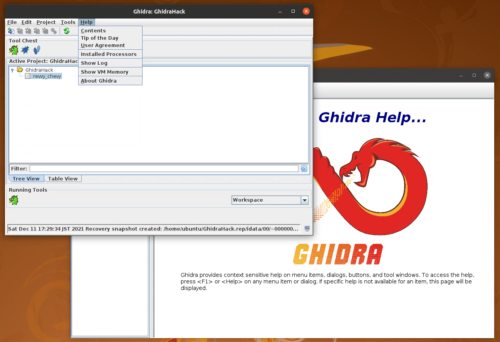

日本語の情報が欲しい場合は、WEBにはあまり体系化された情報が落ちていないので、[Ghidra実践ガイド](https://amzn.to/3robIsL)を読むのがいいと思います。

### エントリポイントを見つける

Ghidraの解析ウィンドウを開いたら、まずはmain関数の逆アセンブル結果とデコンパイル結果を見つけたいと思います。

しかし、デフォルトの画面で左側にあるシンボルツリーからFunctionsの一覧を探したものの、main関数は見つけられませんでした。

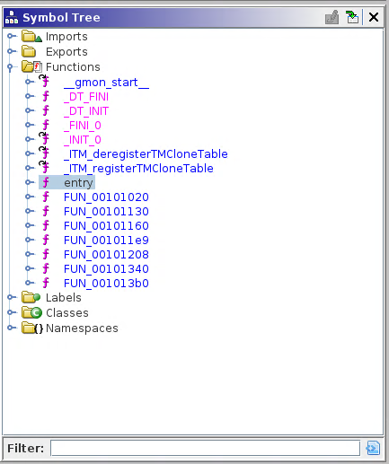

そのため、エントリポイントの逆アセンブル結果から、main関数のアドレスを特定していきます。

エントリポイントとは、ELFバイナリが実行されたときにまず初めに呼び出される関数です。

エントリポイントのファイルオフセットは、ELFヘッダの25バイト目から8バイト分の領域を使って定義されています。

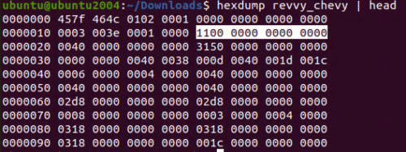

※ リトルエンディアン形式で`0x1100`がエントリポイントのアドレスです。

前述した`readelf`コマンドの`-h`を利用することで、ELFヘッダ内の情報を簡単に参照することができます。

``` bash
$ readelf -h revvy_chevy
ELF Header:
  Magic:   7f 45 4c 46 02 01 01 00 00 00 00 00 00 00 00 00 
  Class:                             ELF64
  Data:                              2's complement, little endian
  Version:                           1 (current)
  OS/ABI:                            UNIX - System V
  ABI Version:                       0
  Type:                              DYN (Shared object file)
  Machine:                           Advanced Micro Devices X86-64
  Version:                           0x1
  Entry point address:               0x1100
  Start of program headers:          64 (bytes into file)
  Start of section headers:          12624 (bytes into file)
  Flags:                             0x0
  Size of this header:               64 (bytes)
  Size of program headers:           56 (bytes)
  Number of program headers:         13
  Size of section headers:           64 (bytes)
  Number of section headers:         29
  Section header string table index: 28
```

ここで、エントリポイントのアドレスが`0x1100`であることがわかったので、Ghidraのシンボルツリーから`entry`関数のアドレスを開いてみましょう。

`entry`関数の逆アセンブル結果とデコンパイル結果が表示されましたが、アドレスを見ると`0x1100`ではなく`0x101100`になっています。

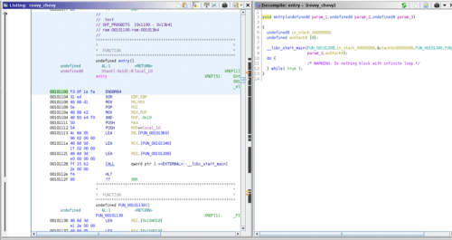

これは、Ghidraのアドレスとして表示されるのはバイナリの実際のアドレスではなく、RVA(相対仮想アドレス)と呼ばれるアドレスだからです。

RVAは、仮想アドレスにベースアドレスやイメージベースと呼ばれるアドレスを加算したものです。

GhidraでELFファイルをロードする際に[Options]から[Image Base]の欄を確認すると、デフォルトで`0x100000`となっていたことがわかります。

そのため、このイメージベースに実際の仮想アドレス`0x1100`を加算した`0x101100`が、GhidraにRVAとして表示されているというわけです。

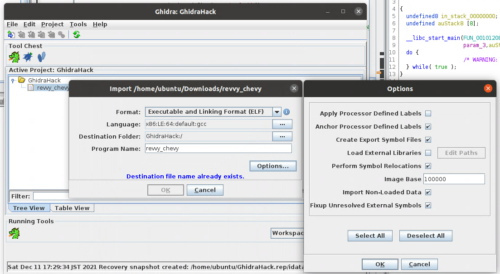

ちなみに、Ghidraのイメージベースの設定は任意に変更ができます。

そのため、このアドレスを`0x555555555000`などに設定しておくことで、gdbなどと併用する場合に表示されるアドレスをそろえることもできます。

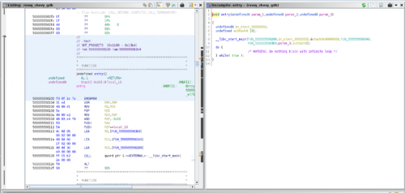

上記の画像はイメージベースを`0x555555555000`に設定した場合のエントリポイントの逆アセンブル結果です。

### RVA / VA / Offsetについて

ここまでなんとなくRVAやアドレス(仮想アドレス)、オフセットといった用語を使ってきたので軽く整理しておこうと思います。

まずファイルオフセットはシンプルにバイナリの先頭から何バイト目かという位置を表します。

バイナリエディタで開いた時に0x100バイト目にあるデータのファイルオフセットは、同じく0x100になります。

次に仮想アドレス（VA）についてです。

この記事では仮想アドレスの詳細については触れませんが、簡単に言えば「ファイルオフセットに各セクションの開始位置を加算」したものが仮想アドレスとなります。

プログラムがOSで実行されるとき、当然実行されるプログラムはメモリに展開されるわけですが、この時実際のメモリアドレス（物理アドレス）に展開してしまうと、複数のアプリケーションを平行して稼働させる必要のあるシステムではメモリアドレスの競合など、様々な弊害が発生します。

これらの問題を回避するため、LinuxなどのOSで実行されるアプリケーションがメモリアドレスを参照するときは、物理アドレスではなく、仮想アドレス（VA）と呼ばれるアドレスを参照します。

この仮想アドレスは、各セクションの先頭にオフセットを加算したものとなります。

例えば、セクションの境界が0x1000に設定されている.dataセクションに存在するデータのファイルオフセットが0x3000の場合、仮想アドレスは0x4000になります。

そして最後、RVAですが、これは前述した通り仮想アドレスにさらにイメージベースのアドレスを加算したアドレスです。

参考：[Understanding Concepts Of VA, RVA and Offset | Tech Zealots](https://tech-zealots.com/malware-analysis/understanding-concepts-of-va-rva-and-offset/)

各アドレスとオフセットの違いや用途については少々わかりづらいとは思いますが、入門的なCTFの問題を解くためにはあまり使わないので、難しい場合は一旦飛ばしてもらって問題ありません。

バイナリを触っていくうちにイメージがつくようになると思います。

### エントリポイントからmain関数を特定する

話を解析に戻します。

エントリポイントのデコンパイル結果を見ると`__libc_start_main`が存在することがわかります。

この関数は、ELFバイナリが実行されるときに必ず最初に呼び出される初期化ルーチンです。

そして、この`__libc_start_main`の第一引数にはmain関数のアドレスが渡されることが決まっています。

つまり、`__libc_start_main`の第一引数を調べれば、今回の問題バイナリのようにシンボル情報がないバイナリであってもmain関数のアドレスを特定することができるようになるのです。

参考：[__libc_start_main](https://refspecs.linuxbase.org/LSB_3.1.0/LSB-Core-generic/LSB-Core-generic/baselib---libc-start-main-.html)

参考：[linux - How to find the main function's entry point of elf executable file without any symbolic information? - Stack Overflow](https://stackoverflow.com/questions/9885545/how-to-find-the-main-functions-entry-point-of-elf-executable-file-without-any-s)

というわけで、`FUN_00101208`がmain関数であることが特定できました。

このままでは分かりづらいので、`FUN_00101208`を右クリックして[Rename Function]から関数名をmainに変更しておきましょう。

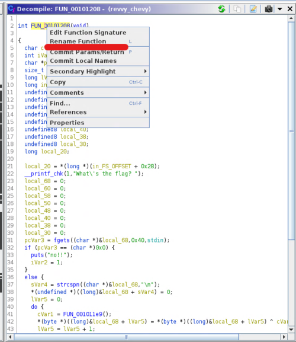

Ghidaを使って解析を行う場合には、関数名や変数名を任意に変更ができるので、その都度分かりやすい名前に変更してあげるとより効率的に解析を進めることができます。

### main関数のデコンパイル結果を見る

まずはmain関数のデコンパイル結果を見てみましょう。（長いのでローカル変数の定義などはカットしてます）

``` c
int main(void)
{
  /* 中略 */ 
  local_20 = *(long *)(in_FS_OFFSET + 0x28);
    
  /* ユーザからの標準入力(stdin)を受けとって local_68 に格納している */ 
  __printf_chk(1,"What\'s the flag? ");
  /* 中略 */ 
  pcVar3 = fgets((char *)&local_68,0x40,stdin);
  if (pcVar3 == (char *)0x0) {				    
    puts("no!!");
    iVar2 = 1;
  }
    
  /* 改行文字を特定し、ヌル文字に変更 */ 
  else {
    sVar4 = strcspn((char *)&local_68,"\n");	 
    *(undefined *)((long)&local_68 + sVar4) = 0;
    lVar5 = 0;
  
  /* 謎のループ処理 */ 
    do {
      cVar1 = FUN_001011e9();
      *(byte *)((long)&local_68 + lVar5) = *(byte *)((long)&local_68 + lVar5) ^ cVar1 + (char)lVar5;
      lVar5 = lVar5 + 1;
    } while (lVar5 != 0x40);
  
  /* local_68 の値とPTR_DAT_00104010の値を 0x40 バイト分比較する */
    iVar2 = memcmp(&local_68,PTR_DAT_00104010,0x40);
    if (iVar2 == 0) {
      puts("You got it!");
    }
    else {
      puts("That\'s not it...");
      iVar2 = 1;
    }
  }
  /* 中略 */ 
}
```

上記より、このmain関数は大きく以下の4つの処理に分割されていることがわかります。

- ユーザからの標準入力(stdin)を受けとって `local_68 `に格納している
- 改行文字を特定し、ヌル文字に変更（バイト列が文字列として評価される場合、0は`\0`と同値として扱われます）
  参考：[c - What is the difference between NULL, '\0' and 0? - Stack Overflow](https://stackoverflow.com/questions/1296843/what-is-the-difference-between-null-0-and-0)
- 謎のループ処理
- local_68 の値とPTR_DAT_00104010の値を 0x40 バイト分比較する

まずは`local_68 `の変数名を`input_text`などに変更してから順番に解析を進めていきましょう。

### 標準入力の受け取り

最初に見ていくのは以下のコードです。

`fgets`関数で最大0x40文字分の入力を標準入力から受け取り、変数`input_text`に格納します。

もし読み取りに失敗した場合は、`no!!`という文字列を出力して終了します。

``` c
pcVar3 = fgets((char *)&input_text,0x40,stdin);
if (pcVar3 == (char *)0x0) {				    
	puts("no!!");
	iVar2 = 1;
}
```

`fgets`関数は、ストリーム（FILEオブジェクト）から指定したバイト数のデータを読み取ることのできる関数です。

参考：[C library function - fgets()](https://www.tutorialspoint.com/c_standard_library/c_function_fgets.htm)

なぜこの関数でユーザの入力を受け取ることができるかというと、LinuxやUNIX系のシステムでは、ほとんどのデバイスがファイルとして抽象化されて扱われるからです。

Linuxシステムでは、以下のマニュアルに記載されているようにFILEオブジェクト`stdin`が標準入力を受け取るインプットストリームとして定義されています。

参考：[stdin(3) - Linux manual page](https://man7.org/linux/man-pages/man3/stdout.3.html)

そのため`fgets`関数で入力値を受け取ることができるのです。

より詳しく知りたい方は、以下の書籍などがわかりやすくて参考になると思います。

参考：[動かしながらゼロから学ぶ Linuxカーネルの教科書](https://amzn.to/3oMmsPY)

### 改行文字の削除

次に焦点とするのはこの部分です。

``` c
sVar4 = strcspn((char *)&input_text,"\n");	 
*(undefined *)((long)&input_text + sVar4) = 0;
```

`strcspn`関数は、第一引数として受け取った文字列の中から、第二引数(reject)として受け取った文字を含まない文字だけで構成される最初の文字列の長さを返却する関数です。

つまり、`strcspn`関数を使うと、任意の文字が最初に登場する場所を特定することができます。

今回は、標準入力から受け取った文字列の中から、改行文字`\n`の位置を特定し、改行文字の存在する場所のバイトを0に変更しています。

なぜこのようなことをしているかというと、標準入力から受け取った文字列には改行文字が含まれているためです。

実際にメモリの中身を見てみると、以下のように改行文字`0x0a`が入力文字の後に続いていることがわかります。

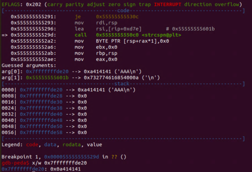

`0x0a`は、LF（ラインフィード）というASCIIで定義された制御文字を意味します。

参考：[改行コードについて - とほほのWWW入門](https://www.tohoho-web.com/wwwxx011.htm)

次に、実際に置換処理が行われた行まで実行を進めてみると、改行文字がメモリから消去されたことがわかります。

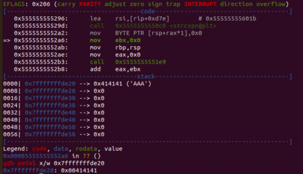

GDBの使い方については後述します。

### ループ処理で文字列をXOR暗号化

次の処理を見ると、謎の関数`FUN_001011e9`の戻り値にループカウンタ`lVar5`を加算した値を使って標準入力から受け取った文字列をXOR暗号化していることがわかります。

``` c
do {
    cVar1 = FUN_001011e9();
    *(byte *)((long)&input_text + lVar5) = *(byte *)((long)&input_text + lVar5) ^ cVar1 + (char)lVar5;
    lVar5 = lVar5 + 1;
} while (lVar5 != 0x40);
```

XOR暗号についての詳細は割愛します。

参考：[たのしいXOR暗号入門](https://gist.github.com/matsubara0507/fada4760f42cd6a52c95)

### 暗号化されたバイト列をチェックする

ここでは、先ほどXOR暗号化された`input_text`と`PTR_DAT_00104010`に定義されたバイト列を0x40バイト分比較して、一致するかどうかをチェックしています。

``` c
iVar2 = memcmp(&input_text,PTR_DAT_00104010,0x40);
if (iVar2 == 0) {
	puts("You got it!");
}
else {
	puts("That\'s not it...");
    iVar2 = 1;
}
```

恐らく、最初の入力で与えられた文字列が正しいフラグの場合は、XOR暗号化された結果と`PTR_DAT_00104010`に定義されているバイト値と同じになるのだと思われます。

### データセクションの値を取得する

続いて、`PTR_DAT_00104010`に定義されている値を確認していきましょう。

ELFバイナリの場合、事前定義された文字列などのデータは`.data`セクションに格納されます。

参考：[Data segment - Wikipedia](https://en.wikipedia.org/wiki/Data_segment)

`.data`セクションは読み書きが可能な領域なので、書き換え可能な変数などがこのセクションに格納されます。

Ghidaのデコンパイル結果から`PTR_DAT_00104010`をクリックすることでも、このデータが定義されたセクションにジャンプすることが可能ですが、せっかくなので`.data`セクションのオフセットを先に特定しようと思います。

まずは`readelf -S`を使って表層解析を行います。

``` bash
$ readelf -S revvy_chevy 
There are 29 section headers, starting at offset 0x3150:

Section Headers:
  [Nr] Name              Type             Address           Offset       Size              EntSize          Flags  Link  Info  Align
  [25] .data             PROGBITS         0000000000004000  00003000       0000000000000018  0000000000000000  WA       0     0     8
```

この出力結果から、仮想アドレス`0x4000`から0x18バイト分の範囲に`.data`セクションが存在することがわかりました。

続いて今度はradare2の解析で`iS`コマンドを使ってセクションテーブルを取得してみます。

``` bash
[0x00001100]> iS
[Sections]

nth paddr        size vaddr       vsize perm name
―――――――――――――――――――――――――――――――――――――――――――――――――
0   0x00000000    0x0 0x00000000    0x0 ---- 
1   0x00000318   0x1c 0x00000318   0x1c -r-- .interp
2   0x00000338   0x20 0x00000338   0x20 -r-- .note.gnu.property
3   0x00000358   0x24 0x00000358   0x24 -r-- .note.gnu.build_id
4   0x0000037c   0x20 0x0000037c   0x20 -r-- .note.ABI_tag
5   0x000003a0   0x28 0x000003a0   0x28 -r-- .gnu.hash
6   0x000003c8  0x138 0x000003c8  0x138 -r-- .dynsym
7   0x00000500   0xd1 0x00000500   0xd1 -r-- .dynstr
8   0x000005d2   0x1a 0x000005d2   0x1a -r-- .gnu.version
9   0x000005f0   0x40 0x000005f0   0x40 -r-- .gnu.version_r
10  0x00000630   0xf0 0x00000630   0xf0 -r-- .rela.dyn
11  0x00000720   0x90 0x00000720   0x90 -r-- .rela.plt
12  0x00001000   0x1b 0x00001000   0x1b -r-x .init
13  0x00001020   0x70 0x00001020   0x70 -r-x .plt
14  0x00001090   0x10 0x00001090   0x10 -r-x .plt.got
15  0x000010a0   0x60 0x000010a0   0x60 -r-x .plt.sec
16  0x00001100  0x2b5 0x00001100  0x2b5 -r-x .text
17  0x000013b8    0xd 0x000013b8    0xd -r-x .fini
18  0x00002000   0x81 0x00002000   0x81 -r-- .rodata
19  0x00002084   0x4c 0x00002084   0x4c -r-- .eh_frame_hdr
20  0x000020d0  0x128 0x000020d0  0x128 -r-- .eh_frame
21  0x00002d90    0x8 0x00003d90    0x8 -rw- .init_array
22  0x00002d98    0x8 0x00003d98    0x8 -rw- .fini_array
23  0x00002da0  0x1f0 0x00003da0  0x1f0 -rw- .dynamic
24  0x00002f90   0x70 0x00003f90   0x70 -rw- .got
25  0x00003000   0x18 0x00004000   0x18 -rw- .data
26  0x00003018    0x0 0x00004020   0x10 -rw- .bss
27  0x00003018   0x2a 0x00000000   0x2a ---- .comment
28  0x00003042  0x10a 0x00000000  0x10a ---- .shstrtab
```

こちらの結果でも、仮想アドレス`0x4000`から0x18バイト分の範囲に`.data`セクションが存在することがわかりました。

というわけで、実際にGhidraでRVA`0x104000`の逆アセンブル結果を見てみます。

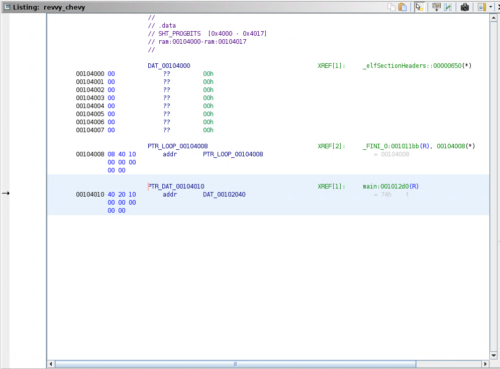

0x18バイト目までの範囲でデータが格納されています。

今回のターゲットは`PTR_DAT_00104010`の値ですが、.dataセクションにはポインタとして格納されているようです。

そのため、このポインタが指している`DAT_00102040`にさらにジャンプしてみます。

バイト列が格納されていますね。

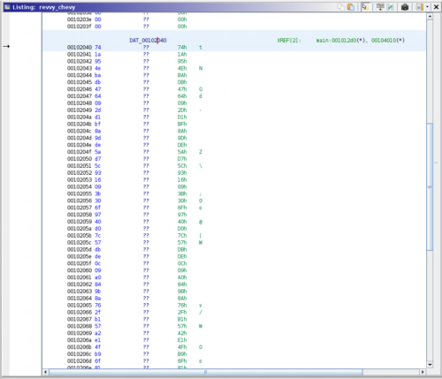

最終的に`iVar2 = memcmp(&input_text,PTR_DAT_00104010,0x40);`の行では、このアドレス`0x104010`の先頭から0x40バイト分のデータを参照しています。

このままだと見づらいので、Ghidraの機能を使ってこのデータを整形して取得します。

今回は後でPythonスクリプトで使いたいので、Pythonの配列形式で取得することにしました。

まずは`0x104000`から0x40バイト分の範囲を選択して右クリックします。

次に[Copy Special]を押して、[Python List]を選択します。

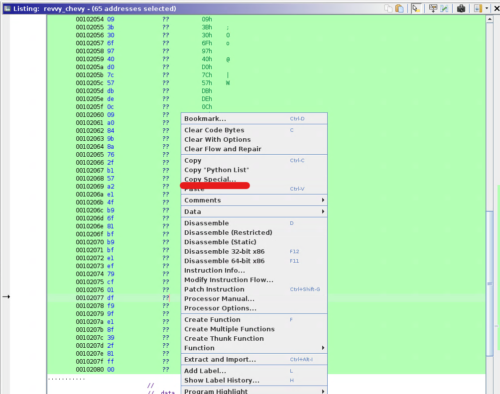

すると、次のようにPythonの配列として利用できる形式でバイナリデータを取得することができました。

``` bash
[ 0x74, 0x1a, 0x95, 0x4e, 0xba, 0xdb, 0x47, 0x64, 0x09, 0x2d, 0xd1, 0xbf, 0x8a, 0x9d, 0xde, 0x5a, 0xd7, 0x5c, 0x93, 0x16, 0x09, 0x3b, 0x30, 0x6f, 0x97, 0x40, 0xd0, 0x7c, 0x57, 0xdb, 0xde, 0x0c, 0x09, 0xa0, 0x84, 0x9b, 0x8a, 0x76, 0x2f, 0xb1, 0x57, 0xa2, 0xe1, 0x4f, 0xb9, 0x6f, 0x81, 0xbf, 0xb9, 0xbf, 0xe1, 0xef, 0x79, 0xcf, 0x01, 0xdf, 0xf9, 0x9f, 0xe1, 0x8f, 0x39, 0x2f, 0x81, 0xff, 0x00 ]
```

他にも様々なデータ型への変換やコピーの方法があるので、必要に応じて使い分けると解析をスムーズに行うことができます。

## XOR暗号化時の関数を解析する

もう少し静的解析を続けていきます。

先ほど解析した以下のXOR暗号化を行う処理の中に、`FUN_001011e9`という関数を実行している行がありました。

``` c
do {
    cVar1 = FUN_001011e9();
    *(byte *)((long)&input_text + lVar5) = *(byte *)((long)&input_text + lVar5) ^ cVar1 + (char)lVar5;
    lVar5 = lVar5 + 1;
} while (lVar5 != 0x40);
```

ここからは、この関数の処理を追っていきます。

Ghidraのデコンパイル結果を見てみると、たった一行だけのシンプルな関数でした。

``` c
void FUN_001011e9(void)
{
  DAT_0010402c = DAT_0010402c * 0x41c64e6d + 0x3039 & 0x7fffffff;
  return;
}
```

`DAT_0010402c`は未定義の変数でしたので、`valiable`などの適当な名前に置き換えておきます。

さて、ここで一つ疑問が出てきました。

呼び出し元の`cVar1 = FUN_001011e9();`というデコンパイル結果を見ると、この関数の戻り値が`cVar1 `に格納されるように見えます。

しかし、実際にこの関数のデコンパイル結果を見てみると戻り値のない`void`関数になっています。

これはどちらが正しいのでしょうか。

アセンブリを読んだり動的解析で特定しても良いですが、今回はIDA Freeによるデコンパイル結果も見てみようと思います。

### IDA Freeを使う

せっかく事前にインストールをお願いしているので、IDA Freeの解析結果も見てみましょう。

IDAに関する詳細な説明は割愛しますので、以下のコマンドで起動し、問題バイナリをインポートしてください。

``` bash
$ ida64
```

Ghidraで解析したときとは異なり、初めからmain関数のシンボルを特定してくれていますね。

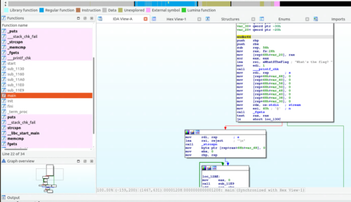

IDAでは、逆アセンブル結果が出力されている画面で[F5]キーを押すとデコンパイルを行ってくれます。

Ghidraの時と同じ行からXOR暗号化時に実行されている関数を特定してデコンパイル結果を確認すると、以下のようにint64型の戻り値を返すことがわかりました。

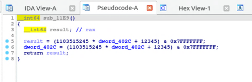

このように、デコンパイルの結果はデコンパイラによって異なっていたり、そもそも間違った結果が出る場合もあります。

そのため、デコンパイラを妄信せず困ったときにはアセンブリを丁寧に読んだり他のツールの結果と見比べてみたりするのがおすすめです。

### XOR暗号化の挙動を見抜く

さて、これでこの戻り値`cVar1`にループカウンタ`lVar5`を加算した値を利用して`input_text`を先頭から1文字ずつXOR暗号化を行っていることがわかりました。

``` c
*(byte *)((long)&input_text + lVar5) = *(byte *)((long)&input_text + lVar5) ^ cVar1 + (char)lVar5;
```

最終的にこの暗号化結果が以下のバイト列になる入力を見つけることができればFlagが取得できそうです。

``` bash
[ 0x74, 0x1a, 0x95, 0x4e, 0xba, 0xdb, 0x47, 0x64, 0x09, 0x2d, 0xd1, 0xbf, 0x8a, 0x9d, 0xde, 0x5a, 0xd7, 0x5c, 0x93, 0x16, 0x09, 0x3b, 0x30, 0x6f, 0x97, 0x40, 0xd0, 0x7c, 0x57, 0xdb, 0xde, 0x0c, 0x09, 0xa0, 0x84, 0x9b, 0x8a, 0x76, 0x2f, 0xb1, 0x57, 0xa2, 0xe1, 0x4f, 0xb9, 0x6f, 0x81, 0xbf, 0xb9, 0xbf, 0xe1, 0xef, 0x79, 0xcf, 0x01, 0xdf, 0xf9, 0x9f, 0xe1, 0x8f, 0x39, 0x2f, 0x81, 0xff, 0x00 ]
```

このまま静的解析でFlagを特定することもできますが、結構面倒なのでここからは動的解析を行っていきます。

動的解析とは、実際に実行ファイルを動かしながら解析を行う方法です。

今回はgdbというデバッガを使って動的解析を行い、Flagを特定していきたいと思います。

## gdbで動的解析を行う

まずはgdbで問題バイナリを開いてみましょう。

すでにgdb-pedaを導入している場合は、色付けされたコンソールが開きます。

``` bash
$ gdb ./revvy_chevy
```

gdb-pedaの詳細は割愛しますが、gdbのレジスタやメモリ情報などを綺麗に可視化してくれる拡張機能のようなものだと思ってください。

参考：[longld/peda: PEDA - Python Exploit Development Assistance for GDB](https://github.com/longld/peda)

gdbでCTFの問題を解く際の基本的な操作は次のようになります。

- **怪しい箇所や動きを把握したい箇所にブレークポイントを設定する**
- **ブレークポイントで処理を停止して、メモリやレジスタの情報を参照する**
- **Flagを取得するために、実行中のプログラムのメモリやレジスタのデータを改ざんして、本来は実行されない処理を呼び出す**

### gdbのロードアドレスを特定する

まずはmain関数にブレークポイントを設定してみます。

gdbでは、以下のいずれかのコマンドでブレークポイントの設定が可能です。

``` bash
b <ブレークポイント対象>
break <ブレークポイント対象>
```

ブレークポイント対象には、関数名や現在のファイルの行番号、停止時点からのオフセット、メモリアドレスなどを指定することができます。

今回の問題のように、CTFの場合はシンボル情報が与えられていない場合が多いので、基本的にはメモリアドレスでのブレークポイントの設定が主になるかと思います。

先ほどGhidraでmain関数を特定したときは、main関数のアドレスは`0x1208`でしたね。

しかし、このアドレスをgdbで指定しても、main関数にブレークポイントを設定することはできません。

gdbでブレークポイントを設定するときは、gdbがプログラムを実行したときに読み込むRVAを指定 してあげる必要があります。

main関数のアドレスは`0x1208`は仮想アドレス(VA)ですので、RVAを特定するためにgdbが実行されたときにメモリを展開するベースアドレスを特定していきます。

ベースアドレスを特定するために、とりあえず問題バイナリをgdbから実行してみます。

`run`コマンドで実行すると、先ほど同様標準入力を求められます。

``` bash
$ run
Starting program: /home/parrot/Downloads/revvy_chevy 
What's the flag? 
```

ここで[Ctrl+C]を押してプログラムの処理を中断しましょう。

[Ctrl+C]キーを押すことでキーボード割込みSIGINTが発生して、プログラムの実行を中断し、gdbを操作できるようになります。

この状態で`info proc mappings`コマンドを実行します。

``` bash
$ info proc mappings 
process 1971
Mapped address spaces:
          Start Addr           End Addr       Size     Offset objfile
      0x555555554000     0x555555555000     0x1000        0x0 /home/parrot/Downloads/revvy_chevy
      0x555555555000     0x555555556000     0x1000     0x1000 /home/parrot/Downloads/revvy_chevy
      0x555555556000     0x555555557000     0x1000     0x2000 /home/parrot/Downloads/revvy_chevy
      0x555555557000     0x555555558000     0x1000     0x2000 /home/parrot/Downloads/revvy_chevy
      0x555555558000     0x555555559000     0x1000     0x3000 /home/parrot/Downloads/revvy_chevy
  	  /* 省略 */
```

すると、問題バイナリのオフセットと、gdbがロードするメモリアドレスのマッピング情報が確認できます。

ファイルオフセット`0x1000`が`0x555555555000`にマッピングされているようです。

readelfやradare2で表層解析を行った結果から`.text`セクションのアドレスは`0x1100`であることがわかっているため、`0x1100`がgdb実行時の`0x555555555100`に対応します。

少しわかりづらいかもしれませんが、アドレス`0x1100`がgdb実行時の`0x555555555100`にロードされるということは、main関数のアドレス`0x1208`はgdb上の`0x555555555208`にロードされるというわけです。

### ブレークポイントを設定する

これでmain関数のRVAを特定できたので、さっそくブレークポイントを設定して実行してみましょう。

以下のコマンドでブレークポイントを設定します。

アドレスを指定してブレークポイントを設定する場合は`*`を付ける必要があります。

``` bash
$ b *0x555555555208
Breakpoint 1 at 0x555555555208
```

ブレークポイントの設定は、`i breakpoint`で確認可能です。

今回は使用しませんが、`Num`の値がブレークポイントのIDとなるので、これを使用して`delete <Num>`もしくは`d <Num>`コマンドを使ってブレークポイントを削除することができます。

``` bash
i breakpoints 
Num     Type           Disp     Enb Address            What
1       breakpoint     keep y   0x0000555555555208
```

ブレークポイントが設定されたことが確認できたので、`run`コマンドを呼び出しましょう。

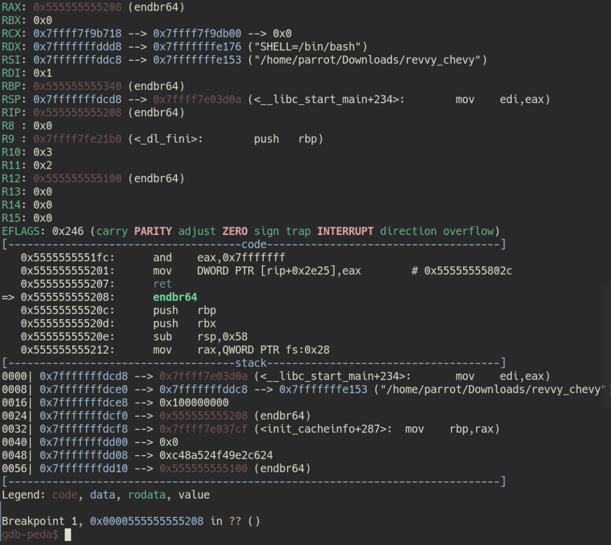

main関数の呼び出しタイミングで処理が停止し、gdb-pedaによってレジスタやスタックの情報が表示されました。

ちなみに`run`コマンドはgdbからプロセスを起動するコマンドで、実行時にコマンドライン引数を与えたい場合は`run <コマンドライン引数>`のようにして呼び出します。

### Ghidraのイメージベースを変更する

ここからはGhidraのデコンパイル結果とgdbを対応させながら解析を進めていくので、Ghidraのベースアドレスをgdbに合わせて`0x555555554000`に変更しておきましょう。

Ghidraのベースアドレスの変更は、ファイルインポート時の[Options]から行うか、[Window]>[Memory Map]を開いて、右側にある[Set Image Base]ボタンから変更できます。

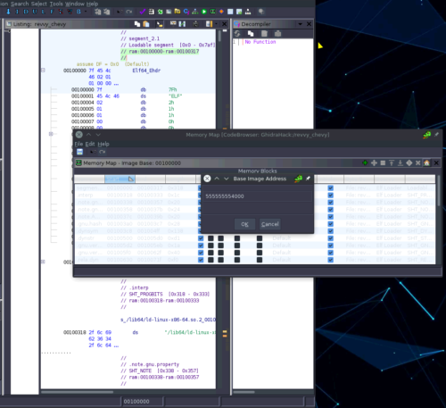

これでmain関数のアドレスも、gdbにロードされるアドレスと同じ`0x555555555208`に変更されたので、対応が分かりやすくなりました。

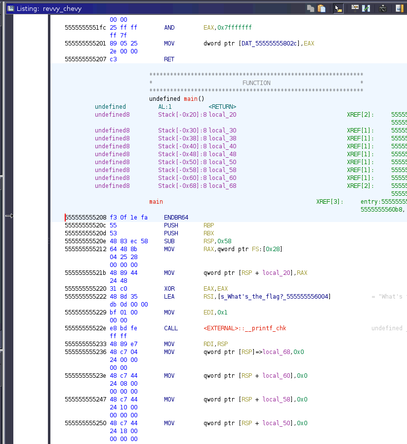

### gdbでよく使うコマンド(一部のみ)

ここから本格的に動的解析を進めていきますが、先にgdb操作でよく使うコマンドを整理しておきます。

今回はごく一部のコマンドのみしか紹介しませんが、詳しくは[Debug Hacks](https://amzn.to/3lkunSs)などが参考になると思います。

|                      コマンド                      |                             用途                             |
| :------------------------------------------------: | :----------------------------------------------------------: |
| break <ブレークポイント><br />b <ブレークポイント> | ブレークポイントを設定する<br />アドレスを指定する場合は`*`が必要 |
|             info <引数><br />i <引数>              | 実行中プロセスの情報を表示する<br />引数無しで実行するとヘルプが表示される |
|              run <コマンドライン引数>              |                      プロセスを実行する                      |
|  p/<フォーマット> $eax<br />p/<フォーマット> 変数  | 変数やレジスタの値を表示する<br />フォーマットには x / d / c / s / i などを利用することが多い |
|         x/<フォーマット> <メモリアドレス>          | メモリの中身を表示する<br />$ecxなどのようにレジスタの参照しているアドレスを確認することもできる |
|                    next<br />n                     |   一行ずつ実行する<br />関数の呼び出し先にはジャンプしない   |
|                    step<br />s                     | 処理を一つずつ実行する<br />関数の呼び出し先にもジャンプする |
|                  continue<br />c                   |                   プロセスの実行を再開する                   |
|                       finish                       |               今いる関数を終了するまで実行する               |
|                    until<br />u                    |                    指定した行まで実行する                    |

実際に使用する場合は、以下のチートシートなども参考になると思います。

参考：[GDB Cheat Sheet](https://darkdust.net/files/GDB%20Cheat%20Sheet.pdf)

### 解析の方針を立てる

とりあえずgdbを使ってブレークポイントを設定することができるようになりましたが、闇雲にブレークポイントを設定してもFlagを特定するのは非常に困難です。

そのため、まずは静的解析の結果から解析方針を立てていこうと思います。

今わかっている情報は以下の通りです。

- ユーザから入力された文字列をXOR暗号化してPTR_DAT_00104010(イメージベースが`0x100000`だった時の名前)のバイト列と比較する
- XOR暗号化は一文字ずつ行われ、キーには関数FUN_001011e9(イメージベースが`0x100000`だった時の名前)の戻り値にループカウンタ`lVar5`を加算した値をが利用される

XOR暗号は、暗号化と復号に同じキーを利用します。

つまり、`A ^ K = B`という方法で暗号化した場合は、`B ^ K = A`の式で元のデータを復号することができます。

このような理由から、問題バイナリが暗号化に使用しているキーさえ特定することができれば、PTR_DAT_00104010(イメージベースが`0x100000`だった時の名前)に格納されているバイト列に対してXOR演算を行うことで、元のFlag文字列を特定することができます。

ここで、XOR暗号に使用するキーの元になる値は一文字ごとに以下のコードで生成されていました。

``` bash
DAT_0010402c = DAT_0010402c * 0x41c64e6d + 0x3039 & 0x7fffffff;
```

もちろんここから静的解析でキーを特定することもできますが、少々面倒なので動的解析でキーを特定していきます。

言い換えると、動的解析を利用して関数FUN_001011e9(イメージベースが`0x100000`だった時の名前)の戻り値を特定していこうということです。

### x86_64アーキテクチャのレジスタについて

関数の戻り値をgdbで特定する前に、少しだけレジスタについて触れておきます。

x86_64アーキテクチャとは、Intelのx86アーキテクチャを64ビットに拡張したものです。

x86_64アーキテクチャのCPUには、64bitの汎用レジスタが16個、64bitのRPIレジスタとRFRAGSレジスタが1個ずつ、128bitのXMMレジスタが16個搭載されています。

主なレジスタの用途については下記に整理しておきます。

|                   レジスタ                    |                             用途                             |
| :-------------------------------------------: | :----------------------------------------------------------: |
|          RAX<br />（アキュムレータ）          | 主に演算結果、関数の戻り値などが格納される汎用レジスタです<br />下位32bitをEAXレジスタとして利用します |
|          RBX<br />（ベースレジスタ）          | 主にデータへのポインタが格納される汎用レジスタです<br />下位32bitをEBXレジスタとして利用します |
|         RCX<br />（カウンタレジスタ）         | 主に文字列やループカウンタが格納される汎用レジスタです<br />下位32bitをECXレジスタとして利用します |
|          RDX<br />（データレジスタ）          | 主にI/Oポインタの計算時に変数として利用されます<br />下位32bitをEDXレジスタとして利用します |
|        RSI<br />（ソースインデックス）        | 主に文字列のコピー先などに使用されます<br />下位32bitをESIレジスタとして利用します |
| RDI<br />（ディスティネーションインデックス） | 主に文字列操作時の宛先指定に使用されます<br />下位32bitをEDIレジスタとして利用します |
|     RSP<br />（スタックポインタレジスタ）     | スタックポインタとして使用されます<br />下位32bitをESPレジスタとして利用します |
|      RBP<br />（ベースポインタレジスタ）      | スタック上のデータへのポインタとして使用されます<br />下位32bitをEBPレジスタとして利用します |
|    RIP<br />（インストラクションレジスタ）    |                   命令セットが格納されます                   |
|        RFLAGS<br />（フラグレジスタ）         |  下位32bitがEFRAGSと同様にフラグレジスタとして使用されます   |

参考：[Debug Hacks -デバッグを極めるテクニック&ツール](https://amzn.to/3lkunSs)

参考：[詳解セキュリティコンテスト](https://amzn.to/3o7g5Gj)

各レジスタやアーキテクチャの詳細についてはここでは割愛しますが、関数実行後の戻り値はRAXレジスタに格納されるため、CALL命令の直後のRAXレジスタを参照することが、関数の結果を取得する際の基本方針になります。

### 関数の戻り値を特定する

Ghidraの結果から、キーを生成している関数を呼び出しているアドレスは、`0x5555555552b3`であることがわかります。

つまり、その次の命令である`0x5555555552b8`時点のRAXレジスタに格納されている値が、この関数の戻り値であるということがわかります。

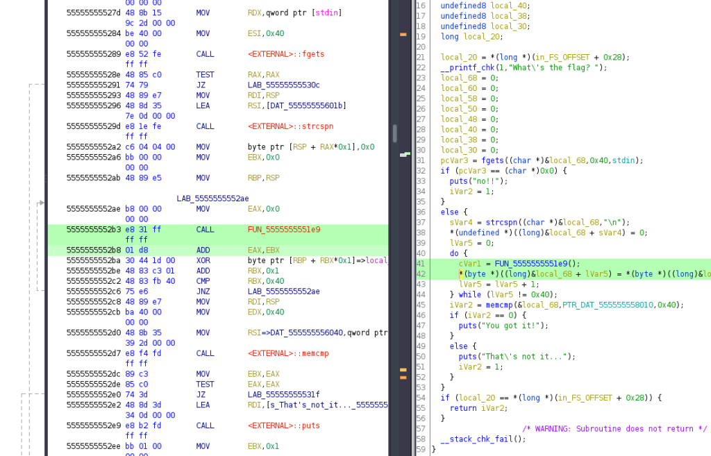

`0x5555555552b8`では、キーを生成している関数の戻り値にさらにEBXの値を格納しています。

これが最終的にXOR暗号を行うためのキーになります。

ADD命令の演算結果は、関数の戻り値と同様にアキュムレータ（RAX）に格納されます。

そこで、gdbで`0x5555555552ba`にブレークポイントを設定して実行してみましょう。

``` bash
$ b *0x5555555552ba
$ run
```

RAXレジスタの値が`0x3039`であることがわかりました。

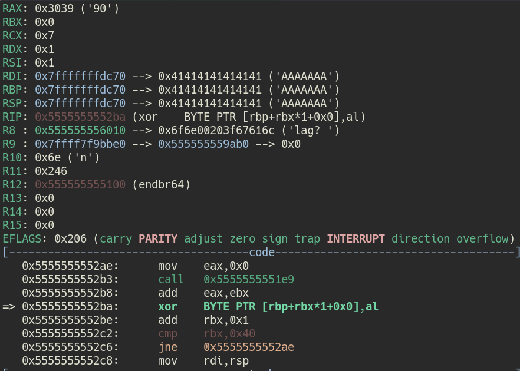

ちなみにレジスタの値は、`p`コマンドを使って取得することもできます。

``` bash
$ p $rax
$2 = 0x3039
```

特に今回の場合、XORの暗号化を行った後のバイト列はchar型になるので、XOR暗号化に使用するキーもRAXレジスタの値の下位8bitのみになります。

特定のレジスタの下位8bitの値のみを取り出したい場合は、`$al`レジスタの値を`p`コマンドで出力します。

``` bash
$ p $al
$3 = 0x39
```

つまり、1文字目の暗号化を行うキーは`0x39`であるということがわかります。

このキーは1文字を暗号化するたびに生成されるので、`c`コマンドを使って実行を再開すると次は2文字目の暗号化を行うタイミングにブレークポイントが設定されます。

この方法で、要領で4文字目までのキーを特定してみました。

``` bash
1文字目：0x39
2文字目：0x7f
3文字目：0xe1
4文字目：0x2f
```

このキーと、先ほどGhidraから特定した以下のバイト列を利用してFlagの4文字目まで復号できるかを試してみます。

``` bash
[ 0x74, 0x1a, 0x95, 0x4e, 0xba, 0xdb, 0x47, 0x64, 0x09, 0x2d, 0xd1, 0xbf, 0x8a, 0x9d, 0xde, 0x5a, 0xd7, 0x5c, 0x93, 0x16, 0x09, 0x3b, 0x30, 0x6f, 0x97, 0x40, 0xd0, 0x7c, 0x57, 0xdb, 0xde, 0x0c, 0x09, 0xa0, 0x84, 0x9b, 0x8a, 0x76, 0x2f, 0xb1, 0x57, 0xa2, 0xe1, 0x4f, 0xb9, 0x6f, 0x81, 0xbf, 0xb9, 0xbf, 0xe1, 0xef, 0x79, 0xcf, 0x01, 0xdf, 0xf9, 0x9f, 0xe1, 0x8f, 0x39, 0x2f, 0x81, 0xff, 0x00 ]
```

実際に4文字目まで復号してみると、出力が`Meta`となり、MetaCTFのフラグフォーマットに一致していることがわかりました。

``` python
enc = [ 0x74, 0x1a, 0x95, 0x4e ]
key = [ 0x39, 0x7f, 0xe1, 0x2f ]
for i in range(4):
	print(chr(enc[i] ^ key[i]) ,end="")
>>> Meta
```

これであとは、0x40文字分のキーを特定することができればFlagを特定できそうです。

しかし、この手順を56回もやるのはかなり面倒くさいです。

そこで、ここからはgdbの処理を自動化してFlagを一気に取得します。

## gdbを自動化する

gdbは、`.gdbinit`や`gdb-python`を使って処理を自動化することができます。

参考：[scripting - What are the best ways to automate a GDB debugging session? - Stack Overflow](https://stackoverflow.com/questions/10748501/what-are-the-best-ways-to-automate-a-gdb-debugging-session)

参考：[Python (Debugging with GDB)](https://sourceware.org/gdb/onlinedocs/gdb/Python.html#Python)

`.gdbinit`の方が簡単にgdbのコマンド操作を自動化できますが、今回は取得した値を元に計算を行いたいので、より柔軟な処理を簡単に定義できる`gdb-python`を使用してきます。

### gdb-pythonを使う

`gdb-python`を利用してデバッグを行う場合、以下のPythonスクリプトが基本形になります。

``` python
import gdb

BINDIR = "~/Downloads"
BIN = "revvy_chevy"
INPUT = "./in.txt"
BREAK = "0x5555555552ba"

with open(INPUT, "w") as f:
    f.write("A"*0x40)

gdb.execute('file {}/{}'.format(BINDIR, BIN))
gdb.execute('b *{}'.format(BREAK))
gdb.execute('run < {}'.format(INPUT))

gdb.execute('quit')
```

`gdb.execute()`が、Pythonスクリプトからgdbのコマンドを実行する関数です。

基本はgdbをコマンド操作するときと同じですが、少々ややこしい点として実行中の入力値はファイルに事前定義しておく必要がある点です。

今回のプログラムは標準入力からの入力を求められるため、実行前に`./in.txt`というファイルを作成して、0x40バイト分の文字列を予め書き込んでいます。

これを実行すると、gdbでプログラムを実行して0x40バイト分の文字列を入力し、`0x5555555552ba`のブレークポイントで処理を停止して、その後デバッグを終了するという処理を自動化することができます。

呼び出しはPythonからではなく、以下のように`gdb -x`コマンドを使います。

``` bash
gdb -x solver.py
```

最後に、キーを取得する処理を追加してFlagを取得していきます。

### Flag取得

ここまでくればあとは簡単です。

先ほど手動で実行していたcontinueコマンドを利用して1文字ずつキーを取得する作業を自動化しました。

これがSolverスクリプトです。

``` python
# gdb -x solver.py
import gdb

BINDIR = "~/Downloads"
BIN = "revvy_chevy"
INPUT = "./in.txt"
BREAK = "0x5555555552ba"

# Ghidraから取得したバイト列
data = [ 0x74, 0x1a, 0x95, 0x4e, 0xba, 0xdb, 0x47, 0x64, 0x09, 0x2d, 0xd1, 0xbf, 0x8a, 0x9d, 0xde, 0x5a, 0xd7, 0x5c, 0x93, 0x16, 0x09, 0x3b, 0x30, 0x6f, 0x97, 0x40, 0xd0, 0x7c, 0x57, 0xdb, 0xde, 0x0c, 0x09, 0xa0, 0x84, 0x9b, 0x8a, 0x76, 0x2f, 0xb1, 0x57, 0xa2, 0xe1, 0x4f, 0xb9, 0x6f, 0x81, 0xbf, 0xb9, 0xbf, 0xe1, 0xef, 0x79, 0xcf, 0x01, 0xdf, 0xf9, 0x9f, 0xe1, 0x8f, 0x39, 0x2f, 0x81, 0xff, 0x00 ]
key = []

with open(INPUT, "w") as f:
    f.write("A"*0x40)

gdb.execute('file {}/{}'.format(BINDIR, BIN))
gdb.execute('b *{}'.format(BREAK))
gdb.execute('run < {}'.format(INPUT))

# 0x40文字分のキーを取得して key に格納する
for i in range(0x40):
    # gdb.execute('p $al')
    r = gdb.parse_and_eval("$al")
    key.append(int(r.format_string(), 16))
    gdb.execute('continue')

# 取得したキーを元にFlagを復号する
flag = ""
for i in range(0x40):
    flag += chr(data[i] ^ key[i])
	if chr(data[i] ^ key[i]) == "}":
        break

print(flag)
gdb.execute('quit')
```

これを実行すると、最終的にFlagの文字列が取得できます。

## おまけ：よく使うgdbのテクニック

最後に、今回の問題では使用しなかったテクニックについても補足しておきます。

解析のために、以下のソースコードをコンパイルしたプログラムを使用します。

`is_vulun`が1の場合にのみ、keyを作成するループが実行されるプログラムです。

``` c
#include <stdio.h>
#define TEXT "Enjoy debug!\n"

char key[10] = {};

int main() {
	printf(TEXT);
    int is_vulun = 0;
    if (is_vulun == 1)
    {
    	for (int i = 0; i < 10; i++)
    	{
        	key[i] = (char)(0x41+i);
    	}
        printf("Key %s\n", key);
    }
    printf("Finish!!\n");
	return 0;
}
```

まずはこのソースコードを`easy.c`として保存して、`gcc easy.c -o easy`で実行ファイルを作成します。

しかし、コンパイルしたプログラムを実行してみたものの、`is_vulun = 0`となっているためにキー生成のループは実行されませんでした。

### EFRAGSを書き換えて条件分岐をバイパスする

まずは`is_vuln`の結果をもとに条件分岐を行っている行を見てみます。

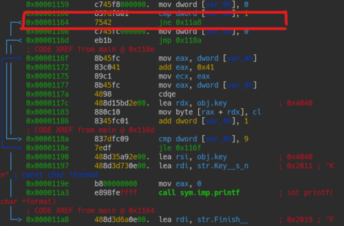

ここで、`var_8h`というのは`is_vulun`が格納されたローカル変数です。

`cmp`命令によって、32bit符号なし整数(`dword`)として１との比較を行っています。

``` bash
0x00001160      837df801       cmp dword [var_8h], 1
0x00001164      7542           jne 0x11a8
```

`cmp`命令は、条件分岐の際に2つの値を比較する場合によく登場しますが、その実態はただの減算です。

ただし、減算を行う`sub`命令とは異なり、演算結果をレジスタに格納することはありません。

参考：[assembly - Understanding cmp instruction - Stack Overflow](https://stackoverflow.com/questions/45898438/understanding-cmp-instruction)

ではなぜ単なる減算を行うだけの`cmp`命令を条件分岐に使用しているのかといえば、演算によってフラグレジスタが更新されるためです。

フラグレジスタは、CPUが演算を行った際に演算結果や状態を示すために使用されるレジスタです。

x86_64アーキテクチャではRFLAGSレジスタの下位32bitが使用されています。

参考：[X86アセンブラ/x86アーキテクチャ - Wikibooks](https://ja.wikibooks.org/wiki/X86%E3%82%A2%E3%82%BB%E3%83%B3%E3%83%96%E3%83%A9/x86%E3%82%A2%E3%83%BC%E3%82%AD%E3%83%86%E3%82%AF%E3%83%81%E3%83%A3)

フラグレジスタは、32bitのうちの各bitの値にそれぞれ意味があり、演算結果に基づいて値が変更されます。

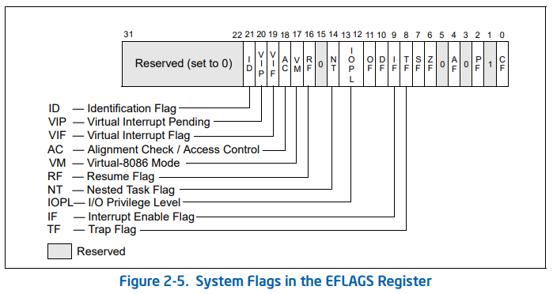

※ 画像は[Intel Developper Manual](https://www.intel.com/content/dam/www/public/us/en/documents/manuals/64-ia-32-architectures-software-developer-vol-3a-part-1-manual.pdf)より

フラグレジスタの値の内、特に条件分岐に使用することの多いレジスタは以下の通りです。

|            FLAG            |                             用途                             | bit番号 |
| :------------------------: | :----------------------------------------------------------: | :-----: |
|    CF（キャリーフラグ）    | 加算においてレジスタの大きさを越える値を使用する場合に、桁上がりが発生した場合にセットされる |    0    |
|      ZF（ゼロフラグ）      |       操作の結果がゼロ (0) になった場合にセットされる        |    6    |
|      SF（符号フラグ）      |           操作の結果が負となった場合にセットされる           |    7    |
| OF（オーバーフローフラグ） | 符号付き算術演算の結果がレジスタに格納できないほど大きい値になった場合にセットされる |   11    |

`cmp`命令によって条件分岐する場合には、減算結果が0であるか、もしくは正の値や負の値であるかによって分岐を決定します。

実際にフラグレジスタの値に基づいて分岐を決定するのはいくつかのジャンプ命令です。

| 命令 |            ジャンプ条件             | Opcode |
| :--: | :---------------------------------: | :----: |
|  JE  |           等しい(ZF = 1)            |   74   |
| JNE  |         等しくない(ZF = 0）         |   75   |
|  JG  |   より大きい（ZF = 0 & SF = OF）    |   7F   |
| JGE  |    より大きいか等しい（SD = OF）    |  ７D   |
| JNG  | より大きくない（ZF = 1 \| SF ! OF） |  ７E   |
|  JL  |        より小さい（SF ! OF）        |  ７C   |

参考：[インラインアセンブラで学ぶアセンブリ言語 第3回 (1/3)：CodeZine（コードジン）](https://codezine.jp/article/detail/485)

右列のオペコード(opcode)は、すぐに探せるようにしておくとパッチを当てて強制的に条件分岐を改ざんするときなどに便利です。

オペランドによってオペコードが変わる場合もありますが、基本的には以下のIDMを探すとよいと思います。

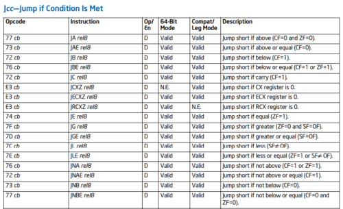

参考：[Intel x86 Assembler Instruction Set Opcode Table](http://sparksandflames.com/files/x86InstructionChart.html)

`Jcc—Jump if Condition Is Met`のテーブルを参照してください。

ここまでフラグレジスタとジャンプ命令について整理したところで、本題に戻ります。

`is_vulun`の値が1であるかを特定する以下の条件分岐をバイパスしていきましょう。

``` bash
0x00001160      837df801       cmp dword [var_8h], 1
0x00001164      7542           jne 0x11a8
```

`var_8h`には必ず0が格納されるので、`0x00001160`の`cmp`命令が実行された結果、フラグレジスタは`[ CF PF AF SF IF ]`のフラグが立っている状態になります。

ここでは各フラグの詳細についてはいったん気にしなくてよいので、`jne`で処理をスキップされないために必要な`ZF`が立っていない点に着目してください。

gdbで実行してみた結果は以下のようになります。

``` bash
$ b *0x555555555164
$ p $eflags
$5 = [ CF PF AF SF IF ]
```

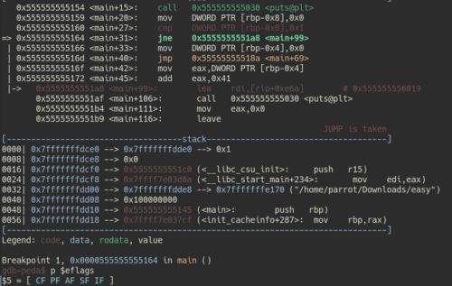

実際にZFが立っていないことが確認できました。

ここで条件分岐をバイパスするためには、ZFを立てる必要があります。

gdbでは、メモリのデータは`set`コマンドで改ざんすることができます。

先ほど確認した通り、ZFはフラグレジスタの6bit目の値が対応しています。

つまり、フラグレジスタの6bit目の値を強制的に1に書き換えることでZFを立てることができます。

``` bash
# OR演算で$eflagsの6bit目の値を0に設定する
$ set $eflags |= (1 << 6)
$ p $eflags
$7 = [ CF PF AF ZF SF IF ]
```

上記のように、`set $eflags |= (1 << 6)`を実行することでZFを立てることができました。

この状態で`n`コマンドで処理を進めると、本来実行されるはずのない`0x555555555166`に処理を進めることができました。

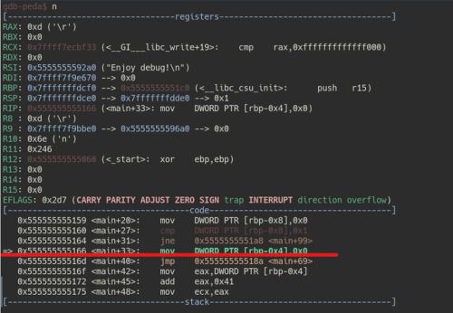

次は、フラグレジスタではなく変数の値をメモリから参照した後に改ざんすることで条件分岐をバイパスさせてみたいと思います。

### メモリの中から情報を抜き出す

先ほど同様以下の処理を見ていきます。

``` bash
0x00001160      837df801       cmp dword [var_8h], 1
0x00001164      7542           jne 0x11a8
```

今度は`0x00001160`にブレークポイントを設定しましょう。

そこで`run`コマンドを実行すると、`cmp`命令の呼び出し地点で処理が停止します。

``` bash
$ b *0x555555555160
$ run
   0x555555555159 <main+20>:    mov    DWORD PTR [rbp-0x8],0x0
=> 0x555555555160 <main+27>:    cmp    DWORD PTR [rbp-0x8],0x1
   0x555555555164 <main+31>:    jne    0x5555555551a8 <main+99>
   0x555555555166 <main+33>:    mov    DWORD PTR [rbp-0x4],0x0

```

このとき、`DWORD PTR [rbp-0x8]`はローカル変数の`is_vulun`の値を参照しています。

`DWORD PTR [メモリアドレス]`の構文は、`[]`の中に定義されたメモリアドレスをDWORD（32bit符号なし整数）として取得する命令です。

`$rbp-0x8`は、ローカル変数の格納されたスタックのアドレスですが、確認してみるとスタックの中には実際の変数の値が格納されているメモリアドレスを関節参照しているようです。

``` bash
p $rbp-0x8
$16 = (void *) 0x7fffffffdce8
```

つまり、実際の`is_vulun`の値は`0x7fffffffdce8`の中に格納されています。

gdbでは、`x/[format] <address>`コマンドでメモリの中の情報を参照できます。

参考：[GDB Command Reference - x command](https://visualgdb.com/gdbreference/commands/x)

上記のドキュメントを見ると、`x/w <address>`としてフォーマットを指定すると、32bit符号なし整数としてメモリ内の情報を取得できることがわかります。

そのため、以下のコマンドを実行すると、メモリアドレス`0x7fffffffdce8`（変数`is_vulun`）の値が0になっていることがわかります。

``` bash
$ x/w 0x7fffffffdce8
0x7fffffffdce8: 0
```

話を条件分岐の処理に戻します。

ここで、`dword [var_8h]`の値が0であり、`cmp`命令によって1と比較した結果が等しいかどうかを確認していることがわかります。

``` bash
0x00001160      837df801       cmp dword [var_8h], 1
0x00001164      7542           jne 0x11a8
```

そのため、`dword [var_8h]`の値を1に改ざんすることで、条件分岐のバイパスができそうです。

ここで、特定のメモリ内の値を改ざんする場合にも`set`コマンドを使用できます。

特定のアドレスの値を変更する際は、以下のリンク先のように`{データ型}`を付与します。

参考：[Assignment (Debugging with GDB)](https://sourceware.org/gdb/current/onlinedocs/gdb/Assignment.html#Assignment)

実際に、以下のようにしてメモリのデータを改ざんできました。

``` bash
$ x/w 0x7fffffffdce8
0x7fffffffdce8: 0x00000000

# 値の改ざん
$ set {int}0x7fffffffdce8 = 1

$ x/w 0x7fffffffdce8
0x7fffffffdce8: 0x00000001
```

この状態で処理を進めることで、`cmp`命令で値を比較した結果`is_vuln == 1`となるため、条件分岐のバイパスに成功します。

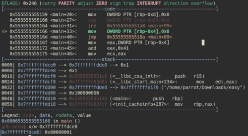

これでgdbを使ってメモリ情報の参照や改ざんを行うことができました。

## まとめ

今回はCTFの初心者向けにELFバイナリの基本的な解析手法をまとめてみました。

この記事は、私が個人的に開催する勉強会のために作成したものですので、もし勉強会などで再利用いただける場合は特に許諾などは不要です。

参照元としてURLだけ記載いただければ、あとはご自由にご利用ください。

なお、本記事やその他の内容について質問、指摘事項がある場合は、[Twitter:yuki_kashiwaba](https://twitter.com/yuki_kashiwaba) のDMまでお願いします。

この記事のコメントでも受け付けてますが、Twitter経由の方がレスポンスが早いです。

この記事が少しでもこれからCTFを始める方の役に立てば幸いです。

## おすすめの書籍 / WEBサイト

この記事ではELF解析の入門的な内容にしか触れていないので、より詳細に学びたい方には以下の書籍やWebサイトが役に立つと思いますので、参考までに記載しておきます。

### 書籍

- [Debug Hacks -デバッグを極めるテクニック&ツール](https://amzn.to/3lkunSs)
  開発者向けのデバッグ本ですが、前半100ページくらいにgdbの基本的な使い方などがまとまっていて非常に参考になります。
- [詳解セキュリティコンテスト](https://amzn.to/3o7g5Gj)
  今からCTFに入門するならとりあえず読んでおくと良い1冊。
  解析手法やアセンブリの読み方などかなりわかりやすくまとまってます。
  Reversingの項目は何か所か誤植あるようなので、正誤表要確認。
- [リバースエンジニアリングツールGhidra実践ガイド ~セキュリティコンテスト入門からマルウェア解析まで~ ](https://amzn.to/3robIsL)
  たぶん日本語で書かれた唯一のGhidra本です。
  PEバイナリの解析の内容が多めですが、Ghidraの使い方だけでなく解析手法についてもとても勉強になります。
  Ghidra10.0以前の本なのでデバッガについては記載がない点に注意。
- [リバースエンジニアリング ―Pythonによるバイナリ解析技法](https://amzn.to/3robIsL)
  完全にPEバイナリの解析のみについての本ですが、解析手法はELFと共通する部分が多いです。
- [冴えないIDAの育てかた](https://booth.pm/ja/items/1058583)
  IDAの概要や使い方がまとまってます。
  なぜかIDA本なのに1/3くらいのページでradare2の解説がされてます。
  日本語でこんなにradare2の情報が充実してる本は出会ったことがないのでとても参考になります。
- [動かしながらゼロから学ぶ Linuxカーネルの教科書](https://amzn.to/3oMmsPY)
  ELFバイナリの解析のためには、ある程度Linuxの仕組みを知っておく必要があります。
  個人的には一番入門的な書籍化と思います。
- [ptrace入門: ptraceの使い方](https://amzn.to/3yhiyBA)
  今回は使いませんでしたが、ptraceとltraceの解説書です。
  筑波大教授の先生が講義で使った資料を書籍化したもののようですが、たったの100円で販売されていて買わない理由がないです。

### WEBサイト

- [NASM Tutorial](https://cs.lmu.edu/~ray/notes/nasmtutorial/)
  英語ですが、インテル記法のアセンブリを読めるようになるための最初の一歩として結構いい情報が多いです。
  
- [Assembly Debugger Online](http://asmdebugger.com/)
  わざわざローカルでgdbを動かさなくても簡単にWebからインテル記法のアセンブリの動作確認ができます。
  
  ちょっとした挙動が自分の認識とあっているか検証する際などに便利です。
  
- [JM Project (Japanese)](https://linuxjm.osdn.jp/index.html)
  ELF解析をするなら頻繁にライブラリ関数などのmanを確認すると思いますが、manページなどが日本語に翻訳されたページです。
  
- [The Official Radare2 Book](https://book.rada.re/first_steps/intro.html)
  radare2って機能が豊富ですよね。
  全然使いこなせてない。。

※参考情報についてはそのうち気が向いたら追記していきます。沢山ありすぎて書ききれませんでした。
