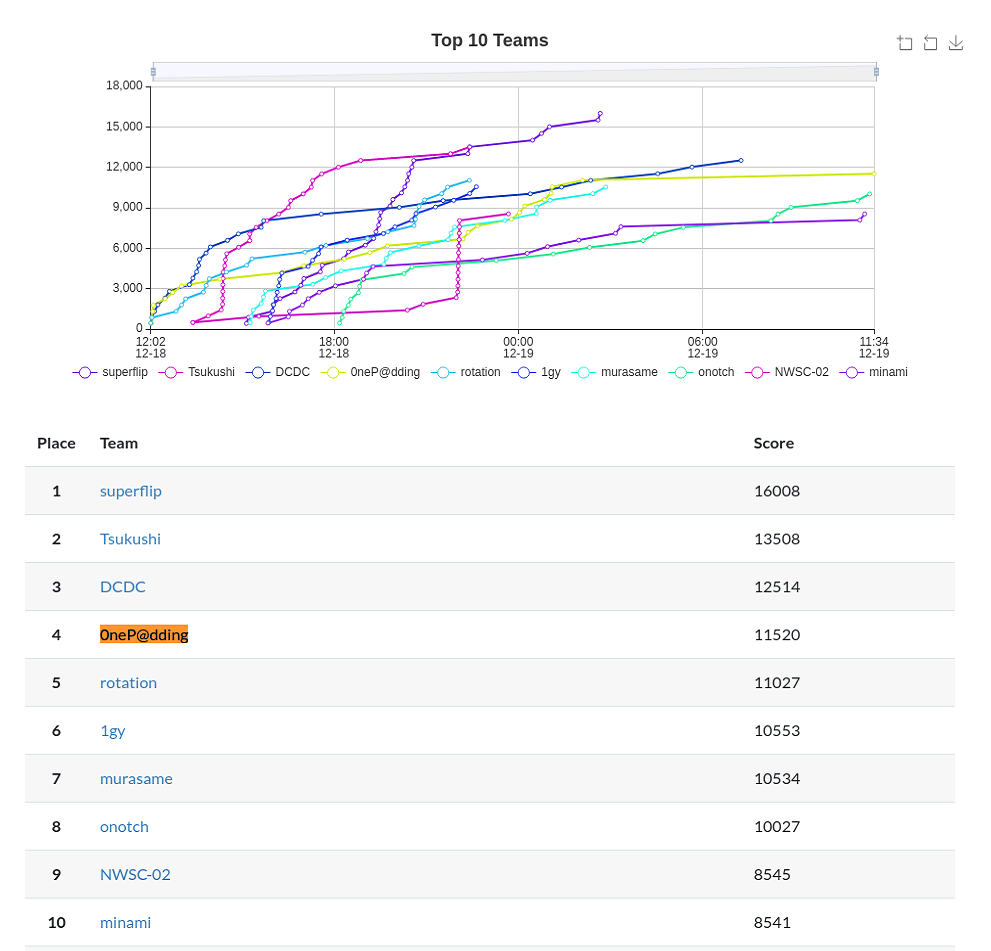

2021年12年18日から12年19日に開催されていた[IMCTF 2021](https://imctf.net/about)に参加してきました。

目標は3位以内入賞だったのですが、残念ながら我々のチームは4位で終了でした。



とくにCrypto担当がいないのが辛かったですね笑

Miscの問題などは、リアル脆弱性をテーマにしたような問題などもありとても面白かったです。

今回もいつも通り、学びのあった問題についてWriteupを書こうと思います。

<!-- omit in toc -->
## もくじ
- [nin nin pdf(Rev)](#nin-nin-pdfrev)
  - [今更聞けないPDF](#今更聞けないpdf)
  - [PDFのファイル形式](#pdfのファイル形式)
- [E・Mo・I・XL](#emoixl)
- [made of honey(misc)](#made-of-honeymisc)
- [printtext(misc)](#printtextmisc)
- [まとめ](#まとめ)
- [メモ：その他感動した問題](#メモその他感動した問題)

## nin nin pdf(Rev)

Flagが埋め込まれたPDFが渡されます。

当然ながらそのまま読むことはできなかったので、[PDF Stream Dumper](http://sandsprite.com/blogs/index.php?pid=57&uid=7)を使用して解析を行いました。

``` powershell
R/S/Span/Type/StructElem/ActualText(tycan you see ? !’ aW1jdGZ7bmlucG91X2tha3VyZW1pX25vX2p5dXR1fQ== !?can you see ?)
```

このBase64エンコードされた文字列をデコードするとFlagが取得できます。

### 今更聞けないPDF

そもそもPDFって何だっけ、って話をします。

PDFとは、`Portable Document Format`の略で、特定のOSや機種に依存せずに文書を表示するためのフォーマットを指します。

Adobe社が開発し、`ISO32000-2`として標準化されています。

概要については相変わらず英語版のWikipediaがかなり詳しかったです。

参考：[PDF - Wikipedia](https://en.wikipedia.org/wiki/PDF)

PDFは、テキスト、ベクタグラフィック、画像、その他のマルチメディアを組み合わせて構成されます。

PDFでは、[PostScript](https://en.wikipedia.org/wiki/PostScript)というグラフィックの描画に長けたプログラミング言語によってレイアウトやグラフィックが生成されます。

また、フォントや埋め込み文書などのコンテンツを構造化して圧縮するストレージシステムによって成り立っています。

### PDFのファイル形式

PDFのファイル形式については、以下の内容が参考になりました。

> この形式は、COS（「カルーセル」オブジェクト構造）形式のサブセットです。
>
> COSツリーファイルは主にオブジェクトで構成されており、そのうち9つのタイプがあります。
>
> - trueまたはfalseを表すブール値
> - 実数
> - 整数
> - 括弧（(...)）で囲まれた文字列。文字列には8ビット文字を含めることができます。
> - スラッシュで始まる名前（/）
> - 配列、角括弧で囲まれたオブジェクトの順序付けられたコレクション（[...]）
> - 辞書、二重山かっこで囲まれた名前でインデックス付けされたオブジェクトのコレクション（<<...>>）
> - ストリーム。通常、オプションで圧縮された大量のバイナリデータが含まれ、辞書が前に付き、キーワードstreamとendstreamキーワードで囲まれています。
> - ヌルオブジェクト
>
> さらに、パーセント記号（`%`）で導入されたコメントがある場合があります。コメントには8ビット文字を含めることができます。
>
> 参考：[PDF - Wikipedia](https://en.wikipedia.org/wiki/PDF)

非常に興味深いことに、PDFには悪意のあるプログラムが埋め込まれる場合があります。

以下のチートシートを見ると、タグやスクリプト、シェルコードやマクロ、Javascriptなど、様々な不正なオブジェクトが埋め来られている場合があるようです。

参考：[Analyzing Malicious Documents Cheat Sheet](https://zeltser.com/analyzing-malicious-documents/)

参考：[SANS Digital Forensics and Incident Response Blog | How to Extract Flash Objects from Malicious PDF Files | SANS Institute](https://www.sans.org/blog/how-to-extract-flash-objects-from-malicious-pdf-files/)

ここで、悪意のあるPDFを解析するために、[PDF Stream Dumper](http://sandsprite.com/blogs/index.php?pid=57&uid=7)などのPDFパーサを使用します。

今回の問題も同様に、PDFの構造を分解して中のテキストやスクリプトを解析することでFlagを取得することができました。

## E・Mo・I・XL

怪しげなExcelファイルが渡されます。

このExcelファイルのVBAスクリプトを解析することでFlagが取得できます。

WaniCTF2021秋でも使いましたが、今回もExcelファイルの中からVBAスクリプトを抽出するために`olevba`を使用しました。

以下が取得できたスクリプトです。

``` bash
# olevba E・mo・XL.xlsm 

olevba 0.60 on Python 2.7.18 - http://decalage.info/python/oletools
===============================================================================
FILE: E・mo・XL.xlsm
Type: OpenXML
WARNING  For now, VBA stomping cannot be detected for files in memory
-------------------------------------------------------------------------------
VBA MACRO ThisWorkbook.cls 
in file: xl/vbaProject.bin - OLE stream: u'VBA/ThisWorkbook'
- - - - - - - - - - - - - - - - - - - - - - - - - - - - - - - - - - - - - - - 
Private Sub Workbook_Open()
    Module1.GetPayload
End Sub
-------------------------------------------------------------------------------
VBA MACRO Sheet1.cls 
in file: xl/vbaProject.bin - OLE stream: u'VBA/Sheet1'
- - - - - - - - - - - - - - - - - - - - - - - - - - - - - - - - - - - - - - - 
(empty macro)
-------------------------------------------------------------------------------
VBA MACRO Module1.bas 
in file: xl/vbaProject.bin - OLE stream: u'VBA/Module1'
- - - - - - - - - - - - - - - - - - - - - - - - - - - - - - - - - - - - - - - 
Sub GetPayload()
Dim payload As String: payload = vbNullString
Dim ws As Worksheet
Set ws = ThisWorkbook.Worksheets(1)
With ThisWorkbook
    With .BuiltinDocumentProperties
        payload = payload + .Item(ws.Cells(1048573, 16384).Value)
        payload = payload + .Item(ws.Cells(1048574, 16384).Value)
        payload = payload + .Item(ws.Cells(1048572, 16384).Value)
        payload = payload + .Item(ws.Cells(1048575, 16384).Value)
        payload = payload + .Item(ws.Cells(1048576, 16384).Value)
    End With
End With
payload = _
"p" & "w" & "s" & "h" & " " & "-" & "n" & "o" & _
"p" & " " & "-" & "e" & _
"p" & " " & "B" & "y" & _
"p" & "a" & "s" & "s" & " " & "-" & "e" & " " + _
payload
CreateObject("WScript.Shell").Run payload
End Sub

+----------+--------------------+---------------------------------------------+
|Type      |Keyword             |Description                                  |
+----------+--------------------+---------------------------------------------+
|AutoExec  |Workbook_Open       |Runs when the Excel Workbook is opened       |
|Suspicious|CreateObject        |May create an OLE object                     |
|Suspicious|Shell               |May run an executable file or a system       |
|          |                    |command                                      |
|Suspicious|WScript.Shell       |May run an executable file or a system       |
|          |                    |command                                      |
|Suspicious|Run                 |May run an executable file or a system       |
|          |                    |command                                      |
|Suspicious|Hex Strings         |Hex-encoded strings were detected, may be    |
|          |                    |used to obfuscate strings (option --decode to|
|          |                    |see all)                                     |
+----------+--------------------+---------------------------------------------+
```

WSH経由で、Powershellに`payload`というコマンドを与えて実行しているようです。

`payload`は以下のスクリプトで生成しています。

``` powershell
With ThisWorkbook
    With .BuiltinDocumentProperties
        payload = payload + .Item(ws.Cells(1048573, 16384).Value)
        payload = payload + .Item(ws.Cells(1048574, 16384).Value)
        payload = payload + .Item(ws.Cells(1048572, 16384).Value)
        payload = payload + .Item(ws.Cells(1048575, 16384).Value)
        payload = payload + .Item(ws.Cells(1048576, 16384).Value)
    End With
End With
```

`ws.Cells(1048573, 16384).Value`には、`category / text / title / subtitle`などのプロパティ要素の名前が記載されていました。

また、`ThisWorkbook.BuiltinDocumentProperties.Item(ws.Cells(1048574, 16384).Value)`ではプロパティ要素の名前を元にファイルのプロパティ情報を取得し、`payload`として連結していました。

ここで抽出した`payload`をデコードしたスクリプトが以下です。

``` bash
$txt = [System.Convert]::FromBase64String(
        (
            @("5a", "56", "39", "74", "62", "31", "39", "30", "61", "57", "39", "75", "58", "32", "4a", "35", "58", "32", "4e", "68", "63", "6d", "78", "35", "58", "33", "4a", "68", "5a", "56", "39", "71", "5a", "58", "42", "7a", "5a", "57", "34", "3d") |
            ForEach-Object { [char][byte]"0x$_" }
        ) -join ""
    )
)
$txt2 = [System.Text.Encoding]::Default.GetString(
    [System.Convert]::FromBase64String(
        (
            @("5a", "6d", "78", "68", "5a", "79", "41", "36", "49", "47", "6c", "74", "59", "33", "52", "6d", "65", "30", "6c", "66", "63", "6d", "56", "68", "62", "47", "78", "35", "58", "33", "4a", "6c", "59", "57", "78", "73", "65", "56", "39", "79", "5a", "57", "46", "73", "62", "48", "6c", "66", "63", "6d", "56", "68", "62", "47", "78", "35", "58", "33", "4a", "6c", "59", "57", "78", "73", "65", "56", "39", "79", "5a", "57", "46", "73", "62", "48", "6c", "66", "62", "47", "6c", "72", "5a", "56", "39", "35", "62", "33", "56", "39") |
            ForEach-Object { [char][byte]"0x$_" }
        ) -join ""
    )
)
$isPassed = ($password -eq $txt)
Write-Host ($isPassed ? "good you are passed" : "incorrect password") -ForegroundColor ($isPassed ? "Green" : "Red")
if ($isPassed) {
    Write-Host $txt2 -ForegroundColor Blue
}
$host.UI.RawUI.ReadKey() | Out-Null
```

上記から`$txt`と`$txt2`の値をそれぞれ取得することで、Flagが取得できました。

## made of honey(misc)

以下のハッシュ(？)を解析する問題。

``` bash
word1:1002:NO PASSWORD*********************:29F98734E7AA3DF2454621FF3928D121:::
word2:1003:NO PASSWORD*********************:2A8CCE5C056D50FAA808457D0F229212:::
word3:1004:NO PASSWORD*********************:E694D490564D15954D68DE40B14F7BFE:::
```

最初は長さ的にMD5かと思って解析したのですが、間違いでした。

``` bash
hash-identifier -h
```

`hash-identifier`を使って種類を推測し、NTLMであると想定の上でhashcatで解析しました。

``` bash
hashcat -a 0 -m 1000 '29F98734E7AA3DF2454621FF3928D121' /usr/share/wordlists/rockyou.txt
hashcat -a 0 -m 1000 '2A8CCE5C056D50FAA808457D0F229212' /usr/share/wordlists/rockyou.txt 
hashcat -a 0 -m 1000 'E694D490564D
```

これでFlagが取得できます。

## printtext(misc)

本番中は解けなかった問題。

以下のスクリプトで動くプログラムで、ホワイトリストを上手く使って`eval`に任意のコードを渡したい問題。

``` python
import os
import sys

os.environ["PAGER"] = "cat" #No hitchhike :)

print("""            _       _    __  _            _    __
 _ __  _ __(_)_ __ | |_ / / | |_ _____  _| |_  \ \\
| '_ \| '__| | '_ \| __| |  | __/ _ \ \/ / __|  | |
| |_) | |  | | | | | |_| |  | ||  __/>  <| |_   | |
| .__/|_|  |_|_| |_|\__| |   \__\___/_/\_\\__|  | |
|_|                     \_\                    /_/
Can you evaluate `print(text)`?
They don't seem to have the flag.
""")

text = "I don't have the flag."

allow_list = input("allow_list> ")[:9]
print(f"your allow_list: {list(allow_list)}")
eval_code = input("eval_code> ")

for c in eval_code:
    if c not in allow_list:
        print(f"Hi, {c}!")
        sys.exit()

print("Let’s roll!!")
eval(eval_code)
```

ホワイトリストには最大で9種類の文字しか指定できないためスクリプトを埋め込むのが非常に困難でした。

解放としては、以下のように`chr`メソッドを使って文字種の制限を回避しつつ任意の文字列を`eval`に流し込むことでFlagが取得できるようです。

``` python
eval(
    chr(1+1)
)
```

天才か？？

## まとめ

初心者向けのCTFといいつつ結構難しい問題も多く、かなり学びのあるCTFでした。

3位以内には入れませんでしたが、非常に楽しく参加できました。

運営の皆さんありがとうございます。

## メモ：その他感動した問題

Writeup見て天才だと思いました。

こういうのをサクッと通せるようになりたいですね。

参考：[imctf_2021_satoki_writeups/web/DoScript at main · satoki/imctf_2021_satoki_writeups](https://github.com/satoki/imctf_2021_satoki_writeups/tree/main/web/DoScript)

参考：[imctf_2021_satoki_writeups/web/Num-restaurant at main · satoki/imctf_2021_satoki_writeups](https://github.com/satoki/imctf_2021_satoki_writeups/tree/main/web/Num-restaurant)
