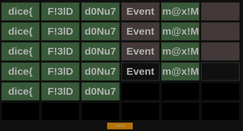

今回は[DiceCTF 2022](https://ctf.dicega.ng/)に参加してきました。

Rev問やってたのですが1問目でいきなり解けずリタイアしました。

今回は復習を兼ねてWriteup書いておきます。

## flagle(Rev)

5箇所の入力フォームがあり、それぞれに正しいFlagの5文字を入力して検証をしていくサイトが問題になっていました。



とりあえず気合でWASMを読んで4枠は特定できたものの、4枠目がJavascriptのコードの解析であり、そこで挫折したため最後まで解けませんでした。

今回は復習もかねて[他の方のWriteup](https://kasimir123.github.io/writeups/2022-02-DiceCTF/flagle.html)を参考にさせていただきつつ問題を解いていきます。

### WASMのデコンパイル

僕は恥ずかしながらブラウザのデバッグ機能を使いつつ気合でWASMを読んでいましたが、どうやらデコンパイラが存在しているようです。

参考：[wabt/decompiler.md at main · WebAssembly/wabt](https://github.com/WebAssembly/wabt/blob/main/docs/decompiler.md)

WASMを読む必要がある箇所はすでに解けていましたが、せっかくなのでwabtをビルドしてデコンパイルを試してみました。

``` bash
wasm-decompile flag-checker.wasm -o decompile.txt
```

デコンパイル結果見ると結構綺麗になってました。

(まじでブラウザで読んでたの馬鹿らしい・・・)

``` c
export memory memory(initial: 256, max: 256);

global g_a:int = 5244000;
global g_b:int = 0;
global g_c:int = 0;

export table indirect_function_table:funcref(min: 1, max: 1);

data d_a(offset: 1024) = "dice{\00";
data d_b(offset: 1030) = "";

import function env_validate_4(a:int):int;

export function wasm_call_ctors() {
  emscripten_stack_init()
}

export function a():int {
  return 1684628325
}

export function streq(a:ubyte_ptr, b:ubyte_ptr):int {
  var c:int;
  return loop L_a {
           c = a[0];
           if (c) goto B_b;
           if (b[0]) goto B_b;
           return 1;
           label B_b:
           if (c == b[0]) goto B_c;
           return 0;
           label B_c:
           b = b + 1;
           a = a + 1;
           continue L_a;
         }
}

export function validate_1(a:int):int {
  return streq(a, 1024)
}

function validate(a:int, b:int, c:int, d:int, e:int):int {
  var f:int = g_a - 16;
  f[15]:byte = a;
  f[14]:byte = b;
  f[13]:byte = c;
  f[12]:byte = d;
  d = f[14]:ubyte;
  f[14]:byte = f[13]:ubyte;
  f[13]:byte = d;
  d = f[13]:ubyte;
  f[13]:byte = f[12]:ubyte;
  f[12]:byte = d;
  d = f[13]:ubyte;
  f[13]:byte = f[15]:ubyte;
  f[15]:byte = d;
  d = f[13]:ubyte;
  f[13]:byte = f[12]:ubyte;
  f[12]:byte = d;
  d = f[15]:ubyte;
  f[15]:byte = f[14]:ubyte;
  f[14]:byte = d;
  d = 0;
  if (f[15]:ubyte != 51) goto B_a;
  if (f[14]:ubyte != 108) goto B_a;
  if (f[13]:ubyte != 33) goto B_a;
  d = e == 68 & f[12]:ubyte == 70;
  label B_a:
  return d;
}

export function validate_3(a:int, b:int, c:int, d:int, e:int):int {
  var f:int = 0;
  if (b * a != 4800) goto B_a;
  if (c + a != 178) goto B_a;
  if (c + b != 126) goto B_a;
  if (d * c != 9126) goto B_a;
  if (d - e != 62) goto B_a;
  f = c * 4800 - e * d == 367965;
  label B_a:
  return f;
}

export function validate_5(a:int, b:int, c:int, d:int, e:int):int {
  var f:int = g_a - 16;
  f[15]:byte = a;
  f[14]:byte = b;
  f[13]:byte = c;
  f[12]:byte = d;
  f[15]:byte = f[15]:ubyte + 12;
  f[14]:byte = f[14]:ubyte + 4;
  f[13]:byte = f[13]:ubyte + 6;
  f[12]:byte = f[12]:ubyte + 2;
  d = 0;
  if (f[15]:ubyte != 121) goto B_a;
  if (f[14]:ubyte != 68) goto B_a;
  if (f[13]:ubyte != 126) goto B_a;
  d = e == 77 & f[12]:ubyte == 35;
  label B_a:
  return d;
}

export function validate_6(a:int, b:int, c:int, d:int, e:int):int {
  var f:int = 0;
  if ((b + 2933) * (a + 1763) != 5483743) goto B_a;
  f = e == 125 & (d + 1546) * (c + 3913) == 6431119;
  label B_a:
  return f;
}

export function guess(a:int, b:int):int {
  var c:int = g_a - 16;
  g_a = c;
  var d:int = 2;
  if (f_k(b) != 5) goto B_a;
  if (eqz(streq(b, 1024))) goto B_b;
  d = a != 1;
  goto B_a;
  label B_b:
  var e:int = b[4]:ubyte;
  d = b[3]:ubyte;
  var f:int = b[2]:ubyte;
  var g:int = b[1]:ubyte;
  c[11]:byte = b[0]:ubyte;
  c[10]:byte = g;
  c[9]:byte = f;
  c[8]:byte = d;
  d = c[10]:ubyte;
  c[10]:byte = c[9]:ubyte;
  c[9]:byte = d;
  d = c[9]:ubyte;
  c[9]:byte = c[8]:ubyte;
  c[8]:byte = d;
  d = c[9]:ubyte;
  c[9]:byte = c[11]:ubyte;
  c[11]:byte = d;
  d = c[9]:ubyte;
  c[9]:byte = c[8]:ubyte;
  c[8]:byte = d;
  d = c[11]:ubyte;
  c[11]:byte = c[10]:ubyte;
  c[10]:byte = d;
  if (c[11]:ubyte != 51) goto B_c;
  if (c[10]:ubyte != 108) goto B_c;
  if (c[9]:ubyte != 33) goto B_c;
  d = c[8]:ubyte;
  if ((e & 255) != 68) goto B_c;
  if ((d & 255) != 70) goto B_c;
  d = a != 2;
  goto B_a;
  label B_c:
  f = b[1]:byte;
  if (f * (d = b[0]:byte) != 4800) goto B_d;
  g = b[2]:byte;
  if (g + d != 178) goto B_d;
  if (g + f != 126) goto B_d;
  if (g * (d = b[3]:byte) != 9126) goto B_d;
  if (d - (f = b[4]:byte) != 62) goto B_d;
  if (g * 4800 - f * d != 367965) goto B_d;
  d = a != 3;
  goto B_a;
  label B_d:
  if (eqz(env_validate_4(b))) goto B_e;
  d = a != 4;
  goto B_a;
  label B_e:
  var h:int = b[4]:ubyte;
  g = b[3]:byte;
  e = b[2]:byte;
  f = b[1]:byte;
  c[15]:byte = (b = b[0]:byte);
  c[14]:byte = f;
  c[13]:byte = e;
  c[12]:byte = g;
  c[15]:byte = c[15]:ubyte + 12;
  c[14]:byte = c[14]:ubyte + 4;
  c[13]:byte = c[13]:ubyte + 6;
  c[12]:byte = c[12]:ubyte + 2;
  if (c[15]:ubyte != 121) goto B_f;
  if (c[14]:ubyte != 68) goto B_f;
  if (c[13]:ubyte != 126) goto B_f;
  d = c[12]:ubyte;
  if ((h & 255) != 77) goto B_f;
  if ((d & 255) != 35) goto B_f;
  d = a != 5;
  goto B_a;
  label B_f:
  d = 2;
  if ((f + 2933) * (b + 1763) != 5483743) goto B_a;
  if ((h & 255) != 125) goto B_a;
  if ((g + 1546) * (e + 3913) != 6431119) goto B_a;
  d = a != 6;
  label B_a:
  g_a = c + 16;
  return d;
}

function f_k(a:int):int {
  var d:int;
  var c:int;
  var b:ubyte_ptr = a;
  if (eqz(a & 3)) goto B_b;
  b = a;
  loop L_c {
    if (eqz(b[0])) goto B_a;
    b = b + 1;
    if (b & 3) continue L_c;
  }
  label B_b:
  loop L_d {
    c = b;
    b = c + 4;
    d = c[0]:int;
    if (eqz(((d ^ -1) & d + -16843009) & -2139062144)) continue L_d;
  }
  if (d & 255) goto B_e;
  return c - a;
  label B_e:
  loop L_f {
    d = c[1]:ubyte;
    b = c + 1;
    c = b;
    if (d) continue L_f;
  }
  label B_a:
  return b - a;
}

export function stackSave():int {
  return g_a
}

export function stackRestore(a:int) {
  g_a = a
}

export function stackAlloc(a:int):int {
  var b:int = g_a - a & -16;
  g_a = b;
  return b;
}

export function emscripten_stack_init() {
  g_c = 5244000;
  g_b = 1112 + 15 & -16;
}

export function emscripten_stack_get_free():int {
  return g_a - g_b
}

export function emscripten_stack_get_end():int {
  return g_b
}

export function errno_location():int {
  return 1096
}

function f_s(a:int) {
}

function f(a:int) {
}

function f_u():int {
  f_s(1100);
  return 1104;
}

function f_v() {
  f(1100)
}

function f_w(a:int):int {
  return 1
}

function f_x(a:int) {
}

export function fflush(a:int):int {
  var c:int;
  var b:int;
  var d:int;
  if (a) goto B_a;
  b = 0;
  if (eqz(0[277]:int)) goto B_b;
  b = fflush(0[277]:int);
  label B_b:
  if (eqz(0[277]:int)) goto B_c;
  b = fflush(0[277]:int) | b;
  label B_c:
  a = f_u()[0]:int;
  if (eqz(a)) goto B_d;
  loop L_e {
    c = 0;
    if (a[19]:int < 0) goto B_f;
    c = f_w(a);
    label B_f:
    if (a[5]:int == a[7]:int) goto B_g;
    b = fflush(a) | b;
    label B_g:
    if (eqz(c)) goto B_h;
    f_x(a);
    label B_h:
    a = a[14]:int;
    if (a) continue L_e;
  }
  label B_d:
  f_v();
  return b;
  label B_a:
  c = 0;
  if (a[19]:int < 0) goto B_i;
  c = f_w(a);
  label B_i:
  if (a[5]:int == a[7]:int) goto B_l;
  call_indirect(a, 0, 0, a[9]:int);
  if (a[5]:int) goto B_l;
  b = -1;
  if (c) goto B_k;
  goto B_j;
  label B_l:
  b = a[1]:int;
  if (b == (d = a[2]:int)) goto B_m;
  call_indirect(a, i64_extend_i32_s(b - d), 1, a[10]:int);
  label B_m:
  b = 0;
  a[7]:int = 0;
  a[2]:long = 0L;
  a[1]:long@4 = 0L;
  if (eqz(c)) goto B_j;
  label B_k:
  f_x(a);
  label B_j:
  return b;
}
```

WEBページで入力された値を受けとってチェックをするのは`guess`関数です。

基本的には読んだら比較的素直にFlagが出てくるので解説的なものは割愛します。

連立方程式久しぶりに解きました笑

### Javascriptを読む

今回解けなかった4枠目のFlagは、WASMではなく以下のJavascriptでチェックを行っていました。

結構闇の深いコードです。

``` javascript
function c(b) {
    var e = {
        'HLPDd': function (g, h) {
            return g === h;
        },
        'tIDVT': function (g, h) {
            return g(h);
        },
        'QIMdf': function (g, h) {
            return g - h;
        },
        'FIzyt': 'int',
        'oRXGA': function (g, h) {
            return g << h;
        },
        'AMINk': function (g, h) {
            return g & h;
        }
    }
        , f = current_guess;
    try {
        let g = e['HLPDd'](btoa(e['tIDVT'](intArrayToString, window[b](b[e['QIMdf'](f, 0x26f4 + 0x1014 + -0x3707 * 0x1)], e['FIzyt'])()['toString'](e['oRXGA'](e['AMINk'](f, -0x1a3 * -0x15 + 0x82e * -0x1 + -0x1a2d), 0x124d + -0x1aca + 0x87f))['match'](/.{2}/g)['map'](h => parseInt(h, f * f)))), 'ZGljZQ==') ? -0x1 * 0x1d45 + 0x2110 + -0x3ca : -0x9 * 0x295 + -0x15 * -0x3 + 0x36 * 0x6d;
    } catch {
        return 0x1b3c + -0xc9 * 0x2f + -0x19 * -0x63;
    }
}
```

コードを綺麗にしていった結果、`window[b]`の`b`に当てはまる5文字を入れたときに、処理結果がBase64エンコードされた文字列「dice」になるものを見つける必要があるところまではたどり着きましたが、残念ながら見つけられませんでした。

Writeupを見たところ、以下のコードで`window`オブジェクトの中の5文字のプロパティを抽出し、総当たりで解く方法が詳解されていました。

``` javascript
Object.getOwnPropertyNames(window).filter(x=> {if (x.length == 5 && x[3] == 'a') console.log(x)})
```

僕も同じ発想には至っていたので、[Window - Web API | MDN](https://developer.mozilla.org/ja/docs/Web/API/Window)に記載のある5文字のプロパティを全部試してはいました。

上記のアクションは根本的に間違っていて、探すべきは`window`オブジェクトのプロパティだったんですね。。

参考：[Object.getOwnPropertyNames（）-JavaScript | MDN](https://developer.mozilla.org/en-US/docs/Web/JavaScript/Reference/Global_Objects/Object/getOwnPropertyNames)

## まとめ

以上、雑ですがWriteupでした。

年初から参加したCTF全部レベル高くて全然解けないので悲しいです。

修行しないとですね。。。
