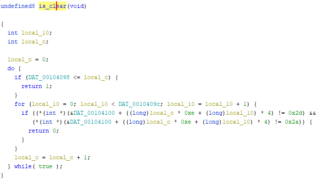

3/12から開催されていた[dvCTF](https://dvc.tf/)に参加したので簡単にWriteupを書きました。

## Mini Game(Rev)

ダウンロードしたファイルを実行しようと思ったのですが、`no such file or directory`のエラーで実行できませんでした。

以下の記事を参考にしたところ、`alpine`でビルドしたバイナリの場合Ubuntuのような`glibc`を使ったディストリビューションでは必要なライブラリが無いために実行できないようでした。

参考：[バイナリが「no such file or directory」の時〜またはalpineでビルドしたものを他のlinuxで動かす時にありがちなポイント - Qiita](https://qiita.com/hrkt/items/6a2169b021e756eb32e2)

そのため、以下のコマンドで`musl libc`をインストールしました。

``` bash
sudo apt install musl-dev
```

これでバイナリを実行できるようになります。

続いて、Ghidraでデコンパイルをしてみました。

動的解析のためにGhidraのイメージベースを`0x555555554000`に変更しておきました。

以下はデコンパイルした`main`関数の抜粋です。

``` c
// main関数
check_input(input_text);
for (i = 0; i < 0xac; i = i + 1) {
iVar1 = *(int *)(&DAT_555555558420 + (long)i * 4);
change_value((long)iVar1 / (long)0xe & 0xffffffff,(long)iVar1 % (long)0xe & 0xffffffff,
                (long)iVar1 % (long)0xe & 0xffffffff);
}
iVar1 = is_clear?();
```

関数は独自にリネーム済みです。

最終的にFlagを取得できる`is_clear`関数を参照したところ、以下のようになっていました。



`DAT_0010409c`には0xeが格納されているので、上記のコードは`DAT_555555558100`の値を先頭から4バイトずつ196回(0xe * 0xe)チェックし、それらのすべての値が0x2dまたは0x2aの時のみFlagが取得できるという挙動のようです。

しかし、ユーザの入力では`DAT_555555558100`の値を直接操作することはできません。

main関数のをさかのぼると、ユーザの入力値によって`DAT_555555558420`の値が変化する以下のコードを見つけました。

``` c
for (; (pcVar2 = token, token != (char *)0x0 && (i < 0xac)); i = i + 1) {
    *(undefined8 *)(acStack120 + lVar1 + -8) = 0x5555555559d2;
    iVar3 = atoi(pcVar2);
    *(int *)(&DAT_555555558420 + (long)i * 4) = iVar3;
    *(undefined8 *)(acStack120 + lVar1 + -8) = 0x5555555559fe;
    token = strtok((char *)0x0,";");
}
```

上記のコードでは、入力された値を`;`で区切り、最大で0xac個までチェックします。

そして、`;`で区切られた範囲内の数字を4倍したものを`DAT_555555558420`の領域の先頭から0xac個、順に格納しています。

``` c
for (i = 0; i < 0xac; i = i + 1) {
    iVar1 = *(int *)(&DAT_555555558420 + (long)i * 4);
    change_value((long)iVar1 / (long)0xe & 0xffffffff,(long)iVar1 % (long)0xe & 0xffffffff,
                    (long)iVar1 % (long)0xe & 0xffffffff);
}
```

この`DAT_555555558420`の領域に格納された値は、次に実行される以下のコードで間接的に`DAT_555555558100`の値を書き換えることができます。

``` c
for (local_c = 0; local_c < 0xac; local_c = local_c + 1) {
  iVar1 = *(int *)(&DAT_00104420 + (long)local_c * 4);
  FUN_00101a29((long)iVar1 / (long)DAT_00104098 & 0xffffffff,
               (long)iVar1 % (long)DAT_0010409c & 0xffffffff,
               (long)iVar1 % (long)DAT_00104098 & 0xffffffff);
}
```

上記のコードでは、`DAT_00104420`の領域を4バイトずつ0xac回探索し、その値を加工したものを`FUN_00101a29`に流し込んでいます。

`FUN_00101a29`の中では以下の通り、受け渡された値が指し示す`DAT_555555558100`のアドレスが0x2a以外の時のみ0x2dに書き換えられます。

``` c
if ((((-1 < div) && (div < 0xe)) && (-1 < mod)) && (mod < 0xe)) {
    if (*(int *)(&DAT_555555558100 + ((long)div * 0xe + (long)mod) * 4) == 0x2a) {
        BOOM();
    }
    else {
        *(undefined4 *)(&DAT_555555558100 + ((long)div * 0xe + (long)mod) * 4) = 0x2d;
    }
    return;
}
```

初期化された時点での`0x555555558100`の中身は以下のようになっていました。

``` bash
$ x/197w 0x555555558100
0x555555558100: 0x0000002d      0x00000001      0x00000001      0x00000000
0x555555558110: 0x00000001      0x00000001      0x00000001      0x00000001
0x555555558120: 0x00000001      0x00000001      0x00000001      0x00000001
0x555555558130: 0x00000001      0x00000000      0x00000001      0x0000002a
0x555555558140: 0x00000001      0x00000000      0x00000001      0x0000002a
0x555555558150: 0x00000001      0x00000001      0x0000002a      0x00000001
0x555555558160: 0x00000001      0x0000002a      0x00000001      0x00000000
0x555555558170: 0x00000001      0x00000002      0x00000002      0x00000002
```

ここからもともと0x2aと0x2dが格納されているアドレス以外のアドレスをすべて抽出し、その相対オフセットを`;`で区切ったものを入力値として渡すことで、`0x555555558100`から4バイトずつ196個分の領域がすべて0x2aもしくは0x2dとなり、チェックにクリアするためFlagを取得できます。

最終的にFlagを取得できる入力値は以下のようになりました。

``` bash
0;1;2;3;4;5;6;7;8;9;10;11;12;13;14;172;16;17;18;173;20;21;174;23;24;175;26;27;28;29;30;31;32;33;34;35;36;37;38;39;40;41;42;43;177;45;178;47;48;49;179;51;52;53;180;55;56;57;58;181;60;61;62;63;64;65;66;67;68;69;183;71;72;73;74;75;76;185;78;79;80;81;82;83;84;85;186;87;88;89;90;91;92;93;188;95;96;97;98;99;100;189;102;103;104;105;106;107;108;109;110;190;112;113;114;191;116;117;118;119;120;121;122;192;124;125;126;127;128;129;130;131;132;133;134;135;136;137;138;139;140;141;193;143;144;145;194;147;148;149;150;151;152;153;154;155;156;157;158;159;160;161;195;0;164;165;166;167;168;169;170;171
```

ちなみに、この入力値は以下のsolverで作成しました。

``` python
init_table = [0x00000001,0x00000001,0x00000001,0x00000000,
            0x00000001,0x00000001,0x00000001,0x00000001,
            0x00000001,0x00000001,0x00000001,0x00000001,
            0x00000001,0x00000000,0x00000001,0x0000002a,
            0x00000001,0x00000000,0x00000001,0x0000002a,
            0x00000001,0x00000001,0x0000002a,0x00000001,
            0x00000001,0x0000002a,0x00000001,0x00000000,
            0x00000001,0x00000002,0x00000002,0x00000002,
            0x00000002,0x00000002,0x00000001,0x00000002,
            0x00000002,0x00000002,0x00000001,0x00000002,
            0x00000002,0x00000001,0x00000000,0x00000001,
            0x0000002a,0x00000003,0x0000002a,0x00000001,
            0x00000000,0x00000001,0x0000002a,0x00000001,
            0x00000000,0x00000001,0x0000002a,0x00000002,
            0x00000001,0x00000002,0x00000002,0x0000002a,
            0x00000002,0x00000001,0x00000001,0x00000002,
            0x00000002,0x00000001,0x00000000,0x00000001,
            0x00000001,0x00000002,0x0000002a,0x00000002,
            0x00000002,0x00000002,0x00000001,0x00000000,
            0x00000001,0x0000002a,0x00000001,0x00000001,
            0x00000001,0x00000001,0x00000000,0x00000001,
            0x00000001,0x00000002,0x0000002a,0x00000002,
            0x00000001,0x00000000,0x00000001,0x00000001,
            0x00000001,0x00000001,0x0000002a,0x00000001,
            0x00000001,0x00000001,0x00000001,0x00000001,
            0x00000003,0x0000002a,0x00000002,0x00000000,
            0x00000000,0x00000000,0x00000000,0x00000001,
            0x00000002,0x00000002,0x00000002,0x0000002a,
            0x00000001,0x00000000,0x00000002,0x0000002a,
            0x00000002,0x00000000,0x00000000,0x00000000,
            0x00000000,0x00000000,0x00000001,0x0000002a,
            0x00000002,0x00000001,0x00000001,0x00000001,
            0x00000002,0x00000002,0x00000001,0x00000001,
            0x00000001,0x00000001,0x00000000,0x00000000,
            0x00000001,0x00000001,0x00000001,0x00000000,
            0x00000000,0x00000001,0x0000002a,0x00000001,
            0x00000000,0x00000001,0x0000002a,0x00000002,
            0x00000002,0x00000002,0x00000001,0x00000000,
            0x00000000,0x00000000,0x00000000,0x00000001,
            0x00000001,0x00000001,0x00000000,0x00000001,
            0x00000001,0x00000003,0x0000002a,0x0000002a,
            0x00000001,0x00000000,0x00000000,0x00000001,
            0x00000001,0x00000002,0x00000001,0x00000001]

arr = []
other = [172, 173, 174, 175, 177, 178, 179, 180, 181, 183, 
        185, 186, 188, 189, 190, 191, 192, 193, 194, 195, 0]
j = 0
for i, data in enumerate(init_table):
    if data != 0x0000002a:
        arr.append(str(i))
    else:
        arr.append(str(other[j]))
        j += 1

result = ";".join(arr)
print(result)
```

## まとめ

雑なWriteupで恐縮です。


