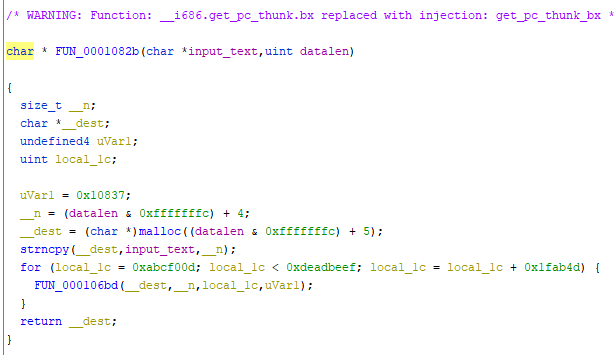
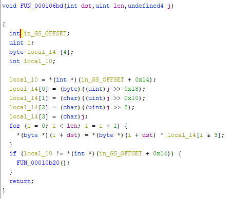
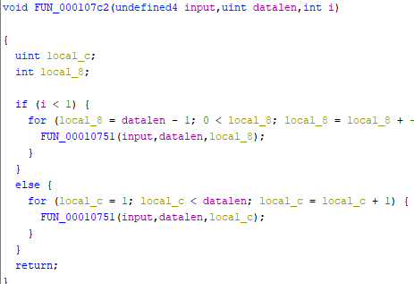
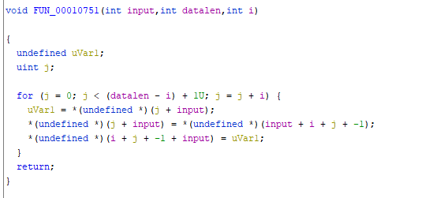

<!-- omit in toc -->

## もくじ


## Easy as GDB(Rev)

main関数のデコンパイル結果(一部リネーム済み)

``` c
undefined4 main(void)
{
  char *__s;
  size_t sVar1;
  undefined4 uVar2;
  int iVar3;
  
  __s = (char *)calloc(0x200,1);
  printf("input the flag: ");
  fgets(__s,0x200,stdin);
  sVar1 = strnlen(&DAT_00012008,0x200);
  uVar2 = FUN_0001082b(__s,sVar1);
  FUN_000107c2(uVar2,sVar1,1);
  iVar3 = FUN_000108c4(uVar2,sVar1);
  if (iVar3 == 1) {
    puts("Correct!");
  }
  else {
    puts("Incorrect.");
  }
  return 0;
}
```





``` c
strncpy(__dest,input_text,__n);
for (j = 0xabcf00d; j < 0xdeadbeef; j = j + 0x1fab4d) {
  FUN_000106bd(__dest,__n,j,uVar1);
}
```




暗号化されたデータをさらにスワップしているよう。






``` bash
$ info proc mappings
process 448
Mapped address spaces:

        Start Addr   End Addr       Size     Offset objfile
        0x56555000 0x56556000     0x1000        0x0 /home/ubuntu/Downloads/brute
        0x56556000 0x56557000     0x1000        0x0 /home/ubuntu/Downloads/brute
        0x56557000 0x56558000     0x1000     0x1000 /home/ubuntu/Downloads/brute
        0xf7dd2000 0xf7deb000    0x19000        0x0 /usr/lib32/libc-2.31.so
        0xf7deb000 0xf7f43000   0x158000    0x19000 /usr/lib32/libc-2.31.so
        0xf7f43000 0xf7fb7000    0x74000   0x171000 /usr/lib32/libc-2.31.so
        0xf7fb7000 0xf7fb8000     0x1000   0x1e5000 /usr/lib32/libc-2.31.so
        0xf7fb8000 0xf7fba000     0x2000   0x1e5000 /usr/lib32/libc-2.31.so
        0xf7fba000 0xf7fbb000     0x1000   0x1e7000 /usr/lib32/libc-2.31.so
        0xf7fbb000 0xf7fbe000     0x3000        0x0
        0xf7fc9000 0xf7fcb000     0x2000        0x0
        0xf7fcb000 0xf7fcf000     0x4000        0x0 [vvar]
        0xf7fcf000 0xf7fd1000     0x2000        0x0 [vdso]
        0xf7fd1000 0xf7fd2000     0x1000        0x0 /usr/lib32/ld-2.31.so
        0xf7fd2000 0xf7ff0000    0x1e000     0x1000 /usr/lib32/ld-2.31.so
        0xf7ff0000 0xf7ffb000     0xb000    0x1f000 /usr/lib32/ld-2.31.so
        0xf7ffc000 0xf7ffd000     0x1000    0x2a000 /usr/lib32/ld-2.31.so
        0xf7ffd000 0xf7ffe000     0x1000    0x2b000 /usr/lib32/ld-2.31.so
        0xfffdd000 0xffffe000    0x21000        0x0 [stack]
```


``` c
undefined4 is_correct(char *data,uint len)
{
  char *__dest;
  char *__dest_00;
  uint i;
  
  __dest = (char *)calloc(len + 1,1);
  strncpy(__dest,data,len);
  FUN_000107c2(__dest,len,0xffffffff);
  __dest_00 = (char *)calloc(len + 1,1);
  strncpy(__dest_00,&DAT_00012008,len);
  FUN_000107c2(__dest_00,len,0xffffffff);
  puts("checking solution...");
  i = 0;
  while( true ) {
    if (len <= i) {
      return 1;
    }
    if (__dest[i] != __dest_00[i]) break;
    i = i + 1;
  }
  return 0xffffffff;
}
```

