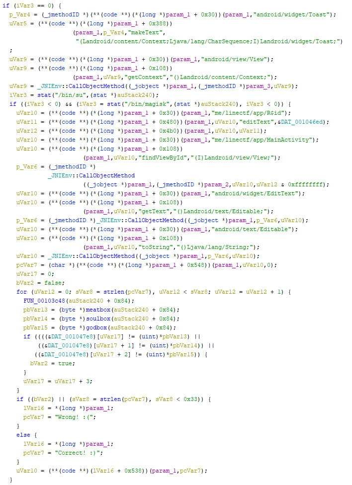
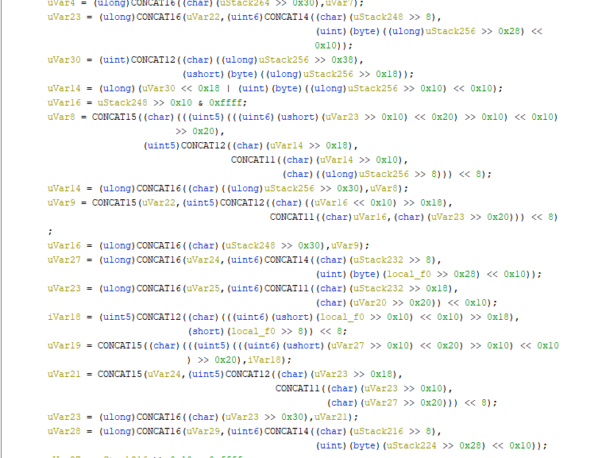
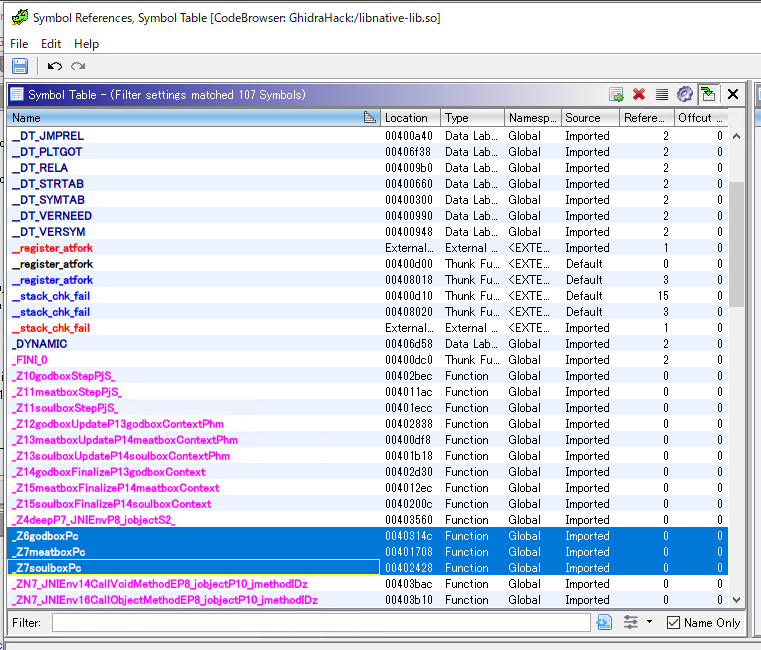
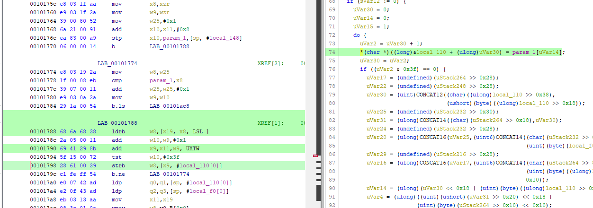

2022/03/26に開催されていた[LINE CTF 2022](https://score.linectf.me/challenges)にちょっとだけ参加してました。

## rolling(Rev)

> what you know about rolling?

問題バイナリとしてapkファイルが与えられます。

とりあえずapkファイルをjarファイルに復元してみました。

今回は[dex2jar](https://github.com/pxb1988/dex2jar)を使いました。

``` bash
./d2j-dex2jar.sh -f ./rolling.apk
```

これで生成したjarファイルをJD-GUIで開くと、以下のコードが出てきました。

``` java
package me.linectf.app;

import android.content.Context;
import android.os.Bundle;
import android.view.View;
import android.widget.EditText;
import android.widget.Toast;
import androidx.appcompat.app.AppCompatActivity;

public class MainActivity extends AppCompatActivity {
  static {
    System.loadLibrary("native-lib");
  }
  
  public void checkFlag(View paramView) {
    if (((EditText)findViewById(2131230829)).getText().toString() == "IINECFT{youtube.com/watch?v=dQw4w9WgXcQ}") {
      Toast.makeText((Context)this, "Correct! :)", 1).show();
    } else {
      Toast.makeText(paramView.getContext(), "Wrong! :(", 1).show();
    } 
  }
  
  public native void deep();
  
  protected void onCreate(Bundle paramBundle) {
    super.onCreate(paramBundle);
    setContentView(2131427356);
  }
}
```

当然ですが`IINECFT{youtube.com/watch?v=dQw4w9WgXcQ}`はダミーのフラグです。

リンク先の動画[Rick Astley - Never Gonna Give You Up (Official Music Video) - YouTube](https://www.youtube.com/watch?v=dQw4w9WgXcQ)ですが、どうやら`rolling`というフェイクリンクを意味する古いネットミームに関連する動画のようです。

ここで行き詰ったので、Androidスマホでこのアプリを動かしてみました。

※ スマホアプリ用にビルドされたapkファイルは対応プラットフォームがARMになっているので、x86_64マシン上で動くエミュレータでは実行することができませんでした。

すると、キーの入力を求められたのですが`IINECFT{youtube.com/watch?v=dQw4w9WgXcQ}`を入力してもエラーになりました。

どうやら`((EditText)findViewById(2131230829)).getText().toString() == "IINECFT{youtube.com/watch?v=dQw4w9WgXcQ}"`の行では、単純に`findViewById`で文字列を取得しているわけではなく、裏で何か変換が行われていそうです。

しかし、jarファイルをいくら調べても関連する処理が見つからなかったので、アプローチを変えることにしました。

まずは問題のapkファイルをapktoolでバラします。

``` bash
apktool d rolling_9ea0ef57c4c6f42caff721efb2177785d5e2bc2b.apk
```

次に、取得した`lib/arm64-v8a/libnative-lib.so`を解析していきます。

``` bash
$ file rolling_9ea0ef57c4c6f42caff721efb2177785d5e2bc2b/lib/arm64-v8a/libnative-lib.so
rolling_9ea0ef57c4c6f42caff721efb2177785d5e2bc2b/lib/arm64-v8a/libnative-lib.so: ELF 64-bit LSB shared object, ARM aarch64, version 1 (SYSV), dynamically linked, BuildID[sha1]=eec302c3f04d26460e7cf08400ad601b88f4f9a3, stripped
```

Ghidraでデコンパイルしてみると、関数名`deep`として認識されている関数が入力値を検証する処理を行っているようです。



実際に入力値を行っている処理はここのように見えます。(変数名は適当にrename済み)

``` c
k = 0;
bVar2 = false;
for (i = 0; len_input = strlen(input_text), i < len_input; i = i + 1) {
  FUN_00103c48(auStack240 + 0x84);
  pbVar10 = (byte *)meatbox(auStack240 + 0x84);
  pbVar11 = (byte *)soulbox(auStack240 + 0x84);
  pbVar12 = (byte *)godbox(auStack240 + 0x84);
  if ((((&DAT_001047e8)[k] != (uint)*pbVar10) || ((&DAT_001047e8)[k + 1] != (uint)*pbVar11))
      || ((&DAT_001047e8)[k + 2] != (uint)*pbVar12)) {
    bVar2 = true;
  }
  k = k + 3;
}
```

鍵になっていそうなのは`meatbox`、`soulbox`、`godbox`の3つです。

デコンパイル結果を見てみるとかなり闇の深い感じのコードでした。



ここからの開放が全くわからず、残念ながらここでリタイアしました。

以降は天才のWriteupを参考にさせてもらいつつFlagを取得していきます。

以下のWriteupを参考にさせていただきました。

参考：[LineCTF 2022 Rolling](https://velog.io/@kunshim/LineCTF-2022-Rolling)

大まかな解法としては、問題のバイナリを動的ライブラリとして読み込んだプログラムを作成して`Check Flag`関数をリバースし、Flagをブルートフォースで求めていく感じみたいです。

``` c
void* handle = dlopen("libnative-lib.so",RTLD_NOW );
if(!handle)
{
	puts("dlopen error");
    exit(0);
}
printf("pid : %d\n", getpid());
puts("dlopen success");
printf("handle addr : %p\n", handle);
```

まず、`dlopen`は動的リンクを行うローダへのインターフェースを提供する関数です。

参考：[Man page of DLOPEN](https://linuxjm.osdn.jp/html/LDP_man-pages/man3/dlopen.3.html)

`dlopen`は動的ライブラリのファイルパスを受け取り、その動的ライブラリへの内部ハンドルを返却します。

ロードに成功すれば、変数`handle`にハンドルが格納されます。

以降の処理では、`dlsym`関数を使ってシンボル名とハンドルを使い、ライブラリ内の関数がロードされたアドレスを取得できます。

具体的には、以下のようにしてキーとなる3つの関数を取得しています。

``` c
unsigned int* (*meatbox)(char*) = dlsym(handle, "_Z7meatboxPc");
unsigned int* (*soulbox)(char*) = dlsym(handle, "_Z7soulboxPc");
unsigned int* (*godbox)(char*) = dlsym(handle, "_Z6godboxPc");
```

ここで使用しているシンボル名ですが、GhidraのSymbolTableウィンドウを使うことで参照できました。



似たようなシンボル名がいくつかありますが、`Location`のアドレスが関数の先頭アドレスと一致するものを選べばOKです。

または`nm`コマンドも使用することができます。

``` bash
$ nm --dynamic --defined-only libnative-lib.so 
0000000000003ce4 T JNI_OnLoad
0000000000002bec T _Z10godboxStepPjS_
00000000000011ac T _Z11meatboxStepPjS_
0000000000001ecc T _Z11soulboxStepPjS_
0000000000002838 T _Z12godboxUpdateP13godboxContextPhm
0000000000000df8 T _Z13meatboxUpdateP14meatboxContextPhm
0000000000001b18 T _Z13soulboxUpdateP14soulboxContextPhm
0000000000002d30 T _Z14godboxFinalizeP13godboxContext
00000000000012ec T _Z15meatboxFinalizeP14meatboxContext
000000000000200c T _Z15soulboxFinalizeP14soulboxContext
0000000000003560 T _Z4deepP7_JNIEnvP8_jobjectS2_
000000000000314c T _Z6godboxPc
0000000000001708 T _Z7meatboxPc
0000000000002428 T _Z7soulboxPc
0000000000003bac W _ZN7_JNIEnv14CallVoidMethodEP8_jobjectP10_jmethodIDz
0000000000003b10 W _ZN7_JNIEnv16CallObjectMethodEP8_jobjectP10_jmethodIDz
0000000000003a74 W _ZN7_JNIEnv22CallStaticObjectMethodEP7_jclassP10_jmethodIDz
0000000000007018 A __bss_end__
0000000000007018 A __bss_start
0000000000007018 A __bss_start__
0000000000007018 A __end__
0000000000007018 A _bss_end__
0000000000007018 A _edata
0000000000007018 A _end
```

このようにしてシンボル名を取得できます。

次のセクションで必要な関数とデータのアドレスを取得しています。

``` c
unsigned int* (*meatbox)(char*) = dlsym(handle, "_Z7meatboxPc");
unsigned int* (*soulbox)(char*) = dlsym(handle, "_Z7soulboxPc");
unsigned int* (*godbox)(char*) = dlsym(handle, "_Z6godboxPc");
char* asc_box = (size_t)meatbox + (0x30e0);
```

なるほどと思ったのが、`asc_box`として設定している箇所です。

これは、Ghidraのデコンパイル結果で言うところの`DAT_001047e8`を指してます。

データセクションはシンボル名じゃ取得できないので関数アドレスからの相対アドレスで参照しているようです。

これで必要なアドレスが取得できたので、`Check Flag`関数をリバースしてFlagをブルートフォースで求めることができるようになります。


``` bash
gcc solver.c -Wl,--no-as-needed -ldl -o solver.o
```


参考：[alset0326/peda-arm: GDB plugin peda for arm](https://github.com/alset0326/peda-arm)

``` bash
chmod 755 libnative-lib.so
chown ubuntu:ubuntu ./libnative-lib.so
LD_LIBRARY_PATH=/home/ubuntu/Develop
```


``` bash
# printf("Error: %s\n",  dlerror());
Error: liblog.so: cannot open shared object file: No such file or directory
```


``` bash
$ ./solver.o
Error: /lib/aarch64-linux-gnu/libc.so: invalid ELF header
```

参考：[NDK のダウンロード  |  Android NDK  |  Android Developers](https://developer.android.com/ndk/downloads)

参考：[How to use NDK-compiled JNI library in a normal non-Android Java application? - Stack Overflow](https://stackoverflow.com/questions/39627742/how-to-use-ndk-compiled-jni-library-in-a-normal-non-android-java-application)


``` bash
export LD_LIBRARY_PATH=/home/ubuntu/Develop:/home/ubuntu/Develop/android-ndk/platforms/android-24/arch-arm64/usr/lib
```

参考：[android - Unable to run x86 executable compiled by NDK - Stack Overflow](https://stackoverflow.com/questions/25882443/unable-to-run-x86-executable-compiled-by-ndk)

参考：[android-ndk/platforms/android-24/arch-arm64/usr/lib at master · innogames/android-ndk · GitHub](https://github.com/innogames/android-ndk/tree/master/platforms/android-24/arch-arm64/usr/lib)


``` bash
$ ./solver.o
pid : 22595
dlopen success
handle addr : 0xaaaad85b12d0
meatbox addr : 0xffffbc5f0708
soulbox addr : 0xffffbc5f1428
godbox addr : 0xffffbc5f214c
asc_box addr : 0xffffbc5f37e8
Segmentation fault (core dumped)
```


``` bash
L0T-MODE])
[---------------------------------------------------------CODE---------------------------------------------------------]
   0xfffff7ff477c <_Z7meatboxPc+116>:   add     w25, w25, #0x1
   0xfffff7ff4780 <_Z7meatboxPc+120>:   mov     w9, w10
   0xfffff7ff4784 <_Z7meatboxPc+124>:   b.ls    0xfffff7ff4ac8 <_Z7meatboxPc+960>  // b.plast
=> 0xfffff7ff4788 <_Z7meatboxPc+128>:   ldrb    w8, [x19, x8]
   0xfffff7ff478c <_Z7meatboxPc+132>:   add     w10, w9, #0x1
   0xfffff7ff4790 <_Z7meatboxPc+136>:   add     x9, x11, w9, uxtw
   0xfffff7ff4794 <_Z7meatboxPc+140>:   tst     w10, #0x3f
   0xfffff7ff4798 <_Z7meatboxPc+144>:   strb    w8, [x9, #24]
[--------------------------------------------------------STACK---------------------------------------------------------]
00:0000|  sp 0xffffffffeff0 --> 0xfffff7fef710 --> 0xfffff7fefe50 --> 0x1
01:0008|     0xffffffffeff8 --> 0xfffffffff020 --> 0xf00000004
02:0010|     0xfffffffff000 --> 0xfffffffff1b8 --> 0x20 (' ')
03:0018|     0xfffffffff008 --> 0x3000000054 ('T')
04:0020|     0xfffffffff010 --> 0x6400000070 ('p')
05:0028| x11 0xfffffffff018 --> 0xfffffffff1b8 --> 0x20 (' ')
06:0030|     0xfffffffff020 --> 0xf00000004
07:0038|     0xfffffffff028 --> 0x200000011
[------------------------------------------Legend: code, data, rodata, value-------------------------------------------]
Stopped reason: SIGSEGV
0x0000fffff7ff4788 in meatbox(char*) () from /home/ubuntu/Develop/libnative-lib.so
```





