今回はFlutterでWindowsとMacOSの両方にスマホアプリの開発環境を構築します。

シンプルに手順を備忘録として残しました。

AndroidとiOSどっちもビルドできるMacで開発すればいいじゃん、って話なのですが、Macの操作に不慣れすぎるせいでMacOS上で開発を行いたくなかったため、WindowsとMacOSの両方に環境を用意することにしました。

<!-- omit in toc -->
## もくじ
- [WindowsでFlutterの開発環境をつくる](#windowsでflutterの開発環境をつくる)
  - [FlutterSDKをインストールする](#fluttersdkをインストールする)
  - [環境変数を設定する](#環境変数を設定する)
  - [VSCodeにFlutterプラグインをインストールする](#vscodeにflutterプラグインをインストールする)
  - [テストアプリを作る](#テストアプリを作る)
  - [アプリケーションをビルドする](#アプリケーションをビルドする)
  - [構成を確認する](#構成を確認する)
- [MacOSでFlutterの開発環境をつくる](#macosでflutterの開発環境をつくる)
  - [FlutterSDKをインストールする](#fluttersdkをインストールする-1)
  - [VSCodeのセットアップ](#vscodeのセットアップ)
- [まとめ](#まとめ)

## WindowsでFlutterの開発環境をつくる

まずはWindowsマシンにFlutterの開発環境を構築します。

ついでにAndroidアプリのエミュレーションもできるようにします。

参考：[Windows install | Flutter](https://docs.flutter.dev/get-started/install/windows)

### FlutterSDKをインストールする

まずは[Windows install | Flutter](https://docs.flutter.dev/get-started/install/windows)からFlutterSDKをダウンロードしてWindowsマシン上に展開します。

本記事の執筆時点で最新の`flutter_windows_2.10.3-stable.zip`を使用します。

ダウンロードしたFlutterSDKを解凍した後、`%USERPROFILE%\Documents\`フォルダの直下に解凍した`flutter`フォルダをコピーします。

FlutterSDKを配置するフォルダは、ユーザ権限で操作できるフォルダであれば`%USERPROFILE%\Documents\`フォルダの直下以外でも問題なさそうです。

### 環境変数を設定する

次に、先ほど配置したFltterSDKにPATHを通します。

公式ドキュメントと同じフォルダにSDKを配置している場合は、`%USERPROFILE%\Documents\flutter\bin`をPATHに追加すればOKです。

PATHを反映させるためにOSの再起動を実施します。

PATHが反映されているかを確認するために、適当なフォルダでコマンドプロンプトを開き`where flutter dart`を実行します。

``` powershell
$ where flutter dart
C:\Users\kash1064\Documents\flutter\bin\flutter
C:\Users\kash1064\Documents\flutter\bin\flutter.bat
C:\Users\kash1064\Documents\flutter\bin\dart
C:\Users\kash1064\Documents\flutter\bin\dart.bat
```

上記のように`flutter`と`dart`のPATHが表示されていればOKです。

### VSCodeにFlutterプラグインをインストールする

VSCodeをIDEとしてFlutterを使用する場合、Flutter拡張をVSCodeにインストールする必要があります。

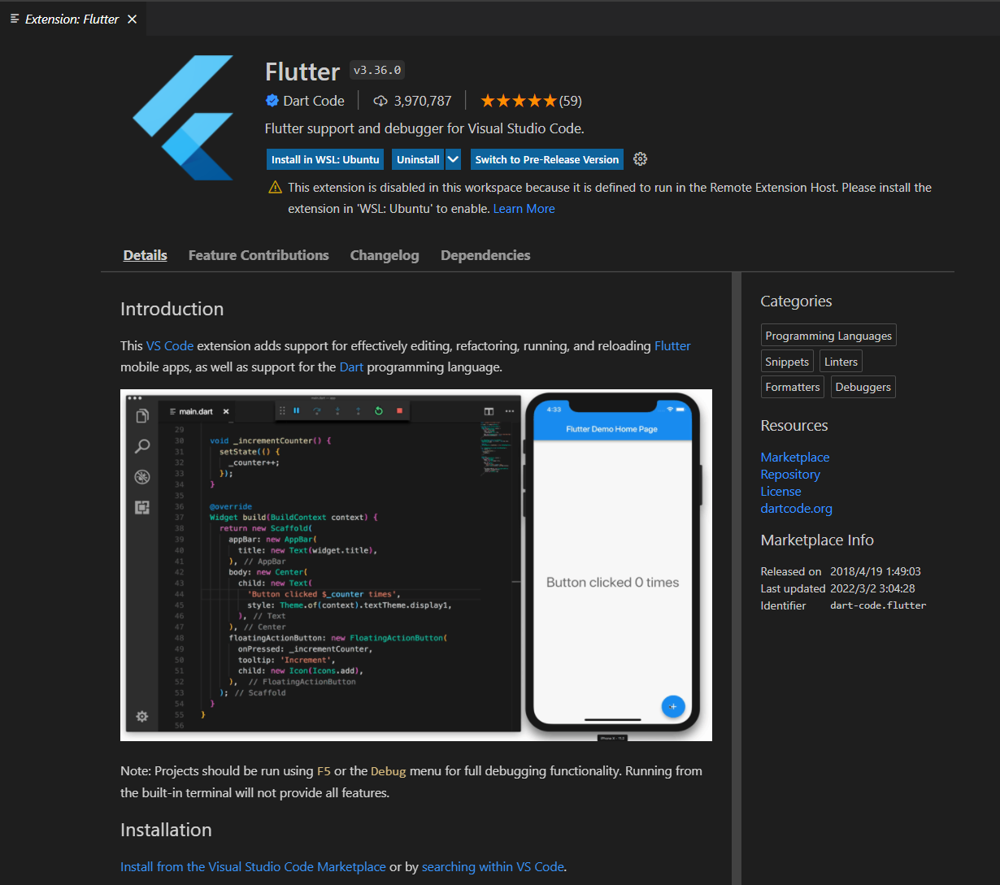

参考：[Visual Studio Code | Flutter](https://docs.flutter.dev/development/tools/vs-code)

### テストアプリを作る

VSCodeにFlutter拡張をインストールしたら、コマンドパレットから`New Project`を選択してテストアプリのプロジェクトを生成します。

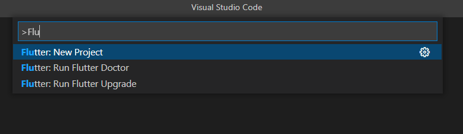

次の選択肢は`Application`を選択します。

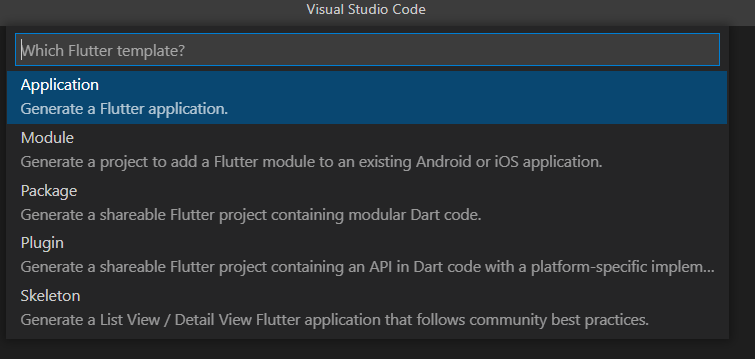

プロジェクトが作成されると以下のようにツリーが作成されました。

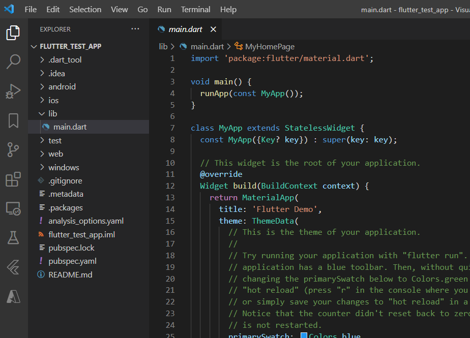

### アプリケーションをビルドする

プロジェクトが完成したら、F5キーを押すと自動でアプリケーションがビルドされます。

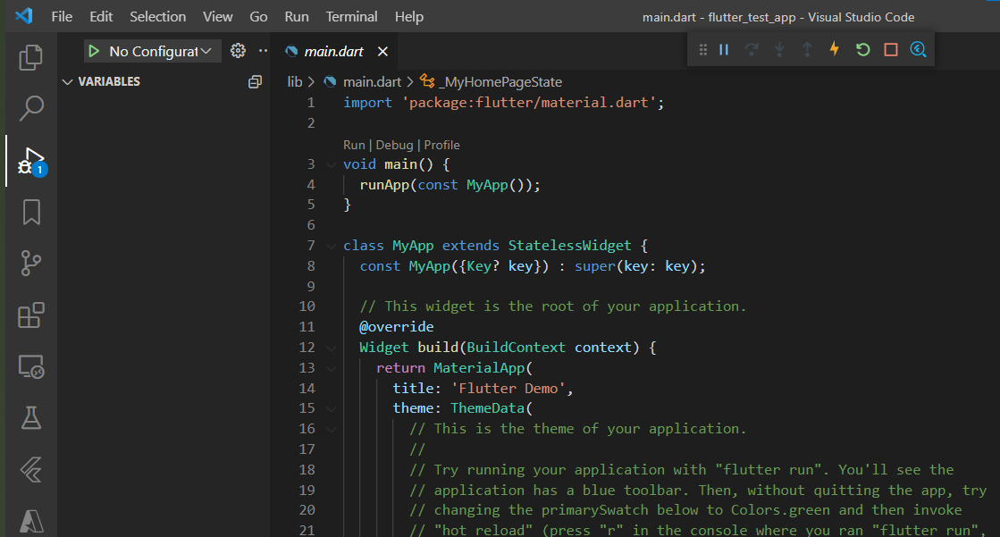

デフォルトではDevToolが設定されており、何やらこんな感じのデスクトップアプリのUIを操作することができます。

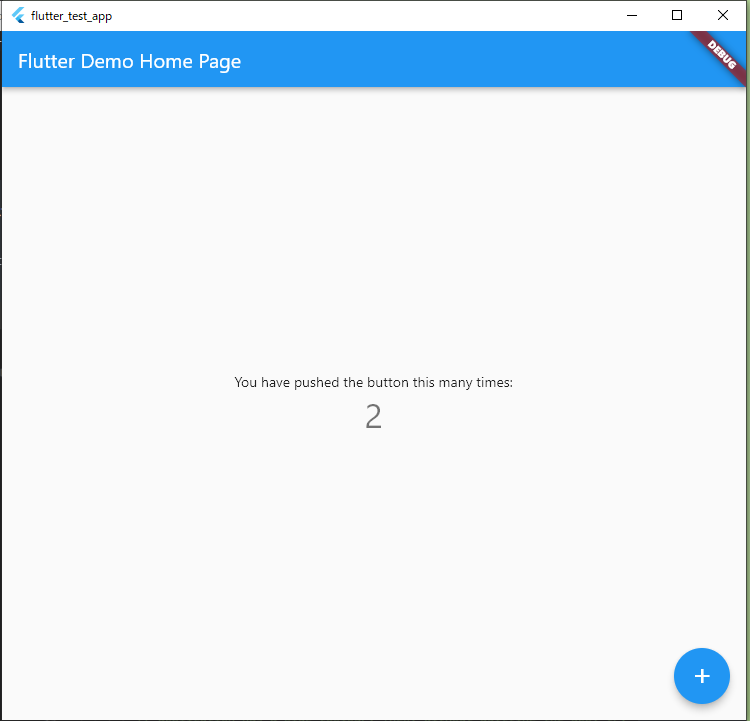

また、VSCodeの右下のデバイス名をクリックし、ビルド時のエミュレータをブラウザやAndroidエミュレータに変更することができます。

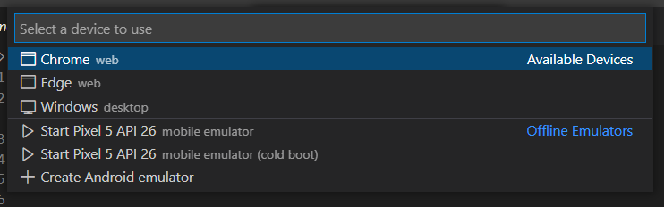

Androidエミュレータを使用する場合は事前にAndroid StudioかVisual Studioを使ってAndroidエミュレータをインストールしておく必要があります。

参考：[Android Studio のインストール  |  Android デベロッパー  |  Android Developers](https://developer.android.com/studio/install?hl=ja)

これでWindowsマシン上でFlutter環境を構築してAndroidアプリを動かすことができました。

ここまでの所用時間は10分程度と、非常に簡単にセットアップすることができました。

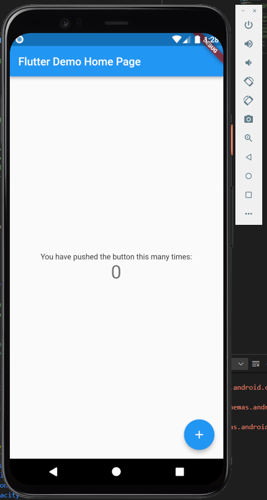

### 構成を確認する

Powershellなどで`flutter doctor`コマンドを実行することで、環境設定の診断を行うことができます。

すべてのセットアップが完了している場合、以下のように`No issues found!`と出力されます。

``` powershell
flutter doctor
Running "flutter pub get" in flutter_tools...                       7.9s
Doctor summary (to see all details, run flutter doctor -v):
[✓] Flutter (Channel stable, 2.10.3, on Microsoft Windows [Version 10.0.19044.1526], locale ja-JP)
[✓] Android toolchain - develop for Android devices (Android SDK version 31.0.0)
[✓] Chrome - develop for the web
[✓] Visual Studio - develop for Windows (Visual Studio Community 2019 16.11.10)
[✓] Android Studio (version 2021.1)
[✓] VS Code (version 1.65.0)
[✓] Connected device (3 available)
[✓] HTTP Host Availability

• No issues found!
```

## MacOSでFlutterの開発環境をつくる

基本的にはWindowsマシンの手順と同じです。

### FlutterSDKをインストールする

MacOSでもFlutterの開発環境を構築していきます。

参考：[macOS install | Flutter](https://docs.flutter.dev/get-started/install/macos)

まずはWindowsマシン同様[macOS install | Flutter](https://docs.flutter.dev/get-started/install/macos)からSDKをダウンロードして、解凍し、PATHを通します。

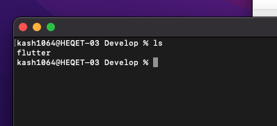

僕の環境ではシェルはzshだったので、`~/.zshrc`に以下のコマンドを書き込みました。

``` bash
export PATH=$PATH:<FlutterのPATH>
```

先ほど同様`where`コマンドで反映を確認できます。

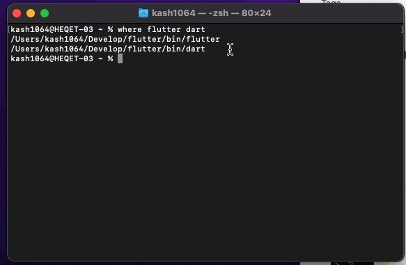

### VSCodeのセットアップ

MacOSにインストールしたVSCodeにもFlutterプラグインをインストールします。

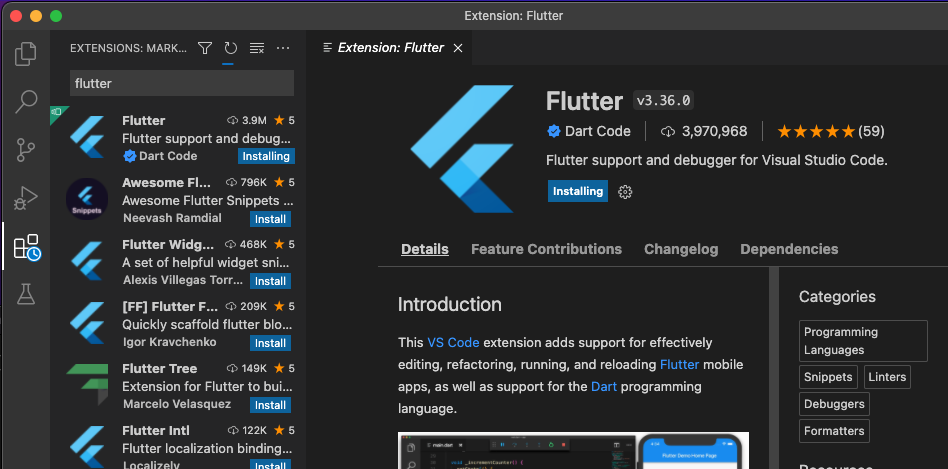

次の手順も全く同じです。

テストアプリのプロジェクトを作成します。

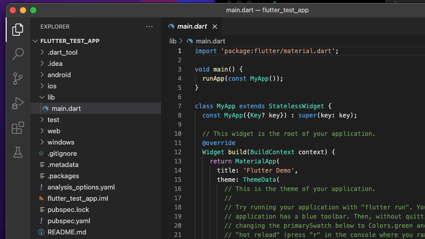

事前にApp StoreからXCodeをインストールしておくことで、デバイス設定にiOSのエミュレータが追加されます。

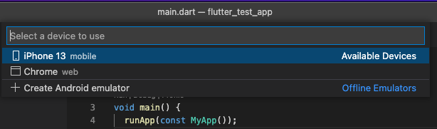

これを選択した状態でF5キーを押すことでiPhoneアプリも同じFlutterのソースコードからビルドすることができました。

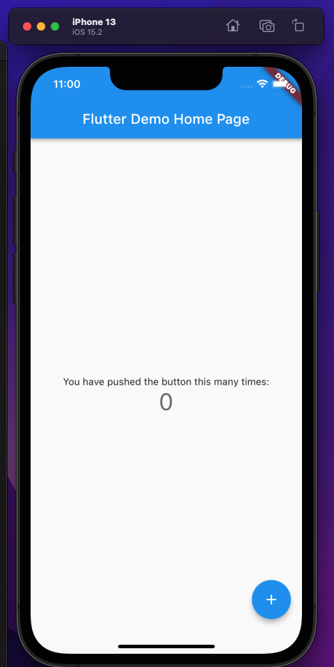

## まとめ

同じようなクロスコンパイルできるスマホアプリのフレームワークでXamarinやReact Nativeも使ったことがあるのですが、Flutterが断トツで簡単にセットアップできた気がします。