今回はCTFのためにセットアップしているGhidraの環境構築方法をメモしておきます。

Ghidraのインストールについては公式の[Ghidra Installation Guide](https://htmlpreview.github.io/?https://github.com/NationalSecurityAgency/ghidra/blob/stable/GhidraDocs/InstallationGuide.html)のままなので割愛します。

参考：[Ghidra Installation Guide](https://htmlpreview.github.io/?https://github.com/NationalSecurityAgency/ghidra/blob/stable/GhidraDocs/InstallationGuide.html)

<!-- omit in toc -->
## もくじ
- [Code Brouserの設定](#code-brouserの設定)
  - [Listing Binaryの行間](#listing-binaryの行間)
  - [Key bindingの設定](#key-bindingの設定)
  - [デコンパイラウィンドウのコメント](#デコンパイラウィンドウのコメント)
  - [XRefの表示設定の追加](#xrefの表示設定の追加)
- [Eclipseのセットアップ](#eclipseのセットアップ)
  - [Ghidra Develop ToolsをEclipseにインストールする](#ghidra-develop-toolsをeclipseにインストールする)
- [gotoolsの導入](#gotoolsの導入)
- [スクリプトの設定](#スクリプトの設定)
  - [pwndraをセットアップする](#pwndraをセットアップする)
  - [ghidra_scriptsをセットアップする](#ghidra_scriptsをセットアップする)
- [おまけ：UIの変更](#おまけuiの変更)
- [まとめ](#まとめ)

## Code Brouserの設定

基本は[リバースエンジニアリングツールGhidra実践ガイド](https://www.amazon.co.jp/%E3%83%AA%E3%83%90%E3%83%BC%E3%82%B9%E3%82%A8%E3%83%B3%E3%82%B8%E3%83%8B%E3%82%A2%E3%83%AA%E3%83%B3%E3%82%B0%E3%83%84%E3%83%BC%E3%83%ABGhidra%E5%AE%9F%E8%B7%B5%E3%82%AC%E3%82%A4%E3%83%89-%E3%82%BB%E3%82%AD%E3%83%A5%E3%83%AA%E3%83%86%E3%82%A3%E3%82%B3%E3%83%B3%E3%83%86%E3%82%B9%E3%83%88%E5%85%A5%E9%96%80%E3%81%8B%E3%82%89%E3%83%9E%E3%83%AB%E3%82%A6%E3%82%A7%E3%82%A2%E8%A7%A3%E6%9E%90%E3%81%BE%E3%81%A7-Compass-Books%E3%82%B7%E3%83%AA%E3%83%BC%E3%82%BA-%E4%B8%AD%E5%B3%B6/dp/4839973776/ref=sr_1_1?__mk_ja_JP=%E3%82%AB%E3%82%BF%E3%82%AB%E3%83%8A&crid=1LZGMPJ1WOENM&keywords=Ghidra&qid=1647343767&sprefix=ghidr%2Caps%2C181&sr=8-1)を参考にしてセットアップをしています。

### Listing Binaryの行間

まずはListing Binaryウィンドウの行間を1に設定します。

Code Brouserの[Edit]>[Tool Options]から[Listing Fields]>[Bytes Field]の[Maximum Lines To Display]を1に変更しました。

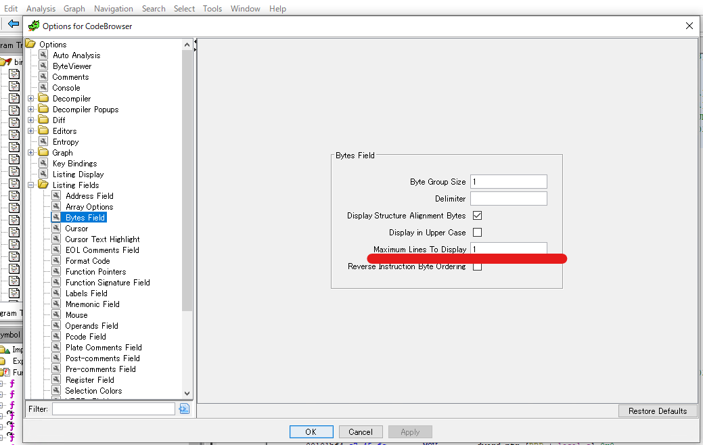

以下がBefore-Afterです。

**↓Before**

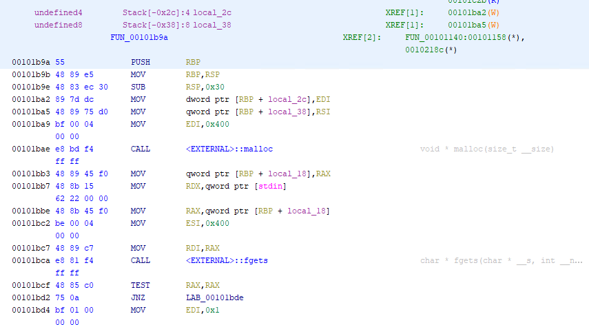

**↓After**

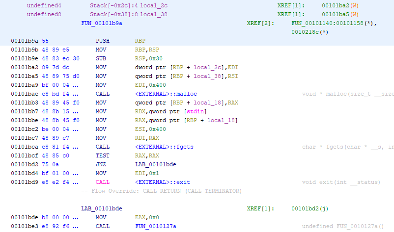

結構すっきりして見やすくなったと思います。

### Key bindingの設定

キーバインドは同じくCode Brouserの[Edit]>[Tool Options]から[Key Binding]を選択することで変更できます。

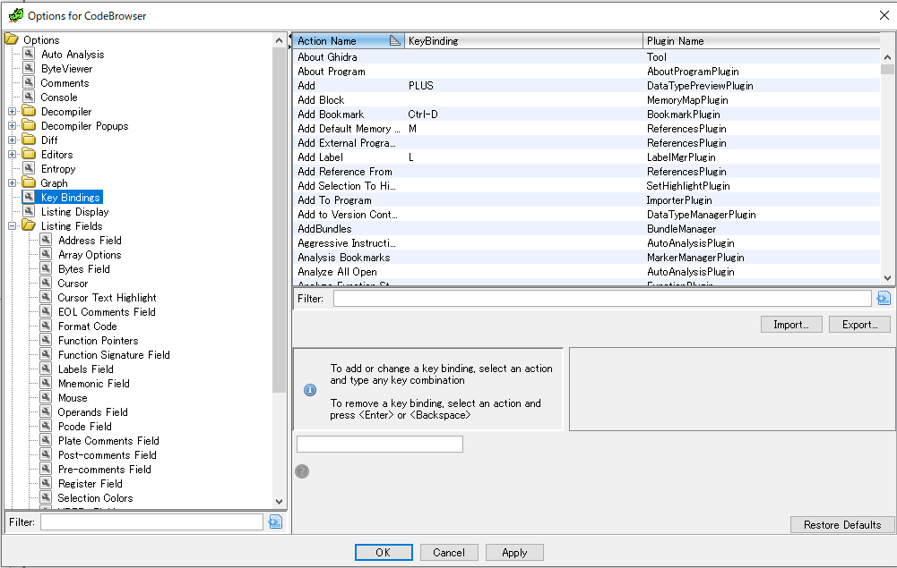

ここは好きに設定します。

個人的によく使うFunction Graphウィンドウの呼び出しなんかを設定してます。

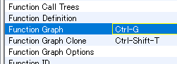

### デコンパイラウィンドウのコメント

Code Brouserの[Edit]>[Tool Options]から[Decompiler]を選び、デフォルトで非表示になっているコメントを表示するよう変更します。

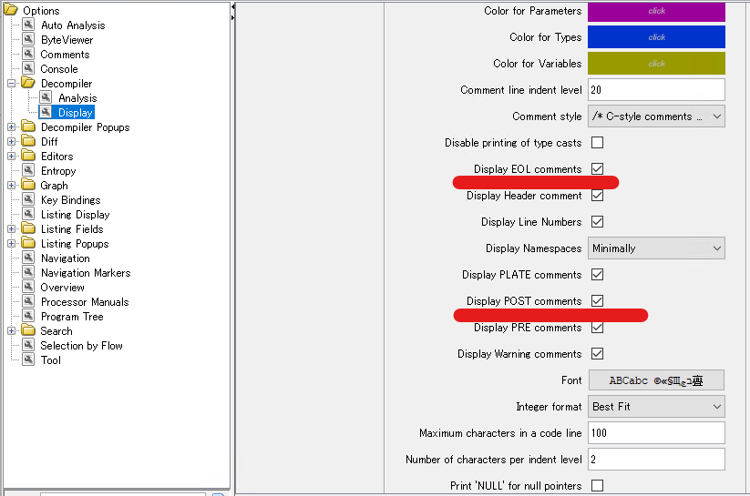

### XRefの表示設定の追加

Listingウィンドウから参照できるXRefウィンドウの列を追加します。

とりあえずFunction Nameがあると便利です。

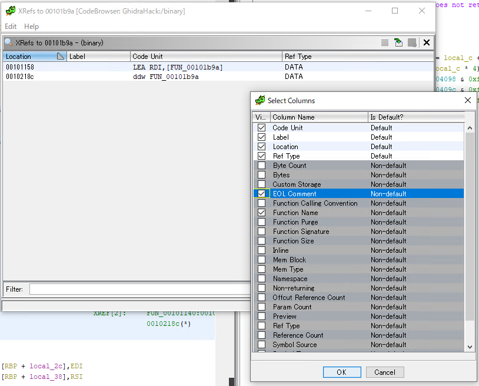

## Eclipseのセットアップ

Ghidraの拡張機能をビルドするためにまずはEclipseをインストールします。

WindowsでもLinuxでも以下からダウンロードしたインストーラを実行するとインストールできます。

参考：[Eclipse Downloads | The Eclipse Foundation](https://www.eclipse.org/downloads/)

今回は一番上のJava Developersを選択してインストールしました。

### Ghidra Develop ToolsをEclipseにインストールする

Eclipseのインストールが完了したらGhidra Develop Toolsをインストールします。

インストールのために、GhidraのScript Managerから適当なスクリプトを右クリックして[Edit with Eclipse]を選択します。

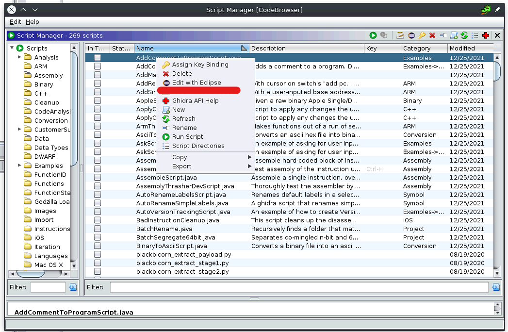

ここで、Eclipseのフルパスを指定します。

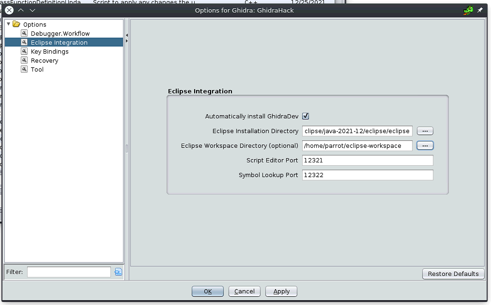

これでEclipseに拡張機能がインストールされ、上部のタブに[GhidraDev]が追加されます。

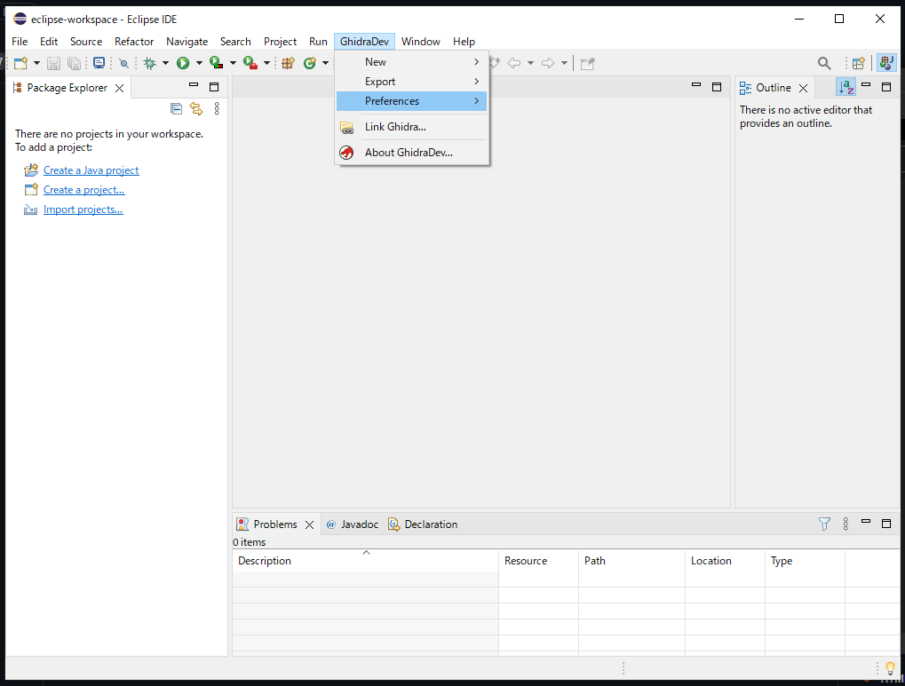

## gotoolsの導入

EclipseにGhidra Dev拡張をインストールしたら、gotoolsをセットアップします。

参考：[GitHub - felberj/gotools: Plugin for Ghidra to assist reversing Golang binaries](https://github.com/felberj/gotools)

gotoolsはGolangでビルドされたx86_64向けのバイナリの解析をサポートしてくれる拡張機能です。

詳しくは[リバースエンジニアリングツールGhidra実践ガイド](https://www.amazon.co.jp/%E3%83%AA%E3%83%90%E3%83%BC%E3%82%B9%E3%82%A8%E3%83%B3%E3%82%B8%E3%83%8B%E3%82%A2%E3%83%AA%E3%83%B3%E3%82%B0%E3%83%84%E3%83%BC%E3%83%ABGhidra%E5%AE%9F%E8%B7%B5%E3%82%AC%E3%82%A4%E3%83%89-%E3%82%BB%E3%82%AD%E3%83%A5%E3%83%AA%E3%83%86%E3%82%A3%E3%82%B3%E3%83%B3%E3%83%86%E3%82%B9%E3%83%88%E5%85%A5%E9%96%80%E3%81%8B%E3%82%89%E3%83%9E%E3%83%AB%E3%82%A6%E3%82%A7%E3%82%A2%E8%A7%A3%E6%9E%90%E3%81%BE%E3%81%A7-Compass-Books%E3%82%B7%E3%83%AA%E3%83%BC%E3%82%BA-%E4%B8%AD%E5%B3%B6/dp/4839973776/ref=sr_1_1?__mk_ja_JP=%E3%82%AB%E3%82%BF%E3%82%AB%E3%83%8A&crid=1LZGMPJ1WOENM&keywords=Ghidra&qid=1647343767&sprefix=ghidr%2Caps%2C181&sr=8-1)に書いてあります。

まずは[gotools](https://github.com/felberj/gotools)からコードをcloneしてEclipseのメニューからプロジェクトを開きます。

この時、[Linked Resource]の設定を、自分の環境のGhidraのPathに設定します。

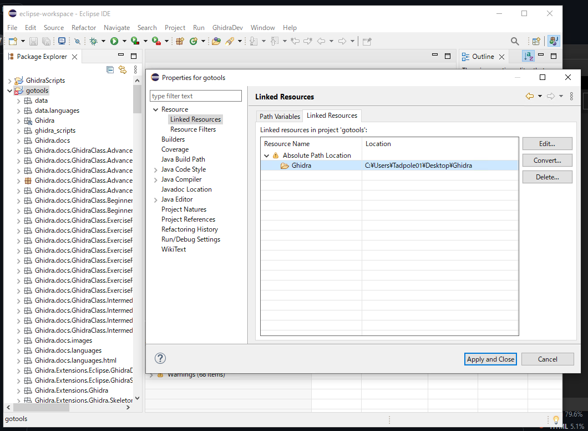

ここまで完了したら、Eclipseの[Ghidra Module Extension...]メニューからgotoolsをビルドしてGhidraにインストールします。

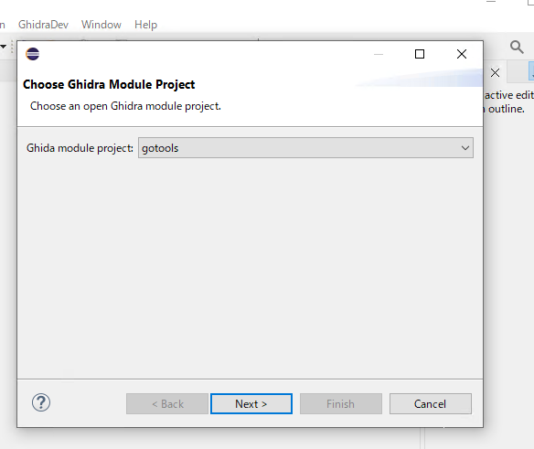

これでGhidraにgotools拡張がインストールされました。

## スクリプトの設定

次にGhidra Scriptの設定を行います。

Ghidraにスクリプトを追加する方法はとても簡単で、Script ManagerからBundle Managerを開いて、スクリプトの配置されたフォルダを開くだけです。

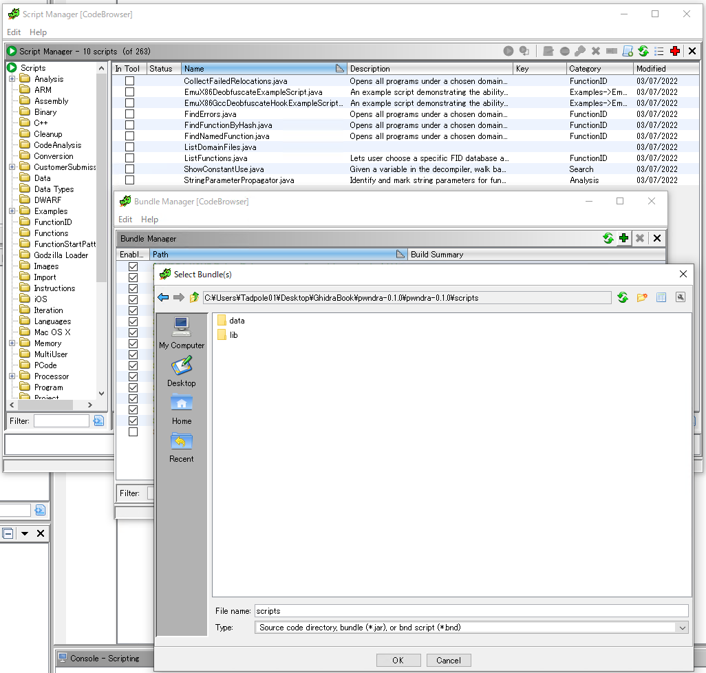

### pwndraをセットアップする

pwndraはCTFに便利なGhidra Scriptです。

以下のリポジトリのリリースページからダウンロードしたファイルを解凍してGhidraに追加します。

参考：[0xb0bb/pwndra: A collection of pwn/CTF related utilities for Ghidra](https://github.com/0xb0bb/pwndra)

### ghidra_scriptsをセットアップする

以下からダウンロードしたファイルをGhidraに展開します。

参考：[AllsafeCyberSecurity/ghidra_scripts: Ghidra scripts for malware analysis](https://github.com/AllsafeCyberSecurity/ghidra_scripts)

## おまけ：UIの変更

GhidraのUIテーマは[Edit]>[Tool Options]の以下の箇所から変更できます。

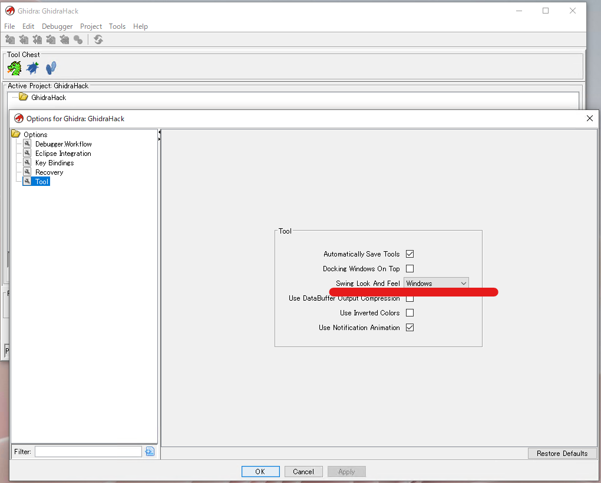

以下はWindows環境における各テーマのUIです。

Linuxの場合はディストリビューションごとにテーマやデザインが変わります。

- System

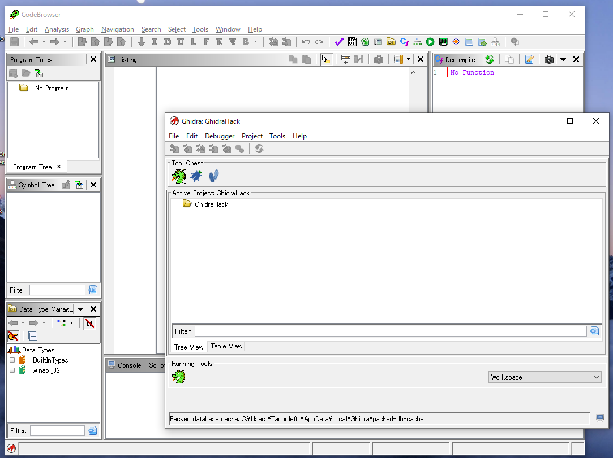

- Metal

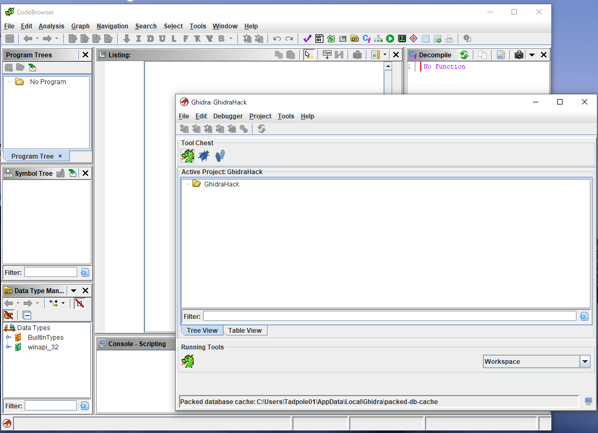

- Nimbas

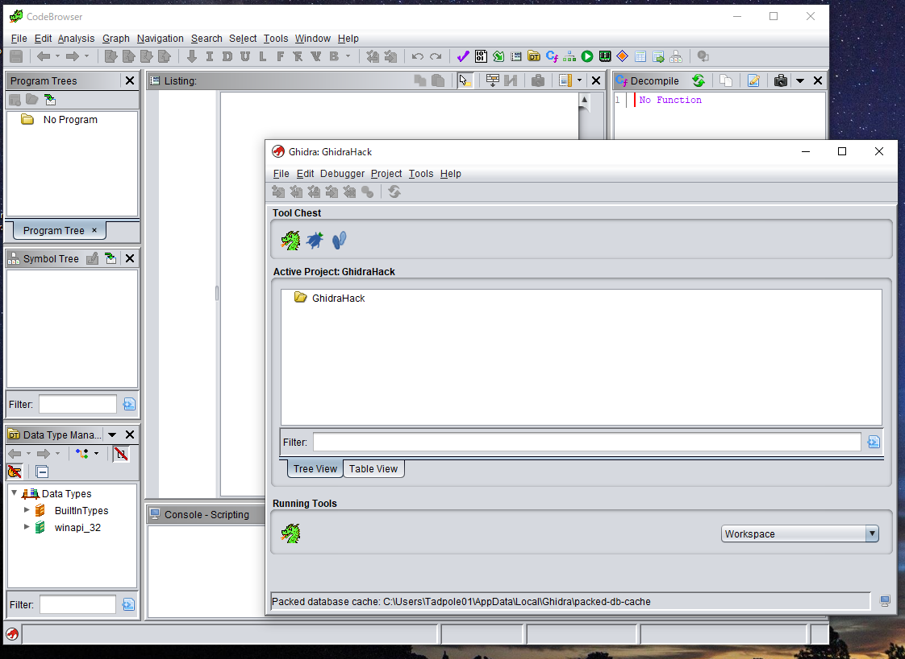

- CDE/Motif

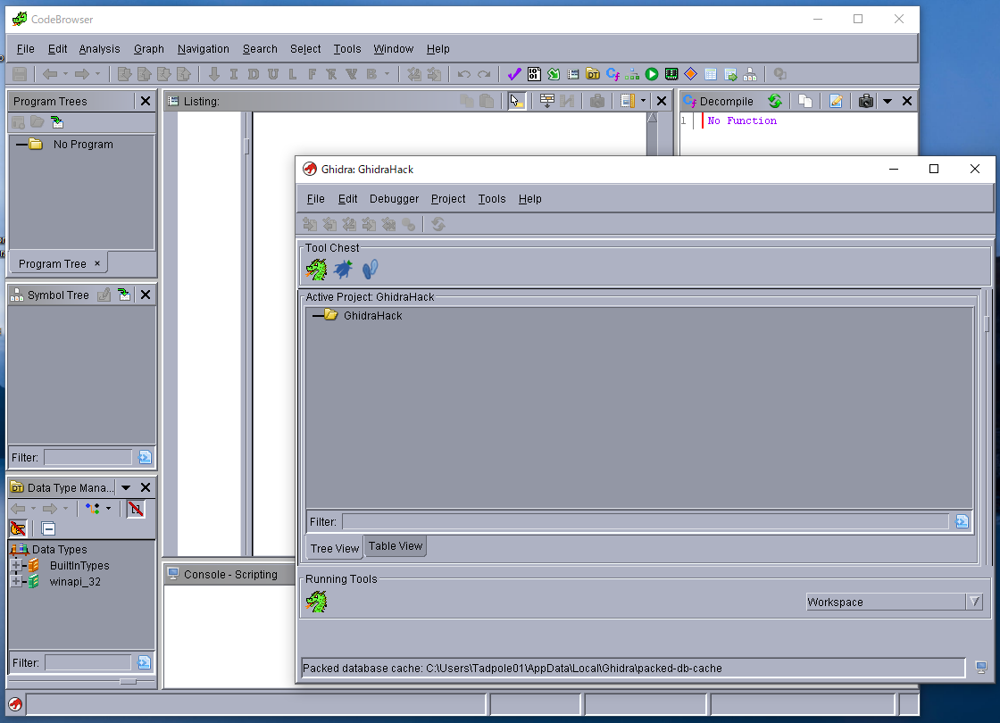

- Windows

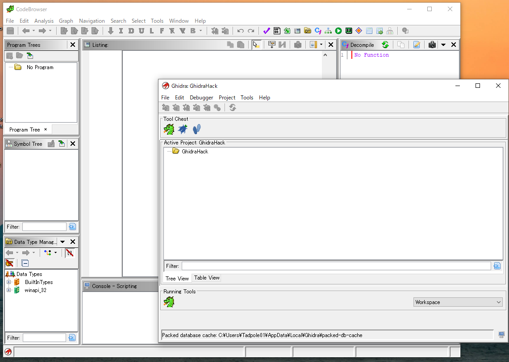

- Windows Classic

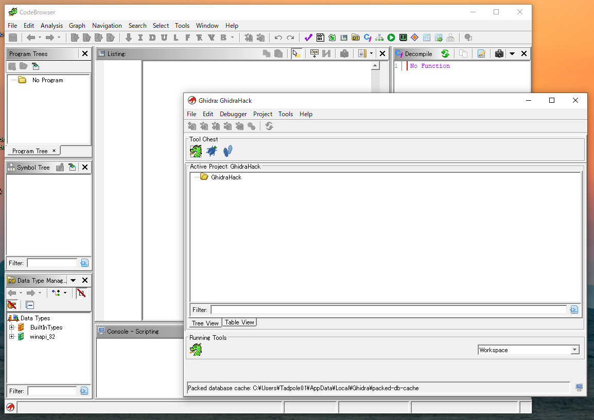

Ghidraの設定ファイルをちょくせつ編集するともっと細かいUIカスタマイズもできますが、僕の環境では特にいじっていないので割愛します。

## まとめ

また環境を変えたら記事もアップデートします。

