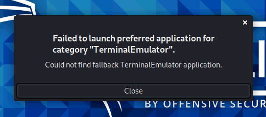

**Kali Linuxをアップデートしたら、「Ctrl+Alt+t」コマンドでターミナルを起動する際に、次のエラーが表示されるようになりました。**

`Failed to launch preferred application for category`




今回は、上記の問題の解消方法について記録しておきます。

## 解決方法 

今回の問題は、こちらの<a href="https://stackoverflow.com/questions/65491788/kali-linux-update-breaks-the-package-shortcut-links" target="_blank" rel="noopener">Stack Overflow</a>を参考に解消することができました。

まず、ターミナル上で次のコマンドを実行します。

```bash
sudo update-alternatives --config x-terminal-emulator
```

すると以下のような出力がされるので、適当な番号を選んであげます。

```
There are 2 choices for the alternative x-terminal-emulator (providing /usr/bin/x-terminal-emulator).

Selection Path Priority Status
------------------------------------------------------------
0 /usr/bin/qterminal 40 auto mode
* 1 /usr/bin/mate-terminal.wrapper 35 manual mode
2 /usr/bin/qterminal 40 manual mode

Press <enter> to keep the current choice[*], or type selection number: 0
```

最後に、aptでアップデートを実行します。

```bash
sudo apt update && sudo apt upgrade -y
```

僕の環境で発生した問題はこの方法で無事解消されました。

## 何をしたのか 

こちらの<a rel="noopener" href="https://stackoverflow.com/questions/65491788/kali-linux-update-breaks-the-package-shortcut-links" target="_blank">Stack Overflow</a>を見る限り、このエラーは**シンボリックリンクの参照に問題が発生している場合に出力される**ことがあるようです。

そのため、**「update-alternatives」コマンドを利用して、シンボリックリンクを再構成**しています。

```bash
sudo update-alternatives --config x-terminal-emulator
```

下記のドキュメントを見ると、**「update-alternatives」は、OSがデフォルトで利用するアプリケーションを指定するシンボリックリンクをメンテナンスすることができるコマンド**であることがわかります。

[Ubuntu Manpage: update-alternatives - maintain symbolic links determining default commands](http://manpages.ubuntu.com/manpages/trusty/man8/update-alternatives.8.html)

xface5を利用しているKaliの場合は、「x-terminal-emulator」というデフォルトのターミナルに対して、qterminalもしくはmate-terminalのいずれかが利用されるようです。

今回は、何らかの理由によって、ショートカットキーが呼び出す「x-terminal-emulator」に対して、ターミナルが正常に紐づいていなかったことが原因だったと考えられます。  
ちなみに、「--config」は、すべての選択肢を一覧表示することができるオプションです。

## まとめ 

このエラーが出たときには、「何もしてないのにパソコンが壊れた」みたいな気分になりましたが、結果として色々勉強になったのでよかったです。