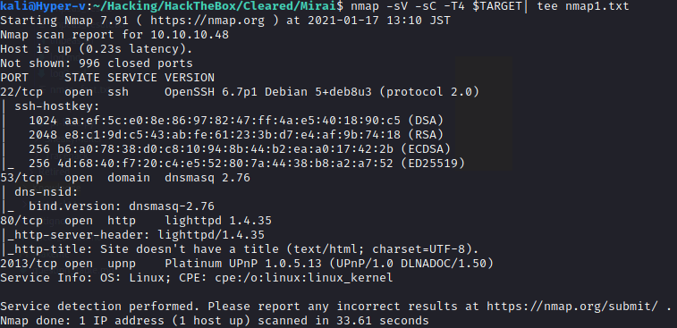
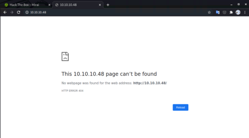
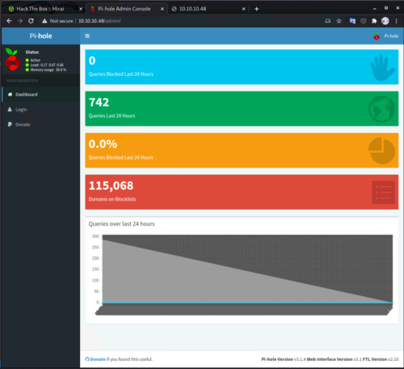
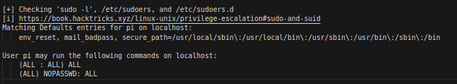

## はじめに

「Hack The Box」という、ペネトレーションテストの学習プラットフォームを利用してセキュリティについて学んでいます。
「Hack The Box」のランクは、本記事執筆時点でProHackerです。


この記事では、HackTheBoxのマシン攻略を通して「 IoT機器」に対する攻撃と、セキュリティ向上のための対処方法について勉強したことをまとめていきます。

### 記事について

**本記事の内容は社会秩序に反する行為を推奨することを目的としたものではございません。**

自身の所有する環境、もしくは許可された環境以外への攻撃の試行は、「不正アクセス行為の禁止等に関する法律（不正アクセス禁止法）」に違反する可能性があること、予めご留意ください。

またすべての発言は所属団体ではなく個人に帰属します。

## マシンの概要 
- プラットフォーム：Linux
- 難易度：Easy (かなり簡単な部類の Easy )
- 必要なテクニック / 知識
    - nmap / gobuster などを用いた探索
    - IoT マルウェアの攻撃手法
    - 権限昇格のための内部探索手法
    - Linux のデバイス管理について

## このマシンの攻略で新たに学習した項目
- IoT マルウェアの概要および攻撃手法について
- Linux のデバイスファイルについて
- フラッシュメモリから削除されたデータのサルベージ方法

## 探索
さっそくマシン攻略を始めていきます。
まずはいつも通りポートスキャンから試していきます。

```bash:console
TARGET=10.10.10.48 && expose TARGET
nmap -sV -sC -T4 $TARGET| tee nmap1.txt
```
こちらのコマンドで、次のような出力が得られました。



80 番ポートが開いているので、とりあえずブラウザアクセスしてみます。



404 が返ってきたので、今度はこの WEB ページに対して探索を行います。
gobuster での探索を試みる前に、とりあえずありがちなファイルパスでアクセス可能か試してみました。
>
/robots.txt
/admin
/login

どうやら`/admin`でヒットしたようで、 Pi-hole というアプリケーションの管理コンソール画面が開きました。



### Pi-hole とは?

この Pi-hole というアプリケーションは初めて見たものでしたので、とりあえずドキュメントを眺めてみます。

>The Pi-hole® is a DNS sinkhole that protects your devices from unwanted content, without installing any client-side software.
[Overview of Pi-hole - Pi-hole documentation](https://docs.pi-hole.net/)

上記のとおり、 Pi-hole は、不要なコンテンツからデバイスを保護する DNS シンクホールとして利用できるアプリケーションのようです。(DNS シンクホールは、問い合わせに対してわざと間違った応答を返す DSN のこと)

Pi-hole という名前ですが、 Rasberry-pi だけでなく、Debian や Docker コンテナなど、様々なプラットフォームにデプロイできるようです。

同じくドキュメントより、 Pi-hole で使用されている技術について特定ができました。
>
Pi-hole being a advertising-aware DNS/Web server, 
makes use of the following technologies:  
- dnsmasq - a lightweight DNS and DHCP server
- curl - A command-line tool for transferring data with URL syntax
- lighttpd - web server designed and optimized for high performance
- php - a popular general-purpose web scripting language
- AdminLTE Dashboard - premium admin control panel based on Bootstrap 3.x
- sqlite3 - SQL Database engine
[Pi-hole Origins - Pi-hole documentation](https://docs.pi-hole.net/main/origins/)

いくつか気になる点はありましたが、脆弱性の報告数がトップクラスで知られる PHP で実装されているようですので、ここを起点に侵入できる穴がないか探っていこうと思います。

## 侵入
### 脆弱性の調査
さて、 Pi-hole の脆弱性を起点にマシンに侵入できる経路がないか探していきます。
まず、管理コンソールから Pi-hole のバージョンが`Pi-hole Version v3.1.4`であることを確認しました。

上記のバージョンに該当する脆弱性について探したところ、こちらの 2 つが使えそうに感じましたが、残念ながらどちらもまず管理コンソールにログインできる認証情報を取得する必要がありました。
(※メタ的な話ですが、このマシンが作られたのは 2017 年なので、CVE-2020-xxx は確実に想定解ではなさそう。)

>
- [CVE-2020-11108](https://www.exploit-db.com/exploits/48442)
    - 認証が必要
    - ブロックリストの脆弱性を利用した RCE の脆弱性
- [CVE-2020-8816](https://nvd.nist.gov/vuln/detail/CVE-2020-8816)
    - 認証が必要
    - 細工されたDHCP静的リースを介して行われる RCE の脆弱性


### 認証情報の取得
とりあえず`Pi-hole Password`などのワードで Google 検索を試してみました。
すると、ローカル環境にログインして、次のコマンドを実行することで、 Pi-hole のパスワードをリセットできることがわかりました。

```bash:bash
sudo pihole -a -p
```
また、いくつかの Pi-hole の設定方法の書かれた記事を読むと、 Pi-hole をインストールする Rasberry-pi に初期パスワード`raspberry`でログインしましょうという記載がありました。

ここで、このマシンのタイトルが`Mirai`であることにようやく気付きました笑

### Mirai とは
Mirai とは、IoT 機器に感染し、巨大なボットネットを形成するマルウェアです。 
ネットワークのスキャンを行い、発見された IoT に対して侵入します。

Mirai は、多くの IoT デバイスにおいて、認証情報が初期設定のまま放置されているという穴を突く感染の容易さ、ソースコードが容易に入手可能であったことなど、様々な要因から、亜種も含めて大いに流行しました。
Mirai の脅威としては、 2016 年に 100Gbps 超の DDoS 攻撃が複数回行われたことで米国の DNS サービスが停止し、 Twitter などのサービスに影響が発生したことなどが知られています。

初期設定の認証情報の悪用などによって IoT デバイスが感染すると、攻撃者の C＆C サーバからの遠隔操作によって、ボットとしてマルウェアの拡散に利用されたり、 DDoS 攻撃などに利用されたする場合があります。

- [IPA:顕在化したIoTのセキュリティ脅威とその対策](https://www.ipa.go.jp/files/000059579.pdf)
- [史上最悪規模のDDoS攻撃　「Mirai」まん延、なぜ？ (1/4) - ITmedia NEWS](https://www.itmedia.co.jp/news/articles/1802/21/news034.html)
- [Mirai流行の背景、「IoT機器の初期設定」に主因 | IoTのセキュリティ情報なら「iot security」](https://www.trendmicro.com/jp/iot-security/news/3056)
- [「Mirai」ソースコード徹底解剖－その仕組みと対策を探る (1/4)：大規模DDoS攻撃を引き起こしたIoTボットネット - ＠IT](https://www.atmarkit.co.jp/ait/articles/1611/08/news028.html)

また、Mirai のスキャナーのソースコードを読むと、 IoT デバイスの初期設定の認証情報がハードコーディングされており、非常に興味深いです。
中には、東芝のネットワークカメラや、パナソニックのプリンタを狙っていると思われる認証情報も含まれています。

他にも、Mirai ではありませんが、 Rasberry-pi を狙った IoT マルウェアも複数確認されております。
Linux.MulDrop.14 はその一例で、 Rasberry-pi 用 OS である Rasbian の初期設定の認証情報を狙っています。
>
Raspberry Piの公式ディストリーである「Rasbian」はセットアップした直後だと、ユーザー名が「pi」、パスワードが「raspberry」でSSH接続できるようになっています。
[初期パスワードを変更していない脆弱な「Raspberry Pi」を狙う新たなIoTウイルス「Linux.MulDrop.14」が登場！感染後に暗号通貨のマイニングを実施 - ライブドアニュース](https://news.livedoor.com/article/detail/13202811/)

### Mirai などの IoT マルウェアへの対策
さて、一応僕はサイバーセキュリティの防御側の立場から、攻撃者の思考を知るためにマシン攻略を行ってますので、これらの IoT マルウェアに対する対策も簡単に検討してみます。
(※ あくまで個人の考えですのでご留意ください)

ぱっと思いつくものだと、`IoT デバイスのパスワードを工場出荷時のままにしない`というのは有効だと思います。
実際に Rasberry-pi も、公式に初期設定の認証情報を変更するようアナウンスしています。

とはいえ実際に十分な強度のパスワードを設定している人がどれくらいいるのかは疑問です。
なので、OS が初めから起動時に認証情報を設定するようにデザインしてもいいのではとは思ってます。
実際に Rasberry-pi 用の Ubuntu をインストールすると、起動時に認証情報の設定が必要になります。

あとは、`不要なデバイスをネットワークに公開しない / 不要なポートを公開しない`というのも当然ながら必要かと思います。
Mirai などのマルウェアは、結構ネットワークカメラデバイスを狙っているものが多いように感じます。

防犯用のカメラなど、外出先から映像を監視するために一般家庭でもポート開放を行うケースが結構あるみたいですね。
自由なインターネットは恐ろしいので、とてもじゃないですが自宅のネットワークに外部から接続可能な状態にはしたくないですね…。

上記以外にも、`IoT デバイスをきちんと更新して脆弱性対策を行う`とか、`出口対策として、特定の宛先以外には情報を送信しないように設定する`とかが考えられますね。
ただ、IoT カメラデバイスなど、メーカーによっては、脆弱性が公表されても全然パッチを提供しないケースとかも見たことがあるので、バージョンアップが十分な脆弱性対策になるかは若干疑問です。

## 今度こそ侵入
さて、少し脱線しましたが、マシン攻略に戻ります。

Pi-hole が動いていますので、動作環境は Rasberry-pi の可能性があります。
(そして、マシンのチャレンジ名は Mirai ・・・)

というわけで、 Rasbian の初期パスワードでの SSH を試みます。

```bash:bash
ssh pi@10.10.10.48 #パスワードに「raspberry」を入力
```

ログインできました！
やっぱり Rasberry-pi だったんだ！

確認してみると、次のような出力が取れました。

```bash:console
pi@raspberrypi:~ $ uname -a
Linux raspberrypi 3.16.0-4-686-pae #1 SMP Debian 3.16.36-1+deb8u2 (2016-10-19) i686 GNU/Linux
```

ともかく、これで user を取得できました。

## 内部探索
次に、root を取得するため、権限昇格が可能な穴を探していきます。
まずは、探索用の Linpeas ファイルを SCP でマシンに転送し、実行結果ファイルをローカルに取得します。

```bash:bash(ローカル)
scp /home/kali/Hacking/Knowledge/Exploits/linPEAS/linpeas.sh  pi@$TARGET:~/
```

```bash:bash(マシン)
sh linpeas.sh | tee linpeas_result.txt
```

```bash:bash(ローカル)
scp pi@$TARGET:~/linpeas_result.txt ./
```
出力結果を見たところ、以下の出力が確認できました。



ガバガバ権限です。
`sudo -l` の結果が上記のような出力の場合、ユーザは `sudo <コマンド>` をパスワードなしで実行できます。
- [sudo のパスワードを入力なしで使うには - Qiita](https://qiita.com/RyodoTanaka/items/e9b15d579d17651650b7)

まさかと思って調べてみたところ、やっぱり Rasbian は初期設定で sudo にパスワードが設定されていないようです。
つまり、初期設定の Rasbian は、SSH 接続も権限昇格もし放題ってことですね。

もし Rasbian をサーバ用途で使う場合は注意が必要そうですね。
- [RaspberryPiをRaspbianで使う場合の初期設定メモ（ユーザ追加） - Qiita](https://qiita.com/R-STYLE/items/b481ba2d695ddf8bcee4)

## 権限昇格
というわけで、サクッと root 権限を取得できました。

```bash:bash
sudo su
```

これでクリア！
と、思いきや、もう少しだけ続きます。

root.txt を開いてみると、フラグではなく次のテキストが書かれていました。
どうやら本物の root.txt は失われてしまったようです。

```
root@raspberrypi:~# cd /root/
root@raspberrypi:~# cat root.txt 
I lost my original root.txt! I think I may have a backup on my USB stick...
```

でもご安心。
どうやらバックアップを USB に保存しているそうです。

## もう一度内部探索
ここから、バックアップされたデータを取得するためにもう一度探索を行います。

とはいえ、 USB を探すのなんて楽勝です。
Linux に一度でも USB を接続したことがあれば、 `/media` 配下にマウントされることが多いことがわかるかと思います。

中身を見てみると、やはりありました。
しかし、どうやらうっかりデータを削除してしまったようです…。

James はうっかり屋さんですね。

``` 
root@raspberrypi:~# cd /media
root@raspberrypi:/media# ls
usbstick
root@raspberrypi:/media# cd usbstick/
root@raspberrypi:/media/usbstick# ls
damnit.txt  lost+found
root@raspberrypi:/media/usbstick# cat damnit.txt 
Damnit! Sorry man I accidentally deleted your files off the USB stick.
Do you know if there is any way to get them back?
-James
```
うっかり屋の James の尻ぬぐいもといフォローのため、何とかして失われた root.txt の中のフラグをサルベージしたいと思います。

しかし、何を手掛かりに探せばいいのでしょうか？

ここで考えるべきは、「Linux のデバイスマウントの仕組み」です。
余談ですが Linux のカーネルがどんな動きをするのかについては、こちらの本が入門的で非常に参考になります。

[動かしながらゼロから学ぶ Linuxカーネルの教科書](https://amzn.to/2LyGD35)

### Linux のデバイスマウントの仕組み
Linux(というか Unix 系) は接続されたデバイスをすべて「デバイスファイル」として抽象化して管理しています。
参考: [デバイスファイル (device file)とは｜「分かりそう」で「分からない」でも「分かった」気になれるIT用語辞典](https://wa3.i-3-i.info/word11689.html)

デバイスドライバは、Linux カーネルによって「デバイスファイル」として抽象化され、慣例的な名前(sda, sdbなど)を付けられたのちに`/dev` 配下に格納されます。
OS 上のアプリケーションは、この「デバイスファイル」を参照することで、ハードディスクや USB、マウスなどのデバイスを操作するわけです。

デバイスファイルは、主に「キャラクター型」と「ブロック型」に分類され、ハードディスクなどの固定長のデータは、「ブロック型」として保存されます。
参考：[Linuxのファイルの種類 - Qiita](https://qiita.com/angel_p_57/items/1faafa275525469788b4)

## root フラグ取得
今回のターゲットの USB もこちらの「ブロック型」のデバイスファイルとして保存されているはずです。
OS が利用できるブロックデバイスは、`lsblk`で出力可能です。

```bash:
root@raspberrypi:~# lsblk
NAME   MAJ:MIN RM  SIZE RO TYPE MOUNTPOINT
sda      8:0    0   10G  0 disk 
├─sda1   8:1    0  1.3G  0 part /lib/live/mount/persistence/sda1
└─sda2   8:2    0  8.7G  0 part /lib/live/mount/persistence/sda2
sdb      8:16   0   10M  0 disk /media/usbstick
sr0     11:0    1 1024M  0 rom  
loop0    7:0    0  1.2G  1 loop /lib/live/mount/rootfs/filesystem.squashfs
```

フラグの格納されている `/media/usbstick` は `sdb` というデバイスファイルとして扱われていることがわかりました。
最後に、ここからデータを取り出していきます。

HackTheBox のフラグはテキストとして保存されているので、正直 `strings /dev/sdb` だけでも簡単に取得できます。
とはいえそれではあまりに面白くないので、 `/dev/sdb` の中身を見てみたいと思います。

`lsblk` の結果から、`/dev/sdb` のサイズは 10MB とわかっていますので、末尾のアドレスは`0xa00000`になります。
`hexdump` で出力してあげます。

```bash:bash
root@raspberrypi:~# hexdump -C /dev/sdb 
00000000  00 00 00 00 00 00 00 00  00 00 00 00 00 00 00 00  |................|
*
0005b800  02 00 00 00 0c 00 01 02  2e 00 00 00 02 00 00 00  |................|
0005b810  0c 00 02 02 2e 2e 00 00  0b 00 00 00 24 00 0a 02  |............$...|
0005b820  6c 6f 73 74 2b 66 6f 75  6e 64 00 00 0c 00 00 00  |lost+found......|
0005b830  10 00 08 01 72 6f 6f 74  2e 74 78 74 0d 00 00 00  |....root.txt....|
0005b840  c4 03 0a 01 64 61 6d 6e  69 74 2e 74 78 74 00 00  |....damnit.txt..|
0005b850  00 00 00 00 00 00 00 00  00 00 00 00 00 00 00 00  |................|
*
省略
* Flag
0080a800  33 64 33 65 34 38 33 31  34 33 66 66 31 32 65 63  |xxxxxxxxxxxxxxxx|
0080a810  35 30 35 64 30 32 36 66  61 31 33 65 30 32 30 62  |xxxxxxxxxxxxxxxx|
0080a820  0a 00 00 00 00 00 00 00  00 00 00 00 00 00 00 00  |................|
0080a830  00 00 00 00 00 00 00 00  00 00 00 00 00 00 00 00  |................|
*
0080ac00  44 61 6d 6e 69 74 21 20  53 6f 72 72 79 20 6d 61  |Damnit! Sorry ma|
0080ac10  6e 20 49 20 61 63 63 69  64 65 6e 74 61 6c 6c 79  |n I accidentally|
0080ac20  20 64 65 6c 65 74 65 64  20 79 6f 75 72 20 66 69  | deleted your fi|
0080ac30  6c 65 73 20 6f 66 66 20  74 68 65 20 55 53 42 20  |les off the USB |
0080ac40  73 74 69 63 6b 2e 0a 44  6f 20 79 6f 75 20 6b 6e  |stick..Do you kn|
0080ac50  6f 77 20 69 66 20 74 68  65 72 65 20 69 73 20 61  |ow if there is a|
0080ac60  6e 79 20 77 61 79 20 74  6f 20 67 65 74 20 74 68  |ny way to get th|
0080ac70  65 6d 20 62 61 63 6b 3f  0a 0a 2d 4a 61 6d 65 73  |em back?..-James|
0080ac80  0a 00 00 00 00 00 00 00  00 00 00 00 00 00 00 00  |................|
0080ac90  00 00 00 00 00 00 00 00  00 00 00 00 00 00 00 00  |................|
*
00a00000
```

正直勉強不足で、USB メモリなどのフラッシュディスクのアドレスマップはよくわかってないですが、後半のブロックに実際のデータが格納されていそうなことはわかりました。

つまり、James が USB メモリから root.txt を削除した段階では、root.txt を参照するための情報が削除されたにすぎず、実データは、そのアドレスに別のデータが上書きされるまで残り続けるというのが、このマシンの root を取得するための方法だったと考えられます。

## まとめ
さて、これで Mirai の攻略に成功しました！
今回のマシン攻略を通して得た防御側の知見としては以下のものがあるかと思います。

- 初期設定の認証情報は狙われている
- sudo 権限は絞りましょう
- 外部から SSH 接続をさせない(SSH を公開するときは PW 認証ではなく秘密鍵を使う)
- メディアデバイスを破棄する際にデータを削除する場合は上書き削除すること

WriteUp は学んだことの整理に有益なのでまた書きたいですね。
それでは。
