趣味でプログラミングとかセキュリティを勉強してます。

最近は、"Hack The Box"や"Try Hack Me"のようなペネトレーションテストの学習プラットフォームや、CTFでよく遊んでいます。

今回は、普段"Hack The Box"やCTFで使っているParrotOSの環境を立て直すことにしたので、備忘録代わりにセットアップ方法についてまとめておこうと思い、この記事を書きました。

この記事では以下についてまとめました。

- **ParrotOSをインストールした後に行う設定**
- **HackTheBoxとCTFのためにインストールするアプリケーション**
- **GhidraのDebuggerビルドのセットアップ**
- **セットアップ後のあれこれ**

<!-- omit in toc -->
## 本記事について

**本記事の内容は社会秩序に反する行為を推奨することを目的としたものではございません。**

自身の所有する環境、もしくは許可された環境以外への攻撃の試行は、「不正アクセス行為の禁止等に関する法律（不正アクセス禁止法）」に違反する可能性があること、予めご留意ください。

またすべての発言は所属団体ではなく個人に帰属します。

<!-- omit in toc -->
## もくじ
- [ParrotOSとは？](#parrotosとは)
- [なぜParrotにしたのか](#なぜparrotにしたのか)
- [ParrotOSの初期設定](#parrotosの初期設定)
  - [パッケージをアップグレードする](#パッケージをアップグレードする)
  - [ネットワークIPを設定する](#ネットワークipを設定する)
  - [RDPを設定する](#rdpを設定する)
  - [追加パッケージをインストールする](#追加パッケージをインストールする)
  - [日本語入力に対応させる](#日本語入力に対応させる)
    - [OS起動時の入力設定を英字にする](#os起動時の入力設定を英字にする)
  - [ALIASを設定する](#aliasを設定する)
  - [メニューバーの位置を変更する](#メニューバーの位置を変更する)
  - [自動アップデートウィンドウを無効にする](#自動アップデートウィンドウを無効にする)
  - [タイムゾーンを変更する](#タイムゾーンを変更する)
  - [ターミナルの設定を変更する](#ターミナルの設定を変更する)
  - [OSのショートカットキーを変更する](#osのショートカットキーを変更する)
  - [GithubにSSHキーを登録する](#githubにsshキーを登録する)
  - [自動スリープを無効にする](#自動スリープを無効にする)
- [各種ツールをインストールする](#各種ツールをインストールする)
  - [Google Chrome](#google-chrome)
  - [VSCode](#vscode)
  - [Docker](#docker)
  - [JDK](#jdk)
  - [Ghidra](#ghidra)
  - [Universal Radio Hacker (URH)](#universal-radio-hacker-urh)
  - [angr](#angr)
  - [pwntools](#pwntools)
  - [PyCryptodome](#pycryptodome)
  - [Ciphey](#ciphey)
  - [RSACTFTool](#rsactftool)
  - [PostMan](#postman)
  - [GIMP](#gimp)
  - [CopyQ](#copyq)
  - [Eclips](#eclips)
  - [Wine](#wine)
  - [GDB-PEDA](#gdb-peda)
  - [RustScan](#rustscan)
  - [FZF](#fzf)
  - [Gobuster/Feroxbuster](#gobusterferoxbuster)
  - [CrackMapExec](#crackmapexec)
  - [Evil-WinRM](#evil-winrm)
  - [Windows-Exploit-Suggester](#windows-exploit-suggester)
  - [BurpSuite](#burpsuite)
  - [SourceTrail](#sourcetrail)
  - [YARA](#yara)
  - [Qemuとクロスコンパイル環境](#qemuとクロスコンパイル環境)
  - [AWS CLI](#aws-cli)
  - [impackets](#impackets)
  - [Tweak](#tweak)
  - [pngcheck](#pngcheck)
  - [png-parser](#png-parser)
  - [creddump](#creddump)
  - [USB keybord parser](#usb-keybord-parser)
  - [PINCE](#pince)
  - [wabt](#wabt)
- [Docker環境を構築する](#docker環境を構築する)
- [Ghidraのデバッガブランチをビルドする](#ghidraのデバッガブランチをビルドする)
- [セットアップが終わったら・・・](#セットアップが終わったら)
  - [ゴミを片づける](#ゴミを片づける)
  - [スナップショットをとる](#スナップショットをとる)
  - [イメージをエクスポートする](#イメージをエクスポートする)
- [まとめ](#まとめ)


## ParrotOSとは？

[Parrot Security](https://www.parrotsec.org/)の開発しているDebianベースのLinuxディストリビューションです。

ペンテストやリバースエンジニアリング向けのディストリビューションで、Kali Linuxとよく似たディストリビューションです。

様々なペネトレーションテスト向けのツールがデフォルトで入っています。

ParrotOSはHackTheBoxとも連携して開発されています。

参考：[HTB News | Hack The Box + Parrot OS](https://www.hackthebox.eu/newsroom/supporting-parrot-os)

## なぜParrotにしたのか

Parrotは1年弱使ってますが、**アップグレード時の手間が体感的にKaliの100倍少ない**です。
（OSが起動しなくなったりしないので）

このアップグレードの手間とトラブルが少ないという1点だけでParrotを使っていると言ってもいいかもしれません。

あとはUIが綺麗で使っていて楽しいOSかなと思います。

ウィンドウの操作ボタンが左上についているので、Macユーザの人はParrotの方が使いやすく感じるかもしれません。

僕はゴリゴリのWindow派ですが、Parrotの操作感は結構快適なのでおすすめです。

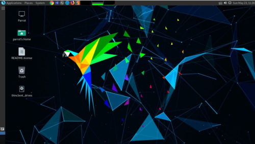


## ParrotOSの初期設定

### パッケージをアップグレードする

とりあえず最初にパッケージのアップグレードをしておきます。

※初回は結構時間かかります（環境によっては1時間以上）

ちなみに、ParrotOSは公式が`apt upgrade`を使用することを推奨していません。

そのため、以下のような`full-upgrade`か`parrot-upgrade`を使ってパッケージを更新します。

```bash
sudo apt clean
sudo apt update
sudo apt full-upgrade --fix-missing -y
sudo apt autoremove -y
```

しばらく待った結果、依存関係とかでたまに失敗することが結構ありますが、そんなに嫌がらなくて大丈夫です。

大抵はアップグレードにこけたパッケージを先にアップグレードしてあげれば解消されます。

今回は特に何の問題もなくパッケージがアップグレードされました。

ちなみに、途中で出てくるWireSharkのポップアップは[Yes]を選んでます。

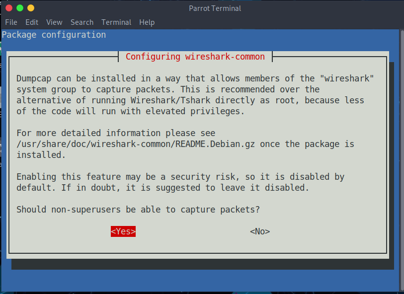

他にもいくつかポップアップが出てきますが、自分の環境に合わせて適当に選んでください。

### ネットワークIPを設定する

次にネットワークの設定をします。

僕の環境では、Parrotに外部接続用と内部環境用の2つのNICを設定しています。

外部接続ネットワークのIPは固定せずDHCPにしておいて、ホストからRDPをするための内部ネットワークのIPを固定すると、ホストのネットワーク環境が変わっても同じように使用できるので便利です。

各NICの設定は、[Advanced Network Configration]を使うと簡単に設定できます。

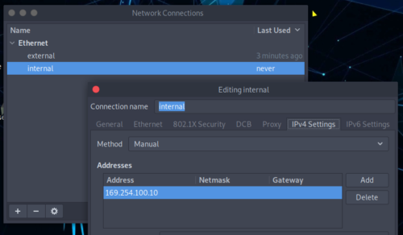

### RDPを設定する

ネットワークIPを固定したところで、Windows環境から快適に仮想マシンを操作するためにRDPを設定します。

まずは必要なパッケージをインストールします。

```bash
sudo apt install -y xrdp
sudo systemctl enable xrdp
sudo systemctl start xrdp
```

XRDPを使うときは、仮想マシンに誰もログインしていない必要があります。

そのため、一旦仮想マシンを再起動、もしくはログオフしてから、RDP接続を行ってください。

### 追加パッケージをインストールする

個人的によく使うパッケージを先にインストールしておきます。

特にパッケージの詳細については解説しません。

```bash
sudo apt install \
                 vim \
                 make \
                 git \
                 python3.9 \
                 python3-pip \
                 python3.9-dev \
                 unzip \
                 zip \
                 build-essential \
                 gdb \
                 radare2 \
                 ltrace \
                 strace \
                 xdotool \
                 pngcheck \
                 xdotool \
                 fcitx-mozc \
                 tweak \
                 feroxbuster \
                 openvpn \
                 bloodhound  \
                 neo4j \
                 cmake \
                 -y
```

### 日本語入力に対応させる

次に、Parrotを日本語入力に対応させます。

まずはこちらをインストール。

```bash
sudo apt install fcitx-mozc
```

次に、[System]>[Preferences]>[Other]から、[Fcitx Configration]を開きます。

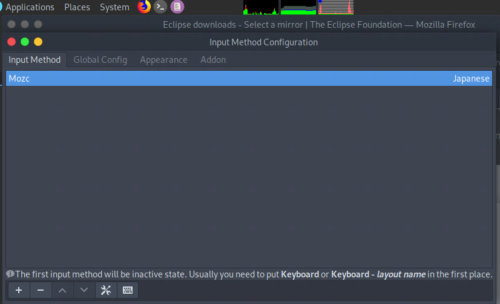

ここで、[Input Method]にMozcを追加した後、[Global Config]タブで[Trigger Input Method]を[Zenkakuhankaku]に設定します。

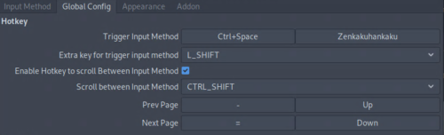

これで、Parrotで日本語入力ができるようになりました。

ちなみに、Mozcの設定がデフォルトのままだと日本語入力の時にスペースが全角になって鬱陶しいので、こちらの設定も変えてあげると幸せになれるかもしれません。

Mozcの設定は、[System]>[Preferences]>[Other]から、[Mozc Settings]を開きます。

ここで[Space input style]を半角に設定します。

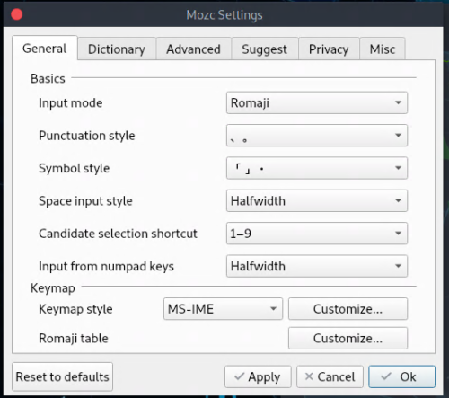

#### OS起動時の入力設定を英字にする

現在aptでインストールされるfcitx-mozcのバージョンでは、OSの起動時に必ずかな入力で始まり、これは仕様上変更ができないようです。

このためだけに自分でパッチを当てるのも面倒なのでコマンドで対応しました。

以下のコマンドをスタートアップアプリケーションに設定するだけです。

``` bash
xdotool key ctrl+alt+t && xdotool key Zenkaku_Hankaku
```

これでOS起動時に英字モードで開始することができます。
(ターミナルの起動ショートカットをCtrl+Alt+Tに割り当てておく必要があります。)

### ALIASを設定する

.bashrcなどに、以下を追記します。

以下の例は、よく使っているアーカイブ解凍コマンドのエイリアスです。
あと、よく使うPython2とWineのコンテナ起動コマンド、アプリケーションの起動スクリプトなどもエイリアス化してます。

好みに合わせて色々設定しておくといいと思います。

```bash
alias tarbz2='tar -jxvf'
alias targz='tar -zxvf'
alias tarxz='tar -Jxvf'

alias run_python2='docker run --net host --rm -it -v $PWD:/app python2 bash'
alias run_wine='docker run --rm -it --user ubuntu -v $PWD:/usr/app wine32 bash'
alias run_php='docker run --net host --rm -it -v $PWD:/root php bash'

alias rsactftool='docker run --rm -it -v $PWD:/data kashiwabayuki/rsactftool:1.0'
alias crackmapexec='docker run --net host --rm -it -v $PWD:/usr/src/crackmapexec kashiwabayuki/crackmapexec:1.0'
alias evil-winrm='docker run --rm -it -v $PWD:/data kashiwabayuki/evil-winrm:1.0'
alias windows-exploit-suggester='docker run --rm -it -v $PWD:/exploit-suggester kashiwabayuki/windows-exploit-suggester:1.0'
alias pince='cd /home/parrot/Tools/PINCE && sh PINCE.sh'
```

### メニューバーの位置を変更する

デフォルトだと下部にあるメニューバーを右クリックして[Properties]をクリックすると、設定ウィンドウが開きます。

ここで[Orientation]の項目を変更するとメニューバーの位置が変更できます。

僕は大体左に設定しています。

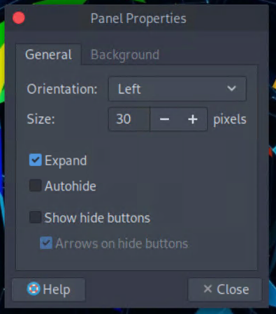

### 自動アップデートウィンドウを無効にする

起動時に毎回アップデートの確認ウィンドウが表示されるのが煩わしいので、自動アップデートを無効に設定します。

上部の[System]から、[Synapic Package Manager]を開きます。

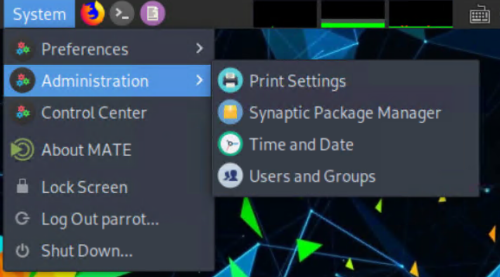

初回起動時のウィンドウのチェックを外したままにして先に進めば、以降の起動時にアップデートの確認ウィンドウがポップアップされなくなります。

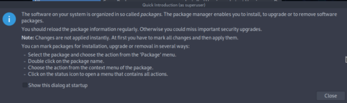

あとは、[Startup Application]から、[System Updater]を無効化します。

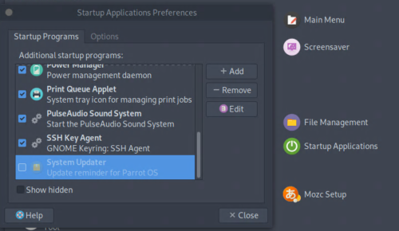

これで起動時にポップアップがでることがなくなります。

### タイムゾーンを変更する

右上の時刻をクリックして[Location]を開き、[Edit]をクリックします。

ここで[Locations]にJapanを追加します。

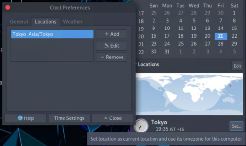

次に[Tokyo]の隣の[Set ...]ボタンをクリックしてタイムゾーンを変更します。

これで時刻設定が反映されます。

### ターミナルの設定を変更する

Parrotでは、デフォルトのターミナルがMATEになってます。

これは好みの問題ですが、この設定を少しいじります。

ターミナルの[Edit]>[Profiles]から設定一覧を開き、編集していきます。

とりあえず配色をSystem themeにして、背景の透明度も調整しました。

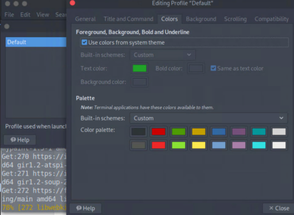

[Keyboard Shortcuts]からショートカットの割り当ても変更できます。

好みに合わせて編集してます。

### OSのショートカットキーを変更する

初期設定では、ターミナルを起動するショートカットがUbuntuと異なり使いづらいので、[Keyboard Shortcuts]を開いて[terminal]のショートカットを追加してます。

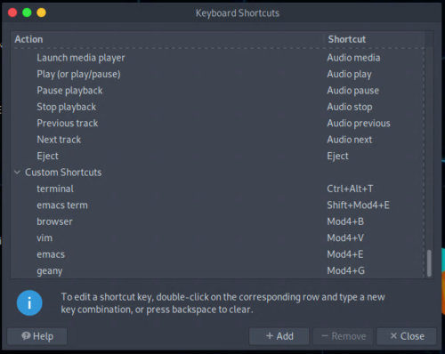

### GithubにSSHキーを登録する

`ssh-keygen`で作成した公開鍵をGithubに登録します。

詳しくは[Connecting to GitHub with SSH - GitHub Docs](https://docs.github.com/en/github/authenticating-to-github/connecting-to-github-with-ssh)まで。

### 自動スリープを無効にする

[Power Management Preferences]を開いて、Displayの自動スリープを無効にします。

初期設定だと30分に設定されています。

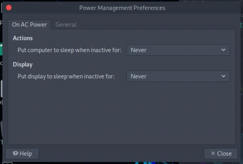


## 各種ツールをインストールする

僕が個人的にセットアップしているツールについてまとめます。

入れなくても特に問題はありません。

※ツールの記載については必要に応じて編集していきます。

### Google Chrome

[Google Chrome - Download the Fast, Secure Browser from Google](https://www.google.com/chrome/) から、debパッケージをダウンロードします。

`sudo dpkg -i xxx.deb`コマンドでChromeをインストールできます。

### VSCode

[Visual Studio Code – コード エディター | Microsoft Azure](https://azure.microsoft.com/ja-jp/products/visual-studio-code/)から、debパッケージをダウンロードします。

`sudo dpkg -i xxx.deb`コマンドでインストールできます。

拡張機能はお好みに合わせてインストール。

Symlinksの設定は無効化しておくと、変なタイミングでCPUリソース消費しなくなるのでいいかと思います。

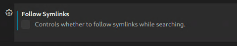

他にも、files.watcherExcludeやメモリ上限など、コンピュータリソースの負荷につながる設定項目がいくつかあるので、必要に応じてチューニングします。

### Docker

Ubuntuのインストール方法とほぼ同じ手順でインストールできます。

[Install Docker Engine on Ubuntu | Docker Documentation](https://docs.docker.com/engine/install/ubuntu/)を参照。

ただし、リリースバージョンを取得するコマンドはParrotではうまく動作しないので、今回は'focal'を明示的に指定します。

```bash
echo "deb [arch=amd64 signed-by=/usr/share/keyrings/docker-archive-keyring.gpg] https://download.docker.com/linux/ubuntu focal stable" | sudo tee /etc/apt/sources.list.d/docker.list > /dev/null
```

Dockerのインストールが終わったら、以下のコマンドでsudo権限なしでも使えるようにします。

```bash
sudo gpasswd -a $USER docker
sudo service docker start --enable
```

これで構築は完了です。

Dockerのよく使うイメージやコマンドについては後述します。

### JDK

解凍したファイルを適当なディレクトリに配置します。

次に、PATHを追加しておきます。

```bash
sudo mv jdk-11.0.11+9 /usr/local/lib/jdk-11.0.11+9
echo "PATH=$PATH:/usr/local/lib/jdk-11.0.11+9/bin" >> ~/.bashrc
```

### Ghidra

お馴染み最強ツールです。

最近のRevのWriteUpとかだとみんなGhidra使ってますね。

[Ghidra](https://ghidra-sre.org/)からGhidraをダウンロードして解凍します。

解凍したファイルは適当なフォルダに配置します。

どこからでも呼び出せるように、ghidraRunの配置されたフォルダをPATHに追加してあげるといいと思います。

```bash
echo "PATH=$PATH:/home/parrot/Tools/Ghidra/" >> ~/.bashrc
```

ちなみにGhidraですが、現在はまだメジャーリリース版には実装されていないデバッガ機能を使っていきたいニーズがあると思います。

その場合は、GhidraリポジトリのDebuggerブランチのソースコードから自分でビルドします。

ビルド方法は後述するので、やりたい方は参考にしてください。

### Universal Radio Hacker (URH)

MiscとかRevやるときにたまに使うやつです。

適当なディレクトリで仮想環境を切ります。

```bash
pipenv install
pipenv shell
pip install urh
```

### angr

Rev問やるときの神ツールです。

使い方は[angrによるシンボリック実行でRev問を解いてみたまとめ【WaniCTF2021】](https://qiita.com/kash1064/items/f942a5d1af1579808622)で結構詳しく書きました。

適当なディレクトリで仮想環境を切ります。

```bash
pipenv install
pipenv shell
pip install angr
```

### pwntools

CTFで使うツール全部のせみたいなライブラリです。

あんま競合しないのでグローバルにつっこみます。

```bash
pip install pwntools
```

### PyCryptodome

暗号化機能が使えるようになるPythonのライブラリです。

これは他のパッケージと競合せずに使えるので、普通にグローバルにインストールします。

```bash
pip install pycryptodome
```

### Ciphey

暗号化をいい感じに解除できます。

適当なディレクトリで仮想環境を切ります。

```bash
pipenv install
pipenv shell
python3 -m pip install ciphey --upgrade
```

### RSACTFTool

脆弱なRSA関連の問題が出たときに役立つツールです。

参考：[Ganapati/RsaCtfTool: RSA attack tool (mainly for ctf) - retreive private key from weak public key and/or uncipher data](https://github.com/Ganapati/RsaCtfTool)

依存関係がややこしいので基本的にDockerで構築してます。

``` dockerfile
FROM alpine:3.13
RUN apk update && \
    apk add --no-cache \ 
    gmp-dev mpfr-dev mpc1-dev python3 python3-dev py3-pip gcc musl-dev openssl-dev libffi-dev py3-wheel git gcc g++ make cmake git
WORKDIR /opt
RUN git clone https://github.com/Ganapati/RsaCtfTool.git
WORKDIR /opt/RsaCtfTool
RUN pip install -r "requirements.txt"
WORKDIR /data
ENTRYPOINT ["/opt/RsaCtfTool/RsaCtfTool.py"]
```

コンテナイメージのビルドには結構時間がかかります。

環境構築の度にビルドするのは面倒なので、自分のDockerイメージとしてDockerhubに上げておきました。

これでPullできます。

``` bash
docker pull kashiwabayuki/rsactftool:1.0
```

ついでに毎回コマンドを呼び出すのは面倒なので、エイリアスを登録しておきます。

``` bash
alias rsactftool='docker run --rm -it -v $PWD:/data kashiwabayuki/rsactftool:1.0'
```

### PostMan

最近知ったのであまり使ってないですが、API叩くときの神ツールです。

[Download Postman | Try Postman for Free](https://www.postman.com/downloads/)からダウンロードしたファイルを解凍します。

解凍したら使えます。

PATHも追加しておきます。

```bash
echo "PATH=$PATH:/home/parrot/Tools/Postman" >> ~/.bashrc
```

### GIMP

ステガノやるときにたまに使います。

デフォルトで入ってます。

### CopyQ

コピペ用ツールです。

`Ctrl + ;`とかで直近のクリップボードを呼び出せたりして意外とよく使います。

インストールはaptで。

```bash
sudo apt install copyq -y
```

ちなみに再起動時にはcopyqを毎回呼び出さないと動きません。

自動起動する設定がありそうですが、探すのが面倒なのでprofileで毎回起動するように設定してます。

### Eclips

[Eclipse downloads - Select a mirror | The Eclipse Foundation](https://www.eclipse.org/downloads/download.php?file=/oomph/epp/2021-03/R/eclipse-inst-jre-linux64.tar.gz)からLinux向けパッケージをダウンロードします。

解凍したら使えます。

PATHも追加しておきます。

```bash
echo "PATH=$PATH:/home/parrot/Tools/eclipse" >> ~/.bashrc
```

### Wine

WineとMingwをインストールします。

```bash
sudo apt install wine mingw-w64 mingw-w64-common mingw-w64-i686-dev mingw-w64-tools mingw-w64-x86-64-dev -y
```

Wineはあまり使いたくないので、あくまでちょっとした検証用です。

PEバイナリの解析などは別にWindowsマシンを用意してます。

### GDB-PEDA

Toolsディレクトリの直下に、GDB-PEDAをクローンして設定します。

```bash
git clone https://github.com/longld/peda.git ~/Tools/peda
echo "source ~/Tools/peda/peda.py" >> ~/.gdbinit
```

### RustScan

[Releases · RustScan/RustScan · GitHub](https://github.com/RustScan/RustScan/releases)からdebパッケージをダウンロードします。

`sudo dpkg -i xxx.deb`コマンドでインストールできます。

### FZF

なんかファイル検索が楽になるやつです。

```bash
git clone --depth 1 https://github.com/junegunn/fzf.git ~/Tools/.fzf
~/Tools/.fzf/install
```

### Gobuster/Feroxbuster

Gobusterはデフォルトで使えます。

Feroxbusterは使いたければ入れるといいと思います。

これでdebパッケージをダウンロードできます。

```bash
wget https://github.com/epi052/feroxbuster/releases/latest/download/feroxbuster_amd64.deb.zip
unzip feroxbuster_amd64.deb.zip
```

`sudo dpkg -i xxx.deb`コマンドでインストール。

ついでにrockyou.txtも先に解凍しておきます。

```bash
sudo gunzip /usr/share/wordlists/rockyou.txt.gz
```

### CrackMapExec

Windowsマシンのハッキングに使います。

参考：[byt3bl33d3r/CrackMapExec: A swiss army knife for pentesting networks](https://github.com/byt3bl33d3r/CrackMapExec)

依存関係が多いので、環境はDockerイメージで作成します。

``` bash 
git clone https://github.com/byt3bl33d3r/CrackMapExec.git
cd CrackMapExec/
docker build -t crackmapexec .
```

環境構築の度にビルドするのは面倒なので、自分のDockerイメージとしてDockerhubに上げておきました。

これでPullできます。

``` bash
docker pull kashiwabayuki/crackmapexec:1.0
```

使いやすいように、エイリアスも追加します。

``` bash
alias crackmapexec='docker run --rm -it -v $PWD:/usr/src/crackmapexec kashiwabayuki/crackmapexec:1.0'
```

### Evil-WinRM

Windowsマシンにリモート接続するときに便利なシェル。

参考：[Hackplayers/evil-winrm: The ultimate WinRM shell for hacking/pentesting](https://github.com/Hackplayers/evil-winrm)

安心と安全のDockerfileからビルド。

``` dockerfile
# Evil-WinRM Dockerfile

# Base image
FROM ruby:latest

# Credits & Data
LABEL \
    name="Evil-WinRM" \
    author="CyberVaca <cybervaca@gmail.com>" \
    maintainer="OscarAkaElvis <oscar.alfonso.diaz@gmail.com>" \
    description="The ultimate WinRM shell for hacking/pentesting"

#Env vars
ENV EVILWINRM_URL="https://github.com/Hackplayers/evil-winrm.git"

# Install dependencies
RUN gem install \
    winrm \
    winrm-fs \
    stringio \
    logger \
    fileutils

# Create volume for powershell scripts
RUN mkdir /ps1_scripts
VOLUME /ps1_scripts

# Create volume for executable files
RUN mkdir /exe_files
VOLUME /exe_files

# Create volume for data (upload/download)
RUN mkdir /data
VOLUME /data

# Set workdir
WORKDIR /opt/

#Evil-WinRM install method 1 (only one method can be used, other must be commented)
#Install Evil-WinRM (Docker Hub automated build process)
RUN mkdir evil-winrm
COPY . /opt/evil-winrm

#Evil-WinRM install method 2 (only one method can be used, other must be commented)
#Install Evil-WinRM (manual image build)
#Uncomment git clone line and one of the ENV vars to select branch (master->latest, dev->beta)
#ENV BRANCH="master"
#ENV BRANCH="dev"
#RUN git clone -b ${BRANCH} ${EVILWINRM_URL}

# Make script file executable
RUN chmod +x evil-winrm/*.rb

# Clean and remove useless files
RUN rm -rf /opt/evil-winrm/resources > /dev/null 2>&1 && \
    rm -rf /opt/evil-winrm/.github > /dev/null 2>&1 && \
    rm -rf /opt/evil-winrm/CONTRIBUTING.md > /dev/null 2>&1 && \
    rm -rf /opt/evil-winrm/CODE_OF_CONDUCT.md > /dev/null 2>&1 && \
    rm -rf /opt/evil-winrm/Dockerfile > /dev/null 2>&1 && \
    rm -rf /opt/evil-winrm/Gemfile* > /dev/null 2>&1 && \
    rm -rf /tmp/* > /dev/null 2>&1

# Start command (launching Evil-WinRM)
ENTRYPOINT ["/opt/evil-winrm/evil-winrm.rb"]
```

これでPullできます。

``` bash
docker pull kashiwabayuki/evil-winrm:1.0
```

使いやすいように、エイリアスも追加します。

``` bash
alias evil-winrm='docker run --rm -it -v $PWD:/data kashiwabayuki/evil-winrm:1.0'
```

### Windows-Exploit-Suggester
[Windows-Exploit-Suggester.](https://github.com/AonCyberLabs/Windows-Exploit-Suggester)はWindowsの脆弱性を探索するのに便利なツールです。

以下のリポジトリを参考に作成したコンテナイメージを使います。

参考：[gr33nm0nk2802/Windows-Exploit-Suggester](https://github.com/gr33nm0nk2802/Windows-Exploit-Suggester)

``` bash
kashiwabayuki/windows-exploit-suggester:1.0
```

エイリアスも設定しておきます。

``` bash
alias windows-exploit-suggester='docker run --rm -it -v $PWD:/exploit-suggester kashiwabayuki/windows-exploit-suggester:1.0'
```

### BurpSuite

BurpSuiteはデフォルトで無料版がインストールされてます。

Chromeをインストールした後ならFirefoxはほとんど使わないので、Burp専用ブラウザとしてプロキシ設定を行っておくと、いちいち設定を変えなくて済むので楽です。

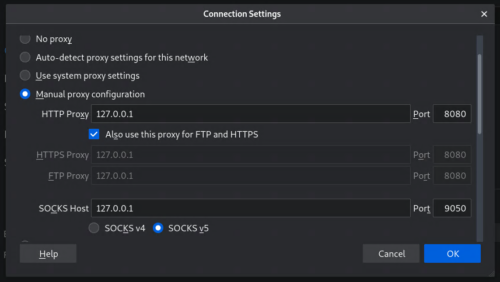

### SourceTrail

最近OSS化された、ソースコードを可視化できるツールです。

[Releases · CoatiSoftware/Sourcetrail · GitHub](https://github.com/CoatiSoftware/Sourcetrail/releases)からダウンロードします。

解凍したディレクトリに移動して、`sudo ./install.sh`を実行すればインストール完了です。

### YARA

YARAです。

YARAはCTFではあまり使いませんが、僕が個人的に好きで、コントリビューションもしたりしているツールなので、必ずインストールしてます。

aptでインストールできるバージョンは少し古いので、ソースコードからビルドします。

[Releases · VirusTotal/yara · GitHub](https://github.com/VirusTotal/yara/releases)から、最新のソースコードをダウンロードできます。

前提要件のパッケージはここまでですでにインストールが完了しているので、以下のコマンドを叩けばOKです。

```bash
./bootstrap.sh
./configure
make
sudo make install
```

このままだと、ライブラリを参照できずYARAが起動しないので、`/etc/ld.so.conf`にライブラリのPATHを追記します。

```bash
sudo echo "/usr/local/lib" >> /etc/ld.so.conf
sudo ldconfig
```

これで、最新ビルドのYARAがインストールできました。

```bash
$ yara -v
4.1.0
```

### Qemuとクロスコンパイル環境

ARM向け実行ファイルとかをコンパイルして解析したり、実行したりしたいときありますよね。

問題ファイルがARM向けバイナリのときとか。

そんな環境を作ります。

``` bash
sudo apt install qemu-user-binfmt qemu-efi qemu-efi-aarch64 qemu-efi-arm qemu-system qemu-system-arm qemu-system-common qemu-system-x86 qemu-system-misc qemu-utils -y
```

次に、クロスコンパイル用のツールをインストール。

``` bash
sudo apt install g++-arm-linux-gnueabihf
```

[x86_64のUbuntuでC/C++のソースコードをARM/ARM64用にクロスコンパイルしてQEMUで実行する方法のまとめ - Qiita](https://qiita.com/tetsu_koba/items/9bdcb59f912efbff3128)を参考にしました。

### AWS CLI

HackTheBoxとかでたまにAWS問題が出るときに、CLIがほしくなる時があります。

``` bash
curl "https://awscli.amazonaws.com/awscli-exe-linux-x86_64.zip" -o "awscliv2.zip"
unzip awscliv2.zip
sudo ./aws/install
```

### impackets

SMBパケットとかを使ってマシン攻略するときなどに使うツールです。

Python2系のpipを使用する必要があり、Parrotにそのまま入れることができないのでDockerを使います。

``` bash
git clone https://github.com/SecureAuthCorp/impacket
cd impacket
docker build -t impacket .
```

### Tweak

バイナリエディタです。

VSCodeのバイナリエディタ拡張やhexeditorも使いますが、Tweakはバイナリデータの追加や削除ができるのが強みです。

``` bash
sudo apt install tweak
```

最低限のコマンドだけよく忘れるので貼っておきます。

```bash
^X^I : Insert
^X^S : Save
^X^C : Exit
```

### pngcheck

pngの確認をするのに使います。

``` bash
sudo apt install pngcheck -y
```

### png-parser

pngのChunkの情報を取得するときとかに便利です。

``` bash
pip install --user git+https://github.com/Hedroed/png-parser
```

使いかたはReadme参照。

参考：[Hedroed/png-parser: Analyse PNG file format for CTF, python API and CLI](https://github.com/Hedroed/png-parser)

### creddump

Forensicで使います。

使いかたは、[CiscoCXSecurity/creddump7](https://github.com/CiscoCXSecurity/creddump7)を参照。

### USB keybord parser

USB pcapから入力された値をパースしてくれます。

ダウンロードは以下のリポジトリから。

[TeamRocketIst/ctf-usb-keyboard-parser: This is the updated script from https://teamrocketist.github.io/2017/08/29/Forensics-Hackit-2017-USB-ducker/](https://github.com/TeamRocketIst/ctf-usb-keyboard-parser)

### PINCE

Linuxで使えるCheatEngineみたいなツールです。

ParrotやKaliでも使えます。

``` bash
cd ~/Tools
git clone --recursive https://github.com/korcankaraokcu/PINCE
cd PINCE
sudo sh install_pince.sh
```

参考：[korcankaraokcu/PINCE: A reverse engineering tool that'll supply the place of Cheat Engine for linux](https://github.com/korcankaraokcu/PINCE)

実行コマンドは`sh PINCE.sh`なのですが、面倒なのでエイリアスを作成しておきます。

### wabt

WASMのデコンパイラです。

WASMのソースコードをデコンパイルできます。

参考：[wabt/decompiler.md at main · WebAssembly/wabt](https://github.com/WebAssembly/wabt/blob/main/docs/decompiler.md)

上記のリポジトリのREADMEの手順でビルドします。

PATHを通しておくと良いと思います。

ビルドができたら、以下のコマンドでWASMのデコンパイルができます。

``` bash
./wasm-decompile file.wasm -o out.wasm
```

## Docker環境を構築する

Docker環境でよく使うのは以下のイメージです。

- Python2
- Ubuntu16.04
- php
- node
- impackets

自分の環境で使うときには、一部カスタマイズしたDockerfileからイメージを作成してます。

```markdown
## Python2
​```
docker build -t python2 .
docker run --rm -it -v $PWD:/app python2 bash
docker run --net host --rm -it -v $PWD:/app python2 bash
​```

## Ubuntu16
​```
docker build -t ubuntu16 .
docker run --rm -it -v $PWD:/app ubuntu16 bash
docker run --rm --cap-add=SYS_PTRACE --security-opt="seccomp=unconfined" -it -v $PWD:/app ubuntu16 bash
​```

## PHP
​```bash
docker build -t php .
docker run --rm -it -v $PWD:/root php bash
​```

## node
​```
docker pull node
docker run --rm -it -v $PWD:/root node bash
​```

## impackets
​```
git clone https://github.com/SecureAuthCorp/impacket
cd impacket
docker build -t impacket .
docker run --net host --rm -it -v $PWD:/root impacket bash
​```

## RSACTFTool
​``` bash
docker run --rm -it -v $PWD:/data rsactftool --publickey ./key.pub
​```
```

特にPython2.7のpipが動くイメージは、2系でしか動かないエクスプロイトコードを動かすのに頻繁に使います。

Dockerのrunコマンドで引数に`--net host`を与えれば、ホストのネットワークをコンテナから使用できます。

なので、ホストが構築したVPNコネクションを通して、コンテナからエクスプロイトコードを実行できるわけです。

## Ghidraのデバッガブランチをビルドする

※ 現在はすでにGhidraのデバッガ機能はリリースバージョンに含まれているので、開発中のブランチのビルドは不要です。

[公式リポジトリ](https://github.com/NationalSecurityAgency/ghidra/tree/debugger)より、Ghidraのビルドには次のアプリケーションが必要です。

- JDK 11 64-bit
- Gradle (minimum v6.0)
- make, gcc, and g++ (Linux/macOS-only)
- Microsoft Visual Studio (Windows-only)

ここまでの手順でGradle以外はすべてセットアップされているので、まずはGradleをインストールします。

```bash
unzip gradle-7.0.2-all.zip
sudo mv gradle-7.0.2 /opt/gradle
echo "PATH=$PATH:/opt/gradle/bin" >> ~/.bashrc
```

次に、Ghidraのdebuggerブランチをクローンして、Gradleを使ってビルドします。

```bash
git clone -b debugger https://github.com/NationalSecurityAgency/ghidra.git
cd ghidra
gradle -I gradle/support/fetchDependencies.gradle init
gradle buildGhidra
```

初回ビルドは結構時間かかります。

ちなみに、この記事を書いているときには、上記のドキュメントの手順だと以下のエラーがでてビルドに失敗しました。

```bash
> Task :Graph:ip FAILED
FAILURE: Build failed with an exception
```

こういうときはあまり焦らず、Ghidraのリポジトリのissueをエラー文で検索してみてください。

大抵の場合類似の事象の解決策がすでに提示されています。

今回は`Task :GraphServices:ip`でビルドにこけていたので、issueのアドバイスを参考に以下のコマンドを実行したところビルドが成功しました。

```bash
gradle buildGhidra -x ip
```

ビルドに成功すると、`ghidra/build/dist/ghidra_10.0_DEV_20210523_linux64.zip`というファイルが作成されていました。

あとはこれまでと同様の手順で、解凍したディレクトリを、PATH設定してあるディレクトリと置き換えれば、ghidraRunでビルドしたfutureバージョンが起動するようになります。

```bash
mv ghidra_10.0_DEV ~/Tools/Ghidra
```

Debuggerビルドでは、いつものドラゴンのアイコンの横に虫のアイコンが追加されています。

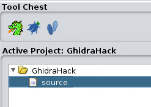


起動したら、右上の[File]から解析する実行ファイルを読み込みます。

適当な位置を右クリックして[Toggle Breakpoint]を選択すると、右側のBreakpointウィンドウに追加されます。

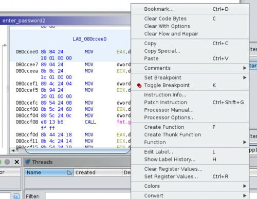

デバッガを実行するときは、[Debugger]から使用するデバッガを選択して呼び出せばOKです。

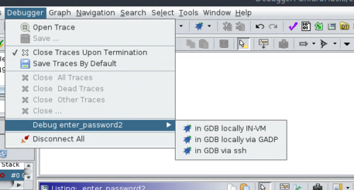


デバッガ機能のメジャーリリースが楽しみですね。

## セットアップが終わったら・・・

### ゴミを片づける

ゴミ掃除をしましょう。

Downloads配下に大量のファイルが残っているので、ちゃんと消しておきます。

また、ここまで.bashrcに追加してきたPATHも、一つにまとめて.bash_profileに入れてあげる方がスマートかと思います。

```bash
export PATH=$PATH:xxxxxxxxxx >> ~/.bash_profile
```

また、ここまでの内容では発生してないと思いますが、不要なコンテナイメージが残存している場合も考えられるので、Dockerしぐさとしてpruneを叩いておきます。

```bash
docker image prune
```

### スナップショットをとる

次にアップデートなどの更新作業を行うときは、できるだけセットアップ直後のクリーンな環境をベースにやりたいです。

なので、スナップショット（Hyper-Vならチェックポイント）は必ず設定します。

### イメージをエクスポートする

バックアップと環境保全をかねて、イメージをエクスポートします。

ここまでのセットアップ内容だと大体30GB弱くらいになると思います。

僕は64GBのUSBメモリにCTF用のParrotとWindows10のイメージを入れてます。

ギリギリ入ります。

## まとめ

とりあえず環境を再構築するついでに、構築手順の備忘録としてこの記事を書いてみました。

ぜひ、「こんな便利なツールあるよ！」などあればコメントいただけますと幸いです。

また、記載の内容についての質問事項などもあればぜひお気軽に。