「Hack The Box」という、ペネトレーションテストの学習プラットフォームを利用してセキュリティについて学んでいます。
「Hack The Box」のランクは、本記事執筆時点でProHackerです。


この記事では、HackTheBoxのマシン攻略を通して「EternalBlue」に関連した攻撃方法について勉強したことをまとめていきます。

社会的に大きな被害を与えた「EternalBlue」に関連した攻撃について理解すべく、勉強したことをまとめていきます。

「EternalBlue」は、世界中で猛威を奮ったランサムウェア「WannaCry」の拡散の要因となったことでも知られています。

<!-- omit in toc -->
## 本記事について

**本記事の内容は社会秩序に反する行為を推奨することを目的としたものではございません。**

自身の所有する環境、もしくは許可された環境以外への攻撃の試行は、「不正アクセス行為の禁止等に関する法律（不正アクセス禁止法）」に違反する可能性があること、予めご留意ください。

またすべての発言は所属団体ではなく個人に帰属します。

<!-- omit in toc -->
## もくじ
- [EternalBlueとは](#eternalblueとは)
- [EternalBlueのメカニズム](#eternalblueのメカニズム)
- [File ExtendedAttribute（拡張ファイル属性、FEA）とは](#file-extendedattribute拡張ファイル属性feaとは)
  - [srv!SrvOs2FeaListSizeToNt 関数](#srvsrvos2fealistsizetont-関数)
- [SMBプロトコルについて](#smbプロトコルについて)
- [EternalBlueの検証環境](#eternalblueの検証環境)
  - [ターゲットマシン（仮想マシン）](#ターゲットマシン仮想マシン)
  - [攻撃マシン（仮想マシン）](#攻撃マシン仮想マシン)
  - [デバッグマシン（ホスト）](#デバッグマシンホスト)
- [ターゲットマシンの準備](#ターゲットマシンの準備)
  - [カーネルモードデバッグの有効化](#カーネルモードデバッグの有効化)
  - [SMVv1の稼働確認](#smvv1の稼働確認)
- [WinDbgを利用したカーネルデバッグ](#windbgを利用したカーネルデバッグ)
  - [インストール](#インストール)
  - [WinDbgによるターゲットマシンへの接続](#windbgによるターゲットマシンへの接続)
- [脆弱性を悪用してリバースシェルを取得](#脆弱性を悪用してリバースシェルを取得)
- [WinDbgで、カーネルデバッグを実践](#windbgでカーネルデバッグを実践)
  - [悪用時の通信を追う](#悪用時の通信を追う)
  - [攻撃サーバからのSMB通信](#攻撃サーバからのsmb通信)
  - [バッファオーバーフロー時のカーネルデバッグ](#バッファオーバーフロー時のカーネルデバッグ)
- [まとめ](#まとめ)
- [参考](#参考)
  - [Book](#book)
  - [Web](#web)

### 本記事のテーマ

今回のテーマは、「EternalBlue」の再現を通して、脆弱性の詳細と悪用方法について学び、セキュリティ対策に活用することです。

## EternalBlueとは

EternalBlueは、Windows SMB1.0に存在したセキュリティ上の欠陥を利用した攻撃ツールを指します。

EternalBlueでは、「Windows SMB1.0（SMBv1）」の欠陥を悪用することで、攻撃者が任意のコードを実行できるようにします。

EternalBlueは、2017 年 3 月に公開された更新プログラム「MS17-010」によって解決されています。
参考：[マイクロソフト セキュリティ情報 MS17-010 - 緊急 | Microsoft Docs](https://docs.microsoft.com/ja-jp/security-updates/securitybulletins/2017/ms17-010)

EternalBlueは、世界中で猛威を振るったランサムウェア「WannaCry」に利用され、世界中で約230,000台ものコンピューターに被害を及ぼし、世界中で猛威を振るった「WannaCry」による被害額は、合計で40億ドルに及んだと推計されているようです。

日本国内でも、日立製作所など、多くの企業が被害にあっています。

参考：[ランサムウェア「WannaCry」 のすべて | カスペルスキー](https://www.kaspersky.co.jp/resource-center/threats/ransomware-wannacry)
参考：[日立は「WannaCry」被害から何を学んだのか、IoTセキュリティサービスに昇華：IoTセキュリティ（1/2 ページ） - MONOist](https://monoist.atmarkit.co.jp/mn/articles/1807/04/news042.html)

EternalBlueは、「Shadow Brokers」と呼ばれるハッカー集団が流出された攻撃ツールに含まれていました。
これらの攻撃ツールは米国のNSAから流出したものと言われているようですが、真偽は不明です。

また、インターネットで検索すると、EternalBlueを脆弱性としているページとEternalBlueを脆弱性としているページが混在していますが、ESETやTrendmiroのレポートから、EternalBlueは「MS17-010」に関連した脆弱性を悪用するエクスプロイトという認識が正しそうです。

参考：[One year later: EternalBlue exploit more popular now than during WannaCryptor outbreak | WeLiveSecurity](https://www.welivesecurity.com/2018/05/10/one-year-later-eternalblue-exploit-wannacryptor/)
参考：[トレンドマイクロ セキュリティブログ「WannaCry」を拡散させた脆弱性攻撃「EternalBlue」の仕組みを解説 | トレンドマイクロ セキュリティブログ](https://blog.trendmicro.co.jp/archives/15154)

興味深い点としては、EternalBlueが公に流出した時点ではすでに「MS17-010」のパッチが提供されていたことです。

参考：[Protecting customers and evaluating risk – Microsoft Security Response Center](https://msrc-blog.microsoft.com/2017/04/14/protecting-customers-and-evaluating-risk/)

脆弱性の修正パッチが提供されていたにも関わらず、EternalBlueは世界中で悪用されてしまいました。
また、[Avastの調査](https://press.avast.com/ja-jp/avast-wannacry)によると、「WannaCry」の流行後一年が経過しても、全世界のWindowsPCの29%にパッチが適用されておらず、脆弱性が残存していたようです。

Criticalな脆弱性に対するパッチを適用さえしていれば、自端末の感染、もしくは少なくとも感染拡大については抑制が可能であったことを考えると、教訓とすべき事例なのかもしれません。

## EternalBlueのメカニズム

さて、ではEternalBlueの攻撃メカニズムについて詳細を見ていきたいと思います。

EternalBlueは、「Windows SMB1.0（SMBv1）」のカーネル関数「srv!SrvOs2FeaListToNt」による「File ExtendedAttribute（拡張ファイル属性、FEA）」処理時に「Large Non-PagedPool（ラージ非ページプール）領域」のバッファオーバーフローを発生させる脆弱性です。

具体的には、カーネル関数「srv!SrvOs2FeaListToNt」にて、FEA（拡張ファイル属性） を「NTFEA（Windows NT FEA）」に変換する際、関数「srv!SrvOs2FeaListSizeToNt」を呼び出して FEA（拡張ファイル属性）リストのサイズを計算する際の不具合に起因したオーバーフローが発生します。

Trendmiroの調査によると、以下のフローでオーバーフローが発生するようです。

> 1.  関数「srv!SrvOs2FeaListSizeToNt」がFEA リストのサイズを計算し、受け取った FEA リストのサイズを更新する。
> 2.  この時、間違ったデータ型（WORD型、2 バイトの符号なし整数を扱う C 言語のデータ型）への型変換により、FEA のサイズが元の値より大きくなる。
> 3.  不正確なリストサイズにより、FEA リストを NTFEA リストに変換する繰り返し処理時、非ページプール上でオーバーフローが発生する。
>
> 引用：[トレンドマイクロ セキュリティブログ「WannaCry」を拡散させた脆弱性攻撃「EternalBlue」の仕組みを解説 | トレンドマイクロ セキュリティブログ](https://blog.trendmicro.co.jp/archives/15154)

## File ExtendedAttribute（拡張ファイル属性、FEA）とは

さて、EternalBuleで悪用される脆弱性を持つFEA（拡張ファイル属性）とはそもそも何でしょうか。

RFC8276によると、この拡張ファイル属性は、ファイルシステムによって解釈されない不透明なメタデータをファイルおよびディレクトリに関連付けるために提供されるもののようです。

つまり、ファイルシステムが解釈しないメタデータをユーザ側がファイルと紐づけることができる仕組みというイメージでしょうか。

一方で、ファイルの権限やatime、ctimeなどの属性は、通常の属性としてファイルシステムにより厳密に定義されているものとしてFEAとは区別されているようです。

参考：

- [拡張ファイル属性 - Wikipedia](https://ja.wikipedia.org/wiki/%E6%8B%A1%E5%BC%B5%E3%83%95%E3%82%A1%E3%82%A4%E3%83%AB%E5%B1%9E%E6%80%A7)
- [RFC 8276 - File System Extended Attributes in NFSv4 日本語訳](https://tex2e.github.io/rfc-translater/html/rfc8276.html)

### srv!SrvOs2FeaListSizeToNt 関数

EternalBuleでは、`srv!SrvOs2FeaListSizeToNt`関数が計算したFEAリストのサイズを処理した際に生じるバッファオーバーフローの脆弱性を悪用します。

`srv!SrvOs2FeaListSizeToNt`関数は、SMBプロトコルのためのカーネルドライバである`SRV.sys`に含まれる関数で、OS/2 FEAリストをNT FEAリスト変換するための機能を持っています。

参考：

- [Eternal Series — Part 1 | Eternal Blue and Analysis | Windows 7 and 8.1 Exploitation | Hack Windows 7 and 8.1 Remotely | by Abhijeet Singh | Medium](https://medium.com/@singhavijeet1994/eternal-series-part-1-eternal-blue-and-analysis-windows-7-and-8-1-c631572e549b)

## SMBプロトコルについて

EternalBuleで悪用される、`srv!SrvOs2FeaListSizeToNt`関数は、SMBプロトコルが利用する`SRV.sys`というカーネルドライバに存在することがわかりました。

しかし、そもそもSMBプロトコルとはなんでしょうか（知らない）。
よく名前は聞きますが、いまいち実態がつかめないプロトコルです。

SMBプロトコルは、**Windowsを中心とした環境において、ファイル共有やプリンタ共有などに使用される通信プロトコルの総称**、だそうです。

SMBプロトコルは、複数のプロトコル上で動作することが可能で、SMBv1はダイレクトホスティングSMBという機能により、ポート445を利用してTCP上で直接動作することも可能になりました。

**SMBプロトコルはもともと、OS/2ベースのファイルサーバーOSで動作していたファイルサーバのファイル共有用プロトコル**でしたが、Windows 3.xや9xからファイルサーバー機能が搭載されるようになったことで、一般的に利用されるようになりました。

`srv!SrvOs2FeaListSizeToNt`がOS/2 FEAリストをNT FEAリスト変換する処理を行っているのは、こういう歴史的な背景もありそうです。

参考：

- [Server Message Block - Wikipedia](https://ja.wikipedia.org/wiki/Server_Message_Block)
- [第7回　ファイル共有プロトコルSMBの概要：Windowsネットワークの基礎 - ＠IT](https://www.atmarkit.co.jp/ait/articles/1507/02/news026.html)
- [SMB プロトコルの説明](https://docs.oracle.com/cd/E19253-01/820-5121/gfhaq/index.html)

## EternalBlueの検証環境

さて、EternalBuleの悪用方法や環境についてのリサーチが大体できたところで、実際に攻撃手法を検証していきたいと思います。

今回はEternalBuleの検証のため、次の環境を準備しました。

### ターゲットマシン（仮想マシン）

- Windows7 64bit （IP:169.254.100.60）

  ```
  kd> vertarget
  
  Windows 7 Kernel Version 7601 (Service Pack 1) MP (1 procs) Free x64
  Built by: 7601.17514.amd64fre.win7sp1_rtm.101119-1850
  Machine Name:
  Kernel base = 0xfffff800`02e1f000 PsLoadedModuleList = 0xfffff800`03064e90
  Debug session time: Mon Apr 26 01:19:52.742 2021 (UTC + 9:00)
  System Uptime: 0 days 0:08:03.468
  ```

### 攻撃マシン（仮想マシン）

- Parrot OS（IP:169.254.100.10）
- WireShark

### デバッグマシン（ホスト）

- Windows 10 Pro 20H2
- Hyper-V
- WinDbg 10.0.19041.685 X86

## ターゲットマシンの準備

### カーネルモードデバッグの有効化

まずはターゲットマシンのWindows7にて、カーネルデバッグを有効にします。

今回のターゲットマシンはHyper-Vで構築した仮想マシンなので、デバッグのためのシリアルポートを名前付きパイプとして設定します。

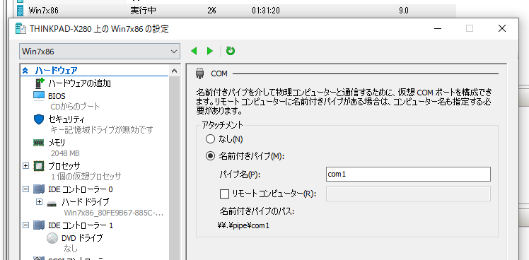

次に、ターゲットマシンにログインして、カーネルモードのデバッグを有効にします。

管理者権限で起動したコマンドプロンプトで以下のコマンドを実行することで有効化できます。

```cmd
bcdedit /debug on
bcdedit /dbgsettings serial debugport:1 baudrate:115200
shutdown /r /t 0
```

`Msconfig.exe`を起動して、詳細オプションからCOM1ポートを指定してデバッグを有効した後に再起動してもOKです。

### SMVv1の稼働確認

次に、ターゲットホストのWindows7にて、SMVv1が有効になっていることを確認します。

以下のコマンドの出力結果に、`DEPENDENCIES: MRxSmb10`存在するとSMB1.0が有効になっていると判断できます。

```cmd
sc.exe qc lanmanworkstation
```

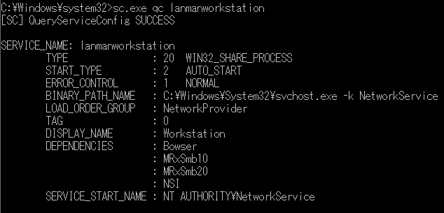

これでターゲットマシン側の準備は完了しました。

## WinDbgを利用したカーネルデバッグ

### インストール

ホスト側のWindows10にWinDbgをセットアップして、ターゲットマシンのカーネルデバッグを行います。

WinDbgは、Debugging Tools for Windowsに含まれるカーネルモードおよびユーザーモードのデバッガです。
WinDbgを利用することで、Windowsシステムドライバのデバッグも可能になります。

本記事執筆時点でWinDbgをセットアップする方法は、大きく以下の2通りあります。

1. Microsoft Storeから、Download WinDbg(Preview)のUWPアプリを入手する
2. [Windows 10 SDK](https://developer.microsoft.com/en-us/windows/downloads/windows-10-sdk/)から、Debugging Tools for Windowsが含まれるWindows SDKを入手する

参考：[Download Debugging Tools for Windows - WinDbg - Windows drivers | Microsoft Docs](https://docs.microsoft.com/en-us/windows-hardware/drivers/debugger/debugger-download-tools)

簡単なのはMicrosoft Storeから、プレビュービルドのWinDbgを入手する方法ですが、まだ正式リリース前ということもあり、不具合が多いためWindows SDKをインストールする方が無難に使用可能です。

Debugging Tools for Windowsのチェックボックスを有効化した状態でWindows SDKのインストールが完了すると、`C:\Program Files (x86)\Windows Kits\`というフォルダが作成されます。

WinDbgは、この中に含まれます。

今回のターゲットマシンは64bit版のWindow7なので、`C:\Program Files (x86)\Windows Kits\10\Debuggers\x64\`内にあるWinDbgを使用します。

### WinDbgによるターゲットマシンへの接続

ダウンロードした`C:\Program Files (x86)\Windows Kits\10\Debuggers\x64\`内のWinDbgを、**管理者権限で起動**します。

この際、一般ユーザ権限で起動すると、ターゲットマシンのカーネルデバッグ接続時に`Kernel debugger failed initialization, Win32 error 5 アクセス拒否されました`というエラーが発生して、カーネルデバッグに失敗するので注意してください。

WinDbgを管理者権限で起動したら、[File]>[Kernel Debug]を選択し、以下の画像のように名前付きパイプを利用してターゲットマシンに接続させます。

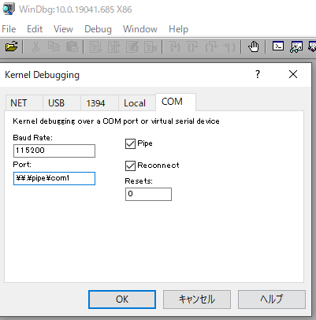

プロンプトが起動し、`dt nt!_*`を実行したときに以下のようにシンボルリストが出力されれば接続は成功です。

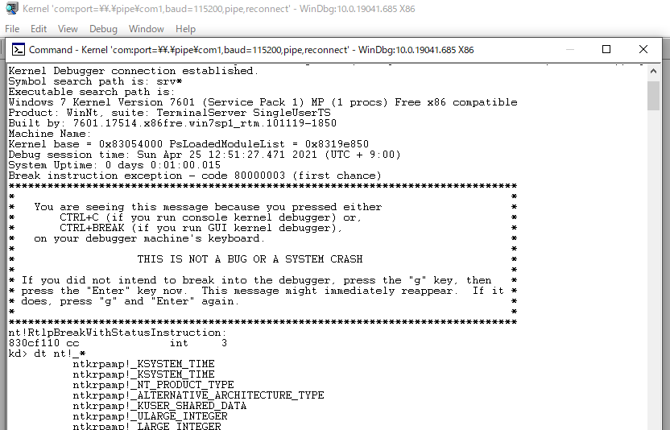

初回接続時にはまだターゲットマシンのカーネルが稼働しているため、Busy状態と表示され、コマンドが入力できない状態になっているかと思います。

WinDbgからコマンド操作ができるようにするためには、`Ctrl+Break(Breakキーがない場合は、Ctrl+Fn+Bなど)`か、Breakボタンをクリックします。

なお、カーネルデバッグ実行中は、ターゲットマシンの操作は不可能になるため、ターゲットマシンを再度操作する場合は、`F5`キーかGoボタンをクリックします。


## 脆弱性を悪用してリバースシェルを取得

カーネルドライバの動きを確認する準備ができたところで、さっそくEternalBuleの攻撃を再現していきます。

攻撃には、Metasploitの`windows/smb/ms17_010_eternalblue`を使用します。

攻撃サーバからエクスプロイトを実行すると、Root権限のシェルを取得することができました。

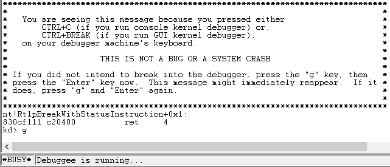

これで、今回構築した環境でEternalBuleの攻撃が再現できることが確認できました。

## WinDbgで、カーネルデバッグを実践

さて、それではいよいよエクスプロイト実行時のSRV.sysの動きをWinDbgで見てみます。

カーネルドライバのデバッグを行うので、[Windows ドライバーのデバッグ](https://docs.microsoft.com/ja-jp/windows-hardware/drivers/debugger/debug-universal-drivers---step-by-step-lab--echo-kernel-mode-)の手順を参考に進めました。

まずは、**デバッガーマークアップ言語 (DML) を有効**にした後に、コマンドリファレンスヘルプを表示します。

このヘルプが非常に役に立ちます。

```
kd> .prefer_dml 1
kd> .hh .prefer_dml
```

次に、読み込まれているカーネルモジュールの一覧を`lm`コマンドで表示します。

モジュールがいくつも表示されますが、この中から、今回のターゲットであるSRV.sysを特定します。
`Ctrl+f`で文字列検索ができます。

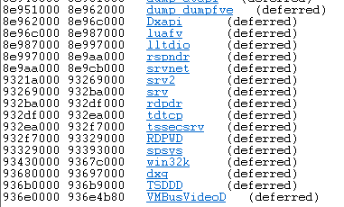

SRV.sysらしきものが見つかったので、クリックしてみると次のような詳細が表示されました。

```
kd> lmDvmsrv
Browse full module list
start    end        module name
93269000 932ba000   srv        (deferred)             
    Image path: \SystemRoot\System32\DRIVERS\srv.sys
    Image name: srv.sys
    Browse all global symbols  functions  data
    Timestamp:        Sat Nov 20 17:45:29 2010 (4CE78AA9)
    CheckSum:         0005542B
    ImageSize:        00051000
    Translations:     0000.04b0 0000.04e4 0409.04b0 0409.04e4
    Information from resource tables
```

どうやら`93269000`からのアドレスにSRV.sysが配置されているようです。

次に、SRV.sysの中から、問題のある関数のアドレスを特定していきます。
`srv!a*`コマンドを実行すると、SRV.sysの持つ関数がアルファベット別に表示されました。

脆弱性のある関数は`SrvOs2FeaListSizeToNt`ですが、問題の関数は`srv!SrvSmbOpen2`から呼び出されるため、まずは`srv!SrvSmbOpen2`のアドレスを特定しました。

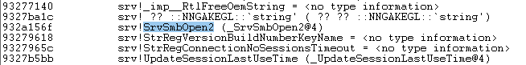

`932a156f `に`srv!SrvSmbOpen2`が配置されていることがわかったので、以下のコマンドで関数にブレークポイントを仕掛けます。

```
bp srv!SrvSmbOpen2
```

ブレークポイントは、`bl`コマンドか、Disassemblyウィンドウから確認可能です。

`Alt+Shift+7`キーでDisassemblyウィンドウを開くと、ブレークポイントが設定されたアドレスがハイライトされます。

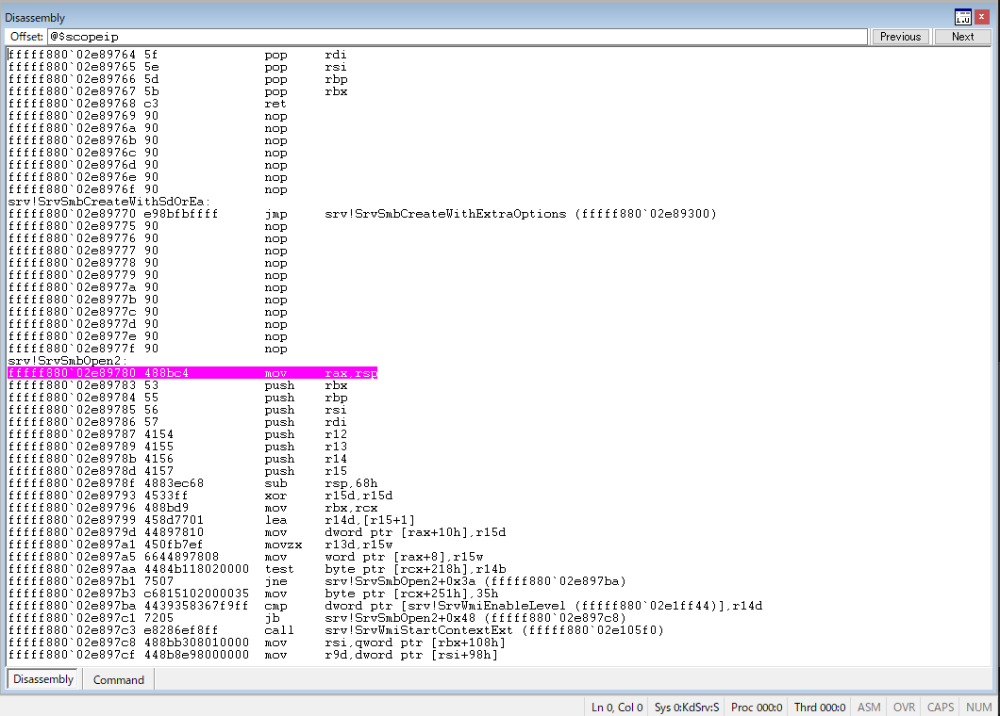

ここで、エクスプロイトを再実行すると、ブレークポイントに設定したカーネル関数が呼び出されたタイミングで、処理を停止し、デバッグモードに移行することが確認できました。

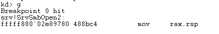

これで、WinDbgによるカーネルデバッグの準備は完了です。

### 悪用時の通信を追う

EternalBule攻撃時のメモリの動きを追う前に、どのような攻撃パケットが送り込まれているのか、通信の中身をのぞいてみようと思います。

### 攻撃サーバからのSMB通信

意外なことに、攻撃サーバから送り込まれてきたSMBパケットは40件程度と少なかったので、まずはここから見ていきます。

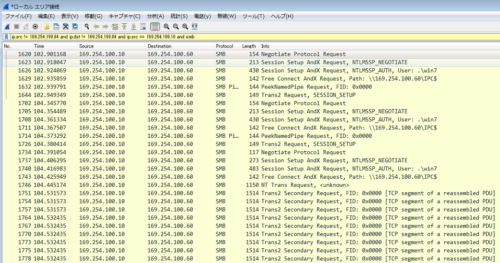

まず着目したのは、攻撃サーバからの不審な`NT Trans Request`です。

パケット情報を見ると、`Total Data Count`が`66512`に設定されています。
そして、SMBヘッダー直後のデータが`0x00010000`に設定され、それ以降大量のデータが連続して送信されています。

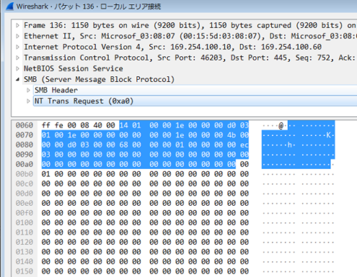

この値、`0x00010000`は、EternalBlueが悪用するバッファオーバーフロー脆弱性のポイントになる`SizeOfListInBytes`であり、それ以降の空のデータは加工されたFEAリストのようです。

この`SizeOfListInBytes`の情報から、SMB ドライバが FEA リストを NTFEA リストに変換する際に必要なメモリのバッファ領域を確保します。

このバッファ領域の確保のために、脆弱性を持つ`srv!SrvOs2FeaListSizeToNt`が呼び出されるようです。

参考：[Virus Bulletin :: EternalBlue: a prominent threat actor of 2017–2018](https://www.virusbulletin.com/virusbulletin/2018/06/eternalblue-prominent-threat-actor-20172018/)

次に、`Total Data Count`が`4096`である `Trans2 Secondary Request`が15回連続で送信されています。

これ、最初は何をしているのかさっぱりわからなかったのですが、どうやら脆弱性の悪用のために、先ほどの空のFEAレコードを605個送ったあと、加工された`0xf383 + 5`の大きさの606個目のFEAレコードと、`0xa8 + 5`の大きさの607個目のFEAレコードを送付する必要があるようです。

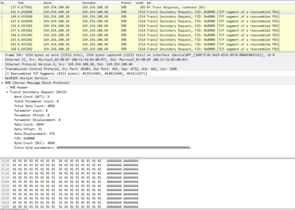

606個目のFEAレコードと、607個目のFEAレコードのサイズを合計すると、10進数で`62517`となり、ちょうど`4096`バイトのパケット15個分になりました。

ここで、607個目のFEAレコードが送信された時点で、`SizeOfListInBytes`で指定した`0x10000`の領域を超えて、次のメモリ領域である「SRVNET.sys」のプールを上書きすることでバッファオーバーフローが成立する流れのようです。

### バッファオーバーフロー時のカーネルデバッグ

では最後に、この607個目のレコードの送付によって、SRVNET バッファと SRVNET の一部が上書きされるところをカーネルデバッグで観察してみたいと思います。

ブレークポイントは、こんな感じで設定してみました。

```
bp srv!SrvOs2FeaToNt+04d “.printf \”MOV2: dst: %p src: %p size:%p\\n\”,ebx,eax,poi(esp+8);g;”

bp srv!SrvOs2FeaListToNt+0xd4
```

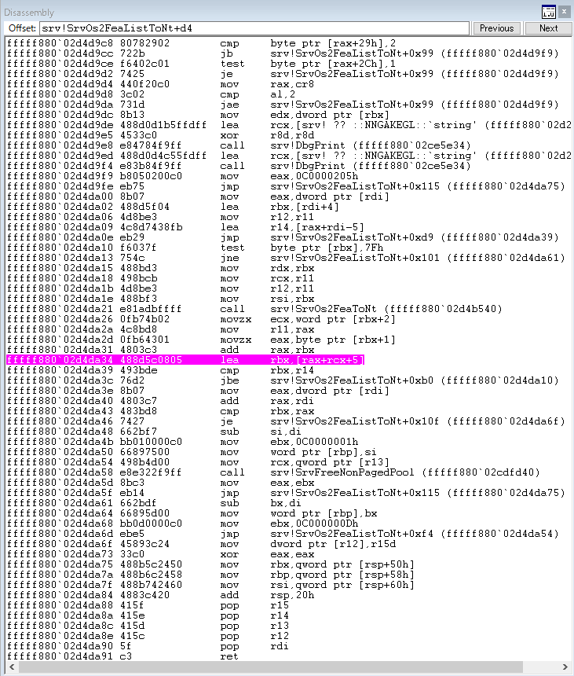

ブレークポイントで止まるタイミングで`dd`コマンドを使ってメモリの中身をのぞいてみると、0で埋まっています。

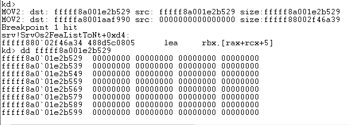

アドレスの番地も+5ずつ増えていることから、これが空のFEAレコードで埋められている部分と考えてよさそうです（多分）

これが605回続くと結構大変なので、一旦`srv!SrvOs2FeaListToNt+0xd4`のブレークポイントを解除して、関数終了前の`srv!SrvOs2FeaListToNt+0x120`に設定しなおしました。

そのまま最後までエクスプロイトを実行させたあと607回上記の処理が実行されたことを確認し、出力結果を取得しました。

最終的に607回目のレコードが`fffffa8001c9b000`という、ひとつ前のアドレスに`0xf383 + 0x5 + 0x5`した値からコピーされており、ここから607個目のFEAによるオーバーフローが実行されていそうです。

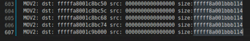

最後にこのアドレスから`+a8`内のメモリ情報を出力することで、オーバーフローによるエクスプロイトが成功したことを確認したかったのですが、いかんせんバイナリ列を見ても上書きが成功しているかどうかの判断がつかず、断念しました。。。

そのうちカーネルデバッグの知識が身についてから再トライしようと思います。

## まとめ

今回は、「EternalBlue」の再現を通して、脆弱性の詳細と悪用方法について学ぶことを目的に色々検証した結果についてまとめました。

Windowsのカーネルデバッグについては全くの初めてだったこともあり、手探りで進めたため結構時間がかかりました。

HackTheBoxのマシンを攻略するだけでなく、そこで利用した脆弱性について深堀りしてみることは非常に学びになるなと思います。

特に今回テーマにした「EternalBlue」は、MetasploitやExploitDBのコードを使うと簡単に再現できてしまうため、マシン攻略としての難易度は非常に低いのですが、脆弱性の詳細をちゃんと理解することは結構難しいと感じました。

脆弱性の深堀り記事は今後も書いていきたいと思います。
通信プロトコル系はまだちょっと難しいということを改めて実感したので、もっとライトに検証できるOSSなどから攻めてみようかと感じています。

## 参考

### Book

- [インサイド Windows 第7版](https://amzn.to/3nuJxo5)
- [Windows Sysinternals徹底解説](https://amzn.to/2RTn9J1)

### Web

- [トレンドマイクロ セキュリティブログ「WannaCry」を拡散させた脆弱性攻撃「EternalBlue」の仕組みを解説 | トレンドマイクロ セキュリティブログ](https://blog.trendmicro.co.jp/archives/15154)

- [One year later: EternalBlue exploit more popular now than during WannaCryptor outbreak | WeLiveSecurity](https://www.welivesecurity.com/2018/05/10/one-year-later-eternalblue-exploit-wannacryptor/)

- [マイクロソフト セキュリティ情報 MS17-010 - 緊急 | Microsoft Docs](https://docs.microsoft.com/ja-jp/security-updates/securitybulletins/2017/ms17-010)

- [NSAから流出のハッキングツール、米都市への攻撃に悪用の可能性 - ZDNet Japan](https://japan.zdnet.com/article/35137511/)

- [Protecting customers and evaluating risk – Microsoft Security Response Center](https://msrc-blog.microsoft.com/2017/04/14/protecting-customers-and-evaluating-risk/)

- [ランサムウェア「WannaCry」 のすべて | カスペルスキー](https://www.kaspersky.co.jp/resource-center/threats/ransomware-wannacry)

- [日立は「WannaCry」被害から何を学んだのか、IoTセキュリティサービスに昇華：IoTセキュリティ（1/2 ページ） - MONOist](https://monoist.atmarkit.co.jp/mn/articles/1807/04/news042.html)

- [Avast Press | Avast、WannaCry騒動から1年経っても 日本の約10％のPCが引き続き感染のリスクに さらされていることを公表](https://press.avast.com/ja-jp/avast-wannacry)

- [Microsoft Windows 7/8.1/2008 R2/2012 R2/2016 R2 - 'EternalBlue' SMB Remote Code Execution (MS17-010) - Windows remote Exploit](https://www.exploit-db.com/exploits/42315)

- [Download Debugging Tools for Windows - WinDbg - Windows drivers | Microsoft Docs](https://docs.microsoft.com/en-us/windows-hardware/drivers/debugger/debugger-download-tools)

- [Windows ドライバーのデバッグ-ステップバイステップラボ (Echo カーネルモード) - Windows drivers | Microsoft Docs](https://docs.microsoft.com/ja-jp/windows-hardware/drivers/debugger/debug-universal-drivers---step-by-step-lab--echo-kernel-mode-#kernelmodedebuggingcommandsandtechniques)

- [u, ub, uu (Unassemble) - Windows drivers | Microsoft Docs](https://docs.microsoft.com/en-us/windows-hardware/drivers/debugger/u--unassemble-)

- [RFC 8276 - File System Extended Attributes in NFSv4 日本語訳](https://tex2e.github.io/rfc-translater/html/rfc8276.html)

- [拡張ファイル属性 - Wikipedia](https://ja.wikipedia.org/wiki/%E6%8B%A1%E5%BC%B5%E3%83%95%E3%82%A1%E3%82%A4%E3%83%AB%E5%B1%9E%E6%80%A7)

- [Eternal Series — Part 1 | Eternal Blue and Analysis | Windows 7 and 8.1 Exploitation | Hack Windows 7 and 8.1 Remotely | by Abhijeet Singh | Medium](https://medium.com/@singhavijeet1994/eternal-series-part-1-eternal-blue-and-analysis-windows-7-and-8-1-c631572e549b)

- [Server Message Block - Wikipedia](https://ja.wikipedia.org/wiki/Server_Message_Block)

- [第7回　ファイル共有プロトコルSMBの概要：Windowsネットワークの基礎 - ＠IT](https://www.atmarkit.co.jp/ait/articles/1507/02/news026.html)

- [SMB プロトコルの説明](https://docs.oracle.com/cd/E19253-01/820-5121/gfhaq/index.html)

- [Microsoft Windows 7/8.1/2008 R2/2012 R2/2016 R2 - 'EternalBlue' SMB Remote Code Execution (MS17-010) - Windows remote Exploit](https://www.exploit-db.com/exploits/42315)

- [MS17-010/mysmb.py at master · worawit/MS17-010](https://github.com/worawit/MS17-010/blob/master/mysmb.py)

- [Windows ドライバーのデバッグ-ステップバイステップラボ (Echo カーネルモード) - Windows drivers | Microsoft Docs](https://docs.microsoft.com/ja-jp/windows-hardware/drivers/debugger/debug-universal-drivers---step-by-step-lab--echo-kernel-mode-)

- [WinDbg でのアセンブリ コードのデバッグ - Windows drivers | Microsoft Docs](https://docs.microsoft.com/ja-jp/windows-hardware/drivers/debugger/disassembly-window)

- [EternalBlue – Everything There Is To Know](https://research.checkpoint.com/2017/eternalblue-everything-know/)

- [Virus Bulletin :: EternalBlue: a prominent threat actor of 2017–2018](https://www.virusbulletin.com/virusbulletin/2018/06/eternalblue-prominent-threat-actor-20172018/)

  
