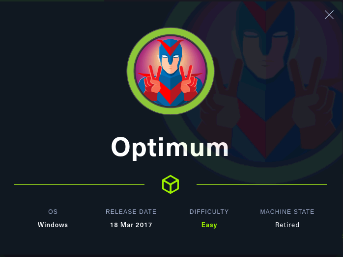

「Hack The Box」という、ペネトレーションテストの学習プラットフォームを利用してセキュリティについて学んでいます。
「Hack The Box」のランクは、本記事執筆時点でProHackerです。


今回は、HackTheBoxのリタイアマシン「Optimum」のWriteUpです。



### 記事について

**本記事の内容は社会秩序に反する行為を推奨することを目的としたものではございません。**

自身の所有する環境、もしくは許可された環境以外への攻撃の試行は、「不正アクセス行為の禁止等に関する法律（不正アクセス禁止法）」に違反する可能性があること、予めご留意ください。

またすべての発言は所属団体ではなく個人に帰属します。

<!-- omit in toc -->
## もくじ
- [探索](#探索)
- [脆弱性について](#脆弱性について)
- [内部探索](#内部探索)
  - [MS16-032](#ms16-032)
  - [MS16-034](#ms16-034)
  - [MS16-135](#ms16-135)
- [PowerShellのセッション](#powershellのセッション)
- [まとめ](#まとめ)


## 探索

とりあえずいつも通りNmapのスキャンをかけました。

``` bash
Starting Nmap 7.92 ( https://nmap.org ) at 2021-10-27 20:22 JST
Nmap scan report for 10.10.10.8
Host is up (0.30s latency).
Not shown: 999 filtered tcp ports (no-response)
PORT   STATE SERVICE VERSION
80/tcp open  http    HttpFileServer httpd 2.3
|_http-title: HFS /
|_http-server-header: HFS 2.3
Service Info: OS: Windows; CPE: cpe:/o:microsoft:windows

Service detection performed. Please report any incorrect results at https://nmap.org/submit/ .
Nmap done: 1 IP address (1 host up) scanned in 42.09 seconds
```

どうやら、`HttpFileServer httpd 2.3`というアプリケーションが稼働しているようです。

ググったらすぐにエクスプロイトコードが出てきました。

参考：[HFS (HTTP File Server) 2.3.x - Remote Command Execution (3) - Windows remote Exploit](https://www.exploit-db.com/exploits/49584)

これをそのまま使えばリバースシェルが取得できます。

## 脆弱性について

このエクスプロイトコードで悪用している脆弱性は[CVE-2014-6287](https://cve.mitre.org/cgi-bin/cvename.cgi?name=CVE-2014-6287)でした。

> The findMacroMarker function in parserLib.pas in Rejetto HTTP File Server (aks HFS or HttpFileServer) 2.3x before 2.3c allows remote attackers to execute arbitrary programs via a %00 sequence in a search action.

`%00`を検索ボックスに入れると任意のコード実行ができる模様。

脆弱性のカテゴリとしては、[CWE-158: Improper Neutralization of Null Byte or NUL Character](http://cwe.mitre.org/data/definitions/158.html)に該当します。

このケースでは、`parserLib.pas `の正規表現にNULLバイトを処理しない問題が存在しており、検索ボックスに`%00`が入力された場合、それに続くコマンドが実行されてしまうという脆弱性でした。

この脆弱性を悪用することでリバースシェルが取得できました。

## 内部探索

とりあえずwinpeasを実行しました。

``` powershell
Basic System Information
Check if the Windows versions is vulnerable to some known exploit https://book.hacktricks.xyz/windows/windows-local-privilege-escalation#kernel-exploits
    Hostname: optimum
    ProductName: Windows Server 2012 R2 Standard
    EditionID: ServerStandard
    ReleaseId: 
    BuildBranch: 
    CurrentMajorVersionNumber: 
    CurrentVersion: 6.3
    Architecture: AMD64
    ProcessorCount: 2
    SystemLang: en-US
    KeyboardLang: English (United States)
    TimeZone: (UTC+02:00) Athens, Bucharest
    IsVirtualMachine: True
    Current Time: 3/11/2021 1:02:07 ??
    HighIntegrity: False
    PartOfDomain: False
    Hotfixes: KB2959936, KB2896496, KB2919355, KB2920189, KB2928120, KB2931358, KB2931366, KB2933826, KB2938772, KB2949621, KB2954879, KB2958262, KB2958263, KB2961072, KB2965500, KB2966407, KB2967917, KB2971203, KB2971850, KB2973351, KB2973448, KB2975061, KB2976627, KB2977629, KB2981580, KB2987107, KB2989647, KB2998527, KB3000850, KB3003057, KB3014442, 

  [?] Windows vulns search powered by Watson(https://github.com/rasta-mouse/Watson)
```

64bitのWindowsServer2012 R2であることがわかりました。

Watsonによる脆弱性検索はWindowsServer 2016以降でしか動作しないので、`Sherlock`を使って探索します。

この3つの脆弱性の影響下にあることが確認できました。

```powershell
Title      : Secondary Logon Handle
MSBulletin : MS16-032
CVEID      : 2016-0099
Link       : https://www.exploit-db.com/exploits/39719/
VulnStatus : Appears Vulnerable

Title      : Windows Kernel-Mode Drivers EoP
MSBulletin : MS16-034
CVEID      : 2016-0093/94/95/96
Link       : https://github.com/SecWiki/windows-kernel-exploits/tree/master/MS16-034?
VulnStatus : Appears Vulnerable

Title      : Win32k Elevation of Privilege
MSBulletin : MS16-135
CVEID      : 2016-7255
Link       : https://github.com/FuzzySecurity/PSKernel-Primitives/tree/master/Sample-Exploits/MS16-135
VulnStatus : Appears Vulnerable
```

### MS16-032

Secondary Logon がメモリ内の要求ハンドルを適切に管理しない脆弱性であり、管理者権限での任意のコード実行ができます。

参考：[Microsoft Security Bulletin MS16-032 - Important | Microsoft Docs](https://docs.microsoft.com/en-us/security-updates/securitybulletins/2016/ms16-032)

「Secondary Logon」とは、別の資格情報でプロセスの開始を有効にするサービスで、「別のユーザとして実行する」機能で利用するサービスです。

### MS16-034

Windowsのカーネルモードドライバのメモリ内のオブジェクト管理の脆弱性で、任意のコード実行が可能になるそう。

参考：[マイクロソフト セキュリティ情報 MS16-034  | Microsoft Docs](https://docs.microsoft.com/ja-jp/security-updates/securitybulletins/2016/ms16-034)

エクスプロイトは[これ](https://github.com/kash1064/windows-kernel-exploits/blob/master/MS16-034/MS16-034-exp.cpp)。

### MS16-135

ASLRの回避につながるカーネル内の情報が漏洩する脆弱性のようです。

参考：[マイクロソフト セキュリティ情報 MS16-135 | Microsoft Docs](https://docs.microsoft.com/ja-jp/security-updates/securitybulletins/2016/ms16-135)

## PowerShellのセッション

MS16-032とMS16-034が管理者権限でのRCEが可能な脆弱性なので、このどちらかを使っていきます。

エクスプロイトコードを探したときに、MS16-032のPowerShellから実行できるスクリプトが見つかったので、こちらを利用していきます。

まず。MS16-032は、64bitプロセスでしか悪用できません。

そのため、リバースシェルを取得しているプロセスについても64bitである必要があります。

現在稼働しているプロセスが64プロセスかどうかは、.NETコマンドを使って簡単に特定することができます。

``` powershell
[Environment]::Is64BitProcess
```

参考：[Environment.Is64BitProcess Property (System) | Microsoft Docs](https://docs.microsoft.com/en-us/dotnet/api/system.environment.is64bitprocess?view=net-5.0)

64bitと32bitのPowerShellのパスは以下の通りなので、覚えておくと何かの役に立つかも。

- 64bit PowerShell : `C:\Windows\System32\WindowsPowerShell\v1.0\powershell.exe`
- 32bit PowerShell : `C:\Windows\SysWOW64\WindowsPowerShell\v1.0\powershell.exe`

以下の表は、CPU/OS/アプリケーションのbit数と実行されるプロセスのbit数の組み合わせです。

|                        | CPU   | OS    | プロセス   |
| ---------------------- | ----- | ----- | ---------- |
| 32bit CPU              | 32bit | 32bit | 32bit      |
| 32bit OS               | 64bit | 32bit | 32bit      |
| 32bit アプリケーション | 64bit | 64bit | 32bit(WOW) |
| 64bit アプリケーション | 64bit | 64bit | 64bit      |

今回は、CPUとOSのアーキテクチャは64bitですが、32bitのPowerShellを実行すると、プロセスも32bitになってしまいます。

というわけで、64bitプロセスのリバースシェルを取った状態でMS16-032のエクスプロイトをぶっぱなすとrootが取得できました。

## まとめ

ハッキングを真面目に勉強しようと思ったので、とりあえずリタイアマシンを解きまくっていきます。

