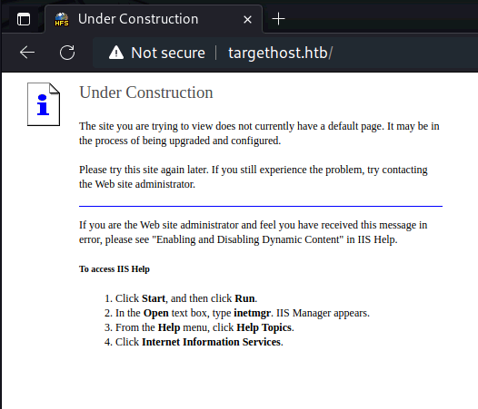
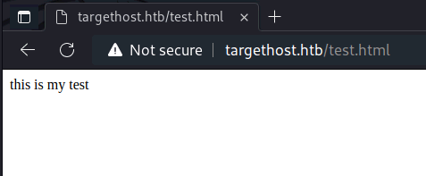

「Hack The Box」という、ペネトレーションテストの学習プラットフォームを利用してセキュリティについて学んでいます。
「Hack The Box」のランクは、本記事執筆時点でProHackerです。


今回は、HackTheBoxのリタイアマシン「Granny」のWriteUpです。

## 本記事について

**本記事の内容は社会秩序に反する行為を推奨することを目的としたものではございません。**

自身の所有する環境、もしくは許可された環境以外への攻撃の試行は、「不正アクセス行為の禁止等に関する法律（不正アクセス禁止法）」に違反する可能性があること、予めご留意ください。

またすべての発言は所属団体ではなく個人に帰属します。

<!-- omit in toc -->

## もくじ


## 探索

とりあえずいつも通りポートスキャン。

``` bash
$ sudo sed -i 's/^[0-9].*targethost.htb/10.10.10.15  targethost.htb/g' /etc/hosts
$ nmap -sV -sC -T4 targethost.htb| tee nmap1.txt
Starting Nmap 7.92 ( https://nmap.org ) at 2022-07-23 17:48 PDT
Nmap scan report for targethost.htb (10.10.10.15)
Host is up (0.25s latency).
Not shown: 999 filtered tcp ports (no-response)
PORT   STATE SERVICE VERSION
80/tcp open  http    Microsoft IIS httpd 6.0
|_http-server-header: Microsoft-IIS/6.0
|_http-title: Under Construction
| http-webdav-scan: 
|   Server Type: Microsoft-IIS/6.0
|   Public Options: OPTIONS, TRACE, GET, HEAD, DELETE, PUT, POST, COPY, MOVE, MKCOL, PROPFIND, PROPPATCH, LOCK, UNLOCK, SEARCH
|   Server Date: Sun, 24 Jul 2022 00:49:07 GMT
|   WebDAV type: Unknown
|_  Allowed Methods: OPTIONS, TRACE, GET, HEAD, DELETE, COPY, MOVE, PROPFIND, PROPPATCH, SEARCH, MKCOL, LOCK, UNLOCK
| http-methods: 
|_  Potentially risky methods: TRACE DELETE COPY MOVE PROPFIND PROPPATCH SEARCH MKCOL LOCK UNLOCK PUT
Service Info: OS: Windows; CPE: cpe:/o:microsoft:windows

Service detection performed. Please report any incorrect results at https://nmap.org/submit/ .
Nmap done: 1 IP address (1 host up) scanned in 27.76 seconds
```

80番ポートでIISが稼働しているようです。

アクセスしてみたところ、工事中のようです。



裏でgobuster回しつつ、探索を進めていきます。

また、ポートスキャンの結果では`WebDAV type: Unknown`とでているので、WebDavが動いているかも確認してみます。

``` bash
$ /usr/bin/davtest -url http://targethost.htb/
********************************************************
 Testing DAV connection
OPEN            SUCCEED:                http://targethost.htb
********************************************************
NOTE    Random string for this session: iEypK6GgIZG
********************************************************
 Creating directory
MKCOL           SUCCEED:                Created http://targethost.htb/DavTestDir_iEypK6GgIZG
********************************************************
 Sending test files
PUT     aspx    FAIL
PUT     cfm     SUCCEED:        http://targethost.htb/DavTestDir_iEypK6GgIZG/davtest_iEypK6GgIZG.cfm
PUT     php     SUCCEED:        http://targethost.htb/DavTestDir_iEypK6GgIZG/davtest_iEypK6GgIZG.php
PUT     asp     FAIL
PUT     pl      SUCCEED:        http://targethost.htb/DavTestDir_iEypK6GgIZG/davtest_iEypK6GgIZG.pl
PUT     shtml   FAIL
PUT     jsp     SUCCEED:        http://targethost.htb/DavTestDir_iEypK6GgIZG/davtest_iEypK6GgIZG.jsp
PUT     jhtml   SUCCEED:        http://targethost.htb/DavTestDir_iEypK6GgIZG/davtest_iEypK6GgIZG.jhtml
PUT     html    SUCCEED:        http://targethost.htb/DavTestDir_iEypK6GgIZG/davtest_iEypK6GgIZG.html
PUT     txt     SUCCEED:        http://targethost.htb/DavTestDir_iEypK6GgIZG/davtest_iEypK6GgIZG.txt
PUT     cgi     FAIL
********************************************************
 Checking for test file execution
EXEC    cfm     FAIL
EXEC    php     FAIL
EXEC    pl      FAIL
EXEC    jsp     FAIL
EXEC    jhtml   FAIL
EXEC    html    SUCCEED:        http://targethost.htb/DavTestDir_iEypK6GgIZG/davtest_iEypK6GgIZG.html
EXEC    txt     SUCCEED:        http://targethost.htb/DavTestDir_iEypK6GgIZG/davtest_iEypK6GgIZG.txt

********************************************************
/usr/bin/davtest Summary:
Created: http://targethost.htb/DavTestDir_iEypK6GgIZG
PUT File: http://targethost.htb/DavTestDir_iEypK6GgIZG/davtest_iEypK6GgIZG.cfm
PUT File: http://targethost.htb/DavTestDir_iEypK6GgIZG/davtest_iEypK6GgIZG.php
PUT File: http://targethost.htb/DavTestDir_iEypK6GgIZG/davtest_iEypK6GgIZG.pl
PUT File: http://targethost.htb/DavTestDir_iEypK6GgIZG/davtest_iEypK6GgIZG.jsp
PUT File: http://targethost.htb/DavTestDir_iEypK6GgIZG/davtest_iEypK6GgIZG.jhtml                    
PUT File: http://targethost.htb/DavTestDir_iEypK6GgIZG/davtest_iEypK6GgIZG.html   
PUT File: http://targethost.htb/DavTestDir_iEypK6GgIZG/davtest_iEypK6GgIZG.txt                      
Executes: http://targethost.htb/DavTestDir_iEypK6GgIZG/davtest_iEypK6GgIZG.html                       
Executes: http://targethost.htb/DavTestDir_iEypK6GgIZG/davtest_iEypK6GgIZG.txt 
```

いくつかPUTが使えそうでしたそうでした。

実際に、適当に作成したHTMLファイルをアップロードしたところ、ブラウザ経由で参照できることを確認しました。

``` bash
$ curl -T test.html http://targethost.htb
```



