これからAzureで遊んでいこうと思っているわけですが、まずは前から興味のあった[T-Pot](https://github.com/telekom-security/tpotce)というハニーポットを植えてみたいと思います。

[サイバー攻撃の足跡を分析する ハニーポット観察記録 [ハニーポット観察記録]](https://amzn.to/34tqh58)という本を読んでからずっとやりたいと思っていたのですが、リスクやコスト面からなかなか実施に踏み切れずにいました。

今回はAzureを使うといい感じにできそうということになったので、Azure環境上でT-Potを構築していきます。

色々手探りですが安全第一で進めていきます。

当方初心者につき、本記事の内容は必ずしもベストプラクティスにはなっていないと思いますので、改善点があり次第追加していこうと思います。

## 記事について

**本記事の内容は社会秩序に反する行為を推奨することを目的としたものではございません。**

自身の所有する環境、もしくは許可された環境以外への攻撃の試行は、「不正アクセス行為の禁止等に関する法律（不正アクセス禁止法）」に違反する可能性があること、予めご留意ください。

またすべての発言は所属団体ではなく個人に帰属します。

<!-- omit in toc -->
## もくじ
- [記事について](#記事について)
- [事前に決めたこと&確認したこと](#事前に決めたこと確認したこと)
- [警察のお世話にならないようにする](#警察のお世話にならないようにする)
  - [マルウェア、不正プログラムを取得・保持しない](#マルウェア不正プログラムを取得保持しない)
  - [24*7稼働ではなく、任意に起動した時間以外は自動的にシャットダウンされるようにする](#247稼働ではなく任意に起動した時間以外は自動的にシャットダウンされるようにする)
  - [ホストのセキュリティ対策を十全にする](#ホストのセキュリティ対策を十全にする)
  - [ホストの稼働状況について監視と通知のシステムを構築する](#ホストの稼働状況について監視と通知のシステムを構築する)
  - [ハニーポットへの接続にはAzureで構築した踏み台のマシンを使う](#ハニーポットへの接続にはazureで構築した踏み台のマシンを使う)
  - [踏み台サーバに関する追記](#踏み台サーバに関する追記)
- [Azureの規約を守る](#azureの規約を守る)
  - [禁止事項](#禁止事項)
  - [許可されていること](#許可されていること)
- [Azureに仮想マシンを構築する](#azureに仮想マシンを構築する)
  - [ハニーポット環境用のリソースグループの作成](#ハニーポット環境用のリソースグループの作成)
  - [ハニーポットマシンに適用するセキュリティグループの作成](#ハニーポットマシンに適用するセキュリティグループの作成)
  - [ハニーポットマシンの仮想ネットワークの作成](#ハニーポットマシンの仮想ネットワークの作成)
  - [仮想マシンの作成](#仮想マシンの作成)
  - [ハニーポットマシン](#ハニーポットマシン)
  - [踏み台サーバ](#踏み台サーバ)
  - [踏み台サーバのサイズについて(追記)](#踏み台サーバのサイズについて追記)
  - [環境のセットアップ](#環境のセットアップ)
  - [DNS名の構成](#dns名の構成)
- [Azure Sentinelの構築](#azure-sentinelの構築)
  - [踏み台サーバにLinux Agentをインストールする](#踏み台サーバにlinux-agentをインストールする)
  - [踏み台サーバの514ポート待ち受けを有効化する](#踏み台サーバの514ポート待ち受けを有効化する)
  - [Cloud OneのSyslogイベントをハニーポットマシンから踏み台サーバに転送するように構成する](#cloud-oneのsyslogイベントをハニーポットマシンから踏み台サーバに転送するように構成する)
- [補足：ハニーポットマシンのディスク拡張](#補足ハニーポットマシンのディスク拡張)
- [スナップショットの作成](#スナップショットの作成)
- [T-Potのインストール](#t-potのインストール)
  - [Dockerユーザの追加](#dockerユーザの追加)
  - [SSHダイナミックフォワーディングで踏み台経由でT-Potに接続](#sshダイナミックフォワーディングで踏み台経由でt-potに接続)
- [まとめ](#まとめ)
- [参考書籍](#参考書籍)

## 事前に決めたこと&確認したこと

とりあえずAzureでハニーポット環境を作るにあたって以下の2点について事前に決定&確認を行いました

- 警察のお世話にならないようにする
- Azureの規約を守る

特に上記の2点に気を付けてやっていこうと思います。

## 警察のお世話にならないようにする

何よりもこれを重視してます笑

普通に警察に逮捕・勾留、またはコインハイブ事件やWizard Bible事件みたいに略式起訴されたら、PCが押収されたり仕事ができなくなったりして詰む感じですね。

実際に自分に全く罪はなくても、警察側の誤解で家宅捜索されたりする負けイベントが発生する場合もあるらしいので無理ゲーですが、できる対策は可能な限り取っていきたいと思います。

参考：[逮捕にそなえる人生継続計画 - やしお](https://yashio.hatenablog.com/entry/20220208/1644325200)

他の例でも、「レンタルサーバで運営していたサイトがクラッキングされた結果、警察の家宅捜索が入った」とか、詐欺サイトが運営されていたレンタルサーバの管理者が事情聴取されたとか、結構怖い話がちらほらあります。

正直日本で生活している人間が、個人的にセキュリティ関連の活動をするのは結構リスクがあると考えてます。

(それもあってずっとハニーポット建てるの避けてました。)

とはいえやることに決めた以上はできるだけリスクを避けられる運用に取り組んでいこうと思います。

具体的には、環境を建てることにした2022/02/09時点では以下の点を想定しています。

- マルウェア、不正プログラムを取得・保持しない
- 24*7稼働ではなく、任意に起動した時間以外は自動的にシャットダウンされるようにする
- ホストのセキュリティ対策を十全にする
- ホストの稼働状況について監視と通知のシステムを構築する
- ハニーポットへの接続にはAzureで構築した踏み台のマシンを使う

### マルウェア、不正プログラムを取得・保持しない

そもそも[T-Pot](https://github.com/telekom-security/tpotce)は、ざっくり言うと様々なハニーポットを動かすことができるツールです。

この中には、マルウェア収集を目的としたハニーポットもあります。

参考：[ハニーポット is 何？実際に作って触ってみる 構築編 | SIOS Tech. Lab](https://tech-lab.sios.jp/archives/26325)

今回は、このマルウェア収集を目的としたハニーポットは当面使用せずに運用しようと思います。

というのも、[不正指令電磁的記録に関する罪](https://www.keishicho.metro.tokyo.lg.jp/kurashi/cyber/law/virus.html)に引っかかるのが怖いからです。

この法律ですが、「悪用目的での」マルウェアの保持を禁止する法律ではあるのですが、残念ながらこの基準はかなりあいまいな現状があるようです。

> ウイルスの取得・保管罪とは
>
> 正当な理由がないのに、その使用者の意図とは無関係に勝手に実行されるようにする目的で、コンピュータ・ウイルスやコンピュータ・ウイルスのソースコードを取得、保管する行為をいいます。

参考：[不正指令電磁的記録に関する罪　警視庁](https://www.keishicho.metro.tokyo.lg.jp/kurashi/cyber/law/virus.html)

下記サイトには、[@it_giron](https://twitter.com/it_giron)さんが各県警に「不正指令電磁的記録に関する罪」の構成要件について開示請求を行った結果がまとまっており、非常に参考になります。

参考：[「不正指令電磁的記録に関する罪」 各都道府県警への構成要件等の開示請求状況 | IT議論](https://it-giron.com/262)

### 24*7稼働ではなく、任意に起動した時間以外は自動的にシャットダウンされるようにする

当面は、Azureの自動シャットダウン機能を用いてハニーポットのマシンを夜間は停止して運用していこうと思います。

ある程度運用が確立してきたら稼働時間を延ばしていこうと思います。

### ホストのセキュリティ対策を十全にする

たぶんここが一番リスクが大きいように感じます。

何かの理由でハニーポットが侵害されてBOT化した場合、他のユーザに対して攻撃を行ったり、不正なファイルの中継サーバになる可能性があります。

これを防ぐために、セキュリティ対策と監視の仕組みを作っていきたいと思ってます。

とりあえずハニーポットを構築するマシンでは、[Trend Micro Cloud One Workload Security](https://www.trendmicro.com/ja_jp/business/products/hybrid-cloud/cloud-one-workload-security.html)のAgentをインストールします。

このセキュリティソフトですが、最大5台まで無料で管理でき、かつアンチマルウェアやホスト型IDS、重要ファイルの変更監視、アプリケーションのホワイトリスト運用などができます。

（また、前の仕事で使ったことがあり、個人的に運用に精通しているという理由もあります）

※ 以下追記

なんと、2022/01/31よりライセンス方式が変更になり、5台までの無料利用ができなくなってしまったようです。。

悲しい。

参考：["Free - 5 Computers" End of Support for Trend Micro Cloud One - Workload Security and Deep Security as a Service](https://community-trendmicro.force.com/solution/000290385)

近いうちにOSSのEDRツールあたりに切り替えようと思います。

### ホストの稼働状況について監視と通知のシステムを構築する

ホストの稼働状況について監視と稼働をちゃんとやっていこうと思います。

各種ログやイベントをSlackかDiscordに転送します。

また、コスト面については、SMSとメール通知を実施しています。

コストのアラート設定については以下の記事でまとめました。

参考：[Azure Active Directory の ID セキュリティスコアを確認してみる](/azure-setup-on-money)


<!-- ### アウトバウンド通信の制御

もし万が一ハニーポットのホストがBOT化されてしまった場合のために、セキュリティグループでアウトバウンド通信を制御しておこうと思います。

なお、恐らくすべてのアウトバウンド通信をブロックするとハンドシェイクもできなくなるので、0-1023までの範囲のポートへのアウトバウンド通信のみを制御ます。

これならもし何か問題が起きた場合でも、他のサービスに対してハニーポットマシン側から自発的に攻撃を仕掛けるリスクは最小化できるかと思います。

なお、後述する Cloud One の管理マネージャとの接続やSyslogの転送など、必要なアウトバウンド通信は明示的に許可しておく必要があります。 -->


### ハニーポットへの接続にはAzureで構築した踏み台のマシンを使う

一応今回はマルウェアは収集しない予定ですのでそこまでリスクはないかと思いますが、うっかり自分の環境にハニーポット上の悪いものを落としてこないように、ハニーポットへの接続は踏み台経由になるようにしておきます。

### 踏み台サーバに関する追記

踏み台サーバ経由のアクセスのために踏み台用の仮想マシンを作成してSSHポートフォワーディングでアクセスさせたものの、非常に通信が不安定になりました。

恐らく踏み台マシンが1vCPU / 1 RAMのスペックであるせいかとは思うのですが、踏み台サーバのスペックを上げるのはコスト的に厳しいこともあり、最終的にプライベートマシン上に建てた仮想マシンからT-Potマシンにアクセスさせることにしました。

Azure上の踏み台サーバは、Sentinel Agentを動かすSyslogサーバ兼、ハニーポットの監視ツールや通知プログラムを動かす用途に使おうと思います。

なお、T-Potコンソールへのアクセスは、自宅のグローバルIPアドレスで絞りました。

## Azureの規約を守る

今回はAzureにハニーポットを建てるので規約を確認しておきました。

AzureのQ&Aサイトを見ると、特にハニーポットの運用は禁止されていないようです。

参考：[Deployed tpot on azure VM - Microsoft Q&A](https://docs.microsoft.com/en-us/answers/questions/318375/deployed-tpot-on-azure-vm.html)

参考：[ハニーポットの運用が規約違反でないか調べてみた#2 - くろひょうのぶろぐ](https://blackle0pard.net/wxn7jq/)

ただし、以下の行為は禁止されているため、これらに該当しないように注意する必要があります。

いずれの場合も、影響範囲が自分の環境のみであれば問題なく、他のユーザやAzureそのものへの攻撃がNGになるようです。

### 禁止事項

- 他のマイクロソフトクラウドのお客様が所有する資産をスキャンまたはテストすること。
- 完全に自分自身のものではないデータにアクセスすること。
- あらゆる種類のサービス拒否のテストを実行すること。
- お客様の Azure 仮想マシン以外の資産に対して、ネットワーク集約的なファジングを実行すること。
- 大量のトラフィックを発生させるサービスの自動テストを実施すること。
- 他のお客様のデータへ故意にアクセスすること。
- インフラストラクチャの実行問題に対する「概念実証」以上の再現手順を実施すること。
  （例：SQLiでシステム管理者アクセス権があることを証明することは許容されるが、xp_cmdshellを実行することは許されない）
- Microsoft Online Service Terms に規定されている Acceptable Use Policy に違反する方法で弊社のサービスを使用すること。
- 当社の従業員に対してフィッシングやその他のソーシャルエンジニアリング攻撃を試みること。

### 許可されていること

逆に、以下の行為は許可されているようです。

- アカウント間またはテナント間のデータ アクセスを実演および証明するために、少数のテストアカウントおよび/またはトライアルテナントを作成すること。
  ※ ただし、これらのアカウントの1つを使用して、他のお客様やアカウントのデータにアクセスすることは禁止されています。

- お客様自身のAzure仮想マシンに対して、ファジング、ポートスキャン、または脆弱性評価ツールを実行する。

- 通常の業務で発生することが予想されるトラフィックを生成して、お客様のアプリケーションを負荷テストすること。これには、サージキャパシティのテストも含まれます。

- セキュリティ監視と検出のテストの実施。（例：異常なセキュリティログの生成、EICARのドロップなど）

- Azure Websites や Azure Functions などの共有サービスコンテナからの脱却を試みる。

  ただし、成功した場合は、直ちにマイクロソフトに報告し、深掘りを中止する必要があります。他のお客様のデータに故意にアクセスすることは、規約違反となります。

- Microsoft Intune 内で条件付きアクセスまたはモバイルアプリケーション管理 (MAM) ポリシーを適用し、これらのポリシーによって強制される制限の実施をテストすること。

## Azureに仮想マシンを構築する

[T-Pot](https://github.com/telekom-security/tpotce)のシステム要件は以下です。

- RAM 8GB
- SSD 128GB
- Network via DHCP
- インターネットアクセス環境(プロキシ無し)

上記を満たすように、Debian 10 (Buster) のマシンを作成します。

仮想マシン作成のために、以下のリソースを先に作成することにします。

- ハニーポット環境用のリソースグループ
- ハニーポットマシンに適用するセキュリティグループ
- ハニーポットマシンの仮想ネットワーク

### ハニーポット環境用のリソースグループの作成

リソースグループを設定することで、複数のリソースをまとめて管理することができます。

参考：[リソース グループの管理 - Azure portal - Azure Resource Manager | Microsoft Docs](https://docs.microsoft.com/ja-jp/azure/azure-resource-manager/management/manage-resource-groups-portal)

今回は以下のようなリソースグループを作成し、タグの設定も行いました。

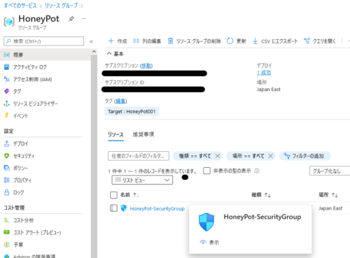

### ハニーポットマシンに適用するセキュリティグループの作成

ネットワークセキュリティグループは、Azureのリソースが送受信するネットワークトラフィックに対するフィルタです。

仮想マシンのネットワークインターフェースや、サブネットに対して関連づけることでフィルタを適用できます。

参考：[Azure ネットワーク セキュリティ グループの概要 | Microsoft Docs](https://docs.microsoft.com/ja-jp/azure/virtual-network/network-security-groups-overview)

参考：[ネットワーク セキュリティ グループ - しくみ | Microsoft Docs](https://docs.microsoft.com/ja-jp/azure/virtual-network/network-security-group-how-it-works)

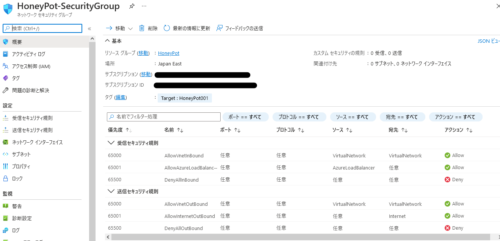

ここでは、以下の2種類のセキュリティグループを作成しました。

- ハニーポットマシンに適用するセキュリティグループ
- ハニーポットマシンに接続する踏み台サーバ用のセキュリティグループ

踏み台サーバのセキュリティグループは、自分のプライベートマシンからのSSHポートおよびHTTPSポートへのインバウンド接続と、すべてのアウトバウンド通信を許可します。

※ SSHポートについては念のため22ポートではなくランダムなポートにしておきます。

ちなみにセキュリティグループは「既定の規則」でVirtualNetworkからのすべてのインバウンド通信が許可されているガバガバ設計なので、ここで明示的にすべてのVirtualNetworkからのインバウンド通信を拒否する設定をいれています。

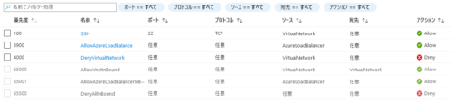

SSHなどのVirtualNetwork単位で許可する通信についてはこれより若い優先順位に設定していくイメージです。

### ハニーポットマシンの仮想ネットワークの作成

Azureの仮想ネットワークはAzure内のプライベートネットワークを構成する要素です。

Azure仮想ネットワークを利用することで、Azure内に他ネットワークと論理的に分離されたプライベートなネットワークを構築することができます。

参考：[Azure Virtual Network | Microsoft Docs](https://docs.microsoft.com/ja-jp/azure/virtual-network/virtual-networks-overview)

参考：[Azureの仮想ネットワークAzure VNetとは？通信方法や料金などを解説](https://www.rworks.jp/cloud/azure/azure-column/azure-entry/22165/)

今回はとりあえずガチガチに絞ったサブネット空間を作成してみました。

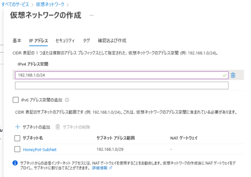

この段階では、ファイアウォールなどの設定は一旦無効化しています。

### 仮想マシンの作成

続いて、以下の構成でAzureの仮想マシンを作成していきます。

### ハニーポットマシン

- OS: Ubuntu20.04
- インフラストラクチャ冗長：なし
- セキュリティの種類：Standard
- 削除の種類：容量のみ
- 削除ポリシー：停止/割り当て解除
- マシンサイズ：Standard_D2s_v3(2vCPU 8GB RAM)

また、ネットワークについては、事前に作成しておいたセキュリティグループと仮想ネットワークを使用します。

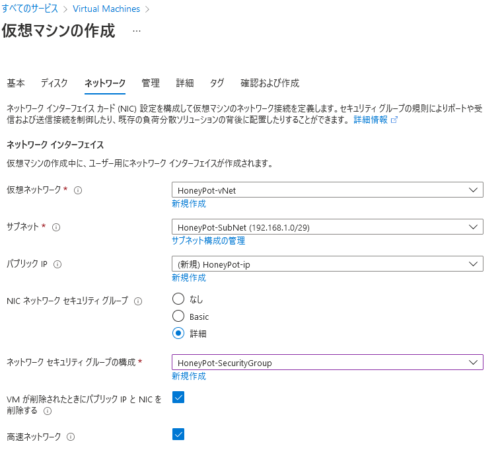

また、もし何らかの原因でSSH接続ができなくなった時のためにシリアルコンソールで操作できるようにしておくとよさそうです。

シリアルコンソールを有効にするためにブート診断を有効化します。

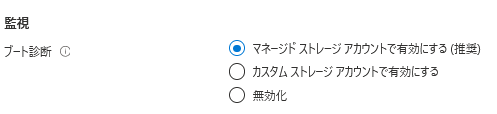

※ もしマネージドストレージアカウントの互換性がない場合は、カスタムストレージアカウントを作成します。

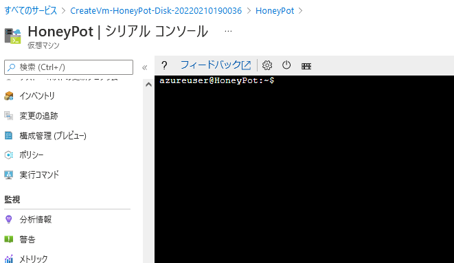

### 踏み台サーバ

今回はハニーポットマシンに自分の環境から直接接続できないようにしたいです。

そのため、踏み台サーバも同じネットワーク上に作成します。

今回、踏み台サーバはUbuntuで作成しました。

踏み台サーバについては常時稼働を想定しているので、(主にコストの理由から)Standard_B1s(1vCPU 1GB RAM)のサイズを選択しました。(GUI使うにはちょっときついかもですが)

Standard_B1sは大体月に1000円くらいです。

踏み台用途なのでディスクは作成せず、先ほど作成した踏み台用のセキュリティグループを割り当てます。

ハニーポットに使用するStandard_D2s_v3は月に1万円くらいなので結構差が大きいですね。

T-PotのWebコンソールに踏み台からアクセスしたいので、GUIをインストールした上でホストマシンからRDP接続します。

とりあえず必要なパッケージをインストールします。

``` bash
sudo apt install ubuntu-desktop xrdp -y
```

RDPの設定方法については下リンクなどを参考にしました。

参考：[第621回　Ubuntu 20.04 LTSでxrdpを使用する：Ubuntu Weekly Recipe｜gihyo.jp … 技術評論社](https://gihyo.jp/admin/serial/01/ubuntu-recipe/0621)

セキュリティグループでホストマシンからのRDPを許可するのも忘れずに。

踏み台へのSSHやRDPは、インターネットにオープンにすると攻撃されるので、自分のIPアドレスなどで固定するのがよさそうです。

### 踏み台サーバのサイズについて(追記)

Standard_B1sでGUI使おうと思っていたのですが、やはり恐ろしく遅延して使い物にならないので断念しました。

踏み台サーバはCUIのみとして、T-Potのコンソールには踏み台サーバをSSHダイナミックフォワーディングでプロキシとしてホストマシンから接続することにします。

設定方法は後述します。

### 環境のセットアップ

さて、マシンにSSH接続ができたら、ハニーポットと踏み台サーバのパッケージをとりあえずアップグレードしておきます。

``` bash
sudo apt update && sudo apt upgrade -y
```

次に、[Trend Micro Cloud One Workload Security](https://www.trendmicro.com/ja_jp/business/products/hybrid-cloud/cloud-one-workload-security.html)のAgentをインストールして適当にポリシーをセットアップしていきます。

(まじで5台永久無料ライセンスがなくなったのが辛い。。)

ざっくりですがポリシーこんな感じにしてます。

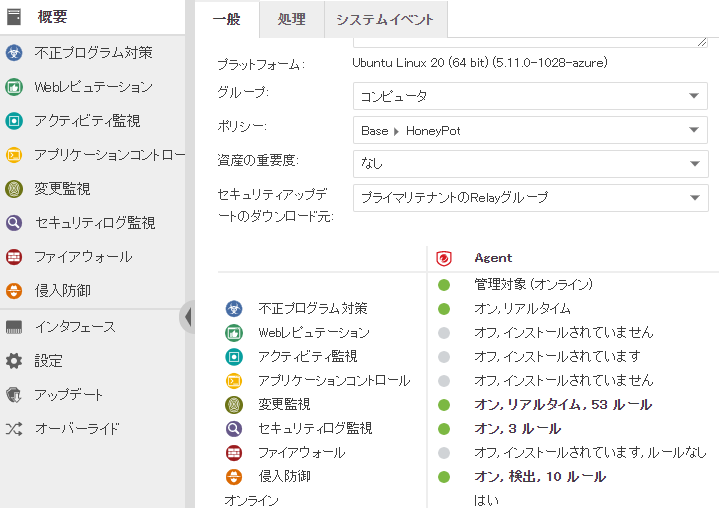

リアルタイムのアンチマルウェア機能とホスト型IDSを有効化してます。

このホスト型IDSは、端末内のDockerコンテナ間の通信もフィルタできるので(たぶん)色々防いでくれるはずです。

あとホストマシンが侵害されないように、「変更監視、セキュリティログ監視」という機能も有効化しています。

これで設定ファイルとかシステム内の重要ファイルが改ざんされたらイベントを発生してくれます。

### DNS名の構成

仮想マシンにアクセスするためにマシンに割り当てるパブリックIPの設定でDNS名を構成します。

この設定を行うことで、パブリックIPを動的割り当てにした場合でも常に同じFQDNで接続することが可能になります。

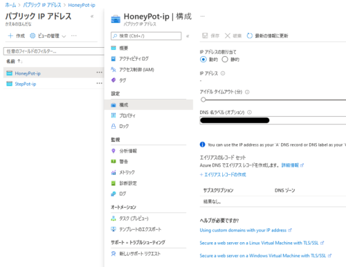

固定IPによる接続でもいいですが、無駄にコストがかかるのと、IPでのアクセスは柔軟性が無いのでDNS名を設定しておくのが良いと思います。

## Azure Sentinelの構築

Azure SentinelはAzureの提供しているSIEMサービスです。

参考：[Azure Sentinel – クラウドネイティブの SIEM ソリューション | Microsoft Azure](https://azure.microsoft.com/ja-jp/services/microsoft-sentinel/#overview)

- Common Event Format (CEF) Syslog メッセージを収集するLinuxエージェントを踏み台サーバにインストールする
- 踏み台サーバで、ハニーポットマシンからの514ポートのインバウンド通信を許可する
- Cloud OneのSyslogイベントをハニーポットマシンから踏み台サーバに転送するように構成する

### 踏み台サーバにLinux Agentをインストールする

Cloud OneとAzure Sentinelの連携については、以下のようにAzure Sentinel側の「データコネクタ」に詳細な手順が書かれています。

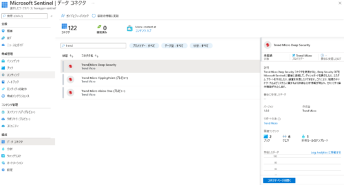

これを参考に、踏み台サーバにSyslog Agentをインストールします。

インストールのためのPythonが必要なので、まずはパッケージをインストールしておきます。

``` bash
sudo apt install python -y
```

次に、「データコネクタ」に表示されている以下のようなコマンドを実行して、Agentをインストールします。

``` bash
sudo wget -O cef_installer.py https://raw.githubusercontent.com/Azure/Azure-Sentinel/master/DataConnectors/CEF/cef_installer.py&&sudo python cef_installer.py <TENANT> <TOKEN>
```

### 踏み台サーバの514ポート待ち受けを有効化する

セキュリティグループの設定を変更して、ハニーポットマシンからの514ポートあての通信を受け入れる設定を実施しました。

### Cloud OneのSyslogイベントをハニーポットマシンから踏み台サーバに転送するように構成する

まずCloud One側で踏み台サーバの514ポートに検出イベントを転送する設定をいれます。

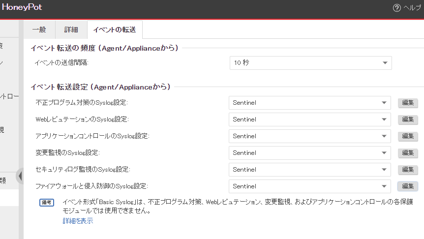

これで試しにEicarをハニーポットマシンで検出させてみると、Azure Sentinelのポータルで検出イベントが確認できました。

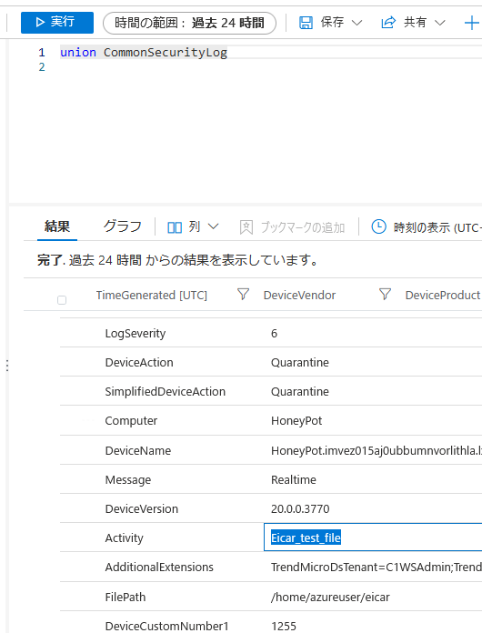

今はこれだけですが、今後は何かAzure Sentinel上での分析とかもやっていけるとよさそうです。

## 補足：ハニーポットマシンのディスク拡張

もし仮想マシンにディスクを追加する場合は、Azureコンソールから追加ディスクを設定した後、普通にLinuxにマウントするのと同じように設定が必要です。

まずは`lsblk`でディスクの一覧を確認します。

``` bash
$ lsblk
NAME    MAJ:MIN RM  SIZE RO TYPE MOUNTPOINT
loop0     7:0    0 61.9M  1 loop /snap/core20/1328
loop1     7:1    0 43.4M  1 loop /snap/snapd/14549
loop2     7:2    0 67.2M  1 loop /snap/lxd/21835
sda       8:0    0  128G  0 disk
sdb       8:16   0   30G  0 disk
├─sdb1    8:17   0 29.9G  0 part /
├─sdb14   8:30   0    4M  0 part
└─sdb15   8:31   0  106M  0 part /boot/efi
sdc       8:32   0   16G  0 disk
└─sdc1    8:33   0   16G  0 part /mnt
```

今回追加したディスクは`sda`として認識されているので、これをマウントしていきます。

今回は空の新規ディスクとして追加しているので、まずはパーティション作成を行う必要があります。

``` bash
sudo parted /dev/sda --script mklabel gpt mkpart xfspart xfs 0% 100%
```

これでもう一度`lsblk`を叩くと`sda1`ができているので、以下のコマンドでXFSファイルシステムのフォーマットを実施します。

``` bash
sudo mkfs.xfs /dev/sda1
sudo partprobe /dev/sda1
```

UbuntuではなくDebianの場合は、事前に`xfsprogs`をインストールする必要がある場合があります。

``` bash
sudo apt install xfsprogs
```

参考：[Fix "mkfs.xfs: No such file or directory" on CentOS/Ubuntu/Debian - TechViewLeo](https://techviewleo.com/fix-mkfs-xfs-no-such-file-or-directory/)

最後にこれからハニーポットをインストールするために`tpot`ディレクトリを作成し、`/dev/sda1`をマウントしました。

``` bash
mkdir ~/tpot
sudo mount /dev/sda1 ~/tpot
```

これで再度`lsblk`を叩くと、マウントが適切に反映されていることがわかります。

``` bash
$ lsblk
NAME    MAJ:MIN RM  SIZE RO TYPE MOUNTPOINT
loop0     7:0    0 61.9M  1 loop /snap/core20/1328
loop1     7:1    0 43.4M  1 loop /snap/snapd/14549
loop2     7:2    0 67.2M  1 loop /snap/lxd/21835
sda       8:0    0  128G  0 disk
└─sda1    8:1    0  128G  0 part /home/azureuser/tpot
sdb       8:16   0   30G  0 disk
├─sdb1    8:17   0 29.9G  0 part /
├─sdb14   8:30   0    4M  0 part
└─sdb15   8:31   0  106M  0 part /boot/efi
sdc       8:32   0   16G  0 disk
└─sdc1    8:33   0   16G  0 part /mnt
```

参考：[Linux VM の仮想ハード ディスクを拡張する - Azure Virtual Machines | Microsoft Docs](https://docs.microsoft.com/ja-jp/azure/virtual-machines/linux/expand-disks)

## スナップショットの作成

だいたい準備が終わったのでいよいよT-Potをインストールしていきますが、その前に一応ディスクのスナップショットを取得しておきます。

Azure のディスクのスナップショットを取得しておくことで、何か問題があった場合に新しくマシンを立て直して復旧することができます。

正直スナップショットだけでも意外と月額料金かかるのであまり個人では使いたくないのですが、とりあえずやっておきます。

詳しいやり方は以下リンクがわかりやすいと思います。

参考：[VM 複製方法について part.3/3 OS ディスクのスナップショットから複製する手順 | Japan Azure IaaS Core Support Blog](https://jpaztech.github.io/blog/vm/vm-replica-3/)

仮想マシンの電源を落としてディスクからスナップショットを作成するだけです。

スナップショットが作成できたら、最後にT-Potのインストールを行います。

## T-Potのインストール

T-Potのインストール前に、Cloud Oneのアンチマルウェア機能を無効化しておきます。

続いて以下のコマンドを順に実行していきます。

``` bash
cd ~/tpot
git clone https://github.com/telekom-security/tpotce
cd tpotce/iso/installer/
```

ここで、`tpot.conf.dist`というファイルに以下の設定が書かれています。

``` bash
# tpot configuration file
# myCONF_TPOT_FLAVOR=[STANDARD, SENSOR, INDUSTRIAL, COLLECTOR, NEXTGEN, MEDICAL]
myCONF_TPOT_FLAVOR='STANDARD'
myCONF_WEB_USER='webuser'
myCONF_WEB_PW='w3b$ecret'
```

デフォルトだとT-Potのタイプが`STANDARD`になっています。

次に、ユーザ名とパスワードを任意に変更した後、以下のコマンドを実行します。

``` bash
cp tpot.conf.dist tpot.conf
sudo ./install.sh --type=auto --conf=tpot.conf
```

これで問題なく完了すれば、以下のような出力になります。

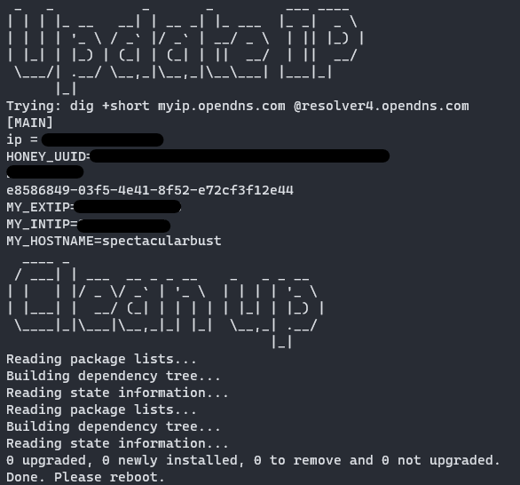

これでT-Potのインストールは完了です。

T-Potインストールが完了すると、ポート22でのSSHが無効化されます。

デフォルトの設定の場合SSHの接続ポートは64295になるのでSSH接続できることを確認します。

``` bash
ssh -i .ssh/id_rsa -p 64295 <T-Pot>
```

ちなみに、T-Potのサービスごとのポートはデフォルトで以下に設定されています。

- SSH：64295
- WEBコンソール：64297
- ADMINサイト：64294

これらのポートはインターネット側からアクセスできないよう、セキュリティグループで踏み台サーバからのみアクセス可能なように設定しておきます。

### Dockerユーザの追加

T-Potのインストールが完了するとマシン内にDockerがインストールされます。

ただし、インストール直後の時点ではDockerサービスには一般ユーザではアクセスできません。

今後、一般ユーザでログインしたPilotコンソールからDockerサービスの監視を行えるようにするために、以下のコマンドでDockerグループにユーザを追加しておきましょう。

``` bash
sudo usermod -aG docker $USER
```

一般ユーザでDockerサービスを使用可能にすることで、以下のようにPilotコンソールからDockerコンテナを監視できるようになります。

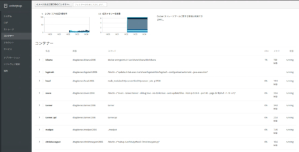

### SSHダイナミックフォワーディングで踏み台経由でT-Potに接続

次は踏み台サーバ経由でT-PotのWEBコンソールに接続します。

まずは、ホストマシン側で、踏み台サーバに対して以下のようにSSH接続を行います。

``` bash
ssh -fN -D <Forwarding Port> -i .ssh/honeypot.pem <Username@IP Addr>
```

これでホストマシンの`<Forwarding Port>`を経由して踏み台サーバに接続できるようになります。

次に、以下のようにブラウザの`SOCKS v5`プロキシの設定を、ローカルホストと設定したフォワーディングポートにします。

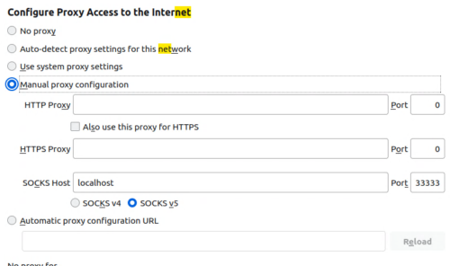

これで踏み台サーバ経由でT-PotマシンのローカルIPアドレスに接続できるようになります。

実際にブラウザで`https://<T-PotのローカルIPアドレス>:64297`などに接続することでコンソールを開くことができます。

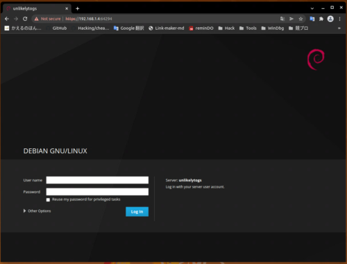

T-Potコンソールもカッコいい！！

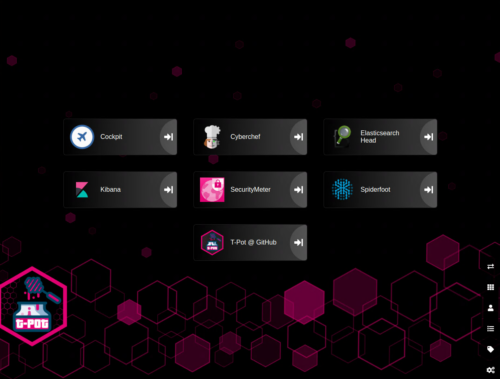

## まとめ

とりあえず今回やったことは以下です。

- AzureにT-Potと踏み台サーバを構築
- T-Potマシンに Cloud One Wordload Security の Agentをインストールして、SentinelとSIEM連携
- 踏み台サーバのSSHフォワーディング経由でT-Potコンソールに接続(後にオンプレ仮想マシンから直接接続する方法に構成を変更)
- T-Potのコンソールログインを確認

まだT-Potマシンのセキュリティグループのインバウンドポートは解放していないので、実際には稼働していない状況です。

T-Potに含まれるどのハニーポットを使用するか、Azure Sentinelでどんな解析をしていくかなども含めてこれから決めていきたいと思います。

## 参考書籍

- [サイバー攻撃の足跡を分析する ハニーポット観察記録 [ハニーポット観察記録]](https://amzn.to/34tqh58)
- [WOWHoneypotの遊びかた　“おもてなし”機能でサイバー攻撃を観察する！](https://amzn.to/34tPAnt)