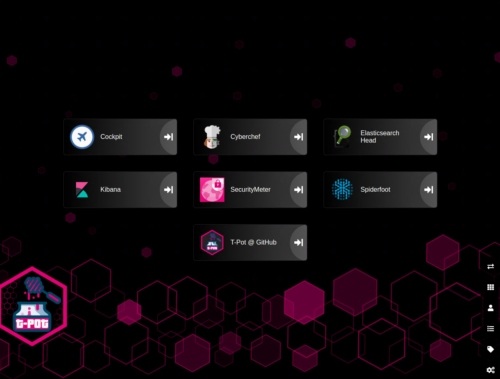

先日[Azure上でハニーポットを構築する記事](/honeypot-setup-on-azure)を書きましたが、今回はその続きです。

実際にハニーポットの運用を始めるにあたって、前回インストールしたT-Potが動かしてるモジュールとハニーポットの概要について一通り確認しておくことにしました。

T-Potに組み込まれているハニーポットは全部で25種類もあったので結構時間がかかりました笑

## 記事について

**本記事の内容は社会秩序に反する行為を推奨することを目的としたものではございません。**

自身の所有する環境、もしくは許可された環境以外への攻撃の試行は、「不正アクセス行為の禁止等に関する法律（不正アクセス禁止法）」に違反する可能性があること、予めご留意ください。

またすべての発言は所属団体ではなく個人に帰属します。

<!-- omit in toc -->
## もくじ
- [記事について](#記事について)
- [T-Potの各コンソールについて](#t-potの各コンソールについて)
  - [Cockpit](#cockpit)
  - [Cyberchef](#cyberchef)
  - [Elasticserch Head](#elasticserch-head)
  - [Kibana](#kibana)
  - [Security Meter](#security-meter)
  - [Spiderfoot](#spiderfoot)
  - [T-Pot@Github](#t-potgithub)
- [ハニーポットの種類](#ハニーポットの種類)
  - [ADBHoney](#adbhoney)
  - [Cisco ASA honeypot](#cisco-asa-honeypot)
  - [Honepot for CVE-2019-19781 (Citrix ADC)](#honepot-for-cve-2019-19781-citrix-adc)
  - [CONPOT](#conpot)
  - [Cowrie](#cowrie)
  - [DDoSPot](#ddospot)
  - [Dicompot](#dicompot)
  - [Dionaea](#dionaea)
  - [ElasticPot](#elasticpot)
  - [Endlessh](#endlessh)
  - [Glutton](#glutton)
  - [Heralding](#heralding)
  - [HellPot](#hellpot)
  - [Honeypots](#honeypots)
  - [HoneyPy](#honeypy)
  - [HoneySAP](#honeysap)
  - [Honeytrap](#honeytrap)
  - [IPP Honey](#ipp-honey)
  - [Log4Pot](#log4pot)
  - [Mailoney](#mailoney)
  - [medpot](#medpot)
  - [RDPY](#rdpy)
  - [RedisHoneyPot](#redishoneypot)
  - [SNARE and TANNER](#snare-and-tanner)
- [まとめ](#まとめ)

## T-Potの各コンソールについて

[前回の記事](/honeypot-setup-on-azure)の最後に見た通り、ログイン後のT-Potのコンソールは以下のようになっています。

今回は各コンソールについてそれぞれ見ていこうと思います。

### Cockpit

「Cockpit」はLinuxシステムのコンテナ、ストレージ、ネットワーク、サービス、ログなどの監視を行うことができるWEBコンソールアプリケーションです。

参考：[cockpit-project/cockpit: There's code a goin' on](https://github.com/cockpit-project/cockpit)

上記の画像の通り、システムリソースの使用状況などもリアルタイムで可視化してくれています。

便利。

### Cyberchef

T-Potマシン内で利用できるローカル版のCyberchefが用意されています。

### Elasticserch Head

Elastic Search Clusterを参照、操作するためのWEBコンソールです。

参考：[ElasticSearch Head](https://mobz.github.io/elasticsearch-head/)

参考：[Free and Open Search: The Creators of Elasticsearch, ELK & Kibana | Elastic](https://www.elastic.co/)

Elastic Searchとは、分散型の検索および分析エンジンです。

要するに大量の情報から必要な情報を効率的に抽出するためのツールといったイメージです。

Elasticserchは色々な用途で使用できるみたいですね。

参考：[Elasticsearch: The Official Distributed Search & Analytics Engine | Elastic](https://www.elastic.co/elasticsearch/)

いまいちよくわかってないですが、Elasticsearchは検索トラフィックの増加とデータ、書き込みの分散を行うため、複数のElasticsearch Server Nodeで構成されたClusterを利用するようです。

Elasticserch Headは恐らくこのClusterを操作できるツールなのかと思っています。

細かい使い方については、またそのうち別の記事で書きます。

### Kibana

Kibanaは、Elasticserchと連携してデータを可視化するためのツールです。

Elasticserchに格納されているデータを用いて、Kibanaでデータ分析やグラフィカルな可視化を行うことができます。

T-Potでは、デフォルトで各ハニーポットの収集した情報を可視化するダッシュボードが作成されていました。

今はまだT-Potをインターネットに解放していないので何のデータも収集されていませんが、実際にハニーポットの運用を始めたらこのダッシュボードの情報を基本的に見ていく形になりそうです。

### Security Meter

Security Meterは、T-Potを開発したドイツのTelekom社のセキュリティセンサーというモジュールが観測した情報を収集して可視化してくれる感じのツールみたいです。

セキュリティセンサーは全世界に90以上あり、そこで収集された情報が使用されているとのことです。

参考：[Security dashboard shows cyber attacks in real time | Deutsche Telekom](https://www.telekom.com/en/media/media-information/archive/security-dashboard-shows-cyber-attacks-in-real-time-358884)

T-Potの環境がなくても以下のリンクからアクセスすることもできます。

参考：[Sicherheitstacho](https://www.sicherheitstacho.eu/start/main)

UIめちゃカッコいい…。

### Spiderfoot

SpiderfootはOSSのOSINTツールです。

参考：[Home - SpiderFoot](https://www.spiderfoot.net/)

インテリジェンスな情報収集を自動化できるようです。

例えば、ハニーポットが収集したIPアドレスなどの情報やメールアドレス、URLなどの情報を特定の攻撃キャンペーンと紐づけるといったインテリジェンスな解析を自動化したりできそうです。

こちらもまだT-Potをインターネットに解放しておらず何のデータも収集されていないため、実際に運用を始めてから試してみようと思います。

### T-Pot@Github

T-PotのGitHubリポジトリがリンクされています。

参考：[GitHub - telekom-security/tpotce:  T-Pot - The All In One Honeypot Platform ](https://github.com/telekom-security/tpotce)

## ハニーポットの種類

かなり細かいですが、T-Potの全体像はこんな感じになっています。

参考画像：[tpotce/architecture.png at master · telekom-security/tpotce](https://github.com/telekom-security/tpotce/blob/master/doc/architecture.png)

前述したツール群とハニーポットは、docker-composeで管理されたコンテナとしてそれぞれ起動されます。

この画像には18台のハニーポットしか記載されていませんが、なんと本記事執筆時点(2022/02/14)時点でのT-Potが持つハニーポットは全部で25個のようです。

すごい。

せっかくなのでそれぞれがどんなハニーポットなのかざっくり見ていこうと思います。

### ADBHoney

「ADBHoney」は、TCP/IPを経由した`Android Debug Bridge（ADB）`用のハニーポットです。

参考：[huuck/ADBHoney: Low interaction honeypot designed for Android Debug Bridge over TCP/IP](https://github.com/huuck/ADBHoney)

`Android Debug Bridge（ADB）`とは、Androidデバイスとの通信を可能にするコマンドラインツールです。

Androidデバイス上で稼働するデーモン(`adbd`)に対してADBクライアントから接続を行うことでデバッグなどを行うことができます。

参考：[Android Debug Bridge (adb)  |  Android Developers](https://developer.android.com/studio/command-line/adb)

通常デバイス側のADBは保護された通信でのみ行われますが、もしインターネットにADBサービスのポートが無防備に公開されている場合、そのデバイスはインターネット経由で悪意のある攻撃者による任意のコード実行を受け付けます。

「ADBHoney」はこのような開放ポート`5555`に対してマルウェアをダウンロードさせることを目的とした攻撃をキャッチすることを目的としたハニーポットです。

### Cisco ASA honeypot

「Cisco ASA honeypot」はDoSおよびRCEを引き起こす`CVE-2018-0101`に対する攻撃を検出できるハニーポットです。

参考：[Cymmetria/ciscoasa_honeypot: A low interaction honeypot for the Cisco ASA component capable of detecting CVE-2018-0101, a DoS and remote code execution vulnerability.](https://github.com/Cymmetria/ciscoasa_honeypot)

CVSSv3の評価で10.0の脆弱性で、double-freeの悪用みたいです。

こういう特定の脆弱性に対しての攻撃のみを収集することを目的としたハニーポットもあるんですね。

参考：[CVE - CVE-2018-0101](https://cve.mitre.org/cgi-bin/cvename.cgi?name=CVE-2018-0101)

参考：[JVNDB-2018-001897 - JVN iPedia - 脆弱性対策情報データベース](https://jvndb.jvn.jp/ja/contents/2018/JVNDB-2018-001897.html)

### Honepot for CVE-2019-19781 (Citrix ADC)

「Honepot for CVE-2019-19781 (Citrix ADC)」も同じく特定の脆弱性を対象としたハニーポットです。

`CVE-2019-19781`の悪用を目的とした攻撃をキャッチします。

参考：[MalwareTech/CitrixHoneypot: Detect and log CVE-2019-19781 scan and exploitation attempts.](https://github.com/MalwareTech/CitrixHoneypot)

この脆弱性も悪用によってRCEが可能になります。

CVSSv3の評価で9.8であり、パストラバーサルの脆弱性です。

参考：[複数の Citrix 製品の脆弱性 (CVE-2019-19781) に関する注意喚起](https://www.jpcert.or.jp/at/2020/at200003.html)

参考：[JVNDB-2019-013490 - JVN iPedia - 脆弱性対策情報データベース](https://jvndb.jvn.jp/ja/contents/2019/JVNDB-2019-013490.html)

### CONPOT

「CONPOT」は産業用施設に対する攻撃をキャッチするためのハニーポットです。

一般的な産業用制御プロトコルを使用して複雑なインフラストラクチャ環境をエミュレートします。

具体的にどうやってるのかはよくわからんのですが、意図的に応答を遅延させることで、一定の負荷がかかっているような環境を模倣することも可能なようです。

参考：[Conpot](http://conpot.org/)

### Cowrie

「Cowrie」はSSHとTelnetに対してのブルートフォース攻撃、また、システム侵入後の攻撃者のふるまいを監視できるようです。

参考：[cowrie/cowrie: Cowrie SSH/Telnet Honeypot https://cowrie.readthedocs.io](https://github.com/cowrie/cowrie)

「Cowrie」は動作モードによってどのような振る舞いをキャッチするか変更できるようですが、T-Potのデフォルトの設定ファイルを見ると、SSHもTelnetやJSON形式のロギングなど、諸々有効化されているようです。

参考：[tpotce/cowrie.cfg at master · telekom-security/tpotce](https://github.com/telekom-security/tpotce/blob/master/docker/cowrie/dist/cowrie.cfg)

### DDoSPot

「DDoSPot」はUDPベースのDDoS攻撃おキャッチするためのハニーポットです。

以下のサービスをサポートしています。

- DNS server
- NTP server
- SSDP server
- CHARGEN server
- Random/mock UDP server

参考：[aelth/ddospot: NTP, DNS, SSDP, Chargen and generic UDP-based amplification DDoS honeypot](https://github.com/aelth/ddospot)

### Dicompot 

「Dicompot 」は`A Digital Imaging and Communications in Medicine (DICOM)`をターゲットとしたハニーポットです。

参考：[nsmfoo/dicompot: DICOM Honeypot](https://github.com/nsmfoo/dicompot)

DICOMとは、CTやMRI、CRなどで撮影した医用画像のフォーマットと、それらを扱う医用画像機器間の通信プロトコルの規格を指すようです。

参考：[DICOM - Wikipedia](https://ja.wikipedia.org/wiki/DICOM)

初めて聞いた規格ですが、ポート104が一般的な通信ポートとして知られており、このポートを狙った攻撃も観測されているようです。

### Dionaea 

「Dionaea」は日本語でハエトリグサを意味するワードで、マルウェア収集を目的としたハニーポットです。

参考：[DinoTools/dionaea: Home of the dionaea honeypot](https://github.com/DinoTools/dionaea)

「Dionaea」が取得したマルウェアは、`binaries`ディレクトリに保存される ようです。

参考：[HoneypotのDionaeaでマルウェアを収集しちゃって、APIでスキャンして、結果をビジュアライズしちゃうぞ - Qiita](https://qiita.com/micci184/items/fce32a6d62493d289710)

### ElasticPot

「ElasticPot」は脆弱なElasticsearchサーバをエミュレートし、Elasticsearchに対する攻撃をキャプチャするためのハニーポットです。

参考：[Vesselin Bontchev / ElasticPot · GitLab](https://gitlab.com/bontchev/elasticpot)

### Endlessh

「Endlessh」はSSHターピットです。

参考：[skeeto/endlessh: SSH tarpit that slowly sends an endless banner](https://github.com/skeeto/endlessh)

「ターピット」って何ぞ、って話ですが、サーバ側のレスポンスを故意に遅延させることによって攻撃者の時間やリソースを浪費させることを目的としたシステムです。

参考：[ターピット | サイバーセキュリティ情報局](https://eset-info.canon-its.jp/malware_info/term/detail/00070.html)

「Endlessh」はSSHターピットであり、攻撃者のSSHクライアントをハングさせ、最大で数日程度の時間を浪費させます。

参考：[Endlessh: an SSH Tarpit](https://nullprogram.com/blog/2019/03/22/)

### Glutton

「Glutton」は攻撃者と他のハニーポット間のプロキシとして機能し、MITMと同様の手法で攻撃者のトラフィックをキャプチャし、記録することができるハニーポットです。

参考：[mushorg/glutton: Generic Low Interaction Honeypot](https://github.com/mushorg/glutton)

参考：[An analysis of Glutton — All Eating honeypot | by Muhammad Tayyab Sheikh (CS Tayyab) | Medium](https://cstayyab.medium.com/an-analysis-of-glutton-all-eating-honeypot-625adf70a33b)

### Heralding

「Heralding」は攻撃者が認証を試行する際のトラフィックや資格情報をキャプチャするためのハニーポットです。

参考：[johnnykv/heralding: Credentials catching honeypot](https://github.com/johnnykv/heralding)

「Heralding」を使用することで、攻撃者が使用する認証情報をキャプチャできます。

参考：[Heralding - Credentials catching honeypot - SecTechno](https://sectechno.com/heralding-credentials-catching-honeypot/)

### HellPot

「HellPot」は[Heffalump](https://github.com/carlmjohnson/heffalump)をベースにしたハニーポットで、悪意のある攻撃者に無制限のストリームを送り、メモリやストレージをオーバーフローさせるハニーポットです。

参考：[yunginnanet/HellPot: HellPot is a portal to endless suffering meant to punish unruly HTTP bots.](https://github.com/yunginnanet/HellPot)

SSHターピットとは違うアプローチのようですがこういう攻撃者へのカウンタートラップ的なハニーポットも結構あるんですね。

### Honeypots

「Honeypots」はネットワークトラフィックやBOTのアクティビティ、攻撃者の使用するクレデンシャル情報を監視することができるハニーポットです。

「Honeypots」の中には23の異なるシンプルなハニーポットが組み込まれています。

参考：[qeeqbox/honeypots: 23 different honeypots in a single pypi package! (dns, ftp, httpproxy, http, https, imap, mysql, pop3, postgres, redis, smb, smtp, socks5, ssh, telnet, vnc, mssql, elastic, ldap, ntp, memcache, snmp, and oracle)](https://github.com/qeeqbox/honeypots)

T-Potに組み込まれているハニーポットの中にさらに複数のハニーポットが組み込まれているパターンは初めてですね。

### HoneyPy

「HoneyPy」はTCPやUDPのサービスをエミュレートして攻撃者のアクティビティをキャプチャすることができるハニーポットです。

参考：[foospidy/HoneyPy: A low to medium interaction honeypot.](https://github.com/foospidy/HoneyPy)

参考：[Home - HoneyPy Docs](https://honeypy.readthedocs.io/en/latest/)

プラグインという単位でサービスを追加することで、DNSやTelnetなどのTCP/UDPのサービスに対しての攻撃をキャプチャできそうです。

参考：[Plugins - HoneyPy Docs](https://honeypy.readthedocs.io/en/latest/plugins/)

### HoneySAP

「HoneySAP」はSAPシステムに対する攻撃をキャプチャするためのハニーポットです。

参考：[SecureAuthCorp/HoneySAP: HoneySAP: SAP Low-interaction research honeypot](https://github.com/SecureAuthCorp/HoneySAP)

特にSAPサービスを狙う攻撃者の目的や技術をとらえることができると説明書きにあります。

参考：[HoneySAP: SAP Low-interaction honeypot — HoneySAP 0.1.2 documentation](https://honeysap.readthedocs.io/en/latest/)

### Honeytrap

「Honeytrap」はTCPやUDPサービスをエミュレートして攻撃者のネットワークトラフィックをキャプチャします。

参考：[armedpot/honeytrap: Last download from git://git.carnivore.it/honeytrap.git of Honytrap by Tillmann Werner](https://github.com/armedpot/honeytrap/)

### IPP Honey

「IPP Honey」は`Internet Printing Protocol Honeypot`です。

参考：[Vesselin Bontchev / IPP Honey · GitLab](https://gitlab.com/bontchev/ipphoney)

インターネットに公開されているプリンタをエミュレートして、プリンタに対する攻撃をキャプチャできます。

### Log4Pot

「Log4Pot」は現在進行形で世界中に大きなインパクトを与えているLog4Shellの脆弱性「CVE-2021-44228」をターゲットとしたハニーポットです。

参考：[thomaspatzke/Log4Pot: A honeypot for the Log4Shell vulnerability (CVE-2021-44228).](https://github.com/thomaspatzke/Log4Pot)

このハニーポットによってLog4Shellの悪用に関する振る舞いをキャプチャします。

### Mailoney

「Mailoney」はSMTPハニーポットです。

参考：[phin3has/mailoney: An SMTP Honeypot](https://github.com/phin3has/mailoney)

SMTPポートに対する攻撃をキャプチャできます。

### medpot

「medpot」は`HL7/FHIRハニーポット`らしいです。

参考：[schmalle/medpot: HL7 / FHIR honeypot](https://github.com/schmalle/medpot)

`HL7/FHIR`って何だろうと思ったのですが、医療情報交換のために標準化されつつある通信プロトコルみたいです。

参考：[HL7 FHIRに関する調査研究](https://www.mhlw.go.jp/stf/newpage_15747.html)

やっぱり医療関係って結構ターゲットにされてるんですね。

### RDPY 

「RDPY」はMicrosoft RDPをPythonで実装したハニーポットです。

参考：[citronneur/rdpy: Remote Desktop Protocol in Twisted Python](https://github.com/citronneur/rdpy)

### RedisHoneyPot

「RedisHoneyPot」はRedisプロトコルをターゲットにしたハニーポットです。

参考：[cypwnpwnsocute/RedisHoneyPot: High Interaction Honeypot Solution for Redis protocol](https://github.com/cypwnpwnsocute/RedisHoneyPot)

Golang製。

### SNARE and TANNER

「SNARE」と「TANNER」はWebアプリケーションのハニーポットセンサです。

参考：[MushMush](http://mushmush.org/)

「TANNER」は「SNARE」がキャプチャしたイベントを評価し、「SNARE」が攻撃者に対してどのように応答するかを決定するモジュールみたいです。

## まとめ

とりあえず現行(2022/02/15時点)で最新版のT-Potのコンポーネントについて一通りまとめてみました。

そろそろ実運用開始したいですが、まだいろいろとやることが多そうです。

