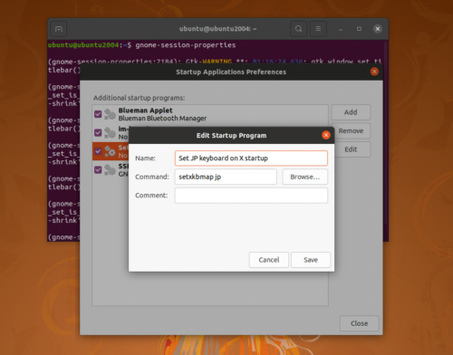

この記事では、Ubuntuマシンに対してXRDP接続を行ったときに発生した問題についてまとめていきます。

<!-- omit in toc -->
## もくじ
- [UbuntuにXRDPで接続するときにサイドバーを表示する設定](#ubuntuにxrdpで接続するときにサイドバーを表示する設定)
- [UbuntuにXRDP接続したときに日本語キーボード設定が利かなくなる問題の対処](#ubuntuにxrdp接続したときに日本語キーボード設定が利かなくなる問題の対処)
- [ブラウザ閲覧時のスクロール操作が遅い問題](#ブラウザ閲覧時のスクロール操作が遅い問題)
- [まとめ](#まとめ)

## UbuntuにXRDPで接続するときにサイドバーを表示する設定

UbuntuなどのLinuxマシンを建てたときに、ホストからRDPでアクセスするためにXRDPを使用します。

この場合、ただXRDPを使うだけなら以下のようなコマンドだけでも問題ないのですが、Ubuntuの場合はアプリケーションランチャーになるサイドバーが表示されなくなってしまいます。

``` bash
sudo apt install -y xrdp
sudo systemctl enable xrdp
```

その場合は、ホームディレクトリに`.xsessionrc`を作成し必要な接敵を書き込むことでサイドバーを表示させることができるようになります。

具体的には、以下のコマンドをコピペするだけです。

``` bash
# ~/.xsessionrc に書き込む
export GNOME_SHELL_SESSION_MODE=ubuntu
export XDG_CURRENT_DESKTOP=ubuntu:GNOME
export XDG_DATA_DIRS=/usr/share/ubuntu:/usr/local/share:/usr/share:/var/lib/snapd/desktop

cat <<EOF > ~/.xsessionrc
export XDG_CONFIG_DIRS=/etc/xdg/xdg-ubuntu:/etc/xdg
EOF
```

上記のコマンドで`.xsessionrc`が作成されたら、以下のコマンドでサービスを再起動します。

``` bash
sudo systemctl restart xrdp
```

参考：[Ubuntu 18.04: GNOMEデスクトップ環境にXRDPで接続する - Narrow Escape](https://www.hiroom2.com/2018/04/28/ubuntu-1804-xrdp-gnome-ja/)

## UbuntuにXRDP接続したときに日本語キーボード設定が利かなくなる問題の対処

デフォルトの状態でXRDP経由のアクセスをした場合、UbuntuのキーボードがUS配列になってしまう場合があります。

その問題を回避するために、以下の設定を実施します。

まずは、設定画面を開きます。

``` bash
gnome-session-properties
```

次に、[Add] をクリックして、NameとCommandに、それぞれ以下を入力します。

``` bash
# Name
Set JP keyboard on X startup

# Command
setxkbmap jp
```

こちらが設定画面です。



これでOSを再起動すると、次回のアクセスからJIS配列が反映されるようになりました。

参考：[Ubuntu で日本語キーボードレイアウト - Qiita](https://qiita.com/vochicong/items/6452ac54bde56b0e0bb3)


## ブラウザ閲覧時のスクロール操作が遅い問題

XRDP経由でスクロール設定が反映されない問題は既知事象なのですが、長らく修正されていないようです。

参考；[Vertical scroll speed too fast (xrdpMouse) · Issue #150 · neutrinolabs/xorgxrdp](https://github.com/neutrinolabs/xorgxrdp/issues/150)

imwheelなどのツールを試しましたが効果はありませんでした。


## まとめ

個人的にハマった問題の解消方法をまとめました。

Ubuntuのセットアップでまた困ったことがあれば、都度追記していきたいと思います。