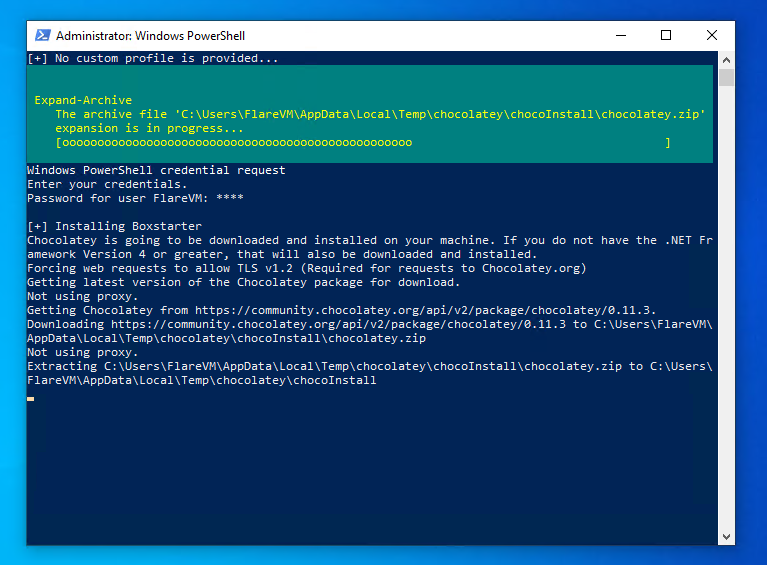
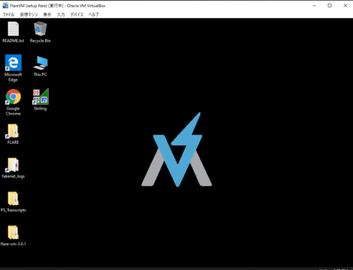

今回はマルウェア解析のためのWindowsディストリビューションであるFLARE VMをセットアップしたので、構築手順について記録しておこうと思います。

FLARE VMはオープンソースのリバースエンジニア、マルウェアアナリスト、インシデントレスポンダー、フォレンジケーター、およびペネトレーションテスター向けに設計された、Windowsベースのセキュリティディストリビューションです。

Version3.0からはWindows10にも対応しています。

参考：[mandiant/flare-vm](https://github.com/mandiant/flare-vm)

参考：[FLARE VM Update | Mandiant](https://www.mandiant.com/resources/flare-vm-update)

<!-- omit in toc -->
## もくじ
- [環境](#環境)
- [インストール前の準備](#インストール前の準備)
  - [Windows Defenderの無効化](#windows-defenderの無効化)
  - [スナップショットの取得](#スナップショットの取得)
  - [FlareVMのダウンロード](#flarevmのダウンロード)
- [FlareVMのインストール](#flarevmのインストール)
- [FlareVMのパッケージインストール方法](#flarevmのパッケージインストール方法)
- [FlareVMのインストールスクリプト実行後の作業](#flarevmのインストールスクリプト実行後の作業)
  - [追加パッケージのインストール](#追加パッケージのインストール)
- [おまけ：FlareVMでインストールしているツールについて](#おまけflarevmでインストールしているツールについて)
  - [Android](#android)
  - [Decompilers](#decompilers)
  - [Disassemblers](#disassemblers)
  - [.NET](#net)
  - [AutoIt](#autoit)
  - [Flash](#flash)
  - [Forensic](#forensic)
  - [Hex Editors](#hex-editors)
  - [Java](#java)
  - [Office](#office)
  - [PDF](#pdf)
  - [PE](#pe)
  - [Pentest](#pentest)
  - [Powershell](#powershell)
  - [Text Editors](#text-editors)
  - [Visual Basic](#visual-basic)
  - [Web Application](#web-application)
  - [Utilities](#utilities)
- [まとめ](#まとめ)

## 環境

今回は、以下のバージョンの仮想マシンにFlareVMを導入していきます。

- Windows 10 Pro 1903 English
  - CPU: 3 core
  - RAM: 8192GB
  - Strage: 80GB
- FlareVM 3.1

※今回は手元では試していないのですが、Windows 10 の1903より新しいバージョンではFlareVMの導入に失敗するという記事を見かけたため、今回は1903で構築しました。

システム要件については、[mandiant/flare-vm](https://github.com/mandiant/flare-vm)には以下の記載になっています。

ここで、VMのストレージではなく、OSインストール後のストレージ空き容量が60GB以上必要な点に注意が必要です。

``` bash
Requirements
・60 GB Hard Drive
  Additional space needed after VM is downloaded/installed
・2 GB RAM
```

## インストール前の準備

### Windows Defenderの無効化

基本的には以下の記事の通りに設定すればOKです。

参考：[How To Uninstall, Disable, and Remove Windows Defender](https://www.howtogeek.com/howto/15788/how-to-uninstall-disable-and-remove-windows-defender.-also-how-turn-it-off/)

今回の環境は1903だったので、Defenderを無効化するためには改ざん防止機能も無効化する必要があります。

以下の記事が参考になります。

参考：[Windows 10 Windows Defenderを完全に無効化する-パソブル](https://www.pasoble.jp/windows/10/08885.html)

なお、要件には入ってませんがついでにWindows Firewallも無効化しておきました。

### スナップショットの取得

FlareVMのインストールに進む前に、VMのスナップショットを取得しておきます。

### FlareVMのダウンロード

以下のReleaseページからFlareVMの3.1をダウンロードしておきます。

参考：[Releases · mandiant/flare-vm](https://github.com/mandiant/flare-vm/releases)

## FlareVMのインストール

先ほどダウンロードしたFlareVMのファイルを、VM上で展開しておきます。

管理者権限で起動したPowerShellでVM上で展開したフォルダに移動して、以下のコマンドを順に実行します。

※インターネット接続が必要です。

``` powershell
Unblock-File .\install.ps1
Set-ExecutionPolicy Unrestricted
.\install.ps1 -password <password>
```

実行に成功すると、こんな感じで順次インストールやらセットアップやらがすすんでいきます。



すべて完了するまでに恐ろしく時間がかかりました（一晩かけても終わらなかった）。

気長に待ちましょう。

## FlareVMのパッケージインストール方法

FlareVMはPowerShellスクリプトを実行したら後は自動でパッケージのインストールやレジストリの変更、OSの再起動などが行われます。

Windows環境でパッケージのインストールを自動化するために、Chocolateyというパッケージマネージャを使用しているようです。

参考：[Chocolatey - Wikipedia](https://en.wikipedia.org/wiki/Chocolatey)

パッケージの更新なんかも、`chocolatey upgrade ${packageName}`のコマンドで可能なので、ラボ環境の新規構築や管理に非常に役に立ちそうですね。

少なくとも現時点のwingetよりも対応パッケージが豊富な点も非常によさそうです。

参考：[Chocolateyを使った環境構築の時のメモ - Qiita](https://qiita.com/konta220/items/95b40b4647a737cb51aa)

そのうちChocolateyを使った環境構築方法については記事にまとめたいと思います。

## FlareVMのインストールスクリプト実行後の作業

無事にインストールが完了すると、以下のように壁紙が変更されます。



最後に、追加のパッケージのインストールと、ネットワーク設定をホストオンリーアダプタに変更します。

マルウェア解析を行うためにFlareVMを導入する場合は、ネットワークから完全に隔離された環境になっていることを必ず確認してください。

### 追加パッケージのインストール

まずは、以下の記事で追加パッケージとしてインストールされているツールを一通りインストールします。

``` powershell
choco install exiftool, trid, grep, stirling-jp, sakuraeditor, irfanview, irfanviewplugins, hashtab, audacity, winmerge, teraterm, fiddler, sqlitebrowser, ultravnc, gnuwin32-coreutils.install
```

参考：[FLARE VM を使って Windows10 に解析環境を構築する - setodaNote](https://soji256.hatenablog.jp/entry/2019/10/14/224121)

特にexiftoolやfiddlerなどは僕もよく使うので入れておきました。

また、WindowsTerminalとNoriben、PowerToysも追加でインストールしておきました。

NoribenはFlareVMのデフォルトでは上手く動作しないので、[こちら](/malware-flarevm-loadpmlerror)の設定が必要になります。

## おまけ：FlareVMでインストールしているツールについて

FlareVMで展開しているツールについて、Readmeに一覧されていました。

参考：[mandiant/flare-vm](https://github.com/mandiant/flare-vm#readme)

いくつかおもしろそうなツールがあったので、ピックアップしてまとめておきます。

### Android

- dex2jar
- apktool

以下の2つのツールは、CTFでもAndroidアプリ問題が出たときに使ったことがあります。

APKファイルを展開してJavaとして読めるような形にデコンパイルできます。

### Decompilers

- RetDec

RetDecは使ったことがなかったのですが、Avastの開発しているOSSのデコンパイラのようです。

ELFやPEのデコンパイル、またCだけでなくPythonライクな言語でのデコンパイル結果を出力することもできるようです。すごい。

参考：[avast/retdec: RetDec is a retargetable machine-code decompiler based on LLVM.](https://github.com/avast/retdec)

参考：[avastのretdecをインストールする - Qiita](https://qiita.com/hogehuga/items/b502cd572a5065881c91)

### Disassemblers

- Ghidra
- IDA Free (5.0 & 7.0)
- Binary Ninja Demo
- radare2
- Cutter

Disassemblerは色々入っているようです。

Cutterは使ったことなかったのですが結構きれいにディスアセンブルされてますね。

ダークモードがあるのも良い。


参考：[rizinorg/cutter: Free and Open Source Reverse Engineering Platform powered by rizin](https://github.com/rizinorg/cutter)

### .NET

- de4dot
- Dot Net String Decoder (DNSD)
- dnSpy
- DotPeek
- ILSpy
- RunDotNetDll

ILSpyとdnSpyは定番ですが、他にも色々あるんですね。

de4dotは難読化解除のツールらしいです。マルウェア解析で重宝しそう。

参考：[de4dot/de4dot: .NET deobfuscator and unpacker.](https://github.com/de4dot/de4dot)

### AutoIt

- AutoItExtractor
- UnAutoIt
- Exe2Aut

AutoIt初めて知りました。VBScriptみたいな感じなのかな。

参考：[AutoIt - Wikipedia](https://en.wikipedia.org/wiki/AutoIt)

### Flash

- FFDec

Flashにもデコンパイラがあるんですね。

### Forensic

- Volatility
- Autopsy

Volatilityはメモリフォレンジックツールって100回復唱します。

ChatEngineとかとの違いはどこなんだろうと思ったけど、CLIで使えるんですね。便利。

参考：[volatilityfoundation/volatility: An advanced memory forensics framework](https://github.com/volatilityfoundation/volatility)

### Hex Editors

- FileInsight
- HxD
- 010 Editor

僕のお気に入りのTweakが入ってない。。

### Java

- JD-GUI
- Bytecode-Viewer
- Java-Deobfuscator

Javaの難読化解除ツールも入ってるんですね。

CTFではまだ出会ったことないですが、マルウェア解析とかだとよく使うんでしょうか。

### Office

- Offvis
- OfficeMalScanner
- oledump.py
- rtfdump.py
- msoffcrypto-crack.py

Officeファイルのマルウェアをピンポイントでスキャンするツールがあるんですね。

参考：[OfficeMalScanner - Microsoft Office Files Malware Scanner](https://www.optimizationcore.com/security/officemalscanner-microsoft-office-files-malware-scanner/)

### PDF

- PDFiD
- PDFParser
- PDFStreamDumper

### PE

- PEiD
- ExplorerSuite (CFF Explorer)
- PEview
- DIE
- PeStudio
- PEBear
- ResourceHacker
- LordPE
- PPEE(puppy)

PEiD、PeStudioあたりはよく使いますが、他にも結構色々あるんですね。

そのうち試してみようと思います。

### Pentest

- Windows binaries from Kali Linux

netcatとか、Windowsで使えるKaliツールの詰め合わせ？みたいです。

参考：[windows-binaries | Kali Linux Tools](https://www.kali.org/tools/windows-binaries/)

### Powershell

- PSDecode

### Text Editors

- SublimeText3
- Notepad++
- Vim

VSCodeは手動で追加したい。。

### Visual Basic

- VBDecompiler

### Web Application

- BurpSuite Free Edition
- HTTrack

HTTrackは再帰的にWebサイトをダウンロードして疑似的なミラーサイトをローカル環境に構築できるようです。

参考：[【画像付き】httrackでホームページを丸ごとダウンロードする使い方](https://eririn25.com/tool/httrack/)

### Utilities

割愛。

Hash系のツールはいくつか入ってるのにHashcatはないんですね。

## まとめ

以前から気になっていたFlareVMをセットアップしてみました。

Windowsでもこんな感じでカスタムディストリビューションのようなものを作れるというのは非常に参考になりました。