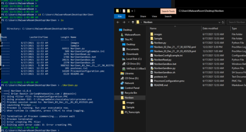
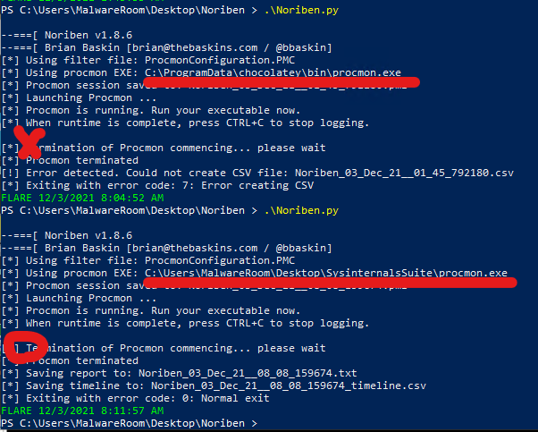
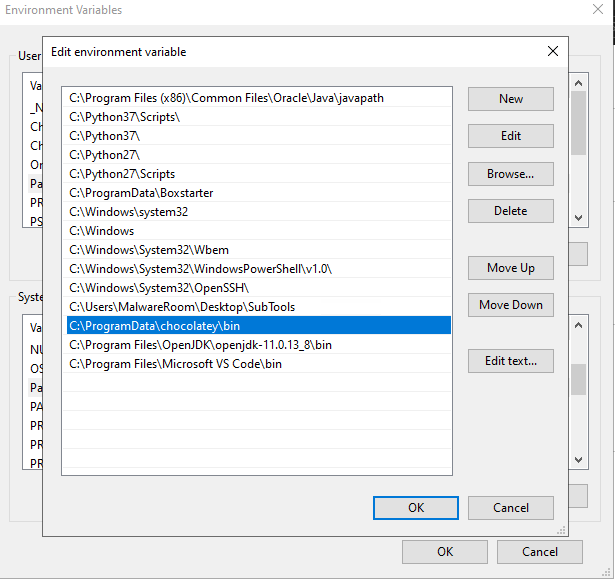

先日マルウェア解析・フォレンジック向けディストリビューションのFlareVM3.1の環境を構築したのですが、Noribenが上手く動作しないトラブルが発生したので解消方法についてまとめておきます。

NoribenフォルダにPMLファイルは生成されるものの、完了権限で実行している場合でもファイルが開けずエラーになる問題の解消方法について書きました。

ちなみに、FlareVMの環境構築方法については[こちら](/malware-flarevm-setup)にまとめてあります。

<!-- omit in toc -->
## もくじ
- [解消方法](#解消方法)
- [設定方法について](#設定方法について)
  - [モジュールのダウンロードと環境変数の設定](#モジュールのダウンロードと環境変数の設定)
  - [PATHの探索順](#pathの探索順)
- [まとめ](#まとめ)

## 解消方法

[Sysinternals Suite - Windows Sysinternals | Microsoft Docs](https://docs.microsoft.com/ja-jp/sysinternals/downloads/sysinternals-suite)からProcmonを別途ダウンロードした上で任意のフォルダに配置し、デフォルトの`C:\ProgramData\chocolatey\bin\procmon.exe`より優先されるPATHを設定すれば問題が解消します。

どうやらchocolatey配下のモジュールを使うとProcmonが作成したファイルにアクセスができなくなり、エラーになるようです。

モジュールの使用順序で言えば一番優先度が高いのはカレントディレクトリであり、以下のissueでもその方法で解消したと書かれています。

参考：[Python "requests" module mussing, ProcMon cannot open pml file for reading and CSV file cannot be created. · Issue #14 · Rurik/Noriben](https://github.com/Rurik/Noriben/issues/14)

しかし、僕の環境や以下の記事では、カレントディレクトリにモジュールを配置しただけではNoribenは上手く動作しませんでした。

参考：[Noribenが「Error creating CSV」で動作しない問題の解決方法 - Qiita](https://qiita.com/harapeco_nya/items/467fafb718b7c796f381)

また、上記の記事では`txt/csv/pml`の規定のアプリをそれぞれ設定することで解消されたと書かれていますが、僕の環境ではこの方法では問題は解決しませんでした。

## 設定方法について

### モジュールのダウンロードと環境変数の設定

[Sysinternals Suite - Windows Sysinternals | Microsoft Docs](https://docs.microsoft.com/ja-jp/sysinternals/downloads/sysinternals-suite)からダウンロードしたProcmonをDesktop配下のサブフォルダに配置し、システム環境変数を設定しました。

この画像では、Procmonを配置したSubToolsフォルダを`C:\ProgramData\chocolatey\bin\`の一つ上に設定しています。

参考：[Windows 10でPath環境変数を設定／編集する：Tech TIPS - ＠IT](https://atmarkit.itmedia.co.jp/ait/articles/1805/11/news035.html)

この画面から環境変数を変更した場合、`WM_SETTINGCHANGE`により変更の通知がかかるので、すぐに反映され、Noribenが使えるようになりました。

もし反映されない場合は、OSの再起動を試します。

### PATHの探索順

システムが実行モジュールを探すときは、以下の順序でPATHを探索します。

1. カレントディレクトリ
2. 環境変数 PATH
3. "HKLM\SOFTWARE\Microsoft\Windows\CurrentVersion\App Paths"

環境変数 PATHに設定されたPATHは、上から順番に探索され、優先されます。

また、環境変数はシステム環境変数とユーザ環境変数に分かれており、システム環境変数で設定されたPATHが、ユーザ環境変数で設定されたPATHよりも優先されます。

今回はシステム環境変数でかつ`C:\ProgramData\chocolatey\bin\`より上の位置にProcmonを配置したフォルダのPATHを定義する必要がありました。

## まとめ

FlareVMでNoribenが使えるようになりました。