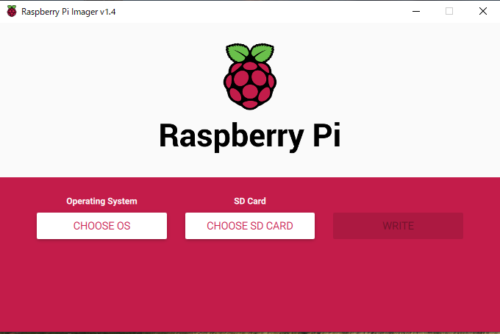

## はじめに

こんにちは。  
およそ半年ぶりの更新です。

先週のAmazonサイバーマンデーセールでこちらのRaspberryPi4を購入しました。

[Amazon.co.jp： LABISTS Raspberry Pi 4 4GB キット（技適マーク入）](https://www.amazon.co.jp/gp/product/B082VVJCPT/ref=as_li_ss_tl?ie=UTF8&psc=1&linkCode=sl1&tag=kashiwabayu0c-22&linkId=2f544675d0042c47ccf524f3898b81c6&language=ja_JP)


このRaspberryPi4、**RAMが4GB**あり、**Wifi接続やUbuntuDesktopのインストールも可能**ということで、うきうきでセットアップをしていたところ、**「netplan apply」の実行に失敗する問題が発生**しました。  
こちらについては、**公式からダウンロードしたUbuntu Server 20.04.1のISOに含まれる「netplan.io」のバグが原因であり、一度有線接続を実施してアップデートすることで問題が解消**されました。

今回の記事では、**上記のトラブルシューティングも含めて、RaspberryPi4にUbuntu Server 20.04.1をインストールしてWifi接続するまでの手順**を備忘録としてまとめておきます。


## RaspberryPi4用のOSイメージとイメージライターをダウンロードする 

RaspberryPi4用のOSイメージは、こちらの公式ページからダウンロードしました。  
本記事執筆時点で推奨されているのは、LTS版のUbuntu Server 20.04.1でしたので、こちらをダウンロードしました。

<a href="https://ubuntu.com/download/raspberry-pi" target="_blank" rel="noopener noreferrer">Install Ubuntu on a Raspberry Pi 2, 3 or 4 | Ubuntu</a>

ちなみに、OSのbit数はインストールするRaspberryPiに合わせて選択してください。  
僕が購入したこちらの製品は、RaspberryPi4 Model Bであり、CPUは「BCM2711」というものを使用しているようです。

[Amazon.co.jp： LABISTS Raspberry Pi 4 4GB キット（技適マーク入）](https://www.amazon.co.jp/gp/product/B082VVJCPT/ref=as_li_ss_tl?ie=UTF8&psc=1&linkCode=sl1&tag=kashiwabayu0c-22&linkId=2f544675d0042c47ccf524f3898b81c6&language=ja_JP)


「BCM2711」についての詳細は以下のドキュメントにも記載されてます。  
<a href="https://github.com/raspberrypi/documentation/tree/master/hardware/raspberrypi/bcm2711" target="_blank" rel="noopener noreferrer">documentation/hardware/raspberrypi/bcm2711 at master · raspberrypi/documentation</a>

こちらの説明を見ると、下記のとおり、ARMコアで64bitのCPUであることがわかります。  
そのため、32bit版も(おそらく)動くとは思いますが、今回は64bit版をインストールすることにしました。

```
ARMコアは最大1.5GHzで実行できるため、Pi4はRaspberryPi 3B +よりも約50％高速になります。
新しいVideoCoreVI3Dユニットは最大500MHzで動作するようになりました。
ARMコアは64ビットであり、VideoCoreは32ビットですが、新しいメモリ管理ユニットがあります。
これは、以前のバージョンよりも多くのメモリにアクセスできることを意味します。
```
参考：<a href="https://github.com/raspberrypi/documentation/tree/master/hardware/raspberrypi/bcm2711" target="_blank" rel="noopener noreferrer">documentation/hardware/raspberrypi/bcm2711 at master · raspberrypi/documentation</a>


## RaspberryPi公式のイメージライターをインストールする 

次に、ダウンロードしたOSをブート用のSDカードに書き込むためのイメージライターをインストールします。

**RaspberryPi公式が提供しているイメージライターが、シンプルかつ動作も軽快なのでおすすめ**です。  
下記のリンク先から、Linux/Mac OS/Windows/Chrome OSの各OSに対応したプログラムがダウンロード可能です。

<a href="https://www.raspberrypi.org/documentation/installation/installing-images/" target="_blank" rel="noopener noreferrer">Installing operating system images - Raspberry Pi Documentation</a>

無事にインストールが完了すると、こんな感じの画面が出てくるので、書き込み先と、先ほどダウンロードしたOSイメージを指定します。



これでブートメディアの作成が完了しました。


## Ubuntuを起動する 

RaspberryPi4に先ほどのSDカードを差し込んだら、USB-Cの端子に電源を差し込んで起動しましょう。  
この際、外部ディスプレイとキーボードの接続が必要なので注意してください。

外部ディスプレイの端子はMicro HDMIという規格でした。（初めて見た）

OSが起動したら、ログインを求められます。  
**初期設定はユーザ名、パスワードともに「ubuntu」です。**

ログイン後、任意のパスワードの設定が完了したら起動完了です。  
おめでとうございます。


## Ubuntuのネットワーク設定をする 

ここからは普通のLinuxの設定と同じなので、特に困ることはないかもしれません。  
面倒なので「sudo su」でルートログインして進めていきます。

まずは、50-cloud-init.yamlをコピーした99-cloud-init.yamlを作成し、それをベースに編集していきます。

50-cloud-init.yamlが何者で、なぜ99-cloud-init.yamlを作成する必要があるのかについては、<a href="https://qiita.com/yas-nyan/items/9033fb1d1037dcf9dba5" target="_blank" rel="noopener noreferrer">【Ubuntu】 /etc/netplan/50-cloud-init.yamlを編集するの止めろ - Qiita</a>が参考になります。

``` bash
cp /etc/netplan/50-cloud-init.yaml /etc/netplan/99-cloud-init.yaml
vi /etc/netplan/99-cloud-init.yaml
```

次に、こちらのファイルを以下のように編集します。  
ネットワークインターフェースの名称については、おそらくwlan0が初期設定かと思いますが、念のため「/sbin/ifconfig」で確認してもいいかもしれません。

```
network:
    version: 2
    ethernets:
        eth0:
            dhcp4: true
            optional: true
    wifis:
        wlan0:
            access-points:
                "自分のSSID":
                    password: "パスワード"

            dhcp4: false
            addresses: [固定IP/24]
            gateway4: デフォルトゲートウェイ
            nameservers:
                addresses: [DNSサーバのアドレス]
```

さて、この設定で「netplan apply」...、を実行するとエラーが発生します。

```
Warning: The unit file, source configuration file or drop-ins of netplan-wpa-wlan0.service ch
anged on disk. Run 'systemctl daemon-reload' to reload units.
Warning: The unit file, source configuration file or drop-ins of netplan-wpa-wlan0.service ch
anged on disk. Run 'systemctl daemon-reload' to reload units.
```

上記のエラーについては、冒頭に記載のとおりnetplan.ioのバグなので、「systemctl daemon-reload」では解消されません。  

<a href="https://bugs.launchpad.net/ubuntu/+source/netplan.io/+bug/1874494" target="_blank" rel="noopener noreferrer">Bug #1874494 “netplan apply does not remove systemd service for ...” : Bugs : netplan.io package : Ubuntu</a>

解消のためには、一度有線でインターネットに接続し、アップグレードを実施する必要があります。

``` bash
sudo apt update && sudo apt upgrade -y
```

上記のアップグレードを確認すると「netplan.io」モジュールがアップデートされたことが確認できます。  
もう一度以下のコマンドを実行します。

``` bash
netplan apply
```

これで設定が反映され、RaspberryPi4をWifiに接続することができました。

## まとめ 

RaspberryPi4は数千円で買えるにも関わらず、かなりのスペックでびっくりですね。  
最近は株価解析スクリプトとかを作成しているので、それを動かすサーバ代わりにしようかなと思ってます。

## 参考 

- <a href="https://ubuntu.com/download/raspberry-pi" target="_blank" rel="noopener noreferrer">Install Ubuntu on a Raspberry Pi 2, 3 or 4 | Ubuntu</a>  
- <a href="https://bugs.launchpad.net/ubuntu/+source/netplan.io/+bug/1874494" target="_blank" rel="noopener noreferrer">Bug #1874494 “netplan apply does not remove systemd service for ...” : Bugs : netplan.io package : Ubuntu</a>  
- <a href="https://www.yokoweb.net/2018/05/09/ubuntu18-network-fix-ip-address/" target="_blank" rel="noopener noreferrer">【Ubuntu 20.04/18.04 LTS Server】ネットワーク設定を固定IPに変更 | The modern stone age.</a>  
- <a href="https://askubuntu.com/questions/1291424/failed-to-start-netplan-wpa-wlan0-sevice-unit-netplan-wpa-wlan0-service-not-fou" target="_blank" rel="noopener noreferrer">networking - Failed to start netplan-wpa-wlan0.sevice: Unit netplan-wpa-wlan0.service not found - Ask Ubuntu</a>  
- <a href="https://qiita.com/quailDegu/items/63114ba1e14416df8040" target="_blank" rel="noopener noreferrer">Raspberry Pi 4にUbuntu Serverを入れて初期設定をするまで【簡単なセキュリティを添えて】 - Qiita</a>