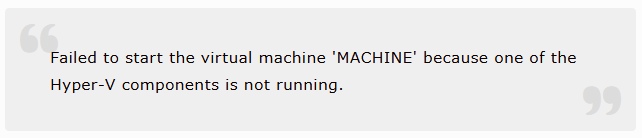

## はじめに

今回の記事では、**WordPress の引用ブロックに表示される引用符を消す**方法について紹介します。

できるだけ WordPress のテーマはいじりたくないこともあり、**カスタマイズの「追加CSS」から何とかする方法**をまとめました。

まず、 WordPress の引用ブロックの引用符はこんな感じで、通常ボックスの左上と右下に表示されます。



この引用符を消す方法は、「追加CSS」画面で、次の CSS コードを追記するだけです。

``` css
blockquote::before {
    display: none;
}

blockquote::after {
    display: none;
}
```

たったこれだけで簡単に引用符が消えてくれます。  
以上、簡単ですが備忘録でした。