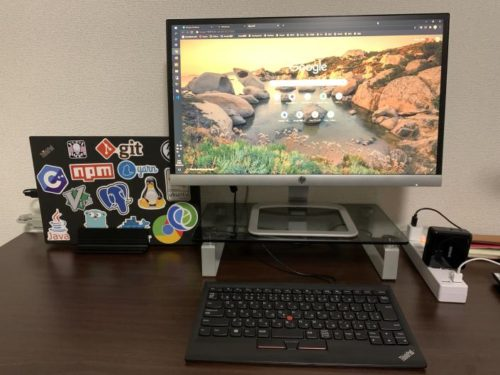

今回は、**ACアダプタの接続をトリガーにして、シャットダウン中のPCを自動起動できるBIOS設定の方法**についてまとめます。

僕は自宅で作業をする時は、画像の左のように、スペース確保のためのノートPCスタンドを利用しています。

しかし、画像のとおり**PCは常時閉じた状態で使用しているため、起動のときにPCを開くのが非常に手間**です。  
そのため、**BIOSの設定を変更して、ノートPCにACアダプタを接続したときに自動で起動する**ようにしたことでこの手間を解消しています。

## BIOSの設定方法 

設定方法はとても簡単。

BIOSを起動したら（起動方法はPCによって異なります）「Restore after AC Power Loss」の設定項目を探します。

PCによって違う可能性はありますが、多分以下の場所にあるかと思います。

`Setting > Advanced > Power Management Setup > Restore after AC Power Loss`

上記の設定項目を見つけたら、**設定値を「Enable」に変更**します。  
これで、**PCがシャットダウンされた状態でACアダプタを接続すると、PCが自動的に起動する**ようになります。

ちなみに、**ACアダプタを接続した状態でPCをシャットダウンしても、勝手に再起動されることはありません**ので、安心して使用できます。  
※再度起動したい時はACアダプタを抜き差しすればOK

## Surfaceではできない 

とはいえ、PCによっては上記の設定ができないものがあります。

僕は、手持ちのSurfaceLaptopで上記の自動起動設定ができずに、結局諦めました。  
理由としては、Surfaceの場合は、SurfaceUEFIというUEFIを使用しているものの、UEFIの画面から上記の設定が変更できないためです。

また、後述する方法で「automatic power-on after power loss」を有効化しても、ハードウェアの電源管理の仕様上、電源を抜き差ししてもPCは起動しないようです。

詳しくは以下のページにも書かれていますが、コメントをしている方々と同じように、「automatic power-on after power loss」を有効化してもPCは起動できませんでした。

[surface pro の UEFIの項目、「automatic power-on after power loss」について](https://social.technet.microsoft.com/Forums/ja-JP/82ebce30-d76d-46c0-8ca6-26f10fd415f1/surface-pro-12398-uefi1239838917304461228912300automatic-poweron-after-power?forum=win10itprogeneralJP)

## SurfaceUEFIの構成変更方法 

結果としてSurfaceでは自動起動の設定は有効になりませんでしたが、せっかくなのでSurfaceUEFIの構成を変更する方法についてまとめておきます。

SurfaceUEFIは、**「Microsoft Surface UEFI Manager」**を利用して設定を変更することができます。

[Microsoft Endpoint Configuration Manager を使用して SEMM (Surface) でデバイスを管理する - Surface | Microsoft Docs](https://docs.microsoft.com/ja-jp/surface/use-system-center-configuration-manager-to-manage-devices-with-semm)

「Microsoft Surface UEFI Manager」は、上記のドキュメントからダウンロードサイトにアクセスできます。  
証明書は、WSLのopensslを利用して作成したオレオレ証明書のpfxファイルを利用しました。

オレオレ証明書の作成は以下の記事を参考にしました。  
[opensslでオレオレ証明書（pfxファイル）を作成した話 - Qiita](https://qiita.com/ttoori-ttoori/items/f756a1baabda6359995d)

また、作成したオレオレ証明書をWindowsの証明書ストアにインポートする方法は以下の記事を参考にしました。  
[自己署名証明書の信頼設定のための Windows 構成](https://docs.lansa.com/14/ja/lansa018/content/lansa/webserviceseng01_0380.htm)

## まとめ 

Surfaceでは設定が有効にできませんでしたが、メイン機として使っているThinkPadでは有効にでき、快適に使えています。

非常に便利なので、ノートPCを閉じたまま使われている方はぜひ試してみてください。
