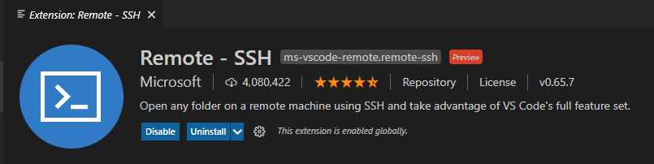
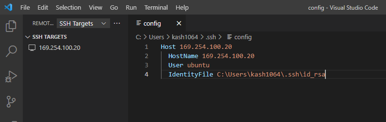
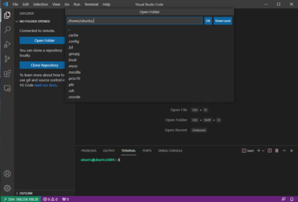

最近はWSL2上でDockerも使えますし、仮想マシンのLinux上でわざわざ開発を行うという機会も少なくなりました。

とはいえ、今でも時々仮想マシンとして構築したLinux環境の上で開発を行いたい時があります。

特に必要がなければ、リソース節約のためにもLinux環境はできればCUIで構築したいところですが、もしCUIで構築すると、VSCodeのようなリッチなエディタが使えなくなってしまいます。

そんな問題を解決するために、今回はホストのWindows にインストールされているVSCodeから、仮想マシン上のUbuntuのファイルを操作して開発を行えるようにするための環境構築についてまとめます。

具体的には、以下のステップで設定できます。

1. ローカル環境にLinuxの仮想マシンを作成（今回はHyper-Vを使用）
2. 仮想マシンとホストマシンのSSH接続が可能な環境を用意する
3. Windows ホストマシンで鍵を用意
4. 仮想マシンのauthorized_keysに、作成した公開鍵を登録
5. ホストマシンのVSCodeのRemoteSSH拡張を使い、仮想マシンにSSH接続

今回は、1~2の設定については割愛します。

<!-- omit in toc -->
## もくじ

- [Windows 上でSSH接続用の鍵を用意する](#windows-上でssh接続用の鍵を用意する)
- [公開鍵を仮想マシンに登録](#公開鍵を仮想マシンに登録)
- [VSCodeから仮想マシンに接続](#vscodeから仮想マシンに接続)
- [まとめ](#まとめ)

## Windows 上でSSH接続用の鍵を用意する

それではさっそく、ホストマシンのWindows上で鍵を作成します。

PowerShellを起動し、`ssh-keygen.exe`を実行するだけです。

``` powershell
ssh-keygen.exe

Generating public/private rsa key pair.
Enter file in which to save the key (C:\Users\kash1064/.ssh/id_rsa):
Enter passphrase (empty for no passphrase):
Enter same passphrase again:
Your identification has been saved in C:\Users\kash1064/.ssh/id_rsa.
Your public key has been saved in C:\Users\kash1064/.ssh/id_rsa.pub.
The key fingerprint is:
SHA256:tE/q/DCfasd3vyVQzn7/lzgq5i79k+asip3LPNafwvWE kash1064@HEQET-01
The key's randomart image is:
+---[RSA 3072]----+
|                 |
|                 |
|        .        |
|       . .       |
|        S . +    |
|         + + * . |
|        + * A D .|
|       *o*+M.* *.|
|      ..*VXA@vv+*|
+----[SHA256]-----+
```

作成した公開鍵は通常、ユーザフォルダの`.ssh/`直下に配置されます。

## 公開鍵を仮想マシンに登録

次に、作成した公開鍵をLinuxマシンの`.ssh/authorized_keys`に追記します。

普通にvimなどでコピペすればOKです。

登録が完了したら、以下のコマンドをPowerShellから実行して、秘密鍵を使ったSSH接続が可能なことを確認します。

``` powershell
ssh <仮想マシンのユーザ名>@<仮想マシンのアドレス> -i .\.ssh\id_rsa
```

## VSCodeから仮想マシンに接続

最後に、VSCodeから仮想マシンへの接続をセットアップします。

まずは、VSCodeにRemoteSSH拡張をインストールします。



次に、サイドバーからRemoteSSHのアイコンを選択して、SSH Targetに作成した仮想マシンのアドレスを設定します。

このときに作成されるconfigファイルの設定を、以下の画像のように設定します。



`IdentifyFile`には、先ほど作成したキーペアの秘密鍵のパスを指定します。

これを設定しないと、接続時に毎回仮想マシンのパスワードを要求されるので少し手間になります。

設定が完了したら、`Connect Remote Host`ボタンをクリックすると、新しいウィンドウが起動し、仮想マシンのファイルをVSCodeから直接操作ができるようになります。



## まとめ

今さら記事にする話ではないのですが、便利なのに意外と使っていない方が多いようなのでまとめてみました。

ぜひ活用してみてください。

