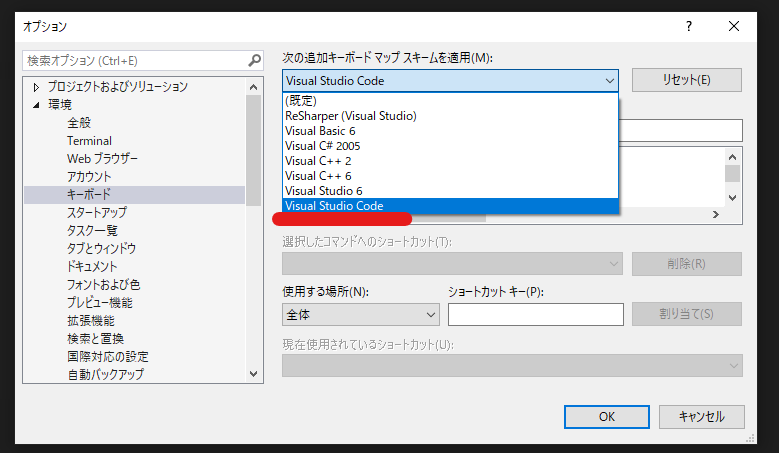

VisualStudioとVSCodeのそれぞれで開発を行うときに、キーバインドの差異にストレスを感じることがあります。

僕は大半の開発はVSCodeで行っているので、何とかしてVisualStudio側のキーバインドをVSCodeに合わせたいと思いました。

## VisualStudioのキーバインドを変更する方法

まずは上部のナビゲーションバーから、[ツール]>[オプション]を開きます。

次に左のタブから[環境]>[キーボード]の設定を開きます。

ここで任意のショートカットキーを操作に割り当てすることができます。

VisualStudioでVSCodeの標準と同じキーバインドを利用する場合は、[次の追加キーボードマップスキームを適用]の設定で[Visual Studio Code]を選択します。

参考：[Identify and customize keyboard shortcuts - Visual Studio (Windows) | Microsoft Docs](https://docs.microsoft.com/en-us/visualstudio/ide/identifying-and-customizing-keyboard-shortcuts-in-visual-studio?view=vs-2022)

## VSCodeのキーバインドをVisualStudioの標準にする方法

MS公式がメンテナンスしている以下の拡張機能をVSCodeにインストールすることで、VSCode側のキーバインドをVisualStudioに合わせることができます。

参考：[Visual Studio Keymap for Visual Studio Code](https://github.com/microsoft/vscode-vs-keybindings)

他にも、AtomやSublimeTextなど、いくつかのエディタに対応したキーバインドを設定するための拡張機能があります。

参考：[Search · org:microsoft keybindings](https://github.com/search?q=org%3Amicrosoft+keybindings)

## まとめ

これでVisualStudioでの開発もストレスフリーになりました。
