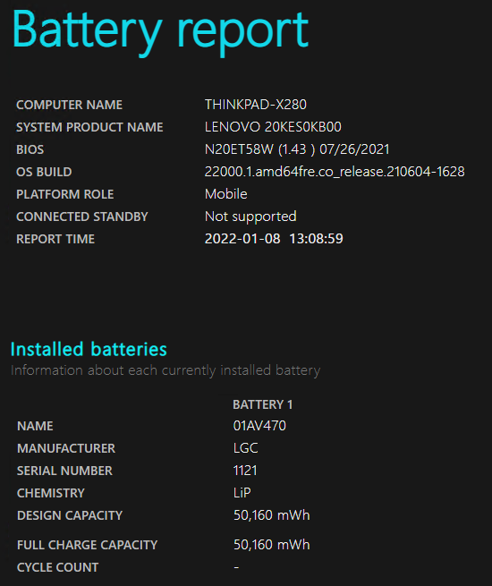
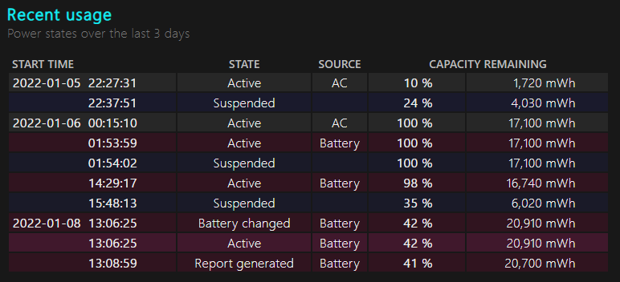
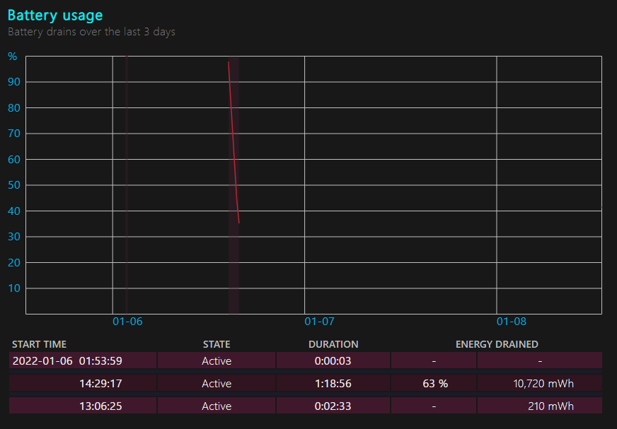
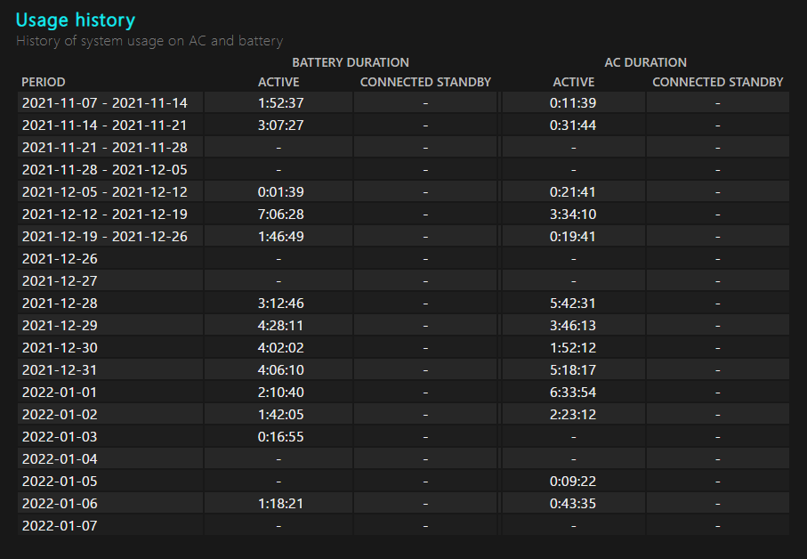
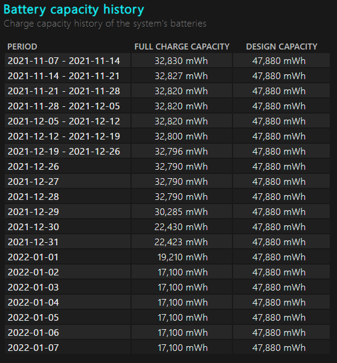
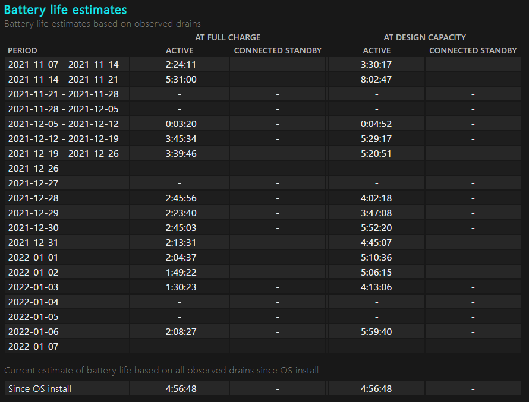
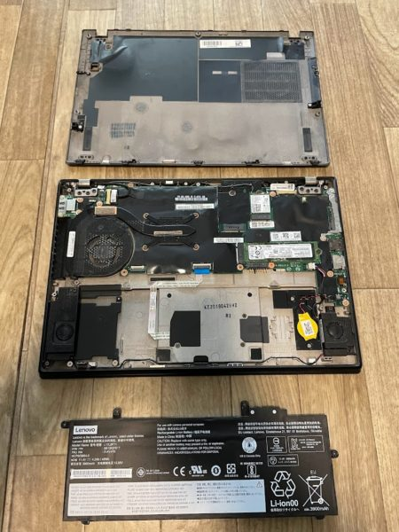

今回は、約4年ほど使用している[ThinkPad X280](https://www.lenovo.com/jp/ja/notebooks/thinkpad/x-series/ThinkPad-X280/p/22TP2TX2800)のバッテリー交換を行ったので、その方法についてまとめておきます。


実際の交換方法は、「内蔵バッテリの無効化→外す→付ける」という作業だけで、5分程度で完了します。

詳しくは記事の下の方に書きます。

<!-- omit in toc -->
## もくじ
- [バッテリの限界](#バッテリの限界)
- [Windowsでバッテリの容量を確認する](#windowsでバッテリの容量を確認する)
  - [バッテリの情報と最大容量を確認](#バッテリの情報と最大容量を確認)
  - [直近のバッテリ使用状況](#直近のバッテリ使用状況)
  - [バッテリの使用状況](#バッテリの使用状況)
  - [バッテリの劣化時期を特定する](#バッテリの劣化時期を特定する)
  - [バッテリ駆動時間の予測](#バッテリ駆動時間の予測)
- [バッテリを交換する](#バッテリを交換する)
  - [バッテリ交換の手順](#バッテリ交換の手順)
  - [内蔵バッテリの無効化](#内蔵バッテリの無効化)
  - [背面カバーの取り外し](#背面カバーの取り外し)
  - [バッテリの取り外し](#バッテリの取り外し)
  - [バッテリ設置](#バッテリ設置)
  - [確認](#確認)
- [まとめ](#まとめ)

## バッテリの限界

バッテリの交換方法について書く前に、交換に至った経緯について記録しておきます。

現在使っているX280は、`Intel(R) Core(TM) i7-8550U CPU`と`RAM 16GB`の構成で約10万円ほどで購入し、2022年1月8日時点でおよそ4年間使用してきました。

高い耐久性を持つ筐体は、外出時にはほぼ毎回持ち歩いていたにもかかわらずほとんど傷もなく、キーボードもマメに掃除していたおかげか非常に綺麗な状態のままでした。

スペックも購入当時に選択可能だった中では一番上のものを選んだおかげで、まだまだ現役で使える状態でした。

しかし、2021年の年末ごろから突然、外でPC作業をしていると、バッテリ残量が30%を切ったあたりから急激に減少し、15分程度で電源が切れてしまう事象が発生するようになりました。

そのため、電源に接続しない状態での稼働時間は2時間程度しかなく、少々不便さを感じていました。

実際のところ、外出時は以下のような30W以上の出力の充電器や、25W出力のモバイルバッテリ(25Wあれば、ThinkPad x280は低速ですが充電可能です)が手放せない状態でした。

参考：[Anker PowerPort III 2-Port 65W (USB PD 充電器 USB-C 2ポート)](https://amzn.to/3F0m3OE)

参考：[Anker PowerCore 10000 PD Redux 25W（モバイルバッテリー 10000mAh 大容量 ）](https://amzn.to/3q4D5qs)

## Windowsでバッテリの容量を確認する

Windowsを使用している場合、管理者権限でコマンドプロンプトを起動し、`powercfg/batteryreport`を実行することで、バッテリレポートが`C:/WINDOWS/system32/battery-report.html`に生成されます。

``` powershell
# 管理者権限でコマンドプロンプトを起動
powercfg/batteryreport
```

このレポートには、以下のような情報が含まれます。

### バッテリの情報と最大容量を確認

まずは基本的な情報が確認できます。



バッテリの劣化具合を確認したいときは、[DESIGN CAPACITY]と[FULL CHARGE CAPACITY]を確認します。

[DESIGN CAPACITY]はバッテリの理論的な最大容量であり、[FULL CHARGE CAPACITY]は実際に充電したときの最大容量です。

画像はバッテリ交換後のものであるため、[DESIGN CAPACITY]と[FULL CHARGE CAPACITY]の値は同じですが、バッテリが劣化している場合は、[FULL CHARGE CAPACITY]の値が小さくなります。

実際に交換前のバッテリの[FULL CHARGE CAPACITY]は[DESIGN CAPACITY]の30%くらいまで減少していました。

### 直近のバッテリ使用状況

続いて、過去3日間のバッテリの使用状況を確認できます。





1/6の記録がバッテリ交換前のログですが、14:29にほぼフル充電だった状態から、約1時間30分程度で一気に35%まで残量が減っていたことがわかります。

### バッテリの使用状況

さらに、もう少し長期間のバッテリの使用状況も確認することができます。



[BATTERY DURATION]は、バッテリで稼働していた時間、[AC DURATION]は電源に接続して稼働していた時間を示しています。

### バッテリの劣化時期を特定する

次に、バッテリ容量の変化も確認することができます。



上記の画像だと、バッテリの劣化を感じるようになった2021年の年末ごろから、急激に[FULL CHARGE CAPACITY]が減少していることがわかります。

理由は不明ですが、寿命でしょうか。

### バッテリ駆動時間の予測

最後に、バッテリ稼働時間の予測が出力されます。



大体90分から2時間程度の予測になっており、体感とも一致しています。

## バッテリを交換する

というわけで、理由は不明ながらThinkPadのバッテリがかなり劣化していることがわかったので、交換を行いました。

交換品のバッテリは残念ながら純正のものが手に入らなかったため、Amazonで互換品を購入しました。

参考：[【NOTEPARTS】レノボ ThinkPad A285 X280 用 バッテリー 01AV470 01AV471 01AV472対応](https://amzn.to/32TiQDF)

購入時の価格は7,980円でした。

品質は正直使ってみないとわかりませんが、購入日から1年間の品質保証とPSEマークがついていたのでさすがに発火とかはないかと思ってます。

### バッテリ交換の手順

ThinkPad x280のバッテリ交換の手順は非常に簡単です。

大体5分程度で完了しました。

大まかな流れとしては以下の流れで実施します。

- 内蔵バッテリの無効化
- 背面カバーの取り外し
- バッテリの取り外し
- バッテリ設置

それぞれの手順は、Lenovo公式が出してる動画を見れば完璧にわかります。

何なら簡単すぎて動画見なくてもわかります。

参考：[取り付け、取り外し動画 - ThinkPad X280 (20KE, 20KF) - Lenovo Support JP](https://support.lenovo.com/jp/ja/solutions/ht510682-removal-and-replacement-videos-thinkpad-x280-20ke-20kf)

### 内蔵バッテリの無効化

まずは内蔵バッテリを無効化します。

これは、ThinkPadのパーツを取り外すときは必ず行います。

うっかりやり忘れても即故障とはならないですが(実体験)必ず無効化するようにしましょう。

手順は簡単で、BIOSをF1ボタンで起動したら、[Config]>[Power]に進み、内蔵バッテリの無効化を選択するだけです。

これで自動的にPCの電源が切れ、パーツを取り外せるようになります。

詳細は前述した動画の[内蔵バッテリーの無効化]の項をみてください。

### 背面カバーの取り外し

割愛します。

ネジを外せばOKです。

他のモデルのThinkPadだと、背面を外す際にツメを外すための道具が必要な場合があるのですが、X280は特に道具は不要で、簡単に取り外しができます。

### バッテリの取り外し

ネジを外して、バッテリを「上」に向かって引き上げます。

動画の[内蔵バッテリー の取り外し]を見ると一発でわかります。

取り外し後はこんな感じになります。



### バッテリ設置

取り外しの逆をやります。

純正のよりはめ込みが若干緩くなってしまったので少々不安がありましたが、特に問題はなさそうでした。

### 確認

最後に電源を投入し、バッテリレポートからバッテリの状態を確認したら完了です。

これでThinkPad x280が延命できました。

## まとめ

4年ほど使ってきたX280のバッテリを換装して延命しました。

これからもまだまだ現役で使えそうです。

(最近ThinkPad X1 nano gen2が気になってるけど・・・）