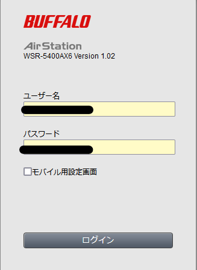
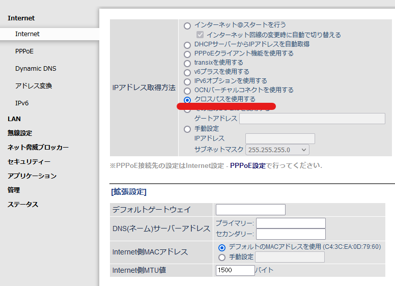
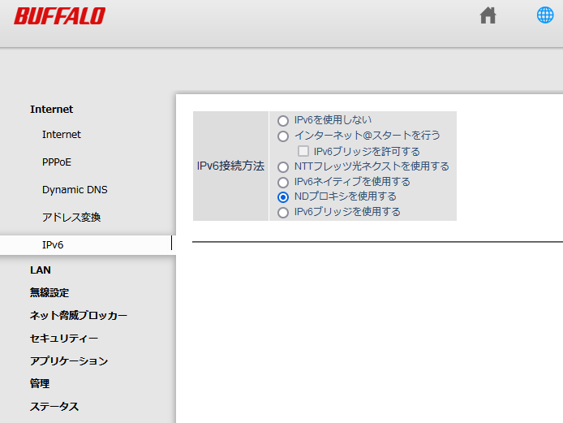

楽天ひかりの回線が急に激重になったのでIPv6接続を有効化しました。

この記事ではバッファローのルータ[WSR-5400AX6](https://amzn.to/3qSUW40)を使って設定しています。

（たぶんバッファローの家庭用ルータなら大体同じ設定になるはず。。）

<!-- omit in toc -->
## もくじ
- [経緯](#経緯)
- [楽天ひかりでIPv6接続を有効にする方法](#楽天ひかりでipv6接続を有効にする方法)
  - [クロスパスを有効化する](#クロスパスを有効化する)
  - [NDプロキシを有効化する](#ndプロキシを有効化する)
  - [NDプロキシとは](#ndプロキシとは)
- [まとめ](#まとめ)
- [追記(2022年1月28日)](#追記2022年1月28日)
  - [改善されたこと](#改善されたこと)
  - [改悪されたこと](#改悪されたこと)

## 経緯

だいたい半年前(2020年9月ごろ)から楽天ひかりを契約しています。

リモートワークメインになり、自宅で安定した回線が欲しいと思っていたのと、ちょうど一年間の無料キャンペーン中だったこともあり、楽天ひかりを契約しました。

賃貸なので、壁に穴を空ける工事が不要で開通可能だったというのも大きな理由でした。

申し込みのための電話がいつまで待ってもつながらなかったり、申し込みから開通まで2か月ほどかかったりと若干の不満はあったものの、開通後は常時[Fast.com](https://fast.com/ja/)の計測値で200~400Mbps程度の速度(IPv4、有線接続時)が安定してでており、非常に快適に使えていました。

僕の環境では、IPv6の知識が乏しく、適切な設定ができる自信がなかったのと、IPv4接続のみでも十分満足できる回線速度がでていたことから、ルータの設定でIPv6接続を無効化した上で、インターネット側からのすべてのIPv6接続を拒否する設定を行っていました。

しかし、2022年の1月18日ごろから急に接続が遅くなりました。

具体的には、日中は75Mbps程度、夜間帯は2~8Mbps程度にまで回線速度が落ちてしまいました。(いずれもIPv4、有線接続時の[Fast.com](https://fast.com/ja/)の計測値)

モデム、ルータ、OSの再起動など一通り試したものの状況が改善しなかったため、通信速度改善のためにIPv6接続を有効化することとしました。

## 楽天ひかりでIPv6接続を有効にする方法

楽天ひかりの回線は、アルテリアネットワークスのサービスを利用しています。

そのため、楽天ひかり回線でIPv6によるインターネット接続を有効化するためには、アルテリアネットワークスが提供しているクロスパスという仕組みを使う必要があります。

参考：[ブロードバンドアクセス（クロスパス） | アルテリア・ネットワークス株式会社](https://www.arteria-net.com/business/service/internet/line/flets/)

クロスパス機能を有効化するためには、ルータがクロスパス設定に対応している必要があります。

バッファロールータでクロスパスに対応しているルータ・ファームウェアバージョンは、以下のリンクから確認できます。

参考：[IPv6(IPoE/IPv4 over IPv6)対応確認済みリスト | バッファロー](https://www.buffalo.jp/support/other/network-ipv6.html)

[WSR-5400AX6](https://amzn.to/3qSUW40)の場合は現行最新のファームウェアVer.1.02以降のバージョンでの対応になるので、必要に応じてファームウェアのバージョンアップを実施します。

設定コンソールのログイン画面に1.02以上のバージョンが表示されていればOKです。

### クロスパスを有効化する

クロスパスの設定方法は非常に簡単です。

ルータの管理コンソールから、詳細設定を開いて、[Internet]から以下の画面の設定を有効化します。

もし[IPアドレス取得方法]の設定が表示されず、「IPアドレス取得方法は「インターネット＠スタートを行う」が設定されています」とだけ表示されている場合は、ルータ本体の背面にあるスイッチが[Manual]ではなく[Auto]に設定されています。

その場合はルータの背面のスイッチを[Manual]に設定してください。

これでインターネット接続時にIPv6接続が有効化されます。

IPv6インターネット接続が有効化されているかは、以下のサイトのヘッダに[via IPv6]と表示されているかどうかで確認することができます。

参考：[IPv6対応サービス | アルテリア・ネットワークス株式会社](https://www.arteria-net.com/company/csr/ipv6/)

続いて、IPv6使用時のNDプロキシ設定を確認していきます。

### NDプロキシを有効化する

IPv6は、IPv4と異なりNATを経由したIPマスカレードが行われません。

そのため、ルータの設定によってはインターネット側から家庭内ネットワークのホストにダイレクトでアクセスすることが簡単にできるようになってしまいます。

基本的にプライベートな運用を想定している家庭内ネットワークの端末にインターネットからアクセス可能な状態はセキュリティ的に好ましくないため、IPv4で一般的に利用しているNATのセキュリティ上の恩恵は非常に大きいことがわかります。

今回はIPv6インターネット接続を有効化するため、インターネット側からネットワーク内の端末にアクセスできないようにします。

このような環境の実装のため、ルータの設定にてNDプロキシを有効化します。

設定は以下のように行います。

これでインターネット側から家庭内ネットワークの端末に直接接続することができなくなります。

なお、家庭用ルータでは、デフォルトでIPv6接続設定が「IPv6パススルー(IPv6ブリッジ)」という設定が有効になっているものがあるようですが、この設定が有効にされている場合はインターネット側から内部ネットワークの端末にダイレクトでアクセスすることができます。

外部からアクセスしたいなどの特別な理由がなければNDプロキシを有効化しておくのがよさそうです。

### NDプロキシとは

NDプロキシはRFC4389で定義されており、RA内のPビットを1にすることができる仕様があります。

NDプロキシが設定されている場合、IPv6アドレスに対する通信は、一度ルータを経由することになります。

この仕様によって、インターネットからホストへの直接のアクセスを防ぐことができるようになります。

参考：[NDプロキシとIPv6パススルー：IPv6設定解説 - YouTube](https://www.youtube.com/watch?v=2lgmpHxd1fE)

参考：[インターネット用語1分解説～RA (Router Advertisement; ルータ広告)とは～ - JPNIC](https://www.nic.ad.jp/ja/basics/terms/ra.html)

参考：[IPv6ならネットから直接アクセスできる？　試して確かめよう【イニシャルB】 - INTERNET Watch](https://internet.watch.impress.co.jp/docs/column/shimizu/1163817.html)

## まとめ

IPv6インターネット接続を有効化したことで、8Mbps前後だった回線速度が300Mbpsくらいに戻り、快適なインターネット環境が帰ってきました。

今後も回線が安定してくれると嬉しいですね。。

というわけで、「光回線を使ってるけどなんか最近遅い」という方はぜひ一度IPv6設定を確認してみるといいかなと思います。

正直セキュリティ面ではまだ若干不安があるので、ホスト側のファイアウォール設定をおろそかにしないとか、ネットワーク監視の方法を検討するなどは今後やっていきたいと思います。

## 追記(2022年1月28日)

この設定を有効化してからちょうど一週間くらい経ちましたので、気づいたことをメモしておこうと思います。

### 改善されたこと

現在においても、通信速度は[Fast.com](https://fast.com/ja/)の計測値で200~400Mbps程度の速度(有線接続時)が安定して出ており快適に使用することができています。

また、嬉しい誤算としては、無線接続端末でも、[Fast.com](https://fast.com/ja/)の計測値で200~300Mbps程度の速度が出るようになりました。

IPv4のみで利用していた時は、有線接続しているマシンの回線速度は高速だったものの、無線接続している端末は10~30Mbps程度の速度しか出ていませんでした。

ルータの性能が悪いのかとも思っていたのですが、メイン環境は有線で高速に動作していたので、ルータの買い替えなどは行っていませんでした。

今回IPv6設定を有効化したことで図らずも無線接続端末の通信速度も高速になり、特にスマホのページ読み込みなどが劇的に改善しました。

(理由は不明ですが。。。)

### 改悪されたこと

バッファロールータの「ゲストポート機能」が使えなくなりました。

どうやらゲストポート機能はIPv6に対応しておらず、クロスパス設定を実施している環境ではインターネット接続ができないようです。(IPv4に自動的に切り替えてくれるとありがたいのですが。)